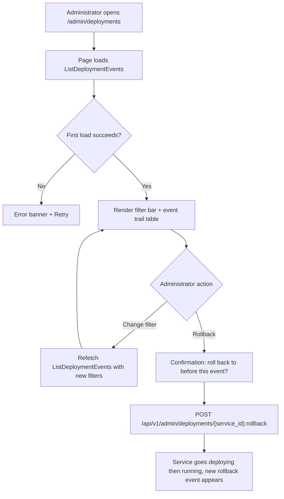
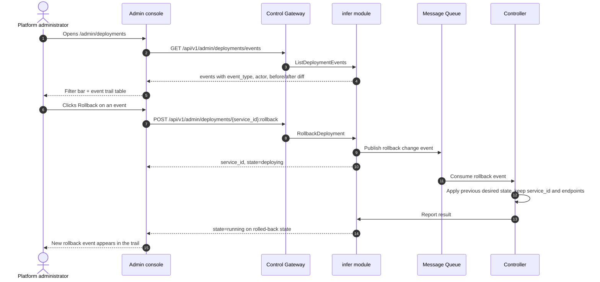

# Deployment History & Audit — Requirement Analysis and UI/UX Design

| Attribute | Content |
| --- | --- |
| Feature point | Deployment history & audit — deployment audit trail (create/update/scale/rollback events) with timestamps, actor, and diff, plus rollback from history (backlog row 34) |
| Document scope | Requirement analysis, competitive research, the admin-surface deployment-history page for `/admin/deployments`, the page → API surface table, and numbered acceptance criteria |
| Owning modules | `infer` (deployment-event trail over the inference-service lifecycle, the diff computation, and the rollback-from-history RPC), `audit` (read-only: the general audit spine this feature's deployment trail complements), `web` admin console (`DeploymentHistoryPage`), `controller` (read-only: reconcile a rollback event) |
| Related documents | [Architecture Design](./architecture.md) — §2.4 `infer`, §2.7 Controller, §4.2 one-click deployment flow · [Model Catalog & One-Click Deployment](./model-catalog-deployment.md) — the inference-service lifecycle and the change-event structure · [Audit Logging & Activity Export](./audit-logging.md) — the general control-plane audit spine this feature's deployment trail complements · [Model Versioning & Rollback](./model-versioning.md) — the sibling rollback surface (version-level) this feature extends to the deployment level · [Console Surface Separation](./console-surface-separation.md) — the two surfaces, the `AdminShell` conventions, the masked-projection rule |
| Status | Design complete, handed to the Architect agent |

---

## 1. Background and Competitive Research

### 1.1 Why Deployment History and Audit Come Now

go-taas runs inference services as Kubernetes Deployments (model-catalog-deployment §4.2) and already records every control-plane mutation in the general audit spine (`audit_events`, feature #15). What the console still cannot answer is the deployment-specific question: *what happened to this inference service over its life?* The general audit log records `infer.service.create` / `infer.service.scale` / `infer.service.delete` events, but it does not carry a **diff** (what exactly changed — replicas 2→4, version A→B) and it does not offer **rollback from history** (revert a service to a previous desired state). The operator must reconstruct the change from the audit metadata and manually re-apply it.

This feature adds a **deployment history & audit** surface: a per-service deployment audit trail (create/update/scale/rollback events) with timestamps, actor, and diff, plus rollback from history. It is the smallest independently valuable increment of Phase 4's operations surface: it turns "the service changed" into "replica count went 2→4 at 14:03 by `admin@example.com`, and I can roll it back to the previous state in one click".

### 1.2 How Comparable Products Implement Deployment History and Rollback

| Product | Deployment history | Diff | Rollback from history | Notable pitfalls |
| --- | --- | --- | --- | --- |
| **Kubernetes rollout** | `kubectl rollout history` shows revision history of a Deployment | `kubectl rollout history --revision=N` shows the full spec of a revision | `kubectl rollout undo` reverts to a previous revision | CLI-only; diff is a full spec dump, not a field-level diff; no actor attribution |
| **AWS CodeDeploy** | Deployment history with status, time, and target | Deployment configuration and revision per deployment | Redeploy a previous revision | Heavyweight; per-deployment config is verbose |
| **GitHub Actions** | Workflow run history with status, actor, and time | Step-level logs and changed files | Re-run a previous workflow | Not a deployment audit trail; no field-level diff |
| **Argo Rollouts** | Rollout history with revisions and status | Per-revision spec | Rollback to a previous revision | Kubernetes-native; operator-orchestration internals leak |
| **Heroku** | Release history with version, actor, and time | Release diff (config, slug) | Roll back to a previous release | Release-centric, not deployment-centric; diff is coarse |
| **Datadog Deployments** | Deployment events with actor and time | Change summary | No direct rollback | Third-party SaaS; no field-level diff |

### 1.3 Distilled Patterns and Decisions

Patterns worth adopting:

1. **A per-service deployment event trail** — Kubernetes rollout history and Heroku releases both show a chronological list of deployment events with version/revision, actor, and time. The trail is the anchor for "roll back to this".
2. **A field-level diff** — the operator needs to see *what changed* (replicas 2→4, version A→B), not a full spec dump. A compact before/after diff is the actionable summary.
3. **Rollback from history** — Kubernetes `rollout undo` and Heroku's rollback both revert to a previous state; the console offers a one-click rollback to a selected historical state.
4. **Actor attribution** — every event carries who performed it (user or system), so the operator can attribute a change.

Pitfalls to avoid:

- **Leaking operator-orchestration internals** (Kubernetes, Argo) — the console must not expose pod names, revision numbers, or Deployment specs; it shows the service and a field-level diff (feature #17's masked-projection rule).
- **A full-spec diff** (Kubernetes `rollout history --revision`) — a full spec dump is not actionable; the diff must be field-level (replicas, model/version, image, accelerator, card type).
- **No actor attribution** (Kubernetes) — every event must carry the actor so a change is attributable.
- **Rollback without a guard** — rolling back is a destructive change to a live service; it must be confirmable and warn that Agents on the endpoints will see the change.

**Decisions for go-taas** (recorded rationale, per the autonomous-decision rule):

| # | Decision | Rationale |
| --- | --- | --- |
| D1 | **Deployment history lives on the admin surface only**: `/admin/deployments` + `/api/v1/admin/deployments/*`. There is **no end-user surface** — deployment internals are operator-orchestration (feature #17's masked-projection rule); tenants consume the service's endpoints, not its deployment history | The operator needs the deployment trail to audit and roll back; tenants need the endpoint, not the internals. Consistent with the admin-only accelerator inventory (feature #18) and system status (feature #30) |
| D2 | **A new `deployment_events` table** records the inference-service lifecycle trail (create/update/scale/rollback), each event with `service_id`, `event_type`, `actor`, `before`/`after` (the field-level diff), and `created_at`. It is written by the `infer` module on every lifecycle mutation, complementing (not replacing) the general `audit_events` spine | The general audit log (feature #15) records the mutation but not the field-level diff; a deployment-specific trail with before/after is the actionable history the operator needs. It is a separate table with its own lifecycle, mirroring how `audit_events` is separate from `request_logs` |
| D3 | **The diff is field-level** — each event carries `before`/`after` for the mutable spec fields (replicas, model/version, image, accelerator, card type, autoscaling policy). The console renders a compact before/after diff, not a full spec dump | A field-level diff is actionable (pattern 2); a full spec dump is not (pitfall) |
| D4 | **A new `ListDeploymentEvents` RPC** returns the trail for a service (or across services), filtered by event type, actor, and time range, with the field-level diff per event | The page needs the trail with diffs; a dedicated RPC keeps the deployment-history concern out of the general audit surface |
| D5 | **A new `RollbackDeployment` RPC** reverts a service to a selected historical state (the `before` of a chosen event), keeping the same `service_id` and endpoints; the service goes through `deploying` then back to `running` | "Roll back from history" means the same endpoint serves the previous desired state; delete+recreate would change the `service_id` and break Agents. The Controller reconciles the rollback event by applying the previous desired state |
| D6 | **Rollback is confirmable and guarded** — the console shows a confirmation dialog naming the target state and warning that Agents on the endpoints will see the change; rollback is disabled for a service in a state that cannot be updated (e.g. `terminated`) | Rollback is a destructive change to a live service (pitfall); a guard prevents accidental rollback and a warning sets expectations |
| D7 | **The deployment trail is read-only except for rollback** — the page writes nothing except the rollback action; it is reachable only by authenticated admin sessions | The trail is a pure record of lifecycle events; the only mutation is the deliberate rollback (D5). No new audit events are needed beyond the rollback itself |

### 1.4 Scope Boundary

**In scope**: a deployment-history page (per-service or cross-service event trail with timestamps, actor, and field-level diff), the deployment-event trail RPC, and rollback-from-history.

**Out of scope** (tracked by other feature points): the general control-plane audit log and export (#15), request-level traces (#27), model version-level rollback (#32), the inference service logs viewer (#33), and canary/blue-green upgrades.

---

## 2. User Roles

| Role | Description | Interaction with deployment history |
| --- | --- | --- |
| **Platform administrator** | The operator who runs the go-taas cluster and manages inference services | Views the deployment event trail, reads field-level diffs, and rolls a service back to a previous state |
| **Agent / SDK** | The programmatic consumer that calls `/v1/chat/completions` | Never touches deployment history; consumes the service's endpoints through the gateway with an API Key |

> Terminology: the consumer-side caller is called an **Agent** (English) / 「智能体」(Chinese), consistent with the repo convention. This feature is admin-only, so the consumer-side terminology does not apply to a tenant surface.

---

## 3. User Stories

| # | As a… | I want to… | So that… |
| --- | --- | --- | --- |
| US1 | Platform administrator | open a service and see its deployment event trail with timestamps and actors | I can audit what happened to the service over its life |
| US2 | Platform administrator | see a field-level diff for each event | I know exactly what changed (replicas, version, image) without a full spec dump |
| US3 | Platform administrator | filter the trail by event type, actor, and time range | I can focus on scale events or a specific actor |
| US4 | Platform administrator | roll a service back to a previous state from its history | I can revert a bad change in one click without recreating the service |
| US5 | Platform administrator | see a confirmation before rolling back | I don't accidentally revert a live service |
| US6 | Agent / SDK | call a deployed model through its endpoint with my API Key | I get completions from whatever state the operator has set, without knowing about deployment history |

---

## 4. Functional Requirements

### FR1 — Deployment event trail

- **FR1.1** `ListDeploymentEvents` (`GET /api/v1/admin/deployments/events`) returns the deployment event trail, newest first, each event with `service_id`, `service_name`, `event_type` (`create` / `update` / `scale` / `rollback` / `delete`), `actor` (user id or `system`), `before`/`after` (the field-level diff), and `created_at`.
- **FR1.2** The RPC accepts filters: `service_id` (optional), `event_type` (optional), `actor` (optional), and a time range. An unknown `service_id` returns 10301 `CodeInferServiceNotFound`.
- **FR1.3** The `before`/`after` diff covers the mutable spec fields: `replicas`, `model_version`, `image_id`, `accelerator`, `accelerator_type`, and `autoscaling` (the effective policy). Fields unchanged between `before` and `after` are omitted.

### FR2 — Rollback from history

- **FR2.1** `RollbackDeployment` (`POST /api/v1/admin/deployments/{service_id}:rollback`) reverts a service to a selected historical state (the `before` of a chosen event), keeping the same `service_id` and endpoints; the service goes through `deploying` then back to `running`.
- **FR2.2** The request carries the target `event_id` (the event whose `before` is the rollback target). An unknown `service_id` returns 10301; an unknown `event_id` returns a not-found error; a service in a state that cannot be updated (e.g. `terminated`) returns 10303 `CodeInferServiceStateInvalid`.
- **FR2.3** A rollback itself is recorded as a new `rollback` event in the trail, with the `before`/`after` diff from the current state to the rolled-back state.

### FR3 — Filtering and pagination

- **FR3.1** The page offers filters for **event type** (All / Create / Update / Scale / Rollback / Delete), **actor**, and **time range** (the shared preset control: 24 h / 7 d / 30 d / custom). Changing a filter refetches the trail.
- **FR3.2** The trail is paginated (`offset`/`limit`, default 20, max 100).

---

## 5. Page and Flow Design

### 5.1 Surface Assignment

| Feature | Surface | Web route | API prefix |
| --- | --- | --- | --- |
| Deployment event trail | admin | `/admin/deployments` | `/api/v1/admin/deployments/events` |
| Rollback from history | admin | `/admin/deployments` (dialog) | `/api/v1/admin/deployments/{service_id}:rollback` |

Every page and API call above is on the **admin surface**; there is no end-user surface (D1). Admin pages never call a `/api/v1/*` route, and the admin session realm is used throughout.

### 5.2 Page Map

| Page / component | Purpose |
| --- | --- |
| **Deployment History page** (`/admin/deployments`) | Deployment event trail with timestamps, actors, and field-level diffs; filters, pagination, and rollback-from-history action |

### 5.3 Page: `/admin/deployments` — Deployment History (admin)

**Purpose**: give the platform administrator a single surface to audit an inference service's deployment history — view the event trail with timestamps, actors, and field-level diffs, and roll a service back to a previous state.

**Surface**: admin — route `/admin/deployments`, API `/api/v1/admin/deployments/*`.

**Layout**: rendered inside `AdminShell` (feature #17). A page header ("Deployment History", subtitle "Inference service lifecycle events") with a **Refresh** action (secondary). Below:

1. **Filter bar** — a **Service** dropdown (optional, from the inference-services list), an **Event type** dropdown (All / Create / Update / Scale / Rollback / Delete), an **Actor** box (optional), and a **Time range** control (the shared preset: 24 h / 7 d / 30 d / custom).
2. **Event trail table** — columns: **Time** (created_at), **Service** (name), **Event** (type badge), **Actor**, **Diff** (a compact before/after summary, e.g. "replicas 2 → 4"), **Actions** (Rollback, when the event's `before` is a valid rollback target).

**Interactive states**:

| State | Behaviour |
| --- | --- |
| Default | Filter bar + event trail table render from the first successful load |
| Loading | Skeleton table; Refresh is disabled |
| Empty | "No deployment events in this window." with a hint to widen the time range or clear filters; the filter bar stays visible |
| Error | An error banner with the message and a Retry button; the page keeps its last good data with a "Showing stale data" banner |
| Disabled | Refresh is disabled while a load is in flight; Rollback is disabled on events whose `before` is not a valid rollback target (e.g. the service is `terminated`) |
| Permission-denied | A session without the required role receives 10036 and the page shows the standard permission-denied state (feature #17) with a link back to the admin home |

**Event trail table columns**: Time, Service, Event (type badge), Actor, Diff (compact before/after), Actions (Rollback). Sortable by Time. Filterable by event type, actor, and time range. Paginated (`offset`/`limit`, default 20, max 100).

**Rollback confirmation dialog**: "Roll `<service>` back to the state before this event? The diff is `
`. Agents calling this service's endpoints will see the change." with **Cancel** (secondary) and **Roll back** (primary). On success the service goes through `deploying` then `running`, and a new `rollback` event appears in the trail.

### 5.4 Flows

---

## 6. API Surface Implications

The deployment-history RPCs belong to the **`infer` module** (D2, D4, D5), served as HTTP via the Control Gateway on the **admin prefix** `/api/v1/admin/deployments/*` (D1). The `deployment_events` table is written by the `infer` module on every lifecycle mutation (D2). There is **no user-prefix binding** (D1).

| RPC | Route | Prefix | Status | Purpose |
| --- | --- | --- | --- | --- |
| `ListDeploymentEvents` (`taas.infer.v1`) | `GET /api/v1/admin/deployments/events` | admin | **new** | Deployment event trail with field-level diffs, filtered and paginated |
| `RollbackDeployment` (`taas.infer.v1`) | `POST /api/v1/admin/deployments/{service_id}:rollback` | admin | **new** | Revert a service to a previous state in place (D5) |

**Contract notes for the Architect agent**:

1. `ListDeploymentEvents` returns `events[]`, each with `service_id`, `service_name`, `event_type` (`create` / `update` / `scale` / `rollback` / `delete`), `actor`, `before`/`after` (the field-level diff), and `created_at`; it accepts `service_id`, `event_type`, `actor`, and time-range filters (FR1.1, FR1.2).
2. The `before`/`after` diff covers `replicas`, `model_version`, `image_id`, `accelerator`, `accelerator_type`, and `autoscaling`; unchanged fields are omitted (FR1.3).
3. `RollbackDeployment` takes a target `event_id`, reverts the service to that event's `before` state, keeps `service_id` and endpoints, and publishes a rollback change event to the message queue; the service transitions `running → deploying → running` (D5, FR2.1).
4. A rollback is recorded as a new `rollback` event with the current→rolled-back diff (FR2.3).
5. Wire conventions unchanged: HTTP 200 on success, business errors as `{"code": <int>, "message": "..."}`, int64 fields serialized as JSON strings.

Error codes (existing blocks, `pkg/errors/codes.go`):

| Condition | Code | Constant | Notes |
| --- | --- | --- | --- |
| Unknown `service_id` | 10301 | `CodeInferServiceNotFound` | `ListDeploymentEvents`, `RollbackDeployment` |
| Service state not updatable | 10303 | `CodeInferServiceStateInvalid` | `RollbackDeployment` on e.g. `terminated` (FR2.2) |
| Unknown `event_id` | 10304 | `CodeInferEndpointNotFound` | Reused for an unknown deployment event (FR2.2) |
| Invalid time range | 10404 | `CodeRequestLogRangeInvalid` | Reused — the metering range contract (FR1.2) |

---

## 7. Acceptance Criteria

| # | Criterion | Level |
| --- | --- | --- |
| AC1 | `ListDeploymentEvents` returns the deployment event trail newest first, each event with `service_id`, `service_name`, `event_type`, `actor`, `before`/`after` diff, and `created_at`; an unknown `service_id` returns 10301 | FVT |
| AC2 | The `before`/`after` diff covers `replicas`, `model_version`, `image_id`, `accelerator`, `accelerator_type`, and `autoscaling`, omitting unchanged fields | FVT |
| AC3 | `RollbackDeployment` reverts a service to the target event's `before` state, keeps `service_id` and endpoints, transitions `running → deploying → running`, and records a new `rollback` event; an unknown `service_id` returns 10301, an unknown `event_id` returns 10304, and a `terminated` service returns 10303 | FVT |
| AC4 | The `/admin/deployments` page renders the filter bar and the event trail table from the first successful load, with event-type badges, actors, and compact diffs | E2E |
| AC5 | Changing the event-type, actor, or time-range filter refetches the trail; the event-type filter shows only matching events | E2E |
| AC6 | Clicking Rollback shows a confirmation dialog naming the service and the diff; confirming calls `RollbackDeployment` and a new `rollback` event appears in the trail | E2E |
| AC7 | Rollback is disabled on events whose `before` is not a valid rollback target (e.g. the service is `terminated`) | E2E |
| AC8 | The deployment-history page is reachable only on the admin surface: route `/admin/deployments`, every API call uses the `/api/v1/admin/deployments/*` prefix with no `/api/v1/*` string | E2E (surface separation) |
| AC9 | A session without the required role receives 10036 on the deployment-history page and the page shows the standard permission-denied state | E2E |

---

## 8. Out of Scope (tracked elsewhere)

| Item | Where |
| --- | --- |
| General control-plane audit log and export | Feature #15 audit logging |
| Request-level traces and latency breakdown | Feature #27 request tracing |
| Model version-level rollback | Feature #32 model versioning & rollback |
| Inference service logs viewer | Feature #33 service logs viewer |
| Canary / blue-green upgrades | Future feature point |
| A user-realm deployment-history surface | Deliberately absent (D1) — tenants consume the endpoint, not the deployment internals |
