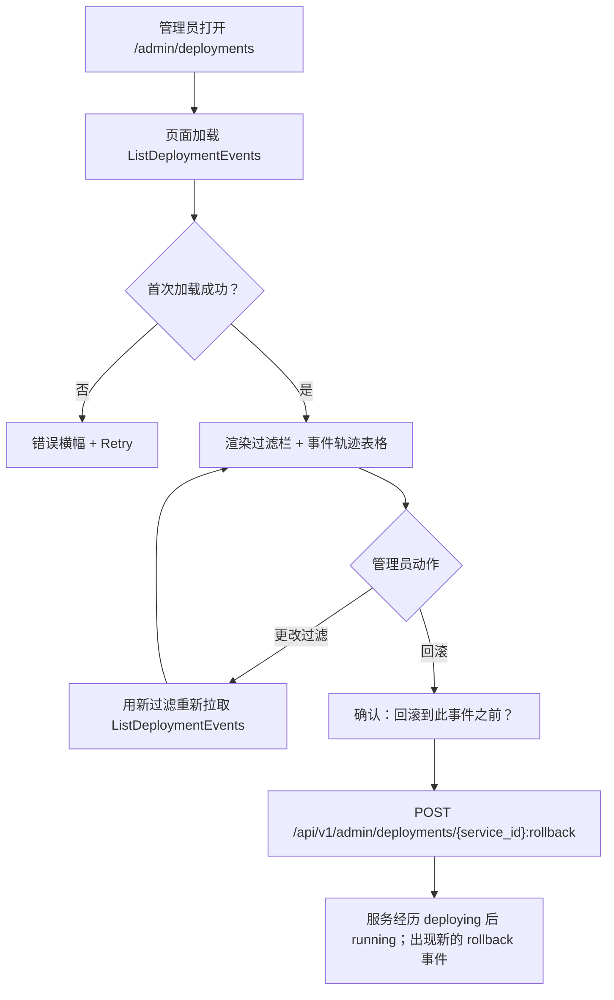
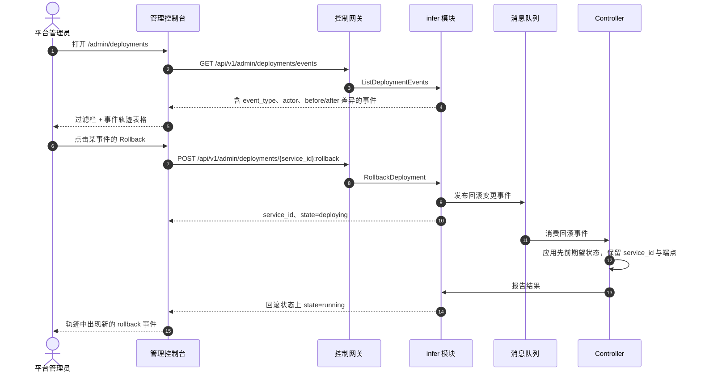

# 部署历史与审计 — 需求分析与 UI/UX 设计

| 属性 | 内容 |
| --- | --- |
| 特性点 | 部署历史与审计 — 部署审计轨迹（创建/更新/扩缩容/回滚事件）含时间戳、操作者与差异，并支持从历史回滚（backlog 第 34 行） |
| 文档范围 | 需求分析、竞品调研、`/admin/deployments` 管理面部署历史页、页面 → API 面映射表，以及编号验收标准 |
| 归属模块 | `infer`（推理服务生命周期上的部署事件轨迹、差异计算与从历史回滚 RPC）、`audit`（只读：本特性的部署轨迹所补充的通用审计主干）、`web` 管理控制台（`DeploymentHistoryPage`）、`controller`（只读：调和回滚事件） |
| 相关文档 | [架构设计](./architecture.md) — 第 2.4 节 `infer`、第 2.7 节 Controller、第 4.2 节一键部署流程 · [模型目录与一键部署](./model-catalog-deployment.md) — 推理服务生命周期与变更事件结构 · [审计日志与活动导出](./audit-logging.md) — 本特性的部署轨迹所补充的通用控制面审计主干 · [模型版本管理与回滚](./model-versioning.md) — 本特性扩展到部署层的姊妹回滚面（版本级）· [控制台面分离](./console-surface-separation.md) — 两个面、`AdminShell` 约定、掩码投影规则 |
| 状态 | 设计完成，已移交架构师代理 |

---

## 1. 背景与竞品调研

### 1.1 为什么现在做部署历史与审计

go-taas 将推理服务作为 Kubernetes Deployment 运行（model-catalog-deployment §4.2），并已在通用审计主干（`audit_events`，特性 #15）中记录每个控制面变更。控制台仍然无法回答部署特定的问题：*这个推理服务在其生命周期内发生了什么？* 通用审计日志记录 `infer.service.create` / `infer.service.scale` / `infer.service.delete` 事件，但它不携带**差异**（到底改了什么 —— 副本 2→4、版本 A→B），也不提供**从历史回滚**（把服务恢复到先前期望状态）。运营者必须从审计元数据重建变更并手动重新应用。

本特性新增**部署历史与审计**面：按服务的部署审计轨迹（创建/更新/扩缩容/回滚事件）含时间戳、操作者与差异，并支持从历史回滚。这是 Phase 4 运维面中最小可独立交付的增量：它把「服务变了」变成「副本数在 14:03 由 `admin@example.com` 从 2 变为 4，我可以一键回滚到先前状态」。

### 1.2 竞品如何实现部署历史与回滚

| 产品 | 部署历史 | 差异 | 从历史回滚 | 主要陷阱 |
| --- | --- | --- | --- | --- |
| **Kubernetes rollout** | `kubectl rollout history` 显示 Deployment 的修订历史 | `kubectl rollout history --revision=N` 显示某修订的完整 spec | `kubectl rollout undo` 回退到先前修订 | 仅 CLI；差异是完整 spec 转储而非字段级差异；无操作者归属 |
| **AWS CodeDeploy** | 部署历史含状态、时间与目标 | 每次部署的配置与修订 | 重新部署先前修订 | 过重；每次部署配置冗长 |
| **GitHub Actions** | 工作流运行历史含状态、操作者与时间 | 步骤级日志与变更文件 | 重新运行先前工作流 | 非部署审计轨迹；无字段级差异 |
| **Argo Rollouts** | 含修订与状态的 Rollout 历史 | 每修订 spec | 回滚到先前修订 | Kubernetes 原生；泄漏运营者编排内部信息 |
| **Heroku** | 含版本、操作者与时间的发布历史 | 发布差异（配置、slug） | 回滚到先前发布 | 以发布为中心而非部署；差异较粗 |
| **Datadog Deployments** | 含操作者与时间的部署事件 | 变更摘要 | 无直接回滚 | 第三方 SaaS；无字段级差异 |

### 1.3 提炼出的模式与决策

值得采纳的模式：

1. **按服务的部署事件轨迹** — Kubernetes rollout 历史与 Heroku 发布都展示带版本/修订、操作者与时间的部署事件时间线。轨迹是「回滚到它」的锚点。
2. **字段级差异** — 运营者需要看到*改了什么*（副本 2→4、版本 A→B），而非完整 spec 转储。紧凑的前后差异是可操作的摘要。
3. **从历史回滚** — Kubernetes `rollout undo` 与 Heroku 的回滚都恢复到先前状态；控制台提供对所选历史状态的一键回滚。
4. **操作者归属** — 每个事件携带执行者（用户或系统），让运营者能归属变更。

需要避免的陷阱：

- **泄漏运营者编排内部信息**（Kubernetes、Argo）— 控制台不得暴露 Pod 名、修订号或 Deployment spec；它显示服务与字段级差异（特性 #17 的掩码投影规则）。
- **完整 spec 差异**（Kubernetes `rollout history --revision`）— 完整 spec 转储不可操作；差异必须是字段级（副本、模型/版本、镜像、加速器、卡型）。
- **无操作者归属**（Kubernetes）— 每个事件必须携带操作者，使变更可归属。
- **无防护的回滚** — 回滚是对在线服务的破坏性变更；它必须可确认，并警告端点上的智能体会看到变更。

**go-taas 的决策**（依据自主决策规则记录理由）：

| # | 决策 | 依据 |
| --- | --- | --- |
| D1 | **部署历史仅存在于管理面**：`/admin/deployments` + `/api/v1/admin/deployments/*`。**无终端用户面** — 部署内部信息是运营者编排（特性 #17 的掩码投影规则）；租户消费服务端点，而非其部署历史 | 运营者需要部署轨迹来审计与回滚；租户需要端点，而非内部信息。与仅管理面的加速器清单（特性 #18）与系统状态（特性 #30）一致 |
| D2 | **新增 `deployment_events` 表**记录推理服务生命周期轨迹（创建/更新/扩缩容/回滚），每个事件带 `service_id`、`event_type`、`actor`、`before`/`after`（字段级差异）与 `created_at`。它由 `infer` 模块在每次生命周期变更时写入，补充（而非取代）通用 `audit_events` 主干 | 通用审计日志（特性 #15）记录变更但不记录字段级差异；带前后差异的部署特定轨迹才是运营者需要的可操作历史。它是独立表，有自己的生命周期，正如 `audit_events` 独立于 `request_logs` |
| D3 | **差异是字段级** — 每个事件携带可变规格字段（replicas、model_version、image_id、accelerator、accelerator_type、autoscaling）的 `before`/`after`。控制台渲染紧凑的前后差异，而非完整 spec 转储 | 字段级差异可操作（模式 2）；完整 spec 转储不可操作（陷阱） |
| D4 | **新增 `ListDeploymentEvents` RPC** 返回某服务（或跨服务）的轨迹，按事件类型、操作者与时间范围过滤，每个事件带字段级差异 | 页面需要带差异的轨迹；专用 RPC 把部署历史关注点从通用审计面中分离出来 |
| D5 | **新增 `RollbackDeployment` RPC** 将服务恢复到所选历史状态（所选事件的 `before`），保留同一 `service_id` 与端点；服务经历 `deploying` 后回到 `running` | 「从历史回滚」意味着同一端点服务先前期望状态；删除后重建会改变 `service_id` 并破坏智能体。Controller 通过应用先前期望状态来调和回滚事件 |
| D6 | **回滚可确认且有防护** — 控制台显示确认对话框，点名目标状态并警告端点上的智能体会看到变更；对无法更新的状态（如 `terminated`）禁用回滚 | 回滚是对在线服务的破坏性变更（陷阱）；防护防止误回滚，警告设定预期 |
| D7 | **部署轨迹除回滚外只读** — 页面除回滚动作外不写任何东西；它仅对已认证的管理会话可达 | 轨迹是对生命周期事件的纯记录；唯一变更是刻意的回滚（D5）。除回滚本身外无需新增审计事件 |

### 1.4 范围边界

**范围内**：部署历史页（按服务或跨服务的事件轨迹，含时间戳、操作者与字段级差异）、部署事件轨迹 RPC、从历史回滚。

**范围外**（由其他特性点跟踪）：通用控制面审计日志与导出（#15）、请求级追踪（#27）、模型版本级回滚（#32）、推理服务日志查看器（#33）、灰度/蓝绿升级。

---

## 2. 用户角色

| 角色 | 描述 | 与部署历史的交互 |
| --- | --- | --- |
| **平台管理员** | 运维 go-taas 集群并管理推理服务的运营者 | 查看部署事件轨迹、读取字段级差异、将服务回滚到先前状态 |
| **智能体 / SDK** | 调用 `/v1/chat/completions` 的程序化消费方 | 从不接触部署历史；经网关持 API Key 消费服务端点 |

> 术语：消费侧调用方在英文中为 **Agent**，中文为「智能体」，与仓库约定一致。本特性仅管理面，因此消费侧术语不适用于租户面。

---

## 3. 用户故事

| # | 作为… | 我想要… | 以便… |
| --- | --- | --- | --- |
| US1 | 平台管理员 | 打开服务查看其部署事件轨迹（时间戳与操作者） | 我能审计服务在其生命周期内发生了什么 |
| US2 | 平台管理员 | 查看每个事件的字段级差异 | 我确切知道改了什么（副本、版本、镜像），无需完整 spec 转储 |
| US3 | 平台管理员 | 按事件类型、操作者与时间范围过滤轨迹 | 我能聚焦扩缩容事件或特定操作者 |
| US4 | 平台管理员 | 从历史把服务回滚到先前状态 | 我能一键撤销坏变更，无需重建服务 |
| US5 | 平台管理员 | 回滚前看到确认 | 我不会误回滚在线服务 |
| US6 | 智能体 / SDK | 用我的 API Key 通过端点调用已部署的模型 | 我获得运营者设置的任何状态的补全结果，无需了解部署历史 |

---

## 4. 功能需求

### FR1 — 部署事件轨迹

- **FR1.1** `ListDeploymentEvents`（`GET /api/v1/admin/deployments/events`）返回部署事件轨迹，最新在前，每个事件带 `service_id`、`service_name`、`event_type`（`create` / `update` / `scale` / `rollback` / `delete`）、`actor`（用户 id 或 `system`）、`before`/`after`（字段级差异）与 `created_at`。
- **FR1.2** RPC 接受过滤：`service_id`（可选）、`event_type`（可选）、`actor`（可选）与时间范围。未知 `service_id` 返回 10301 `CodeInferServiceNotFound`。
- **FR1.3** `before`/`after` 差异覆盖可变规格字段：`replicas`、`model_version`、`image_id`、`accelerator`、`accelerator_type` 与 `autoscaling`（有效策略）。`before` 与 `after` 之间未变的字段被省略。

### FR2 — 从历史回滚

- **FR2.1** `RollbackDeployment`（`POST /api/v1/admin/deployments/{service_id}:rollback`）将服务恢复到所选历史状态（所选事件的 `before`），保留同一 `service_id` 与端点；服务经历 `deploying` 后回到 `running`。
- **FR2.2** 请求携带目标 `event_id`（其 `before` 为回滚目标的事件）。未知 `service_id` 返回 10301；未知 `event_id` 返回 not-found 错误；无法更新的状态（如 `terminated`）返回 10303 `CodeInferServiceStateInvalid`。
- **FR2.3** 回滚本身作为新的 `rollback` 事件记录在轨迹中，带从当前状态到回滚状态的 `before`/`after` 差异。

### FR3 — 过滤与分页

- **FR3.1** 页面提供**事件类型**（All / Create / Update / Scale / Rollback / Delete）、**操作者**与**时间范围**（共享预设控件：24 小时 / 7 天 / 30 天 / 自定义）过滤。更改过滤会重新拉取轨迹。
- **FR3.2** 轨迹分页（`offset`/`limit`，默认 20，最大 100）。

---

## 5. 页面与流程设计

### 5.1 面分配

| 特性 | 面 | Web 路由 | API 前缀 |
| --- | --- | --- | --- |
| 部署事件轨迹 | admin | `/admin/deployments` | `/api/v1/admin/deployments/events` |
| 从历史回滚 | admin | `/admin/deployments`（对话框） | `/api/v1/admin/deployments/{service_id}:rollback` |

以上每个页面与 API 调用都位于**管理面**；无终端用户面（D1）。管理面页面从不调用 `/api/v1/*` 路由，全程使用管理会话域。

### 5.2 页面地图

| 页面 / 组件 | 目的 |
| --- | --- |
| **部署历史页**（`/admin/deployments`） | 含时间戳、操作者与字段级差异的部署事件轨迹；过滤、分页与从历史回滚动作 |

### 5.3 页面：`/admin/deployments` — Deployment History（管理面）

**目的**：给平台管理员一个单一面来审计推理服务的部署历史 — 查看含时间戳、操作者与字段级差异的事件轨迹，并将服务回滚到先前状态。

**面**：admin — 路由 `/admin/deployments`，API `/api/v1/admin/deployments/*`。

**布局**：在 `AdminShell`（特性 #17）内渲染。页面头部（「Deployment History」，副标题「Inference service lifecycle events」）带 **Refresh** 动作（次要）。下方：

1. **过滤栏** — **Service** 下拉（可选，来自推理服务列表）、**Event type** 下拉（All / Create / Update / Scale / Rollback / Delete）、**Actor** 框（可选）与 **Time range** 控件（共享预设：24 小时 / 7 天 / 30 天 / 自定义）。
2. **事件轨迹表格** — 列：**Time**（created_at）、**Service**（名称）、**Event**（类型徽章）、**Actor**、**Diff**（紧凑前后摘要，如「replicas 2 → 4」）、**Actions**（Rollback，当事件的 `before` 是有效回滚目标时）。

**交互状态**：

| 状态 | 行为 |
| --- | --- |
| 默认 | 过滤栏 + 事件轨迹表格从首次成功加载渲染 |
| 加载中 | 骨架表格；Refresh 禁用 |
| 空 | 「No deployment events in this window.」并提示加宽时间范围或清除过滤；过滤栏保持可见 |
| 错误 | 错误横幅带消息与 Retry 按钮；页面保留最后的好数据并显示「Showing stale data」横幅 |
| 禁用 | 加载进行中 Refresh 禁用；`before` 不是有效回滚目标（如服务 `terminated`）的事件上 Rollback 禁用 |
| 权限拒绝 | 无所需角色的会话收到 10036，页面显示标准权限拒绝状态（特性 #17）带返回管理首页的链接 |

**事件轨迹表格列**：Time、Service、Event（类型徽章）、Actor、Diff（紧凑前后）、Actions（Rollback）。可按 Time 排序。可按事件类型、操作者、时间范围过滤。分页（`offset`/`limit`，默认 20，最大 100）。

**回滚确认对话框**：「将 `<service>` 回滚到此事件之前的状态？差异为 `
`。调用此服务端点的智能体会看到变更。」带 **Cancel**（次要）与 **Roll back**（主要）。成功后服务经历 `deploying` 后 `running`，轨迹中出现新的 `rollback` 事件。

### 5.4 流程

---

## 6. API 面影响

部署历史 RPC 属于 **`infer` 模块**（D2、D4、D5），经控制网关以 HTTP 提供，位于**管理前缀** `/api/v1/admin/deployments/*`（D1）。`deployment_events` 表由 `infer` 模块在每次生命周期变更时写入（D2）。**无用户前缀绑定**（D1）。

| RPC | 路由 | 前缀 | 状态 | 目的 |
| --- | --- | --- | --- | --- |
| `ListDeploymentEvents`（`taas.infer.v1`） | `GET /api/v1/admin/deployments/events` | admin | **新增** | 含字段级差异的部署事件轨迹，可过滤与分页 |
| `RollbackDeployment`（`taas.infer.v1`） | `POST /api/v1/admin/deployments/{service_id}:rollback` | admin | **新增** | 将服务原位恢复到先前状态（D5） |

**给架构师代理的契约说明**：

1. `ListDeploymentEvents` 返回 `events[]`，每个带 `service_id`、`service_name`、`event_type`（`create` / `update` / `scale` / `rollback` / `delete`）、`actor`、`before`/`after`（字段级差异）与 `created_at`；它接受 `service_id`、`event_type`、`actor` 与时间范围过滤（FR1.1、FR1.2）。
2. `before`/`after` 差异覆盖 `replicas`、`model_version`、`image_id`、`accelerator`、`accelerator_type` 与 `autoscaling`；未变字段被省略（FR1.3）。
3. `RollbackDeployment` 接受目标 `event_id`，将服务恢复到该事件的 `before` 状态，保留 `service_id` 与端点，并向消息队列发布回滚变更事件；服务经历 `running → deploying → running`（D5、FR2.1）。
4. 回滚作为新的 `rollback` 事件记录，带当前→回滚状态的差异（FR2.3）。
5. 线上约定不变：成功 HTTP 200，业务错误为 `{"code": <int>, "message": "..."}`，int64 字段序列化为 JSON 字符串。

错误码（既有块，`pkg/errors/codes.go`）：

| 条件 | 码 | 常量 | 说明 |
| --- | --- | --- | --- |
| 未知 `service_id` | 10301 | `CodeInferServiceNotFound` | `ListDeploymentEvents`、`RollbackDeployment` |
| 服务状态不可更新 | 10303 | `CodeInferServiceStateInvalid` | `RollbackDeployment` 对如 `terminated`（FR2.2） |
| 未知 `event_id` | 10304 | `CodeInferEndpointNotFound` | 复用于未知部署事件（FR2.2） |
| 非法时间范围 | 10404 | `CodeRequestLogRangeInvalid` | 复用 — metering 范围契约（FR1.2） |

---

## 7. 验收标准

| # | 标准 | 级别 |
| --- | --- | --- |
| AC1 | `ListDeploymentEvents` 返回部署事件轨迹（最新在前），每个事件带 `service_id`、`service_name`、`event_type`、`actor`、`before`/`after` 差异与 `created_at`；未知 `service_id` 返回 10301 | FVT |
| AC2 | `before`/`after` 差异覆盖 `replicas`、`model_version`、`image_id`、`accelerator`、`accelerator_type` 与 `autoscaling`，省略未变字段 | FVT |
| AC3 | `RollbackDeployment` 将服务恢复到目标事件的 `before` 状态，保留 `service_id` 与端点，经历 `running → deploying → running`，并记录新的 `rollback` 事件；未知 `service_id` 返回 10301，未知 `event_id` 返回 10304，`terminated` 服务返回 10303 | FVT |
| AC4 | `/admin/deployments` 页面从首次成功加载渲染过滤栏与事件轨迹表格，含事件类型徽章、操作者与紧凑差异 | E2E |
| AC5 | 更改事件类型、操作者或时间范围过滤会重新拉取轨迹；事件类型过滤只显示匹配事件 | E2E |
| AC6 | 点击 Rollback 显示点名服务与差异的确认对话框；确认调用 `RollbackDeployment`，轨迹中出现新的 `rollback` 事件 | E2E |
| AC7 | `before` 不是有效回滚目标（如服务 `terminated`）的事件上 Rollback 禁用 | E2E |
| AC8 | 部署历史页只在管理面可达：路由 `/admin/deployments`，每个 API 调用使用 `/api/v1/admin/deployments/*` 前缀且无 `/api/v1/*` 字符串 | E2E（面分离） |
| AC9 | 无所需角色的会话在部署历史页收到 10036，页面显示标准权限拒绝状态 | E2E |

---

## 8. 范围外（在别处跟踪）

| 项 | 位置 |
| --- | --- |
| 通用控制面审计日志与导出 | 特性 #15 审计日志 |
| 请求级追踪与延迟分解 | 特性 #27 请求追踪 |
| 模型版本级回滚 | 特性 #32 模型版本管理与回滚 |
| 推理服务日志查看器 | 特性 #33 服务日志查看器 |
| 灰度 / 蓝绿升级 | 未来特性点 |
| 用户面部署历史面 | 刻意缺失（D1）— 租户消费端点，而非部署内部信息 |
