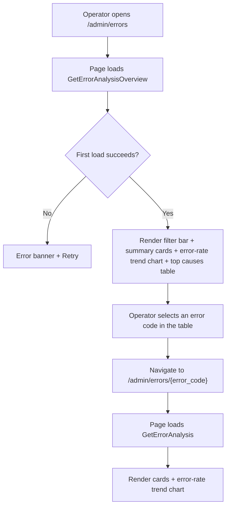
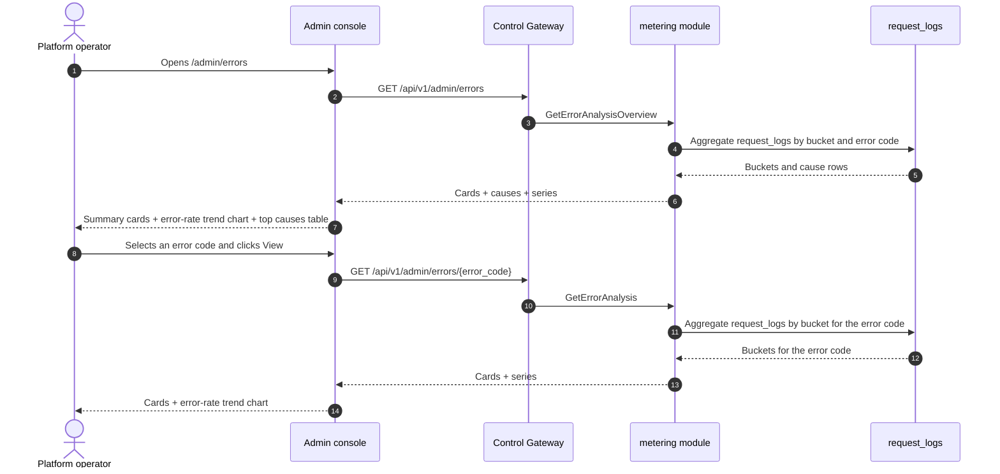

# Error Analysis — Requirement Analysis and UI/UX Design

| Attribute | Content |
| --- | --- |
| Feature point | Error analysis — aggregate error codes and rates over time, top error causes, error-rate trends, and per-error drill-down (backlog row 31) |
| Document scope | Requirement analysis, competitive research, the admin-surface error analysis page for `/admin/errors` (fleet-wide error aggregation + top causes + error-rate trend + per-error drill-down), the end-user-surface error analysis page for `/errors` (tenant-scoped error aggregation + top causes + error-rate trend + per-error drill-down), the page → API surface table, and numbered acceptance criteria |
| Owning modules | `metering` (read-only aggregation over `request_logs` for error metrics), `web` admin console (`ErrorAnalysisPage`) and end-user console (`UserErrorAnalysisPage`), `pkg/server` gateway (admin-prefix and user-prefix bindings) |
| Related documents | [Architecture Design](./architecture.md) — §2.5 `metering` · [Request Logs & API Playground](./request-logs-playground.md) — the `request_logs` table and its `status` / `error` fields this feature aggregates · [Model Observability Dashboard](./model-observability.md) — the sibling read-only aggregation over `request_logs` and its error-rate metric · [Request Tracing & Latency Breakdown](./request-tracing.md) — the sibling per-request drill-down this feature complements with error aggregation · [Console Surface Separation](./console-surface-separation.md) — the two surfaces this feature spans, the `UserShell`/`AdminShell` conventions, the masked-projection rule |
| Status | Design complete, handed to the Architect agent |

---

## 1. Background

go-taas records every inference request's metadata — latency, status, error, and token counts — in `request_logs` (feature #12), and the model observability dashboard (feature #24) aggregates error rate per model. What the console still cannot answer is the operator's and tenant's question: *what is failing, and why?* The observability dashboard shows error rate as a metric but does not break errors down by error code or cause; request logs (feature #12) show individual error rows but no aggregation; and request tracing (feature #27) drills into a single request but does not aggregate errors. There is no surface that aggregates error codes and rates over time, ranks top error causes, shows error-rate trends, and drills into a single error.

This feature adds **error analysis**: aggregate error codes and rates over time, top error causes, error-rate trends, and per-error drill-down. It is a **read-only** aggregation layer — nothing in the inference, metering, or billing pipelines changes. It is the smallest independently valuable increment of Phase 4's productionization roadmap item: it turns "errors are high" into "error rate is 5%, the top cause is `rate_limit_exceeded` at 60% of errors, and it is trending up".

### 1.1 How Comparable Products Expose Error Analysis

| Product | Error surface | Aggregation | Trends / drill-down | Notable pitfalls |
| --- | --- | --- | --- | --- |
| **Datadog Error Tracking** | Error Tracking Explorer grouping similar errors into issues | Groups thousands of errors into issues; error rate trends | Error-rate trends; issue details drill-down; monitors | Heavy agent; grouping is fingerprint-based and can over-merge |
| **Sentry** | Issues page grouping similar events into issues | Groups events by fingerprint; sort by trends/events/users | Issue details drill-down; trends sort | Third-party SaaS; grouping complexity; saved searches add surface |
| **OpenAI Platform** | Error surfaced only in per-request logs | No error aggregation | No error-rate trend | Usage lag confuses debugging; no error aggregation |
| **Langfuse** | Error rate in observability; per-trace errors | Error rate per model; no error-code aggregation | Per-trace error drill-down | Heavy third-party stack; no top-error-causes ranking |
| **Helicone** | Per-key error rate | Error rate per key | Per-key error trends | Third-party SaaS; some features gated |

### 1.2 Distilled Patterns and Decisions

Patterns worth adopting: (1) **summary cards above an error-rate trend chart and a top-causes table** — Datadog Error Tracking and Sentry lead with headline cards (error rate, error count, top cause) above an error-rate trend and a top-causes ranking, and one dashboard endpoint serving cards + series + causes avoids the N+1-call slow console (usage-dashboard D1); (2) **grouping errors into causes** — Datadog and Sentry group similar errors into issues/causes, which maps onto grouping `request_logs` by `error` code; (3) **error-rate trends** — Datadog's error-rate trend shows how the error rate evolves; (4) **top error causes** — Sentry's sort-by-events and Datadog's issue ranking answer "what is failing most"; (5) **per-error drill-down** — Sentry's issue details and Datadog's issue details drill into a single error; (6) **freshness labeling** — a data-through timestamp and a pending/partial marker, because error-lag confusion is a recorded pitfall; (7) **inline SVG charts** — the console is deliberately dependency-light (usage-dashboard D7).

Pitfalls to avoid: a blocking N+1 dashboard (the slow-console pitfall) — one endpoint returns cards + series + causes; over-merging distinct errors into one cause (the fingerprint pitfall) — group by the exact `error` code, not a fuzzy fingerprint; silently missing pending hours — the freshness marker must be explicit; heavy chart libraries in a dependency-light console; and exposing operator-orchestration internals (service ids, replica counts) to tenants — the tenant surface shows only error codes and rates.

**Decisions for go-taas**:

| # | Decision | Rationale |
| --- | --- | --- |
| D1 | **Error analysis exists on both surfaces, with a clean scope split.** The admin surface (`/admin/errors`, `/api/v1/admin/errors/*`) is a **fleet-wide error aggregation** — all errors across all orgs, with a top-causes ranking, an error-rate trend, and a per-error drill-down. The end-user surface (`/errors`, `/api/v1/errors/*`) is a **tenant-scoped error aggregation** — the tenant's own errors only, with the same ranking, trend, and drill-down, and no service ids or operator internals | The operator needs cross-org error aggregation to spot platform-wide failures; the tenant needs their own error aggregation to debug their application's requests. Splitting by surface follows feature #17's masked-projection rule: a tenant must not see operator orchestration internals, and an operator's fleet view is operator-scoped. Both surfaces share the same card, chart, and table components |
| D2 | **Errors are derived from `request_logs`** (which carry `status` and `error` per request, feature #12), aggregated server-side by error code. The metric families are **error count** (count of `status = error` rows), **error rate** (error requests ÷ total requests), and **top causes** (the `error` codes ranked by count). | `request_logs` already captures everything needed and is written alongside the voucher in the same idempotent handler (feature #12); aggregating server-side keeps the payload small and the client dependency-light |
| D3 | **One new RPC per surface shape** rather than extending `ListRequestLogs`: `GetErrorAnalysisOverview` (admin fleet: cards + top-causes ranking + error-rate trend) and `GetErrorAnalysis` (admin per-error drill-down and end-user per-error view: cards + trend for one error code). The end-user surface reuses `GetErrorAnalysis` scoped to the tenant's own errors | The error page needs several shapes at once (headline cards, a top-causes ranking, a trend); bolting them onto `ListRequestLogs` would break its established row semantics, while separate calls recreate the N+1 slow console. A dedicated pair of RPCs keeps the error concern out of the raw-log surface |
| D4 | **Time buckets adapt to the range**: hourly buckets for ranges ≤ 7 days, daily buckets for ranges > 7 days. The range is capped at **92 days** and validation reuses **10404** (the metering range contract) | Hourly granularity for short ranges shows intra-day error spikes; daily for long ranges keeps the payload small. The 92-day cap and 10404 reuse keep the range contract uniform with every metering query (usage-dashboard D6) |
| D5 | **The chart renders with inline SVG** — one bar (or line) per bucket, with a metric switcher (error count / error rate) — no new charting dependency | The console is deliberately dependency-light; a small, testable SVG component matches the usage-dashboard D7 decision |
| D6 | **Freshness is explicit**: every response carries `data_through` (the last complete bucket covered by request logs) and the console shows a "data through <time>" note plus a pending/partial marker when the selected range extends past it | Error-lag confusion is a recorded pitfall; the marker keeps the freshness story honest with zero new pipeline work |
| D7 | **The end-user surface is tenant-scoped and masked**: `GetErrorAnalysis` on the user prefix returns only the tenant's own errors, with no service ids, no replica counts, and no other tenants' data | Follows feature #17's masked-projection rule and the observability D7 pattern: tenants get their own error aggregation, not operator internals |
| D8 | **New error codes in an error-analysis block (11501–11599)**: **11501 `CodeErrorCauseNotFound`** (an unknown error code). Range validation reuses **10404** | Error analysis is a new concern (D3), so its codes live in a fresh block after the status block (114xx); distinct not-found keeps "unknown error cause" actionable, while the range contract stays uniform with metering (D4) |
| D9 | **Error analysis is read-only and audited only for access** — it writes no data and mutates nothing; the pages are reachable only by authenticated sessions with the appropriate role, and no analytics mutation is audited (there is nothing to mutate) | The feature is a pure aggregation over existing data; the audit trail (feature #15) already covers the underlying request-log writes. No new audit events are needed |

## 2. Goals and Non-goals

**Goals**: an admin page `/admin/errors` that shows fleet-wide summary cards, a top-causes ranking, an error-rate trend chart with a metric switcher, and a per-error drill-down `/admin/errors/:errorCode` (D1, D2, D3, D4, D5, D6); an end-user page `/errors` showing the tenant's own cards, ranking, trend, and a per-error drill-down `/errors/:errorCode` (D1, D7); the page → API surface table with exact prefixes (D1); per-page interactive states including empty, error, and permission-denied; numbered acceptance criteria testable in Nightwatch against the compose stack.

**Non-goals**: real-time streaming metrics (the request-log cadence stands); anomaly detection or threshold alerts (feature #26 consumes observability events in-console — out of scope here); saved custom views or dashboards; fuzzy fingerprint grouping (D2 — group by the exact `error` code); exposing service ids, replica counts, or other operator internals to tenants (D7); any change to the inference, metering, or billing pipelines (read-only feature); new audit events (D9).

## 3. Personas and Journeys

| Role | Surface | Journey |
| --- | --- | --- |
| **Platform operator** | admin | Opens `/admin/errors` → sees fleet-wide summary cards and the top-causes ranking → spots `rate_limit_exceeded` at 60% of errors → filters the trend chart to that cause → drills into `/admin/errors/rate_limit_exceeded` → sees the cause's trend → investigates the rate-limit configuration |
| **Platform operator (reliability)** | admin | A model's error rate spikes → the operator filters the error-rate trend to that model → sees the top cause → drills into request logs (feature #12) to find the failing requests |
| **Tenant developer / Agent** | end-user | Opens `/errors` → sees their own summary cards and top-causes ranking → drills into `/errors/:errorCode` → sees the cause's trend → fixes their application's error handling |
| **Tenant developer (debugging)** | end-user | An error message in their application includes an error code → opens `/errors` → sees the cause's trend → drills into the cause → reads the error details |

> Terminology: the consumer-side caller is an **Agent** in English and 「智能体」 in Chinese, consistent with the repository convention.

## 4. Feature Requirements

### FR1 — Admin fleet-wide error overview

- **FR1.1** `GetErrorAnalysisOverview` (`GET /api/v1/admin/errors`) returns the fleet-wide error analysis for a time range and optional filters: summary cards, a top-causes ranking, and an error-rate trend. It takes `since`/`until` (unix seconds; defaults `until = now`, `since = until − 24h`), `model_id` (optional), and `organization_id` (optional, via `X-Organization-Id`). `since > until` or a range > 92 days returns **10404** (D4).
- **FR1.2** The response's `cards` carry `error_count`, `request_count`, `error_rate` (derived client-side as error ÷ requests), `top_cause`, `top_cause_share_pct`, and `data_through` (the last complete bucket covered by request logs) (D2, D6).
- **FR1.3** The response's `causes[]` carry one row per error code in the range: `error_code`, `error_message`, `error_count`, `error_rate`, and `share_pct` (the cause's share of the range's total errors, derived client-side as cause count ÷ total error count). The table is sorted by `error_count` descending by default.
- **FR1.4** The response's `series[]` carry one entry per time bucket (hourly for ranges ≤ 7 days, daily otherwise, D4): `bucket` (unix seconds), `error_count`, `request_count`, `error_rate`. When an `error_code` is set, the series is for that cause; otherwise it is fleet-wide.

### FR2 — Admin per-error drill-down

- **FR2.1** `GetErrorAnalysis` (`GET /api/v1/admin/errors/{error_code}`) returns the single-error-code analysis for a time range: summary cards and an error-rate trend. It takes `since`/`until` (same defaults and 10404 range rule as FR1.1). An unknown `error_code` returns **11501 `CodeErrorCauseNotFound`** (D8).
- **FR2.2** The response's `cards` and `series[]` mirror FR1.2/FR1.4 scoped to the error code.

### FR3 — End-user error view

- **FR3.1** `GetErrorAnalysis` (`GET /api/v1/errors/{error_code}`) returns the **tenant's own** single-error-code analysis for a time range: summary cards and an error-rate trend. It takes `since`/`until` (same defaults and 10404 range rule). An unknown `error_code` returns **11501** (D8).
- **FR3.2** The response is scoped to the caller's organization (D7): it aggregates only the tenant's own `request_logs`, and exposes **no** service ids, replica counts, or other tenants' data (D7).

### FR4 — Surface and API binding

- **FR4.1** The admin error pages live on the **admin surface**: routes `/admin/errors` and `/admin/errors/:errorCode`, API prefix `/api/v1/admin/errors/*`. They are added to the `AdminShell` navigation (feature #17) as "Errors".
- **FR4.2** The end-user error pages live on the **end-user surface**: routes `/errors` and `/errors/:errorCode`, API prefix `/api/v1/errors/*`. They are added to the `UserShell` navigation (feature #17) as "Errors".
- **FR4.3** The admin pages call only `/api/v1/admin/errors/*` routes; the end-user pages call only `/api/v1/errors/*`. Neither contains the other surface's prefix string (feature #17, D1).
- **FR4.4** The end-user pages never expose operator internals (service ids, replica counts) and never aggregate other tenants' data (D7).

## 5. UI Design

### 5.1 Page: `/admin/errors` — Error Analysis (admin)

**Purpose**: give the platform operator a fleet-wide error analysis view — summary cards, a top-causes ranking, and an error-rate trend chart — to spot platform-wide failures.

**Surface**: admin — route `/admin/errors`, API `/api/v1/admin/errors/*`.

**Layout**: rendered inside `AdminShell` (feature #17). A page header ("Errors", subtitle "Error codes and rates over time") with a **Refresh** action (secondary). Below:

1. **Filter bar** — a **Time range** control (presets 24 h / 7 d / 30 d / custom with a date-time picker) and a **Model** filter (dropdown, "All models" default). Changing either refetches.
2. **Summary cards** — a row of cards: **Error rate**, **Error count**, **Request count**, **Top cause** (the top error code with its share). Each card shows the value for the selected range and model filter, with a "data through <time>" freshness note (D6).
3. **Error-rate trend chart** — an inline-SVG chart (D5) with a **metric switcher** (Error count / Error rate). One bar (or line) per bucket; when an error code is selected the series is that cause, otherwise fleet-wide.
4. **Top causes table** — the error codes with columns: **Error code** (link to the drill-down), **Error message**, **Error count**, **Error rate**, **Share**. Row action **View** opens the drill-down.

**Interactive states**:

| State | Behaviour |
| --- | --- |
| Default | Filter bar + summary cards + error-rate trend chart + top causes table render from the first successful load; last-updated shows the load time |
| Loading | Skeleton cards and table; Refresh is disabled |
| Empty | "No error data in this range." with a hint to widen the range; the filter bar stays visible |
| Error | An error banner with the message and a Retry button; the page keeps its last good data with a "Showing stale data" banner |
| Disabled | Refresh is disabled while a load is in flight; the metric switcher is disabled while a refetch is in flight |
| Permission-denied | A session without the required role receives 10036 and the page shows the standard permission-denied state (feature #17) with a link back to the admin home |

**Top causes table columns**: Error code (link), Error message, Error count, Error rate, Share. Sortable by Error count, Error rate, and Share. Filterable by the Model dropdown; paginated.

### 5.2 Page: `/admin/errors/:errorCode` — Error Detail (admin)

**Purpose**: show one error code's analysis over time — cards and an error-rate trend — so the operator can investigate a single error cause.

**Surface**: admin — route `/admin/errors/:errorCode`, API `/api/v1/admin/errors/{error_code}`.

**Layout**: a detail page under `AdminShell` with a back link to the overview. A header with the error code. Below:

1. **Filter bar** — a **Time range** control (presets 24 h / 7 d / 30 d / custom).
2. **Summary cards** — the same card set as §5.1, scoped to the error code.
3. **Error-rate trend chart** — the inline-SVG chart with the metric switcher, scoped to the error code.

**Interactive states**: identical to §5.1, with the empty copy "No error data for this cause in this range." and the not-found state for an unknown `error_code` (11501) showing the standard not-found state with a link back to the overview.

### 5.3 Page: `/errors` — Error Analysis (end-user)

**Purpose**: give a tenant developer / Agent a view of their own error analysis — summary cards, a top-causes ranking, and an error-rate trend chart — to debug their application's requests.

**Surface**: end-user — route `/errors`, API `/api/v1/errors/*`.

**Layout**: rendered inside `UserShell` (feature #17). A page header ("Errors", subtitle "Your error codes and rates over time") with a **Refresh** action (secondary). Below:

1. **Filter bar** — a **Time range** control (presets 24 h / 7 d / 30 d / custom) and a **Model** filter (dropdown, "All models" default).
2. **Summary cards** — the same card set as §5.1, scoped to the tenant's own usage (D7).
3. **Error-rate trend chart** — the inline-SVG chart with the metric switcher, scoped to the tenant's own usage.
4. **Top causes table** — the tenant's own error codes with the same columns as §5.1, scoped to the tenant's own errors.

**Interactive states**: identical to §5.1, with the empty copy "No error data in this range." and the permission-denied copy for the tenant's own errors (10005 org gone / 10017 org disabled from §8.2 of feature #17, 10027/10038 redirect per FR4.3). The page exposes no service ids or operator internals (D7).

**Top causes table columns**: identical to §5.1, scoped to the tenant's own errors. Sortable and paginated as in §5.1.

### 5.4 Page: `/errors/:errorCode` — Error Detail (end-user)

**Purpose**: give a tenant developer / Agent a view of one of their own error codes' analysis over time — cards and an error-rate trend — to debug their application's error handling.

**Surface**: end-user — route `/errors/:errorCode`, API `/api/v1/errors/{error_code}`.

**Layout**: a detail page under `UserShell` with a back link to the overview. A header with the error code. Below:

1. **Filter bar** — a **Time range** control (presets 24 h / 7 d / 30 d / custom).
2. **Summary cards** — the same card set as §5.1, scoped to the tenant's own usage of the error code (D7).
3. **Error-rate trend chart** — the inline-SVG chart with the metric switcher, scoped to the tenant's own usage.

**Interactive states**: identical to §5.2, with the empty copy "No error data for this cause in this range." and the permission-denied copy for the tenant's own errors (10005/10017 from feature #17 §8.2). The page exposes no service ids or operator internals (D7).

### 5.5 Flow

## 6. API Surface Implications

All error-analysis RPCs belong to the **`metering` module** (D3), served as HTTP via the Control Gateway. Admin routes are on the **admin prefix** `/api/v1/admin/errors/*` (D1); the end-user routes are on the **user prefix** `/api/v1/errors/*` (D1).

| RPC | Route | Prefix | Status | Purpose |
| --- | --- | --- | --- | --- |
| `GetErrorAnalysisOverview` | `GET /api/v1/admin/errors` | admin | **new** | Fleet cards + top-causes ranking + error-rate trend |
| `GetErrorAnalysis` | `GET /api/v1/admin/errors/{error_code}` · `GET /api/v1/errors/{error_code}` | admin · user | **new** | Single-error-code cards + error-rate trend (admin: any cause; user: tenant-scoped) |

**Contract notes for the Architect agent**:

1. `GetErrorAnalysisOverview` validates `since`/`until` (int64 unix seconds; defaults `until = now`, `since = until − 24h`); `since > until` or a range > 92 days returns 10404 (D4). `model_id` and `organization_id` are optional filters.
2. `GetErrorAnalysis` validates the same range contract; an unknown `error_code` returns 11501 (D8). On the user prefix it is scoped to the caller's organization (D7) and exposes no service ids or operator internals.
3. Buckets are hourly for ranges ≤ 7 days and daily otherwise (D4); each bucket carries `bucket`, `error_count`, `request_count`, `error_rate`. `error_rate` and `share_pct` are derived client-side; the wire carries integer counts only.
4. Every response carries `data_through` (the last complete bucket covered by request logs) for the freshness marker (D6).
5. Aggregation reads `request_logs` (feature #12) — `status` and `error` per request; it writes nothing (D9).
6. Wire conventions unchanged: dotted pagination where lists apply, HTTP 200 on success, business errors as `{"code": <int>, "message": "..."}`, int64 fields serialized as JSON strings.

Error codes (error-analysis block 11501–11599, `pkg/errors/codes.go`):

| Condition | Code | Constant | Notes |
| --- | --- | --- | --- |
| An unknown `error_code` | 11501 | `CodeErrorCauseNotFound` | **New** (D8) |
| A malformed or over-long range | 10404 | `CodeRequestLogRangeInvalid` | Reused (D4) — the metering range contract |
| Database / infrastructure failure | 500 | `CodeInternal` | Via error normalization |

## 7. Acceptance Criteria

| # | Criterion | Level |
| --- | --- | --- |
| AC1 | `GetErrorAnalysisOverview` with a valid range returns summary cards, a top-causes ranking, and a time-series; a range > 92 days or `since > until` returns 10404 | FVT |
| AC2 | `GetErrorAnalysisOverview` returns `causes[]` sorted by error count descending with a client-derived `share_pct` | FVT |
| AC3 | `GetErrorAnalysis` (admin) returns single-error-code cards and an error-rate trend; an unknown `error_code` returns 11501 | FVT |
| AC4 | `GetErrorAnalysis` (user) returns only the caller's organization's errors, with no service ids or operator internals | FVT |
| AC5 | Buckets are hourly for ranges ≤ 7 days and daily for ranges > 7 days; every response carries `data_through` | FVT |
| AC6 | The `/admin/errors` page renders the filter bar, summary cards, the inline-SVG error-rate trend chart, and the top causes table from the first successful load, with a last-updated timestamp | E2E |
| AC7 | Changing the time range or model filter refetches and re-renders the cards, chart, and table; the metric switcher toggles the chart metric | E2E |
| AC8 | The empty state ("No error data in this range.") renders when no data matches; a failed load keeps the last good data with a "Showing stale data" banner and a Retry action | E2E |
| AC9 | The `/admin/errors/:errorCode` page renders the error code's cards and error-rate trend chart; an unknown error code shows the not-found state | E2E |
| AC10 | The `/errors` and `/errors/:errorCode` pages render the tenant's own cards, ranking, and trend, with no service ids or operator internals visible | E2E |
| AC11 | The admin error pages are reachable only on the admin surface: routes `/admin/errors` and `/admin/errors/:errorCode`, every API call uses the `/api/v1/admin/errors/*` prefix with no `/api/v1/errors/*` string | E2E (surface separation) |
| AC12 | The end-user error pages are reachable only on the end-user surface: routes `/errors` and `/errors/:errorCode`, every API call uses the `/api/v1/errors/*` prefix with no `/api/v1/admin/*` string | E2E (surface separation) |
| AC13 | A session without the required role receives 10036 on the admin error pages and the page shows the standard permission-denied state | E2E |

## 8. Out of Scope (tracked elsewhere)

| Item | Where |
| --- | --- |
| Real-time streaming metrics | Future refinement — the request-log cadence stands |
| Anomaly detection / threshold alerts | Feature #26 consumes observability events in-console — out of scope here |
| Saved custom views / dashboards | Future refinement |
| Fuzzy fingerprint grouping | Deliberately absent (D2) — group by the exact `error` code |
| Tenant visibility of operator orchestration internals (service ids, replica counts) | Deliberately absent (D7) |
| Any change to the inference, metering, or billing pipelines | Deliberately absent — read-only feature (D9) |
| New audit events for error-analysis access | Deliberately absent — nothing to mutate (D9) |