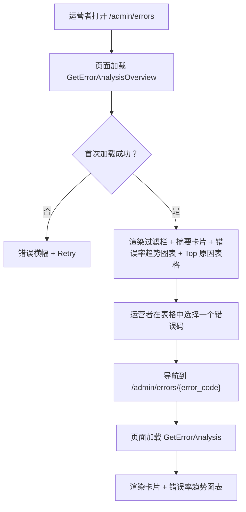
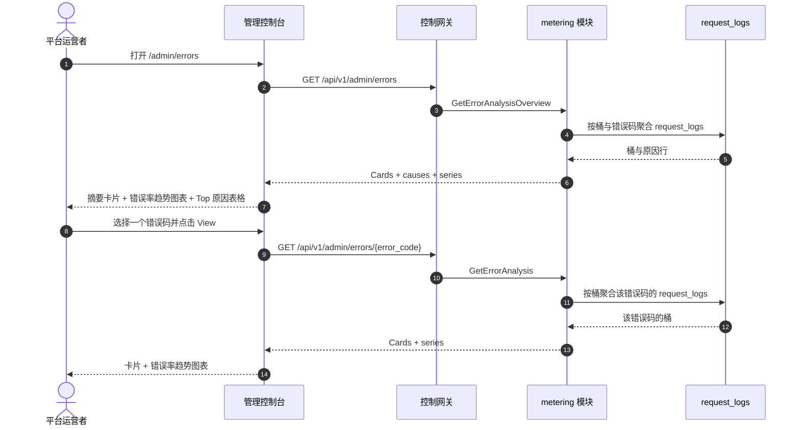

# 错误分析 — 需求分析与 UI/UX 设计

| 属性 | 内容 |
| --- | --- |
| 特性点 | 错误分析 — 聚合随时间变化的错误码与错误率、Top 错误原因、错误率趋势与按错误下钻（backlog 第 31 行） |
| 文档范围 | 需求分析与 UI/UX 设计：`/admin/errors` 管理面错误分析页面（集群级错误聚合 + Top 原因 + 错误率趋势 + 按错误下钻），`/errors` 终端用户面错误分析页面（租户作用域错误聚合 + Top 原因 + 错误率趋势 + 按错误下钻），页面 → API 面映射表，以及编号验收标准 |
| 归属模块 | `metering`（对 `request_logs` 的只读聚合，用于错误指标），`web` 管理控制台（`ErrorAnalysisPage`）与终端用户控制台（`UserErrorAnalysisPage`），`pkg/server` 网关（管理前缀与用户前缀绑定） |
| 相关文档 | [架构设计](./architecture.md) — 第 2.5 节 `metering` · [请求日志与 API 游乐场](./request-logs-playground.zh-cn.md) — 本特性聚合的 `request_logs` 表及其 `status` / `error` 字段 · [模型可观测性仪表盘](./model-observability.zh-cn.md) — 对 `request_logs` 的姊妹只读聚合及其错误率指标 · [请求追踪与延迟拆解](./request-tracing.zh-cn.md) — 本特性以错误聚合补充的姊妹按请求下钻 · [控制台面分离](./console-surface-separation.zh-cn.md) — 本特性横跨的两个面、`UserShell`/`AdminShell` 约定、掩码投影规则 |
| 状态 | 设计完成，已移交架构师代理 |

---

## 1. 背景与竞品调研

go-taas 在 `request_logs` 中记录每个推理请求的元数据 — 延迟、状态、错误与 token 计数（特性 #12），模型可观测性仪表盘（特性 #24）按模型聚合错误率。控制台仍然无法回答运营者与租户反复提出的问题：*什么在失败，为什么？* 可观测性仪表盘把错误率作为指标显示，但不按错误码或原因拆解错误；请求日志（特性 #12）显示单个错误行但无聚合；请求追踪（特性 #27）下钻单个请求但不聚合错误。没有任何面聚合随时间变化的错误码与错误率、对 Top 错误原因排名、显示错误率趋势并下钻单个错误。

本特性新增**错误分析**：聚合随时间变化的错误码与错误率、Top 错误原因、错误率趋势与按错误下钻。它是**只读**聚合层 — 推理、计量或计费流水线没有任何变化。这是 Phase 4 生产化路线图项中最小可独立交付的增量：它把「错误很高」变成「错误率 5%，Top 原因是 `rate_limit_exceeded` 占错误的 60%，且在上升」。

### 1.1 竞品的错误分析呈现

| 产品 | 错误面 | 聚合 | 趋势 / 下钻 | 主要陷阱 |
| --- | --- | --- | --- | --- |
| **Datadog Error Tracking** | 把相似错误分组为 issue 的 Error Tracking Explorer | 把数千错误分组为 issue；错误率趋势 | 错误率趋势；issue 详情下钻；监控 | 重型 agent；分组基于指纹，可能过度合并 |
| **Sentry** | 把相似事件分组为 issue 的 Issues 页面 | 按指纹分组事件；按趋势/事件/用户排序 | Issue 详情下钻；趋势排序 | 第三方 SaaS；分组复杂度；保存的搜索增加面 |
| **OpenAI Platform** | 错误仅在按请求日志中呈现 | 无错误聚合 | 无错误率趋势 | 用量滞后困扰调试；无错误聚合 |
| **Langfuse** | 可观测性中的错误率；按追踪错误 | 按模型错误率；无错误码聚合 | 按追踪错误下钻 | 重型第三方栈；无 Top 错误原因排名 |
| **Helicone** | 按 Key 错误率 | 按 Key 错误率 | 按 Key 错误趋势 | 第三方 SaaS；部分功能受限 |

### 1.2 提炼出的模式与决策

值得采纳的模式：(1) **错误率趋势图表与 Top 原因表格上方的摘要卡片** — Datadog Error Tracking 与 Sentry 都以头部卡片（错误率、错误数、Top 原因）加错误率趋势与 Top 原因排名开场，一个仪表盘端点同时返回卡片 + 序列 + 原因避免了 N+1 慢控制台（usage-dashboard D1）；(2) **把错误分组为原因** — Datadog 与 Sentry 把相似错误分组为 issue/原因，映射到按 `error` 码分组 `request_logs`；(3) **错误率趋势** — Datadog 的错误率趋势显示错误率如何演变；(4) **Top 错误原因** — Sentry 的按事件排序与 Datadog 的 issue 排名回答「什么失败最多」；(5) **按错误下钻** — Sentry 的 issue 详情与 Datadog 的 issue 详情下钻单个错误；(6) **新鲜度标注** — data-through 时间戳与 pending/partial 标记，因为错误滞后困惑是已记录的陷阱；(7) **内联 SVG 图表** — 控制台刻意依赖精简（usage-dashboard D7）。

需要避免的陷阱：阻塞式 N+1 仪表盘（慢控制台陷阱）— 一个端点返回卡片 + 序列 + 原因；把不同错误过度合并为一个原因（指纹陷阱）— 按精确 `error` 码分组，而非模糊指纹；静默缺失 pending 小时 — 新鲜度标记必须显式；在依赖精简的控制台中使用重型图表库；以及向租户暴露运营者编排内部信息（服务 id、副本数）— 租户面只显示错误码与错误率。

**go-taas 的决策**：

| # | 决策 | 依据 |
| --- | --- | --- |
| D1 | **错误分析存在于两个面，作用域清晰拆分。** 管理面（`/admin/errors`、`/api/v1/admin/errors/*`）是**集群级错误聚合** — 跨所有组织的所有错误，带 Top 原因排名、错误率趋势与按错误下钻。终端用户面（`/errors`、`/api/v1/errors/*`）是**租户作用域错误聚合** — 仅租户自己的错误，带相同的排名、趋势与下钻，且无服务 id 或运营者内部信息 | 运营者需要跨组织错误聚合来发现平台级失败；租户需要自己的错误聚合来调试应用的请求。按面拆分遵循特性 #17 的掩码投影规则：租户绝不能看到运营者编排内部信息，运营者的集群视图也是运营者作用域。两个面共享相同的卡片、图表与表格组件 |
| D2 | **错误由 `request_logs` 派生**（每请求携带 `status` 与 `error`，特性 #12），在服务端按错误码聚合。指标族为**错误数**（`status = error` 行的计数）、**错误率**（错误请求 ÷ 总请求）与 **Top 原因**（按计数排名的 `error` 码）。 | `request_logs` 已捕获所需的一切，并在同一幂等处理器中与 voucher 一起写入（特性 #12）；服务端聚合保持负载小且客户端依赖精简 |
| D3 | **每个面形状一个 RPC**，而非扩展 `ListRequestLogs`：`GetErrorAnalysisOverview`（管理面集群：卡片 + Top 原因排名 + 错误率趋势）与 `GetErrorAnalysis`（管理面按错误下钻与终端用户面按错误视图：单错误码卡片 + 趋势）。终端用户面复用 `GetErrorAnalysis`，作用域到租户自己的错误 | 错误页面需要多种形状（头部卡片、Top 原因排名、趋势）；把它们塞进 `ListRequestLogs` 会破坏其既有的行语义，而分开调用会重现 N+1 慢控制台。专用 RPC 对把错误关注点从原始日志面中分离出来 |
| D4 | **时间桶随范围自适应**：范围 ≤ 7 天用小时桶，范围 > 7 天用日桶。范围上限 **92 天**，校验复用 **10404**（计量范围契约） | 短范围的小时粒度显示日内错误尖峰；长范围的日粒度保持负载小。92 天上限与 10404 复用让范围契约与每个计量查询统一（usage-dashboard D6） |
| D5 | **图表用内联 SVG 渲染** — 每桶一个柱（或线），带指标切换器（错误数 / 错误率）— 无新图表依赖 | 控制台刻意依赖精简；小而可测试的 SVG 组件与 usage-dashboard D7 决策一致 |
| D6 | **新鲜度显式**：每个响应携带 `data_through`（请求日志覆盖的最后一个完整桶），控制台显示「data through <time>」说明，并在所选范围超出它时显示 pending/partial 标记 | 错误滞后困惑是已记录的陷阱；标记以零新流水线工作保持新鲜度故事诚实 |
| D7 | **终端用户面是租户作用域且掩码**：用户前缀的 `GetErrorAnalysis` 只返回租户自己的错误，无服务 id、无副本数、无其他租户数据 | 遵循特性 #17 的掩码投影规则与 observability D7 模式：租户得到自己的错误聚合，而非运营者内部信息 |
| D8 | **error-analysis 块（11501–11599）新增错误码**：**11501 `CodeErrorCauseNotFound`**（未知错误码）。范围校验复用 **10404** | 错误分析是新关注点（D3），因此其错误码放在 status 块（114xx）之后的全新块中；不同的 not-found 让「未知错误原因」可操作，而范围契约与计量保持统一（D4） |
| D9 | **错误分析是只读且仅对访问审计** — 它不写数据、不改变任何东西；页面仅对具有相应角色的已认证会话可达，且无分析变更被审计（没有可变更的东西） | 该特性是对既有数据的纯聚合；审计轨迹（特性 #15）已覆盖底层请求日志写入。无需新增审计事件 |

## 2. 目标与非目标

**目标**：一个管理面页面 `/admin/errors`，显示集群级摘要卡片、Top 原因排名、带指标切换器的错误率趋势图表，外加按错误下钻 `/admin/errors/:errorCode`（D1、D2、D3、D4、D5、D6）；一个终端用户面页面 `/errors`，显示租户自己的卡片、排名、趋势，外加按错误下钻 `/errors/:errorCode`（D1、D7）；页面 → API 面映射表，含精确前缀（D1）；每页交互状态，包括空、错误与权限拒绝；可在 Nightwatch 中针对 compose 栈测试的编号验收标准。

**非目标**：实时流式指标（请求日志节奏不变）；异常检测或阈值告警（特性 #26 在控制台内消费可观测性事件 — 此处不在范围内）；保存的自定义视图或仪表盘；模糊指纹分组（D2 — 按精确 `error` 码分组）；向租户暴露服务 id、副本数或其他运营者内部信息（D7）；对推理、计量或计费流水线的任何更改（只读特性）；新增审计事件（D9）。

## 3. 角色与旅程

| 角色 | 面 | 旅程 |
| --- | --- | --- |
| **平台运营者** | admin | 打开 `/admin/errors` → 看到集群级摘要卡片与 Top 原因排名 → 发现 `rate_limit_exceeded` 占错误的 60% → 把趋势图表过滤到该原因 → 下钻到 `/admin/errors/rate_limit_exceeded` → 看到该原因的趋势 → 调查限流配置 |
| **平台运营者（可靠性）** | admin | 一个模型的错误率飙升 → 运营者把错误率趋势过滤到该模型 → 看到 Top 原因 → 下钻到请求日志（特性 #12）找到失败请求 |
| **租户开发者 / 智能体** | end-user | 打开 `/errors` → 看到自己的摘要卡片与 Top 原因排名 → 下钻到 `/errors/:errorCode` → 看到该原因的趋势 → 修复应用的错误处理 |
| **租户开发者（调试）** | end-user | 应用中的错误消息包含一个错误码 → 打开 `/errors` → 看到该原因的趋势 → 下钻到该原因 → 读取错误详情 |

> 术语：消费侧调用方在英文中为 **Agent**，中文为「智能体」，与仓库约定一致。

## 4. 功能需求

### FR1 — 管理面集群级错误总览

- **FR1.1** `GetErrorAnalysisOverview`（`GET /api/v1/admin/errors`）返回时间范围与可选过滤下的集群级错误分析：摘要卡片、Top 原因排名与错误率趋势。它接收 `since`/`until`（unix 秒；默认 `until = now`、`since = until − 24h`）、`model_id`（可选）与 `organization_id`（可选，经 `X-Organization-Id`）。`since > until` 或范围 > 92 天返回 **10404**（D4）。
- **FR1.2** 响应的 `cards` 携带 `error_count`、`request_count`、`error_rate`（客户端派生为 error ÷ requests）、`top_cause`、`top_cause_share_pct` 与 `data_through`（请求日志覆盖的最后一个完整桶）（D2、D6）。
- **FR1.3** 响应的 `causes[]` 携带范围内每个错误码一行：`error_code`、`error_message`、`error_count`、`error_rate` 与 `share_pct`（该原因占范围内总错误的份额，客户端派生为原因计数 ÷ 总错误数）。表格默认按 `error_count` 降序排序。
- **FR1.4** 响应的 `series[]` 携带每个时间桶一项（范围 ≤ 7 天为小时，否则为日，D4）：`bucket`（unix 秒）、`error_count`、`request_count`、`error_rate`。当设置 `error_code` 时，序列针对该原因；否则为集群级。

### FR2 — 管理面按错误下钻

- **FR2.1** `GetErrorAnalysis`（`GET /api/v1/admin/errors/{error_code}`）返回时间范围下的单错误码分析：摘要卡片与错误率趋势。它接收 `since`/`until`（默认与 10404 范围规则同 FR1.1）。未知 `error_code` 返回 **11501 `CodeErrorCauseNotFound`**（D8）。
- **FR2.2** 响应的 `cards` 与 `series[]` 镜像 FR1.2/FR1.4，作用域为该错误码。

### FR3 — 终端用户面错误视图

- **FR3.1** `GetErrorAnalysis`（`GET /api/v1/errors/{error_code}`）返回**租户自己**的时间范围下的单错误码分析：摘要卡片与错误率趋势。它接收 `since`/`until`（默认与 10404 范围规则同 FR1.1）。未知 `error_code` 返回 **11501**（D8）。
- **FR3.2** 响应作用域到调用者的组织（D7）：它只聚合租户自己的 `request_logs`，且暴露**无**服务 id、副本数或其他租户数据（D7）。

### FR4 — 面与 API 绑定

- **FR4.1** 管理面错误页面位于**管理面**：路由 `/admin/errors` 与 `/admin/errors/:errorCode`，API 前缀 `/api/v1/admin/errors/*`。它们被加入 `AdminShell` 导航（特性 #17），名为「Errors」。
- **FR4.2** 终端用户面错误页面位于**终端用户面**：路由 `/errors` 与 `/errors/:errorCode`，API 前缀 `/api/v1/errors/*`。它们被加入 `UserShell` 导航（特性 #17），名为「Errors」。
- **FR4.3** 管理面页面只调用 `/api/v1/admin/errors/*` 路由；终端用户面页面只调用 `/api/v1/errors/*`。两者都不包含对方面的前缀字符串（特性 #17、D1）。
- **FR4.4** 终端用户面页面绝不暴露运营者内部信息（服务 id、副本数），绝不聚合其他租户数据（D7）。

## 5. UI 设计

### 5.1 页面：`/admin/errors` — Error Analysis（管理面）

**目的**：给平台运营者一个集群级错误分析视图 — 摘要卡片、Top 原因排名与错误率趋势图表 — 以发现平台级失败。

**面**：admin — 路由 `/admin/errors`，API `/api/v1/admin/errors/*`。

**布局**：在 `AdminShell`（特性 #17）内渲染。页面头部（「Errors」，副标题「Error codes and rates over time」）带 **Refresh** 动作（次要）。下方：

1. **过滤栏** — **时间范围**控件（预设 24 h / 7 d / 30 d / custom，带日期时间选择器）与**模型**过滤（下拉，「All models」默认）。更改任一即重新拉取。
2. **摘要卡片** — 一行卡片：**Error rate**、**Error count**、**Request count**、**Top cause**（Top 错误码及其份额）。每张卡片显示所选范围与模型过滤下的值，带「data through <time>」新鲜度说明（D6）。
3. **错误率趋势图表** — 内联 SVG 图表（D5）带**指标切换器**（Error count / Error rate）。每桶一个柱（或线）；当选择错误码时序列针对该原因，否则为集群级。
4. **Top 原因表格** — 错误码表格，列：**Error code**（下钻链接）、**Error message**、**Error count**、**Error rate**、**Share**。行动作 **View** 打开下钻。

**交互状态**：

| 状态 | 行为 |
| --- | --- |
| 默认 | 过滤栏 + 摘要卡片 + 错误率趋势图表 + Top 原因表格从首次成功加载渲染；last-updated 显示加载时间 |
| 加载中 | 骨架卡片与表格；Refresh 禁用 |
| 空 | 「No error data in this range.」并提示扩大范围；过滤栏保持可见 |
| 错误 | 错误横幅带消息与 Retry 按钮；页面保留最后的好数据并显示「Showing stale data」横幅 |
| 禁用 | 加载进行中 Refresh 禁用；重新拉取进行中指标切换器禁用 |
| 权限拒绝 | 无所需角色的会话收到 10036，页面显示标准权限拒绝状态（特性 #17）带返回管理首页的链接 |

**Top 原因表格列**：Error code（链接）、Error message、Error count、Error rate、Share。可按 Error count、Error rate 与 Share 排序。可按 Model 下拉过滤；分页。

### 5.2 页面：`/admin/errors/:errorCode` — Error Detail（管理面）

**目的**：显示一个错误码随时间变化的分析 — 卡片与错误率趋势 — 让运营者调查单个错误原因。

**面**：admin — 路由 `/admin/errors/:errorCode`，API `/api/v1/admin/errors/{error_code}`。

**布局**：`AdminShell` 下的详情页，带返回总览的返回链接。头部带错误码。下方：

1. **过滤栏** — **时间范围**控件（预设 24 h / 7 d / 30 d / custom）。
2. **摘要卡片** — 同 §5.1 的卡片集，作用域为该错误码。
3. **错误率趋势图表** — 带指标切换器的内联 SVG 图表，作用域为该错误码。

**交互状态**：同 §5.1，空文案「No error data for this cause in this range.」，未知 `error_code`（11501）的 not-found 状态显示标准 not-found 状态带返回总览的链接。

### 5.3 页面：`/errors` — Error Analysis（终端用户面）

**目的**：给租户开发者 / 智能体一个自己错误分析的视图 — 摘要卡片、Top 原因排名与错误率趋势图表 — 以调试应用的请求。

**面**：end-user — 路由 `/errors`，API `/api/v1/errors/*`。

**布局**：在 `UserShell`（特性 #17）内渲染。页面头部（「Errors」，副标题「Your error codes and rates over time」）带 **Refresh** 动作（次要）。下方：

1. **过滤栏** — **时间范围**控件（预设 24 h / 7 d / 30 d / custom）与**模型**过滤（下拉，「All models」默认）。
2. **摘要卡片** — 同 §5.1 的卡片集，作用域到租户自己的用量（D7）。
3. **错误率趋势图表** — 带指标切换器的内联 SVG 图表，作用域到租户自己的用量。
4. **Top 原因表格** — 租户自己的错误码，列同 §5.1，作用域到租户自己的错误。

**交互状态**：同 §5.1，空文案「No error data in this range.」，权限拒绝文案为租户自己的错误（特性 #17 §8.2 的 10005 组织消失 / 10017 组织禁用，FR4.3 的 10027/10038 重定向）。页面暴露无服务 id 或运营者内部信息（D7）。

**Top 原因表格列**：同 §5.1，作用域到租户自己的错误。排序与分页同 §5.1。

### 5.4 页面：`/errors/:errorCode` — Error Detail（终端用户面）

**目的**：给租户开发者 / 智能体一个自己某个错误码随时间变化的分析视图 — 卡片与错误率趋势 — 以调试应用的错误处理。

**面**：end-user — 路由 `/errors/:errorCode`，API `/api/v1/errors/{error_code}`。

**布局**：`UserShell` 下的详情页，带返回总览的返回链接。头部带错误码。下方：

1. **过滤栏** — **时间范围**控件（预设 24 h / 7 d / 30 d / custom）。
2. **摘要卡片** — 同 §5.1 的卡片集，作用域到租户自己对错误码的用量（D7）。
3. **错误率趋势图表** — 带指标切换器的内联 SVG 图表，作用域到租户自己的用量。

**交互状态**：同 §5.2，空文案「No error data for this cause in this range.」，权限拒绝文案为租户自己的错误（特性 #17 §8.2 的 10005/10017）。页面暴露无服务 id 或运营者内部信息（D7）。

### 5.5 流程

## 6. API 面影响

所有错误分析 RPC 属于 **`metering` 模块**（D3），经控制网关以 HTTP 提供。管理面路由在**管理前缀** `/api/v1/admin/errors/*`（D1）；终端用户面路由在**用户前缀** `/api/v1/errors/*`（D1）。

| RPC | 路由 | 前缀 | 状态 | 目的 |
| --- | --- | --- | --- | --- |
| `GetErrorAnalysisOverview` | `GET /api/v1/admin/errors` · `GET /api/v1/errors` | admin · user | **新增** | 卡片 + Top 原因排名 + 错误率趋势（admin：集群；user：租户作用域） |
| `GetErrorAnalysis` | `GET /api/v1/admin/errors/{error_code}` · `GET /api/v1/errors/{error_code}` | admin · user | **新增** | 单错误码卡片 + 错误率趋势（admin：任意原因；user：租户作用域） |

**给架构师代理的契约说明**：

1. `GetErrorAnalysisOverview` 校验 `since`/`until`（int64 unix 秒；默认 `until = now`、`since = until − 24h`）；`since > until` 或范围 > 92 天返回 10404（D4）。`model_id` 与 `organization_id` 为可选过滤。
2. `GetErrorAnalysis` 校验同一范围契约；未知 `error_code` 返回 11501（D8）。在用户前缀上它作用域到调用者的组织（D7），且暴露无服务 id 或运营者内部信息。
3. 桶在范围 ≤ 7 天为小时、否则为日（D4）；每个桶携带 `bucket`、`error_count`、`request_count`、`error_rate`。`error_rate` 与 `share_pct` 客户端派生；线上只携带整数计数。
4. 每个响应携带 `data_through`（请求日志覆盖的最后一个完整桶）用于新鲜度标记（D6）。
5. 聚合读取 `request_logs`（特性 #12）— 每请求的 `status` 与 `error`；它不写任何东西（D9）。
6. 线上约定不变：列表用点分页，成功 HTTP 200，业务错误为 `{"code": <int>, "message": "..."}`，int64 字段序列化为 JSON 字符串。

错误码（error-analysis 块 11501–11599，`pkg/errors/codes.go`）：

| 条件 | 码 | 常量 | 说明 |
| --- | --- | --- | --- |
| 未知 `error_code` | 11501 | `CodeErrorCauseNotFound` | **新增**（D8） |
| 畸形或超长范围 | 10404 | `CodeRequestLogRangeInvalid` | 复用（D4）— 计量范围契约 |
| 数据库 / 基础设施失败 | 500 | `CodeInternal` | 经错误归一化 |

## 7. 验收标准

| # | 标准 | 级别 |
| --- | --- | --- |
| AC1 | `GetErrorAnalysisOverview` 在有效范围内返回摘要卡片、Top 原因排名与时间序列；范围 > 92 天或 `since > until` 返回 10404 | FVT |
| AC2 | `GetErrorAnalysisOverview` 返回按错误数降序的 `causes[]`，带客户端派生的 `share_pct` | FVT |
| AC3 | `GetErrorAnalysis`（admin）返回单错误码卡片与错误率趋势；未知 `error_code` 返回 11501 | FVT |
| AC4 | `GetErrorAnalysis`（user）只返回调用者组织的错误，无服务 id 或运营者内部信息 | FVT |
| AC5 | 桶在范围 ≤ 7 天为小时、范围 > 7 天为日；每个响应携带 `data_through` | FVT |
| AC6 | `/admin/errors` 页面从首次成功加载渲染过滤栏、摘要卡片、内联 SVG 错误率趋势图表与 Top 原因表格，带 last-updated 时间戳 | E2E |
| AC7 | 更改时间范围或模型过滤会重新拉取并重新渲染卡片、图表与表格；指标切换器切换图表指标 | E2E |
| AC8 | 无数据匹配时渲染空状态（「No error data in this range.」）；失败加载保留最后的好数据并显示「Showing stale data」横幅与 Retry 动作 | E2E |
| AC9 | `/admin/errors/:errorCode` 页面渲染该错误码的卡片与错误率趋势图表；未知错误码显示 not-found 状态 | E2E |
| AC10 | `/errors` 与 `/errors/:errorCode` 页面渲染租户自己的卡片、排名与趋势，无服务 id 或运营者内部信息可见 | E2E |
| AC11 | 管理面错误页面只在管理面可达：路由 `/admin/errors` 与 `/admin/errors/:errorCode`，每个 API 调用使用 `/api/v1/admin/errors/*` 前缀且无 `/api/v1/errors/*` 字符串 | E2E（面分离） |
| AC12 | 终端用户面错误页面只在终端用户面可达：路由 `/errors` 与 `/errors/:errorCode`，每个 API 调用使用 `/api/v1/errors/*` 前缀且无 `/api/v1/admin/*` 字符串 | E2E（面分离） |
| AC13 | 无所需角色的会话在管理面错误页面收到 10036，页面显示标准权限拒绝状态 | E2E |

## 8. 范围外（在别处跟踪）

| 项 | 位置 |
| --- | --- |
| 实时流式指标 | 未来细化 — 请求日志节奏不变 |
| 异常检测 / 阈值告警 | 特性 #26 在控制台内消费可观测性事件 — 此处不在范围内 |
| 保存的自定义视图 / 仪表盘 | 未来细化 |
| 模糊指纹分组 | 刻意缺失（D2）— 按精确 `error` 码分组 |
| 租户可见运营者编排内部信息（服务 id、副本数） | 刻意缺失（D7） |
| 对推理、计量或计费流水线的任何更改 | 刻意缺失 — 只读特性（D9） |
| 错误分析访问的新增审计事件 | 刻意缺失 — 没有可变更的东西（D9） |