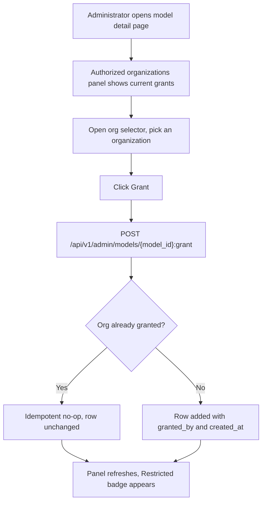
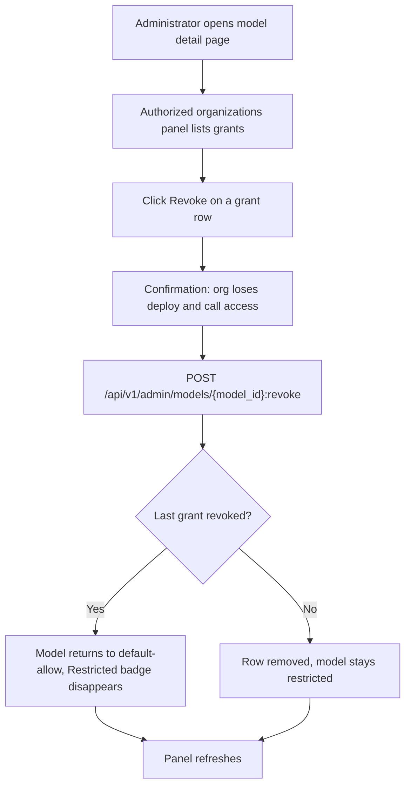
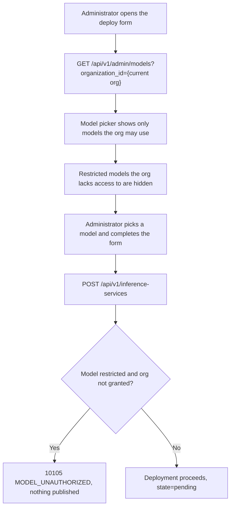
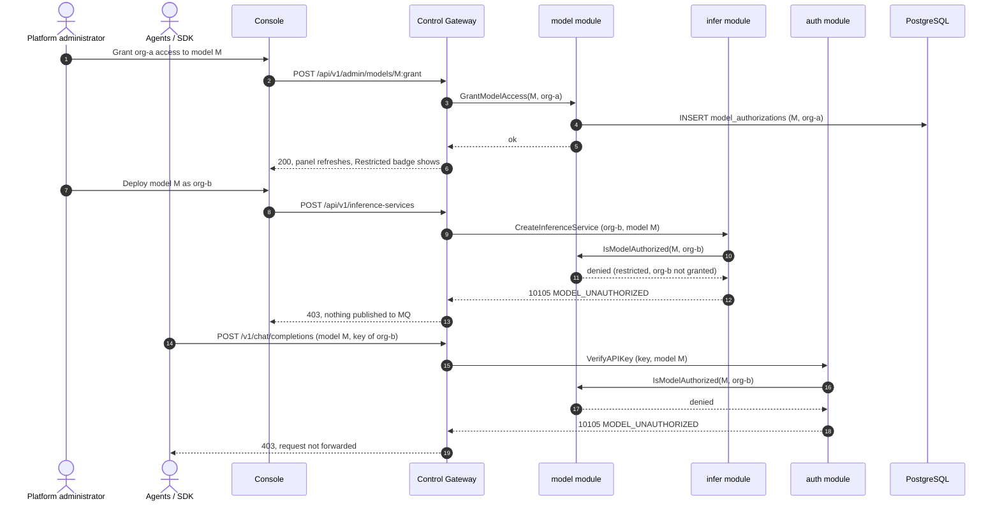

# Per-Tenant Model Authorization — Requirement Analysis and UI/UX Design

| Attribute | Content |
| --- | --- |
| Feature point | Per-tenant model authorization |
| Document scope | Requirement analysis and UI/UX design for restricting which organizations may deploy and call which models: the `model_authorizations` table, the default-allow rule, control-plane and data-plane enforcement, the four `ModelService` RPCs, the console "Authorized organizations" panel and "Restricted" badge, and acceptance criteria |
| Owning modules | `model` (the `model_authorizations` table and the four authorization RPCs), `infer` (control-plane enforcement in `CreateInferenceService`), `auth` (data-plane enforcement in `VerifyAPIKey`, activating the dormant `model` field) |
| Related documents | [Architecture Design](./architecture.md) — §2.2 `model`, §2.4 `infer`, §2.1 `auth` · [Model Catalog & One-Click Deployment](./model-catalog-deployment.md) — the catalog and `CreateInferenceService` this feature gates (its §1.4 defers tenant-level model authorization here) · [Multi-Tenancy Isolation](./multi-tenancy.md) — the organization entity this feature grants against |
| Status | Design complete, handed to the Architect agent |

---

## 1. Background

The catalog (feature #3) lets an administrator register models and deploy them as inference services, and every resource is owned by an organization (feature #6). What the platform still cannot express is **"which organizations may use which models"**. Today any organization can deploy any catalog model and any API key can call any deployed endpoint. For a Token-as-a-Service platform that sells access to curated open models, that is a governance gap: an operator may want to reserve a premium model for specific tenants, gate a model behind a contract, or keep a model internal while it is validated. This feature adds a per-tenant authorization layer over the catalog with a **default-allow** rule that preserves every existing deployment, plus enforcement at both the control plane (who may deploy) and the data plane (who may call).

### 1.1 How Comparable Products Implement Model Authorization

| Product | Authorization model | Enforcement point | Default | Notable pitfalls |
| --- | --- | --- | --- | --- |
| **OpenAI Platform** | Model access is platform-wide; per-project model restrictions exist via project settings and fine-tuned model visibility | Project settings; API key scoping | Allow all platform models | Restriction is coarse (project-level, not per-model) and surfaced late |
| **Anthropic Console** | Model access is account-wide; no per-model tenant gating | None (all models available) | Allow all | No per-model governance at all |
| **Together AI** | Public open models are open to all; private/fine-tuned models are gated to the owning account | Endpoint creation and inference | Public = allow, private = owner-only | The public/private split is binary, not a grant list |
| **SiliconFlow** | Model square is open; some models require application/approval before use | Model card "apply" flow; inference gated until approved | Allow, unless the model requires approval | Approval is a one-time per-user gate, not per-tenant grants |
| **Aliyun Bailian (Model Studio)** | Workspace-scoped model authorization: a workspace must be granted a model before it can deploy or call it | Workspace model list; deployment and inference | Deny until granted | The **default-deny** model breaks backward compatibility and forces a grant for every existing workspace |
| **Volcengine Ark** | Model access tied to the account; some models require activation | Activation flow per model | Allow, unless activation required | Activation is account-level, not per-tenant |
| **Kubernetes (RBAC)** | RoleBindings grant verbs on resources; absence of a binding denies | API server admission | **Deny by default** | The deny-by-default model is correct for a security boundary but wrong for a catalog that must stay open |

### 1.2 Distilled Patterns and Decisions

Patterns worth adopting:

1. **A grant list, not a binary flag** — the useful primitive is "these organizations may use this model", which a list of `(model_id, organization_id)` rows expresses directly and which a single `public`/`private` boolean cannot (Together's binary split is too coarse).
2. **Enforce at both the deploy and the call** — Aliyun Bailian gates both deployment and inference; gating only deployment would let an already-deployed service keep serving a revoked tenant. go-taas must check at `CreateInferenceService` (control plane) and at `VerifyAPIKey` (data plane).
3. **Default-allow for backward compatibility** — unlike Kubernetes RBAC's deny-by-default, a catalog that has been open must stay open until an operator explicitly restricts a model. Zero grant rows means "everyone"; the first grant flips the model to restricted.
4. **A distinct, documented error** — a blocked deploy and a blocked call should return the same recognizable code so SDK authors and operators can react without guessing.

Pitfalls to avoid:

- **Default-deny** (Aliyun Bailian, Kubernetes) — would silently break every existing tenant and every e2e suite; the default-allow rule (D2) avoids a migration entirely.
- **A boolean on the model row** — a `restricted` flag cannot express *which* orgs are allowed and forces a second table anyway; the grant table is the single source of truth (D1).
- **Enforcing only at deploy time** — a revoked tenant with a live service would keep calling; data-plane enforcement closes the loop (D3).
- **New error codes** — the platform already reserves 10105 `CodeModelUnauthorized` for exactly this; inventing a new code would orphan it (D4).

**Decisions for go-taas** (recorded rationale, per the autonomous-decision rule):

| # | Decision | Rationale |
| --- | --- | --- |
| D1 | **A separate `model_authorizations` table** — `model_id`, `organization_id`, composite unique `(model_id, organization_id)`, `granted_by`, `created_at` — **not a field on the models table** | A grant list is inherently many-to-many; a boolean field cannot name the allowed orgs, and a JSON array column would be unqueryable. The table is the single source of truth and keeps `models` unchanged |
| D2 | **Default-allow rule**: a model with **zero** grant rows is accessible to all organizations; once **any** grant row exists, only the granted organizations may access it | Preserves backward compatibility — every existing model and every e2e flow keeps working with no migration; the first grant is the explicit act that restricts a model |
| D3 | **Enforce at two points**: `CreateInferenceService` (control plane) rejects a deploy by a non-granted org, and `VerifyAPIKey` (data plane) rejects inference calls for a restricted model by a non-granted org — activating the already-present-but-ignored `model` field on the key-verification request | Gating only deployment leaves a revoked tenant's live service running; gating only calls lets a tenant deploy a model it cannot use. Both gates share the same authorization check |
| D4 | **Reuse the existing 10105 `CodeModelUnauthorized`** (currently dead code) for both blocked deploys and blocked calls | The code was reserved for exactly this; reusing it keeps the error surface stable and documented, and avoids a redundant new code |

### 1.3 Scope Boundary

**In scope**: the `model_authorizations` table; the four `ModelService` RPCs (grant, revoke, list authorizations, org-filtered model list); control-plane enforcement in `CreateInferenceService`; data-plane enforcement in `VerifyAPIKey`; activation of 10105; the console "Authorized organizations" panel, the "Restricted" badge, and org-aware filtering in the deploy form.

**Out of scope** (tracked elsewhere): per-model pricing and spend limits (#5/#8), model approval workflows and application flows (SiliconFlow-style), fine-tuned/private model ownership, per-project (vs per-org) model grants (after #7), and tenant-facing self-service authorization (after #7).

---

## 2. Goals and Non-goals

**Goals**: a per-organization grant list per model; the default-allow rule that keeps the catalog open until restricted; enforcement at both deploy and call time; the four authorization RPCs; activation of 10105; a console panel to grant/revoke orgs, a "Restricted" badge on the catalog, and org-aware filtering in the deploy form.

**Non-goals**: default-deny enforcement; per-project model grants; approval/application workflows; model visibility tiers beyond the binary restricted/open; per-model spend limits; tenant self-service authorization; audit of who granted what beyond the `granted_by` column.

---

## 3. Personas

| Role | Description | Interaction with model authorization |
| --- | --- | --- |
| **Platform administrator** | The operator who runs the cluster; today also the console user | Grants and revokes organization access to models, sees the "Restricted" badge, and filters the deploy form by the current org |
| **Organization administrator (future)** | Tenant-side administrator | Will see which models their org may use (scoped by tenancy, #6/#7); today they do not exist as a distinct principal |
| **Agent / SDK** | The programmatic consumer calling `/v1/chat/completions` | Experiences 10105 when calling a restricted model their org is not granted |
| **Auditor** | Whoever resolves a governance or access dispute | Traces a model's authorized orgs and the `granted_by`/`created_at` of each grant |

> Terminology: the consumer-side caller is called an **Agent** (English) / 「智能体」(Chinese), consistent with the repo convention.

---

## 4. User Journeys

| # | Journey | Steps |
| --- | --- | --- |
| J1 | **Restrict a model to one tenant** | Admin opens a model's detail page → sees the "Authorized organizations" panel → grants `org-a` → the catalog shows a "Restricted" badge on the model → `org-b` can no longer deploy or call it, `org-a` can |
| J2 | **Open a model back up** | Admin revokes the last grant on a restricted model → the grant list is empty → the model returns to default-allow and the "Restricted" badge disappears → all orgs can deploy and call it again |
| J3 | **Deploy with org-aware filtering** | Admin opens the deploy form → the model picker is filtered to models the current org may use (all models if none are restricted) → a restricted model the org lacks access to is hidden |
| J4 | **Agent hits the wall** | An Agent calls a restricted model with a key from a non-granted org → the gateway returns 10105 `MODEL_UNAUTHORIZED` → the admin grants the org → the retry passes |

---

## 5. Feature Requirements and Acceptance Criteria

### FR1 — Grant and revoke model access

- **FR1.1** `GrantModelAccess` (`POST /api/v1/admin/models/{model_id}:grant`) adds a `(model_id, organization_id)` row with `granted_by` set to the caller and `created_at` set to now. Granting an org that is already granted is idempotent (no-op success). Unknown model → 10003; unknown org → 10005.
- **FR1.2** `RevokeModelAccess` (`POST /api/v1/admin/models/{model_id}:revoke`) removes the row. Revoking an org that has no grant is idempotent (no-op success). Unknown model → 10003.
- **FR1.3** The first grant on a model flips it from default-allow to restricted; revoking the last grant flips it back to default-allow. The console reflects both transitions immediately.

### FR2 — View authorized organizations

- **FR2.1** `ListModelAuthorizations` (`GET /api/v1/admin/models/{model_id}/authorizations`) returns the model's grant rows (org id, granted_by, created_at), paginated (default 20, cap 100), newest first. Unknown model → 10003.
- **FR2.2** `ListModels` gains an optional `organization_id` filter (`ListAuthorizedModels`): when present, it returns only models the given org may use — all models if none are restricted, otherwise only the granted ones. This drives the deploy form's model picker.

### FR3 — Control-plane enforcement (deploy)

- **FR3.1** `CreateInferenceService` checks the model's authorization before accepting the request: if the model is restricted (has ≥ 1 grant row) and the requesting org is not in the grant list, it returns **10105 `CodeModelUnauthorized`** and publishes nothing to the message queue.
- **FR3.2** The check is synchronous and happens before any desired-state write, so a blocked deploy never reaches the Controller.

### FR4 — Data-plane enforcement (call)

- **FR4.1** `VerifyAPIKey` activates its already-present-but-ignored `model` field: when the inference request names a model, the gateway resolves the model's authorization and, if the model is restricted and the key's org is not granted, returns **10105 `CodeModelUnauthorized`**.
- **FR4.2** The data-plane check is cached per (org, model) for a short window (default 5 s) to keep the hot path fast, mirroring the billing gating cache pattern.

### FR5 — Console

- **FR5.1** The model detail page gains an "Authorized organizations" panel (`model-auth-panel`) listing the model's grants as rows (`model-auth-row-{orgId}`), each with a revoke action (`model-auth-revoke-{orgId}`), plus a grant control (`model-auth-grant`) with an org selector (`model-auth-org-select`).
- **FR5.2** The catalog shows a "Restricted" badge (`model-restricted-badge`) on any model with ≥ 1 grant row; models with zero grants show no badge.
- **FR5.3** The deploy form's model picker is filtered by the current org via `ListAuthorizedModels`; restricted models the org lacks access to are hidden.

### Acceptance criteria

| # | Criterion (Given / When / Then) | Verification |
| --- | --- | --- |
| AC1 | **Given** a model with zero grants, **when** `GrantModelAccess` is called for `org-a`, **then** a `(model_id, org-a)` row is stored with `granted_by` and `created_at`, and the model becomes restricted | Unit + FVT |
| AC2 | **Given** `org-a` already granted, **when** `GrantModelAccess` is called again for `org-a`, **then** it succeeds idempotently with no duplicate row | Unit |
| AC3 | **Given** a restricted model, **when** `RevokeModelAccess` is called for a granted org, **then** the row is removed; revoking the last grant returns the model to default-allow | Unit + FVT |
| AC4 | **Given** a model with no grant for `org-a`, **when** `RevokeModelAccess` is called for `org-a`, **then** it succeeds idempotently (no-op) | Unit |
| AC5 | **Given** a restricted model, **when** `CreateInferenceService` is called by a non-granted org, **then** it returns 10105 `CodeModelUnauthorized` and publishes nothing to the message queue | Unit + FVT |
| AC6 | **Given** a restricted model, **when** `CreateInferenceService` is called by a granted org, **then** it proceeds normally (state `pending`) | FVT |
| AC7 | **Given** a restricted model, **when** an Agent calls it with a key from a non-granted org, **then** `VerifyAPIKey` returns 10105 `MODEL_UNAUTHORIZED` and the request is not forwarded | FVT + E2E |
| AC8 | **Given** a restricted model, **when** an Agent calls it with a key from a granted org, **then** the request is forwarded and metered normally | FVT |
| AC9 | **Given** a model with zero grants, **when** any org deploys or calls it, **then** it is allowed (default-allow preserved) | FVT regression |
| AC10 | **Given** `ListModelAuthorizations`, **when** called for a model with grants, **then** it returns the rows newest first, paginated, with `granted_by` and `created_at` | Unit + FVT |
| AC11 | **Given** `ListModels` with an `organization_id` filter, **when** the org is not granted any restricted model, **then** it returns all unrestricted models; **when** the org is granted some restricted models, **then** it returns those plus all unrestricted models | Unit + FVT |
| AC12 | **Given** the model detail page, **when** the admin grants and revokes orgs via the panel, **then** the rows (`model-auth-row-{orgId}`) update inline and the "Restricted" badge appears/disappears accordingly | E2E |
| AC13 | **Given** the catalog, **when** a model has ≥ 1 grant, **then** it shows the `model-restricted-badge`; a model with zero grants shows none | E2E |
| AC14 | **Given** the deploy form, **when** the current org lacks access to a restricted model, **then** that model is hidden from the picker; **when** the org is granted, **then** it is shown | E2E |

### UX Flows

#### Grant an organization access to a model

#### Revoke an organization's access

#### Deploy with org-aware filtering

#### Enforcement sequence (control and data plane)

---

## 6. Console Information Architecture

Nav: the existing **Models** group gains the authorization surface on the model detail page; the catalog and deploy form are extended in place.

| Page / component | Purpose | Key testids |
| --- | --- | --- |
| **Model detail page** (`/models/{model_id}`) | Adds the "Authorized organizations" panel: grant rows (org, granted by, created), revoke per row, grant control with org selector | `model-auth-panel`, `model-auth-row-{orgId}`, `model-auth-revoke-{orgId}`, `model-auth-grant`, `model-auth-org-select` |
| **Models page** (`/models`) | Catalog rows gain a "Restricted" badge on restricted models | `model-restricted-badge` |
| **Deploy dialog** | Model picker filtered by the current org via `ListAuthorizedModels` | (reuses the existing deploy form) |

Empty states: the panel shows "No organizations authorized — this model is open to all organizations" when the grant list is empty; the grant selector lists organizations from `ListOrganizations`. Color language: restricted = amber badge; granted rows = neutral; revoke = destructive red. The panel refreshes on a 60-second poll while visible.

---

## 7. API Surface

All four RPCs belong to **`taas.model.v1.ModelService`** (proto: `proto/taas/model/v1/model.proto`), served as HTTP via the Control Gateway under `/api/v1/admin/models/*`. The grant/revoke/list RPCs are platform-global (no `X-Organization-Id` required — the admin console manages all grants); the `ListModels` org filter is org-scoped.

| RPC | HTTP | Status | Purpose |
| --- | --- | --- | --- |
| `GrantModelAccess` | `POST /api/v1/admin/models/{model_id}:grant` | **new** | Add an org to a model's grant list (idempotent) |
| `RevokeModelAccess` | `POST /api/v1/admin/models/{model_id}:revoke` | **new** | Remove an org from a model's grant list (idempotent) |
| `ListModelAuthorizations` | `GET /api/v1/admin/models/{model_id}/authorizations` | **new** | The model's grant rows, newest first, paginated |
| `ListModels` (org filter) | `GET /api/v1/admin/models?organization_id={org}` | **extended** | `ListAuthorizedModels`: models the org may use |

Contract constraints:

1. `GrantModelAccess`/`RevokeModelAccess` are idempotent — repeating the same call is a no-op success, never an error.
2. `ListModels` with `organization_id` present applies the default-allow rule: zero-grant models are always returned; restricted models are returned only if the org is granted.
3. `CreateInferenceService` (unchanged on the wire) now returns 10105 for a restricted model the requesting org lacks access to; `VerifyAPIKey` (unchanged on the wire) now honors its `model` field and returns 10105 for a blocked call.
4. Wire conventions unchanged: dotted pagination, HTTP 200 on success, business errors as `{"code": <int>, "message": "..."}`, int64 timestamps as JSON strings.

---

## 8. Error Codes

Model range 10101–10199 (`pkg/errors/codes.go`):

| Condition | Code | Constant | Notes |
| --- | --- | --- | --- |
| Deploy or call blocked — model is restricted and the org is not granted | 10105 | `CodeModelUnauthorized` | **Activated** (was dead code, D4); HTTP 403 |
| Unknown model on grant/revoke/list | 10003 | `CodeModelNotFound` | Existing |
| Unknown organization on grant | 10005 | `CodeOrganizationNotFound` | Existing |
| Database failure | 500 | `CodeInternal` | Via error normalization |

---

## 9. Open Questions

| Question | Leaning |
| --- | --- |
| Should the data-plane check cache be longer than 5 s to reduce gateway load? | Keep 5 s default; a revoked org may keep calling for up to the cache window — accepted, same as billing gating |
| Should restricted models be hidden entirely from non-granted orgs' catalog, or shown with a lock? | Hidden in the deploy picker (FR5.3); the catalog itself stays visible to the admin console, which manages all grants |
| Should grants be per-project once projects carry resources (#7)? | Yes, add an optional `project_id` column later; the org-level table is the v1 scope |
| Should a `granted_by` audit trail be extended with revoke history? | No in v1 — revoke deletes the row; a full audit trail is future operations tooling |
| Should default-allow eventually become configurable default-deny? | Yes, behind config (`model.auth.defaultDeny`) once tenants exist (#6/#7); the grant table is the same either way |
