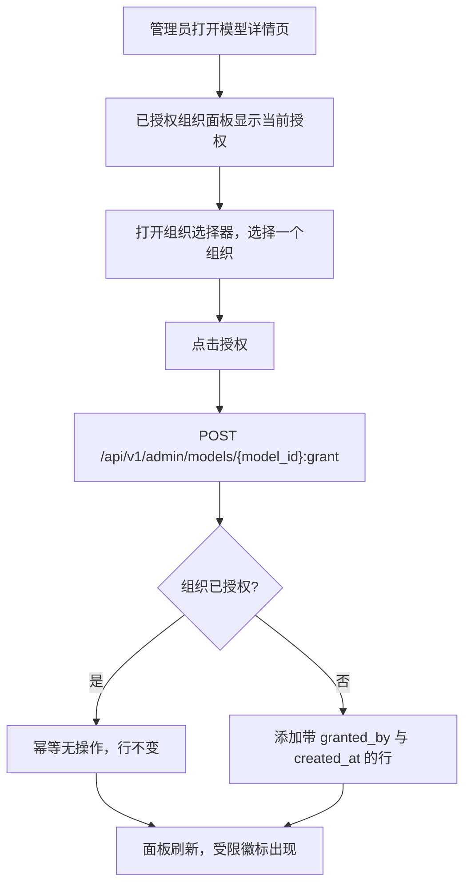
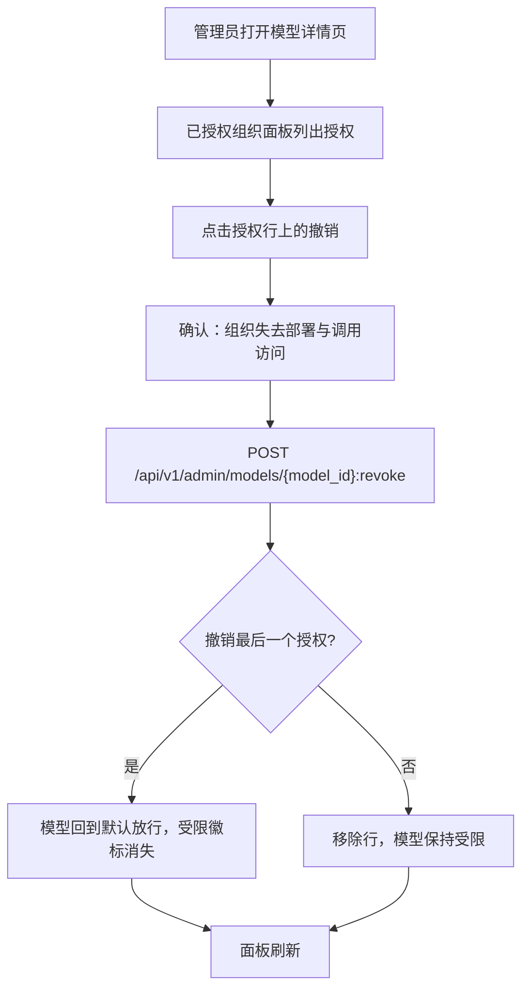
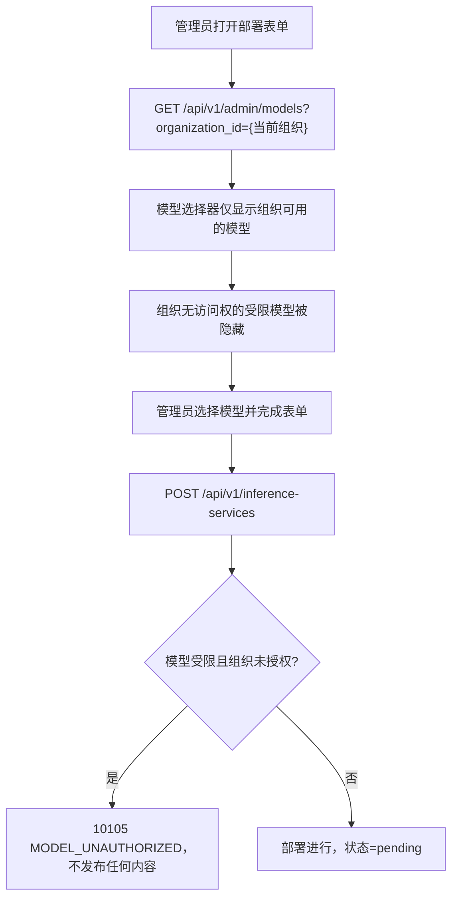
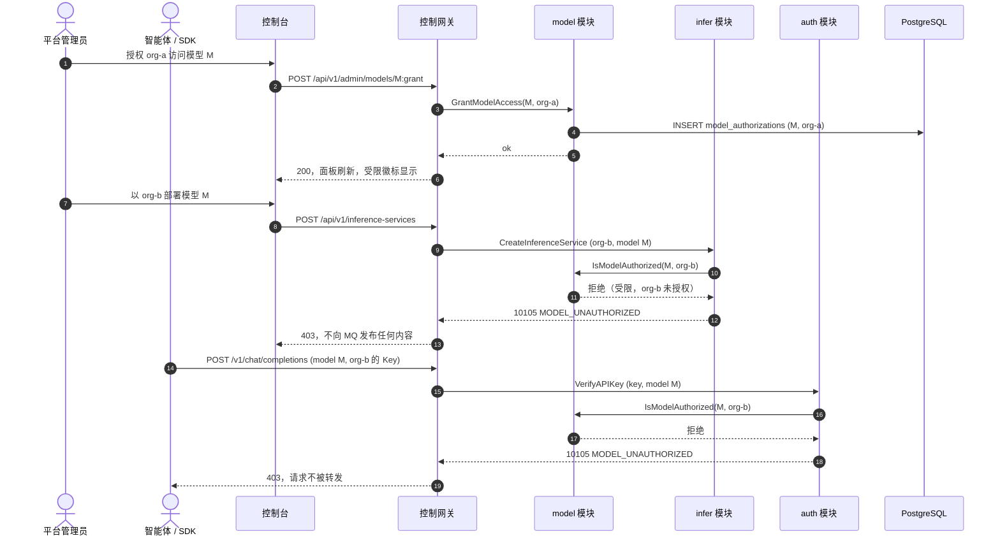

# 按租户模型授权 — 需求分析与 UI/UX 设计

| 属性 | 内容 |
| --- | --- |
| 特性点 | 按租户模型授权 |
| 文档范围 | 限制哪些组织可以部署与调用哪些模型的需求分析与 UI/UX 设计：`model_authorizations` 表、默认放行规则、控制面与数据面强制、四个 `ModelService` RPC、控制台「已授权组织」面板与「受限」徽标，以及验收标准 |
| 归属模块 | `model`（`model_authorizations` 表与四个授权 RPC）、`infer`（`CreateInferenceService` 中的控制面强制）、`auth`（`VerifyAPIKey` 中的数据面强制，激活休眠的 `model` 字段） |
| 相关文档 | [架构设计](./architecture.zh-cn.md) — 第 2.2 节 `model`、第 2.4 节 `infer`、第 2.1 节 `auth` · [模型目录与一键部署](./model-catalog-deployment.zh-cn.md) — 本特性所门控的目录与 `CreateInferenceService`（其第 1.4 节把租户级模型授权延后至此）· [多租户隔离](./multi-tenancy.zh-cn.md) — 本特性所授予的组织实体 |
| 状态 | 设计完成，已移交架构师代理 |

---

## 1. 背景

目录（特性 #3）让管理员注册模型并将其部署为推理服务，且每个资源都归属于某个组织（特性 #6）。平台仍无法表达的是 **「哪些组织可以使用哪些模型」**。今天任何组织都可以部署任何目录模型，任何 API Key 都可以调用任何已部署端点。对于一个销售精选开放模型访问权的 Token-as-a-Service 平台，这是一个治理缺口：运营者可能想把某个高级模型保留给特定租户、把模型门控在合同之后，或在模型验证期间保持其内部可用。本特性在目录之上增加一层按租户授权，采用**默认放行**规则以保留每一个既有部署，并在控制面（谁可以部署）与数据面（谁可以调用）同时强制。

### 1.1 竞品如何实现模型授权

| 产品 | 授权模型 | 强制点 | 默认 | 主要陷阱 |
| --- | --- | --- | --- | --- |
| **OpenAI Platform** | 模型访问是平台级的；通过项目设置与微调模型可见性存在项目级模型限制 | 项目设置；API Key 作用域 | 放行所有平台模型 | 限制粗粒度（项目级而非按模型），且暴露得晚 |
| **Anthropic Console** | 模型访问是账户级的；无按模型租户门控 | 无（所有模型可用） | 放行所有 | 完全没有按模型治理 |
| **Together AI** | 公开开放模型对所有人开放；私有/微调模型门控到所属账户 | 端点创建与推理 | 公开 = 放行，私有 = 仅属主 | 公开/私有二分是二元的，而非授权列表 |
| **SiliconFlow** | 模型广场开放；部分模型需申请/审批后方可使用 | 模型卡片「申请」流程；审批前推理被门控 | 放行，除非模型需审批 | 审批是一次性按用户门控，而非按租户授权 |
| **阿里云百炼（Model Studio）** | 工作空间级模型授权：工作空间必须先被授予模型才能部署或调用它 | 工作空间模型列表；部署与推理 | 未授予即拒绝 | **默认拒绝**模型破坏向后兼容，迫使为每个既有工作空间授权 |
| **火山方舟** | 模型访问绑定账户；部分模型需激活 | 每模型激活流程 | 放行，除非需激活 | 激活是账户级，而非按租户 |
| **Kubernetes（RBAC）** | RoleBinding 授予对资源的动词；无绑定即拒绝 | API server 准入 | **默认拒绝** | 默认拒绝模型对安全边界正确，但对必须保持开放的目录则错误 |

### 1.2 提炼出的模式与决策

值得采纳的模式：

1. **授权列表，而非二元标志** — 有用的原语是「这些组织可以使用此模型」，由 `(model_id, organization_id)` 行列表直接表达，而单个 `public`/`private` 布尔无法表达（Together 的二元拆分过于粗糙）。
2. **在部署与调用两处强制** — 阿里云百炼同时门控部署与推理；只门控部署会让已部署的服务继续为被撤销的租户服务。go-taas 必须在 `CreateInferenceService`（控制面）与 `VerifyAPIKey`（数据面）两处检查。
3. **默认放行以保持向后兼容** — 与 Kubernetes RBAC 的默认拒绝不同，一个一直开放的目录必须保持开放，直到运营者显式限制某个模型。零授权行意味着「所有人」；第一个授权把模型翻转为受限。
4. **一个明确、有文档的错误** — 被阻止的部署与被阻止的调用应返回同一个可识别的错误码，使 SDK 作者与运营者无需猜测即可应对。

需要避免的陷阱：

- **默认拒绝**（阿里云百炼、Kubernetes）— 会静默破坏每个既有租户与每个 e2e 套件；默认放行规则（D2）完全避免迁移。
- **模型行上的布尔** — `restricted` 标志无法表达*哪些*组织被允许，且无论如何都迫使第二张表；授权表是唯一事实来源（D1）。
- **只在部署时强制** — 被撤销的租户若已有在线服务会继续调用；数据面强制闭环（D3）。
- **新错误码** — 平台已为这种情况预留 10105 `CodeModelUnauthorized`；发明新码会使其成为孤儿（D4）。

**go-taas 的决策**（记录依据，遵循自主决策规则）：

| # | 决策 | 依据 |
| --- | --- | --- |
| D1 | **独立的 `model_authorizations` 表** — `model_id`、`organization_id`、复合唯一 `(model_id, organization_id)`、`granted_by`、`created_at` — **而非 models 表上的字段** | 授权列表本质上是多对多；布尔字段无法命名被允许的组织，JSON 数组列不可查询。该表是唯一事实来源，且保持 `models` 不变 |
| D2 | **默认放行规则**：**零**授权行的模型对所有组织可访问；一旦存在**任何**授权行，只有被授权的组织可访问 | 保持向后兼容 — 每个既有模型与每个 e2e 流程无需迁移即可继续工作；第一个授权是限制模型的显式动作 |
| D3 | **在两处强制**：`CreateInferenceService`（控制面）拒绝未被授权组织的部署，`VerifyAPIKey`（数据面）拒绝受限模型被未授权组织的推理调用 — 激活已存在但被忽略的 key 验证请求上的 `model` 字段 | 只门控部署会让被撤销租户的在线服务继续运行；只门控调用会让租户部署其无法使用的模型。两个门共享同一授权检查 |
| D4 | **复用既有 10105 `CodeModelUnauthorized`**（当前为死代码）用于被阻止的部署与调用 | 该码正是为此预留；复用它保持错误面稳定且有文档，避免冗余新码 |

### 1.3 范围边界

**范围内**：`model_authorizations` 表；四个 `ModelService` RPC（授权、撤销、列出授权、按组织过滤的模型列表）；`CreateInferenceService` 中的控制面强制；`VerifyAPIKey` 中的数据面强制；激活 10105；控制台「已授权组织」面板、「受限」徽标与部署表单中的组织感知过滤。

**范围外**（另行跟踪）：按模型定价与消费限制（#5/#8）、模型审批工作流与申请流程（SiliconFlow 风格）、微调/私有模型所有权、按项目（而非按组织）的模型授权（#7 之后）、以及租户自助授权（#7 之后）。

---

## 2. 目标与非目标

**目标**：每个模型的按组织授权列表；保持目录开放直至受限的默认放行规则；在部署与调用两处强制；四个授权 RPC；激活 10105；用于授权/撤销组织的控制台面板、目录上的「受限」徽标、以及部署表单中的组织感知过滤。

**非目标**：默认拒绝强制；按项目模型授权；审批/申请工作流；超出二元受限/开放的模型可见性层级；按模型消费限制；租户自助授权；除 `granted_by` 列之外对谁授权了什么进行审计。

---

## 3. 角色

| 角色 | 描述 | 与模型授权的交互 |
| --- | --- | --- |
| **平台管理员** | 运行集群的运营者；今天也是控制台用户 | 授权与撤销组织对模型的访问，查看「受限」徽标，并按当前组织过滤部署表单 |
| **组织管理员（未来）** | 租户侧管理员 | 将看到其组织可使用哪些模型（按租户限定，#6/#7）；今天他们还不是独立主体 |
| **智能体 / SDK** | 调用 `/v1/chat/completions` 的程序化消费者 | 当调用其组织未被授权的受限模型时遇到 10105 |
| **审计者** | 解决治理或访问争议的人 | 追溯模型的已授权组织以及每个授权的 `granted_by`/`created_at` |

> 术语：消费侧调用方称为 **Agent**（英文）/「智能体」（中文），与仓库约定一致。

---

## 4. 用户旅程

| # | 旅程 | 步骤 |
| --- | --- | --- |
| J1 | **把模型限制给一个租户** | 管理员打开模型详情页 → 看到「已授权组织」面板 → 授权 `org-a` → 目录在模型上显示「受限」徽标 → `org-b` 无法再部署或调用它，`org-a` 可以 |
| J2 | **重新开放模型** | 管理员撤销受限模型上的最后一个授权 → 授权列表为空 → 模型回到默认放行，「受限」徽标消失 → 所有组织可再次部署与调用它 |
| J3 | **带组织感知过滤部署** | 管理员打开部署表单 → 模型选择器被过滤到当前组织可用的模型（若无受限模型则为全部）→ 组织无访问权的受限模型被隐藏 |
| J4 | **智能体撞墙** | 智能体用未授权组织的 Key 调用受限模型 → 网关返回 10105 `MODEL_UNAUTHORIZED` → 管理员授权该组织 → 重试通过 |

---

## 5. 特性需求与验收标准

### FR1 — 授权与撤销模型访问

- **FR1.1** `GrantModelAccess`（`POST /api/v1/admin/models/{model_id}:grant`）添加 `(model_id, organization_id)` 行，`granted_by` 设为调用者，`created_at` 设为当前时间。授权已授权的组织是幂等的（无操作成功）。未知模型 → 10003；未知组织 → 10005。
- **FR1.2** `RevokeModelAccess`（`POST /api/v1/admin/models/{model_id}:revoke`）移除该行。撤销无授权的组织是幂等的（无操作成功）。未知模型 → 10003。
- **FR1.3** 模型上的第一个授权把它从默认放行翻转为受限；撤销最后一个授权把它翻回默认放行。控制台立即反映两种转换。

### FR2 — 查看已授权组织

- **FR2.1** `ListModelAuthorizations`（`GET /api/v1/admin/models/{model_id}/authorizations`）返回模型的授权行（组织 id、granted_by、created_at），分页（默认 20，上限 100），最新在前。未知模型 → 10003。
- **FR2.2** `ListModels` 增加可选 `organization_id` 过滤（`ListAuthorizedModels`）：存在时仅返回给定组织可用的模型 — 若无受限模型则为全部，否则仅返回被授权的模型。这驱动部署表单的模型选择器。

### FR3 — 控制面强制（部署）

- **FR3.1** `CreateInferenceService` 在接受请求前检查模型的授权：若模型受限（有 ≥ 1 授权行）且请求组织不在授权列表中，则返回 **10105 `CodeModelUnauthorized`** 且不向消息队列发布任何内容。
- **FR3.2** 检查是同步的，发生在任何期望状态写入之前，因此被阻止的部署永远不会到达 Controller。

### FR4 — 数据面强制（调用）

- **FR4.1** `VerifyAPIKey` 激活其已存在但被忽略的 `model` 字段：当推理请求指定模型时，网关解析模型的授权，若模型受限且 Key 的组织未被授权，则返回 **10105 `CodeModelUnauthorized`**。
- **FR4.2** 数据面检查按 (org, model) 缓存一小段时间（默认 5 秒）以保持热路径快速，镜像计费门控缓存模式。

### FR5 — 控制台

- **FR5.1** 模型详情页增加「已授权组织」面板（`model-auth-panel`），列出模型的授权行（`model-auth-row-{orgId}`），每行有撤销动作（`model-auth-revoke-{orgId}`），外加授权控件（`model-auth-grant`）与组织选择器（`model-auth-org-select`）。
- **FR5.2** 目录在任何有 ≥ 1 授权行的模型上显示「受限」徽标（`model-restricted-badge`）；零授权的模型不显示徽标。
- **FR5.3** 部署表单的模型选择器通过 `ListAuthorizedModels` 按当前组织过滤；组织无访问权的受限模型被隐藏。

### 验收标准

| # | 标准（Given / When / Then） | 验证 |
| --- | --- | --- |
| AC1 | **Given** 零授权的模型，**when** 对 `org-a` 调用 `GrantModelAccess`，**then** 存储 `(model_id, org-a)` 行并带 `granted_by` 与 `created_at`，模型变为受限 | 单元 + FVT |
| AC2 | **Given** `org-a` 已授权，**when** 再次对 `org-a` 调用 `GrantModelAccess`，**then** 幂等成功且无重复行 | 单元 |
| AC3 | **Given** 受限模型，**when** 对已授权组织调用 `RevokeModelAccess`，**then** 移除该行；撤销最后一个授权使模型回到默认放行 | 单元 + FVT |
| AC4 | **Given** 对 `org-a` 无授权的模型，**when** 对 `org-a` 调用 `RevokeModelAccess`，**then** 幂等成功（无操作） | 单元 |
| AC5 | **Given** 受限模型，**when** 未授权组织调用 `CreateInferenceService`，**then** 返回 10105 `CodeModelUnauthorized` 且不向消息队列发布任何内容 | 单元 + FVT |
| AC6 | **Given** 受限模型，**when** 已授权组织调用 `CreateInferenceService`，**then** 正常进行（状态 `pending`） | FVT |
| AC7 | **Given** 受限模型，**when** 智能体用未授权组织的 Key 调用它，**then** `VerifyAPIKey` 返回 10105 `MODEL_UNAUTHORIZED` 且请求不被转发 | FVT + E2E |
| AC8 | **Given** 受限模型，**when** 智能体用已授权组织的 Key 调用它，**then** 请求被转发并正常计量 | FVT |
| AC9 | **Given** 零授权的模型，**when** 任何组织部署或调用它，**then** 被允许（默认放行保留） | FVT 回归 |
| AC10 | **Given** `ListModelAuthorizations`，**when** 对有授权的模型调用，**then** 返回行最新在前、分页、带 `granted_by` 与 `created_at` | 单元 + FVT |
| AC11 | **Given** 带 `organization_id` 过滤的 `ListModels`，**when** 组织未被授权任何受限模型，**then** 返回所有非受限模型；**when** 组织被授权某些受限模型，**then** 返回这些加上所有非受限模型 | 单元 + FVT |
| AC12 | **Given** 模型详情页，**when** 管理员通过面板授权与撤销组织，**then** 行（`model-auth-row-{orgId}`）内联更新且「受限」徽标相应出现/消失 | E2E |
| AC13 | **Given** 目录，**when** 模型有 ≥ 1 授权，**then** 显示 `model-restricted-badge`；零授权的模型不显示 | E2E |
| AC14 | **Given** 部署表单，**when** 当前组织无访问权的受限模型，**then** 该模型从选择器中隐藏；**when** 组织被授权，**then** 显示 | E2E |

### UX 流程

#### 授权一个组织访问模型

#### 撤销一个组织的访问

#### 带组织感知过滤部署

#### 强制时序（控制面与数据面）

---

## 6. 控制台信息架构

导航：既有 **Models** 组在模型详情页上增加授权面；目录与部署表单就地扩展。

| 页面 / 组件 | 用途 | 关键 testid |
| --- | --- | --- |
| **模型详情页**（`/models/{model_id}`） | 增加「已授权组织」面板：授权行（组织、授权者、创建时间）、每行撤销、带组织选择器的授权控件 | `model-auth-panel`、`model-auth-row-{orgId}`、`model-auth-revoke-{orgId}`、`model-auth-grant`、`model-auth-org-select` |
| **模型页**（`/models`） | 目录行在受限模型上增加「受限」徽标 | `model-restricted-badge` |
| **部署对话框** | 模型选择器通过 `ListAuthorizedModels` 按当前组织过滤 | （复用既有部署表单） |

空状态：授权列表为空时面板显示「未授权任何组织 — 此模型对所有组织开放」；授权选择器从 `ListOrganizations` 列出组织。颜色语言：受限 = 琥珀色徽标；已授权行 = 中性；撤销 = 破坏性红色。面板可见时每 60 秒轮询刷新。

---

## 7. API 面

四个 RPC 都属于 **`taas.model.v1.ModelService`**（proto：`proto/taas/model/v1/model.proto`），经控制网关以 HTTP 形式在 `/api/v1/admin/models/*` 下提供。授权/撤销/列出 RPC 是平台全局的（无需 `X-Organization-Id` — 管理控制台管理所有授权）；`ListModels` 组织过滤是组织限定的。

| RPC | HTTP | 状态 | 用途 |
| --- | --- | --- | --- |
| `GrantModelAccess` | `POST /api/v1/admin/models/{model_id}:grant` | **新增** | 把组织添加到模型的授权列表（幂等） |
| `RevokeModelAccess` | `POST /api/v1/admin/models/{model_id}:revoke` | **新增** | 从模型的授权列表移除组织（幂等） |
| `ListModelAuthorizations` | `GET /api/v1/admin/models/{model_id}/authorizations` | **新增** | 模型的授权行，最新在前，分页 |
| `ListModels`（组织过滤） | `GET /api/v1/admin/models?organization_id={org}` | **扩展** | `ListAuthorizedModels`：组织可用的模型 |

契约约束：

1. `GrantModelAccess`/`RevokeModelAccess` 是幂等的 — 重复同一调用是无操作成功，绝非错误。
2. 存在 `organization_id` 的 `ListModels` 应用默认放行规则：零授权模型始终返回；受限模型仅在组织被授权时返回。
3. `CreateInferenceService`（线上不变）现在对请求组织无访问权的受限模型返回 10105；`VerifyAPIKey`（线上不变）现在遵循其 `model` 字段并对被阻止的调用返回 10105。
4. 线上约定不变：点分分页、成功 HTTP 200、业务错误为 `{"code": <int>, "message": "..."}`、int64 时间戳为 JSON 字符串。

---

## 8. 错误码

模型范围 10101–10199（`pkg/errors/codes.go`）：

| 条件 | 码 | 常量 | 备注 |
| --- | --- | --- | --- |
| 部署或调用被阻止 — 模型受限且组织未授权 | 10105 | `CodeModelUnauthorized` | **激活**（曾是死代码，D4）；HTTP 403 |
| 授权/撤销/列出时未知模型 | 10003 | `CodeModelNotFound` | 既有 |
| 授权时未知组织 | 10005 | `CodeOrganizationNotFound` | 既有 |
| 数据库失败 | 500 | `CodeInternal` | 经错误归一化 |

---

## 9. 开放问题

| 问题 | 倾向 |
| --- | --- |
| 数据面检查缓存是否应长于 5 秒以减少网关负载？ | 保持 5 秒默认；被撤销的组织最多可在缓存窗口内继续调用 — 接受，与计费门控相同 |
| 受限模型是否应从未授权组织的目录中完全隐藏，还是带锁显示？ | 在部署选择器中隐藏（FR5.3）；目录本身对管理所有授权的管理控制台保持可见 |
| 一旦项目承载资源（#7），授权是否应按项目？ | 是，稍后增加可选 `project_id` 列；组织级表是 v1 范围 |
| 是否应把 `granted_by` 审计轨迹扩展为撤销历史？ | v1 否 — 撤销删除行；完整审计轨迹是未来的运维工具 |
| 默认放行最终是否应变为可配置的默认拒绝？ | 是，一旦租户存在（#6/#7），在配置 `model.auth.defaultDeny` 之后；授权表无论哪种方式都相同 |