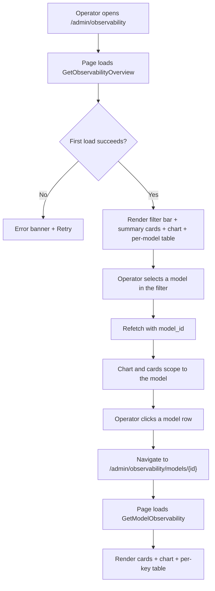
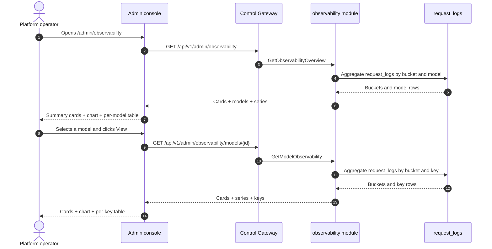

# Model Observability Dashboard — Requirement Analysis and UI/UX Design

| Attribute | Content |
| --- | --- |
| Feature point | Model observability dashboard — per-model latency / throughput / error-rate / token-throughput metrics over time, with time-range and model filters, derived from metering + request logs (backlog row 24) |
| Document scope | Requirement analysis, competitive research, the admin-surface observability pages for `/admin/observability` (fleet overview + per-model drill-down), the end-user-surface observability page for `/models/:modelId/observability`, the page → API surface table, and numbered acceptance criteria |
| Owning modules | `observability` (new — owns the read-only aggregation over `request_logs` and `usage_records`), `web` admin console (`ObservabilityPage`, `ModelObservabilityPage`) and end-user console (`UserModelObservabilityPage`), `pkg/server` gateway (admin-prefix and user-prefix bindings) |
| Related documents | [Architecture Design](./architecture.md) — §2.5 `metering`, §2.6 `billing` · [Request Logs & API Playground](./request-logs-playground.md) — the `request_logs` table and its `latency_ms` / `status` / `error` / token fields this feature aggregates · [Usage Dashboards & Per-Request Cost Attribution](./usage-dashboard.md) — the sibling read-only dashboard and its inline-SVG chart, freshness, and range conventions · [Inference Load Testing](./load-testing.md) — the point-in-time performance measurement this feature complements with continuous time-series · [Console Surface Separation](./console-surface-separation.md) — the two surfaces this feature spans, the `UserShell`/`AdminShell` conventions, the masked-projection rule |
| Status | Design complete, handed to the Architect agent |

---

## 1. Background

go-taas deploys inference services (feature #2), autoscales them (feature #16), meters and bills usage (features #4, #5, #8, #14), and records every request's metadata — latency, status, error, and token counts — in `request_logs` (feature #12). What the console still cannot answer is the operator's and tenant's recurring question: *how is this model actually performing over time?* The load-testing feature (feature #20) measures a service at a point in time under synthetic load; the usage dashboard (feature #9) shows cost and token counts but not latency, throughput, or error rate; and request logs (feature #12) are a raw, per-request table with no aggregation. There is no surface that turns the accumulated request metadata into the continuous performance picture — latency percentiles, requests per second, error rate, and tokens per second — that an operator needs to tune autoscaling targets (feature #16), and that a tenant needs to choose between models and set expectations.

This feature adds a **model observability dashboard**: per-model latency / throughput / error-rate / token-throughput metrics over time, with time-range and model filters, derived from the `request_logs` and `usage_records` the platform already writes. It is a **read-only** aggregation layer — nothing in the inference, metering, or billing pipelines changes. It is the smallest independently valuable increment of Phase 4's productionization roadmap item: it turns "the model is serving" into "the model is serving at X req/s with Y ms p95 latency and Z% errors".

### 1.1 How Comparable Products Expose Model Observability

| Product | Observability surface | Metrics | Time range / filters | Notable pitfalls |
| --- | --- | --- | --- | --- |
| **OpenAI Platform** | Usage page per project/key/model: day-granularity cost and token charts | Tokens, cost; latency/error surfaced only in per-request logs | Day granularity; per-model filter | Usage lag (minutes) confuses debugging; no latency/error-rate time-series; the "today (partial)" marker needs explaining |
| **Anthropic Console** | Per-day, per-model usage with costs; per-request usage viewer | Tokens, cost; latency/error in the per-request viewer | Day granularity; per-model filter | The per-request viewer is admin-only; no aggregated latency/error-rate time-series |
| **Together AI** | Endpoint QPS / latency metrics in the console | QPS, latency per endpoint | Passive monitoring; limited history | Passive metrics, not a configurable time-series; no error-rate or token-throughput aggregation |
| **SiliconFlow** | Per-model, per-day token usage plus balance history | Tokens, cost | Day granularity | No latency/throughput/error-rate; no per-request audit |
| **vLLM observability** | Prometheus metrics endpoint (request latency, throughput, tokens/sec, error counters) | Latency histograms, throughput, tokens/sec, errors | Prometheus time-series; Grafana dashboards | Raw metrics, not a product surface; requires a Prometheus/Grafana stack the operator must run |
| **LiteLLM / Portkey / Langfuse / Helicone** | LLM gateway observability dashboards: latency percentiles, tokens/sec, error rate, cost, per-key/model breakdown | Latency (p50/p90/p95/p99), tokens/sec, error rate, cost, requests | Time range presets; per-model/key filters; charts + tables | Heavy third-party stacks; some are SaaS; latency percentiles and freshness labeling vary |

### 1.2 Distilled Patterns and Decisions

Patterns worth adopting: (1) **summary cards above a metric-switcher time-series chart** — the LLM-gateway dashboards (LiteLLM, Portkey, Langfuse, Helicone) all lead with headline cards (requests, latency, error rate, tokens/sec) above a chart, and one dashboard endpoint serving cards + buckets avoids the N+1-call slow console (the usage-dashboard D1 pattern); (2) **latency percentiles, not just averages** — vLLM and the gateways report p50/p90/p95/p99, because tail latency is what autoscaling and SLOs care about; (3) **a per-model table beside the chart** — the operator needs to compare models at a glance, and the tenant needs to compare their own usage across keys; (4) **freshness labeling** — a data-through timestamp and a pending/partial marker, because usage-lag confusion is the most consistently recorded pitfall (OpenAI, usage-dashboard D4); (5) **time-range presets with a custom picker** — 24 h / 7 d / 30 d / custom is the universal pattern; (6) **inline SVG charts** — the console is deliberately dependency-light (usage-dashboard D7).

Pitfalls to avoid: raw Prometheus metrics as the product surface (vLLM) — the console must curate a small, scannable set; a blocking N+1 dashboard (the slow-console pitfall) — one endpoint returns cards + buckets; averages without percentiles — tail latency is the SLO-relevant number; silently missing pending hours — the freshness marker must be explicit; heavy chart libraries in a dependency-light console; and exposing operator-orchestration internals (service ids, replica counts) to tenants — the tenant surface shows only model-level performance.

**Decisions for go-taas**:

| # | Decision | Rationale |
| --- | --- | --- |
| D1 | **Observability exists on both surfaces, with a clean scope split.** The admin surface (`/admin/observability`, `/api/v1/admin/observability/*`) is a **fleet overview** — all models across all orgs, with a per-model table and a model-filtered time-series, plus a per-model drill-down. The end-user surface (`/models/:modelId/observability`, `/api/v1/models/{model_id}/observability`) is a **single-model, tenant-scoped** view — the tenant's own usage of one model, with a per-key breakdown, and no service ids or operator internals | The operator needs cross-model fleet health to tune autoscaling and capacity (features #16, #20); the tenant needs a performance expectation for a model to choose between models and set SLOs. Splitting by surface follows feature #17's masked-projection rule: a tenant must not see operator orchestration internals, and an operator's fleet view is operator-scoped. Both surfaces share the same metric set and chart component |
| D2 | **Metrics are derived from `request_logs`** (which carry `latency_ms`, `status`, `error`, and the four token counts per request, feature #12), aggregated server-side into time buckets. The four metric families are **latency** (p50/p90/p95/p99 of `latency_ms`), **throughput** (requests/sec), **error rate** (error requests ÷ total requests), and **token throughput** (output tokens/sec, plus input tokens/sec and total tokens) | `request_logs` already captures everything needed and is written alongside the voucher in the same idempotent handler (feature #12); aggregating server-side keeps the payload small and the client dependency-light. The four families are the canonical LLM-serving metrics (vLLM, the gateways) |
| D3 | **One new RPC per surface shape** rather than extending `ListRequestLogs`: `GetObservabilityOverview` (admin fleet: cards + per-model table + model-filtered time-series) and `GetModelObservability` (admin per-model drill-down and end-user single-model view: cards + time-series + per-key breakdown) | The dashboard needs several shapes at once (headline cards, a time series, a per-model/per-key table); bolting them onto `ListRequestLogs` would break its established row semantics, while separate calls recreate the N+1 slow console. A dedicated `observability` module keeps the aggregation concern out of `metering`'s raw-log surface |
| D4 | **Time buckets adapt to the range**: hourly buckets for ranges ≤ 7 days, daily buckets for ranges > 7 days. The range is capped at **92 days** and validation reuses **10404** (the metering range contract) | Hourly granularity for short ranges shows intra-day spikes (the autoscaling-relevant signal); daily for long ranges keeps the payload small. The 92-day cap and 10404 reuse keep the range contract uniform with every metering query (usage-dashboard D6) |
| D5 | **The chart renders with inline SVG** — one bar (or line) per bucket, with a metric switcher (latency / throughput / error rate / tokens/sec) — no new charting dependency | The console is deliberately dependency-light; a small, testable SVG component matches the usage-dashboard D7 decision |
| D6 | **Freshness is explicit**: every response carries `data_through` (the last complete bucket covered by request logs) and the console shows a "data through <time>" note plus a pending/partial marker when the selected range extends past it | Usage-lag confusion is the most consistently recorded pitfall (OpenAI, usage-dashboard D4); the marker keeps the freshness story honest with zero new pipeline work |
| D7 | **The end-user surface is tenant-scoped and masked**: `GetModelObservability` on the user prefix returns only the tenant's own usage of the model, aggregated by API key, with no service ids, no replica counts, and no other tenants' data | Follows feature #17's masked-projection rule and the load-testing D2 pattern: tenants get a performance expectation, not operator internals |
| D8 | **New error codes in an observability block (10701–10799)**: **10701 `CodeObservabilityModelNotFound`** (unknown `model_id`). Range validation reuses **10404** | Observability is a new module (D3), so its codes live in a fresh block after the webhook block (106xx); distinct not-found keeps "unknown model" actionable, while the range contract stays uniform with metering (D4) |
| D9 | **Observability is read-only and audited only for access** — it writes no data and mutates nothing; the pages are reachable only by authenticated sessions with the appropriate role, and no observability mutation is audited (there is nothing to mutate) | The feature is a pure aggregation over existing data; the audit trail (feature #15) already covers the underlying request-log writes. No new audit events are needed |

## 2. Goals and Non-goals

**Goals**: an admin page `/admin/observability` that shows fleet-wide summary cards, a per-model table, and a model-filtered time-series chart with a metric switcher, plus a per-model drill-down `/admin/observability/models/:modelId` (D1, D2, D3, D4, D5, D6); an end-user page `/models/:modelId/observability` showing the tenant's own single-model cards, time-series, and per-key breakdown (D1, D7); the page → API surface table with exact prefixes (D1); per-page interactive states including empty, error, and permission-denied; numbered acceptance criteria testable in Nightwatch against the compose stack.

**Non-goals**: real-time streaming metrics (the request-log cadence stands); anomaly detection or threshold alerts (feature #26 consumes observability events in-console — out of scope here); saved custom views or dashboards; comparing models side-by-side in a chart (v1 shows a per-model table and a single-model chart; a comparison chart is future work); TTFT/TPOT split (v1 reports end-to-end latency percentiles and tokens/sec, not the prefill/decode split); exposing service ids, replica counts, or other operator internals to tenants (D7); any change to the inference, metering, or billing pipelines (read-only feature); new audit events (D9).

## 3. Personas and Journeys

| Role | Surface | Journey |
| --- | --- | --- |
| **Platform operator** | admin | Opens `/admin/observability` → sees fleet summary cards and the per-model table → spots a model with rising p95 latency → filters the chart to that model → drills into `/admin/observability/models/:modelId` → sees the latency spike over time → tunes the autoscaling target (feature #16) |
| **Platform operator (reliability)** | admin | A model's error rate spikes → the operator filters the chart to that model and the affected range → sees the error-rate series → drills into request logs (feature #12) to find the failing requests |
| **Tenant developer / Agent** | end-user | Opens `/models/:modelId/observability` → sees the model's latency percentiles, throughput, error rate, and tokens/sec for their own usage → compares models to choose one → sets an expectation for their application |
| **Tenant finance / capacity planner** | end-user | Watches token throughput and latency for a model over a month → plans capacity and budget → sees the per-key breakdown to attribute usage to their own API keys |

> Terminology: the consumer-side caller is an **Agent** in English and 「智能体」 in Chinese, consistent with the repository convention.

## 4. Feature Requirements

### FR1 — Admin fleet overview

- **FR1.1** `GetObservabilityOverview` (`GET /api/v1/admin/observability`) returns the fleet-wide observability for a time range and optional model filter: summary cards, a per-model table, and a model-filtered time-series. It takes `since`/`until` (unix seconds; defaults `until = now`, `since = until − 24h`), `model_id` (optional), and `organization_id` (optional, via `X-Organization-Id`). `since > until` or a range > 92 days returns **10404** (D4).
- **FR1.2** The response's `cards` carry `request_count`, `error_count`, `error_rate` (derived client-side as error ÷ requests), `avg_latency_ms`, `p95_latency_ms`, `output_tokens_per_sec`, `input_tokens_per_sec`, and `data_through` (the last complete bucket covered by request logs) (D2, D6).
- **FR1.3** The response's `models[]` carry one row per model in the range: `model_id`, `model_name`, `request_count`, `error_rate`, `p95_latency_ms`, `avg_latency_ms`, `output_tokens_per_sec`, and `data_through`. The table is sorted by `request_count` descending by default.
- **FR1.4** The response's `series[]` carry one entry per time bucket (hourly for ranges ≤ 7 days, daily otherwise, D4): `bucket` (unix seconds), `request_count`, `error_count`, `error_rate`, `avg_latency_ms`, `p95_latency_ms`, `output_tokens_per_sec`, `input_tokens_per_sec`. When `model_id` is set, the series is for that model; otherwise it is fleet-wide.

### FR2 — Admin per-model drill-down

- **FR2.1** `GetModelObservability` (`GET /api/v1/admin/observability/models/{model_id}`) returns the single-model observability for a time range: summary cards, a time-series, and a per-API-key breakdown. It takes `since`/`until` (same defaults and 10404 range rule as FR1.1). An unknown `model_id` returns **10701 `CodeObservabilityModelNotFound`** (D8).
- **FR2.2** The response's `cards` and `series[]` mirror FR1.2/FR1.4 scoped to the model. The `keys[]` carry one row per API key that used the model in the range: `api_key_id`, `api_key_name`, `request_count`, `error_rate`, `p95_latency_ms`, `output_tokens_per_sec`.

### FR3 — End-user single-model view

- **FR3.1** `GetModelObservability` (`GET /api/v1/models/{model_id}/observability`) returns the **tenant's own** single-model observability for a time range: summary cards, a time-series, and a per-API-key breakdown. It takes `since`/`until` (same defaults and 10404 range rule). An unknown `model_id` returns **10701** (D8).
- **FR3.2** The response is scoped to the caller's organization (D7): it aggregates only the tenant's own `request_logs` for the model, and the `keys[]` carry only the tenant's own API keys. It exposes **no** service ids, replica counts, or other tenants' data (D7).

### FR4 — Surface and API binding

- **FR4.1** The admin observability pages live on the **admin surface**: routes `/admin/observability` and `/admin/observability/models/:modelId`, API prefix `/api/v1/admin/observability/*`. They are added to the `AdminShell` navigation (feature #17) as "Observability".
- **FR4.2** The end-user observability page lives on the **end-user surface**: route `/models/:modelId/observability`, API prefix `/api/v1/models/{model_id}/observability`. It is reached from the model detail page `/models/:modelId` (feature #19) via an "Observability" tab or link.
- **FR4.3** The admin pages call only `/api/v1/admin/observability/*` routes; the end-user page calls only `/api/v1/models/{model_id}/observability`. Neither contains the other surface's prefix string (feature #17, D1).
- **FR4.4** The end-user page never exposes operator internals (service ids, replica counts) and never aggregates other tenants' data (D7).

## 5. UI Design

### 5.1 Page: `/admin/observability` — Observability (admin)

**Purpose**: give the platform operator a fleet-wide view of model performance — latency, throughput, error rate, and token throughput over time — to tune autoscaling and capacity.

**Surface**: admin — route `/admin/observability`, API `/api/v1/admin/observability/*`.

**Layout**: rendered inside `AdminShell` (feature #17). A page header ("Observability", subtitle "Model performance over time") with a **Refresh** action (secondary). Below the header:

1. **Filter bar** — a **Time range** control (presets 24 h / 7 d / 30 d / custom with a date-time picker) and a **Model** filter (dropdown, "All models" default). Changing either refetches.
2. **Summary cards** — a row of cards: **Requests**, **Error rate**, **Avg latency**, **p95 latency**, **Output tokens/sec**, **Input tokens/sec**. Each card shows the value for the selected range and model filter, with a "data through <time>" freshness note (D6).
3. **Time-series chart** — an inline-SVG chart (D5) with a **metric switcher** (Latency / Throughput / Error rate / Tokens/sec). One bar (or line) per bucket; when a model is selected the series is that model, otherwise fleet-wide.
4. **Per-model table** — the fleet's models with columns: **Model** (link to the drill-down), **Requests**, **Error rate**, **Avg latency**, **p95 latency**, **Output tokens/sec**, **Data through**. Row action **View** opens the drill-down.

**Interactive states**:

| State | Behaviour |
| --- | --- |
| Default | Filter bar + summary cards + chart + per-model table render from the first successful load; last-updated shows the load time |
| Loading | Skeleton cards and table; Refresh is disabled |
| Empty | "No request data in this range." with a hint to widen the range; the filter bar stays visible |
| Error | An error banner with the message and a Retry button; the page keeps its last good data with a "Showing stale data" banner |
| Disabled | Refresh is disabled while a load is in flight; the metric switcher is disabled while a refetch is in flight |
| Permission-denied | A session without the required role receives 10036 and the page shows the standard permission-denied state (feature #17) with a link back to the admin home |

**Per-model table columns**: Model (link), Requests, Error rate, Avg latency, p95 latency, Output tokens/sec, Data through. Sortable by Requests, Error rate, Avg latency, p95 latency, and Output tokens/sec. Filterable by the Model dropdown; paginated.

### 5.2 Page: `/admin/observability/models/:modelId` — Model Observability (admin)

**Purpose**: show one model's performance over time — cards, time-series, and a per-API-key breakdown — so the operator can investigate a single model's latency, throughput, error rate, and token throughput.

**Surface**: admin — route `/admin/observability/models/:modelId`, API `/api/v1/admin/observability/models/{model_id}`.

**Layout**: a detail page under `AdminShell` with a back link to the overview. A header with the model name. Below:

1. **Filter bar** — a **Time range** control (presets 24 h / 7 d / 30 d / custom).
2. **Summary cards** — the same card set as §5.1, scoped to the model.
3. **Time-series chart** — the inline-SVG chart with the metric switcher, scoped to the model.
4. **Per-key table** — the API keys that used the model with columns: **API key** (name), **Requests**, **Error rate**, **Avg latency**, **p95 latency**, **Output tokens/sec**.

**Interactive states**: identical to §5.1, with the empty copy "No request data for this model in this range." and the not-found state for an unknown `model_id` (10701) showing the standard not-found state with a link back to the overview.

**Per-key table columns**: API key (name), Requests, Error rate, Avg latency, p95 latency, Output tokens/sec. Sortable by Requests, Error rate, Avg latency, p95 latency, and Output tokens/sec. Paginated.

### 5.3 Page: `/models/:modelId/observability` — Model Observability (end-user)

**Purpose**: give a tenant developer / Agent a view of their own usage of one model — latency, throughput, error rate, and token throughput over time — to choose between models and set expectations.

**Surface**: end-user — route `/models/:modelId/observability`, API `/api/v1/models/{model_id}/observability`.

**Layout**: rendered inside `UserShell` (feature #17). A page header with the model name and a back link to the model detail page `/models/:modelId` (feature #19). Below:

1. **Filter bar** — a **Time range** control (presets 24 h / 7 d / 30 d / custom).
2. **Summary cards** — the same card set as §5.1, scoped to the tenant's own usage of the model (D7).
3. **Time-series chart** — the inline-SVG chart with the metric switcher, scoped to the tenant's own usage.
4. **Per-key table** — the tenant's own API keys that used the model with columns: **API key** (name), **Requests**, **Error rate**, **Avg latency**, **p95 latency**, **Output tokens/sec**.

**Interactive states**: identical to §5.2, with the empty copy "No request data for this model in this range." and the permission-denied copy for the tenant's own errors (10005 org gone / 10017 org disabled from §8.2 of feature #17, 10027/10038 redirect per FR4.3). The page exposes no service ids or operator internals (D7).

**Per-key table columns**: identical to §5.2, scoped to the tenant's own keys. Sortable and paginated as in §5.2.

### 5.4 Flow

## 6. API Surface Implications

All observability RPCs belong to the **`observability` module** (D3), served as HTTP via the Control Gateway. Admin routes are on the **admin prefix** `/api/v1/admin/observability/*` (D1); the end-user route is on the **user prefix** `/api/v1/models/{model_id}/observability` (D1).

| RPC | Route | Prefix | Status | Purpose |
| --- | --- | --- | --- | --- |
| `GetObservabilityOverview` | `GET /api/v1/admin/observability` | admin | **new** | Fleet cards + per-model table + model-filtered time-series |
| `GetModelObservability` | `GET /api/v1/admin/observability/models/{model_id}` · `GET /api/v1/models/{model_id}/observability` | admin · user | **new** | Single-model cards + time-series + per-key breakdown (admin: all orgs; user: tenant-scoped) |

**Contract notes for the Architect agent**:

1. `GetObservabilityOverview` validates `since`/`until` (int64 unix seconds; defaults `until = now`, `since = until − 24h`); `since > until` or a range > 92 days returns 10404 (D4). `model_id` and `organization_id` are optional filters.
2. `GetModelObservability` validates the same range contract; an unknown `model_id` returns 10701 (D8). On the user prefix it is scoped to the caller's organization (D7) and exposes no service ids or operator internals.
3. Buckets are hourly for ranges ≤ 7 days and daily otherwise (D4); each bucket carries `bucket`, `request_count`, `error_count`, `error_rate`, `avg_latency_ms`, `p95_latency_ms`, `output_tokens_per_sec`, `input_tokens_per_sec`. `error_rate` is derived client-side (error ÷ requests); the wire carries integer counts and integer milliseconds only.
4. Every response carries `data_through` (the last complete bucket covered by request logs) for the freshness marker (D6).
5. Aggregation reads `request_logs` (feature #12) — `latency_ms`, `status`, `error`, and the four token counts per request — and `usage_records` where token totals are needed; it writes nothing (D9).
6. Wire conventions unchanged: dotted pagination where lists apply, HTTP 200 on success, business errors as `{"code": <int>, "message": "..."}`, int64 fields serialized as JSON strings.

Error codes (observability block 10701–10799, `pkg/errors/codes.go`):

| Condition | Code | Constant | Notes |
| --- | --- | --- | --- |
| An unknown `model_id` | 10701 | `CodeObservabilityModelNotFound` | **New** (D8) |
| A malformed or over-long range | 10404 | `CodeRequestLogRangeInvalid` | Reused (D4) — the metering range contract |
| Database / infrastructure failure | 500 | `CodeInternal` | Via error normalization |

## 7. Acceptance Criteria

| # | Criterion | Level |
| --- | --- | --- |
| AC1 | `GetObservabilityOverview` with a valid range returns summary cards, a per-model table, and a time-series; a range > 92 days or `since > until` returns 10404 | FVT |
| AC2 | `GetObservabilityOverview` with a `model_id` filter returns cards and a series scoped to that model | FVT |
| AC3 | `GetModelObservability` (admin) returns single-model cards, a time-series, and a per-key breakdown; an unknown `model_id` returns 10701 | FVT |
| AC4 | `GetModelObservability` (user) returns only the caller's organization's usage of the model, aggregated by the tenant's own API keys, with no service ids or operator internals | FVT |
| AC5 | Buckets are hourly for ranges ≤ 7 days and daily for ranges > 7 days; every response carries `data_through` | FVT |
| AC6 | The `/admin/observability` page renders the filter bar, summary cards, the inline-SVG chart, and the per-model table from the first successful load, with a last-updated timestamp | E2E |
| AC7 | Changing the time range or model filter refetches and re-renders the cards, chart, and table; the metric switcher toggles the chart metric | E2E |
| AC8 | The empty state ("No request data in this range.") renders when no data matches; a failed load keeps the last good data with a "Showing stale data" banner and a Retry action | E2E |
| AC9 | The `/admin/observability/models/:modelId` page renders the model's cards, chart, and per-key table; an unknown model shows the not-found state | E2E |
| AC10 | The `/models/:modelId/observability` page renders the tenant's own cards, chart, and per-key table, with no service ids or operator internals visible | E2E |
| AC11 | The admin observability pages are reachable only on the admin surface: routes `/admin/observability` and `/admin/observability/models/:modelId`, every API call uses the `/api/v1/admin/observability/*` prefix with no `/api/v1/models/*` string | E2E (surface separation) |
| AC12 | The end-user observability page is reachable only on the end-user surface: route `/models/:modelId/observability`, every API call uses the `/api/v1/models/{model_id}/observability` prefix with no `/api/v1/admin/*` string | E2E (surface separation) |
| AC13 | A session without the required role receives 10036 on the admin observability pages and the page shows the standard permission-denied state | E2E |

## 8. Out of Scope (tracked elsewhere)

| Item | Where |
| --- | --- |
| Real-time streaming metrics | Future refinement — the request-log cadence stands |
| Anomaly detection / threshold alerts | Feature #26 consumes observability events in-console — out of scope here |
| Saved custom views / dashboards | Future refinement |
| Comparing models side-by-side in a chart | Future refinement — v1 shows a per-model table and a single-model chart |
| TTFT/TPOT split | Future refinement — v1 reports end-to-end latency percentiles and tokens/sec |
| Tenant visibility of operator orchestration internals (service ids, replica counts) | Deliberately absent (D7) |
| Any change to the inference, metering, or billing pipelines | Deliberately absent — read-only feature (D9) |
| New audit events for observability access | Deliberately absent — nothing to mutate (D9) |