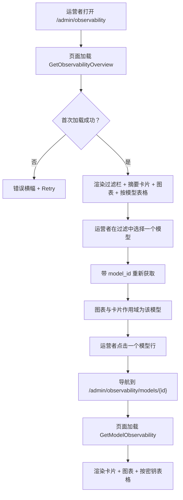
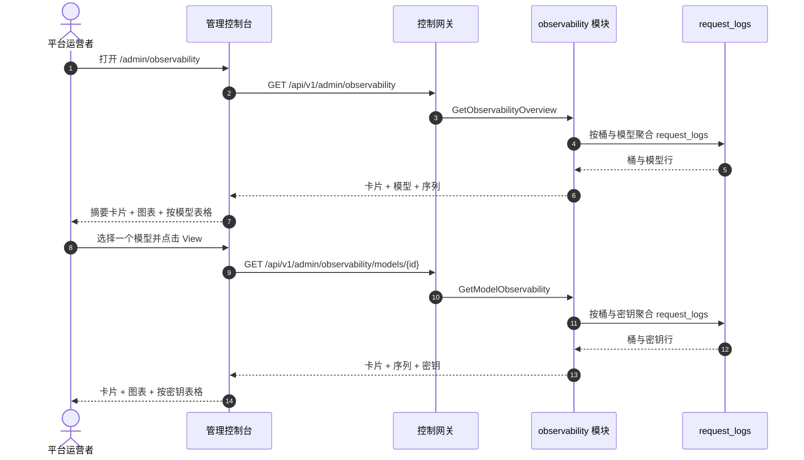

# 模型可观测性仪表盘 — 需求分析与 UI/UX 设计

| 属性 | 内容 |
| --- | --- |
| 特性点 | 模型可观测性仪表盘 — 按模型展示随时间变化的延迟 / 吞吐 / 错误率 / Token 吞吐指标，带时间范围与模型过滤，由计量与请求日志派生（backlog 第 24 行） |
| 文档范围 | 需求分析与 UI/UX 设计：`/admin/observability` 管理面可观测性页面（集群总览 + 按模型下钻），`/models/:modelId/observability` 终端用户面可观测性页面，页面 → API 面映射表，以及编号验收标准 |
| 归属模块 | `observability`（新增 — 拥有对 `request_logs` 与 `usage_records` 的只读聚合），`web` 管理控制台（`ObservabilityPage`、`ModelObservabilityPage`）与终端用户控制台（`UserModelObservabilityPage`），`pkg/server` 网关（管理前缀与用户前缀绑定） |
| 相关文档 | [架构设计](./architecture.zh-cn.md) — 第 2.5 节 `metering`、第 2.6 节 `billing` · [请求日志与 API 游乐场](./request-logs-playground.zh-cn.md) — 本特性聚合的 `request_logs` 表及其 `latency_ms` / `status` / `error` / token 字段 · [用量仪表盘与按请求成本归因](./usage-dashboard.zh-cn.md) — 姊妹只读仪表盘及其内联 SVG 图表、新鲜度与范围约定 · [推理负载测试](./load-testing.zh-cn.md) — 本特性以连续时间序列补充的时点性能测量 · [控制台面分离](./console-surface-separation.zh-cn.md) — 本特性横跨的两个面、`UserShell`/`AdminShell` 约定、掩码投影规则 |
| 状态 | 设计完成，已移交架构师代理 |

---

## 1. 背景与竞品调研

go-taas 部署推理服务（特性 #2）、自动扩缩（特性 #16）、计量与计费（特性 #4、#5、#8、#14），并在 `request_logs` 中记录每个请求的元数据 — 延迟、状态、错误与 token 计数（特性 #12）。控制台仍然无法回答运营者与租户反复提出的问题：*这个模型随时间表现如何？* 负载测试特性（特性 #20）在合成负载下于某个时点测量服务；用量仪表盘（特性 #9）显示成本与 token 计数，但不显示延迟、吞吐或错误率；请求日志（特性 #12）是原始、按请求的表格，没有聚合。没有任何面把累积的请求元数据转化为运营者调优自动扩缩目标（特性 #16）所需的连续性能图景 — 延迟百分位、每秒请求数、错误率与每秒 token 数 — 以及租户在模型间选择并设定预期所需的图景。

本特性新增**模型可观测性仪表盘**：按模型展示随时间变化的延迟 / 吞吐 / 错误率 / Token 吞吐指标，带时间范围与模型过滤，由平台已写入的 `request_logs` 与 `usage_records` 派生。它是**只读**聚合层 — 推理、计量或计费流水线没有任何变化。这是 Phase 4 生产化路线图项中最小可独立交付的增量：它把「模型在服务」变成「模型以 X req/s、Y ms p95 延迟与 Z% 错误率在服务」。

### 1.1 竞品的模型可观测性呈现

| 产品 | 可观测性面 | 指标 | 时间范围 / 过滤 | 主要陷阱 |
| --- | --- | --- | --- | --- |
| **OpenAI Platform** | 每个项目/密钥/模型的 Usage 页面：日粒度成本与 token 图表 | Token、成本；延迟/错误仅在按请求日志中呈现 | 日粒度；按模型过滤 | 用量滞后（分钟级）困扰调试；无延迟/错误率时间序列；「today (partial)」标记需要解释 |
| **Anthropic Console** | 按日、按模型的用量与成本；按请求用量查看器 | Token、成本；延迟/错误在按请求查看器中 | 日粒度；按模型过滤 | 按请求查看器仅管理员可用；无聚合的延迟/错误率时间序列 |
| **Together AI** | 控制台中的端点 QPS / 延迟指标 | QPS、每端点延迟 | 被动监控；历史有限 | 被动指标，非可配置时间序列；无错误率或 token 吞吐聚合 |
| **SiliconFlow** | 按模型、按日的 token 用量加余额历史 | Token、成本 | 日粒度 | 无延迟/吞吐/错误率；无按请求审计 |
| **vLLM 可观测性** | Prometheus 指标端点（请求延迟、吞吐、token/秒、错误计数器） | 延迟直方图、吞吐、token/秒、错误 | Prometheus 时间序列；Grafana 仪表盘 | 原始指标，非产品面；需要运营者自行运行的 Prometheus/Grafana 栈 |
| **LiteLLM / Portkey / Langfuse / Helicone** | LLM 网关可观测性仪表盘：延迟百分位、token/秒、错误率、成本、按密钥/模型拆分 | 延迟（p50/p90/p95/p99）、token/秒、错误率、成本、请求数 | 时间范围预设；按模型/密钥过滤；图表 + 表格 | 重型第三方栈；部分为 SaaS；延迟百分位与新鲜度标注各不相同 |

### 1.2 提炼出的模式与决策

值得采纳的模式：(1) **指标切换图表上方的摘要卡片** — LLM 网关仪表盘（LiteLLM、Portkey、Langfuse、Helicone）都以头部卡片（请求数、延迟、错误率、token/秒）加图表开场，一个仪表盘端点同时返回卡片与桶避免了 N+1 慢控制台（usage-dashboard D1 模式）；(2) **延迟百分位，而非仅平均值** — vLLM 与网关都报告 p50/p90/p95/p99，因为尾部延迟才是自动扩缩与 SLO 关心的；(3) **图表旁的按模型表格** — 运营者需要一眼比较模型，租户需要跨密钥比较自己的用量；(4) **新鲜度标注** — data-through 时间戳与 pending/partial 标记，因为用量滞后困惑是最常被记录的陷阱（OpenAI、usage-dashboard D4）；(5) **带自定义选择器的时间范围预设** — 24 h / 7 d / 30 d / custom 是通用模式；(6) **内联 SVG 图表** — 控制台刻意依赖精简（usage-dashboard D7）。

需要避免的陷阱：把原始 Prometheus 指标作为产品面（vLLM）— 控制台必须精选小而可扫读的集合；阻塞式 N+1 仪表盘（慢控制台陷阱）— 一个端点返回卡片 + 桶；只有平均值没有百分位 — 尾部延迟才是 SLO 相关数字；静默缺失 pending 小时 — 新鲜度标记必须显式；在依赖精简的控制台中使用重型图表库；以及向租户暴露运营者编排内部信息（服务 id、副本数）— 租户面只显示模型级性能。

**go-taas 的决策**：

| # | 决策 | 依据 |
| --- | --- | --- |
| D1 | **可观测性存在于两个面，作用域清晰拆分。** 管理面（`/admin/observability`、`/api/v1/admin/observability/*`）是**集群总览** — 跨所有组织的所有模型，带按模型表格与按模型过滤的时间序列，外加按模型下钻。终端用户面（`/models/:modelId/observability`、`/api/v1/models/{model_id}/observability`）是**单模型、租户作用域**视图 — 租户自己对一个模型的用量，带按密钥拆分，且无服务 id 或运营者内部信息 | 运营者需要跨模型集群健康来调优自动扩缩与容量（特性 #16、#20）；租户需要一个模型的性能预期来在模型间选择并设定 SLO。按面拆分遵循特性 #17 的掩码投影规则：租户绝不能看到运营者编排内部信息，运营者的集群视图也是运营者作用域。两个面共享相同的指标集与图表组件 |
| D2 | **指标由 `request_logs` 派生**（每请求携带 `latency_ms`、`status`、`error` 与四个 token 计数，特性 #12），在服务端聚合为时间桶。四个指标族为**延迟**（`latency_ms` 的 p50/p90/p95/p99）、**吞吐**（每秒请求数）、**错误率**（错误请求 ÷ 总请求）与 **token 吞吐**（每秒输出 token，外加每秒输入 token 与总 token） | `request_logs` 已捕获所需的一切，并在同一幂等处理器中与 voucher 一起写入（特性 #12）；服务端聚合保持负载小且客户端依赖精简。四个指标族是规范的 LLM 服务指标（vLLM、网关） |
| D3 | **每个面形状一个 RPC**，而非扩展 `ListRequestLogs`：`GetObservabilityOverview`（管理面集群：卡片 + 按模型表格 + 按模型过滤的时间序列）与 `GetModelObservability`（管理面按模型下钻与终端用户面单模型视图：卡片 + 时间序列 + 按密钥拆分） | 仪表盘需要多种形状（头部卡片、时间序列、按模型/按密钥表格）；把它们塞进 `ListRequestLogs` 会破坏其既有行语义，而分开调用会重现 N+1 慢控制台。专用 `observability` 模块把聚合关注点从 `metering` 的原始日志面中分离出来 |
| D4 | **时间桶随范围自适应**：范围 ≤ 7 天用小时桶，范围 > 7 天用日桶。范围上限 **92 天**，校验复用 **10404**（计量范围契约） | 短范围的小时粒度显示日内尖峰（自动扩缩相关信号）；长范围的日粒度保持负载小。92 天上限与 10404 复用让范围契约与每个计量查询统一（usage-dashboard D6） |
| D5 | **图表用内联 SVG 渲染** — 每桶一个柱（或线），带指标切换器（延迟 / 吞吐 / 错误率 / token/秒）— 无新图表依赖 | 控制台刻意依赖精简；小而可测试的 SVG 组件与 usage-dashboard D7 决策一致 |
| D6 | **新鲜度显式**：每个响应携带 `data_through`（请求日志覆盖的最后一个完整桶），控制台显示「data through <time>」说明，并在所选范围超出它时显示 pending/partial 标记 | 用量滞后困惑是最常被记录的陷阱（OpenAI、usage-dashboard D4）；标记以零新流水线工作保持新鲜度故事诚实 |
| D7 | **终端用户面是租户作用域且掩码**：用户前缀的 `GetModelObservability` 只返回租户自己对模型的用量，按 API Key 聚合，无服务 id、无副本数、无其他租户数据 | 遵循特性 #17 的掩码投影规则与 load-testing D2 模式：租户得到性能预期，而非运营者内部信息 |
| D8 | **observability 块（10701–10799）新增错误码**：**10701 `CodeObservabilityModelNotFound`**（未知 `model_id`）。范围校验复用 **10404** | 可观测性是新模块（D3），因此其错误码放在 webhook 块（106xx）之后的全新块中；不同的 not-found 让「未知模型」可操作，而范围契约与计量保持统一（D4） |
| D9 | **可观测性是只读且仅对访问审计** — 它不写数据、不改变任何东西；页面仅对具有相应角色的已认证会话可达，且无可观测性变更被审计（没有可变更的东西） | 该特性是对既有数据的纯聚合；审计轨迹（特性 #15）已覆盖底层请求日志写入。无需新增审计事件 |

## 2. 目标与非目标

**目标**：一个管理面页面 `/admin/observability`，显示集群级摘要卡片、按模型表格与带指标切换器的按模型过滤时间序列图表，外加按模型下钻 `/admin/observability/models/:modelId`（D1、D2、D3、D4、D5、D6）；一个终端用户面页面 `/models/:modelId/observability`，显示租户自己的单模型卡片、时间序列与按密钥拆分（D1、D7）；页面 → API 面映射表，含精确前缀（D1）；每页交互状态，包括空、错误与权限拒绝；可在 Nightwatch 中针对 compose 栈测试的编号验收标准。

**非目标**：实时流式指标（请求日志节奏不变）；异常检测或阈值告警（特性 #26 在控制台内消费可观测性事件 — 此处不在范围内）；保存的自定义视图或仪表盘；在图表中并排比较模型（v1 显示按模型表格与单模型图表；比较图表是未来工作）；TTFT/TPOT 拆分（v1 报告端到端延迟百分位与 token/秒，而非 prefill/decode 拆分）；向租户暴露服务 id、副本数或其他运营者内部信息（D7）；对推理、计量或计费流水线的任何更改（只读特性）；新增审计事件（D9）。

## 3. 角色与旅程

| 角色 | 面 | 旅程 |
| --- | --- | --- |
| **平台运营者** | admin | 打开 `/admin/observability` → 看到集群摘要卡片与按模型表格 → 发现一个 p95 延迟上升的模型 → 把图表过滤到该模型 → 下钻到 `/admin/observability/models/:modelId` → 看到随时间变化的延迟尖峰 → 调优自动扩缩目标（特性 #16） |
| **平台运营者（可靠性）** | admin | 一个模型的错误率飙升 → 运营者把图表过滤到该模型与受影响范围 → 看到错误率序列 → 下钻到请求日志（特性 #12）找到失败请求 |
| **租户开发者 / 智能体** | end-user | 打开 `/models/:modelId/observability` → 看到模型对自己用量的延迟百分位、吞吐、错误率与 token/秒 → 比较模型以选择 → 为应用设定预期 |
| **租户财务 / 容量规划者** | end-user | 观察一个模型一个月的 token 吞吐与延迟 → 规划容量与预算 → 看到按密钥拆分以把用量归因到自己的 API Key |

> 术语：消费侧调用方在英文中为 **Agent**，中文为「智能体」，与仓库约定一致。

## 4. 功能需求

### FR1 — 管理面集群总览

- **FR1.1** `GetObservabilityOverview`（`GET /api/v1/admin/observability`）返回时间范围与可选模型过滤下的集群级可观测性：摘要卡片、按模型表格与按模型过滤的时间序列。它接收 `since`/`until`（unix 秒；默认 `until = now`、`since = until − 24h`）、`model_id`（可选）与 `organization_id`（可选，经 `X-Organization-Id`）。`since > until` 或范围 > 92 天返回 **10404**（D4）。
- **FR1.2** 响应的 `cards` 携带 `request_count`、`error_count`、`error_rate`（客户端派生为 error ÷ requests）、`avg_latency_ms`、`p95_latency_ms`、`output_tokens_per_sec`、`input_tokens_per_sec` 与 `data_through`（请求日志覆盖的最后一个完整桶）（D2、D6）。
- **FR1.3** 响应的 `models[]` 携带范围内每个模型一行：`model_id`、`model_name`、`request_count`、`error_rate`、`p95_latency_ms`、`avg_latency_ms`、`output_tokens_per_sec` 与 `data_through`。表格默认按 `request_count` 降序排序。
- **FR1.4** 响应的 `series[]` 携带每个时间桶一项（范围 ≤ 7 天为小时，否则为日，D4）：`bucket`（unix 秒）、`request_count`、`error_count`、`error_rate`、`avg_latency_ms`、`p95_latency_ms`、`output_tokens_per_sec`、`input_tokens_per_sec`。当设置 `model_id` 时，序列针对该模型；否则为集群级。

### FR2 — 管理面按模型下钻

- **FR2.1** `GetModelObservability`（`GET /api/v1/admin/observability/models/{model_id}`）返回时间范围下的单模型可观测性：摘要卡片、时间序列与按 API Key 拆分。它接收 `since`/`until`（默认与 10404 范围规则同 FR1.1）。未知 `model_id` 返回 **10701 `CodeObservabilityModelNotFound`**（D8）。
- **FR2.2** 响应的 `cards` 与 `series[]` 镜像 FR1.2/FR1.4，作用域为该模型。`keys[]` 携带范围内使用该模型的每个 API Key 一行：`api_key_id`、`api_key_name`、`request_count`、`error_rate`、`p95_latency_ms`、`output_tokens_per_sec`。

### FR3 — 终端用户面单模型视图

- **FR3.1** `GetModelObservability`（`GET /api/v1/models/{model_id}/observability`）返回**租户自己**的时间范围下的单模型可观测性：摘要卡片、时间序列与按 API Key 拆分。它接收 `since`/`until`（默认与 10404 范围规则同 FR1.1）。未知 `model_id` 返回 **10701**（D8）。
- **FR3.2** 响应作用域为调用者的组织（D7）：它只聚合租户自己对模型的 `request_logs`，`keys[]` 只携带租户自己的 API Key。它暴露**无**服务 id、副本数或其他租户数据（D7）。

### FR4 — 面与 API 绑定

- **FR4.1** 管理面可观测性页面位于**管理面**：路由 `/admin/observability` 与 `/admin/observability/models/:modelId`，API 前缀 `/api/v1/admin/observability/*`。它们加入 `AdminShell` 导航（特性 #17），名为「Observability」。
- **FR4.2** 终端用户面可观测性页面位于**终端用户面**：路由 `/models/:modelId/observability`，API 前缀 `/api/v1/models/{model_id}/observability`。它从模型详情页 `/models/:modelId`（特性 #19）经「Observability」标签或链接到达。
- **FR4.3** 管理面页面只调用 `/api/v1/admin/observability/*` 路由；终端用户面页面只调用 `/api/v1/models/{model_id}/observability`。两者都不包含对方面的前缀字符串（特性 #17，D1）。
- **FR4.4** 终端用户面页面绝不暴露运营者内部信息（服务 id、副本数），也绝不聚合其他租户数据（D7）。

## 5. UI 设计

### 5.1 页面：`/admin/observability` — Observability（管理面）

**目的**：给平台运营者一个集群级模型性能视图 — 随时间变化的延迟、吞吐、错误率与 token 吞吐 — 以调优自动扩缩与容量。

**面**：admin — 路由 `/admin/observability`，API `/api/v1/admin/observability/*`。

**布局**：在 `AdminShell`（特性 #17）内渲染。页面头部（「Observability」，副标题「Model performance over time」）带 **Refresh** 操作（次）。头部下方：

1. **过滤栏** — **Time range** 控件（预设 24 h / 7 d / 30 d / custom，带日期时间选择器）与 **Model** 过滤（下拉，默认「All models」）。任一变更都会重新获取。
2. **摘要卡片** — 一行卡片：**Requests**、**Error rate**、**Avg latency**、**p95 latency**、**Output tokens/sec**、**Input tokens/sec**。每张卡片显示所选范围与模型过滤下的值，带「data through <time>」新鲜度说明（D6）。
3. **时间序列图表** — 内联 SVG 图表（D5），带**指标切换器**（Latency / Throughput / Error rate / Tokens/sec）。每桶一个柱（或线）；选择模型时序列针对该模型，否则为集群级。
4. **按模型表格** — 集群的模型，列：**Model**（链接到下钻）、**Requests**、**Error rate**、**Avg latency**、**p95 latency**、**Output tokens/sec**、**Data through**。行操作 **View** 打开下钻。

**交互状态**：

| 状态 | 行为 |
| --- | --- |
| 默认 | 过滤栏 + 摘要卡片 + 图表 + 按模型表格在首次成功加载后渲染；last-updated 显示加载时间 |
| 加载中 | 骨架卡片与表格；Refresh 禁用 |
| 空 | 「No request data in this range.」带提示扩大范围；过滤栏保持可见 |
| 错误 | 带消息与 Retry 按钮的错误横幅；页面保留最后的好数据并显示「Showing stale data」横幅 |
| 禁用 | 加载进行中 Refresh 禁用；重新获取进行中指标切换器禁用 |
| 权限拒绝 | 无所需角色的会话收到 10036，页面显示标准权限拒绝状态（特性 #17），带返回管理首页的链接 |

**按模型表格列**：Model（链接）、Requests、Error rate、Avg latency、p95 latency、Output tokens/sec、Data through。可按 Requests、Error rate、Avg latency、p95 latency 与 Output tokens/sec 排序。可按 Model 下拉过滤；分页。

### 5.2 页面：`/admin/observability/models/:modelId` — Model Observability（管理面）

**目的**：展示一个模型随时间变化的性能 — 卡片、时间序列与按 API Key 拆分 — 让运营者调查单个模型的延迟、吞吐、错误率与 token 吞吐。

**面**：admin — 路由 `/admin/observability/models/:modelId`，API `/api/v1/admin/observability/models/{model_id}`。

**布局**：`AdminShell` 下的详情页，带返回总览的返回链接。头部含模型名称。下方：

1. **过滤栏** — **Time range** 控件（预设 24 h / 7 d / 30 d / custom）。
2. **摘要卡片** — 与第 5.1 节相同的卡片集，作用域为该模型。
3. **时间序列图表** — 带指标切换器的内联 SVG 图表，作用域为该模型。
4. **按密钥表格** — 使用该模型的 API Key，列：**API key**（名称）、**Requests**、**Error rate**、**Avg latency**、**p95 latency**、**Output tokens/sec**。

**交互状态**：与第 5.1 节相同，空文案为「No request data for this model in this range.」，未知 `model_id`（10701）的未找到状态显示标准未找到状态，带返回总览的链接。

**按密钥表格列**：API key（名称）、Requests、Error rate、Avg latency、p95 latency、Output tokens/sec。可按 Requests、Error rate、Avg latency、p95 latency 与 Output tokens/sec 排序。分页。

### 5.3 页面：`/models/:modelId/observability` — Model Observability（终端用户面）

**目的**：给租户开发者 / 智能体一个视图，查看自己对一个模型的用量 — 随时间变化的延迟、吞吐、错误率与 token 吞吐 — 以在模型间选择并设定预期。

**面**：end-user — 路由 `/models/:modelId/observability`，API `/api/v1/models/{model_id}/observability`。

**布局**：在 `UserShell`（特性 #17）内渲染。页面头部含模型名称与返回模型详情页 `/models/:modelId`（特性 #19）的返回链接。下方：

1. **过滤栏** — **Time range** 控件（预设 24 h / 7 d / 30 d / custom）。
2. **摘要卡片** — 与第 5.1 节相同的卡片集，作用域为租户自己对模型的用量（D7）。
3. **时间序列图表** — 带指标切换器的内联 SVG 图表，作用域为租户自己的用量。
4. **按密钥表格** — 使用该模型的租户自己的 API Key，列：**API key**（名称）、**Requests**、**Error rate**、**Avg latency**、**p95 latency**、**Output tokens/sec**。

**交互状态**：与第 5.2 节相同，空文案为「No request data for this model in this range.」，权限拒绝文案为租户自身错误（10005 组织消失 / 10017 组织禁用，来自特性 #17 第 8.2 节；10027/10038 按 FR4.3 重定向）。页面不暴露服务 id 或运营者内部信息（D7）。

**按密钥表格列**：与第 5.2 节相同，作用域为租户自己的密钥。排序与分页同第 5.2 节。

### 5.4 流程

## 6. API 面影响

所有可观测性 RPC 都属于 **`observability` 模块**（D3），通过控制网关以 HTTP 提供。管理面路由在**管理前缀** `/api/v1/admin/observability/*`（D1）；终端用户面路由在**用户前缀** `/api/v1/models/{model_id}/observability`（D1）。

| RPC | 路由 | 前缀 | 状态 | 目的 |
| --- | --- | --- | --- | --- |
| `GetObservabilityOverview` | `GET /api/v1/admin/observability` | admin | **新增** | 集群卡片 + 按模型表格 + 按模型过滤的时间序列 |
| `GetModelObservability` | `GET /api/v1/admin/observability/models/{model_id}` · `GET /api/v1/models/{model_id}/observability` | admin · user | **新增** | 单模型卡片 + 时间序列 + 按密钥拆分（admin：所有组织；user：租户作用域） |

**给架构师代理的契约说明**：

1. `GetObservabilityOverview` 校验 `since`/`until`（int64 unix 秒；默认 `until = now`、`since = until − 24h`）；`since > until` 或范围 > 92 天返回 10404（D4）。`model_id` 与 `organization_id` 为可选过滤。
2. `GetModelObservability` 校验相同的范围契约；未知 `model_id` 返回 10701（D8）。在用户前缀上它作用域为调用者的组织（D7），且不暴露服务 id 或运营者内部信息。
3. 桶在范围 ≤ 7 天时为小时，否则为日（D4）；每个桶携带 `bucket`、`request_count`、`error_count`、`error_rate`、`avg_latency_ms`、`p95_latency_ms`、`output_tokens_per_sec`、`input_tokens_per_sec`。`error_rate` 由客户端派生（error ÷ requests）；线上只携带整数计数与整数毫秒。
4. 每个响应携带 `data_through`（请求日志覆盖的最后一个完整桶）用于新鲜度标记（D6）。
5. 聚合读取 `request_logs`（特性 #12）— 每请求的 `latency_ms`、`status`、`error` 与四个 token 计数 — 以及需要 token 总数时的 `usage_records`；它不写任何东西（D9）。
6. 线上约定不变：列表用点分页，成功返回 HTTP 200，业务错误为 `{"code": <int>, "message": "..."}`，int64 字段序列化为 JSON 字符串。

错误码（observability 块 10701–10799，`pkg/errors/codes.go`）：

| 条件 | 代码 | 常量 | 说明 |
| --- | --- | --- | --- |
| 未知 `model_id` | 10701 | `CodeObservabilityModelNotFound` | **新增**（D8） |
| 格式错误或超长范围 | 10404 | `CodeRequestLogRangeInvalid` | 复用（D4）— 计量范围契约 |
| 数据库 / 基础设施故障 | 500 | `CodeInternal` | 经错误归一化 |

## 7. 验收标准

| # | 标准 | 级别 |
| --- | --- | --- |
| AC1 | `GetObservabilityOverview` 用有效范围返回摘要卡片、按模型表格与时间序列；范围 > 92 天或 `since > until` 返回 10404 | FVT |
| AC2 | `GetObservabilityOverview` 带 `model_id` 过滤返回作用域为该模型的卡片与序列 | FVT |
| AC3 | `GetModelObservability`（admin）返回单模型卡片、时间序列与按密钥拆分；未知 `model_id` 返回 10701 | FVT |
| AC4 | `GetModelObservability`（user）只返回调用者组织对模型的用量，按租户自己的 API Key 聚合，无服务 id 或运营者内部信息 | FVT |
| AC5 | 桶在范围 ≤ 7 天时为小时，范围 > 7 天时为日；每个响应携带 `data_through` | FVT |
| AC6 | `/admin/observability` 页面在首次成功加载后渲染过滤栏、摘要卡片、内联 SVG 图表与按模型表格，带 last-updated 时间戳 | E2E |
| AC7 | 更改时间范围或模型过滤会重新获取并重新渲染卡片、图表与表格；指标切换器切换图表指标 | E2E |
| AC8 | 无数据匹配时渲染空状态（「No request data in this range.」）；加载失败保留最后的好数据并显示「Showing stale data」横幅与 Retry 操作 | E2E |
| AC9 | `/admin/observability/models/:modelId` 页面渲染模型的卡片、图表与按密钥表格；未知模型显示未找到状态 | E2E |
| AC10 | `/models/:modelId/observability` 页面渲染租户自己的卡片、图表与按密钥表格，无服务 id 或运营者内部信息可见 | E2E |
| AC11 | 管理面可观测性页面仅在管理面可达：路由 `/admin/observability` 与 `/admin/observability/models/:modelId`，每个 API 调用使用 `/api/v1/admin/observability/*` 前缀且不含 `/api/v1/models/*` 字符串 | E2E（面分离） |
| AC12 | 终端用户面可观测性页面仅在终端用户面可达：路由 `/models/:modelId/observability`，每个 API 调用使用 `/api/v1/models/{model_id}/observability` 前缀且不含 `/api/v1/admin/*` 字符串 | E2E（面分离） |
| AC13 | 无所需角色的会话在管理面可观测性页面收到 10036，页面显示标准权限拒绝状态 | E2E |

## 8. 不在范围内（另行跟踪）

| 项 | 位置 |
| --- | --- |
| 实时流式指标 | 未来细化 — 请求日志节奏不变 |
| 异常检测 / 阈值告警 | 特性 #26 在控制台内消费可观测性事件 — 此处不在范围内 |
| 保存的自定义视图 / 仪表盘 | 未来细化 |
| 在图表中并排比较模型 | 未来细化 — v1 显示按模型表格与单模型图表 |
| TTFT/TPOT 拆分 | 未来细化 — v1 报告端到端延迟百分位与 token/秒 |
| 租户可见运营者编排内部信息（服务 id、副本数） | 刻意省略（D7） |
| 对推理、计量或计费流水线的任何更改 | 刻意省略 — 只读特性（D9） |
| 可观测性访问的新增审计事件 | 刻意省略 — 无可变更的东西（D9） |