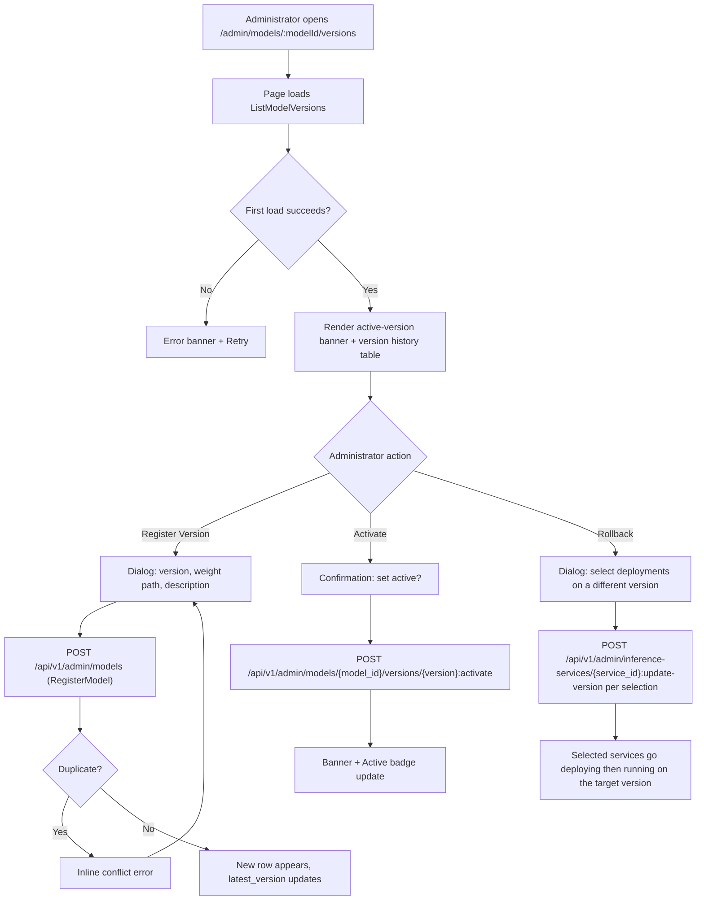
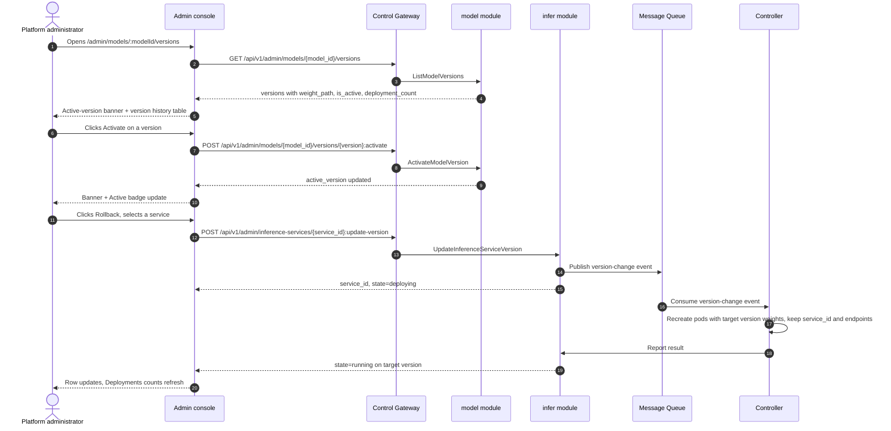

# Model Versioning & Rollback — Requirement Analysis and UI/UX Design

| Attribute | Content |
| --- | --- |
| Feature point | Model versioning & rollback — manage model versions (register, activate, rollback), view version history, and roll back a deployment to a previous version (backlog row 32) |
| Document scope | Requirement analysis, competitive research, the admin-surface model-versions page for `/admin/models/:modelId/versions`, the page → API surface table, and numbered acceptance criteria |
| Owning modules | `model` (version history, activation, registration), `infer` (in-place version change / rollback of an inference service), `web` admin console (`ModelVersionsPage`), `controller` (reconcile a version-change event) |
| Related documents | [Architecture Design](./architecture.md) — §2.2 `model`, §2.4 `infer`, §3.1 (admin/user surface separation) · [Model Catalog & One-Click Deployment](./model-catalog-deployment.md) — the catalog, the `model_versions` table, the deploy form, and the delete+recreate rule · [Console Surface Separation](./console-surface-separation.md) — the two surfaces, the `AdminShell` conventions, the masked-projection rule |
| Status | Design complete, handed to the Architect agent |

---

## 1. Background and Competitive Research

### 1.1 Why Model Versioning and Rollback Come Now

go-taas already registers model versions (`model_versions` rows under a `models` catalog entry) and pins a `model_version` on every inference service (model-catalog-deployment §3.2/§3.3). What the console still cannot do is *manage* those versions: there is no version-history page, no notion of a default/active version that new deployments honor, and no way to roll a running deployment back to a previous version when a new one misbehaves. The operator must delete and recreate a service to change its version, which changes the `service_id` and breaks Agents pointing at the old endpoints.

This feature adds a **model versioning & rollback** surface: view a model's full version history, register a new version, activate a version as the default for new deployments, and roll a deployment back to a previous version in place (same `service_id`, same endpoints). It is the smallest independently valuable increment of Phase 4's model-lifecycle roadmap item: it turns "the newest version is broken" into "activate the previous version and roll the affected deployments back to it".

### 1.2 How Comparable Products Implement Versioning and Rollback

| Product | Version history | Activation / stage | Rollback | Notable pitfalls |
| --- | --- | --- | --- | --- |
| **Hugging Face** | Model versions are git revisions (commits/tags); the model page shows the revision tree and pinned revision | A revision can be pinned as the default for the repo | Rollback = checkout/pin an older revision | Git semantics leak into the product surface; non-technical users find revisions confusing |
| **MLflow Model Registry** | Version list with stage, timestamp, and registering user | Stages: Staging / Production / Archived; a version is transitioned between stages | Transition a different version to Production (the serving stage) | Stage transitions are manual and easy to mis-click; no guard against archiving the serving version |
| **Vertex AI Model Registry** | Version list with aliases, timestamps, and deployment status | Aliases (e.g. `default`); a version can be assigned an alias | Redeploy an older version; alias reassignment | Alias and deployment are separate concepts that users conflate |
| **SageMaker Model Registry** | Model-package versions with approval status and metadata | Approval status: PendingManualApproval / Approved / Rejected | Deploy a previously Approved version | Approval workflow is heavyweight for a small platform; version metadata is verbose |
| **Azure ML** | Model versions with tags and registration time | Tags and a default version per model | Redeploy a specific version | Version and deployment are loosely coupled; rollback is implicit |

### 1.3 Distilled Patterns and Decisions

Patterns worth adopting:

1. **Version history as a table** — every surveyed product shows versions in a table with version id, timestamp, and a status/stage badge. The table is the anchor for "activate this" and "roll back to this".
2. **A default/active version concept** — MLflow's Production stage, Vertex's `default` alias, and Azure's default version all give the operator a way to say "new deployments use this version", decoupled from "the newest registered version".
3. **Immutable versions** — versions are never edited; you register a new one or roll back to an existing one. This keeps the history append-only and auditable.
4. **Rollback is a version change on the deployment** — Vertex and SageMaker roll back by pointing the deployment at an older version, not by recreating the deployment identity.

Pitfalls to avoid:

- **Leaking git semantics** (Hugging Face) — go-taas versions are opaque strings (`2024-09-11`, `v0.1-rc1`), not commits; the UI must not invent a revision tree.
- **Manual, unguarded stage transitions** (MLflow) — activating a version must be explicit and confirmable, and rolling back must warn that Agents on the affected endpoints will see the version change.
- **Heavyweight approval workflows** (SageMaker) — go-taas needs a single active version, not a multi-stage approval pipeline.
- **Conflating alias and deployment** (Vertex) — go-taas separates "activate the default version" (model module) from "roll a specific deployment back" (infer module); the UI keeps them as distinct actions.

**Decisions for go-taas** (recorded rationale, per the autonomous-decision rule):

| # | Decision | Rationale |
| --- | --- | --- |
| D1 | **Version management lives on the admin surface only**: `/admin/models/:modelId/versions` + `/api/v1/admin/models/{model_id}/versions/*`. There is **no end-user surface** — tenants consume the active/latest version through the gateway and never manage versions | Version management is operator-orchestration (feature #17's masked-projection rule); tenants pick a model, not a version. Consistent with the admin-only accelerator inventory (feature #18) |
| D2 | **Add an active-version concept**: one version per model is marked active (the default for new deployments). Stored as `is_active` on `model_versions` with a partial unique index `(model_id) WHERE is_active` | Activation is the go-taas analogue of MLflow's Production stage / Vertex's `default` alias; it decouples "the version new deployments default to" from "the newest registered version" |
| D3 | **Registering a new version reuses the existing `RegisterModel` RPC** (name + version + weight_path + description); the version page's "Register Version" dialog pre-fills the model name and calls it | `RegisterModel` already appends a version to an existing model (model-catalog-deployment FR1.2); no new registration RPC is needed |
| D4 | **A new `ListModelVersions` RPC** returns the full version history with per-version metadata (version, weight_path, created_at, is_active, deployment_count) — richer than `GetModel`'s `repeated string versions` | The version page needs weight paths, active state, and per-version deployment counts; `GetModel`'s string list is insufficient |
| D5 | **A new `ActivateModelVersion` RPC** sets the active version; activating is idempotent and only one version can be active per model | Activation is a first-class operation (feature-point scope); the partial unique index enforces one active per model |
| D6 | **Rollback is an in-place version change on the inference service**: a new `UpdateInferenceServiceVersion` RPC changes a service's `model_version` while keeping the same `service_id` and endpoints; the service goes through `deploying` then back to `running` | "Roll back a deployment to a previous version" means the same endpoint serves the old version; delete+recreate (model-catalog-deployment D5) would change the `service_id` and break Agents. The Controller reconciles a version-change event by recreating pods with the new weights while keeping the service identity |
| D7 | **The rollback entry point is on the version-history page**: each version row offers "Rollback", opening a dialog listing the deployments currently running a different version, with checkboxes to select which to roll back | Keeps the feature self-contained on the feature point's route while the underlying API lives on the infer module |
| D8 | **The deploy form (model-catalog-deployment FR3.1) defaults to the active version when one is set**, falling back to `latest_version` otherwise | Activation is meaningful only if new deployments honor it; the fallback preserves existing behavior |

### 1.4 Scope Boundary

**In scope**: a model-versions page (version history with active/latest badges, weight path, created date, per-version deployment counts), registering a new version, activating a version as the default, and rolling a deployment back to a previous version in place.

**Out of scope** (tracked by other feature points): the model catalog list and one-click deployment form (#2), image versioning and the image×card adaptation matrix (#3), tenant-level model authorization (#6), deployment history & audit (#34 — the audit trail of create/update/scale/rollback events), and canary/blue-green upgrades.

---

## 2. User Roles

| Role | Description | Interaction with model versioning |
| --- | --- | --- |
| **Platform administrator** | The operator who curates which models the platform serves and how | Views version history, registers new versions, activates a default version, and rolls deployments back to a previous version |
| **Agent / SDK** | The programmatic consumer that calls `/v1/chat/completions` | Never touches version management; consumes the active/latest version through the gateway with an API Key |

> Terminology: the consumer-side caller is called an **Agent** (English) / 「智能体」(Chinese), consistent with the repo convention. This feature is admin-only, so the consumer-side terminology does not apply to a tenant surface.

---

## 3. User Stories

| # | As a… | I want to… | So that… |
| --- | --- | --- | --- |
| US1 | Platform administrator | open a model and see its full version history with weight paths, created dates, and which version is active | I understand what versions exist and which one new deployments will use |
| US2 | Platform administrator | register a new version of an existing model from the version page | I can ship a model update without leaving the console |
| US3 | Platform administrator | activate a version as the default for new deployments | new deployments use the version I choose, not necessarily the newest |
| US4 | Platform administrator | roll a deployment back to a previous version in place | a broken new version stops affecting Agents without changing the endpoint |
| US5 | Platform administrator | see how many deployments run each version | I know the blast radius before activating or rolling back |
| US6 | Agent / SDK | call a deployed model through its endpoint with my API Key | I get completions from whatever version the operator has pinned, without knowing about versioning |

---

## 4. Functional Requirements

### FR1 — Version history

- **FR1.1** `ListModelVersions` (`GET /api/v1/admin/models/{model_id}/versions`) returns the model's versions, newest first (the model-catalog-deployment ordering rule: `created_at DESC, version DESC`), each with `version`, `weight_path`, `created_at`, `is_active`, and `deployment_count` (the number of non-terminated inference services pinned to that version).
- **FR1.2** The response also carries the model's `name`, `model_id`, and `active_version` (the currently active version string, empty if none is set).
- **FR1.3** An unknown `model_id` returns 10101 `CodeModelNotFound`.

### FR2 — Register a new version

- **FR2.1** The version page offers a "Register Version" action opening a dialog with: **Version** (required, 1–64 chars), **Weight path** (required, object-storage path, same syntax rules as model-catalog-deployment FR1.3), **Description** (optional, ≤ 1024 chars). The model name is pre-filled and read-only.
- **FR2.2** Submitting calls `RegisterModel` with the model's name and the new version; a duplicate name+version returns 10102 `CodeModelExists` shown inline.
- **FR2.3** On success the new version appears in the history with `is_active=false` and `deployment_count=0`; `latest_version` updates to the new version if it is the newest.

### FR3 — Activate a version

- **FR3.1** Each non-active version row offers "Activate", opening a confirmation dialog: "Set `<version>` as the active version? New deployments will default to it."
- **FR3.2** `ActivateModelVersion` (`POST /api/v1/admin/models/{model_id}/versions/{version}:activate`) sets the version active and clears the previous active version; it is idempotent (activating the already-active version is a no-op success).
- **FR3.3** An unknown version returns 10103 `CodeModelVersionNotFound`; the active version is shown in the page's active-version banner and as an "Active" badge on the row.

### FR4 — Roll back a deployment

- **FR4.1** Each version row offers "Rollback", opening a dialog listing the non-terminated inference services currently pinned to a **different** version, each with a checkbox (default unchecked), the service name, its current version, and its state.
- **FR4.2** Confirming calls `UpdateInferenceServiceVersion` (`POST /api/v1/admin/inference-services/{service_id}:update-version`) for each selected service, changing its `model_version` to the row's version while keeping the same `service_id` and endpoints; the service goes through `deploying` then back to `running`.
- **FR4.3** An unknown service returns 10301 `CodeInferServiceNotFound`; a service in a state that cannot be updated (e.g. `terminated`) returns 10303 `CodeInferServiceStateInvalid`; an unknown target version returns 10103 `CodeModelVersionNotFound`.
- **FR4.4** The dialog warns: "Agents calling the selected services' endpoints will see the version change." The confirmation button is disabled until at least one service is selected.

### FR5 — Deploy-form default

- **FR5.1** The deploy form (model-catalog-deployment FR3.1) pre-fills the **active** version when one is set, falling back to `latest_version` otherwise (D8).

---

## 5. Page and Flow Design

### 5.1 Surface Assignment

| Feature | Surface | Web route | API prefix |
| --- | --- | --- | --- |
| Model version history | admin | `/admin/models/:modelId/versions` | `/api/v1/admin/models/{model_id}/versions/*` |
| Register a new version | admin | `/admin/models/:modelId/versions` (dialog) | `/api/v1/admin/models` |
| Activate a version | admin | `/admin/models/:modelId/versions` (dialog) | `/api/v1/admin/models/{model_id}/versions/{version}:activate` |
| Roll back a deployment | admin | `/admin/models/:modelId/versions` (dialog) | `/api/v1/admin/inference-services/{service_id}:update-version` |

Every page and API call above is on the **admin surface**; there is no end-user surface (D1). Admin pages never call a `/api/v1/*` route, and the admin session realm is used throughout.

### 5.2 Page Map

| Page / component | Purpose |
| --- | --- |
| **Model Versions page** (`/admin/models/:modelId/versions`) | Version history with active/latest badges, weight path, created date, per-version deployment counts; register, activate, and rollback actions |
| **Register Version dialog** | Version, weight path, description (FR2) |
| **Activate confirmation dialog** | Set a version active (FR3) |
| **Rollback dialog** | Select deployments to roll back to a version (FR4) |

### 5.3 Page: `/admin/models/:modelId/versions` — Model Versions (admin)

**Purpose**: give the platform administrator a single surface to manage a model's versions — view history, register a new version, activate a default, and roll deployments back to a previous version.

**Surface**: admin — route `/admin/models/:modelId/versions`, API `/api/v1/admin/models/{model_id}/versions/*` (plus `/api/v1/admin/inference-services/{service_id}:update-version` for rollback, D7).

**Layout**: rendered inside `AdminShell` (feature #17). A page header ("Model Versions", subtitle with the model name and `model_id`) with a **Back to Models** link (secondary) and a **Register Version** action (primary). Below:

1. **Active-version banner** — a card showing the currently active version (or "No active version — new deployments use the latest") and a note that new deployments default to it (D2, D8).
2. **Version history table** — columns: **Version**, **Status** (Active / Latest badges, independent), **Weight path**, **Created**, **Deployments** (count of non-terminated services on this version), **Actions** (Activate / Rollback / Deploy).

**Interactive states**:

| State | Behaviour |
| --- | --- |
| Default | Active-version banner + version history table render from the first successful load |
| Loading | Skeleton table; Register Version is disabled |
| Empty | "No versions registered for this model." with a hint to register the first version; the banner stays visible |
| Error | An error banner with the message and a Retry button; the page keeps its last good data with a "Showing stale data" banner |
| Disabled | Register Version is disabled while a load or a mutation is in flight; Activate/Rollback are disabled on the active version's row |
| Permission-denied | A session without the required role receives 10036 and the page shows the standard permission-denied state (feature #17) with a link back to the admin home |

**Version history table columns**: Version, Status (Active / Latest badges), Weight path, Created, Deployments, Actions. Sortable by Version, Created, and Deployments. Filterable by status (All / Active / Latest). Paginated (`offset`/`limit`, default 20, max 100).

**Register Version dialog**: fields **Version** (required, 1–64 chars), **Weight path** (required, object-storage path, syntax-validated), **Description** (optional, ≤ 1024 chars). Model name shown read-only. Validation errors inline; duplicate version shows "A version with this name already exists." Submit calls `RegisterModel`; on success the dialog closes and the new row appears.

**Activate confirmation dialog**: "Set `<version>` as the active version? New deployments will default to it." with **Cancel** (secondary) and **Activate** (primary). On success the banner and the row badges update.

**Rollback dialog**: lists the non-terminated services pinned to a different version, each with a checkbox, service name, current version, and state. A warning: "Agents calling the selected services' endpoints will see the version change." **Cancel** (secondary) and **Roll back** (primary, disabled until at least one service is selected). On success the affected rows' Deployments counts and the services' versions update.

### 5.4 Flows

---

## 6. API Surface Implications

The version-history and activation RPCs belong to the **`model` module** (D4, D5); the rollback RPC belongs to the **`infer` module** (D6). All are served as HTTP via the Control Gateway on the **admin prefix** `/api/v1/admin/*` (D1). There is **no user-prefix binding** (D1).

| RPC | Route | Prefix | Status | Purpose |
| --- | --- | --- | --- | --- |
| `ListModelVersions` (`taas.model.v1`) | `GET /api/v1/admin/models/{model_id}/versions` | admin | **new** | Version history with metadata + per-version deployment counts |
| `ActivateModelVersion` (`taas.model.v1`) | `POST /api/v1/admin/models/{model_id}/versions/{version}:activate` | admin | **new** | Set the active/default version |
| `RegisterModel` (`taas.model.v1`) | `POST /api/v1/admin/models` | admin | existing | Register a new version (reused, D3) |
| `UpdateInferenceServiceVersion` (`taas.infer.v1`) | `POST /api/v1/admin/inference-services/{service_id}:update-version` | admin | **new** | Roll a deployment back to a previous version in place (D6) |

**Contract notes for the Architect agent**:

1. `ListModelVersions` returns the model's `name`, `model_id`, `active_version`, and `versions[]` (each with `version`, `weight_path`, `created_at`, `is_active`, `deployment_count`), newest first (FR1.1, FR1.2).
2. `ActivateModelVersion` sets `is_active=true` on the target version and `false` on the previous active version in one transaction; the partial unique index `(model_id) WHERE is_active` enforces one active per model (D2, D5).
3. `UpdateInferenceServiceVersion` changes only `model_version`; it keeps `service_id`, endpoints, and all other spec fields, and publishes a version-change event to the message queue. The service transitions `running → deploying → running` (D6).
4. `RegisterModel` is unchanged; the version page reuses it with the model's name pre-filled (D3).
5. Wire conventions unchanged: HTTP 200 on success, business errors as `{"code": <int>, "message": "..."}`, int64 fields serialized as JSON strings.

Error codes (existing blocks, `pkg/errors/codes.go`):

| Condition | Code | Constant | Notes |
| --- | --- | --- | --- |
| Unknown `model_id` | 10101 | `CodeModelNotFound` | `ListModelVersions`, `ActivateModelVersion` |
| Duplicate name+version | 10102 | `CodeModelExists` | `RegisterModel` (FR2.2) |
| Unknown version | 10103 | `CodeModelVersionNotFound` | `ActivateModelVersion`, `UpdateInferenceServiceVersion` |
| Unknown service | 10301 | `CodeInferServiceNotFound` | `UpdateInferenceServiceVersion` |
| Service state not updatable | 10303 | `CodeInferServiceStateInvalid` | `UpdateInferenceServiceVersion` on e.g. `terminated` (FR4.3) |

---

## 7. Acceptance Criteria

| # | Criterion | Level |
| --- | --- | --- |
| AC1 | `ListModelVersions` returns the model's `name`, `model_id`, `active_version`, and `versions[]` newest first, each with `version`, `weight_path`, `created_at`, `is_active`, and `deployment_count`; an unknown `model_id` returns 10101 | FVT |
| AC2 | `ActivateModelVersion` sets the target version active and clears the previous active version; only one version is active per model; activating the already-active version is a no-op success; an unknown version returns 10103 | FVT |
| AC3 | `UpdateInferenceServiceVersion` changes only `model_version`, keeps `service_id` and endpoints, and transitions the service `running → deploying → running`; an unknown service returns 10301, an unknown version returns 10103, and a `terminated` service returns 10303 | FVT |
| AC4 | The `/admin/models/:modelId/versions` page renders the active-version banner and the version history table from the first successful load, with Active/Latest badges, weight path, created date, and per-version deployment counts | E2E |
| AC5 | Registering a new version from the dialog calls `RegisterModel` and the new row appears with `is_active=false` and `deployment_count=0`; a duplicate version shows an inline conflict error | E2E |
| AC6 | Activating a version updates the active-version banner and the row's Active badge; the confirmation dialog is shown before the call | E2E |
| AC7 | The rollback dialog lists only non-terminated services on a different version, disables the confirm button until at least one is selected, and after confirming the affected services transition to the target version with their Deployments counts updated | E2E |
| AC8 | The model-versions page is reachable only on the admin surface: route `/admin/models/:modelId/versions`, every API call uses the `/api/v1/admin/*` prefix with no `/api/v1/*` string | E2E (surface separation) |
| AC9 | A session without the required role receives 10036 on the model-versions page and the page shows the standard permission-denied state | E2E |

---

## 8. Out of Scope (tracked elsewhere)

| Item | Where |
| --- | --- |
| Model catalog list and one-click deployment form | Feature #2 model catalog & deployment |
| Image versioning and the image × card-type adaptation matrix | Feature #3 image management |
| Tenant-level model authorization | Feature #6 multi-tenancy |
| Deployment history & audit (create/update/scale/rollback events) | Feature #34 deployment history & audit |
| Canary / blue-green upgrades | Future feature point |
| A user-realm version picker (tenants choosing a version) | Deliberately absent (D1) — tenants consume the active/latest version through the gateway |
