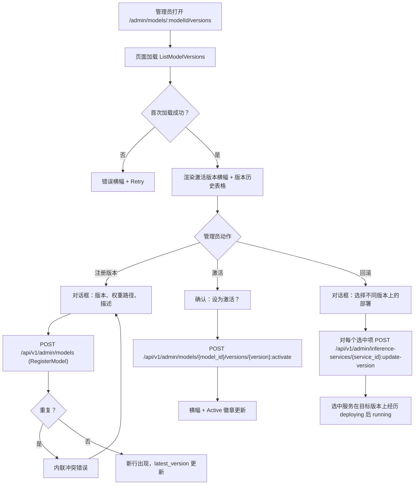
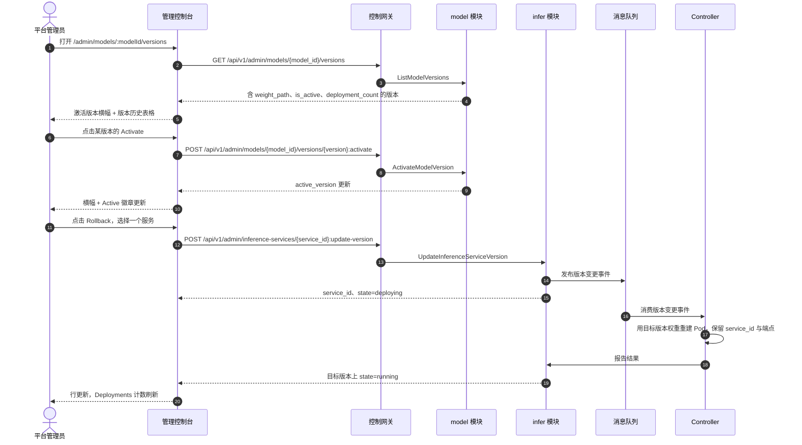

# 模型版本管理与回滚 — 需求分析与 UI/UX 设计

| 属性 | 内容 |
| --- | --- |
| 特性点 | 模型版本管理与回滚 — 管理模型版本（注册、激活、回滚）、查看版本历史，并将部署回滚到先前版本（backlog 第 32 行） |
| 文档范围 | 需求分析、竞品调研、`/admin/models/:modelId/versions` 管理面模型版本页、页面 → API 面映射表，以及编号验收标准 |
| 归属模块 | `model`（版本历史、激活、注册）、`infer`（推理服务的原位版本变更 / 回滚）、`web` 管理控制台（`ModelVersionsPage`）、`controller`（调和版本变更事件） |
| 相关文档 | [架构设计](./architecture.md) — 第 2.2 节 `model`、第 2.4 节 `infer`、第 3.1 节（管理面/用户面分离）· [模型目录与一键部署](./model-catalog-deployment.md) — 目录、`model_versions` 表、部署表单与删除后重建规则 · [控制台面分离](./console-surface-separation.md) — 两个面、`AdminShell` 约定、掩码投影规则 |
| 状态 | 设计完成，已移交架构师代理 |

---

## 1. 背景与竞品调研

### 1.1 为什么现在做模型版本管理与回滚

go-taas 已经注册模型版本（`models` 目录条目下的 `model_versions` 行），并在每个推理服务上钉住 `model_version`（model-catalog-deployment §3.2/§3.3）。控制台仍然无法*管理*这些版本：没有版本历史页、没有新部署遵循的默认/激活版本概念，也没有办法在新版本出问题时把运行中的部署回滚到先前版本。运营者必须删除并重建服务才能改版本，这会改变 `service_id` 并破坏指向旧端点的智能体。

本特性新增**模型版本管理与回滚**面：查看模型的完整版本历史、注册新版本、激活一个版本作为新部署的默认版本，并将部署原位回滚到先前版本（同一 `service_id`、同一端点）。这是 Phase 4 模型生命周期路线图项中最小可独立交付的增量：它把「最新版本坏了」变成「激活先前版本并把受影响的部署回滚到它」。

### 1.2 竞品如何实现版本管理与回滚

| 产品 | 版本历史 | 激活 / 阶段 | 回滚 | 主要陷阱 |
| --- | --- | --- | --- | --- |
| **Hugging Face** | 模型版本是 git 修订（提交/标签）；模型页展示修订树与钉住的修订 | 可将某修订钉为仓库默认 | 回滚 = 检出/钉住更早的修订 | git 语义泄漏到产品面；非技术用户觉得修订难以理解 |
| **MLflow Model Registry** | 版本列表含阶段、时间戳与注册用户 | 阶段：Staging / Production / Archived；版本在阶段间迁移 | 将另一版本迁移到 Production（服务阶段） | 阶段迁移是手动的且易误点；没有对归档服务中版本的防护 |
| **Vertex AI Model Registry** | 版本列表含别名、时间戳与部署状态 | 别名（如 `default`）；可为版本分配别名 | 重新部署更早版本；别名重分配 | 别名与部署是两个概念，用户容易混淆 |
| **SageMaker Model Registry** | 模型包版本含审批状态与元数据 | 审批状态：PendingManualApproval / Approved / Rejected | 部署先前 Approved 的版本 | 审批工作流对小型平台过重；版本元数据冗长 |
| **Azure ML** | 模型版本含标签与注册时间 | 标签与每模型默认版本 | 重新部署特定版本 | 版本与部署耦合松散；回滚是隐式的 |

### 1.3 提炼出的模式与决策

值得采纳的模式：

1. **版本历史用表格呈现** — 所有调研产品都以表格展示版本（版本 id、时间戳、状态/阶段徽章）。表格是「激活它」与「回滚到它」的锚点。
2. **默认/激活版本概念** — MLflow 的 Production 阶段、Vertex 的 `default` 别名与 Azure 的默认版本都让运营者表达「新部署用这个版本」，与「最新注册的版本」解耦。
3. **版本不可变** — 版本从不被编辑；要么注册新版本，要么回滚到既有版本。这让历史保持追加式且可审计。
4. **回滚是对部署的版本变更** — Vertex 与 SageMaker 通过把部署指向更早版本来回滚，而非重建部署身份。

需要避免的陷阱：

- **泄漏 git 语义**（Hugging Face）— go-taas 版本是不透明字符串（`2024-09-11`、`v0.1-rc1`），不是提交；UI 不得发明修订树。
- **手动、无防护的阶段迁移**（MLflow）— 激活版本必须显式且可确认，回滚必须警告受影响端点上的智能体会看到版本变更。
- **重型审批工作流**（SageMaker）— go-taas 需要一个单一激活版本，而非多阶段审批流水线。
- **混淆别名与部署**（Vertex）— go-taas 把「激活默认版本」（model 模块）与「回滚特定部署」（infer 模块）分开；UI 将它们作为不同动作。

**go-taas 的决策**（依据自主决策规则记录理由）：

| # | 决策 | 依据 |
| --- | --- | --- |
| D1 | **版本管理仅存在于管理面**：`/admin/models/:modelId/versions` + `/api/v1/admin/models/{model_id}/versions/*`。**无终端用户面** — 租户经网关消费激活/最新版本，从不管理版本 | 版本管理是运营者编排（特性 #17 的掩码投影规则）；租户选择模型而非版本。与仅管理面的加速器清单（特性 #18）一致 |
| D2 | **新增激活版本概念**：每个模型有一个版本被标记为激活（新部署的默认）。存储为 `model_versions` 上的 `is_active`，带部分唯一索引 `(model_id) WHERE is_active` | 激活是 MLflow Production 阶段 / Vertex `default` 别名的 go-taas 对应物；它把「新部署默认的版本」与「最新注册的版本」解耦 |
| D3 | **注册新版本复用既有 `RegisterModel` RPC**（名称 + 版本 + 权重路径 + 描述）；版本页的「注册版本」对话框预填模型名称并调用它 | `RegisterModel` 已向既有模型追加版本（model-catalog-deployment FR1.2）；无需新注册 RPC |
| D4 | **新增 `ListModelVersions` RPC** 返回完整版本历史，含每版本元数据（version、weight_path、created_at、is_active、deployment_count）— 比 `GetModel` 的 `repeated string versions` 更丰富 | 版本页需要权重路径、激活状态与每版本部署数；`GetModel` 的字符串列表不足 |
| D5 | **新增 `ActivateModelVersion` RPC** 设置激活版本；激活是幂等的，且每个模型只有一个激活版本 | 激活是一等操作（特性点范围）；部分唯一索引强制每模型一个激活版本 |
| D6 | **回滚是对推理服务的原位版本变更**：新增 `UpdateInferenceServiceVersion` RPC 改变服务的 `model_version`，同时保留同一 `service_id` 与端点；服务经历 `deploying` 后回到 `running` | 「把部署回滚到先前版本」意味着同一端点服务旧版本；删除后重建（model-catalog-deployment D5）会改变 `service_id` 并破坏智能体。Controller 调和版本变更事件，用新权重重建 Pod 同时保留服务身份 |
| D7 | **回滚入口在版本历史页**：每个版本行提供「回滚」，打开对话框列出当前钉在不同版本的部署，带复选框选择要回滚哪些 | 让特性自包含在特性点的路由上，而底层 API 位于 infer 模块 |
| D8 | **部署表单（model-catalog-deployment FR3.1）在设置激活版本时默认使用激活版本**，否则回退到 `latest_version` | 只有新部署遵循激活版本，激活才有意义；回退保留既有行为 |

### 1.4 范围边界

**范围内**：模型版本页（含激活/最新徽章、权重路径、创建日期、每版本部署数的版本历史）、注册新版本、激活一个版本作为默认、将部署原位回滚到先前版本。

**范围外**（由其他特性点跟踪）：模型目录列表与一键部署表单（#2）、镜像版本管理与镜像×卡型适配矩阵（#3）、租户级模型授权（#6）、部署历史与审计（#34 — 创建/更新/扩缩容/回滚事件的审计轨迹）、灰度/蓝绿升级。

---

## 2. 用户角色

| 角色 | 描述 | 与模型版本管理的交互 |
| --- | --- | --- |
| **平台管理员** | 决定平台服务哪些模型以及如何服务的运营者 | 查看版本历史、注册新版本、激活默认版本、将部署回滚到先前版本 |
| **智能体 / SDK** | 调用 `/v1/chat/completions` 的程序化消费方 | 从不接触版本管理；经网关持 API Key 消费激活/最新版本 |

> 术语：消费侧调用方在英文中为 **Agent**，中文为「智能体」，与仓库约定一致。本特性仅管理面，因此消费侧术语不适用于租户面。

---

## 3. 用户故事

| # | 作为… | 我想要… | 以便… |
| --- | --- | --- | --- |
| US1 | 平台管理员 | 打开模型查看其完整版本历史（权重路径、创建日期、哪个版本激活） | 我了解存在哪些版本以及新部署将使用哪个 |
| US2 | 平台管理员 | 从版本页为既有模型注册新版本 | 不离开控制台就能发布模型更新 |
| US3 | 平台管理员 | 激活一个版本作为新部署的默认 | 新部署使用我选择的版本，而不一定是最新的 |
| US4 | 平台管理员 | 将部署原位回滚到先前版本 | 坏的新版本在不改变端点的情况下停止影响智能体 |
| US5 | 平台管理员 | 看到每个版本运行多少个部署 | 在激活或回滚前了解影响范围 |
| US6 | 智能体 / SDK | 用我的 API Key 通过端点调用已部署的模型 | 我获得运营者钉住的任何版本的补全结果，无需了解版本管理 |

---

## 4. 功能需求

### FR1 — 版本历史

- **FR1.1** `ListModelVersions`（`GET /api/v1/admin/models/{model_id}/versions`）返回模型版本，最新在前（model-catalog-deployment 排序规则：`created_at DESC, version DESC`），每个带 `version`、`weight_path`、`created_at`、`is_active` 与 `deployment_count`（钉在该版本的非 terminated 推理服务数）。
- **FR1.2** 响应还携带模型的 `name`、`model_id` 与 `active_version`（当前激活版本字符串，未设置则为空）。
- **FR1.3** 未知 `model_id` 返回 10101 `CodeModelNotFound`。

### FR2 — 注册新版本

- **FR2.1** 版本页提供「注册版本」动作，打开对话框：**版本**（必填，1–64 字符）、**权重路径**（必填，对象存储路径，语法规则同 model-catalog-deployment FR1.3）、**描述**（可选，≤ 1024 字符）。模型名称预填且只读。
- **FR2.2** 提交调用 `RegisterModel`（模型名称 + 新版本）；重复的名称+版本返回 10102 `CodeModelExists` 并内联展示。
- **FR2.3** 成功后新版本出现在历史中，`is_active=false` 且 `deployment_count=0`；若为最新则 `latest_version` 更新为新版本。

### FR3 — 激活版本

- **FR3.1** 每个非激活版本行提供「激活」，打开确认对话框：「将 `<version>` 设为激活版本？新部署将默认使用它。」
- **FR3.2** `ActivateModelVersion`（`POST /api/v1/admin/models/{model_id}/versions/{version}:activate`）将该版本设为激活并清除先前激活版本；它是幂等的（激活已激活版本是无操作成功）。
- **FR3.3** 未知版本返回 10103 `CodeModelVersionNotFound`；激活版本显示在页面的激活版本横幅中，并在行上显示「Active」徽章。

### FR4 — 回滚部署

- **FR4.1** 每个版本行提供「回滚」，打开对话框列出当前钉在**不同**版本的非 terminated 推理服务，每个带复选框（默认未选）、服务名称、当前版本与状态。
- **FR4.2** 确认后对每个选中服务调用 `UpdateInferenceServiceVersion`（`POST /api/v1/admin/inference-services/{service_id}:update-version`），将其 `model_version` 改为该行的版本，同时保留同一 `service_id` 与端点；服务经历 `deploying` 后回到 `running`。
- **FR4.3** 未知服务返回 10301 `CodeInferServiceNotFound`；处于无法更新状态（如 `terminated`）的服务返回 10303 `CodeInferServiceStateInvalid`；未知目标版本返回 10103 `CodeModelVersionNotFound`。
- **FR4.4** 对话框警告：「调用所选服务端点的智能体会看到版本变更。」确认按钮在至少选中一个服务前禁用。

### FR5 — 部署表单默认

- **FR5.1** 部署表单（model-catalog-deployment FR3.1）在设置激活版本时预填**激活**版本，否则回退到 `latest_version`（D8）。

---

## 5. 页面与流程设计

### 5.1 面分配

| 特性 | 面 | Web 路由 | API 前缀 |
| --- | --- | --- | --- |
| 模型版本历史 | admin | `/admin/models/:modelId/versions` | `/api/v1/admin/models/{model_id}/versions/*` |
| 注册新版本 | admin | `/admin/models/:modelId/versions`（对话框） | `/api/v1/admin/models` |
| 激活版本 | admin | `/admin/models/:modelId/versions`（对话框） | `/api/v1/admin/models/{model_id}/versions/{version}:activate` |
| 回滚部署 | admin | `/admin/models/:modelId/versions`（对话框） | `/api/v1/admin/inference-services/{service_id}:update-version` |

以上每个页面与 API 调用都位于**管理面**；无终端用户面（D1）。管理面页面从不调用 `/api/v1/*` 路由，全程使用管理会话域。

### 5.2 页面地图

| 页面 / 组件 | 目的 |
| --- | --- |
| **模型版本页**（`/admin/models/:modelId/versions`） | 含激活/最新徽章、权重路径、创建日期、每版本部署数的版本历史；注册、激活与回滚动作 |
| **注册版本对话框** | 版本、权重路径、描述（FR2） |
| **激活确认对话框** | 将版本设为激活（FR3） |
| **回滚对话框** | 选择要回滚到某版本的部署（FR4） |

### 5.3 页面：`/admin/models/:modelId/versions` — Model Versions（管理面）

**目的**：给平台管理员一个单一面来管理模型的版本 — 查看历史、注册新版本、激活默认、将部署回滚到先前版本。

**面**：admin — 路由 `/admin/models/:modelId/versions`，API `/api/v1/admin/models/{model_id}/versions/*`（回滚另用 `/api/v1/admin/inference-services/{service_id}:update-version`，D7）。

**布局**：在 `AdminShell`（特性 #17）内渲染。页面头部（「Model Versions」，副标题含模型名称与 `model_id`）带 **Back to Models** 链接（次要）与 **Register Version** 动作（主要）。下方：

1. **激活版本横幅** — 显示当前激活版本（或「No active version — new deployments use the latest」）并注明新部署默认使用它（D2、D8）。
2. **版本历史表格** — 列：**Version**、**Status**（Active / Latest 徽章，相互独立）、**Weight path**、**Created**、**Deployments**（该版本上的非 terminated 服务数）、**Actions**（Activate / Rollback / Deploy）。

**交互状态**：

| 状态 | 行为 |
| --- | --- |
| 默认 | 激活版本横幅 + 版本历史表格从首次成功加载渲染 |
| 加载中 | 骨架表格；Register Version 禁用 |
| 空 | 「No versions registered for this model.」并提示注册第一个版本；横幅保持可见 |
| 错误 | 错误横幅带消息与 Retry 按钮；页面保留最后的好数据并显示「Showing stale data」横幅 |
| 禁用 | 加载或变更进行中 Register Version 禁用；激活版本行上的 Activate/Rollback 禁用 |
| 权限拒绝 | 无所需角色的会话收到 10036，页面显示标准权限拒绝状态（特性 #17）带返回管理首页的链接 |

**版本历史表格列**：Version、Status（Active / Latest 徽章）、Weight path、Created、Deployments、Actions。可按 Version、Created 与 Deployments 排序。可按状态过滤（All / Active / Latest）。分页（`offset`/`limit`，默认 20，最大 100）。

**注册版本对话框**：字段 **Version**（必填，1–64 字符）、**Weight path**（必填，对象存储路径，语法校验）、**Description**（可选，≤ 1024 字符）。模型名称只读展示。校验错误内联；重复版本显示「A version with this name already exists.」。提交调用 `RegisterModel`；成功后对话框关闭，新行出现。

**激活确认对话框**：「将 `<version>` 设为激活版本？新部署将默认使用它。」带 **Cancel**（次要）与 **Activate**（主要）。成功后横幅与行徽章更新。

**回滚对话框**：列出钉在不同版本的非 terminated 服务，每个带复选框、服务名称、当前版本与状态。警告：「调用所选服务端点的智能体会看到版本变更。」**Cancel**（次要）与 **Roll back**（主要，至少选中一个服务前禁用）。成功后受影响行的 Deployments 计数与服务版本更新。

### 5.4 流程

---

## 6. API 面影响

版本历史与激活 RPC 属于 **`model` 模块**（D4、D5）；回滚 RPC 属于 **`infer` 模块**（D6）。全部经控制网关以 HTTP 提供，位于**管理前缀** `/api/v1/admin/*`（D1）。**无用户前缀绑定**（D1）。

| RPC | 路由 | 前缀 | 状态 | 目的 |
| --- | --- | --- | --- | --- |
| `ListModelVersions`（`taas.model.v1`） | `GET /api/v1/admin/models/{model_id}/versions` | admin | **新增** | 含元数据与每版本部署数的版本历史 |
| `ActivateModelVersion`（`taas.model.v1`） | `POST /api/v1/admin/models/{model_id}/versions/{version}:activate` | admin | **新增** | 设置激活/默认版本 |
| `RegisterModel`（`taas.model.v1`） | `POST /api/v1/admin/models` | admin | 既有 | 注册新版本（复用，D3） |
| `UpdateInferenceServiceVersion`（`taas.infer.v1`） | `POST /api/v1/admin/inference-services/{service_id}:update-version` | admin | **新增** | 将部署原位回滚到先前版本（D6） |

**给架构师代理的契约说明**：

1. `ListModelVersions` 返回模型的 `name`、`model_id`、`active_version` 与 `versions[]`（每个带 `version`、`weight_path`、`created_at`、`is_active`、`deployment_count`），最新在前（FR1.1、FR1.2）。
2. `ActivateModelVersion` 在单事务内将目标版本 `is_active=true`、先前激活版本 `false`；部分唯一索引 `(model_id) WHERE is_active` 强制每模型一个激活版本（D2、D5）。
3. `UpdateInferenceServiceVersion` 只改 `model_version`；它保留 `service_id`、端点与所有其他规格字段，并向消息队列发布版本变更事件。服务经历 `running → deploying → running`（D6）。
4. `RegisterModel` 不变；版本页以预填的模型名称复用它（D3）。
5. 线上约定不变：成功 HTTP 200，业务错误为 `{"code": <int>, "message": "..."}`，int64 字段序列化为 JSON 字符串。

错误码（既有块，`pkg/errors/codes.go`）：

| 条件 | 码 | 常量 | 说明 |
| --- | --- | --- | --- |
| 未知 `model_id` | 10101 | `CodeModelNotFound` | `ListModelVersions`、`ActivateModelVersion` |
| 重复名称+版本 | 10102 | `CodeModelExists` | `RegisterModel`（FR2.2） |
| 未知版本 | 10103 | `CodeModelVersionNotFound` | `ActivateModelVersion`、`UpdateInferenceServiceVersion` |
| 未知服务 | 10301 | `CodeInferServiceNotFound` | `UpdateInferenceServiceVersion` |
| 服务状态不可更新 | 10303 | `CodeInferServiceStateInvalid` | `UpdateInferenceServiceVersion` 对如 `terminated`（FR4.3） |

---

## 7. 验收标准

| # | 标准 | 级别 |
| --- | --- | --- |
| AC1 | `ListModelVersions` 返回模型的 `name`、`model_id`、`active_version` 与 `versions[]`（最新在前），每个带 `version`、`weight_path`、`created_at`、`is_active` 与 `deployment_count`；未知 `model_id` 返回 10101 | FVT |
| AC2 | `ActivateModelVersion` 将目标版本设为激活并清除先前激活版本；每模型只有一个激活版本；激活已激活版本是无操作成功；未知版本返回 10103 | FVT |
| AC3 | `UpdateInferenceServiceVersion` 只改 `model_version`，保留 `service_id` 与端点，并让服务经历 `running → deploying → running`；未知服务返回 10301，未知版本返回 10103，`terminated` 服务返回 10303 | FVT |
| AC4 | `/admin/models/:modelId/versions` 页面从首次成功加载渲染激活版本横幅与版本历史表格，含 Active/Latest 徽章、权重路径、创建日期与每版本部署数 | E2E |
| AC5 | 从对话框注册新版本调用 `RegisterModel`，新行以 `is_active=false` 与 `deployment_count=0` 出现；重复版本显示内联冲突错误 | E2E |
| AC6 | 激活版本会更新激活版本横幅与行的 Active 徽章；调用前显示确认对话框 | E2E |
| AC7 | 回滚对话框只列出不同版本上的非 terminated 服务，在至少选中一个前禁用确认按钮，确认后受影响服务转换到目标版本且 Deployments 计数更新 | E2E |
| AC8 | 模型版本页只在管理面可达：路由 `/admin/models/:modelId/versions`，每个 API 调用使用 `/api/v1/admin/*` 前缀且无 `/api/v1/*` 字符串 | E2E（面分离） |
| AC9 | 无所需角色的会话在模型版本页收到 10036，页面显示标准权限拒绝状态 | E2E |

---

## 8. 范围外（在别处跟踪）

| 项 | 位置 |
| --- | --- |
| 模型目录列表与一键部署表单 | 特性 #2 模型目录与部署 |
| 镜像版本管理与镜像 × 卡型适配矩阵 | 特性 #3 镜像管理 |
| 租户级模型授权 | 特性 #6 多租户 |
| 部署历史与审计（创建/更新/扩缩容/回滚事件） | 特性 #34 部署历史与审计 |
| 灰度 / 蓝绿升级 | 未来特性点 |
| 用户面版本选择器（租户选择版本） | 刻意缺失（D1）— 租户经网关消费激活/最新版本 |
