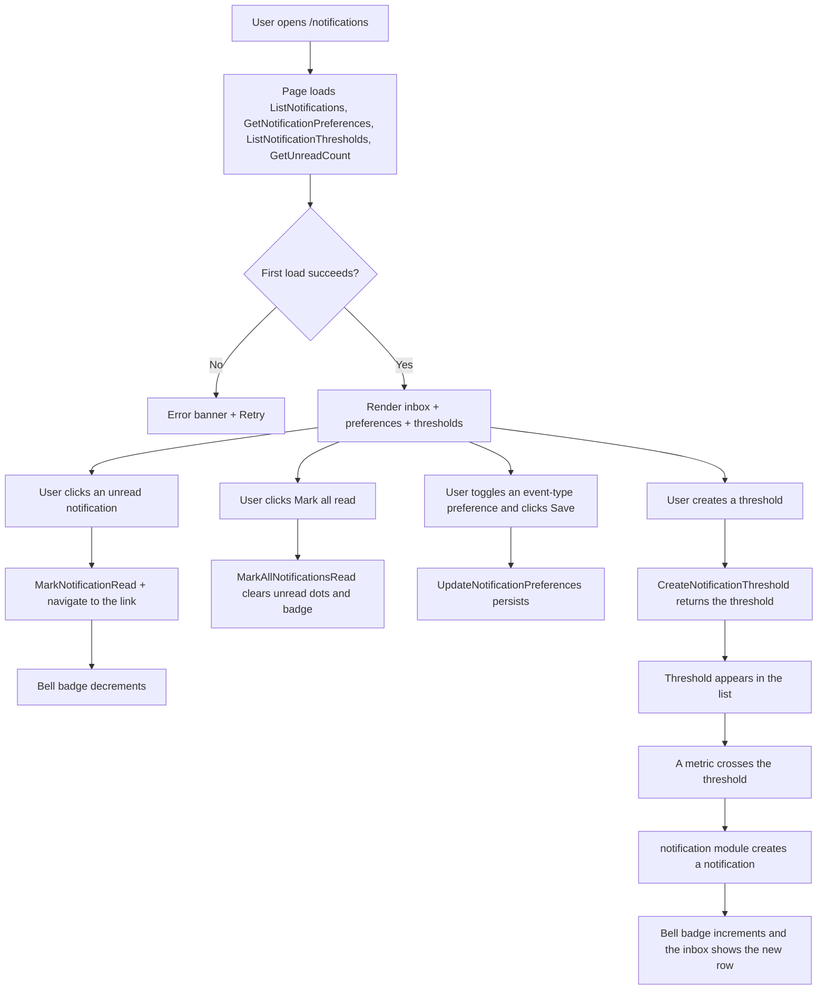
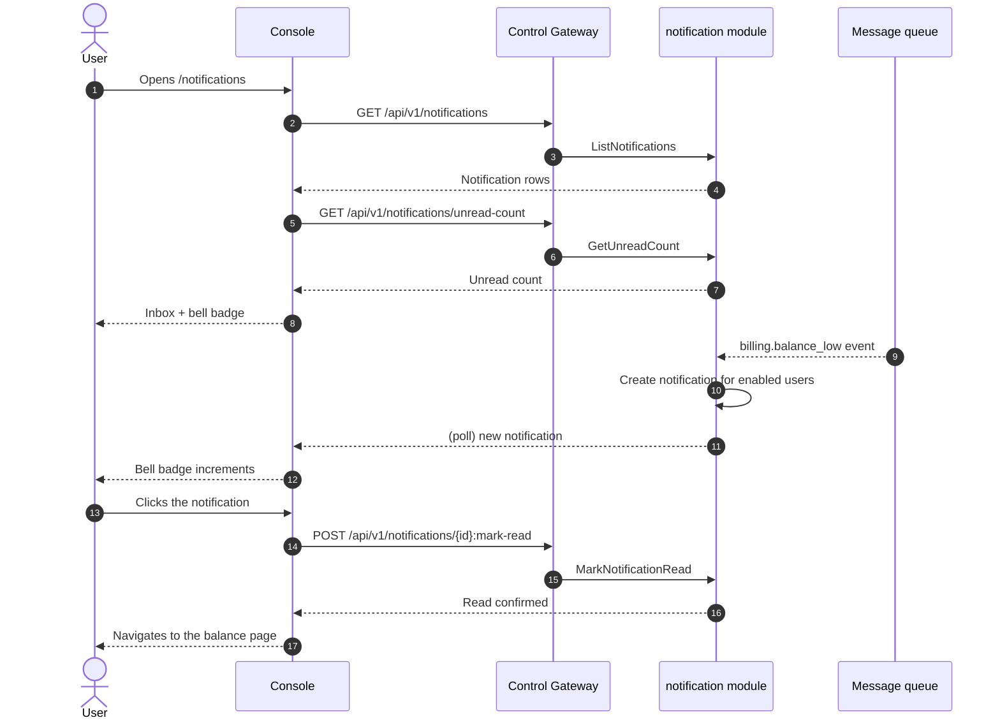

# Notification Center & Threshold Alerts — Requirement Analysis and UI/UX Design

| Attribute | Content |
| --- | --- |
| Feature point | Notification center & threshold alerts — per-user notification preferences and an in-console notification center for balance-low, spend-limit, deployment and autoscaling events, with read/unread state (backlog row 26) |
| Document scope | Requirement analysis, competitive research, the admin-surface notification center for `/admin/notifications`, the end-user-surface notification center for `/notifications`, the page → API surface table, and numbered acceptance criteria |
| Owning modules | `notification` (new — owns notification persistence, per-user preferences, threshold-alert evaluation, and read/unread state; subscribes to the message queue for the event catalog), `web` admin console (`AdminNotificationsPage`) and end-user console (`UserNotificationsPage`), `pkg/server` gateway (admin-prefix and user-prefix bindings) |
| Related documents | [Architecture Design](./architecture.md) — §1.2 message queue, §2 module responsibilities · [Console Surface Separation](./console-surface-separation.md) — the two surfaces this feature spans, the `UserShell`/`AdminShell` conventions, the masked-projection rule · [Webhook Notifications & Event Subscriptions](./webhook-notifications.md) — the event catalog this feature consumes in-console (feature #23) · [Inference Autoscaling](./inference-autoscaling.md) — the autoscaling events · [Balance & Quota](./balance-quota.md) — the balance-low and spend-limit events · [Payments, Invoices & Auto-Recharge](./payments-invoices-auto-recharge.md) — the billing/invoice events · [Audit Logging](./audit-logging.md) — the audit trail notification mutations must produce |
| Status | Design complete, handed to the Architect agent |

---

## 1. Background

go-taas is a Token-as-a-Service platform: it deploys inference services (feature #2), autoscales them (feature #16), meters and bills usage (features #4, #5, #8, #14), and enforces spend limits (feature #11). Feature #23 added **outbound webhooks** so an external system can be pushed the events it cares about. But the operator and the tenant themselves still have **no in-console view** of those events: a balance that runs low, a spend limit that is breached, a deployment that fails, or a service that scales are only discoverable by opening the relevant page and polling. There is no single place that collects these events, marks which ones the user has seen, and lets the user choose which event types they care about.

This feature adds a **notification center with threshold alerts**: the platform persists the same event catalog feature #23 delivers outbound, surfaces it in-console as a notification list with read/unread state, lets each user choose which event types generate notifications (per-user preferences), and lets the user define **threshold alerts** (balance-low, spend-limit, autoscaling replica count, deployment failure) that generate a notification when a metric crosses a threshold. It is the smallest independently valuable increment of Phase 4's productionization roadmap item: it turns "the platform changed state" into "the user sees it in the console and can act on it".

### 1.1 How Comparable Products Expose Notification Centers & Threshold Alerts

| Product | Notification surface | Threshold alerts | Read/unread | Preferences | Notable pitfalls |
| --- | --- | --- | --- | --- | --- |
| **OpenAI Platform** | No general in-console notification center; usage and billing are pull-only; email for some account events | Spend-limit alerts via email; no in-console threshold builder | n/a | n/a | No in-console notification surface to compare; alerts are email-only |
| **Anthropic Console** | No general in-console notification center; workspace activity is pull-only | n/a | n/a | n/a | No notification surface to compare |
| **Together AI / SiliconFlow** | Billing page shows balance and usage; passive alerts, no notification center | Balance-low warning on the billing page; no configurable threshold | n/a | n/a | Passive inline warnings, not a persistent notification list |
| **Baidu Qianfan** | Billing center with balance and usage; some account alerts | Balance-low and spend alerts in the billing center | n/a | n/a | Alerts are buried in the billing center; no unified notification list |
| **Aliyun Bailian** | Model monitoring page with alert rules; billing center with high-spend alert (高额消费预警) | Configurable high-spend alert threshold; monitoring alert rules | n/a | Per-rule enablement | Alerts are split across monitoring and billing; no unified read/unread notification center |
| **Volcengine Ark** | Billing center with usage and alerts | Balance and spend alerts | n/a | n/a | Alerts are billing-scoped; no unified notification center |

### 1.2 Distilled Patterns and Decisions

Patterns worth adopting: (1) **a unified in-console notification list** — the leading platforms (Aliyun Bailian, Baidu Qianfan) surface account and monitoring alerts in the console, but none unifies them into one read/unread list; go-taas can lead by collecting all event types into a single notification center; (2) **per-user preferences** — Aliyun Bailian's per-rule enablement and the webhook feature's per-event-type enablement (feature #23 D1) establish that a user should choose which event types generate notifications; (3) **configurable threshold alerts** — Aliyun Bailian's high-spend alert threshold (高额消费预警) and monitoring alert rules are the canonical threshold-alert pattern; (4) **read/unread state** — the universal inbox pattern (email, GitHub, Slack) that lets a user see what is new at a glance; (5) **a bell with an unread badge** — the standard entry point to a notification center, showing an unread count in the shell header; (6) **deep links** — a notification should link to the page where the user can act (the balance page, the spend-limit page, the deployment detail, the autoscaling page).

Pitfalls to avoid: a notification center that is buried in the billing page (Baidu Qianfan, Volcengine Ark) — the entry point must be a persistent bell in the shell header; alerts that are email-only with no in-console view (OpenAI) — the console must be the primary surface; no read/unread state (all comparable products) — the user cannot tell what is new; no per-user preferences (most) — the user is flooded with irrelevant event types; and exposing operator orchestration events to tenants or tenant account events to operators — the catalog must be split by surface (feature #17's masked-projection rule).

**Decisions for go-taas**:

| # | Decision | Rationale |
| --- | --- | --- |
| D1 | **The notification center exists on both surfaces, with a clean event split.** The admin surface (`/admin/notifications`, `/api/v1/admin/notifications/*`) collects **platform orchestration events** — `deployment.status_changed`, `autoscaling.scaled`, `autoscaling.scale_to_zero`. The end-user surface (`/notifications`, `/api/v1/notifications/*`) collects **tenant account events** — `billing.invoice_created`, `billing.invoice_paid`, `billing.spend_limit_breached`, `billing.balance_low`. This is exactly the event catalog feature #23 (D1) established | Deployment and autoscaling are operator-orchestration state (features #16, #2); billing, spend-limit and balance are tenant account state (features #14, #11, #8). Reusing the webhook catalog keeps the two consumers consistent and follows feature #17's masked-projection rule: a tenant must not see operator orchestration internals, and an operator's notification list is operator-scoped |
| D2 | **A notification is a persisted event with read/unread state.** A notification carries `notification_id`, `event_type`, `title`, `body`, `severity` (`info` / `warning` / `critical`), `read` (bool), `created_at`, a `data` payload, and an optional `link` deep link. Notifications are created when a subscribed event occurs (or a threshold is crossed) and are retained for 90 days | The notification is the in-console projection of the same event feature #23 delivers outbound; read/unread is the universal inbox pattern (pattern 4). 90-day retention matches the request-log and webhook-delivery retention (feature #12, feature #23 D6) |
| D3 | **Per-user preferences choose which event types generate notifications.** Each user has a preference set: for every event type in their surface's catalog, an `enabled` boolean (default all enabled). A disabled event type still occurs on the platform but does not create a notification for that user. Preferences are per-user, not per-org | Per-user preferences (pattern 2) let each operator or tenant choose what they care about, mirroring feature #23's per-event-type enablement. Per-user (not per-org) because notification read state and relevance are personal |
| D4 | **Threshold alerts are configurable rules that generate notifications when a metric crosses a threshold.** A threshold carries `threshold_id`, `name`, `metric`, `operator` (`lt` / `gt`), `value`, `enabled`, `created_at`, and `updated_at`. The **end-user** metrics are `balance_low` (notify when balance < value) and `spend_limit` (notify when spend in the current period > value). The **admin** metrics are `autoscaling_replicas` (notify when a service's replica count > value) and `deployment_failure` (notify on any deployment failure). A threshold crossing creates a notification with the threshold's name | Configurable thresholds (pattern 3) are the Aliyun Bailian high-spend-alert pattern. The metric set maps to the feature's stated event types: balance-low and spend-limit on the end-user surface, deployment and autoscaling on the admin surface (D1) |
| D5 | **A bell with an unread badge is the entry point.** Both shells (feature #17) show a bell icon in the header with an unread count badge; clicking it opens the notification center. The badge shows the count of unread notifications and updates when notifications are read or new ones arrive | The bell + badge is the standard notification entry point (pattern 5) and gives the user a persistent, always-visible way to see what is new, avoiding the buried-in-billing pitfall |
| D6 | **Notifications support read/unread, mark-all-read, and delete.** A user can mark a single notification read, mark all read, and delete a notification. Read state is per-user and per-notification | Read/unread (pattern 4) plus mark-all-read and delete are the minimal inbox operations a notification center needs; they keep the list manageable |
| D7 | **Notifications deep-link to the page where the user can act.** Each notification carries an optional `link` (e.g. the balance page for `billing.balance_low`, the spend-limit page for `billing.spend_limit_breached`, the deployment detail for `deployment.status_changed`, the autoscaling page for `autoscaling.scaled`). Clicking a notification navigates to that page and marks it read | Deep links (pattern 6) turn a notification from "something happened" into "here is where you act", which is the point of an in-console notification center |
| D8 | **The `notification` module owns the feature.** It exposes the CRUD/query RPCs, subscribes to the message queue for the event catalog, evaluates threshold alerts, persists notifications, and tracks read/unread state. It is a new module in the unified gRPC server (architecture §1.2) | Notifications consume events from `infer`, `billing`, and `metering`; a dedicated module keeps the notification concern out of the producing modules and gives it one home, mirroring how `webhook` owns delivery (feature #23 D8) |
| D9 | **New error codes in a notification block (11001–11099)**: **11001 `CodeNotificationNotFound`**, **11002 `CodeNotificationPreferencesInvalid`**, **11003 `CodeNotificationThresholdNotFound`**, **11004 `CodeNotificationThresholdInvalid`**, **11005 `CodeNotificationEventTypeInvalid`** | Notifications are a new module (D8), so their codes live in a fresh block after the billing-reports block (109xx); distinct codes keep "not found" vs "bad preferences" vs "bad threshold" vs "bad event type" actionable |
| D10 | **Notification mutations are audited** (feature #15): preference changes and threshold create/update/delete each write an audit event. Reading and deleting notifications are not audited (they are high-frequency, low-risk user actions) | Thresholds and preferences are configuration that affects what a user is told; the audit trail must record who changed them, matching the audit-logging feature's mutation coverage. Read/delete are personal inbox actions with no cross-user impact |

## 2. Goals and Non-goals

**Goals**: an admin page `/admin/notifications` that lists platform orchestration notifications with read/unread state, mark-all-read and delete, per-user preferences for the admin event catalog, and threshold alerts for autoscaling replica count and deployment failure (D1, D2, D3, D4, D6, D7); an end-user page `/notifications` with the same structure for tenant account events, plus threshold alerts for balance-low and spend-limit (D1, D4); a bell with an unread badge in both shells (D5); the page → API surface table with exact prefixes (D1); per-page interactive states including loading, empty, error, disabled, and permission-denied; numbered acceptance criteria testable in Nightwatch against the compose stack.

**Non-goals**: email or SMS delivery of notifications (v1 is in-console only; webhooks feature #23 already covers outbound delivery); a notification digest or scheduling; notification grouping/dedup beyond a simple per-event notification; push notifications; cross-surface notification visibility (D1); a notification replay API; any change to the inference, metering, or billing pipelines (read-only consumer of the event catalog).

## 3. Personas and Journeys

| Role | Surface | Journey |
| --- | --- | --- |
| **Platform operator** | admin | Opens `/admin/notifications` → sees a `deployment.status_changed` notification for a failed deployment → clicks it → navigates to the deployment detail and marks it read → the bell badge decrements |
| **Platform operator (reliability)** | admin | Creates an `autoscaling_replicas` threshold alert (notify when replicas > 8) → a service scales to 10 replicas → a notification appears → the operator investigates the autoscaling policy (feature #16) |
| **Tenant developer / Agent** | end-user | Opens `/notifications` → sees a `billing.balance_low` notification → clicks it → navigates to the balance page and tops up (feature #14) → marks it read |
| **Tenant finance admin** | end-user | Creates a `spend_limit` threshold alert (notify when spend > ¥500 this period) → the spend limit is approached → a notification appears → the finance admin raises the limit or pauses the key (feature #11) |

> Terminology: the consumer-side caller is an **Agent** in English and 「智能体」 in Chinese, consistent with the repository convention.

## 4. Feature Requirements

### FR1 — Notification list & read/unread (both surfaces)

- **FR1.1** `ListNotifications` (`GET /api/v1/notifications` user · `GET /api/v1/admin/notifications` admin) returns the surface's notifications, newest first, filterable by `read` state and `event_type`, and paginated (dotted pagination). Each row carries `notification_id`, `event_type`, `title`, `body`, `severity`, `read`, `created_at`, and `link` (D2, D7).
- **FR1.2** `GetNotification` (`GET /api/v1/notifications/{notification_id}` user · `GET /api/v1/admin/notifications/{notification_id}` admin) returns one notification with its full `data` payload. An unknown `notification_id` returns **11001 `CodeNotificationNotFound`** (D9).
- **FR1.3** `MarkNotificationRead` (`POST /api/v1/notifications/{notification_id}:mark-read` user · `POST /api/v1/admin/notifications/{notification_id}:mark-read` admin) marks one notification read. An unknown `notification_id` returns **11001** (D9).
- **FR1.4** `MarkAllNotificationsRead` (`POST /api/v1/notifications:mark-all-read` user · `POST /api/v1/admin/notifications:mark-all-read` admin) marks all of the caller's notifications read (D6).
- **FR1.5** `DeleteNotification` (`DELETE /api/v1/notifications/{notification_id}` user · `DELETE /api/v1/admin/notifications/{notification_id}` admin) deletes one notification. An unknown `notification_id` returns **11001** (D9).
- **FR1.6** `GetUnreadCount` (`GET /api/v1/notifications/unread-count` user · `GET /api/v1/admin/notifications/unread-count` admin) returns the caller's unread count, used by the bell badge (D5).

### FR2 — Per-user preferences (both surfaces)

- **FR2.1** `GetNotificationPreferences` (`GET /api/v1/notifications/preferences` user · `GET /api/v1/admin/notifications/preferences` admin) returns the caller's preferences: for each event type in the surface's catalog, an `enabled` boolean (default all enabled) (D3).
- **FR2.2** `UpdateNotificationPreferences` (`PUT /api/v1/notifications/preferences` user · `PUT /api/v1/admin/notifications/preferences` admin) updates the caller's preferences. An event type outside the surface's catalog returns **11005 `CodeNotificationEventTypeInvalid`**; a malformed preference set returns **11002 `CodeNotificationPreferencesInvalid`** (D9).

### FR3 — Threshold alerts (both surfaces)

- **FR3.1** `CreateNotificationThreshold` (`POST /api/v1/notifications/thresholds` user · `POST /api/v1/admin/notifications/thresholds` admin) creates a threshold from `name`, `metric`, `operator` (`lt` / `gt`), and `value`. The **end-user** metrics are `balance_low` and `spend_limit`; the **admin** metrics are `autoscaling_replicas` and `deployment_failure` (D4). An invalid metric/operator/value returns **11004 `CodeNotificationThresholdInvalid`** (D9).
- **FR3.2** `ListNotificationThresholds` (`GET /api/v1/notifications/thresholds` user · `GET /api/v1/admin/notifications/thresholds` admin) returns the caller's thresholds, filterable by `enabled` state (D4).
- **FR3.3** `UpdateNotificationThreshold` (`PUT /api/v1/notifications/thresholds/{threshold_id}` user · `PUT /api/v1/admin/notifications/thresholds/{threshold_id}` admin) updates the threshold's `name`, `operator`, `value`, or `enabled`. An unknown `threshold_id` returns **11003 `CodeNotificationThresholdNotFound`**; an invalid value returns **11004** (D9).
- **FR3.4** `DeleteNotificationThreshold` (`DELETE /api/v1/notifications/thresholds/{threshold_id}` user · `DELETE /api/v1/admin/notifications/thresholds/{threshold_id}` admin) deletes the threshold. An unknown `threshold_id` returns **11003** (D9).
- **FR3.5** When a threshold is crossed, the `notification` module creates a notification with the threshold's `name` as the title and the metric/value in the body (D4).

### FR4 — Event catalog and notification creation

- **FR4.1** The **admin** event catalog is exactly: `deployment.status_changed`, `autoscaling.scaled`, `autoscaling.scale_to_zero` (D1). The **end-user** event catalog is exactly: `billing.invoice_created`, `billing.invoice_paid`, `billing.spend_limit_breached`, `billing.balance_low` (D1).
- **FR4.2** When a subscribed event occurs, the `notification` module creates a notification for every user on that surface whose preferences enable that event type (D3). The notification carries the event's `data` payload and a `link` deep link (D7).
- **FR4.3** Notifications are retained for 90 days (D2); older notifications are purged.

### FR5 — Surface and API binding

- **FR5.1** The admin notification center lives on the **admin surface**: route `/admin/notifications`, API prefix `/api/v1/admin/notifications/*`. It is added to the `AdminShell` navigation (feature #17) as "Notifications", and the `AdminShell` header shows a bell with an unread badge (D5).
- **FR5.2** The end-user notification center lives on the **end-user surface**: route `/notifications`, API prefix `/api/v1/notifications/*`. It is added to the `UserShell` navigation (feature #17) as "Notifications", and the `UserShell` header shows a bell with an unread badge (D5).
- **FR5.3** The admin page calls only `/api/v1/admin/notifications/*` routes; the end-user page calls only `/api/v1/notifications/*` routes. Neither contains the other surface's prefix string (feature #17, D1).
- **FR5.4** The admin event catalog is never exposed on the end-user surface and vice versa (D1): the end-user preferences list only the four tenant events, the admin preferences only the three operator events.

### FR6 — Audit

- **FR6.1** Preference changes and threshold create/update/delete are audited (feature #15): `notification.preferences_updated`, `notification.threshold_created`, `notification.threshold_updated`, `notification.threshold_deleted`. Reading and deleting notifications are not audited (D10).

## 5. UI Design

### 5.1 Page: `/admin/notifications` — Notifications (admin)

**Purpose**: give the platform operator a single in-console view of platform orchestration events (deployment status, autoscaling) with read/unread state, per-user preferences, and threshold alerts for autoscaling replica count and deployment failure.

**Surface**: admin — route `/admin/notifications`, API `/api/v1/admin/notifications/*`.

**Layout**: rendered inside `AdminShell` (feature #17). A page header ("Notifications", subtitle "Platform orchestration events and alerts") with a **Mark all read** action (primary) and a **Refresh** action (secondary). Below the header, three tabs:

1. **Inbox tab** — the notification list.
2. **Preferences tab** — per-user event-type preferences.
3. **Thresholds tab** — threshold alerts.

**Inbox tab**:

1. **Notification list** — a list of notifications, newest first, each row showing the **severity** badge (info grey / warning amber / critical red), the **title**, the **body**, the **event type** chip, the **created** relative time, and an unread dot for unread rows. Row actions: **Mark read** (for unread rows), **Delete**. A **Mark all read** action above the list. Filters: **Status** (all / unread / read) and **Event type** (dropdown of the surface's catalog). Paginated (dotted pagination).
2. **Unread badge** — the `AdminShell` header bell shows the unread count from `GetUnreadCount` (D5).

**Preferences tab**:

1. **Event-type preferences** — a list of the three admin event types (`deployment.status_changed`, `autoscaling.scaled`, `autoscaling.scale_to_zero`), each with a one-line description and an **enabled** toggle (default on). A **Save** action persists via `UpdateNotificationPreferences` (D3).

**Thresholds tab**:

1. **Threshold list** — a table with columns: **Name**, **Metric**, **Condition** (operator + value), **Status** (badge: enabled green / disabled grey), **Updated**, **Actions**. Row actions: **Edit**, **Enable/Disable**, **Delete**. A **New threshold** action above the table.
2. **New/Edit threshold dialog** — fields: **Name** (text, required), **Metric** (dropdown: Autoscaling replicas / Deployment failure), **Operator** (radio: greater than / less than), **Value** (number, required), **Enabled** (toggle, default on). **Cancel** / **Save** actions.

**Interactive states**:

| State | Behaviour |
| --- | --- |
| Default | The inbox list, preferences, and threshold table render from the first successful load; last-updated shows the load time |
| Loading | Skeleton rows in the list/table; Mark all read and Refresh are disabled |
| Empty | Inbox tab: "No notifications yet." with a hint that events will appear here; Preferences tab: the three event types always render (never empty); Thresholds tab: "No thresholds yet." with a **New threshold** action |
| Error | An error banner with the message and a Retry button; the page keeps its last good data with a "Showing stale data" banner |
| Disabled | Mark all read / Mark read / Delete are disabled while a request is in flight; Save is disabled while preferences are saving; the threshold Save is disabled while a threshold is saving |
| Permission-denied | A session without the required role receives 10036 and the page shows the standard permission-denied state (feature #17) with a link back to the admin home |

**Notification list columns**: Severity (badge), Title, Body, Event type (chip), Created (relative time), unread dot. Sortable by Created. Filterable by Status (all / unread / read) and Event type; paginated.

**Threshold table columns**: Name, Metric, Condition, Status (badge), Updated, Actions. Sortable by Name, Metric, and Updated. Filterable by Status (all / enabled / disabled); paginated.

**Dialogs and confirmation flows**:

- **Mark all read**: clicking **Mark all read** calls `MarkAllNotificationsRead` and clears the unread dots and the bell badge.
- **Delete notification**: a confirmation dialog "Delete this notification?" with **Cancel** / **Delete**. Deleting calls `DeleteNotification` and removes the row.
- **New/Edit threshold**: submitting the dialog calls `CreateNotificationThreshold` / `UpdateNotificationThreshold`; a validation error (11004) shows inline in the dialog.
- **Delete threshold**: a confirmation dialog "Delete threshold <name>?" with **Cancel** / **Delete** (danger). Deleting calls `DeleteNotificationThreshold` and removes the row.

### 5.2 Page: `/notifications` — Notifications (end-user)

**Purpose**: give a tenant developer / Agent / finance user a single in-console view of their tenant account events (billing, spend-limit, balance) with read/unread state, per-user preferences, and threshold alerts for balance-low and spend-limit.

**Surface**: end-user — route `/notifications`, API `/api/v1/notifications/*`.

**Layout**: rendered inside `UserShell` (feature #17). A page header ("Notifications", subtitle "Your account events and alerts") with a **Mark all read** action (primary) and a **Refresh** action (secondary). Below the header, the same three tabs as §5.1.

**Inbox tab**: the same notification list as §5.1, scoped to the tenant's own notifications. The **Event type** filter lists only the four tenant events (`billing.invoice_created`, `billing.invoice_paid`, `billing.spend_limit_breached`, `billing.balance_low`).

**Preferences tab**: the same event-type preferences as §5.1, listing only the four tenant events (D1).

**Thresholds tab**: the same threshold table as §5.1, with the **Metric** dropdown offering **Balance low** (notify when balance < value) and **Spend limit** (notify when spend > value) (D4).

**Interactive states**: identical to §5.1, with the empty copy "No notifications yet." / "No thresholds yet." and the permission-denied copy for the tenant's own errors (10005 org gone / 10017 org disabled from §8.2 of feature #17, 10027/10038 redirect per FR5.3). The page exposes no other tenants' data (D1).

**Notification list columns**: identical to §5.1, scoped to the tenant's own notifications. Sortable and paginated as in §5.1.

**Threshold table columns**: identical to §5.1, scoped to the tenant's own thresholds. Sortable and paginated as in §5.1.

**Dialogs and confirmation flows**: identical to §5.1 (Mark all read, Delete notification, New/Edit threshold, Delete threshold).

### 5.3 Flow

## 6. API Surface Implications

All notification RPCs belong to the **`notification` module** (D8), served as HTTP via the Control Gateway. Admin routes are on the **admin prefix** `/api/v1/admin/notifications/*` (D1); end-user routes are on the **user prefix** `/api/v1/notifications/*` (D1).

| RPC | Route | Prefix | Status | Purpose |
| --- | --- | --- | --- | --- |
| `ListNotifications` | `GET /api/v1/notifications` · `GET /api/v1/admin/notifications` | user · admin | **new** | List with read/event filters, pagination |
| `GetNotification` | `GET /api/v1/notifications/{notification_id}` · `GET /api/v1/admin/notifications/{notification_id}` | user · admin | **new** | One notification with full data; missing → 11001 |
| `MarkNotificationRead` | `POST /api/v1/notifications/{notification_id}:mark-read` · `POST /api/v1/admin/notifications/{notification_id}:mark-read` | user · admin | **new** | Mark one read; missing → 11001 |
| `MarkAllNotificationsRead` | `POST /api/v1/notifications:mark-all-read` · `POST /api/v1/admin/notifications:mark-all-read` | user · admin | **new** | Mark all read |
| `DeleteNotification` | `DELETE /api/v1/notifications/{notification_id}` · `DELETE /api/v1/admin/notifications/{notification_id}` | user · admin | **new** | Delete one; missing → 11001 |
| `GetUnreadCount` | `GET /api/v1/notifications/unread-count` · `GET /api/v1/admin/notifications/unread-count` | user · admin | **new** | Unread count for the bell badge |
| `GetNotificationPreferences` | `GET /api/v1/notifications/preferences` · `GET /api/v1/admin/notifications/preferences` | user · admin | **new** | Per-user event-type preferences |
| `UpdateNotificationPreferences` | `PUT /api/v1/notifications/preferences` · `PUT /api/v1/admin/notifications/preferences` | user · admin | **new** | Update preferences; bad event → 11005, bad set → 11002 |
| `CreateNotificationThreshold` | `POST /api/v1/notifications/thresholds` · `POST /api/v1/admin/notifications/thresholds` | user · admin | **new** | Create a threshold; invalid → 11004 |
| `ListNotificationThresholds` | `GET /api/v1/notifications/thresholds` · `GET /api/v1/admin/notifications/thresholds` | user · admin | **new** | List thresholds, enabled filter |
| `UpdateNotificationThreshold` | `PUT /api/v1/notifications/thresholds/{threshold_id}` · `PUT /api/v1/admin/notifications/thresholds/{threshold_id}` | user · admin | **new** | Update a threshold; missing → 11003, invalid → 11004 |
| `DeleteNotificationThreshold` | `DELETE /api/v1/notifications/thresholds/{threshold_id}` · `DELETE /api/v1/admin/notifications/thresholds/{threshold_id}` | user · admin | **new** | Delete a threshold; missing → 11003 |

**Contract notes for the Architect agent**:

1. `Notification` carries `notification_id`, `event_type`, `title`, `body`, `severity` (a closed enum: `info` / `warning` / `critical`), `read` (bool), `created_at`, `data` (the event payload), and `link` (optional deep link). Notifications are retained for 90 days (D2).
2. `ListNotifications` filters by `read` (bool) and `event_type` (a surface-catalog value, else 11005) and paginates with dotted pagination. `GetUnreadCount` returns the caller's unread count.
3. Preferences are a map of `event_type` → `enabled` (bool), defaulting to all enabled (D3). `UpdateNotificationPreferences` validates that every key is in the surface's catalog (else 11005) and that the set is well-formed (else 11002).
4. A threshold carries `threshold_id`, `name`, `metric`, `operator` (`lt` / `gt`), `value` (number), `enabled` (bool), `created_at`, `updated_at`. The end-user metrics are `balance_low` and `spend_limit`; the admin metrics are `autoscaling_replicas` and `deployment_failure` (D4). An invalid metric/operator/value returns 11004.
5. The `notification` module subscribes to the message queue for the event catalog (D8): admin events from `infer` (deployment status, autoscaling), end-user events from `billing` (invoice, spend-limit, balance-low). On an event, it creates a notification for every user on that surface whose preferences enable that event type (FR4.2). Threshold evaluation runs on the same event stream (FR3.5). The module is a new gRPC service in the unified server (architecture §1.2).
6. Preference changes and threshold create/update/delete are audited (D10, feature #15): `notification.preferences_updated`, `notification.threshold_created`, `notification.threshold_updated`, `notification.threshold_deleted`. Reading and deleting notifications are not audited.
7. Wire conventions unchanged: dotted pagination where lists apply, HTTP 200 on success, business errors as `{"code": <int>, "message": "..."}`.

Error codes (notification block 11001–11099, `pkg/errors/codes.go`):

| Condition | Code | Constant | Notes |
| --- | --- | --- | --- |
| An unknown `notification_id` | 11001 | `CodeNotificationNotFound` | **New** (D9) |
| A malformed preference set | 11002 | `CodeNotificationPreferencesInvalid` | **New** (D9) |
| An unknown `threshold_id` | 11003 | `CodeNotificationThresholdNotFound` | **New** (D9) |
| An invalid threshold (metric/operator/value) | 11004 | `CodeNotificationThresholdInvalid` | **New** (D9) |
| An event type not in the surface's catalog | 11005 | `CodeNotificationEventTypeInvalid` | **New** (D9) |
| Database / MQ infrastructure failure | 500 | `CodeInternal` | Via error normalization |

## 7. Acceptance Criteria

| # | Criterion | Level |
| --- | --- | --- |
| AC1 | `ListNotifications` returns the surface's notifications with read/event filters and pagination; `GetUnreadCount` returns the caller's unread count | FVT |
| AC2 | `MarkNotificationRead` marks one notification read and `MarkAllNotificationsRead` marks all read; an unknown `notification_id` returns 11001 | FVT |
| AC3 | `DeleteNotification` deletes one notification; an unknown `notification_id` returns 11001 | FVT |
| AC4 | `GetNotificationPreferences` returns all event types enabled by default; `UpdateNotificationPreferences` persists changes, returns 11005 for an event type outside the catalog and 11002 for a malformed set | FVT |
| AC5 | `CreateNotificationThreshold` with a valid metric/operator/value returns the threshold; an invalid metric/operator/value returns 11004; `UpdateNotificationThreshold` and `DeleteNotificationThreshold` work and an unknown `threshold_id` returns 11003 | FVT |
| AC6 | A subscribed event (e.g. `billing.balance_low` on the end-user surface) creates a notification for every user whose preferences enable that event type; a disabled event type creates no notification | FVT |
| AC7 | A threshold crossing (e.g. `balance_low` when balance < value) creates a notification with the threshold's name | FVT |
| AC8 | The `/admin/notifications` page renders the inbox, preferences, and thresholds from the first successful load, with a last-updated timestamp and a bell badge showing the unread count | E2E |
| AC9 | Clicking an unread notification marks it read, navigates to its link, and decrements the bell badge; **Mark all read** clears all unread dots and the badge | E2E |
| AC10 | The empty states ("No notifications yet." / "No thresholds yet.") render when no data matches; a failed load keeps the last good data with a "Showing stale data" banner and a Retry action | E2E |
| AC11 | Toggling an event-type preference and saving persists it; creating a threshold adds it to the list; deleting a threshold shows the confirmation dialog and removes the row | E2E |
| AC12 | The `/notifications` page renders the tenant-scoped inbox, preferences (only the four tenant events), and thresholds (Balance low / Spend limit), with no other tenants' data | E2E |
| AC13 | The admin notification center is reachable only on the admin surface: route `/admin/notifications`, every API call uses the `/api/v1/admin/notifications/*` prefix with no `/api/v1/notifications/*` string | E2E (surface separation) |
| AC14 | The end-user notification center is reachable only on the end-user surface: route `/notifications`, every API call uses the `/api/v1/notifications/*` prefix with no `/api/v1/admin/*` string | E2E (surface separation) |
| AC15 | A session without the required role receives 10036 on the admin notification center and the page shows the standard permission-denied state | E2E |

## 8. Out of Scope (tracked elsewhere)

| Item | Where |
| --- | --- |
| Email or SMS delivery of notifications | Future refinement — v1 is in-console only; webhooks (feature #23) already cover outbound delivery |
| A notification digest or scheduling | Future refinement |
| Notification grouping/dedup beyond a simple per-event notification | Future refinement |
| Push notifications | Future refinement |
| Cross-surface notification visibility | Deliberately absent (D1) |
| A notification replay API | Future refinement |
| Any change to the inference, metering, or billing pipelines | Deliberately absent — read-only consumer of the event catalog (D8) |