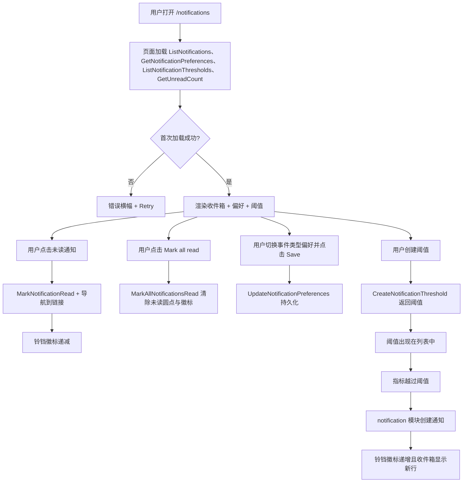
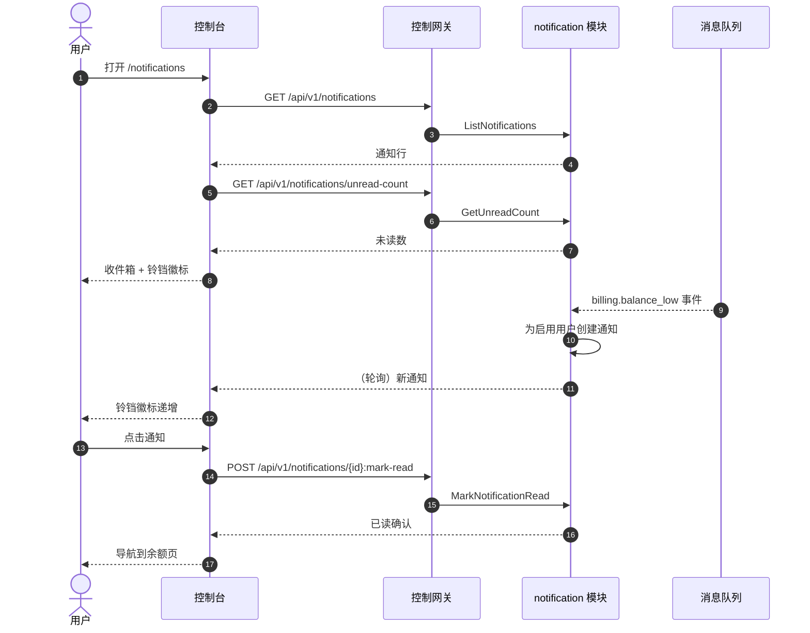

# 通知中心与阈值告警 — 需求分析与 UI/UX 设计

| 属性 | 内容 |
| --- | --- |
| 特性点 | 通知中心与阈值告警 — 每用户通知偏好与面向余额不足、消费限额、部署与自动扩缩事件的控制台内通知中心，带已读/未读状态（backlog 第 26 行） |
| 文档范围 | 需求分析与 UI/UX 设计：`/admin/notifications` 管理面通知中心，`/notifications` 终端用户面通知中心，页面 → API 面映射表，以及编号验收标准 |
| 归属模块 | `notification`（新增 — 拥有通知持久化、每用户偏好、阈值告警评估与已读/未读状态；订阅消息队列以获取事件目录），`web` 管理控制台（`AdminNotificationsPage`）与终端用户控制台（`UserNotificationsPage`），`pkg/server` 网关（管理前缀与用户前缀绑定） |
| 相关文档 | [架构设计](./architecture.zh-cn.md) — 第 1.2 节消息队列、第 2 节模块职责 · [控制台面分离](./console-surface-separation.zh-cn.md) — 本特性横跨的两个面、`UserShell`/`AdminShell` 约定、掩码投影规则 · [Webhook 通知与事件订阅](./webhook-notifications.zh-cn.md) — 本特性在控制台内消费的事件目录（特性 #23）· [推理自动扩缩](./inference-autoscaling.zh-cn.md) — 自动扩缩事件 · [余额与配额](./balance-quota.zh-cn.md) — 余额不足与消费限额事件 · [支付、发票与自动充值](./payments-invoices-auto-recharge.zh-cn.md) — 账单/发票事件 · [审计日志](./audit-logging.zh-cn.md) — 通知变更必须产生的审计轨迹 |
| 状态 | 设计完成，已移交架构师代理 |

---

## 1. 背景与竞品调研

go-taas 是一个 Token-as-a-Service 平台：它部署推理服务（特性 #2）、自动扩缩（特性 #16）、计量与计费（特性 #4、#5、#8、#14），并执行消费限额（特性 #11）。特性 #23 新增了**出站 webhook**，使外部系统能被推送它所关心的事件。但运营者与租户自己仍然**没有控制台内的视图**来查看这些事件：余额不足、消费限额超限、部署失败或服务扩缩，都只能通过打开相关页面并轮询来发现。没有任何单一位置收集这些事件、标记用户已看过哪些、并让用户选择关心哪些事件类型。

本特性新增**带阈值告警的通知中心**：平台持久化特性 #23 出站投递的同一事件目录，在控制台内以带已读/未读状态的通知列表呈现，让每个用户选择哪些事件类型生成通知（每用户偏好），并让用户定义**阈值告警**（余额不足、消费限额、自动扩缩副本数、部署失败），当指标越过阈值时生成通知。这是 Phase 4 生产化路线图项中最小可独立交付的增量：它把「平台改变了状态」变成「用户在控制台看到它并能采取行动」。

### 1.1 竞品的通知中心与阈值告警呈现

| 产品 | 通知面 | 阈值告警 | 已读/未读 | 偏好 | 主要陷阱 |
| --- | --- | --- | --- | --- | --- |
| **OpenAI Platform** | 无通用控制台内通知中心；用量与计费仅拉取；部分账户事件走邮件 | 消费限额告警走邮件；无控制台内阈值构建器 | 不适用 | 不适用 | 无可比较的控制台内通知面；告警仅邮件 |
| **Anthropic Console** | 无通用控制台内通知中心；工作区活动仅拉取 | 不适用 | 不适用 | 不适用 | 无可比较的通知面 |
| **Together AI / SiliconFlow** | Billing 页面显示余额与用量；被动告警，无通知中心 | 计费页上的余额不足警告；无可配置阈值 | 不适用 | 不适用 | 被动内联警告，非持久通知列表 |
| **百度千帆** | 计费中心含余额与用量；部分账户告警 | 计费中心中的余额不足与消费告警 | 不适用 | 不适用 | 告警深埋在计费中心；无统一通知列表 |
| **阿里云百炼** | 模型监控页面含告警规则；计费中心含高额消费预警 | 可配置高额消费预警阈值；监控告警规则 | 不适用 | 按规则启用 | 告警分散在监控与计费；无统一已读/未读通知中心 |
| **火山方舟** | 计费中心含用量与告警 | 余额与消费告警 | 不适用 | 不适用 | 告警仅限计费；无统一通知中心 |

### 1.2 提炼出的模式与决策

值得采纳的模式：(1) **统一控制台内通知列表** — 领先平台（阿里云百炼、百度千帆）在控制台内呈现账户与监控告警，但都没有把它们统一为一个已读/未读列表；go-taas 可以把所有事件类型收集到单一通知中心来领先；(2) **每用户偏好** — 阿里云百炼的按规则启用与 webhook 特性的按事件类型启用（特性 #23 D1）确立了用户应选择哪些事件类型生成通知；(3) **可配置阈值告警** — 阿里云百炼的高额消费预警与监控告警规则是标准的阈值告警模式；(4) **已读/未读状态** — 通用收件箱模式（邮件、GitHub、Slack），让用户一眼看到什么是新的；(5) **带未读徽标的铃铛** — 通知中心的标准入口，在 shell 头部显示未读数；(6) **深链** — 通知应链接到用户可采取行动的页面（余额页、消费限额页、部署详情、自动扩缩页）。

需要避免的陷阱：深埋在计费页中的通知中心（百度千帆、火山方舟）— 入口必须是 shell 头部持久的铃铛；仅邮件、无控制台内视图的告警（OpenAI）— 控制台必须是主面；无已读/未读状态（所有竞品）— 用户无法分辨什么是新的；无每用户偏好（多数）— 用户被无关事件类型淹没；以及向租户暴露运营者编排事件或向运营者暴露租户账户事件 — 目录必须按面拆分（特性 #17 的掩码投影规则）。

**go-taas 的决策**：

| # | 决策 | 依据 |
| --- | --- | --- |
| D1 | **通知中心存在于两个面，事件目录清晰拆分。** 管理面（`/admin/notifications`、`/api/v1/admin/notifications/*`）收集**平台编排事件** — `deployment.status_changed`、`autoscaling.scaled`、`autoscaling.scale_to_zero`。终端用户面（`/notifications`、`/api/v1/notifications/*`）收集**租户账户事件** — `billing.invoice_created`、`billing.invoice_paid`、`billing.spend_limit_breached`、`billing.balance_low`。这正是特性 #23（D1）确立的事件目录 | 部署与自动扩缩是运营者编排状态（特性 #16、#2）；账单、消费限额与余额是租户账户状态（特性 #14、#11、#8）。复用 webhook 目录使两个消费者保持一致，并遵循特性 #17 的掩码投影规则：租户绝不能看到运营者编排内部信息，运营者的通知列表也是运营者作用域 |
| D2 | **通知是带已读/未读状态的持久化事件。** 通知携带 `notification_id`、`event_type`、`title`、`body`、`severity`（`info` / `warning` / `critical`）、`read`（布尔）、`created_at`、`data` 负载与可选的 `link` 深链。订阅事件发生时（或阈值越过时）创建通知，保留 90 天 | 通知是特性 #23 出站投递的同一事件的控制台内投影；已读/未读是通用收件箱模式（模式 4）。90 天保留与请求日志与 webhook 投递保留一致（特性 #12、特性 #23 D6） |
| D3 | **每用户偏好选择哪些事件类型生成通知。** 每个用户有一组偏好：对其面目录中的每个事件类型，一个 `enabled` 布尔（默认全部启用）。禁用的事件类型仍在平台发生，但不为该用户创建通知。偏好按用户而非按组织 | 每用户偏好（模式 2）让每个运营者或租户选择自己关心的内容，镜像特性 #23 的按事件类型启用。按用户（而非按组织）因为通知已读状态与相关性是个人化的 |
| D4 | **阈值告警是可配置规则，当指标越过阈值时生成通知。** 阈值携带 `threshold_id`、`name`、`metric`、`operator`（`lt` / `gt`）、`value`、`enabled`、`created_at` 与 `updated_at`。**终端用户**指标为 `balance_low`（余额 < value 时通知）与 `spend_limit`（当前周期消费 > value 时通知）。**管理**指标为 `autoscaling_replicas`（服务副本数 > value 时通知）与 `deployment_failure`（任何部署失败时通知）。阈值越过创建带阈值名称的通知 | 可配置阈值（模式 3）是阿里云百炼高额消费预警模式。指标集映射到特性所述的事件类型：终端用户面的余额不足与消费限额，管理面的部署与自动扩缩（D1） |
| D5 | **带未读徽标的铃铛是入口。** 两个 shell（特性 #17）都在头部显示带未读计数徽标的铃铛图标；点击打开通知中心。徽标显示未读通知数，并在通知被读取或新通知到达时更新 | 铃铛 + 徽标是标准通知入口（模式 5），给用户一个持久、始终可见的方式查看什么是新的，避免深埋在计费中的陷阱 |
| D6 | **通知支持已读/未读、全部标记已读与删除。** 用户可标记单条通知已读、全部标记已读、删除通知。已读状态按用户、按通知 | 已读/未读（模式 4）加全部标记已读与删除是通知中心所需的最小收件箱操作；它们保持列表可管理 |
| D7 | **通知深链到用户可采取行动的页面。** 每条通知携带可选的 `link`（如 `billing.balance_low` 的余额页、`billing.spend_limit_breached` 的消费限额页、`deployment.status_changed` 的部署详情、`autoscaling.scaled` 的自动扩缩页）。点击通知导航到该页面并标记已读 | 深链（模式 6）把通知从「发生了某事」变成「这是你行动之处」，这正是控制台内通知中心的意义 |
| D8 | **`notification` 模块拥有本特性。** 它暴露 CRUD/查询 RPC、订阅消息队列以获取事件目录、评估阈值告警、持久化通知、跟踪已读/未读状态。它是统一 gRPC 服务器中的新模块（架构第 1.2 节） | 通知消费来自 `infer`、`billing` 与 `metering` 的事件；专用模块把通知关注点从产生模块中分离出来并给它一个归属，镜像 `webhook` 拥有投递的方式（特性 #23 D8） |
| D9 | **通知块（11001–11099）新增错误码**：**11001 `CodeNotificationNotFound`**、**11002 `CodeNotificationPreferencesInvalid`**、**11003 `CodeNotificationThresholdNotFound`**、**11004 `CodeNotificationThresholdInvalid`**、**11005 `CodeNotificationEventTypeInvalid`** | 通知是新模块（D8），因此其错误码放在计费报表块（109xx）之后的全新块中；不同错误码让「未找到」vs「偏好错误」vs「阈值错误」vs「事件类型错误」可操作 |
| D10 | **通知变更被审计**（特性 #15）：偏好变更与阈值创建/更新/删除各写一条审计事件。读取与删除通知不审计（它们是高频、低风险的用户操作） | 阈值与偏好是影响用户被告知内容的配置；审计轨迹必须记录谁改了什么，与审计日志特性的变更覆盖一致。读取/删除是个人收件箱操作，无跨用户影响 |

## 2. 目标与非目标

**目标**：一个管理面页面 `/admin/notifications`，列出带已读/未读状态的平台编排通知、支持全部标记已读与删除、管理面事件目录的每用户偏好，以及自动扩缩副本数与部署失败的阈值告警（D1、D2、D3、D4、D6、D7）；一个终端用户面页面 `/notifications`，针对租户账户事件采用相同结构，外加余额不足与消费限额的阈值告警（D1、D4）；两个 shell 中带未读徽标的铃铛（D5）；页面 → API 面映射表，含精确前缀（D1）；每页交互状态，包括加载、空、错误、禁用与权限拒绝；可在 Nightwatch 中针对 compose 栈测试的编号验收标准。

**非目标**：通知的邮件或短信投递（v1 仅控制台内；webhook 特性 #23 已覆盖出站投递）；通知摘要或定时；超出简单按事件通知的通知分组/去重；推送通知；跨面通知可见性（D1）；通知重放 API；对推理、计量或计费流水线的任何变更（事件目录的只读消费者）。

## 3. 角色与旅程

| 角色 | 面 | 旅程 |
| --- | --- | --- |
| **平台运营者** | 管理 | 打开 `/admin/notifications` → 看到部署失败的 `deployment.status_changed` 通知 → 点击它 → 导航到部署详情并标记已读 → 铃铛徽标递减 |
| **平台运营者（可靠性）** | 管理 | 创建 `autoscaling_replicas` 阈值告警（副本数 > 8 时通知）→ 服务扩缩到 10 副本 → 出现通知 → 运营者调查自动扩缩策略（特性 #16） |
| **租户开发者 / 智能体** | 终端用户 | 打开 `/notifications` → 看到 `billing.balance_low` 通知 → 点击它 → 导航到余额页并充值（特性 #14）→ 标记已读 |
| **租户财务管理员** | 终端用户 | 创建 `spend_limit` 阈值告警（本周期消费 > ¥500 时通知）→ 消费限额接近 → 出现通知 → 财务管理员提高限额或暂停密钥（特性 #11） |

> 术语：消费侧调用方在英文中为 **Agent**，中文为「智能体」，与仓库约定一致。

## 4. 特性需求

### FR1 — 通知列表与已读/未读（两个面）

- **FR1.1** `ListNotifications`（用户 `GET /api/v1/notifications` · 管理 `GET /api/v1/admin/notifications`）返回面的通知，最新在前，可按 `read` 状态与 `event_type` 过滤，分页（点分页）。每行携带 `notification_id`、`event_type`、`title`、`body`、`severity`、`read`、`created_at` 与 `link`（D2、D7）。
- **FR1.2** `GetNotification`（用户 `GET /api/v1/notifications/{notification_id}` · 管理 `GET /api/v1/admin/notifications/{notification_id}`）返回带完整 `data` 负载的单条通知。未知 `notification_id` 返回 **11001 `CodeNotificationNotFound`**（D9）。
- **FR1.3** `MarkNotificationRead`（用户 `POST /api/v1/notifications/{notification_id}:mark-read` · 管理 `POST /api/v1/admin/notifications/{notification_id}:mark-read`）标记单条通知已读。未知 `notification_id` 返回 **11001**（D9）。
- **FR1.4** `MarkAllNotificationsRead`（用户 `POST /api/v1/notifications:mark-all-read` · 管理 `POST /api/v1/admin/notifications:mark-all-read`）标记调用者的所有通知已读（D6）。
- **FR1.5** `DeleteNotification`（用户 `DELETE /api/v1/notifications/{notification_id}` · 管理 `DELETE /api/v1/admin/notifications/{notification_id}`）删除单条通知。未知 `notification_id` 返回 **11001**（D9）。
- **FR1.6** `GetUnreadCount`（用户 `GET /api/v1/notifications/unread-count` · 管理 `GET /api/v1/admin/notifications/unread-count`）返回调用者的未读数，用于铃铛徽标（D5）。

### FR2 — 每用户偏好（两个面）

- **FR2.1** `GetNotificationPreferences`（用户 `GET /api/v1/notifications/preferences` · 管理 `GET /api/v1/admin/notifications/preferences`）返回调用者的偏好：对其面目录中的每个事件类型，一个 `enabled` 布尔（默认全部启用）（D3）。
- **FR2.2** `UpdateNotificationPreferences`（用户 `PUT /api/v1/notifications/preferences` · 管理 `PUT /api/v1/admin/notifications/preferences`）更新调用者的偏好。面目录之外的事件类型返回 **11005 `CodeNotificationEventTypeInvalid`**；格式错误的偏好集返回 **11002 `CodeNotificationPreferencesInvalid`**（D9）。

### FR3 — 阈值告警（两个面）

- **FR3.1** `CreateNotificationThreshold`（用户 `POST /api/v1/notifications/thresholds` · 管理 `POST /api/v1/admin/notifications/thresholds`）从 `name`、`metric`、`operator`（`lt` / `gt`）与 `value` 创建阈值。**终端用户**指标为 `balance_low` 与 `spend_limit`；**管理**指标为 `autoscaling_replicas` 与 `deployment_failure`（D4）。无效指标/操作符/值返回 **11004 `CodeNotificationThresholdInvalid`**（D9）。
- **FR3.2** `ListNotificationThresholds`（用户 `GET /api/v1/notifications/thresholds` · 管理 `GET /api/v1/admin/notifications/thresholds`）返回调用者的阈值，可按 `enabled` 状态过滤（D4）。
- **FR3.3** `UpdateNotificationThreshold`（用户 `PUT /api/v1/notifications/thresholds/{threshold_id}` · 管理 `PUT /api/v1/admin/notifications/thresholds/{threshold_id}`）更新阈值的 `name`、`operator`、`value` 或 `enabled`。未知 `threshold_id` 返回 **11003 `CodeNotificationThresholdNotFound`**；无效值返回 **11004**（D9）。
- **FR3.4** `DeleteNotificationThreshold`（用户 `DELETE /api/v1/notifications/thresholds/{threshold_id}` · 管理 `DELETE /api/v1/admin/notifications/thresholds/{threshold_id}`）删除阈值。未知 `threshold_id` 返回 **11003**（D9）。
- **FR3.5** 阈值越过时，`notification` 模块创建以阈值 `name` 为标题、指标/值在正文中的通知（D4）。

### FR4 — 事件目录与通知创建

- **FR4.1** **管理**事件目录恰为：`deployment.status_changed`、`autoscaling.scaled`、`autoscaling.scale_to_zero`（D1）。**终端用户**事件目录恰为：`billing.invoice_created`、`billing.invoice_paid`、`billing.spend_limit_breached`、`billing.balance_low`（D1）。
- **FR4.2** 订阅事件发生时，`notification` 模块为面上每个偏好启用该事件类型的用户创建通知（D3）。通知携带事件的 `data` 负载与 `link` 深链（D7）。
- **FR4.3** 通知保留 90 天（D2）；更旧的通知被清除。

### FR5 — 面与 API 绑定

- **FR5.1** 管理通知中心位于**管理面**：路由 `/admin/notifications`，API 前缀 `/api/v1/admin/notifications/*`。加入 `AdminShell` 导航（特性 #17）为「Notifications」，`AdminShell` 头部显示带未读徽标的铃铛（D5）。
- **FR5.2** 终端用户通知中心位于**终端用户面**：路由 `/notifications`，API 前缀 `/api/v1/notifications/*`。加入 `UserShell` 导航（特性 #17）为「Notifications」，`UserShell` 头部显示带未读徽标的铃铛（D5）。
- **FR5.3** 管理页面只调用 `/api/v1/admin/notifications/*` 路由；终端用户页面只调用 `/api/v1/notifications/*` 路由。两者都不包含对方面的前缀字符串（特性 #17、D1）。
- **FR5.4** 管理事件目录绝不暴露在终端用户面，反之亦然（D1）：终端用户偏好只列出四个租户事件，管理偏好只列出三个运营者事件。

### FR6 — 审计

- **FR6.1** 偏好变更与阈值创建/更新/删除被审计（特性 #15）：`notification.preferences_updated`、`notification.threshold_created`、`notification.threshold_updated`、`notification.threshold_deleted`。读取与删除通知不审计（D10）。

## 5. UI 设计

### 5.1 页面：`/admin/notifications` — 通知（管理）

**目的**：给平台运营者一个平台编排事件（部署状态、自动扩缩）的单一控制台内视图，带已读/未读状态、每用户偏好，以及自动扩缩副本数与部署失败的阈值告警。

**面**：管理 — 路由 `/admin/notifications`，API `/api/v1/admin/notifications/*`。

**布局**：在 `AdminShell`（特性 #17）内渲染。页面头部（「Notifications」，副标题「Platform orchestration events and alerts」）带 **Mark all read** 主操作与 **Refresh** 次操作。头部下方三个标签页：

1. **Inbox 标签页** — 通知列表。
2. **Preferences 标签页** — 每用户事件类型偏好。
3. **Thresholds 标签页** — 阈值告警。

**Inbox 标签页**：

1. **通知列表** — 通知列表，最新在前，每行显示**severity** 徽标（info 灰 / warning 琥珀 / critical 红）、**title**、**body**、**event type** 芯片、**created** 相对时间，未读行带未读圆点。行操作：**Mark read**（未读行）、**Delete**。列表上方 **Mark all read** 操作。过滤器：**Status**（all / unread / read）与 **Event type**（面目录下拉）。分页（点分页）。
2. **未读徽标** — `AdminShell` 头部铃铛显示来自 `GetUnreadCount` 的未读数（D5）。

**Preferences 标签页**：

1. **事件类型偏好** — 三个管理事件类型（`deployment.status_changed`、`autoscaling.scaled`、`autoscaling.scale_to_zero`）的列表，每个带一行描述与 **enabled** 开关（默认开）。**Save** 操作通过 `UpdateNotificationPreferences` 持久化（D3）。

**Thresholds 标签页**：

1. **阈值列表** — 表格，列：**Name**、**Metric**、**Condition**（操作符 + 值）、**Status**（徽标：enabled 绿 / disabled 灰）、**Updated**、**Actions**。行操作：**Edit**、**Enable/Disable**、**Delete**。表格上方 **New threshold** 操作。
2. **新建/编辑阈值对话框** — 字段：**Name**（文本，必填）、**Metric**（下拉：Autoscaling replicas / Deployment failure）、**Operator**（单选：greater than / less than）、**Value**（数字，必填）、**Enabled**（开关，默认开）。**Cancel** / **Save** 操作。

**交互状态**：

| 状态 | 行为 |
| --- | --- |
| 默认 | 收件箱列表、偏好与阈值表格从首次成功加载渲染；last-updated 显示加载时间 |
| 加载中 | 列表/表格骨架行；Mark all read 与 Refresh 禁用 |
| 空 | Inbox 标签页：「No notifications yet.」带事件将出现在此的提示；Preferences 标签页：三个事件类型始终渲染（永不为空）；Thresholds 标签页：「No thresholds yet.」带 **New threshold** 操作 |
| 错误 | 错误横幅带消息与 Retry 按钮；页面保留最后的好数据并显示「Showing stale data」横幅 |
| 禁用 | 请求进行中时 Mark all read / Mark read / Delete 禁用；偏好保存中 Save 禁用；阈值保存中 Save 禁用 |
| 权限拒绝 | 无所需角色的会话收到 10036，页面显示标准权限拒绝状态（特性 #17）带返回管理首页的链接 |

**通知列表列**：Severity（徽标）、Title、Body、Event type（芯片）、Created（相对时间）、未读圆点。可按 Created 排序。可按 Status（all / unread / read）与 Event type 过滤；分页。

**阈值表格列**：Name、Metric、Condition、Status（徽标）、Updated、Actions。可按 Name、Metric、Updated 排序。可按 Status（all / enabled / disabled）过滤；分页。

**对话框与确认流程**：

- **全部标记已读**：点击 **Mark all read** 调用 `MarkAllNotificationsRead` 并清除未读圆点与铃铛徽标。
- **删除通知**：确认对话框「Delete this notification?」带 **Cancel** / **Delete**。删除调用 `DeleteNotification` 并移除该行。
- **新建/编辑阈值**：提交对话框调用 `CreateNotificationThreshold` / `UpdateNotificationThreshold`；校验错误（11004）在对话框内联显示。
- **删除阈值**：确认对话框「Delete threshold <name>?」带 **Cancel** / **Delete**（危险）。删除调用 `DeleteNotificationThreshold` 并移除该行。

### 5.2 页面：`/notifications` — 通知（终端用户）

**目的**：给租户开发者 / 智能体 / 财务用户一个租户账户事件（账单、消费限额、余额）的单一控制台内视图，带已读/未读状态、每用户偏好，以及余额不足与消费限额的阈值告警。

**面**：终端用户 — 路由 `/notifications`，API `/api/v1/notifications/*`。

**布局**：在 `UserShell`（特性 #17）内渲染。页面头部（「Notifications」，副标题「Your account events and alerts」）带 **Mark all read** 主操作与 **Refresh** 次操作。头部下方与 §5.1 相同的三个标签页。

**Inbox 标签页**：与 §5.1 相同的通知列表，限定到租户自己的通知。**Event type** 过滤器只列出四个租户事件（`billing.invoice_created`、`billing.invoice_paid`、`billing.spend_limit_breached`、`billing.balance_low`）。

**Preferences 标签页**：与 §5.1 相同的事件类型偏好，只列出四个租户事件（D1）。

**Thresholds 标签页**：与 §5.1 相同的阈值表格，**Metric** 下拉提供 **Balance low**（余额 < value 时通知）与 **Spend limit**（消费 > value 时通知）（D4）。

**交互状态**：与 §5.1 相同，空文案为「No notifications yet.」/「No thresholds yet.」，权限拒绝文案为租户自己的错误（特性 #17 第 8.2 节的 10005 组织消失 / 10017 组织禁用，FR5.3 的 10027/10038 重定向）。页面不暴露其他租户数据（D1）。

**通知列表列**：与 §5.1 相同，限定到租户自己的通知。排序与分页同 §5.1。

**阈值表格列**：与 §5.1 相同，限定到租户自己的阈值。排序与分页同 §5.1。

**对话框与确认流程**：与 §5.1 相同（全部标记已读、删除通知、新建/编辑阈值、删除阈值）。

### 5.3 流程

## 6. API 面影响

所有通知 RPC 属于 **`notification` 模块**（D8），经控制网关以 HTTP 提供。管理路由位于**管理前缀** `/api/v1/admin/notifications/*`（D1）；终端用户路由位于**用户前缀** `/api/v1/notifications/*`（D1）。

| RPC | 路由 | 前缀 | 状态 | 用途 |
| --- | --- | --- | --- | --- |
| `ListNotifications` | `GET /api/v1/notifications` · `GET /api/v1/admin/notifications` | 用户 · 管理 | **新增** | 带已读/事件过滤、分页的列表 |
| `GetNotification` | `GET /api/v1/notifications/{notification_id}` · `GET /api/v1/admin/notifications/{notification_id}` | 用户 · 管理 | **新增** | 带完整数据的单条通知；缺失 → 11001 |
| `MarkNotificationRead` | `POST /api/v1/notifications/{notification_id}:mark-read` · `POST /api/v1/admin/notifications/{notification_id}:mark-read` | 用户 · 管理 | **新增** | 标记单条已读；缺失 → 11001 |
| `MarkAllNotificationsRead` | `POST /api/v1/notifications:mark-all-read` · `POST /api/v1/admin/notifications:mark-all-read` | 用户 · 管理 | **新增** | 全部标记已读 |
| `DeleteNotification` | `DELETE /api/v1/notifications/{notification_id}` · `DELETE /api/v1/admin/notifications/{notification_id}` | 用户 · 管理 | **新增** | 删除单条；缺失 → 11001 |
| `GetUnreadCount` | `GET /api/v1/notifications/unread-count` · `GET /api/v1/admin/notifications/unread-count` | 用户 · 管理 | **新增** | 铃铛徽标的未读数 |
| `GetNotificationPreferences` | `GET /api/v1/notifications/preferences` · `GET /api/v1/admin/notifications/preferences` | 用户 · 管理 | **新增** | 每用户事件类型偏好 |
| `UpdateNotificationPreferences` | `PUT /api/v1/notifications/preferences` · `PUT /api/v1/admin/notifications/preferences` | 用户 · 管理 | **新增** | 更新偏好；坏事件 → 11005，坏集 → 11002 |
| `CreateNotificationThreshold` | `POST /api/v1/notifications/thresholds` · `POST /api/v1/admin/notifications/thresholds` | 用户 · 管理 | **新增** | 创建阈值；无效 → 11004 |
| `ListNotificationThresholds` | `GET /api/v1/notifications/thresholds` · `GET /api/v1/admin/notifications/thresholds` | 用户 · 管理 | **新增** | 列出阈值，enabled 过滤 |
| `UpdateNotificationThreshold` | `PUT /api/v1/notifications/thresholds/{threshold_id}` · `PUT /api/v1/admin/notifications/thresholds/{threshold_id}` | 用户 · 管理 | **新增** | 更新阈值；缺失 → 11003，无效 → 11004 |
| `DeleteNotificationThreshold` | `DELETE /api/v1/notifications/thresholds/{threshold_id}` · `DELETE /api/v1/admin/notifications/thresholds/{threshold_id}` | 用户 · 管理 | **新增** | 删除阈值；缺失 → 11003 |

**给架构师代理的契约说明**：

1. `Notification` 携带 `notification_id`、`event_type`、`title`、`body`、`severity`（封闭枚举：`info` / `warning` / `critical`）、`read`（布尔）、`created_at`、`data`（事件负载）与 `link`（可选深链）。通知保留 90 天（D2）。
2. `ListNotifications` 按 `read`（布尔）与 `event_type`（面目录值，否则 11005）过滤，用点分页分页。`GetUnreadCount` 返回调用者的未读数。
3. 偏好是 `event_type` → `enabled`（布尔）的映射，默认全部启用（D3）。`UpdateNotificationPreferences` 校验每个键都在面目录中（否则 11005）且集合格式正确（否则 11002）。
4. 阈值携带 `threshold_id`、`name`、`metric`、`operator`（`lt` / `gt`）、`value`（数字）、`enabled`（布尔）、`created_at`、`updated_at`。终端用户指标为 `balance_low` 与 `spend_limit`；管理指标为 `autoscaling_replicas` 与 `deployment_failure`（D4）。无效指标/操作符/值返回 11004。
5. `notification` 模块订阅消息队列以获取事件目录（D8）：来自 `infer` 的管理事件（部署状态、自动扩缩）、来自 `billing` 的终端用户事件（发票、消费限额、余额不足）。事件发生时，为面上每个偏好启用该事件类型的用户创建通知（FR4.2）。阈值评估在同一事件流上运行（FR3.5）。该模块是统一服务器中的新 gRPC 服务（架构第 1.2 节）。
6. 偏好变更与阈值创建/更新/删除被审计（D10、特性 #15）：`notification.preferences_updated`、`notification.threshold_created`、`notification.threshold_updated`、`notification.threshold_deleted`。读取与删除通知不审计。
7. 线上约定不变：列表用点分页，成功 HTTP 200，业务错误为 `{"code": <int>, "message": "..."}`。

错误码（通知块 11001–11099，`pkg/errors/codes.go`）：

| 条件 | 码 | 常量 | 说明 |
| --- | --- | --- | --- |
| 未知 `notification_id` | 11001 | `CodeNotificationNotFound` | **新增**（D9） |
| 格式错误的偏好集 | 11002 | `CodeNotificationPreferencesInvalid` | **新增**（D9） |
| 未知 `threshold_id` | 11003 | `CodeNotificationThresholdNotFound` | **新增**（D9） |
| 无效阈值（指标/操作符/值） | 11004 | `CodeNotificationThresholdInvalid` | **新增**（D9） |
| 面目录之外的事件类型 | 11005 | `CodeNotificationEventTypeInvalid` | **新增**（D9） |
| 数据库 / MQ 基础设施故障 | 500 | `CodeInternal` | 经错误归一化 |

## 7. 验收标准

| # | 标准 | 级别 |
| --- | --- | --- |
| AC1 | `ListNotifications` 返回面的通知，带已读/事件过滤与分页；`GetUnreadCount` 返回调用者的未读数 | FVT |
| AC2 | `MarkNotificationRead` 标记单条通知已读，`MarkAllNotificationsRead` 全部标记已读；未知 `notification_id` 返回 11001 | FVT |
| AC3 | `DeleteNotification` 删除单条通知；未知 `notification_id` 返回 11001 | FVT |
| AC4 | `GetNotificationPreferences` 默认返回全部事件类型启用；`UpdateNotificationPreferences` 持久化变更，面目录之外的事件类型返回 11005，格式错误的集合返回 11002 | FVT |
| AC5 | `CreateNotificationThreshold` 带有效指标/操作符/值返回阈值；无效指标/操作符/值返回 11004；`UpdateNotificationThreshold` 与 `DeleteNotificationThreshold` 生效，未知 `threshold_id` 返回 11003 | FVT |
| AC6 | 订阅事件（如终端用户面的 `billing.balance_low`）为每个偏好启用该事件类型的用户创建通知；禁用的事件类型不创建通知 | FVT |
| AC7 | 阈值越过（如余额 < value 时的 `balance_low`）创建带阈值名称的通知 | FVT |
| AC8 | `/admin/notifications` 页面从首次成功加载渲染收件箱、偏好与阈值，带 last-updated 时间戳与显示未读数的铃铛徽标 | E2E |
| AC9 | 点击未读通知标记已读、导航到其链接并递减铃铛徽标；**Mark all read** 清除所有未读圆点与徽标 | E2E |
| AC10 | 空状态（「No notifications yet.」/「No thresholds yet.」）在无数据匹配时渲染；失败加载保留最后的好数据并显示「Showing stale data」横幅与 Retry 操作 | E2E |
| AC11 | 切换事件类型偏好并保存会持久化；创建阈值将其加入列表；删除阈值显示确认对话框并移除该行 | E2E |
| AC12 | `/notifications` 页面渲染租户作用域的收件箱、偏好（仅四个租户事件）与阈值（Balance low / Spend limit），无其他租户数据 | E2E |
| AC13 | 管理通知中心仅在管理面可达：路由 `/admin/notifications`，每个 API 调用使用 `/api/v1/admin/notifications/*` 前缀，无 `/api/v1/notifications/*` 字符串 | E2E（面分离） |
| AC14 | 终端用户通知中心仅在终端用户面可达：路由 `/notifications`，每个 API 调用使用 `/api/v1/notifications/*` 前缀，无 `/api/v1/admin/*` 字符串 | E2E（面分离） |
| AC15 | 无所需角色的会话在管理通知中心收到 10036，页面显示标准权限拒绝状态 | E2E |

## 8. 范围外（在其他处跟踪）

| 项 | 位置 |
| --- | --- |
| 通知的邮件或短信投递 | 未来细化 — v1 仅控制台内；webhook（特性 #23）已覆盖出站投递 |
| 通知摘要或定时 | 未来细化 |
| 超出简单按事件通知的通知分组/去重 | 未来细化 |
| 推送通知 | 未来细化 |
| 跨面通知可见性 | 刻意缺失（D1） |
| 通知重放 API | 未来细化 |
| 对推理、计量或计费流水线的任何变更 | 刻意缺失 — 事件目录的只读消费者（D8） |