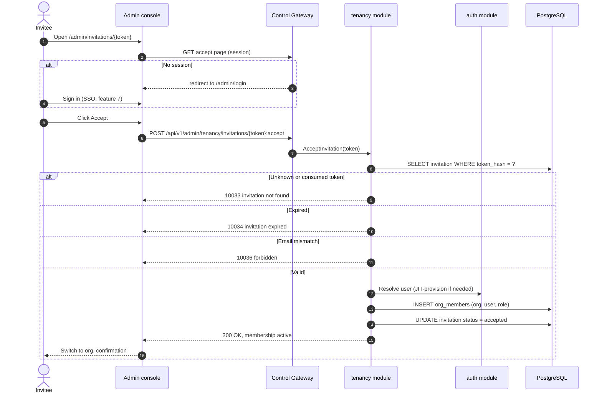
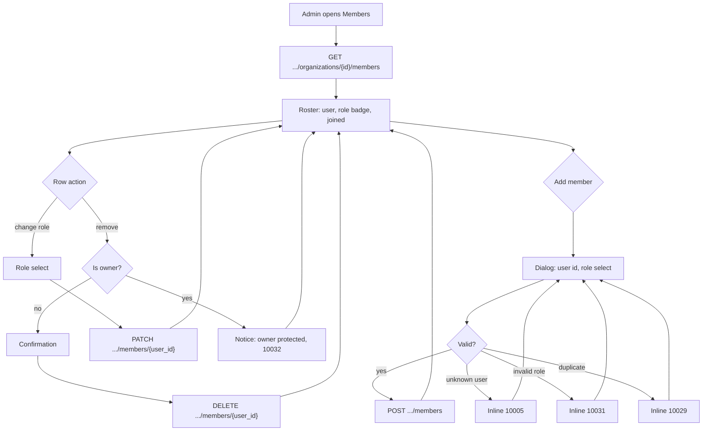
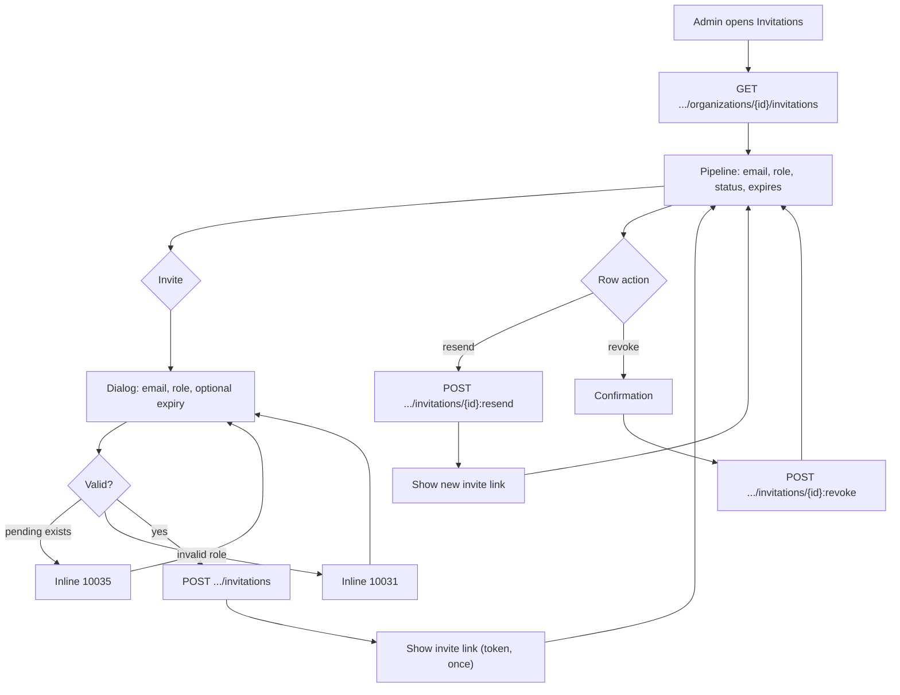

# Organization Members, Roles & Invitations (RBAC) — Requirement Analysis and UI/UX Design

| Attribute | Content |
| --- | --- |
| Feature point | Organization members, roles & invitations (RBAC) |
| Document scope | Requirement analysis and UI/UX design for the `tenancy` module's membership core: the `org_members` and `invitations` tables, member CRUD, invitation lifecycle (create/list/resend/revoke/accept/reject), the fixed role set (owner/admin/member/viewer), the RoleGuard that gates org-scoped admin APIs by the caller's role, session `AccessibleOrgs`/roles derived from `org_members` (authoritative over IdP claims), the console Members and Invitations pages, the invitation accept flow, and acceptance criteria |
| Owning modules | `tenancy` (org_members, invitations, RoleGuard, membership resolution), with `auth` (session roles/accessible orgs now derived from `org_members` instead of IdP claims) |
| Related documents | [Architecture Design](./architecture.md) — §2.1 `auth` (RBAC, roles, invitations), §3.1 admin/user surface separation · [Multi-Tenancy Isolation](./multi-tenancy.md) — the `organizations` table and org context this feature's membership rows attach to (its D12 defers members/roles here) · [SSO Federation](./sso-federation.md) — the User model, `identity_bindings`, sessions, and attribute-to-role mapping this feature supersedes for membership (its D7 defers RBAC enforcement here) · [Balance & Quota](./balance-quota.md) — the established doc format and the org-scoped admin surface this feature gates |
| Status | Design complete, handed to the Architect agent |

---

## 1. Background

Features #6 and #7 delivered the tenancy and identity spine: organizations and projects are real rows, and SSO gives the console a login, a session, and an account model. But **membership is still not enforceable**. Feature #7's attribute-to-role mapping (its D7) puts roles and accessible orgs on the session from **IdP claims** — whatever the identity provider says, the platform trusts. There is no `org_members` table, no way to say "who belongs to this organization and what may they do", and no invitation flow to bring a person into a tenant. The console's org switcher lists whatever the IdP claims, and every org-scoped admin API trusts the session's role claim verbatim.

This feature point grounds membership in real rows. It delivers the `org_members` table (the authoritative source of who belongs to an org and with what role), the `invitations` table (the self-service path for bringing people in), and the **RoleGuard** — a middleware that gates every org-scoped admin API by the caller's role in the resolved org context. Session `AccessibleOrgs` and roles are now **derived from `org_members`**, not from IdP claims; the IdP claim becomes a hint, never the authority.

### 1.1 How Comparable Products Model Members, Roles & Invitations

| Product | Membership model | Roles | Invitations | Role enforcement | Notable pitfalls |
| --- | --- | --- | --- | --- | --- |
| **OpenAI Platform** | Org members with roles; project members with roles | Owner, admin, member, viewer (org); per-project roles | Email invitation with accept link; owner/admin invite | Role gates org and project settings; viewer is read-only | Owner transfer is a support ticket; role changes are coarse |
| **Anthropic Console** | Workspace members with roles | Owner, admin, member, viewer | Email invitation; admin invites | Role gates workspace settings and spend | Two selectors (org + project) confuse new users; role mapping from IdP is coarse |
| **GitHub** | Org members, teams, outside collaborators | Owner, member, billing manager; team roles | Email invitation with accept; pending invitations list | Role + team membership gates repos and settings | Owner is unique and protected; transfer requires explicit handoff |
| **Hugging Face** | Org members with roles | Admin, write, read | Invitation by email; accept flow | Role gates repo write/read | No owner concept; admin can be removed leaving an org unowned |
| **Google Workspace** | Directory users with admin roles | Super admin, group admin, user | Admin-provisioned accounts; no self-invite | Admin roles gate console sections | Super admin is unique and protected; delegation is complex |
| **阿里云百炼 (Alibaba Cloud Bailian)** | Workspace members with roles | Owner, admin, member, viewer | Invitation by account/email; accept flow | Role gates workspace model authorization and billing | Owner transfer is heavyweight; role changes are coarse |

### 1.2 Distilled Patterns and Decisions

Common industry patterns worth adopting:

1. **A fixed, small role set** — every surveyed platform settles on owner/admin/member/viewer (or an equivalent four). A fixed set is understandable, testable, and maps cleanly to UI badges; free-form roles invite drift.
2. **Owner is unique and protected** — the owner cannot be removed or demoted by anyone, including themselves, without an explicit transfer. GitHub and Google Workspace both protect the owner; Hugging Face's lack of an owner is a known gap.
3. **Membership is authoritative, not claims** — the platform's `org_members` table is the source of truth for who belongs and with what role. IdP claims are a provisioning hint at most; a stale claim must never grant access the membership table denies.
4. **Email invitation with a tokenized accept link** — the standard self-service path (OpenAI, GitHub, Hugging Face): an admin invites by email, the invitee clicks a tokenized link, and the membership activates on accept. Tokens are single-use and expire.
5. **Viewer is read-only** — the lowest role sees org data but mutates nothing. This is the safety floor every platform ships; it makes "read-only auditor" a first-class principal.
6. **Role gates the admin surface, not the data plane** — RBAC governs the control plane (console and admin APIs). The data plane keeps authenticating by API key; a key's org membership is checked at key-creation time, not per inference call.

Pitfalls to avoid:

- **Trusting IdP claims for membership** (the status quo) — a claim is a hint, not a row; a stale or forged claim grants access the org never approved. This feature's core fix.
- **Deleting the owner** — an org with no owner is ungovernable. Owner removal and demotion must be blocked; transfer is the only path.
- **Free-text roles** — unconstrained roles cannot be enforced by a guard or rendered as a badge. The fixed set is the contract.
- **Invitation tokens stored in plaintext** — a leaked token is a standing credential. Tokens are hashed at rest and single-use.
- **Invitations that never expire** — a pending invitation is an open door. Expiry (default 7 days) bounds the window.
- **Per-call RBAC on the data plane** — checking membership on every inference request adds latency to the hot path for no security gain. RBAC is a control-plane concern.

**Decisions for go-taas** (recorded rationale, per the autonomous-decision rule):

| # | Decision | Rationale |
| --- | --- | --- |
| D1 | **Fixed role set: `owner`, `admin`, `member`, `viewer`.** Roles are a closed enum, not free text. `owner` is unique per org and protected; `admin` manages members and invitations; `member` uses org resources; `viewer` is read-only | Pattern 1; the industry four; a closed enum is enforceable by the RoleGuard and renderable as a badge |
| D2 | **`org_members` is the authoritative membership source.** Session `AccessibleOrgs` and roles are derived from `org_members` (feature #7's session now reads membership rows, not IdP claims). The IdP claim is a provisioning hint only — it can seed a pending membership, never grant access the table denies | Pattern 3; the core fix for the claims-trust gap; the session resolver (feature #7's FR4) stays, only its input changes to the membership table |
| D3 | **Owner is unique and protected.** An org has exactly one `owner`. The owner cannot be removed or demoted by any member (including themselves); the only path is an explicit owner transfer (deferred to a follow-up). Removing/demoting the owner → 10033 | Pattern 2; an unowned org is ungovernable; the transfer flow is a small, separable follow-up |
| D4 | **Invitation tokens are hashed at rest and single-use.** The `invitations` table stores a hash of the token; the raw token is returned once at creation and never stored. Accept/reject consumes the token (status → `accepted`/`rejected`); reuse → 10035 | Pattern 4 + the plaintext-token pitfall; a hashed, single-use token is a bounded credential |
| D5 | **Invitations expire by default after 7 days.** `expires_at` is set at creation (default now + 7 days, configurable per invite); an expired invitation cannot be accepted (→ 10035) and is surfaced as `expired` in the list | Pattern 4 + the never-expiring pitfall; a bounded window closes the open-door risk |
| D6 | **RoleGuard gates every org-scoped admin API.** A middleware resolves the caller's role in the resolved org context from `org_members` and rejects calls below the required role with **10036 `CodeForbidden`**. `viewer` is read-only: any mutating org-scoped admin API requires at least `member`; member/invitation management requires `admin` or `owner` | Pattern 6; RBAC is a control-plane concern; the guard is one seam every org-scoped API passes through |
| D7 | **Membership and invitation management are `admin`/`owner`-only.** `ListOrgMembers`/`AddOrgMember`/`RemoveOrgMember`/`SetOrgMemberRole` and all invitation RPCs require `admin` or `owner` in the org context. `owner` additionally is the only role that can manage the owner row (which is protected by D3) | Pattern 1/2; the admin tier owns the roster; the owner tier owns the owner row |
| D8 | **API surface**: a new `taas.tenancy.v1.TenancyService` extension — member RPCs (`ListOrgMembers`, `AddOrgMember`, `RemoveOrgMember`, `SetOrgMemberRole`) and invitation RPCs (`CreateInvitation`, `ListInvitations`, `RevokeInvitation`, `ResendInvitation`, `AcceptInvitation`, `RejectInvitation`) — all under `/api/v1/admin/tenancy/*`, org-scoped via the resolved org context | The tenancy module already owns orgs (feature #6); membership is the org's roster, so it lives beside the org CRUD |
| D9 | **New error codes** in the auth/tenancy block: **10029 `CodeMemberExists`**, **10030 `CodeMemberNotFound`**, **10031 `CodeRoleInvalid`**, **10032 `CodeOwnerProtected`**, **10033 `CodeInvitationNotFound`**, **10034 `CodeInvitationExpired`**, **10035 `CodeInvitationExists`**, **10036 `CodeForbidden`** | The 100xx block is auth's and tenancy's; each failure mode needs its own code so the console can render the right inline message (the metering D9 pattern) |
| D10 | **Deferred**: owner transfer, team/group membership, per-project roles, SCIM directory sync, invitation email delivery (the console shows the invite link instead), and role-based visibility of the data plane | Owner transfer is a separable follow-up; teams and per-project roles need the project-column work deferred in feature #6; SCIM and email delivery are infrastructure; the data plane stays key-authenticated |

### 1.3 Scope Boundary

**In scope**: the `org_members` table (org_id, user_id, role, composite PK) and the `invitations` table (org_id, email, role, token hash, status, expires_at, created_by); member CRUD RPCs; invitation lifecycle RPCs; the RoleGuard gating org-scoped admin APIs; session `AccessibleOrgs`/roles derived from `org_members`; the console Members page, Invitations page, and invitation accept flow; new error codes 10029–10036.

**Out of scope** (tracked elsewhere): owner transfer (follow-up), teams/groups and per-project roles (after the feature-#6 project-column deferral), SCIM directory sync (future), invitation email delivery (the console surfaces the invite link), role-based data-plane visibility (the data plane stays key-authenticated), and CLI member/invitation commands (follow the API, shipped when the CLI surface is next touched).

---

## 2. User Roles

| Role | Description | Interaction with members & invitations |
| --- | --- | --- |
| **Platform administrator** | The operator who runs the go-taas cluster; today also the console user | Manages the org roster and invitations across all tenants; the RoleGuard applies to them too (they hold a role per org) |
| **Organization owner** | The unique, protected top role in an org | Manages the roster and invitations; cannot be removed or demoted; the only role that governs the owner row |
| **Organization admin** | The second tier in an org | Manages members and invitations (add/remove/change role, invite/resend/revoke); cannot touch the owner row |
| **Organization member** | A working member of an org | Uses org resources (keys, services, usage); cannot manage the roster |
| **Viewer** | A read-only member of an org | Sees org data (usage, bills, members) but mutates nothing |
| **Invitee** | A person invited by email who has not yet accepted | Opens the accept link, authenticates (or JIT-provisions), and accepts/rejects the invitation |
| **Agent / SDK** | The programmatic consumer whose calls generate usage | Unaffected directly: the data plane still authenticates by API key; RBAC governs the control plane only |
| **Console (this feature)** | The admin web UI | Renders the Members page, the Invitations page, and the invitation accept flow |

> Terminology: the consuming caller is called an **Agent** (English) / 「智能体」(Chinese), consistent with the repo convention.

---

## 3. User Stories

| # | As a… | I want to… | So that… |
| --- | --- | --- | --- |
| US1 | Organization admin | see the list of members in my org with their roles | I know who belongs and what they may do |
| US2 | Organization admin | add a member by user id and assign a role | a colleague can start working in the org |
| US3 | Organization admin | change a member's role | I can promote or demote as responsibilities change |
| US4 | Organization admin | remove a member | I can revoke access when someone leaves |
| US5 | Organization owner | be protected from removal and demotion | my org can never become ungovernable |
| US6 | Organization admin | invite a person by email with a role | someone without an account yet can join the org |
| US7 | Organization admin | see pending invitations and resend or revoke them | I can manage the invite pipeline |
| US8 | Invitee | open an invite link, sign in, and accept | I join the org without an admin creating me first |
| US9 | Invitee | reject an invitation | I decline an org I do not want to join |
| US10 | Viewer | see org data but be blocked from mutating it | I can audit without risking changes |
| US11 | Platform administrator | have the console's org switcher list only orgs I am a member of | I cannot switch into a tenant I do not belong to |
| US12 | Organization admin | get an explicit error when I try to remove the owner | the system protects the owner even from me |

---

## 4. Functional Requirements

### FR1 — Member management

- **FR1.1** `ListOrgMembers` (`GET /api/v1/admin/tenancy/organizations/{organization_id}/members`) returns the org's members paginated (default 20, cap 100), each row carrying `user_id`, display name, role, and `joined_at`. Requires `admin`/`owner` in the org context; `viewer`/`member` → 10036.
- **FR1.2** `AddOrgMember` (`POST …/members`) adds a member: `user_id` (must exist → else 10005) and `role` (one of `admin`/`member`/`viewer`; **`owner` cannot be assigned here** — the owner row is created with the org and protected). Duplicate `(org_id, user_id)` → 10029; invalid role → 10031. Requires `admin`/`owner`.
- **FR1.3** `SetOrgMemberRole` (`PATCH …/members/{user_id}`) changes a member's role. Invalid role → 10031; unknown member → 10030; **targeting the owner → 10032** (D3). Requires `admin`/`owner`.
- **FR1.4** `RemoveOrgMember` (`DELETE …/members/{user_id}`) removes a member (idempotent). Unknown member → 10030; **removing the owner → 10032** (D3). Requires `admin`/`owner`.

### FR2 — Invitation management

- **FR2.1** `CreateInvitation` (`POST /api/v1/admin/tenancy/organizations/{organization_id}/invitations`) invites a person: `email` (validated), `role` (one of `admin`/`member`/`viewer`; `owner` cannot be invited), optional `expires_in` (default 7 days, D5). Returns the raw token **once** (D4). A pending invitation for the same email → 10035; invalid role → 10031. Requires `admin`/`owner`.
- **FR2.2** `ListInvitations` (`GET …/invitations`) returns the org's invitations paginated, each row carrying id, email, role, status (`pending`/`accepted`/`rejected`/`revoked`/`expired`), `expires_at`, `created_by`, and `created_at`. Filter: `status` (optional). Requires `admin`/`owner`.
- **FR2.3** `RevokeInvitation` (`POST …/invitations/{invitation_id}:revoke`) flips a `pending` invitation to `revoked` (idempotent). Unknown id → 10033; already consumed → 10033. Requires `admin`/`owner`.
- **FR2.4** `ResendInvitation` (`POST …/invitations/{invitation_id}:resend`) regenerates the token and extends `expires_at` for a `pending` invitation, returning the new raw token once. Unknown id → 10033; consumed → 10033. Requires `admin`/`owner`.

### FR3 — Invitation accept and reject

- **FR3.1** `AcceptInvitation` (`POST /api/v1/admin/tenancy/invitations/{token}:accept`) accepts a pending invitation: the caller must be authenticated (session) and the invitation's email must match the caller's email (else 10036). On success the caller is added to `org_members` with the invitation's role, the invitation flips to `accepted`, and the token is consumed. Unknown/consumed token → 10033; expired → 10034.
- **FR3.2** **JIT provisioning on accept**: if the caller has no platform user yet, the accept flow JIT-provisions one (feature #7's D4 pattern) before adding the membership. The invitation's email is the binding hint.
- **FR3.3** `RejectInvitation` (`POST …/invitations/{token}:reject`) flips a `pending` invitation to `rejected` and consumes the token. Unknown/consumed → 10033; expired → 10034.
- **FR3.4** An invitation is **single-use**: once `accepted`/`rejected`/`revoked`/`expired`, the token cannot be used again (→ 10033/10034).

### FR4 — RoleGuard and session membership

- **FR4.1** **RoleGuard**: a middleware on every org-scoped admin API resolves the caller's role in the resolved org context from `org_members` and enforces the required role. Below the requirement → **10036 `CodeForbidden`**. Read-only APIs require at least `viewer`; mutating org-scoped APIs require at least `member`; member/invitation management requires `admin`/`owner` (D6/D7).
- **FR4.2** **Session membership derivation**: `GetSession` (feature #7) now returns `AccessibleOrgs` and per-org roles **derived from `org_members`**, not from IdP claims (D2). The IdP claim may seed a pending membership but never grants access the table denies.
- **FR4.3** The console org switcher lists the session's `AccessibleOrgs` (already the feature-#7 behavior); switching into an org the user is not a member of → 10005 (feature #7's FR4.3, unchanged).

### FR5 — Console Members, Invitations, and accept pages

- **FR5.1** A "Members" nav item (`/admin/organizations/{id}/members`) opens the roster: one row per member — user id, display name, role badge, joined time; a "Add member" dialog (user id, role select); row actions: change role (role select), remove (confirmation, blocked for the owner with a notice); inline errors for 10029/10030/10031/10032/10036.
- **FR5.2** An "Invitations" nav item (`/admin/organizations/{id}/invitations`) opens the invite pipeline: one row per invitation — email, role badge, status badge, expires, created by, created time; a "Invite" dialog (email, role select, optional expiry); row actions: resend (shows the new link), revoke (confirmation); inline errors for 10031/10033/10035/10036.
- **FR5.3** An accept page (`/admin/invitations/{token}`) renders the invitation: the org name, the role being granted, and Accept / Reject buttons. Accepting requires an authenticated session (redirect to `/admin/login` if not); on success the console switches to the org and shows a confirmation. Rejecting shows a confirmation and returns to the console.
- **FR5.4** The Members and Invitations pages are reachable only by `admin`/`owner` in the org context; a `viewer`/`member` sees a 10036 notice. The role legend (owner/admin/member/viewer) is shown on the Members page.

---

## 5. Page and Flow Design

### 5.1 Page Map

| Page / component | Purpose |
| --- | --- |
| **Members page** (`/admin/organizations/{id}/members`) | The org roster: rows, add-member dialog, change-role, remove (owner-protected) |
| **Add member dialog** | User id + role select |
| **Invitations page** (`/admin/organizations/{id}/invitations`) | The invite pipeline: rows, invite dialog, resend, revoke |
| **Invite dialog** | Email + role select + optional expiry |
| **Invitation accept page** (`/admin/invitations/{token}`) | Renders the invite; Accept / Reject buttons |
| **Role legend** | Explains owner/admin/member/viewer on the Members page |
| **Org switcher** (sidebar, session-aware) | Lists the session's `AccessibleOrgs` (from `org_members`) |

### 5.2 Invitation Accept Flow

### 5.3 Members Page Flow

### 5.4 Invitations Page Flow

---

## 6. API Surface Implications

All APIs belong to the existing **`taas.tenancy.v1.TenancyService`** (proto: `proto/taas/tenancy/v1/tenancy.proto`), served as HTTP via the Control Gateway under `/api/v1/admin/tenancy/*`. Member and invitation RPCs are org-scoped via the resolved org context (feature #6's validated context, feature #7's session) and gated by the RoleGuard (D6/D7). The data-plane `VerifyAPIKey` RPC is unchanged.

| RPC | HTTP | Status | Purpose | Notes |
| --- | --- | --- | --- | --- |
| `ListOrgMembers` | `GET /api/v1/admin/tenancy/organizations/{organization_id}/members` | **new** | The org roster | `admin`/`owner`; paginated |
| `AddOrgMember` | `POST …/organizations/{organization_id}/members` | **new** | Add a member | `admin`/`owner`; 10029/10031/10005 |
| `SetOrgMemberRole` | `PATCH …/organizations/{organization_id}/members/{user_id}` | **new** | Change a role | `admin`/`owner`; 10030/10031/10032 |
| `RemoveOrgMember` | `DELETE …/organizations/{organization_id}/members/{user_id}` | **new** | Remove a member | `admin`/`owner`; 10030/10032 |
| `CreateInvitation` | `POST …/organizations/{organization_id}/invitations` | **new** | Invite by email | `admin`/`owner`; returns token once; 10031/10035 |
| `ListInvitations` | `GET …/organizations/{organization_id}/invitations` | **new** | The invite pipeline | `admin`/`owner`; `status` filter |
| `RevokeInvitation` | `POST …/invitations/{invitation_id}:revoke` | **new** | Cancel a pending invite | `admin`/`owner`; 10033 |
| `ResendInvitation` | `POST …/invitations/{invitation_id}:resend` | **new** | New token + expiry | `admin`/`owner`; returns token once; 10033 |
| `AcceptInvitation` | `POST /api/v1/admin/tenancy/invitations/{token}:accept` | **new** | Join the org | Authenticated; JIT-provisions; 10033/10034/10036 |
| `RejectInvitation` | `POST /api/v1/admin/tenancy/invitations/{token}:reject` | **new** | Decline the org | Authenticated; 10033/10034 |
| `VerifyAPIKey` | (gRPC, data plane) | unchanged | Data-plane auth | Unaffected by RBAC |

Contract constraints:

1. Member and invitation RPCs are org-scoped and RoleGuard-gated: the caller's role in the resolved org context must meet the requirement (D6/D7), else 10036.
2. Wire-format conventions unchanged: dotted pagination (`?page.offset=0&page.limit=20`), success HTTP 200, business errors as `{"code": <int>, "message": "..."}`, int64 fields as JSON strings.
3. Invitation tokens are returned **once** at creation/resend and never echoed in list/get responses (D4); the stored value is a hash.
4. The session change is contract-visible: `GetSession` now returns `AccessibleOrgs` and roles derived from `org_members` (D2), superseding the IdP-claim-derived values from feature #7.

Error codes (auth/tenancy block 10001–10099, `pkg/errors/codes.go`):

| Condition | Code | Constant | Notes |
| --- | --- | --- | --- |
| Duplicate `(org_id, user_id)` on add | 10029 | `CodeMemberExists` | **New** (D9) |
| Unknown member on role change/remove | 10030 | `CodeMemberNotFound` | **New** |
| Invalid role (not in the fixed set, or `owner` assigned) | 10031 | `CodeRoleInvalid` | **New** |
| Removing/demoting the owner | 10032 | `CodeOwnerProtected` | **New** (D3) |
| Unknown/consumed invitation token or id | 10033 | `CodeInvitationNotFound` | **New** |
| Expired invitation on accept/reject | 10034 | `CodeInvitationExpired` | **New** (D5) |
| Pending invitation already exists for the email | 10035 | `CodeInvitationExists` | **New** |
| Caller's role below the required role | 10036 | `CodeForbidden` | **New** (D6) |
| Unknown organization (org context) | 10005 | `CodeOrganizationNotFound` | Existing; reused for inaccessible orgs |
| Unknown user on add | 10005 | `CodeUserNotFound` | Existing; reused |
| Missing/expired/revoked session | 10027 | `CodeSessionInvalid` | Existing (feature #7) |
| Database failure | 500 | `CodeInternal` | Via error normalization |

---

## 7. Acceptance Criteria

| # | Criterion | Verification |
| --- | --- | --- |
| AC1 | `AddOrgMember` stores the `(org_id, user_id, role)` row; `ListOrgMembers` returns it with the role; a duplicate add → 10029; an unknown user → 10005 | Unit + FVT + E2E |
| AC2 | `SetOrgMemberRole` changes a member's role; an invalid role → 10031; an unknown member → 10030 | Unit + FVT |
| AC3 | `RemoveOrgMember` removes a member (idempotent); an unknown member → 10030; **removing the owner → 10032**; `SetOrgMemberRole` targeting the owner → 10032 | Unit + FVT |
| AC4 | `CreateInvitation` stores the invitation with a hashed token and a 7-day default expiry, returning the raw token once; a pending invitation for the same email → 10035; an invalid role → 10031 | Unit + FVT |
| AC5 | `AcceptInvitation` with a valid token and matching email adds the caller to `org_members` with the invitation's role, flips the invitation to `accepted`, and consumes the token; a second accept → 10033 | Unit + FVT |
| AC6 | `AcceptInvitation` JIT-provisions a user when the caller has no account yet; an expired invitation → 10034; an email mismatch → 10036 | Unit + FVT |
| AC7 | `RejectInvitation` flips a pending invitation to `rejected` and consumes the token; `RevokeInvitation` flips a pending invitation to `revoked` (idempotent); `ResendInvitation` regenerates the token and extends expiry, returning it once; unknown/consumed → 10033 | Unit + FVT |
| AC8 | **RBAC enforcement**: a `viewer` calling a mutating org-scoped API → 10036; a `member` calling a member/invitation RPC → 10036; an `admin`/`owner` succeeds; `GetSession` returns `AccessibleOrgs`/roles derived from `org_members` (not IdP claims) | Unit + FVT |
| AC9 | **Org scoping**: one org's member/invitation RPCs never return or mutate another org's rows; switching into an org the user is not a member of → 10005 | FVT |
| AC10 | The Members page renders the roster with testid `org-members-table` and rows `org-member-row-{user_id}`, adds a member via `add-member-dialog`, changes a role via `member-role-select`, removes a member via `member-remove-{user_id}` with confirmation, and blocks owner removal with a 10032 notice | E2E |
| AC11 | The Invitations page renders the pipeline with testid `invitations-table` and rows `invitation-row-{id}`, invites via `invite-dialog` (`invite-email-input`, `invite-role-select`), resends (`invite-resend-{id}`) showing the new link, and revokes (`invite-revoke-{id}`) with confirmation | E2E |
| AC12 | The accept page (`/admin/invitations/{token}`) renders the org and role, accepts (`invitation-accept-{token}`) and switches to the org, and rejects with confirmation; an unauthenticated visitor is redirected to `/admin/login` | E2E |
| AC13 | Regression: the data plane is unchanged — API key verification still works and RBAC does not gate inference traffic | FVT + E2E regression |

---

## 8. Deferred Open Items

| Item | Deferred to |
| --- | --- |
| Owner transfer (explicit handoff of the protected owner row) | Follow-up feature |
| Teams/groups and per-project roles | After the feature-#6 project-column deferral |
| SCIM directory sync | Future |
| Invitation email delivery (the console surfaces the invite link) | Future infrastructure |
| Role-based visibility of the data plane | Future (data plane stays key-authenticated) |
| CLI member/invitation commands | When the CLI surface is next touched |
| Invitation audit trail (who invited whom, when) | Future operations tooling |