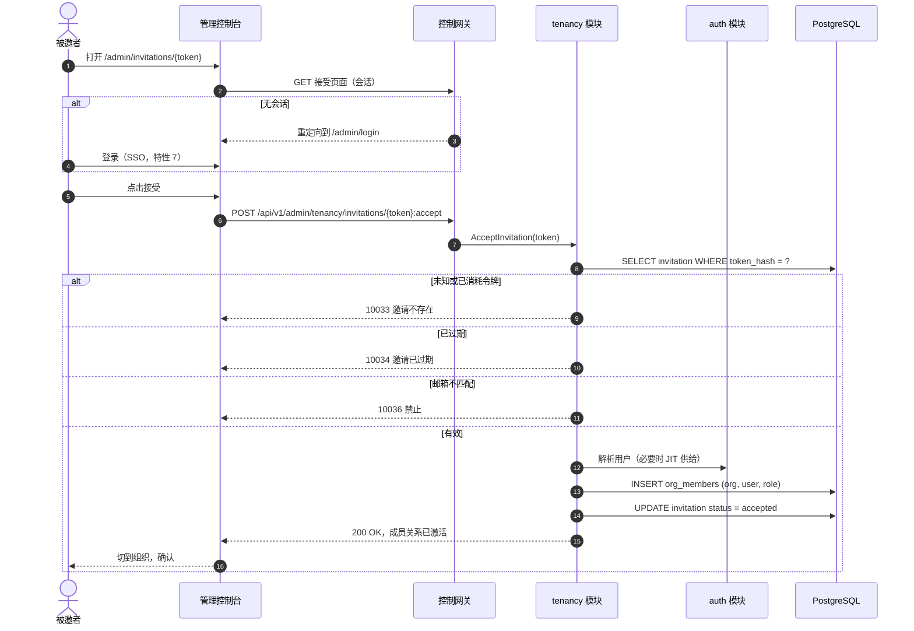
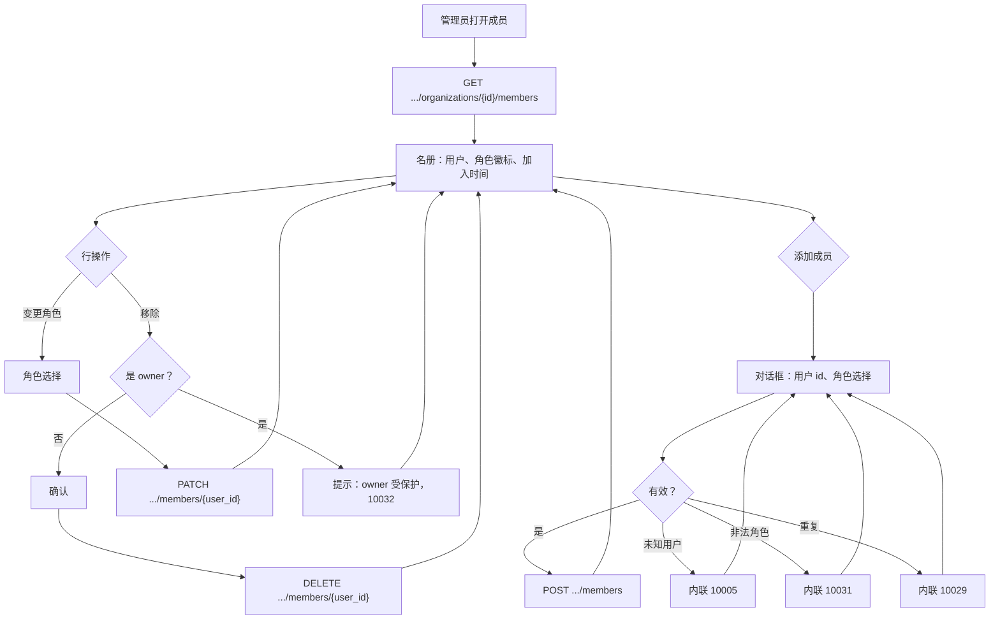
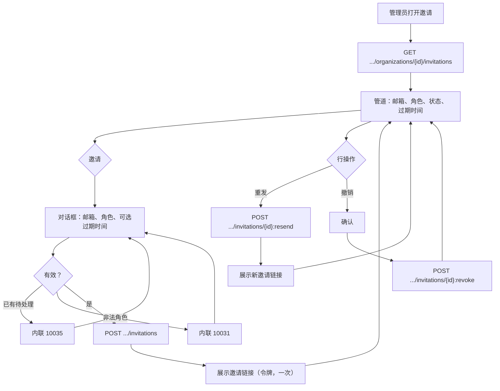

# 组织成员、角色与邀请（RBAC）— 需求分析与 UI/UX 设计

| 属性 | 内容 |
| --- | --- |
| 特性点 | 组织成员、角色与邀请（RBAC） |
| 文档范围 | `tenancy` 模块成员核心的需求分析与 UI/UX 设计：`org_members` 与 `invitations` 表、成员 CRUD、邀请生命周期（创建/列表/重发/撤销/接受/拒绝）、固定角色集（owner/admin/member/viewer）、按调用方角色把关组织范围管理 API 的 RoleGuard、由 `org_members` 派生的会话 `AccessibleOrgs`/角色（对 IdP 声明具有权威性）、控制台「成员」与「邀请」页面、邀请接受流程，以及验收标准 |
| 归属模块 | `tenancy`（org_members、invitations、RoleGuard、成员解析），配合 `auth`（会话角色/可访问组织现改为由 `org_members` 派生，而非 IdP 声明） |
| 相关文档 | [架构设计](./architecture.zh-cn.md) — 第 2.1 节 `auth`（RBAC、角色、邀请）、第 3.1 节 管理端/用户端表面分离 · [多租户隔离](./multi-tenancy.zh-cn.md) — 本特性成员行所挂接的 `organizations` 表与组织上下文（其 D12 将成员/角色延后至此） · [SSO 联合登录](./sso-federation.zh-cn.md) — 本特性在成员关系上取代的 User 模型、`identity_bindings`、会话与属性到角色的映射（其 D7 将 RBAC 强制延后至此） · [余额与配额](./balance-quota.zh-cn.md) — 已确立的文档格式与本特性把关的组织范围管理表面 |
| 状态 | 设计完成，已移交架构师代理 |

---

## 1. 背景

特性 #6 与 #7 交付了租户与身份主干：组织与项目是真实的行，SSO 为控制台带来登录、会话与账户模型。但**成员关系仍不可强制**。特性 #7 的属性到角色映射（其 D7）把角色与可访问组织放到**来自 IdP 声明的**会话上 — 身份提供方说什么，平台就信什么。不存在 `org_members` 表，无法回答「谁属于这个组织、他们能做什么」，也没有把一个人带进租户的邀请流程。控制台的组织切换器列出 IdP 声称的一切，每个组织范围的管理 API 都逐字信任会话的角色声明。

本特性把成员关系落到真实的行上。它交付 `org_members` 表（谁属于某组织、以何种角色 — 的权威来源）、`invitations` 表（把人带进来的自助路径），以及 **RoleGuard** — 一个按调用方在已解析组织上下文中的角色把关每个组织范围管理 API 的中间件。会话 `AccessibleOrgs` 与角色现改为**由 `org_members` 派生**，而非来自 IdP 声明；IdP 声明成为提示，绝非权威。

### 1.1 竞品的成员、角色与邀请模型

| 产品 | 成员模型 | 角色 | 邀请 | 角色强制 | 主要陷阱 |
| --- | --- | --- | --- | --- | --- |
| **OpenAI Platform** | 带角色的组织成员；带角色的项目成员 | Owner、admin、member、viewer（组织）；按项目角色 | 带接受链接的邮件邀请；owner/admin 邀请 | 角色把关组织与项目设置；viewer 只读 | 所有者转移走工单；角色变更粗糙 |
| **Anthropic Console** | 带角色的工作区成员 | Owner、admin、member、viewer | 邮件邀请；admin 邀请 | 角色把关工作区设置与消费 | 两个选择器（组织 + 项目）让新用户困惑；来自 IdP 的角色映射粗糙 |
| **GitHub** | 组织成员、团队、外部协作者 | Owner、member、billing manager；团队角色 | 带接受的邮件邀请；待处理邀请列表 | 角色 + 团队成员资格把关仓库与设置 | Owner 唯一且受保护；转移需显式交接 |
| **Hugging Face** | 带角色的组织成员 | Admin、write、read | 邮件邀请；接受流程 | 角色把关仓库写/读 | 无 owner 概念；admin 可被移除导致组织无人拥有 |
| **Google Workspace** | 带管理员角色的目录用户 | Super admin、group admin、user | 管理员配置账户；无自助邀请 | 管理员角色把关控制台分区 | Super admin 唯一且受保护；委派复杂 |
| **阿里云百炼** | 带角色的工作区成员 | Owner、admin、member、viewer | 按账户/邮件邀请；接受流程 | 角色把关工作区模型授权与计费 | Owner 转移笨重；角色变更粗糙 |

### 1.2 提炼出的模式与决策

值得采纳的行业模式：

1. **固定且精简的角色集** — 每个被调研的平台都落在 owner/admin/member/viewer（或等价四档）上。固定集可理解、可测试，并能干净地映射到 UI 徽标；自由文本角色会招致漂移。
2. **Owner 唯一且受保护** — 未经显式转移，任何人都不能移除或降级 owner，包括 owner 自己。GitHub 与 Google Workspace 都保护 owner；Hugging Face 缺 owner 是已知缺口。
3. **成员关系是权威，而非声明** — 平台的 `org_members` 表是「谁属于、以何角色」的事实来源。IdP 声明至多是供给提示；过期的声明绝不能授予成员表所拒绝的访问。
4. **带令牌化接受链接的邮件邀请** — 标准自助路径（OpenAI、GitHub、Hugging Face）：admin 按邮件邀请，被邀者点击令牌化链接，接受时成员关系激活。令牌一次性且过期。
5. **Viewer 只读** — 最低角色可见组织数据但不可变更任何内容。这是每个平台都交付的安全底线；它让「只读审计者」成为一等主体。
6. **角色把关管理表面，而非数据面** — RBAC 治理控制面（控制台与管理 API）。数据面继续按 API Key 认证；Key 的组织成员关系在创建 Key 时检查，而非每次推理调用。

需要避免的陷阱：

- **为成员关系信任 IdP 声明**（现状）— 声明是提示，不是行；过期或伪造的声明授予了组织从未批准的访问。这是本特性的核心修复。
- **删除 owner** — 无 owner 的组织不可治理。必须阻断 owner 的移除与降级；转移是唯一路径。
- **自由文本角色** — 不受约束的角色无法被守卫强制，也无法渲染为徽标。固定集就是契约。
- **邀请令牌明文存储** — 泄露的令牌是常驻凭证。令牌在静态时哈希且一次性。
- **永不过期的邀请** — 待处理邀请是一扇敞开的门。过期（默认 7 天）限定窗口。
- **数据面上的按调用 RBAC** — 每次推理请求检查成员关系为热路径增加延迟，却无安全增益。RBAC 是控制面关注点。

**go-taas 的决策**（按自主决策规则记录依据）：

| # | 决策 | 依据 |
| --- | --- | --- |
| D1 | **固定角色集：`owner`、`admin`、`member`、`viewer`。** 角色是封闭枚举，而非自由文本。`owner` 每组织唯一且受保护；`admin` 管理成员与邀请；`member` 使用组织资源；`viewer` 只读 | 模式 1；行业四档；封闭枚举可被 RoleGuard 强制并渲染为徽标 |
| D2 | **`org_members` 是权威成员来源。** 会话 `AccessibleOrgs` 与角色由 `org_members` 派生（特性 #7 的会话现读取成员行，而非 IdP 声明）。IdP 声明仅是供给提示 — 可播种待处理成员关系，绝不授予表所拒绝的访问 | 模式 3；声明信任缺口的核心修复；会话解析器（特性 #7 的 FR4）保留，仅其输入改为成员表 |
| D3 | **Owner 唯一且受保护。** 一个组织恰有一个 `owner`。任何成员（包括 owner 自己）都不能移除或降级 owner；唯一路径是显式 owner 转移（延后至后续特性）。移除/降级 owner → 10033 | 模式 2；无 owner 的组织不可治理；转移流程是小型、可分离的后续 |
| D4 | **邀请令牌静态哈希且一次性。** `invitations` 表存储令牌的哈希；原始令牌在创建时返回一次，绝不存储。接受/拒绝消耗令牌（状态 → `accepted`/`rejected`）；复用 → 10035 | 模式 4 + 明文令牌陷阱；哈希、一次性的令牌是有界的凭证 |
| D5 | **邀请默认 7 天后过期。** `expires_at` 在创建时设置（默认 now + 7 天，每次邀请可配置）；过期邀请不可接受（→ 10035）并在列表中呈现为 `expired` | 模式 4 + 永不过期陷阱；有界窗口关闭敞门风险 |
| D6 | **RoleGuard 把关每个组织范围的管理 API。** 中间件从 `org_members` 解析调用方在已解析组织上下文中的角色，对低于所需角色的调用以 **10036 `CodeForbidden`** 拒绝。`viewer` 只读：任何变更性的组织范围管理 API 至少需要 `member`；成员/邀请管理需要 `admin` 或 `owner` | 模式 6；RBAC 是控制面关注点；守卫是每个组织范围 API 都经过的单一接缝 |
| D7 | **成员与邀请管理仅限 `admin`/`owner`。** `ListOrgMembers`/`AddOrgMember`/`RemoveOrgMember`/`SetOrgMemberRole` 及所有邀请 RPC 需要组织上下文中的 `admin` 或 `owner`。此外 `owner` 是唯一能管理 owner 行的角色（受 D3 保护） | 模式 1/2；admin 层拥有名册；owner 层拥有 owner 行 |
| D8 | **API 面**：`taas.tenancy.v1.TenancyService` 的新扩展 — 成员 RPC（`ListOrgMembers`、`AddOrgMember`、`RemoveOrgMember`、`SetOrgMemberRole`）与邀请 RPC（`CreateInvitation`、`ListInvitations`、`RevokeInvitation`、`ResendInvitation`、`AcceptInvitation`、`RejectInvitation`）— 全部位于 `/api/v1/admin/tenancy/*` 下，经已解析组织上下文限定组织范围 | tenancy 模块已拥有组织（特性 #6）；成员关系是组织的名册，故与组织 CRUD 并列 |
| D9 | **新错误码** 位于 auth/tenancy 段：**10029 `CodeMemberExists`**、**10030 `CodeMemberNotFound`**、**10031 `CodeRoleInvalid`**、**10032 `CodeOwnerProtected`**、**10033 `CodeInvitationNotFound`**、**10034 `CodeInvitationExpired`**、**10035 `CodeInvitationExists`**、**10036 `CodeForbidden`** | 100xx 段属于 auth 与 tenancy；每种失败模式需要自己的码，控制台才能渲染正确的内联消息（计量 D9 模式） |
| D10 | **延后**：owner 转移、团队/分组成员关系、按项目角色、SCIM 目录同步、邀请邮件投递（控制台改为展示邀请链接）、以及数据面的基于角色可见性 | Owner 转移是可分离的后续；团队与按项目角色需要特性 #6 延后的项目列工作；SCIM 与邮件投递是基础设施；数据面保持 Key 认证 |

### 1.3 范围边界

**范围内**：`org_members` 表（org_id、user_id、role、复合主键）与 `invitations` 表（org_id、email、role、令牌哈希、status、expires_at、created_by）；成员 CRUD RPC；邀请生命周期 RPC；把关组织范围管理 API 的 RoleGuard；由 `org_members` 派生的会话 `AccessibleOrgs`/角色；控制台「成员」页面、「邀请」页面与邀请接受流程；新错误码 10029–10036。

**范围外**（另行跟踪）：owner 转移（后续）、团队/分组与按项目角色（特性 #6 项目列延后之后）、SCIM 目录同步（未来）、邀请邮件投递（控制台呈现邀请链接）、数据面的基于角色可见性（数据面保持 Key 认证）、以及 CLI 成员/邀请命令（跟随 API，下次触及 CLI 表面时交付）。

---

## 2. 用户角色

| 角色 | 描述 | 与成员及邀请的交互 |
| --- | --- | --- |
| **平台管理员** | 运营 go-taas 集群的人；今天也是控制台用户 | 跨所有租户管理组织名册与邀请；RoleGuard 同样适用于他们（每个组织持有一个角色） |
| **组织所有者** | 组织中唯一、受保护的顶层角色 | 管理名册与邀请；不可被移除或降级；是唯一治理 owner 行的角色 |
| **组织管理员** | 组织中的第二层 | 管理成员与邀请（增/删/改角色、邀请/重发/撤销）；不可触碰 owner 行 |
| **组织成员** | 组织的在职成员 | 使用组织资源（Key、服务、用量）；不可管理名册 |
| **查看者** | 组织的只读成员 | 可见组织数据（用量、账单、成员）但不可变更任何内容 |
| **被邀者** | 被邮件邀请但尚未接受的人 | 打开接受链接，认证（或 JIT 供给），并接受/拒绝邀请 |
| **智能体 / SDK** | 其调用产生用量的程序化消费方 | 不直接受影响：数据面仍按 API Key 认证；RBAC 仅治理控制面 |
| **控制台（本特性）** | 管理端 Web UI | 渲染「成员」页面、「邀请」页面与邀请接受流程 |

> 术语：消费方调用者称为**智能体**（Agent），与仓库惯例一致。

---

## 3. 用户故事

| # | 作为… | 我想要… | 以便… |
| --- | --- | --- | --- |
| US1 | 组织管理员 | 查看我组织中带角色的成员列表 | 我知道谁属于、他们能做什么 |
| US2 | 组织管理员 | 按用户 id 添加成员并分配角色 | 同事可以开始在组织中工作 |
| US3 | 组织管理员 | 变更成员的角色 | 职责变化时我可以晋升或降级 |
| US4 | 组织管理员 | 移除成员 | 有人离开时我可以撤销访问 |
| US5 | 组织所有者 | 免于被移除与降级 | 我的组织永远不会变得不可治理 |
| US6 | 组织管理员 | 按邮件邀请一个人并赋予角色 | 还没有账户的人可以加入组织 |
| US7 | 组织管理员 | 查看待处理邀请并重发或撤销 | 我可以管理邀请管道 |
| US8 | 被邀者 | 打开邀请链接、登录并接受 | 无需管理员先创建我即可加入组织 |
| US9 | 被邀者 | 拒绝邀请 | 我婉拒不想加入的组织 |
| US10 | 查看者 | 可见组织数据但被阻止变更 | 我可以审计而不冒变更风险 |
| US11 | 平台管理员 | 控制台的组织切换器只列出我是成员的组织 | 我不能切进不属于我的租户 |
| US12 | 组织管理员 | 尝试移除 owner 时得到显式错误 | 系统甚至对我都保护 owner |

---

## 4. 功能需求

### FR1 — 成员管理

- **FR1.1** `ListOrgMembers`（`GET /api/v1/admin/tenancy/organizations/{organization_id}/members`）分页返回组织的成员（默认 20，上限 100），每行携带 `user_id`、显示名、角色与 `joined_at`。需要组织上下文中的 `admin`/`owner`；`viewer`/`member` → 10036。
- **FR1.2** `AddOrgMember`（`POST …/members`）添加成员：`user_id`（必须存在 → 否则 10005）与 `role`（`admin`/`member`/`viewer` 之一；**此处不可分配 `owner`** — owner 行随组织创建且受保护）。重复 `(org_id, user_id)` → 10029；非法角色 → 10031。需要 `admin`/`owner`。
- **FR1.3** `SetOrgMemberRole`（`PATCH …/members/{user_id}`）变更成员角色。非法角色 → 10031；未知成员 → 10030；**目标是 owner → 10032**（D3）。需要 `admin`/`owner`。
- **FR1.4** `RemoveOrgMember`（`DELETE …/members/{user_id}`）移除成员（幂等）。未知成员 → 10030；**移除 owner → 10032**（D3）。需要 `admin`/`owner`。

### FR2 — 邀请管理

- **FR2.1** `CreateInvitation`（`POST /api/v1/admin/tenancy/organizations/{organization_id}/invitations`）邀请一个人：`email`（校验）、`role`（`admin`/`member`/`viewer` 之一；`owner` 不可被邀请）、可选 `expires_in`（默认 7 天，D5）。返回原始令牌**一次**（D4）。同一邮箱已有待处理邀请 → 10035；非法角色 → 10031。需要 `admin`/`owner`。
- **FR2.2** `ListInvitations`（`GET …/invitations`）分页返回组织的邀请，每行携带 id、email、role、status（`pending`/`accepted`/`rejected`/`revoked`/`expired`）、`expires_at`、`created_by` 与 `created_at`。过滤：`status`（可选）。需要 `admin`/`owner`。
- **FR2.3** `RevokeInvitation`（`POST …/invitations/{invitation_id}:revoke`）把 `pending` 邀请翻转为 `revoked`（幂等）。未知 id → 10033；已消耗 → 10033。需要 `admin`/`owner`。
- **FR2.4** `ResendInvitation`（`POST …/invitations/{invitation_id}:resend`）为 `pending` 邀请重新生成令牌并延长 `expires_at`，返回新原始令牌一次。未知 id → 10033；已消耗 → 10033。需要 `admin`/`owner`。

### FR3 — 邀请接受与拒绝

- **FR3.1** `AcceptInvitation`（`POST /api/v1/admin/tenancy/invitations/{token}:accept`）接受待处理邀请：调用方必须已认证（会话）且邀请的邮箱必须匹配调用方邮箱（否则 10036）。成功后调用方以邀请的角色被加入 `org_members`，邀请翻转为 `accepted`，令牌被消耗。未知/已消耗令牌 → 10033；过期 → 10034。
- **FR3.2** **接受时 JIT 供给**：若调用方尚无平台用户，接受流程先 JIT 供给一个（特性 #7 的 D4 模式），再添加成员关系。邀请的邮箱是绑定提示。
- **FR3.3** `RejectInvitation`（`POST …/invitations/{token}:reject`）把 `pending` 邀请翻转为 `rejected` 并消耗令牌。未知/已消耗 → 10033；过期 → 10034。
- **FR3.4** 邀请**一次性**：一旦 `accepted`/`rejected`/`revoked`/`expired`，令牌不可再次使用（→ 10033/10034）。

### FR4 — RoleGuard 与会话成员关系

- **FR4.1** **RoleGuard**：每个组织范围管理 API 上的中间件从 `org_members` 解析调用方在已解析组织上下文中的角色并强制所需角色。低于要求 → **10036 `CodeForbidden`**。只读 API 至少需要 `viewer`；变更性的组织范围 API 至少需要 `member`；成员/邀请管理需要 `admin`/`owner`（D6/D7）。
- **FR4.2** **会话成员关系派生**：`GetSession`（特性 #7）现返回**由 `org_members` 派生的** `AccessibleOrgs` 与每组织角色，而非来自 IdP 声明（D2）。IdP 声明可播种待处理成员关系，但绝不授予表所拒绝的访问。
- **FR4.3** 控制台组织切换器列出会话的 `AccessibleOrgs`（已是特性 #7 的行为）；切进用户不是成员的组织 → 10005（特性 #7 的 FR4.3，不变）。

### FR5 — 控制台「成员」「邀请」与接受页面

- **FR5.1** 「成员」导航项（`/admin/organizations/{id}/members`）打开名册：每个成员一行 — 用户 id、显示名、角色徽标、加入时间；「添加成员」对话框（用户 id、角色选择）；行操作：变更角色（角色选择）、移除（确认，对 owner 以提示阻断）；10029/10030/10031/10032/10036 的内联错误。
- **FR5.2** 「邀请」导航项（`/admin/organizations/{id}/invitations`）打开邀请管道：每个邀请一行 — 邮箱、角色徽标、状态徽标、过期时间、创建者、创建时间；「邀请」对话框（邮箱、角色选择、可选过期时间）；行操作：重发（展示新链接）、撤销（确认）；10031/10033/10035/10036 的内联错误。
- **FR5.3** 接受页面（`/admin/invitations/{token}`）渲染邀请：组织名、被授予的角色、以及接受/拒绝按钮。接受需要已认证会话（未认证则重定向到 `/admin/login`）；成功后控制台切到该组织并显示确认。拒绝显示确认并返回控制台。
- **FR5.4** 「成员」与「邀请」页面仅组织上下文中的 `admin`/`owner` 可达；`viewer`/`member` 看到 10036 提示。角色图例（owner/admin/member/viewer）在「成员」页面上展示。

---

## 5. 页面与流程设计

### 5.1 页面地图

| 页面 / 组件 | 用途 |
| --- | --- |
| **成员页面**（`/admin/organizations/{id}/members`） | 组织名册：行、添加成员对话框、变更角色、移除（owner 受保护） |
| **添加成员对话框** | 用户 id + 角色选择 |
| **邀请页面**（`/admin/organizations/{id}/invitations`） | 邀请管道：行、邀请对话框、重发、撤销 |
| **邀请对话框** | 邮箱 + 角色选择 + 可选过期时间 |
| **邀请接受页面**（`/admin/invitations/{token}`） | 渲染邀请；接受/拒绝按钮 |
| **角色图例** | 在「成员」页面上解释 owner/admin/member/viewer |
| **组织切换器**（侧边栏，会话感知） | 列出会话的 `AccessibleOrgs`（来自 `org_members`） |

### 5.2 邀请接受流程

### 5.3 成员页面流程

### 5.4 邀请页面流程

---

## 6. API 面

所有 API 属于既有 **`taas.tenancy.v1.TenancyService`**（proto：`proto/taas/tenancy/v1/tenancy.proto`），经控制网关以 HTTP 提供，位于 `/api/v1/admin/tenancy/*` 下。成员与邀请 RPC 经已解析组织上下文（特性 #6 的校验上下文、特性 #7 的会话）限定组织范围，并由 RoleGuard 把关（D6/D7）。数据面的 `VerifyAPIKey` RPC 不变。

| RPC | HTTP | 状态 | 用途 | 备注 |
| --- | --- | --- | --- | --- |
| `ListOrgMembers` | `GET /api/v1/admin/tenancy/organizations/{organization_id}/members` | **新增** | 组织名册 | `admin`/`owner`；分页 |
| `AddOrgMember` | `POST …/organizations/{organization_id}/members` | **新增** | 添加成员 | `admin`/`owner`；10029/10031/10005 |
| `SetOrgMemberRole` | `PATCH …/organizations/{organization_id}/members/{user_id}` | **新增** | 变更角色 | `admin`/`owner`；10030/10031/10032 |
| `RemoveOrgMember` | `DELETE …/organizations/{organization_id}/members/{user_id}` | **新增** | 移除成员 | `admin`/`owner`；10030/10032 |
| `CreateInvitation` | `POST …/organizations/{organization_id}/invitations` | **新增** | 按邮件邀请 | `admin`/`owner`；返回令牌一次；10031/10035 |
| `ListInvitations` | `GET …/organizations/{organization_id}/invitations` | **新增** | 邀请管道 | `admin`/`owner`；`status` 过滤 |
| `RevokeInvitation` | `POST …/invitations/{invitation_id}:revoke` | **新增** | 取消待处理邀请 | `admin`/`owner`；10033 |
| `ResendInvitation` | `POST …/invitations/{invitation_id}:resend` | **新增** | 新令牌 + 过期时间 | `admin`/`owner`；返回令牌一次；10033 |
| `AcceptInvitation` | `POST /api/v1/admin/tenancy/invitations/{token}:accept` | **新增** | 加入组织 | 已认证；JIT 供给；10033/10034/10036 |
| `RejectInvitation` | `POST /api/v1/admin/tenancy/invitations/{token}:reject` | **新增** | 婉拒组织 | 已认证；10033/10034 |
| `VerifyAPIKey` | （gRPC，数据面） | 不变 | 数据面认证 | 不受 RBAC 影响 |

契约约束：

1. 成员与邀请 RPC 限定组织范围且受 RoleGuard 把关：调用方在已解析组织上下文中的角色必须满足要求（D6/D7），否则 10036。
2. 线格式惯例不变：点分分页（`?page.offset=0&page.limit=20`）、成功 HTTP 200、业务错误为 `{"code": <int>, "message": "..."}`、int64 字段序列化为 JSON 字符串。
3. 邀请令牌在创建/重发时返回**一次**，绝不在列表/获取响应中回显（D4）；存储值是哈希。
4. 会话变更是契约可见的：`GetSession` 现返回**由 `org_members` 派生的** `AccessibleOrgs` 与角色（D2），取代特性 #7 中由 IdP 声明派生的值。

错误码（auth/tenancy 段 10001–10099，`pkg/errors/codes.go`）：

| 条件 | 码 | 常量 | 备注 |
| --- | --- | --- | --- |
| 添加时重复 `(org_id, user_id)` | 10029 | `CodeMemberExists` | **新增**（D9） |
| 变更角色/移除时未知成员 | 10030 | `CodeMemberNotFound` | **新增** |
| 非法角色（不在固定集内，或分配 `owner`） | 10031 | `CodeRoleInvalid` | **新增** |
| 移除/降级 owner | 10032 | `CodeOwnerProtected` | **新增**（D3） |
| 未知/已消耗的邀请令牌或 id | 10033 | `CodeInvitationNotFound` | **新增** |
| 接受/拒绝时邀请已过期 | 10034 | `CodeInvitationExpired` | **新增**（D5） |
| 该邮箱已有待处理邀请 | 10035 | `CodeInvitationExists` | **新增** |
| 调用方角色低于所需角色 | 10036 | `CodeForbidden` | **新增**（D6） |
| 未知组织（组织上下文） | 10005 | `CodeOrganizationNotFound` | 既有；复用于不可访问的组织 |
| 添加时未知用户 | 10005 | `CodeUserNotFound` | 既有；复用 |
| 缺失/过期/已撤销的会话 | 10027 | `CodeSessionInvalid` | 既有（特性 #7） |
| 数据库故障 | 500 | `CodeInternal` | 经错误归一化 |

---

## 7. 验收标准

| # | 标准 | 验证方式 |
| --- | --- | --- |
| AC1 | `AddOrgMember` 存储 `(org_id, user_id, role)` 行；`ListOrgMembers` 带角色返回它；重复添加 → 10029；未知用户 → 10005 | 单元 + FVT + E2E |
| AC2 | `SetOrgMemberRole` 变更成员角色；非法角色 → 10031；未知成员 → 10030 | 单元 + FVT |
| AC3 | `RemoveOrgMember` 移除成员（幂等）；未知成员 → 10030；**移除 owner → 10032**；`SetOrgMemberRole` 目标是 owner → 10032 | 单元 + FVT |
| AC4 | `CreateInvitation` 以哈希令牌与 7 天默认过期时间存储邀请，返回原始令牌一次；同一邮箱已有待处理邀请 → 10035；非法角色 → 10031 | 单元 + FVT |
| AC5 | `AcceptInvitation` 以有效令牌与匹配邮箱把调用方以邀请的角色加入 `org_members`，把邀请翻转为 `accepted` 并消耗令牌；第二次接受 → 10033 | 单元 + FVT |
| AC6 | `AcceptInvitation` 在调用方尚无账户时 JIT 供给用户；过期邀请 → 10034；邮箱不匹配 → 10036 | 单元 + FVT |
| AC7 | `RejectInvitation` 把待处理邀请翻转为 `rejected` 并消耗令牌；`RevokeInvitation` 把待处理邀请翻转为 `revoked`（幂等）；`ResendInvitation` 重新生成令牌并延长过期时间，返回一次；未知/已消耗 → 10033 | 单元 + FVT |
| AC8 | **RBAC 强制**：`viewer` 调用变更性的组织范围 API → 10036；`member` 调用成员/邀请 RPC → 10036；`admin`/`owner` 成功；`GetSession` 返回**由 `org_members` 派生的** `AccessibleOrgs`/角色（而非 IdP 声明） | 单元 + FVT |
| AC9 | **组织范围**：一个组织的成员/邀请 RPC 绝不返回或变更另一组织的行；切进用户不是成员的组织 → 10005 | FVT |
| AC10 | 「成员」页面以 testid `org-members-table` 与行 `org-member-row-{user_id}` 渲染名册，经 `add-member-dialog` 添加成员，经 `member-role-select` 变更角色，经 `member-remove-{user_id}` 带确认移除成员，并以 10032 提示阻断 owner 移除 | E2E |
| AC11 | 「邀请」页面以 testid `invitations-table` 与行 `invitation-row-{id}` 渲染管道，经 `invite-dialog`（`invite-email-input`、`invite-role-select`）邀请，重发（`invite-resend-{id}`）展示新链接，撤销（`invite-revoke-{id}`）带确认 | E2E |
| AC12 | 接受页面（`/admin/invitations/{token}`）渲染组织与角色，接受（`invitation-accept-{token}`）并切到组织，拒绝带确认；未认证访客被重定向到 `/admin/login` | E2E |
| AC13 | 回归：数据面不变 — API Key 校验仍工作，RBAC 不把关推理流量 | FVT + E2E 回归 |

---

## 8. 延后的开放项

| 项 | 延后至 |
| --- | --- |
| Owner 转移（受保护 owner 行的显式交接） | 后续特性 |
| 团队/分组与按项目角色 | 特性 #6 项目列延后之后 |
| SCIM 目录同步 | 未来 |
| 邀请邮件投递（控制台呈现邀请链接） | 未来基础设施 |
| 数据面的基于角色可见性 | 未来（数据面保持 Key 认证） |
| CLI 成员/邀请命令 | 下次触及 CLI 表面时 |
| 邀请审计轨迹（谁在何时邀请了谁） | 未来运营工具 |