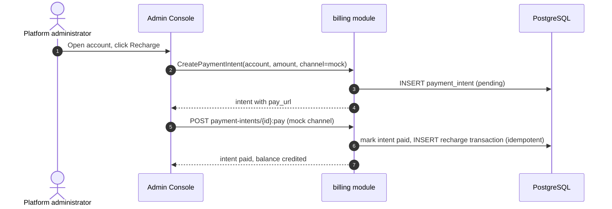

# Payments, Invoices & Auto-Recharge — Requirement Analysis and UI/UX Design

| Attribute | Content |
| --- | --- |
| Feature point | Payments, invoices & auto-recharge |
| Document scope | Requirement analysis and UI/UX design for the billing module's payment surface: payment channels, invoice generation and download, and automatic recharge thresholds, building on the balance-quota account core (feature #8) |
| Owning modules | `billing` (payment intents, invoices, auto-recharge rules), `web` (admin console payment/invoice pages) |
| Related documents | [Architecture Design](./architecture.md) — §2.6 `billing` · [Balance (Prepaid) & Quota (Postpaid)](./balance-quota.md) — the account core this feature builds on (its non-goals defer payments, invoices and auto-recharge here) · [Model × Card-Type Price Matrix & Tiered Pricing](./pricing.md) — the charge engine and bills this feature invoices |
| Status | Design complete, handed to the Architect agent |

---

## 1. Background

Feature #8 delivered the account core: per-organization prepaid/postpaid accounts, recharge and refund with idempotency keys, settlement-time deduction, inference gating, and an append-only transaction ledger. What the platform still cannot do is **take money in automatically**: recharge is a manual administrator action, there is no payment channel, no invoice is produced for a billing period, and a prepaid account that runs dry simply blocks inference until an operator recharges it. This feature adds the payment surface: **payment channels** (a way to fund a prepaid account), **invoices** (a per-period billing document an organization can download), and **auto-recharge** (a threshold rule that tops up a prepaid account automatically).

### 1.1 How Comparable Products Handle Payments and Invoicing

| Product | Payment channels | Invoicing | Auto-recharge |
| --- | --- | --- | --- |
| **OpenAI Platform** | Card on file; enterprise invoicing | Per-usage invoice; downloadable | Auto-recharge on enterprise plans |
| **Anthropic Console** | Card on file | Monthly invoice | Auto-recharge threshold |
| **SiliconFlow** | Alipay/WeChat top-up | Invoice on request | Manual top-up only |
| **Together AI** | Card on file (teams) | Monthly invoice | Card on file, no threshold |
| **Baidu Qianfan** | Enterprise settlement | Monthly invoice | Package purchase |
| **Aliyun Bailian** | Console recharge (Alipay/WeChat/card) | Monthly invoice | Threshold auto-recharge |

### 1.2 Distilled Patterns and Decisions

Patterns worth adopting: (1) **payment intents are idempotent** — a payment channel callback must credit exactly once, mirroring the recharge idempotency-key pattern from feature #8; (2) **invoices are derived from bills** — the feature-#5 bill is the source of truth, and an invoice is a presentable, downloadable rendering of it; (3) **auto-recharge is a threshold rule** — recharge when the balance falls below a floor, up to a target, with a daily cap to bound exposure.

Pitfalls to avoid: float money (feature #8 already uses integer cents); double-crediting on payment-channel retries; invoices that diverge from bills; auto-recharge without a cap (unbounded spend).

**Decisions for go-taas**:

| # | Decision | Rationale |
| --- | --- | --- |
| D1 | **Payment channels are a pluggable registry** — a `payment_channels` table (channel id, type, display name, config, enabled) and a `PaymentIntent` flow: `CreatePaymentIntent` → channel redirect/QR → channel callback → idempotent credit. v1 ships a **mock channel** (a console "simulate payment" button) so the flow is fully exercisable without a real PSP; real PSP adapters (Stripe/Alipay/WeChat) are follow-up rows | The flow is the valuable part; a mock channel makes it testable end-to-end in the compose stack |
| D2 | **A payment intent credits the account exactly once** — `payment_intents` table (intent id, account id, amount cents, channel, status, idempotency key, reference, created/paid/expired timestamps); the channel callback marks it paid and writes one `recharge` transaction (reusing feature #8's idempotency-key mechanism) | Mirrors feature #8's recharge idempotency; a retried callback cannot double-credit |
| D3 | **Invoices are derived from bills** — `invoices` table (invoice id, bill id, organization id, period, total cents, currency, status, issued/paid timestamps, PDF/download URL); `ListInvoices`/`GetInvoice`/`DownloadInvoice` RPCs. An invoice is generated from a settled bill on demand (or by a runner) and is a presentable rendering of it | The bill is the source of truth; the invoice is a presentation layer over it |
| D4 | **Auto-recharge is a per-account threshold rule** — `auto_recharge` fields on the account (enabled, threshold_cents, topup_cents, daily_cap_cents); a runner checks prepaid accounts and issues a payment intent when the balance falls below the threshold, bounded by the daily cap | Bounded, predictable top-up; the daily cap prevents runaway spend |
| D5 | **New error codes** — `CodePaymentChannelInvalid`, `CodePaymentIntentInvalid`, `CodeInvoiceNotFound`, `CodeAutoRechargeInvalid` | Validation vs not-found stay distinct, mirroring the feature #8 pattern |

## 2. Goals and Non-goals

**Goals**: payment channel registry with a mock channel; the payment-intent flow (create → pay → idempotent credit); invoice generation and download from settled bills; per-account auto-recharge threshold rules with a daily cap; console pages for payments, invoices, and auto-recharge configuration; activation of the new error codes.

**Non-goals** (deferred): real PSP adapters (Stripe/Alipay/WeChat); refunds through the payment channel (feature #8's `Refund` stays the mechanism); multi-currency and FX; dunning and collections; tenant self-service payment (admin surface only in v1); invoice email delivery.

## 3. Personas

| Role | Description | Interaction with payments |
| --- | --- | --- |
| **Platform administrator** | The operator who runs the cluster | Configures payment channels, reviews payment intents, generates invoices, sets auto-recharge rules |
| **Organization administrator (future)** | Tenant-side administrator | Will see their own invoices and payment history (scoped by tenancy) |
| **Agent / SDK** | The programmatic consumer | Unaffected directly; benefits from auto-recharge keeping the account funded |

> Terminology: the consumer-side caller is called an **Agent** (English) / 「智能体」(Chinese), consistent with the repo convention.

## 4. User Journeys

| # | Journey | Steps |
| --- | --- | --- |
| J1 | **Fund a prepaid account** | Admin opens the account detail → clicks "Recharge" → chooses a payment channel → the mock channel shows a "simulate payment" button → the intent is marked paid and the balance credits |
| J2 | **Auto-recharge keeps the account funded** | Admin enables auto-recharge (threshold $10, top-up $50, daily cap $100) → usage drains the balance below $10 → the runner issues a payment intent → the mock channel auto-pays → the balance tops up to $60 |
| J3 | **Invoice a billing period** | Admin opens the Invoices page → generates an invoice from a settled bill → downloads the PDF → the invoice matches the bill total |
| J4 | **Audit a payment** | Auditor opens the payment intent → sees the channel, amount, status, and the recharge transaction it produced |

## 5. Feature Requirements and Acceptance Criteria

### FR1 — Payment channels

- **FR1.1** `CreatePaymentChannel`/`ListPaymentChannels`/`EnablePaymentChannel`/`DisablePaymentChannel` manage the channel registry. v1 seeds a **mock channel** (`mock`) that is always available.
- **FR1.2** `CreatePaymentIntent` (`POST /api/v1/admin/billing/payment-intents`) creates an intent for a prepaid account: `amount_cents > 0`, `channel`, caller-supplied `idempotency_key`. Returns the intent with a `pay_url` (for the mock channel, a console URL that simulates payment).
- **FR1.3** The channel callback (`POST /api/v1/admin/billing/payment-intents/{intent_id}:pay` for the mock channel) marks the intent paid and credits the account exactly once (D2).

### FR2 — Invoices

- **FR2.1** `ListInvoices`/`GetInvoice`/`DownloadInvoice` return invoices derived from settled bills (D3). `GenerateInvoice` (`POST /api/v1/admin/billing/invoices`) creates an invoice from a bill id (idempotent: one invoice per bill).
- **FR2.2** An invoice carries the bill's period, total cents, currency, and status; the download returns a presentable document (v1: a JSON/HTML rendering; PDF is a follow-up).

### FR3 — Auto-recharge

- **FR3.1** `UpdateAccount` gains auto-recharge fields: `auto_recharge_enabled`, `auto_recharge_threshold_cents`, `auto_recharge_topup_cents`, `auto_recharge_daily_cap_cents`.
- **FR3.2** A runner checks prepaid accounts with auto-recharge enabled: when `balance_cents < threshold`, it issues a payment intent for `topup_cents`, bounded by the daily cap (D4). The mock channel auto-pays it.

### FR4 — Console

- **FR4.1** The admin console gains a Payments page (channel list, payment intents), an Invoices page (list, generate, download), and auto-recharge controls on the account detail page.

### Acceptance criteria

| # | Criterion (Given / When / Then) | Verification |
| --- | --- | --- |
| AC1 | **Given** a prepaid account, **when** `CreatePaymentIntent` is called, **then** an intent is created with a `pay_url` and the account is not yet credited | Unit + FVT |
| AC2 | **Given** a pending intent, **when** the mock channel pays it, **then** the intent is marked paid and the account is credited exactly once | Unit + FVT |
| AC3 | **Given** a paid intent, **when** the callback is retried, **then** it is idempotent (no double credit) | Unit |
| AC4 | **Given** a settled bill, **when** `GenerateInvoice` is called, **then** an invoice is created matching the bill total; a second call is idempotent | Unit + FVT |
| AC5 | **Given** an invoice, **when** `DownloadInvoice` is called, **then** a presentable document is returned | FVT |
| AC6 | **Given** a prepaid account with auto-recharge enabled, **when** the balance falls below the threshold, **then** the runner issues a payment intent bounded by the daily cap | Unit + FVT |
| AC7 | **Given** the Payments page, **when** an admin creates and pays an intent, **then** the intent status and the resulting recharge transaction render | E2E |
| AC8 | **Given** the Invoices page, **when** an admin generates and downloads an invoice, **then** it renders and matches the bill | E2E |
| AC9 | **Given** the account detail page, **when** an admin enables auto-recharge, **then** the rule renders and the runner acts on it | E2E |

### Payment Flow

## 6. Console Contract

| Page / component | Purpose | Key testids |
| --- | --- | --- |
| **Payments page** (`/admin/billing/payments`) | Channel list, payment intents (status, amount, account), create-intent dialog, mock "simulate payment" | `payments-table`, `payment-intent-row-{id}`, `create-payment-intent`, `payment-intent-amount`, `payment-intent-channel`, `payment-intent-pay-{id}`, `payment-intent-status-{id}` |
| **Invoices page** (`/admin/billing/invoices`) | Invoice list (period, total, status), generate-from-bill dialog, download | `invoices-table`, `invoice-row-{id}`, `generate-invoice`, `invoice-bill-select`, `invoice-download-{id}` |
| **Account detail** | Auto-recharge controls (enabled, threshold, top-up, daily cap) | `auto-recharge-toggle`, `auto-recharge-threshold`, `auto-recharge-topup`, `auto-recharge-cap`, `auto-recharge-save` |

Empty states: Payments shows "No payment intents yet"; Invoices shows "No invoices yet"; auto-recharge shows a disabled toggle when the account is postpaid. Color language: pending intent = amber, paid = green, failed = red; invoice status mirrors the bill status.