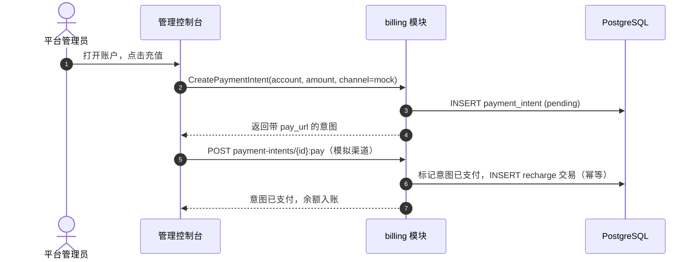

# 支付、发票与自动充值 — 需求分析与 UI/UX 设计

| 属性 | 内容 |
| --- | --- |
| 功能点 | 支付、发票与自动充值 |
| 文档范围 | 计费模块支付面的需求分析与 UI/UX 设计：支付渠道、发票生成与下载、自动充值阈值规则，构建在余额/配额账户核心（功能 #8）之上 |
| 所属模块 | `billing`（支付意图、发票、自动充值规则）、`web`（管理控制台支付/发票页面） |
| 相关文档 | [架构设计](./architecture.md) — §2.6 `billing` · [余额（预付）与配额（后付）](./balance-quota.md) — 本功能构建的账户核心（其非目标将支付、发票与自动充值延后至此）· [模型 × 卡型价格矩阵与阶梯定价](./pricing.md) — 本功能开票所依据的计费引擎与账单 |
| 状态 | 设计完成，已交付架构师 agent |

---

## 1. 背景

功能 #8 交付了账户核心：按组织的预付/后付账户、带幂等键的充值与退款、结算时扣款、推理门控，以及只追加的交易台账。平台仍然无法做到的是**自动收款**：充值仍是管理员手动操作，没有支付渠道，不为计费周期生成发票，预付账户耗尽后只能等运维手动充值。本功能增加支付面：**支付渠道**（为预付账户注资的方式）、**发票**（组织可下载的按周期计费单据）、以及**自动充值**（当余额低于阈值时自动为预付账户充值）。

### 1.1 同类产品如何处理支付与开票

| 产品 | 支付渠道 | 开票 | 自动充值 |
| --- | --- | --- | --- |
| **OpenAI Platform** | 绑定卡；企业开票 | 按用量开票；可下载 | 企业套餐自动充值 |
| **Anthropic Console** | 绑定卡 | 月度发票 | 自动充值阈值 |
| **SiliconFlow** | 支付宝/微信充值 | 按需开票 | 仅手动充值 |
| **Together AI** | 绑定卡（团队） | 月度发票 | 绑定卡，无阈值 |
| **百度千帆** | 企业结算 | 月度发票 | 套餐购买 |
| **阿里云百炼** | 控制台充值（支付宝/微信/卡） | 月度发票 | 阈值自动充值 |

### 1.2 提炼的模式与决策

值得采纳的模式：(1) **支付意图是幂等的** —— 支付渠道回调必须恰好入账一次，复用功能 #8 的充值幂等键模式；(2) **发票由账单派生** —— 功能 #5 的账单是事实来源，发票是其可展示、可下载的呈现；(3) **自动充值是一条阈值规则** —— 当余额低于下限时充值到目标值，并用每日上限约束敞口。

要避免的坑：浮点金额（功能 #8 已用整数分）；支付渠道重试导致重复入账；发票与账单不一致；无上限的自动充值（失控支出）。

**go-taas 的决策**：

| # | 决策 | 理由 |
| --- | --- | --- |
| D1 | **支付渠道是可插拔注册表** —— `payment_channels` 表（渠道 id、类型、显示名、配置、启用状态）与 `PaymentIntent` 流程：`CreatePaymentIntent` → 渠道跳转/二维码 → 渠道回调 → 幂等入账。v1 内置一个**模拟渠道**（控制台"模拟支付"按钮），使流程无需真实 PSP 即可端到端可测；真实 PSP 适配器（Stripe/支付宝/微信）作为后续行 | 流程本身才是价值所在；模拟渠道让它在 compose 栈中端到端可测 |
| D2 | **支付意图恰好入账一次** —— `payment_intents` 表（意图 id、账户 id、金额分、渠道、状态、幂等键、引用、创建/支付/过期时间戳）；渠道回调将其标记为已支付并写入一条 `recharge` 交易（复用功能 #8 的幂等键机制） | 镜像功能 #8 的充值幂等；重试的回调不会重复入账 |
| D3 | **发票由账单派生** —— `invoices` 表（发票 id、账单 id、组织 id、周期、总金额分、币种、状态、开具/支付时间戳、下载 URL）；`ListInvoices`/`GetInvoice`/`DownloadInvoice` RPC。发票按需（或由 runner）从已结算账单生成，是其可展示的呈现 | 账单是事实来源；发票是其上的呈现层 |
| D4 | **自动充值是一条按账户的阈值规则** —— 账户上的 `auto_recharge` 字段（启用、阈值分、充值分、每日上限分）；runner 检查预付账户，当余额低于阈值时发起支付意图，受每日上限约束 | 有界、可预测的充值；每日上限防止失控支出 |
| D5 | **新增错误码** —— `CodePaymentChannelInvalid`、`CodePaymentIntentInvalid`、`CodeInvoiceNotFound`、`CodeAutoRechargeInvalid` | 校验与不存在保持区分，镜像功能 #8 的模式 |

## 2. 目标与非目标

**目标**：带模拟渠道的支付渠道注册表；支付意图流程（创建 → 支付 → 幂等入账）；从已结算账单生成并下载发票；按账户的自动充值阈值规则与每日上限；支付、发票与自动充值配置的控制台页面；激活新增错误码。

**非目标**（延后）：真实 PSP 适配器（Stripe/支付宝/微信）；通过支付渠道退款（功能 #8 的 `Refund` 仍是机制）；多币种与 FX；催收；租户自助支付（v1 仅管理面）；发票邮件投递。

## 3. 角色

| 角色 | 描述 | 与支付的交互 |
| --- | --- | --- |
| **平台管理员** | 运行集群的运维 | 配置支付渠道、查看支付意图、生成发票、设置自动充值规则 |
| **组织管理员（未来）** | 租户侧管理员 | 将看到自己组织的发票与支付历史（按租户隔离） |
| **智能体 / SDK** | 程序化消费者 | 不直接受影响；受益于自动充值保持账户有资金 |

> 术语：消费侧调用方称为 **Agent**（英文）/「智能体」（中文），与仓库约定一致。

## 4. 用户旅程

| # | 旅程 | 步骤 |
| --- | --- | --- |
| J1 | **为预付账户注资** | 管理员打开账户详情 → 点击"充值" → 选择支付渠道 → 模拟渠道显示"模拟支付"按钮 → 意图标记为已支付，余额入账 |
| J2 | **自动充值保持账户有资金** | 管理员启用自动充值（阈值 $10、充值 $50、每日上限 $100）→ 用量将余额耗至 $10 以下 → runner 发起支付意图 → 模拟渠道自动支付 → 余额充值至 $60 |
| J3 | **为计费周期开票** | 管理员打开发票页 → 从已结算账单生成发票 → 下载 PDF → 发票与账单总额一致 |
| J4 | **审计一笔支付** | 审计员打开支付意图 → 看到渠道、金额、状态及其产生的充值交易 |

## 5. 功能需求与验收标准

### FR1 — 支付渠道

- **FR1.1** `CreatePaymentChannel`/`ListPaymentChannels`/`EnablePaymentChannel`/`DisablePaymentChannel` 管理渠道注册表。v1 内置一个**模拟渠道**（`mock`），始终可用。
- **FR1.2** `CreatePaymentIntent`（`POST /api/v1/admin/billing/payment-intents`）为预付账户创建意图：`amount_cents > 0`、`channel`、调用方提供的 `idempotency_key`。返回带 `pay_url` 的意图（模拟渠道为控制台"模拟支付"URL）。
- **FR1.3** 渠道回调（模拟渠道为 `POST /api/v1/admin/billing/payment-intents/{intent_id}:pay`）将意图标记为已支付并恰好入账一次（D2）。

### FR2 — 发票

- **FR2.1** `ListInvoices`/`GetInvoice`/`DownloadInvoice` 返回从已结算账单派生的发票（D3）。`GenerateInvoice`（`POST /api/v1/admin/billing/invoices`）从账单 id 创建发票（幂等：每张账单一张发票）。
- **FR2.2** 发票携带账单的周期、总金额分、币种与状态；下载返回可展示文档（v1 为 JSON/HTML 呈现；PDF 为后续）。

### FR3 — 自动充值

- **FR3.1** `UpdateAccount` 增加自动充值字段：`auto_recharge_enabled`、`auto_recharge_threshold_cents`、`auto_recharge_topup_cents`、`auto_recharge_daily_cap_cents`。
- **FR3.2** runner 检查启用自动充值的预付账户：当 `balance_cents < threshold` 时，为 `topup_cents` 发起支付意图，受每日上限约束（D4）。模拟渠道自动支付。

### FR4 — 控制台

- **FR4.1** 管理控制台新增支付页（渠道列表、支付意图）、发票页（列表、生成、下载），以及账户详情页上的自动充值控件。

### 验收标准

| # | 标准（给定 / 当 / 则） | 验证 |
| --- | --- | --- |
| AC1 | **给定**一个预付账户，**当**调用 `CreatePaymentIntent`，**则**创建带 `pay_url` 的意图且账户尚未入账 | 单元 + FVT |
| AC2 | **给定**一个待支付意图，**当**模拟渠道支付它，**则**意图标记为已支付且账户恰好入账一次 | 单元 + FVT |
| AC3 | **给定**一个已支付意图，**当**回调被重试，**则**幂等（不重复入账） | 单元 |
| AC4 | **给定**一张已结算账单，**当**调用 `GenerateInvoice`，**则**创建与账单总额一致的发票；再次调用幂等 | 单元 + FVT |
| AC5 | **给定**一张发票，**当**调用 `DownloadInvoice`，**则**返回可展示文档 | FVT |
| AC6 | **给定**一个启用自动充值的预付账户，**当**余额低于阈值，**则** runner 发起受每日上限约束的支付意图 | 单元 + FVT |
| AC7 | **给定**支付页，**当**管理员创建并支付意图，**则**意图状态与产生的充值交易渲染 | E2E |
| AC8 | **给定**发票页，**当**管理员生成并下载发票，**则**渲染且与账单一致 | E2E |
| AC9 | **给定**账户详情页，**当**管理员启用自动充值，**则**规则渲染且 runner 据此行动 | E2E |

### 支付流程

## 6. 控制台约定

| 页面 / 组件 | 用途 | 关键 testid |
| --- | --- | --- |
| **支付页**（`/admin/billing/payments`） | 渠道列表、支付意图（状态、金额、账户）、创建意图对话框、模拟"模拟支付" | `payments-table`、`payment-intent-row-{id}`、`create-payment-intent`、`payment-intent-amount`、`payment-intent-channel`、`payment-intent-pay-{id}`、`payment-intent-status-{id}` |
| **发票页**（`/admin/billing/invoices`） | 发票列表（周期、总额、状态）、从账单生成对话框、下载 | `invoices-table`、`invoice-row-{id}`、`generate-invoice`、`invoice-bill-select`、`invoice-download-{id}` |
| **账户详情** | 自动充值控件（启用、阈值、充值、每日上限） | `auto-recharge-toggle`、`auto-recharge-threshold`、`auto-recharge-topup`、`auto-recharge-cap`、`auto-recharge-save` |

空状态：支付页显示"暂无支付意图"；发票页显示"暂无发票"；账户为后付时自动充值开关禁用。颜色语言：待支付意图 = 琥珀色，已支付 = 绿色，失败 = 红色；发票状态镜像账单状态。