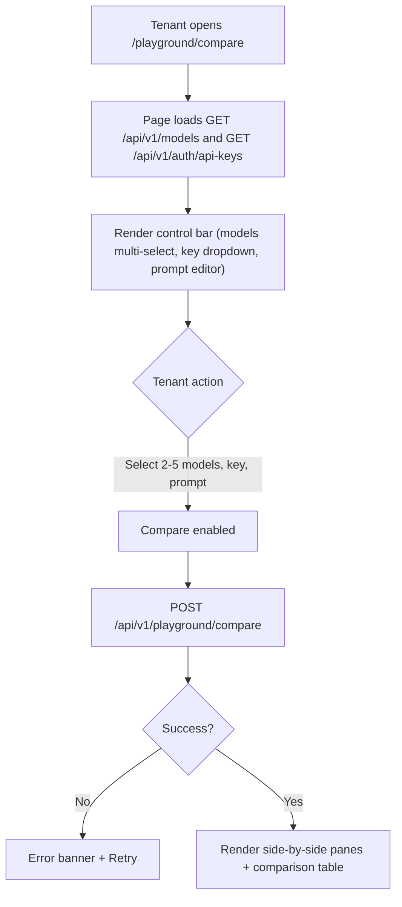
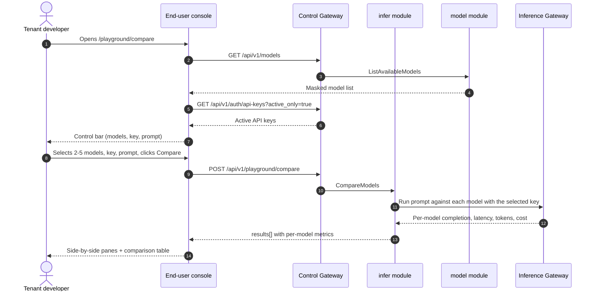

# Model Playground Comparison — Requirement Analysis and UI/UX Design

| Attribute | Content |
| --- | --- |
| Feature point | Model playground comparison — compare multiple models side by side on the same prompt, with latency/token/cost per model and a comparison table (backlog row 35) |
| Document scope | Requirement analysis, competitive research, the end-user playground-comparison page for `/playground/compare`, the page → API surface table, and numbered acceptance criteria |
| Owning modules | `infer` (the compare RPC that runs the same prompt against multiple models and returns per-model latency/token/cost), `model` (read-only: the masked user-realm catalog the compare page's model selector draws from), `auth` (read-only: the active API keys the compare page offers), `web` end-user console (`PlaygroundComparePage`) |
| Related documents | [Architecture Design](./architecture.md) — §2.4 `infer`, §3.1 (admin/user surface separation) · [Console Surface Separation](./console-surface-separation.md) — the end-user playground (`/playground`, `POST /api/v1/models/{model_id}:playground`, D14), the `UserShell` conventions, the masked-projection rule · [Request Logs & API Playground](./request-logs-playground.md) — the existing model-based playground this feature extends into a multi-model comparison · [Usage Dashboards & Per-Request Cost Attribution](./usage-dashboard.md) — the cost-attribution model this feature's per-model cost column draws from |
| Status | Design complete, handed to the Architect agent |

---

## 1. Background and Competitive Research

### 1.1 Why the Playground Comparison Comes Now

The end-user playground (feature #12, D14) lets a tenant send a prompt to a single model through `POST /api/v1/models/{model_id}:playground` and see the completion, token usage, and latency. What the tenant still cannot do is **choose between models**: when an Agent's developer wants to pick the best model for a task, they must run the same prompt against each model one at a time and compare the results by hand. There is no side-by-side view of latency, token usage, and cost across models on the same prompt.

This feature adds a **model playground comparison**: compare multiple models side by side on the same prompt, with latency/token/cost per model and a comparison table. It is the smallest independently valuable increment of Phase 4's model-selection surface: it turns "which model should my Agent use?" into "run the same prompt against three models and see latency, tokens, and cost side by side".

### 1.2 How Comparable Products Implement Model Comparison

| Product | Comparison surface | Per-model metrics | Comparison table | Notable pitfalls |
| --- | --- | --- | --- | --- |
| **OpenAI Platform** | No built-in side-by-side comparison; users open multiple playground tabs | Latency and tokens per tab | No comparison table | Manual tab-switching; no cost column |
| **Anthropic Console** | No built-in comparison; single-model playground | Latency and tokens | No comparison table | Manual comparison |
| **Together AI** | Model cards with pricing; no side-by-side prompt comparison | Pricing per M tokens | No comparison table | Pricing is static, not per-prompt |
| **SiliconFlow** | Model square with cards; no side-by-side prompt comparison | Pricing and rate limits per card | No comparison table | No per-prompt latency/cost |
| **LangSmith / Langfuse** | Trace/experiment comparison across runs | Per-run latency, tokens, cost | Comparison table of runs | Heavy third-party stack; not a prompt-level playground |
| **Vertex AI / Bedrock** | Model evaluation / playground with side-by-side | Latency, tokens, cost per model | Comparison table | Evaluation is heavyweight; playground comparison is limited |

### 1.3 Distilled Patterns and Decisions

Patterns worth adopting:

1. **Side-by-side model panes** — the tenant picks several models and sees each model's completion in its own pane, driven by the same prompt. This is the core comparison interaction.
2. **Per-model metrics** — each pane shows latency, token usage (input/output), and cost, so the tenant can compare quality and economics at once.
3. **A comparison table** — a compact table summarizing latency/tokens/cost per model for quick scanning, complementing the panes.
4. **The same prompt, metered and logged** — each comparison call goes through the real metered path (like the existing playground, D14), so the calls are visible in usage and request logs.

Pitfalls to avoid:

- **Manual tab-switching** (OpenAI, Anthropic) — the whole point is a single side-by-side view; the page must not make the tenant switch tabs.
- **Static pricing instead of per-prompt cost** (Together, SiliconFlow) — the cost column must be the actual metered cost of the prompt, not a static per-M-token price.
- **A heavy evaluation stack** (Vertex, Bedrock) — go-taas needs a lightweight prompt-level comparison, not a full evaluation harness.
- **Bypassing metering** — each comparison call must go through the real metered path so the calls are visible in usage and request logs (the Chinese-platform pitfall from feature #12).

**Decisions for go-taas** (recorded rationale, per the autonomous-decision rule):

| # | Decision | Rationale |
| --- | --- | --- |
| D1 | **The playground comparison lives on the end-user surface only**: `/playground/compare` + `/api/v1/playground/compare`. There is **no admin surface** — model selection is a tenant task (which model should my Agent use), not an operator task | The tenant picks models for its Agents; the operator manages the catalog and deployment (admin surface). Consistent with the end-user playground (feature #12, D14) being model-based |
| D2 | **A new `CompareModels` RPC** runs the same prompt against multiple models and returns per-model completion, latency, token usage, and cost in a single call | The comparison needs several models' results at once; a dedicated RPC keeps the multi-model concern out of the single-model `PlaygroundInfer` surface and gives it one home |
| D3 | **Each comparison call goes through the real metered path** — `CompareModels` resolves a ready service for each model, infers with the selected key, and returns the metered cost; the calls are visible in usage and request logs | The comparison must exercise the real inference path so the cost column is real and the calls are auditable (feature #12 D5/D14 pattern) |
| D4 | **The cost column is the actual metered cost** of each prompt, not a static per-M-token price | The tenant needs the real economics of the prompt (pattern 2); a static price would be misleading (pitfall) |
| D5 | **The page is a side-by-side pane layout plus a comparison table** — each selected model gets a completion pane with latency/tokens/cost, and a summary table aggregates the metrics for quick scanning | Side-by-side panes are the core interaction (pattern 1); the table complements them for scanning (pattern 3) |
| D6 | **The model selector draws from the masked user-realm catalog** (`GET /api/v1/models`) and the key selector from the tenant's active API keys (`GET /api/v1/auth/api-keys?active_only=true`), exactly as the existing playground does | The tenant picks models and keys from the same masked sources as the existing playground (feature #17 D15); no operator internals leak |

### 1.4 Scope Boundary

**In scope**: a playground-comparison page (multi-model selector, shared prompt editor, side-by-side completion panes with latency/tokens/cost, and a comparison table), the `CompareModels` RPC, and the per-model metered cost.

**Out of scope** (tracked by other feature points): the single-model playground (#12), request-level traces (#27), cost analytics dashboards (#29), and a full evaluation harness or benchmark suite (deliberately absent, D6).

---

## 2. User Roles

| Role | Description | Interaction with the playground comparison |
| --- | --- | --- |
| **Tenant developer / Agent** | The end-user who builds Agents that consume models | Compares multiple models on the same prompt to choose the best one for a task, seeing latency, tokens, and cost side by side |
| **Tenant billing owner** | The end-user who pays for usage | Uses the comparison's cost column to understand the economics of a prompt across models |
| **Platform administrator** | The operator who runs the cluster | Never touches the comparison; manages the catalog and deployment on the admin surface |

> Terminology: the consumer-side caller is called an **Agent** (English) / 「智能体」(Chinese), consistent with the repo convention. This feature is end-user-only, so the consumer-side terminology applies directly to the tenant surface.

---

## 3. User Stories

| # | As a… | I want to… | So that… |
| --- | --- | --- | --- |
| US1 | Tenant developer | select multiple models and run the same prompt against all of them | I can compare their outputs side by side |
| US2 | Tenant developer | see latency, token usage, and cost per model | I can choose the best model for a task on quality and economics |
| US3 | Tenant developer | see a comparison table summarizing the metrics | I can scan the results quickly without reading every pane |
| US4 | Tenant developer | use my own API key for the comparison calls | the calls are metered and logged like any other call |
| US5 | Tenant billing owner | see the real metered cost per model | I understand the economics of a prompt across models |
| US6 | Agent / SDK | call a chosen model through its endpoint with my API Key | I get completions from the model the developer selected |

---

## 4. Functional Requirements

### FR1 — Compare models

- **FR1.1** `CompareModels` (`POST /api/v1/playground/compare`) runs the same prompt against multiple models and returns per-model results. The request carries `model_ids[]` (2–5 models), `api_key_id`, and `prompt`.
- **FR1.2** The response carries `results[]`, one per model, each with `model_id`, `model_name`, `completion`, `latency_ms`, `input_tokens`, `output_tokens`, and `cost` (the metered cost of the prompt).
- **FR1.3** An unknown `model_id` or `api_key_id` returns the existing not-found codes; a blocked key (funds/quota) returns 10502 `CodeInsufficientFunds`; fewer than 2 or more than 5 models returns a validation error.

### FR2 — Metered and logged

- **FR2.1** Each comparison call goes through the real metered path (D3): `CompareModels` resolves a ready service for each model, infers with the selected key, and returns the metered cost; the calls appear in usage and request logs.

### FR3 — Side-by-side panes and comparison table

- **FR3.1** The page offers a **model selector** (multi-select, 2–5 models, from `GET /api/v1/models`), a **key selector** (from `GET /api/v1/auth/api-keys?active_only=true`), and a **prompt editor** (textarea).
- **FR3.2** A **Compare** button runs the comparison; each selected model renders a completion pane with latency, input/output tokens, and cost, and a **comparison table** aggregates the metrics for scanning.

---

## 5. Page and Flow Design

### 5.1 Surface Assignment

| Feature | Surface | Web route | API prefix |
| --- | --- | --- | --- |
| Compare models | end-user | `/playground/compare` | `/api/v1/playground/compare` |
| Model selector source | end-user | `/playground/compare` | `/api/v1/models` |
| Key selector source | end-user | `/playground/compare` | `/api/v1/auth/api-keys` |

Every page and API call above is on the **end-user surface**; there is no admin surface (D1). End-user pages never call a `/api/v1/admin/*` route, and the user session realm is used throughout.

### 5.2 Page Map

| Page / component | Purpose |
| --- | --- |
| **Playground Compare page** (`/playground/compare`) | Multi-model selector, shared prompt editor, side-by-side completion panes with latency/tokens/cost, and a comparison table |

### 5.3 Page: `/playground/compare` — Playground Compare (end-user)

**Purpose**: give a tenant developer a single surface to compare multiple models on the same prompt — pick 2–5 models, run the prompt, and see latency, tokens, and cost side by side.

**Surface**: end-user — route `/playground/compare`, API `/api/v1/playground/compare`.

**Layout**: rendered inside `UserShell` (feature #17). A page header ("Playground Compare", subtitle "Compare models on the same prompt") with a **Back to Playground** link (secondary). Below:

1. **Control bar** — a **Models** multi-select (2–5, from `GET /api/v1/models`), a **Key** dropdown (from `GET /api/v1/auth/api-keys?active_only=true`), a **Prompt** editor (textarea), and a **Compare** button (primary).
2. **Side-by-side panes** — one completion pane per selected model, each showing the completion, latency, input/output tokens, and cost.
3. **Comparison table** — a summary table with one row per model: **Model**, **Latency**, **Input tokens**, **Output tokens**, **Cost**.

**Interactive states**:

| State | Behaviour |
| --- | --- |
| Default | Control bar renders; panes and table are empty with a hint to select models and write a prompt |
| Loading | Panes show skeletons; Compare is disabled |
| Empty | "Select 2–5 models and write a prompt to compare." with a hint; the control bar stays visible |
| Error | An error banner with the message and a Retry button; the page keeps its last good results with a "Showing stale results" banner |
| Disabled | Compare is disabled until 2–5 models, a key, and a non-empty prompt are chosen; Compare is disabled while a comparison is in flight |
| Permission-denied | A session without the required role receives 10036 and the page shows the standard permission-denied state (feature #17) with a link back to the user home |

**Control bar controls**: Models multi-select (2–5, from `GET /api/v1/models`), Key dropdown (from `GET /api/v1/auth/api-keys?active_only=true`), Prompt textarea, Compare button. Compare is disabled until 2–5 models, a key, and a non-empty prompt are chosen.

**Side-by-side panes**: one pane per selected model, each with the completion text, latency, input/output tokens, and cost. The panes render in a responsive grid.

**Comparison table columns**: Model, Latency, Input tokens, Output tokens, Cost. One row per model; not sortable (the order follows the selection).

### 5.4 Flows

---

## 6. API Surface Implications

The compare RPC belongs to the **`infer` module** (D2), served as HTTP via the Control Gateway on the **user prefix** `/api/v1/playground/compare` (D1). The model and key selectors reuse the existing user-realm sources (`GET /api/v1/models`, `GET /api/v1/auth/api-keys`). There is **no admin-prefix binding** (D1).

| RPC | Route | Prefix | Status | Purpose |
| --- | --- | --- | --- | --- |
| `CompareModels` (`taas.infer.v1`) | `POST /api/v1/playground/compare` | user | **new** | Run the same prompt against multiple models, return per-model latency/tokens/cost |
| `ListAvailableModels` (`taas.model.v1`) | `GET /api/v1/models` | user | existing | Masked model list for the selector (reused) |
| `ListAPIKeys` (`taas.auth.v1`) | `GET /api/v1/auth/api-keys` | user | existing | Active API keys for the selector (reused) |

**Contract notes for the Architect agent**:

1. `CompareModels` takes `model_ids[]` (2–5), `api_key_id`, and `prompt`; it returns `results[]`, one per model, each with `model_id`, `model_name`, `completion`, `latency_ms`, `input_tokens`, `output_tokens`, and `cost` (FR1.1, FR1.2).
2. Each comparison call goes through the real metered path (D3): `CompareModels` resolves a ready service for each model, infers with the selected key, and returns the metered cost; the calls appear in usage and request logs (FR2.1).
3. The model selector draws from the masked user-realm catalog and the key selector from the tenant's active API keys, exactly as the existing playground does (D6).
4. Wire conventions unchanged: HTTP 200 on success, business errors as `{"code": <int>, "message": "..."}`, int64 fields serialized as JSON strings.

Error codes (existing blocks, `pkg/errors/codes.go`):

| Condition | Code | Constant | Notes |
| --- | --- | --- | --- |
| Unknown `model_id` | 10101 | `CodeModelNotFound` | `CompareModels` (FR1.3) |
| Unknown `api_key_id` | 10007 | `CodeAPIKeyNotFound` | `CompareModels` (FR1.3) |
| Inference blocked by funds/quota | 10502 | `CodeInsufficientFunds` | `CompareModels` (FR1.3) |
| Fewer than 2 or more than 5 models | 10404 | `CodeRequestLogRangeInvalid` | Reused for the model-count validation (FR1.3) |

---

## 7. Acceptance Criteria

| # | Criterion | Level |
| --- | --- | --- |
| AC1 | `CompareModels` runs the same prompt against 2–5 models and returns `results[]`, one per model, each with `model_id`, `model_name`, `completion`, `latency_ms`, `input_tokens`, `output_tokens`, and `cost` | FVT |
| AC2 | `CompareModels` with fewer than 2 or more than 5 models returns a validation error; an unknown `model_id` returns 10101, an unknown `api_key_id` returns 10007, and a blocked key returns 10502 | FVT |
| AC3 | Each comparison call goes through the real metered path and appears in usage and request logs for the same organization and key | FVT + E2E |
| AC4 | The `/playground/compare` page renders the control bar (models multi-select, key dropdown, prompt editor) from the first successful load, with the model selector populated from `GET /api/v1/models` and the key selector from `GET /api/v1/auth/api-keys` | E2E |
| AC5 | Compare is disabled until 2–5 models, a key, and a non-empty prompt are chosen; clicking Compare runs the comparison and renders the side-by-side panes and the comparison table | E2E |
| AC6 | Each pane shows the completion, latency, input/output tokens, and cost; the comparison table shows one row per model with Model, Latency, Input tokens, Output tokens, and Cost | E2E |
| AC7 | The playground-comparison page is reachable only on the end-user surface: route `/playground/compare`, every API call uses the `/api/v1/*` prefix with no `/api/v1/admin/*` string | E2E (surface separation) |
| AC8 | A session without the required role receives 10036 on the playground-comparison page and the page shows the standard permission-denied state | E2E |

---

## 8. Out of Scope (tracked elsewhere)

| Item | Where |
| --- | --- |
| Single-model playground | Feature #12 request logs & API playground |
| Request-level traces and latency breakdown | Feature #27 request tracing |
| Cost analytics dashboards | Feature #29 cost analytics dashboard |
| A full evaluation harness or benchmark suite | Deliberately absent (D6) — the comparison is a lightweight prompt-level tool |
| An admin-surface comparison | Deliberately absent (D1) — model selection is a tenant task |
