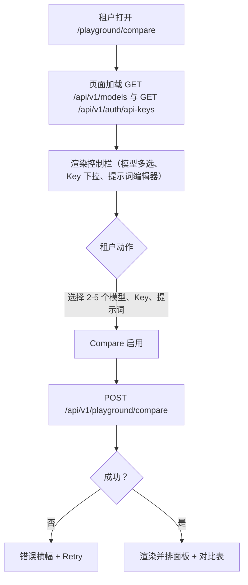
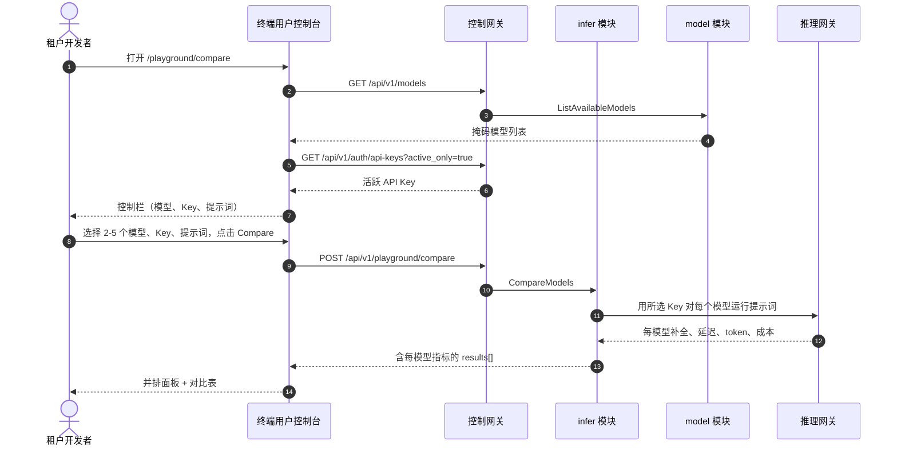

# 模型游乐场对比 — 需求分析与 UI/UX 设计

| 属性 | 内容 |
| --- | --- |
| 特性点 | 模型游乐场对比 — 在同一提示词上并排对比多个模型，含每模型延迟/token/成本与对比表（backlog 第 35 行） |
| 文档范围 | 需求分析、竞品调研、`/playground/compare` 终端用户游乐场对比页、页面 → API 面映射表，以及编号验收标准 |
| 归属模块 | `infer`（对多个模型运行同一提示词并返回每模型延迟/token/成本的对比 RPC）、`model`（只读：对比页模型选择器所依据的掩码用户面目录）、`auth`（只读：对比页提供的活跃 API Key）、`web` 终端用户控制台（`PlaygroundComparePage`） |
| 相关文档 | [架构设计](./architecture.md) — 第 2.4 节 `infer`、第 3.1 节（管理面/用户面分离）· [控制台面分离](./console-surface-separation.md) — 终端用户游乐场（`/playground`、`POST /api/v1/models/{model_id}:playground`、D14）、`UserShell` 约定、掩码投影规则 · [请求日志与 API 游乐场](./request-logs-playground.md) — 本特性扩展为多模型对比的既有基于模型的游乐场 · [用量仪表盘与按请求成本归属](./usage-dashboard.md) — 本特性每模型成本列所依据的成本归属模型 |
| 状态 | 设计完成，已移交架构师代理 |

---

## 1. 背景与竞品调研

### 1.1 为什么现在做游乐场对比

终端用户游乐场（特性 #12、D14）让租户通过 `POST /api/v1/models/{model_id}:playground` 向单个模型发送提示词，并查看补全、token 用量与延迟。租户仍然无法**在模型间选择**：当智能体的开发者想为任务挑选最佳模型时，必须逐个对每个模型运行同一提示词并手动比较结果。没有在同一提示词上跨模型的延迟、token 用量与成本的并排视图。

本特性新增**模型游乐场对比**：在同一提示词上并排对比多个模型，含每模型延迟/token/成本与对比表。这是 Phase 4 模型选择面中最小可独立交付的增量：它把「我的智能体该用哪个模型？」变成「对三个模型运行同一提示词，并排查看延迟、token 与成本」。

### 1.2 竞品如何实现模型对比

| 产品 | 对比面 | 每模型指标 | 对比表 | 主要陷阱 |
| --- | --- | --- | --- | --- |
| **OpenAI Platform** | 无内置并排对比；用户打开多个游乐场标签页 | 每标签页的延迟与 token | 无对比表 | 手动切换标签页；无成本列 |
| **Anthropic Console** | 无内置对比；单模型游乐场 | 延迟与 token | 无对比表 | 手动对比 |
| **Together AI** | 模型卡片含定价；无并排提示词对比 | 每百万 token 定价 | 无对比表 | 定价是静态的，非按提示词 |
| **SiliconFlow** | 模型广场含卡片；无并排提示词对比 | 每卡片定价与限流 | 无对比表 | 无按提示词的延迟/成本 |
| **LangSmith / Langfuse** | 跨运行的追踪/实验对比 | 每运行延迟、token、成本 | 运行对比表 | 重型第三方栈；非提示词级游乐场 |
| **Vertex AI / Bedrock** | 模型评估/游乐场并排对比 | 每模型延迟、token、成本 | 对比表 | 评估过重；游乐场对比有限 |

### 1.3 提炼出的模式与决策

值得采纳的模式：

1. **并排模型面板** — 租户选择多个模型，看到每个模型在各自面板中的补全，由同一提示词驱动。这是核心对比交互。
2. **每模型指标** — 每个面板显示延迟、token 用量（输入/输出）与成本，让租户同时比较质量与经济性。
3. **对比表** — 紧凑表格汇总每模型的延迟/token/成本，便于快速扫描，补充面板。
4. **同一提示词，计量并记录** — 每次对比调用都走真实计量路径（如既有游乐场，D14），使调用在用量与请求日志中可见。

需要避免的陷阱：

- **手动切换标签页**（OpenAI、Anthropic）— 重点就是单一并排视图；页面不得让租户切换标签页。
- **静态定价而非按提示词成本**（Together、SiliconFlow）— 成本列必须是提示词的实际计量成本，而非静态每百万 token 价格。
- **重型评估栈**（Vertex、Bedrock）— go-taas 需要轻量提示词级对比，而非完整评估工具。
- **绕过计量** — 每次对比调用必须走真实计量路径，使调用在用量与请求日志中可见（特性 #12 的中国平台陷阱）。

**go-taas 的决策**（依据自主决策规则记录理由）：

| # | 决策 | 依据 |
| --- | --- | --- |
| D1 | **游乐场对比仅存在于终端用户面**：`/playground/compare` + `/api/v1/playground/compare`。**无管理面** — 模型选择是租户任务（我的智能体该用哪个模型），而非运营者任务 | 租户为智能体挑选模型；运营者在管理面管理目录与部署。与终端用户游乐场（特性 #12、D14）基于模型一致 |
| D2 | **新增 `CompareModels` RPC** 对多个模型运行同一提示词，并在单次调用中返回每模型的补全、延迟、token 用量与成本 | 对比需要一次获得多个模型的结果；专用 RPC 把多模型关注点从单模型 `PlaygroundInfer` 面中分离出来并给它一个归属 |
| D3 | **每次对比调用都走真实计量路径** — `CompareModels` 为每个模型解析就绪服务，用所选 Key 推理，并返回计量成本；调用在用量与请求日志中可见 | 对比必须走真实推理路径，使成本列真实且调用可审计（特性 #12 D5/D14 模式） |
| D4 | **成本列是每个提示词的实际计量成本**，而非静态每百万 token 价格 | 租户需要提示词的真实经济性（模式 2）；静态价格会误导（陷阱） |
| D5 | **页面是并排面板布局加对比表** — 每个所选模型获得带延迟/token/成本的补全面板，汇总表聚合指标便于扫描 | 并排面板是核心交互（模式 1）；表格补充扫描（模式 3） |
| D6 | **模型选择器取自掩码用户面目录**（`GET /api/v1/models`），Key 选择器取自租户的活跃 API Key（`GET /api/v1/auth/api-keys?active_only=true`），与既有游乐场完全一致 | 租户从与既有游乐场相同的掩码来源选择模型与 Key（特性 #17 D15）；不泄漏运营者内部信息 |

### 1.4 范围边界

**范围内**：游乐场对比页（多模型选择器、共享提示词编辑器、带延迟/token/成本的并排补全面板、对比表）、`CompareModels` RPC、每模型计量成本。

**范围外**（由其他特性点跟踪）：单模型游乐场（#12）、请求级追踪（#27）、成本分析仪表盘（#29）、完整评估工具或基准套件（刻意缺失，D6）。

---

## 2. 用户角色

| 角色 | 描述 | 与游乐场对比的交互 |
| --- | --- | --- |
| **租户开发者 / 智能体** | 构建消费模型的智能体的终端用户 | 在同一提示词上对比多个模型，为任务挑选最佳模型，并排查看延迟、token 与成本 |
| **租户账单负责人** | 为用量付费的终端用户 | 用对比的成本列理解提示词跨模型的经济性 |
| **平台管理员** | 运维集群的运营者 | 从不接触对比；在管理面管理目录与部署 |

> 术语：消费侧调用方在英文中为 **Agent**，中文为「智能体」，与仓库约定一致。本特性仅终端用户面，因此消费侧术语直接适用于租户面。

---

## 3. 用户故事

| # | 作为… | 我想要… | 以便… |
| --- | --- | --- | --- |
| US1 | 租户开发者 | 选择多个模型并对所有模型运行同一提示词 | 我能并排比较它们的输出 |
| US2 | 租户开发者 | 查看每模型的延迟、token 用量与成本 | 我能按质量与经济性为任务挑选最佳模型 |
| US3 | 租户开发者 | 查看汇总指标的对比表 | 我能快速扫描结果，无需阅读每个面板 |
| US4 | 租户开发者 | 用我自己的 API Key 进行对比调用 | 调用像其他调用一样被计量并记录 |
| US5 | 租户账单负责人 | 查看每模型的真实计量成本 | 我理解提示词跨模型的经济性 |
| US6 | 智能体 / SDK | 用我的 API Key 通过端点调用所选模型 | 我获得开发者所选模型的补全结果 |

---

## 4. 功能需求

### FR1 — 对比模型

- **FR1.1** `CompareModels`（`POST /api/v1/playground/compare`）对多个模型运行同一提示词并返回每模型结果。请求携带 `model_ids[]`（2–5 个模型）、`api_key_id` 与 `prompt`。
- **FR1.2** 响应携带 `results[]`，每模型一个，各带 `model_id`、`model_name`、`completion`、`latency_ms`、`input_tokens`、`output_tokens` 与 `cost`（提示词的计量成本）。
- **FR1.3** 未知 `model_id` 或 `api_key_id` 返回既有 not-found 码；被阻止的 Key（资金/配额）返回 10502 `CodeInsufficientFunds`；少于 2 个或多于 5 个模型返回校验错误。

### FR2 — 计量并记录

- **FR2.1** 每次对比调用都走真实计量路径（D3）：`CompareModels` 为每个模型解析就绪服务，用所选 Key 推理，并返回计量成本；调用出现在用量与请求日志中。

### FR3 — 并排面板与对比表

- **FR3.1** 页面提供**模型选择器**（多选，2–5 个模型，来自 `GET /api/v1/models`）、**Key 选择器**（来自 `GET /api/v1/auth/api-keys?active_only=true`）与**提示词编辑器**（textarea）。
- **FR3.2** **Compare** 按钮运行对比；每个所选模型渲染带延迟、输入/输出 token 与成本的补全面板，**对比表**聚合指标便于扫描。

---

## 5. 页面与流程设计

### 5.1 面分配

| 特性 | 面 | Web 路由 | API 前缀 |
| --- | --- | --- | --- |
| 对比模型 | end-user | `/playground/compare` | `/api/v1/playground/compare` |
| 模型选择器来源 | end-user | `/playground/compare` | `/api/v1/models` |
| Key 选择器来源 | end-user | `/playground/compare` | `/api/v1/auth/api-keys` |

以上每个页面与 API 调用都位于**终端用户面**；无管理面（D1）。终端用户页面从不调用 `/api/v1/admin/*` 路由，全程使用用户会话域。

### 5.2 页面地图

| 页面 / 组件 | 目的 |
| --- | --- |
| **游乐场对比页**（`/playground/compare`） | 多模型选择器、共享提示词编辑器、带延迟/token/成本的并排补全面板与对比表 |

### 5.3 页面：`/playground/compare` — Playground Compare（终端用户面）

**目的**：给租户开发者一个单一面在同一提示词上对比多个模型 — 选择 2–5 个模型、运行提示词、并排查看延迟、token 与成本。

**面**：end-user — 路由 `/playground/compare`，API `/api/v1/playground/compare`。

**布局**：在 `UserShell`（特性 #17）内渲染。页面头部（「Playground Compare」，副标题「Compare models on the same prompt」）带 **Back to Playground** 链接（次要）。下方：

1. **控制栏** — **Models** 多选（2–5，来自 `GET /api/v1/models`）、**Key** 下拉（来自 `GET /api/v1/auth/api-keys?active_only=true`）、**Prompt** 编辑器（textarea）与 **Compare** 按钮（主要）。
2. **并排面板** — 每个所选模型一个补全面板，各显示补全、延迟、输入/输出 token 与成本。
3. **对比表** — 每模型一行的汇总表：**Model**、**Latency**、**Input tokens**、**Output tokens**、**Cost**。

**交互状态**：

| 状态 | 行为 |
| --- | --- |
| 默认 | 控制栏渲染；面板与表格为空，提示选择模型并编写提示词 |
| 加载中 | 面板显示骨架；Compare 禁用 |
| 空 | 「Select 2–5 models and write a prompt to compare.」并提示；控制栏保持可见 |
| 错误 | 错误横幅带消息与 Retry 按钮；页面保留最后的好结果并显示「Showing stale results」横幅 |
| 禁用 | 选择 2–5 个模型、一个 Key 与非空提示词前 Compare 禁用；对比进行中 Compare 禁用 |
| 权限拒绝 | 无所需角色的会话收到 10036，页面显示标准权限拒绝状态（特性 #17）带返回用户首页的链接 |

**控制栏控件**：Models 多选（2–5，来自 `GET /api/v1/models`）、Key 下拉（来自 `GET /api/v1/auth/api-keys?active_only=true`）、Prompt textarea、Compare 按钮。选择 2–5 个模型、一个 Key 与非空提示词前 Compare 禁用。

**并排面板**：每个所选模型一个面板，各带补全文本、延迟、输入/输出 token 与成本。面板在响应式网格中渲染。

**对比表列**：Model、Latency、Input tokens、Output tokens、Cost。每模型一行；不可排序（顺序跟随选择）。

### 5.4 流程

---

## 6. API 面影响

对比 RPC 属于 **`infer` 模块**（D2），经控制网关以 HTTP 提供，位于**用户前缀** `/api/v1/playground/compare`（D1）。模型与 Key 选择器复用既有用户面来源（`GET /api/v1/models`、`GET /api/v1/auth/api-keys`）。**无管理前缀绑定**（D1）。

| RPC | 路由 | 前缀 | 状态 | 目的 |
| --- | --- | --- | --- | --- |
| `CompareModels`（`taas.infer.v1`） | `POST /api/v1/playground/compare` | user | **新增** | 对多个模型运行同一提示词，返回每模型延迟/token/成本 |
| `ListAvailableModels`（`taas.model.v1`） | `GET /api/v1/models` | user | 既有 | 选择器的掩码模型列表（复用） |
| `ListAPIKeys`（`taas.auth.v1`） | `GET /api/v1/auth/api-keys` | user | 既有 | 选择器的活跃 API Key（复用） |

**给架构师代理的契约说明**：

1. `CompareModels` 接受 `model_ids[]`（2–5）、`api_key_id` 与 `prompt`；它返回 `results[]`，每模型一个，各带 `model_id`、`model_name`、`completion`、`latency_ms`、`input_tokens`、`output_tokens` 与 `cost`（FR1.1、FR1.2）。
2. 每次对比调用都走真实计量路径（D3）：`CompareModels` 为每个模型解析就绪服务，用所选 Key 推理，并返回计量成本；调用出现在用量与请求日志中（FR2.1）。
3. 模型选择器取自掩码用户面目录，Key 选择器取自租户的活跃 API Key，与既有游乐场完全一致（D6）。
4. 线上约定不变：成功 HTTP 200，业务错误为 `{"code": <int>, "message": "..."}`，int64 字段序列化为 JSON 字符串。

错误码（既有块，`pkg/errors/codes.go`）：

| 条件 | 码 | 常量 | 说明 |
| --- | --- | --- | --- |
| 未知 `model_id` | 10101 | `CodeModelNotFound` | `CompareModels`（FR1.3） |
| 未知 `api_key_id` | 10007 | `CodeAPIKeyNotFound` | `CompareModels`（FR1.3） |
| 推理被资金/配额阻止 | 10502 | `CodeInsufficientFunds` | `CompareModels`（FR1.3） |
| 少于 2 个或多于 5 个模型 | 10404 | `CodeRequestLogRangeInvalid` | 复用于模型数校验（FR1.3） |

---

## 7. 验收标准

| # | 标准 | 级别 |
| --- | --- | --- |
| AC1 | `CompareModels` 对 2–5 个模型运行同一提示词并返回 `results[]`，每模型一个，各带 `model_id`、`model_name`、`completion`、`latency_ms`、`input_tokens`、`output_tokens` 与 `cost` | FVT |
| AC2 | `CompareModels` 少于 2 个或多于 5 个模型返回校验错误；未知 `model_id` 返回 10101，未知 `api_key_id` 返回 10007，被阻止的 Key 返回 10502 | FVT |
| AC3 | 每次对比调用都走真实计量路径，并出现在同一组织与 Key 的用量与请求日志中 | FVT + E2E |
| AC4 | `/playground/compare` 页面从首次成功加载渲染控制栏（模型多选、Key 下拉、提示词编辑器），模型选择器由 `GET /api/v1/models` 填充，Key 选择器由 `GET /api/v1/auth/api-keys` 填充 | E2E |
| AC5 | 选择 2–5 个模型、一个 Key 与非空提示词前 Compare 禁用；点击 Compare 运行对比并渲染并排面板与对比表 | E2E |
| AC6 | 每个面板显示补全、延迟、输入/输出 token 与成本；对比表每模型一行，含 Model、Latency、Input tokens、Output tokens 与 Cost | E2E |
| AC7 | 游乐场对比页只在终端用户面可达：路由 `/playground/compare`，每个 API 调用使用 `/api/v1/*` 前缀且无 `/api/v1/admin/*` 字符串 | E2E（面分离） |
| AC8 | 无所需角色的会话在游乐场对比页收到 10036，页面显示标准权限拒绝状态 | E2E |

---

## 8. 范围外（在别处跟踪）

| 项 | 位置 |
| --- | --- |
| 单模型游乐场 | 特性 #12 请求日志与 API 游乐场 |
| 请求级追踪与延迟分解 | 特性 #27 请求追踪 |
| 成本分析仪表盘 | 特性 #29 成本分析仪表盘 |
| 完整评估工具或基准套件 | 刻意缺失（D6）— 对比是轻量提示词级工具 |
| 管理面对比 | 刻意缺失（D1）— 模型选择是租户任务 |
