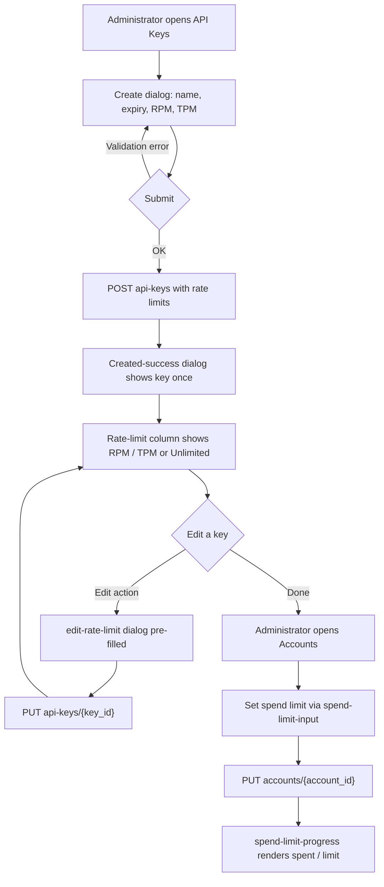
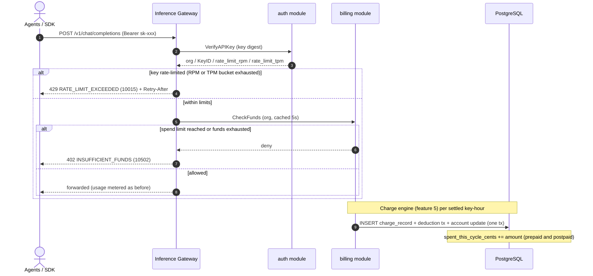

# Per-Key Rate Limits & Org Spend Limits — Requirement Analysis and UI/UX Design

| Attribute | Content |
| --- | --- |
| Feature point | Per-key rate limits (requests/min, tokens/min) & organization spend limits (monthly cap) |
| Document scope | Requirement analysis and UI/UX design for two increments: **Increment A** — per-key `rate_limit_rpm` / `rate_limit_tpm` on API keys, enforced at the data-plane gateway via the `VerifyAPIKey` response; **Increment B** — a cross-mode `monthly_spend_limit_cents` on the billing account, enforced in `CheckFunds`. Covers the console API Keys and Accounts pages, the API surface, and acceptance criteria |
| Owning modules | `auth` (key rate-limit fields, `UpdateAPIKey`), `billing` (spend-limit fields, `CheckFunds` enforcement, settlement increment, cycle reset), `infer` (gateway enforcement point), `metering` (unchanged); console web app |
| Related documents | [Architecture Design](./architecture.md) — §2.1 `auth`, §2.6 `billing`, §3.3 the Inference Gateway's API Key authentication chain · [API Key Lifecycle Management](./api-key-management.md) — the `api_keys` table and `VerifyAPIKey` being extended · [Balance (Prepaid) & Quota (Postpaid) Account Modes](./balance-quota.md) — the billing account, `CheckFunds`, and 10502 being extended · [Usage Dashboards & Per-Request Cost Attribution](./usage-dashboard.md) — the balance/quota widget that will surface spend-limit progress |
| Status | Design complete, handed to the Architect agent |

---

## 1. Background

Features #1–#10 closed the accounting loop: API keys identify callers, models deploy one-click, every inference request leaves a tamper-evident voucher that settles hourly per key, the price matrix turns settled usage into charge records and monthly bills, organizations own every resource, and billing accounts gate inference with a prepaid balance or a postpaid quota. What the platform still cannot do is **shape traffic and cap spend at the two boundaries operators actually control**: the **key** (the unit an agent/SDK presents on every request) and the **organization** (the unit that owns the money). Today a single leaked or misbehaving key can drive unbounded request volume and unbounded cost; a postpaid org with a quota can still be surprised by a spike within the final settlement hour; and there is no way to throttle a noisy tenant without revoking its key outright. This feature adds two independent, orthogonal controls: **per-key rate limits** (requests/min and tokens/min, enforced at the gateway) and an **organization spend limit** (a cross-mode monthly cap, enforced at the funds check). They compose: a key can be rate-limited while its org is simultaneously spend-capped, and neither control changes the settlement, charging, or metering pipelines.

### 1.1 How Comparable Products Enforce Rate and Spend Limits

| Product | Per-key rate limits | Org spend limits | Enforcement point | Notable pitfalls |
| --- | --- | --- | --- | --- |
| **OpenAI Platform** | Per-key RPM/TPM tiers (free/paid); hard 429 `rate_limit_exceeded` with `Retry-After` | Per-project spend limits; hard stop or soft warn | Gateway (token bucket per key) | Rate-limit errors are easily confused with `insufficient_quota`; tier changes are coarse |
| **Anthropic Console** | Per-workspace usage limits (a spend cap) | Per-workspace monthly spend cap | Gateway | Credits vs limits — two concepts users conflate until labeled apart |
| **Together AI** | Per-key RPM/TPM configurable | Account-level spend cap | Gateway | Limits are account-wide, multiplying blast radius |
| **SiliconFlow** | Per-key RPM/TPM | Balance-based (prepaid) | Gateway | No separate spend cap — balance exhaustion is the only brake |
| **Baidu Qianfan** | Per-key QPS limits | Postpaid monthly settlement | Gateway | QPS vs RPM confusion; no per-key token cap |
| **Aliyun Bailian / Volcengine Ark** | Per-key RPM/TPM | Prepaid balance + postpaid quota | Gateway | Mode switching mid-cycle muddles the bill |

### 1.2 Distilled Patterns and Decisions

Patterns worth adopting: (1) **two independent rate dimensions** — RPM (requests/min) and TPM (tokens/min) are the industry-standard pair (OpenAI, Together, Ark); (2) **enforce at the gateway, not the control plane** — the data plane already calls `VerifyAPIKey` on every request, so the rate-limit verdict rides that response and needs no new round trip; (3) **a distinct, documented 429** — OpenAI's `rate_limit_exceeded` with `Retry-After` is instantly recognizable to SDK authors and must not be confused with the funds error; (4) **a spend cap distinct from funds** — Anthropic's usage limits and OpenAI's project spend limits are a safety net over whatever funds exist, not a second balance; (5) **0 = unlimited** — the surveyed products all treat an absent/zero limit as "no limit", keeping the default permissive.

Pitfalls to avoid: conflating rate-limit (429) with funds (402) errors; enforcing limits in the control plane where the data path cannot see them; making the spend limit mode-specific (it must cap prepaid and postpaid alike); and letting a rate-limit verdict add latency to the hot path.

**Decisions for go-taas**:

| # | Decision | Rationale |
| --- | --- | --- |
| D1 | **Rate limits live on the API key** as `rate_limit_rpm` and `rate_limit_tpm` (int64, **0 = unlimited**), stored on `api_keys` and returned by `VerifyAPIKey` so the gateway enforces them **without any new data-plane round trip** | The key is the unit the agent presents on every request; the gateway already calls `VerifyAPIKey`, so the verdict rides that response (the OpenAI/Together pattern) |
| D2 | **Enforcement is at the data-plane gateway** (a token bucket per key, keyed by `key_id`), not the control plane; the `VerifyAPIKey` response carries the limits and the gateway applies them locally | Control-plane enforcement cannot see the hot path; gateway-local buckets add no per-request RPC and keep the data path fast (D1) |
| D3 | **Rate-limit rejection is HTTP 429 with `Retry-After`**, mapped from new error code **10015 `CodeRateLimitExceeded`** — distinct from 10502/402 funds | The recognizable industry error (OpenAI `rate_limit_exceeded`); SDKs already honor `Retry-After`; never conflated with funds |
| D4 | **A new `UpdateAPIKey` RPC** (`PUT /api/v1/admin/auth/api-keys/{key_id}`) edits `name`, `expires_at`, `rate_limit_rpm`, `rate_limit_tpm` post-creation; it never returns the plaintext and never changes the secret | Comparable products offer no in-place secret rotation (api-key D5), but rate limits and expiry must be adjustable without recreating a key; the plaintext stays one-time (api-key D2) |
| D5 | **The org spend limit is a cross-mode monthly cap** — `monthly_spend_limit_cents` (int64, **0 = unlimited**) on the billing account, enforced in `CheckFunds` regardless of `mode`; it is **distinct from the postpaid `monthly_quota_cents`** | A spend cap is a safety net over whatever funds exist (Anthropic/OpenAI pattern); the postpaid quota is a mode-specific accounting field, the spend limit is a cross-mode guardrail — two concepts, two fields |
| D6 | **`spent_this_cycle_cents` is mode-agnostic** — settlement increments it for prepaid and postpaid alike (alongside the mode-specific `balance_cents` decrement / `used_this_cycle_cents` increment), and the existing cycle runner resets it at the UTC month boundary | The spend limit must cap total spend regardless of how it was funded; reusing the existing cycle runner (balance-quota D6) keeps one reset cadence |
| D7 | **Spend-limit enforcement reuses 10502 `CodeInsufficientFunds` (HTTP 402)** — when `monthly_spend_limit_cents > 0` and `spent_this_cycle_cents ≥ monthly_spend_limit_cents`, `CheckFunds` denies exactly as it does for an exhausted balance or exceeded quota | One funds error, one SDK story; the spend limit is just another reason the org is out of funds this cycle |
| D8 | **Rate limits and spend limits are independent and compose** — a key can be rate-limited while its org is spend-capped; the gateway checks rate limits first (429), then funds (402), so a throttled key never even reaches the funds check | Orthogonal controls; the 429-before-402 order matches how the gateway already sequences verification then funds |

## 2. Goals and Non-goals

**Goals**: per-key `rate_limit_rpm` / `rate_limit_tpm` on `api_keys`, returned by `VerifyAPIKey` and enforced at the gateway with 429 + `Retry-After` (10015); a new `UpdateAPIKey` RPC to edit rate limits/name/expiry post-creation; a cross-mode `monthly_spend_limit_cents` and `spent_this_cycle_cents` on the billing account, enforced in `CheckFunds` (10502/402) and incremented at settlement; console API Keys create/edit dialogs with RPM/TPM fields and a rate-limit column, and an Accounts spend-limit field with a progress bar.

**Non-goals**: per-key QPS or concurrency limits (RPM/TPM only); burst/refill tuning or token-bucket configuration UI; rate-limit tiers or plans; per-model or per-endpoint rate limits; spend-limit alerts/notifications; auto-raise or auto-recharge on limit; per-request holds (10506 stays reserved); tenant self-service limit management (#6/#7 scoping); any change to the settlement, charging, or metering pipelines beyond the spend-limit increment.

## 3. Personas

| Role | Description | Interaction with rate and spend limits |
| --- | --- | --- |
| **Platform administrator** | The operator who runs the cluster; today also the console user | Sets per-key rate limits and the org spend limit, edits them post-creation, watches spend progress |
| **Organization administrator (future)** | Tenant-side administrator | Will manage their org's keys and spend limit (scoped by tenancy, #6) |
| **Agent / SDK** | The programmatic consumer | Experiences 429 + `Retry-After` when a key is rate-limited, and 402/10502 when the org spend limit is reached |
| **Billing pipeline** | The feature-#5 charge engine | Increments `spent_this_cycle_cents` at settlement alongside the existing deduction |
| **Auditor** | Whoever resolves a spend or throttling dispute | Traces a 429 to the key's limits and a 402 to the org's spend limit via the account and ledger |

> Terminology: the consumer-side caller is called an **Agent** (English) / 「智能体」(Chinese), consistent with the repo convention.

## 4. User Journeys

| # | Journey | Steps |
| --- | --- | --- |
| J1 | **Throttle a noisy key** | Admin opens API Keys → creates a key with RPM/TPM limits → an agent floods → the gateway returns 429 + `Retry-After` → the agent backs off → admin edits the limits up or down without recreating the key |
| J2 | **Cap the org's month** | Admin opens Accounts → sets a monthly spend limit → spend accumulates → the progress bar fills → at the cap, inference returns 402 → admin raises the limit or waits for the month reset |
| J3 | **Both controls at once** | A key is rate-limited (429) while its org is spend-capped (402) → the gateway returns 429 first → the admin sees both states on the console and adjusts either |
| J4 | **Audit a throttle** | Auditor sees a 429 in the agent logs → opens the key → reads its RPM/TPM → compares against the agent's request pattern; a 402 traces to the org spend limit via the account |

## 5. Feature Requirements and Acceptance Criteria

### Increment A — Per-key rate limits

#### FR-A1 — Key rate-limit fields

- **FR-A1.1** `api_keys` gains `rate_limit_rpm` and `rate_limit_tpm` (int64, **0 = unlimited**, default 0). Negative values are rejected at creation and update.
- **FR-A1.2** `CreateAPIKey` accepts optional `rate_limit_rpm` / `rate_limit_tpm`; `ListAPIKeys` and `VerifyAPIKey` responses expose both fields. `VerifyAPIKey` returns them so the gateway can enforce without a second call (D1).

#### FR-A2 — Update API key

- **FR-A2.1** A new `UpdateAPIKey` RPC (`PUT /api/v1/admin/auth/api-keys/{key_id}`) edits `name`, `expires_at`, `rate_limit_rpm`, `rate_limit_tpm` post-creation. It is ownership-checked (a key of another org returns "not found"), idempotent, and **never returns the plaintext or changes the secret** (D4).
- **FR-A2.2** Updating `expires_at` to a past date is rejected; setting a rate limit to 0 clears it (unlimited).

#### FR-A3 — Gateway enforcement

- **FR-A3.1** The gateway maintains a token bucket per `key_id` (RPM and TPM independently). On each request it checks the limits from the `VerifyAPIKey` response; exceeding either returns **HTTP 429 with `Retry-After`** (seconds until the bucket refills), mapped from **10015 `CodeRateLimitExceeded`** (D3).
- **FR-A3.2** A key with both limits 0 (unlimited) is never rate-limited; the bucket check is skipped entirely for it (no hot-path cost).
- **FR-A3.3** Rate-limit checks run **before** the funds check, so a throttled key never reaches `CheckFunds` (D8).

### Increment B — Org spend limit

#### FR-B1 — Spend-limit fields

- **FR-B1.1** The billing account gains `monthly_spend_limit_cents` (int64, **0 = unlimited**, default 0) and `spent_this_cycle_cents` (int64, default 0). Negative values are rejected.
- **FR-B1.2** `CreateAccount` and `UpdateAccount` accept `monthly_spend_limit_cents`; `GetAccount` and `ListAccounts` return both fields plus a computed spend-limit usage percent. `CheckFunds` reads the limit (D5).

#### FR-B2 — Enforcement and settlement

- **FR-B2.1** `CheckFunds` denies when `monthly_spend_limit_cents > 0` and `spent_this_cycle_cents ≥ monthly_spend_limit_cents`, returning **10502 `CodeInsufficientFunds` (HTTP 402)** — the same error as an exhausted balance or exceeded quota (D7). The check is cached per org like the existing funds check (≤ 5 s).
- **FR-B2.2** Settlement increments `spent_this_cycle_cents` by the charged amount **for prepaid and postpaid alike**, in the same transaction as the existing deduction (D6); the existing cycle runner resets it to 0 at the UTC month boundary.

### Console flows

#### FR-C1 — Create key with rate limits

1. The administrator opens **API Keys** (`/admin/api-keys`) and clicks **Create API Key**.
2. The create dialog gains **Rate limit (RPM)** and **Rate limit (TPM)** fields (optional, default empty = unlimited), alongside the existing name and expiry.
3. On submit, `CreateAPIKey` carries the limits; the created-success dialog is unchanged (one-time secret display).

#### FR-C2 — Edit key rate limits

1. Each key row gains an **Edit** action opening an edit dialog (`edit-rate-limit-{keyId}`) with name, expiry, RPM, and TPM fields pre-filled.
2. Saving calls `UpdateAPIKey`; the row's rate-limit column refreshes inline. The dialog states that the secret is unchanged and never shown.

#### FR-C3 — Rate-limit column

- The API Keys table gains a **Rate limit** column showing `RPM 100 · TPM 50k` or `Unlimited` (both 0). A tooltip explains the 429 + `Retry-After` behavior.

#### FR-C4 — Set org spend limit

1. The administrator opens **Accounts** (`/admin/billing/accounts`) and opens the **Set quota** dialog (or a dedicated **Set spend limit** action).
2. The dialog gains a **Monthly spend limit** field (`spend-limit-input`, optional, empty = unlimited) distinct from the postpaid quota field.
3. Saving calls `UpdateAccount`; the account row refreshes with the new limit.

#### FR-C5 — Spend progress

- The Accounts list and detail render a **spend progress bar** (`spend-limit-progress`) showing `spent_this_cycle_cents / monthly_spend_limit_cents` for the current cycle, amber near the cap and red at/over it; an org with no limit shows "No spend limit". The usage-dashboard widget (feature #10) surfaces the same progress.

### Console Interaction Flow

### Settlement and Gating Sequence

### Acceptance criteria

| # | Criterion | Verification |
| --- | --- | --- |
| AC-A1 | **Create with limits** — Given an admin creating a key with `rate_limit_rpm = 100` and `rate_limit_tpm = 50000`, When `CreateAPIKey` succeeds, Then the stored key carries both fields and `ListAPIKeys`/`VerifyAPIKey` return them; a negative value is rejected | Unit + FVT |
| AC-A2 | **Update key** — Given an existing key, When `UpdateAPIKey` (`PUT .../api-keys/{key_id}`) changes its RPM/TPM/name/expiry, Then the fields persist and the response contains no plaintext; updating a key of another org returns "not found" | Unit + FVT |
| AC-A3 | **Gateway 429** — Given a key with `rate_limit_rpm = 1`, When two requests arrive within the same minute, Then the second returns HTTP 429 with `Retry-After` and code 10015; a key with both limits 0 is never rate-limited | FVT + E2E |
| AC-A4 | **429 before 402** — Given a rate-limited key on a spend-capped org, When a request arrives, Then the gateway returns 429 (rate limit) and never reaches the funds check | FVT |
| AC-B1 | **Set spend limit** — Given an admin setting `monthly_spend_limit_cents = 100000` via `CreateAccount`/`UpdateAccount`, When the account is read, Then `GetAccount`/`ListAccounts` return the limit and `spent_this_cycle_cents`; a negative value is rejected | Unit + FVT |
| AC-B2 | **Enforce at CheckFunds** — Given an org with `spent_this_cycle_cents ≥ monthly_spend_limit_cents`, When `CheckFunds` runs, Then it denies with 10502/402 for prepaid and postpaid alike; an org with limit 0 is never spend-capped | FVT + E2E |
| AC-B3 | **Settlement increment** — Given settled usage, When the charge engine writes a deduction, Then `spent_this_cycle_cents` increases by the charged amount in the same transaction for both modes; redelivered settlement events never double-increment | Unit + FVT |
| AC-B4 | **Cycle reset** — Given a spend limit reached mid-cycle, When the UTC month boundary passes, Then the cycle runner resets `spent_this_cycle_cents` to 0 and inference resumes; runner retries are idempotent | Unit |
| AC-C1 | **Console create/edit** — Given the API Keys page, When the admin creates a key with RPM/TPM and edits it via `edit-rate-limit-{keyId}`, Then the create dialog (`rate-limit-rpm`, `rate-limit-tpm`) and edit dialog persist the values and the rate-limit column refreshes inline | E2E |
| AC-C2 | **Console spend limit** — Given the Accounts page, When the admin sets a spend limit via `spend-limit-input`, Then the row renders `spend-limit-progress` showing spent vs limit, amber near the cap and red at/over it; an org with no limit shows "No spend limit" | E2E |

## 6. Console Information Architecture

Nav: **API Keys** (`/admin/api-keys`) and **Accounts** (`/admin/billing/accounts`) are upgraded in place — no new nav items.

| Page / component | Purpose | Key testids |
| --- | --- | --- |
| **API Keys create dialog** | Name + expiry + RPM/TPM fields (optional, empty = unlimited) | `rate-limit-rpm`, `rate-limit-tpm` |
| **API Keys edit dialog** | Edit name, expiry, RPM/TPM post-creation; states the secret is unchanged | `edit-rate-limit-{keyId}` |
| **API Keys rate-limit column** | `RPM 100 · TPM 50k` or `Unlimited`; tooltip on 429 + `Retry-After` | `rate-limit-cell-{keyId}` |
| **Accounts set-spend-limit field** | Monthly spend limit (optional, empty = unlimited), distinct from the postpaid quota | `spend-limit-input` |
| **Accounts spend progress bar** | `spent / limit` for the current cycle; amber near cap, red at/over; "No spend limit" when 0 | `spend-limit-progress` |

Empty states: "No spend limit" on the Accounts progress bar. Color language: rate-limit column is neutral; spend progress inherits #8 — amber near the cap, red at/over it; the usage-dashboard widget (feature #10) reuses the same progress.

## 7. API Surface

Increment A belongs to **`taas.auth.v1.AuthService`** (proto: `proto/taas/auth/v1/auth.proto`); Increment B belongs to **`taas.billing.v1.BillingService`** (proto: `proto/taas/billing/v1/billing.proto`), both served as HTTP via the Control Gateway, org-scoped via `X-Organization-Id`. Proto changes are additive.

| RPC | HTTP | Status | Purpose |
| --- | --- | --- | --- |
| `CreateAPIKey` | `POST /api/v1/admin/auth/api-keys` | extended | + `rate_limit_rpm`, `rate_limit_tpm` (0 = unlimited) |
| `ListAPIKeys` | `GET /api/v1/admin/auth/api-keys` | extended | + rate-limit fields on `APIKeySummary` |
| `UpdateAPIKey` | `PUT /api/v1/admin/auth/api-keys/{key_id}` | **new** | Edit name, expiry, RPM/TPM post-creation; never returns plaintext |
| `VerifyAPIKey` | gRPC only (no HTTP mapping) | extended | + rate-limit fields for gateway enforcement (D1) |
| `CreateAccount` | `POST /api/v1/admin/billing/accounts` | extended | + `monthly_spend_limit_cents` |
| `UpdateAccount` | `PUT /api/v1/admin/billing/accounts/{account_id}` | extended | + `monthly_spend_limit_cents` |
| `GetAccount` | `GET /api/v1/admin/billing/accounts/{account_id}` | extended | + limit + `spent_this_cycle_cents` + usage percent |
| `ListAccounts` | `GET /api/v1/admin/billing/accounts` | extended | + limit + `spent_this_cycle_cents` |
| `CheckFunds` | internal gRPC (no HTTP route) | extended | Enforce the spend limit (D5, D7) |

Constraints on the contract:

1. `rate_limit_rpm` / `rate_limit_tpm` are int64, **0 = unlimited**, negative values rejected; `VerifyAPIKey` must return them so the gateway enforces locally (D1, D2).
2. `UpdateAPIKey` is ownership-checked, idempotent, and must never return the plaintext or alter the secret (D4).
3. `monthly_spend_limit_cents` / `spent_this_cycle_cents` are int64 cents (JSON strings), **0 = unlimited**; `spent_this_cycle_cents` is read-only on the wire (only settlement writes it).
4. Wire conventions unchanged: HTTP 200 on success, business errors as `{"code": <int>, "message": "..."}`, int64 cents as JSON strings.

## 8. Error Codes

Auth range 10001–10099 and billing range 10501–10599 (`pkg/errors/codes.go`):

| Condition | Code | Constant | Notes |
| --- | --- | --- | --- |
| Key rate limit exceeded (RPM or TPM) | 10015 | `CodeRateLimitExceeded` | **New** (D3); HTTP 429 + `Retry-After` |
| Inference blocked — spend limit reached, balance exhausted, or quota exceeded under `block` | 10502 | `CodeInsufficientFunds` | **Reused** (D7); HTTP 402 |
| Key not found / another org's key on `UpdateAPIKey` | 10004 | `CodeKeyNotFound` | Existing ownership check |
| Malformed account — negative spend limit | 10509 | `CodeAccountInvalid` | Existing (balance-quota D10) |
| Database / MQ infrastructure failure | 500 | `CodeInternal` | Via error normalization |

## 9. Metrics

- Gateway rate-limit check adds ≤ 1 ms per request (local token bucket, skipped entirely for unlimited keys — FR-A3.2).
- `UpdateAPIKey` p95 ≤ 100 ms (single-row update, no plaintext material).
- `CheckFunds` with spend-limit enforcement stays within the existing ≤ 5 s per-org cache; no new data-path RPC.
- Settlement increment of `spent_this_cycle_cents` is a column update in the existing deduction transaction — zero added transactions.
- Console create/edit dialogs and the spend progress bar render from already-loaded data with no extra API call beyond the existing create/update.

## 10. Open Questions

| Question | Leaning |
| --- | --- |
| Burst/refill tuning or token-bucket configuration UI | Future refinement — v1 ships fixed RPM/TPM buckets (D2) |
| Spend-limit alerts/notifications near the cap | Future feature — v1 surfaces progress only (FR-C5) |
| Per-model or per-endpoint rate limits | Future — v1 is per-key only |
| Rate-limit tiers or plans | Future — v1 is free-form RPM/TPM |
| Tenant self-service limit management | Features #6/#7 scoping first |
