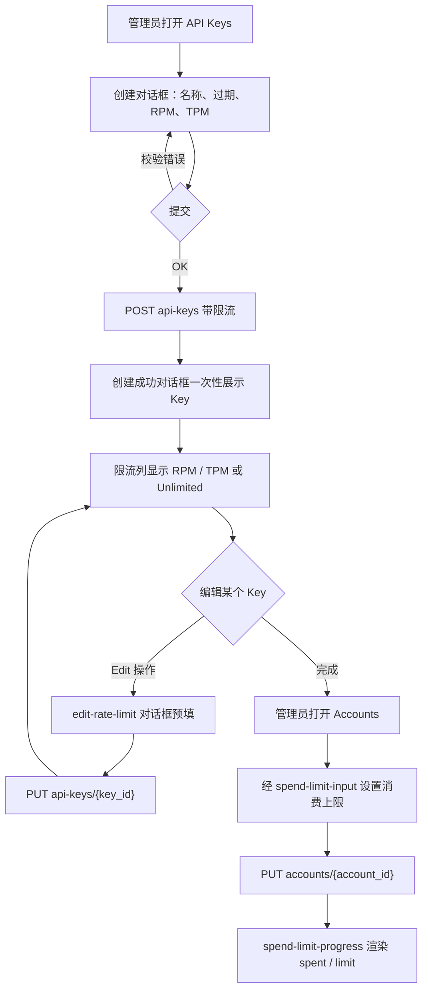
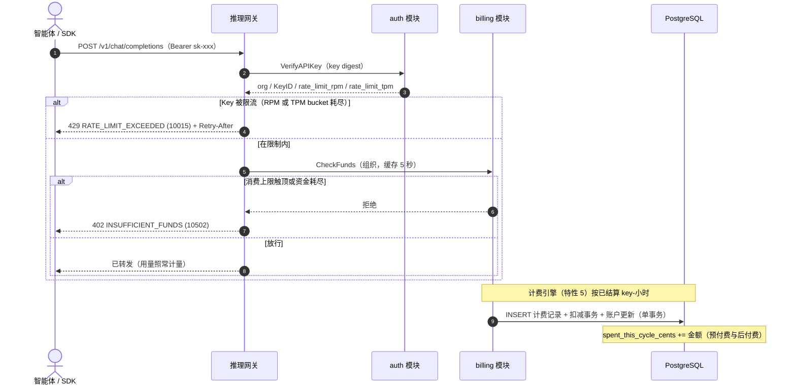

# 按 Key 限流与组织消费上限 — 需求分析与 UI/UX 设计

| 属性 | 内容 |
| --- | --- |
| 特性点 | 按 Key 限流（请求/分钟、token/分钟）与组织消费上限（月度封顶） |
| 文档范围 | 两个增量的需求分析与 UI/UX 设计：**增量 A** — API Key 上的按 Key `rate_limit_rpm` / `rate_limit_tpm`，在数据面网关经 `VerifyAPIKey` 响应执行；**增量 B** — 计费账户上的跨模式 `monthly_spend_limit_cents`，在 `CheckFunds` 中执行。覆盖控制台 API Keys 与 Accounts 页面、API 面与验收标准 |
| 归属模块 | `auth`（Key 限流字段、`UpdateAPIKey`）、`billing`（消费上限字段、`CheckFunds` 执行、结算增量、周期重置）、`infer`（网关执行点）、`metering`（不变）；控制台 Web 应用 |
| 相关文档 | [架构设计](./architecture.zh-cn.md) — 第 2.1 节 `auth`、第 2.6 节 `billing`、第 3.3 节推理网关的 API Key 认证链 · [API Key 生命周期管理](./api-key-management.zh-cn.md) — 被扩展的 `api_keys` 表与 `VerifyAPIKey` · [余额（预付费）与配额（后付费）账户模式](./balance-quota.zh-cn.md) — 被扩展的计费账户、`CheckFunds` 与 10502 · [用量看板与按请求成本归因](./usage-dashboard.zh-cn.md) — 将呈现消费上限进度的余额/配额组件 |
| 状态 | 设计完成，已移交架构师代理 |

---

## 1. 背景与竞品调研

特性 #1–#10 已闭环账务主干：API Key 标识调用方，模型一键部署，每次推理请求都留下防篡改的计量凭证并**按 Key** 每小时结算，价格矩阵把已结算用量转换为计费记录与月度账单，组织拥有每个资源，计费账户以预付费余额或后付费配额管控推理。平台仍做不到的是在**运营者真正掌控的两个边界**上**塑形流量并封顶消费**：**Key**（智能体/SDK 每次请求呈现的单位）与**组织**（拥有资金的那个单位）。今天，一个泄露或失控的 Key 就能驱动无界请求量与无界成本；带配额的后付费组织仍可能在结算的最后一小时内被尖峰打个措手不及；且除了直接吊销 Key，没有任何办法给吵闹的租户限流。本特性新增两个独立、正交的控制：**按 Key 限流**（请求/分钟与 token/分钟，在网关执行）与**组织消费上限**（跨模式月度封顶，在资金检查处执行）。二者可组合：一个 Key 可以在其组织同时被消费封顶时被限流，且任一控制都不改动结算、计费或计量管道。

### 1.1 竞品如何执行限流与消费上限

| 产品 | 按 Key 限流 | 组织消费上限 | 执行点 | 主要陷阱 |
| --- | --- | --- | --- | --- |
| **OpenAI Platform** | 按 Key 的 RPM/TPM 档位（免费/付费）；硬 429 `rate_limit_exceeded` 带 `Retry-After` | 按项目的消费上限；硬停或软警告 | 网关（每 Key token bucket） | 限流错误易与 `insufficient_quota` 混淆；档位调整粗粒度 |
| **Anthropic Console** | 按工作区的用量上限（消费封顶） | 按工作区月度消费封顶 | 网关 | 点数与上限 — 两个概念，不明确标注用户就会混淆 |
| **Together AI** | 按 Key 可配置 RPM/TPM | 账户级消费封顶 | 网关 | 上限是账户级的，放大了爆炸半径 |
| **SiliconFlow** | 按 Key RPM/TPM | 基于余额（预付费） | 网关 | 无独立消费上限 — 余额耗尽即唯一刹车 |
| **百度千帆** | 按 Key QPS 限制 | 后付费月度结算 | 网关 | QPS 与 RPM 混淆；无按 Key token 上限 |
| **阿里云百炼 / 火山方舟** | 按 Key RPM/TPM | 预付费余额 + 后付费配额 | 网关 | 周期中切换模式搅浑账单 |

### 1.2 提炼出的模式与决策

值得采纳的模式：(1) **两个独立的限流维度** — RPM（请求/分钟）与 TPM（token/分钟）是行业标准配对（OpenAI、Together、方舟）；(2) **在网关而非控制面执行** — 数据面已在每次请求调用 `VerifyAPIKey`，因此限流裁决搭该响应返回，无需新增往返；(3) **独立且文档化的 429** — OpenAI 的 `rate_limit_exceeded` 带 `Retry-After` 让 SDK 作者一眼认出，且绝不能与资金错误混淆；(4) **独立于资金的消费上限** — Anthropic 的用量上限与 OpenAI 的项目消费上限是覆盖既有资金之上的安全网，而非第二个余额；(5) **0 = 无上限** — 调研过的产品都把缺失/零上限视为「无限制」，保持默认宽松。

需要避免的陷阱：把限流（429）与资金（402）错误混淆；在数据路径看不到的控制面执行限制；让消费上限与模式绑定（它必须同时封顶预付费与后付费）；以及让限流裁决给热路径增加延迟。

**go-taas 的决策**：

| # | 决策 | 依据 |
| --- | --- | --- |
| D1 | **限流位于 API Key 上**，为 `rate_limit_rpm` 与 `rate_limit_tpm`（int64，**0 = 无上限**），存于 `api_keys` 并由 `VerifyAPIKey` 返回，使网关**无需任何新增数据面往返**即可执行 | Key 是智能体每次请求呈现的单位；网关已调用 `VerifyAPIKey`，因此裁决搭该响应返回（OpenAI/Together 模式） |
| D2 | **执行在数据面网关**（每 Key 一个 token bucket，以 `key_id` 为键），而非控制面；`VerifyAPIKey` 响应携带限制，网关本地应用 | 控制面执行看不到热路径；网关本地 bucket 不增加按请求 RPC，保持数据路径快速（D1） |
| D3 | **限流拒绝为 HTTP 429 带 `Retry-After`**，映射自新错误码 **10015 `CodeRateLimitExceeded`** — 区别于 10502/402 资金 | 行业可识别的错误（OpenAI `rate_limit_exceeded`）；SDK 已遵循 `Retry-After`；绝不与资金混淆 |
| D4 | **新增 `UpdateAPIKey` RPC**（`PUT /api/v1/admin/auth/api-keys/{key_id}`）在创建后编辑 `name`、`expires_at`、`rate_limit_rpm`、`rate_limit_tpm`；它绝不返回明文，也绝不改动密钥 | 竞品不提供就地密钥轮换（api-key D5），但限流与过期必须无需重建 Key 即可调整；明文保持一次性（api-key D2） |
| D5 | **组织消费上限是跨模式月度封顶** — 计费账户上的 `monthly_spend_limit_cents`（int64，**0 = 无上限**），在 `CheckFunds` 中执行，与 `mode` 无关；它**区别于后付费 `monthly_quota_cents`** | 消费上限是覆盖既有资金之上的安全网（Anthropic/OpenAI 模式）；后付费配额是模式专属的记账字段，消费上限是跨模式护栏 — 两个概念、两个字段 |
| D6 | **`spent_this_cycle_cents` 与模式无关** — 结算对预付费与后付费一视同仁地递增它（与模式专属的 `balance_cents` 递减 / `used_this_cycle_cents` 递增并列），既有周期 runner 在 UTC 月度边界重置它 | 消费上限必须封顶总消费，无论其如何被出资；复用既有周期 runner（balance-quota D6）保持单一重置节奏 |
| D7 | **消费上限执行复用 10502 `CodeInsufficientFunds`（HTTP 402）** — 当 `monthly_spend_limit_cents > 0` 且 `spent_this_cycle_cents ≥ monthly_spend_limit_cents` 时，`CheckFunds` 与余额耗尽或配额超限时完全一致地拒绝 | 一个资金错误、一个 SDK 故事；消费上限只是组织本周期资金耗尽的另一个原因 |
| D8 | **限流与消费上限相互独立且可组合** — 一个 Key 可以在其组织被消费封顶时被限流；网关先查限流（429）、再查资金（402），因此被限流的 Key 根本到不了资金检查 | 正交控制；429-先于-402 的顺序与网关既有的「先验证后资金」序列一致 |

## 2. 目标与非目标

**目标**：`api_keys` 上的按 Key `rate_limit_rpm` / `rate_limit_tpm`，由 `VerifyAPIKey` 返回并在网关以 429 + `Retry-After`（10015）执行；新增 `UpdateAPIKey` RPC 以在创建后编辑限流/名称/过期；计费账户上的跨模式 `monthly_spend_limit_cents` 与 `spent_this_cycle_cents`，在 `CheckFunds`（10502/402）中执行并在结算时递增；控制台 API Keys 创建/编辑对话框带 RPM/TPM 字段与限流列，以及 Accounts 消费上限字段带进度条。

**非目标**：按 Key QPS 或并发限制（仅 RPM/TPM）；突发/补充调优或 token-bucket 配置 UI；限流档位或套餐；按模型或按端点的限流；消费上限告警/通知；触顶自动上调或自动充值；按请求冻结（10506 保持预留）；租户自助限制管理（#6/#7 范围）；对结算、计费或计量管道的任何改动，超出消费上限增量之外。

## 3. 用户角色

| 角色 | 描述 | 与限流和消费上限的交互 |
| --- | --- | --- |
| **平台管理员** | 运营集群的人；今天也是控制台用户 | 设置按 Key 限流与组织消费上限，创建后编辑它们，观察消费进度 |
| **组织管理员（未来）** | 租户侧管理员 | 将管理本组织的 Key 与消费上限（按租户范围，#6） |
| **智能体 / SDK** | 程序化消费方 | 当 Key 被限流时体验 429 + `Retry-After`，当组织消费上限触顶时体验 402/10502 |
| **计费管道** | 特性 #5 的计费引擎 | 在结算时与既有扣减并列递增 `spent_this_cycle_cents` |
| **审计者** | 解决消费或限流争议的人 | 经账户与账本把 429 追溯到 Key 的限制、把 402 追溯到组织的消费上限 |

> 术语：消费方调用者称为**智能体**（Agent），与仓库惯例一致。

## 4. 用户旅程

| # | 旅程 | 步骤 |
| --- | --- | --- |
| J1 | **给吵闹的 Key 限流** | 管理员打开 API Keys → 以 RPM/TPM 限制创建 Key → 智能体洪泛 → 网关返回 429 + `Retry-After` → 智能体退避 → 管理员无需重建 Key 即可上调或下调限制 |
| J2 | **封顶组织的月度消费** | 管理员打开 Accounts → 设置月度消费上限 → 消费累计 → 进度条填满 → 触顶时推理返回 402 → 管理员上调上限或等待月度重置 |
| J3 | **两个控制同时生效** | 一个 Key 被限流（429）而其组织被消费封顶（402）→ 网关先返回 429 → 管理员在控制台看到两种状态并调整任一 |
| J4 | **审计一次限流** | 审计者在智能体日志中看到 429 → 打开该 Key → 读取其 RPM/TPM → 与智能体的请求模式比对；402 经账户追溯到组织消费上限 |

## 5. 功能需求与验收标准

### 增量 A — 按 Key 限流

#### FR-A1 — Key 限流字段

- **FR-A1.1** `api_keys` 新增 `rate_limit_rpm` 与 `rate_limit_tpm`（int64，**0 = 无上限**，默认 0）。创建与更新时拒绝负值。
- **FR-A1.2** `CreateAPIKey` 接受可选的 `rate_limit_rpm` / `rate_limit_tpm`；`ListAPIKeys` 与 `VerifyAPIKey` 响应都暴露这两个字段。`VerifyAPIKey` 返回它们，使网关无需第二次调用即可执行（D1）。

#### FR-A2 — 更新 API Key

- **FR-A2.1** 新增 `UpdateAPIKey` RPC（`PUT /api/v1/admin/auth/api-keys/{key_id}`）在创建后编辑 `name`、`expires_at`、`rate_limit_rpm`、`rate_limit_tpm`。它做所有权检查（另一组织的 Key 返回「未找到」）、幂等，且**绝不返回明文或改动密钥**（D4）。
- **FR-A2.2** 把 `expires_at` 更新为过去日期被拒绝；把限流设为 0 即清除它（无上限）。

#### FR-A3 — 网关执行

- **FR-A3.1** 网关为每个 `key_id` 维护一个 token bucket（RPM 与 TPM 相互独立）。每次请求它检查 `VerifyAPIKey` 响应中的限制；超出任一即返回 **HTTP 429 带 `Retry-After`**（到 bucket 补充为止的秒数），映射自 **10015 `CodeRateLimitExceeded`**（D3）。
- **FR-A3.2** 两个限制都为 0（无上限）的 Key 永不被限流；对它的 bucket 检查完全跳过（无热路径成本）。
- **FR-A3.3** 限流检查在资金检查**之前**运行，因此被限流的 Key 到不了 `CheckFunds`（D8）。

### 增量 B — 组织消费上限

#### FR-B1 — 消费上限字段

- **FR-B1.1** 计费账户新增 `monthly_spend_limit_cents`（int64，**0 = 无上限**，默认 0）与 `spent_this_cycle_cents`（int64，默认 0）。拒绝负值。
- **FR-B1.2** `CreateAccount` 与 `UpdateAccount` 接受 `monthly_spend_limit_cents`；`GetAccount` 与 `ListAccounts` 返回这两个字段外加计算出的消费上限使用百分比。`CheckFunds` 读取该限制（D5）。

#### FR-B2 — 执行与结算

- **FR-B2.1** 当 `monthly_spend_limit_cents > 0` 且 `spent_this_cycle_cents ≥ monthly_spend_limit_cents` 时，`CheckFunds` 拒绝，返回 **10502 `CodeInsufficientFunds`（HTTP 402）** — 与余额耗尽或配额超限相同的错误（D7）。该检查与既有资金检查一样按组织缓存（≤ 5 秒）。
- **FR-B2.2** 结算把 `spent_this_cycle_cents` 递增计费金额，**对预付费与后付费一视同仁**，在与既有扣减相同的事务内（D6）；既有周期 runner 在 UTC 月度边界把它重置为 0。

### 控制台流程

#### FR-C1 — 带限流创建 Key

1. 管理员打开 **API Keys**（`/admin/api-keys`）并点击 **Create API Key**。
2. 创建对话框新增 **Rate limit (RPM)** 与 **Rate limit (TPM)** 字段（可选，默认空 = 无上限），与既有名称和过期并列。
3. 提交时 `CreateAPIKey` 携带限制；创建成功对话框不变（一次性密钥展示）。

#### FR-C2 — 编辑 Key 限流

1. 每个 Key 行新增 **Edit** 操作，打开编辑对话框（`edit-rate-limit-{keyId}`），预填名称、过期、RPM 与 TPM 字段。
2. 保存调用 `UpdateAPIKey`；该行的限流列内联刷新。对话框说明密钥不变且永不展示。

#### FR-C3 — 限流列

- API Keys 表新增 **Rate limit** 列，显示 `RPM 100 · TPM 50k` 或 `Unlimited`（两者都为 0）。工具提示解释 429 + `Retry-After` 行为。

#### FR-C4 — 设置组织消费上限

1. 管理员打开 **Accounts**（`/admin/billing/accounts`）并打开 **Set quota** 对话框（或专门的 **Set spend limit** 操作）。
2. 对话框新增 **Monthly spend limit** 字段（`spend-limit-input`，可选，空 = 无上限），区别于后付费配额字段。
3. 保存调用 `UpdateAccount`；账户行以新限制刷新。

#### FR-C5 — 消费进度

- Accounts 列表与详情渲染**消费进度条**（`spend-limit-progress`），显示当前周期的 `spent_this_cycle_cents / monthly_spend_limit_cents`，接近上限为琥珀色、达到/超过为红色；无限制的组织显示「No spend limit」。用量看板组件（特性 #10）呈现同一进度。

### 控制台交互流程

### 结算与准入时序

### 验收标准

| # | 标准 | 验证方式 |
| --- | --- | --- |
| AC-A1 | **带限制创建** — 给定管理员以 `rate_limit_rpm = 100` 与 `rate_limit_tpm = 50000` 创建 Key，当 `CreateAPIKey` 成功时，则存储的 Key 携带两个字段且 `ListAPIKeys`/`VerifyAPIKey` 返回它们；负值被拒绝 | 单元 + FVT |
| AC-A2 | **更新 Key** — 给定既有 Key，当 `UpdateAPIKey`（`PUT .../api-keys/{key_id}`）变更其 RPM/TPM/名称/过期时，则字段持久化且响应不含明文；更新另一组织的 Key 返回「未找到」 | 单元 + FVT |
| AC-A3 | **网关 429** — 给定 `rate_limit_rpm = 1` 的 Key，当同一分钟内到达两个请求时，则第二个返回 HTTP 429 带 `Retry-After` 与码 10015；两个限制都为 0 的 Key 永不被限流 | FVT + E2E |
| AC-A4 | **429 先于 402** — 给定被消费封顶组织上的被限流 Key，当请求到达时，则网关返回 429（限流）且到不了资金检查 | FVT |
| AC-B1 | **设置消费上限** — 给定管理员经 `CreateAccount`/`UpdateAccount` 设置 `monthly_spend_limit_cents = 100000`，当读取账户时，则 `GetAccount`/`ListAccounts` 返回该限制与 `spent_this_cycle_cents`；负值被拒绝 | 单元 + FVT |
| AC-B2 | **在 CheckFunds 执行** — 给定 `spent_this_cycle_cents ≥ monthly_spend_limit_cents` 的组织，当 `CheckFunds` 运行时，则它对预付费与后付费一视同仁地以 10502/402 拒绝；限制为 0 的组织永不被消费封顶 | FVT + E2E |
| AC-B3 | **结算递增** — 给定已结算用量，当计费引擎写入扣减时，则 `spent_this_cycle_cents` 在同一事务内对两种模式递增计费金额；重投的结算事件绝不重复递增 | 单元 + FVT |
| AC-B4 | **周期重置** — 给定周期中触顶的消费上限，当 UTC 月度边界经过时，则周期 runner 把 `spent_this_cycle_cents` 重置为 0 且推理恢复；runner 重试幂等 | 单元 |
| AC-C1 | **控制台创建/编辑** — 给定 API Keys 页面，当管理员以 RPM/TPM 创建 Key 并经 `edit-rate-limit-{keyId}` 编辑它时，则创建对话框（`rate-limit-rpm`、`rate-limit-tpm`）与编辑对话框持久化这些值且限流列内联刷新 | E2E |
| AC-C2 | **控制台消费上限** — 给定 Accounts 页面，当管理员经 `spend-limit-input` 设置消费上限时，则该行渲染 `spend-limit-progress` 显示 spent 对 limit，接近上限为琥珀色、达到/超过为红色；无限制的组织显示「No spend limit」 | E2E |

## 6. 控制台信息架构

导航：**API Keys**（`/admin/api-keys`）与 **Accounts**（`/admin/billing/accounts`）就地升级 — 无新增导航项。

| 页面 / 组件 | 用途 | 关键 testid |
| --- | --- | --- |
| **API Keys 创建对话框** | 名称 + 过期 + RPM/TPM 字段（可选，空 = 无上限） | `rate-limit-rpm`、`rate-limit-tpm` |
| **API Keys 编辑对话框** | 创建后编辑名称、过期、RPM/TPM；说明密钥不变 | `edit-rate-limit-{keyId}` |
| **API Keys 限流列** | `RPM 100 · TPM 50k` 或 `Unlimited`；429 + `Retry-After` 工具提示 | `rate-limit-cell-{keyId}` |
| **Accounts 设置消费上限字段** | 月度消费上限（可选，空 = 无上限），区别于后付费配额 | `spend-limit-input` |
| **Accounts 消费进度条** | 当前周期的 `spent / limit`；接近上限为琥珀色、达到/超过为红色；为 0 时显示「No spend limit」 | `spend-limit-progress` |

空态：Accounts 进度条上的「No spend limit」。颜色语言：限流列中性；消费进度继承 #8 — 接近上限为琥珀色、达到/超过为红色；用量看板组件（特性 #10）复用同一进度。

## 7. API 面

增量 A 属于 **`taas.auth.v1.AuthService`**（proto：`proto/taas/auth/v1/auth.proto`）；增量 B 属于 **`taas.billing.v1.BillingService`**（proto：`proto/taas/billing/v1/billing.proto`），两者都经控制网关以 HTTP 提供，经 `X-Organization-Id` 限定组织范围。proto 变更仅增量。

| RPC | HTTP | 状态 | 用途 |
| --- | --- | --- | --- |
| `CreateAPIKey` | `POST /api/v1/admin/auth/api-keys` | 扩展 | + `rate_limit_rpm`、`rate_limit_tpm`（0 = 无上限） |
| `ListAPIKeys` | `GET /api/v1/admin/auth/api-keys` | 扩展 | + `APIKeySummary` 上的限流字段 |
| `UpdateAPIKey` | `PUT /api/v1/admin/auth/api-keys/{key_id}` | **新增** | 创建后编辑名称、过期、RPM/TPM；绝不返回明文 |
| `VerifyAPIKey` | 仅 gRPC（无 HTTP 映射） | 扩展 | + 供网关执行的限流字段（D1） |
| `CreateAccount` | `POST /api/v1/admin/billing/accounts` | 扩展 | + `monthly_spend_limit_cents` |
| `UpdateAccount` | `PUT /api/v1/admin/billing/accounts/{account_id}` | 扩展 | + `monthly_spend_limit_cents` |
| `GetAccount` | `GET /api/v1/admin/billing/accounts/{account_id}` | 扩展 | + 限制 + `spent_this_cycle_cents` + 使用百分比 |
| `ListAccounts` | `GET /api/v1/admin/billing/accounts` | 扩展 | + 限制 + `spent_this_cycle_cents` |
| `CheckFunds` | 内部 gRPC（无 HTTP 路由） | 扩展 | 执行消费上限（D5、D7） |

契约约束：

1. `rate_limit_rpm` / `rate_limit_tpm` 为 int64，**0 = 无上限**，拒绝负值；`VerifyAPIKey` 必须返回它们，使网关本地执行（D1、D2）。
2. `UpdateAPIKey` 做所有权检查、幂等，且必须绝不返回明文或改动密钥（D4）。
3. `monthly_spend_limit_cents` / `spent_this_cycle_cents` 为 int64 分（JSON 字符串），**0 = 无上限**；`spent_this_cycle_cents` 在线上只读（仅结算写它）。
4. 线格式惯例不变：成功 HTTP 200、业务错误为 `{"code": <int>, "message": "..."}`、int64 分字段序列化为 JSON 字符串。

## 8. 错误码

auth 段 10001–10099 与 billing 段 10501–10599（`pkg/errors/codes.go`）：

| 条件 | 码 | 常量 | 备注 |
| --- | --- | --- | --- |
| Key 限流超限（RPM 或 TPM） | 10015 | `CodeRateLimitExceeded` | **新增**（D3）；HTTP 429 + `Retry-After` |
| 推理被阻断 — 消费上限触顶、余额耗尽，或 `block` 下配额超限 | 10502 | `CodeInsufficientFunds` | **复用**（D7）；HTTP 402 |
| Key 未找到 / `UpdateAPIKey` 上另一组织的 Key | 10004 | `CodeKeyNotFound` | 既有所有权检查 |
| 畸形账户 — 负消费上限 | 10509 | `CodeAccountInvalid` | 既有（balance-quota D10） |
| 数据库 / MQ 基础设施故障 | 500 | `CodeInternal` | 经错误归一化 |

## 9. 指标

- 网关限流检查每请求增加 ≤ 1 ms（本地 token bucket，对无上限 Key 完全跳过 — FR-A3.2）。
- `UpdateAPIKey` p95 ≤ 100 ms（单行更新，无明文材料）。
- 带消费上限执行的 `CheckFunds` 保持在既有每组织 ≤ 5 秒缓存内；无新增数据路径 RPC。
- `spent_this_cycle_cents` 的结算递增是既有扣减事务中的一次列更新 — 零新增事务。
- 控制台创建/编辑对话框与消费进度条从已加载数据渲染，除既有创建/更新外无额外 API 调用。

## 10. 开放问题

| 问题 | 倾向 |
| --- | --- |
| 突发/补充调优或 token-bucket 配置 UI | 未来细化 — v1 交付固定 RPM/TPM bucket（D2） |
| 接近上限的消费上限告警/通知 | 未来特性 — v1 仅呈现进度（FR-C5） |
| 按模型或按端点的限流 | 未来 — v1 仅按 Key |
| 限流档位或套餐 | 未来 — v1 为自由形式 RPM/TPM |
| 租户自助限制管理 | 先做 #6/#7 范围界定 |