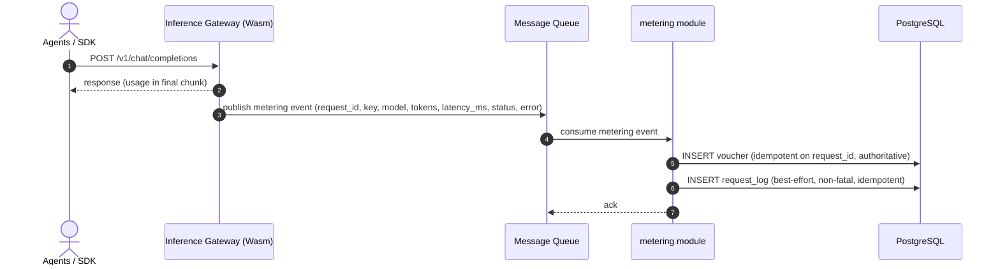
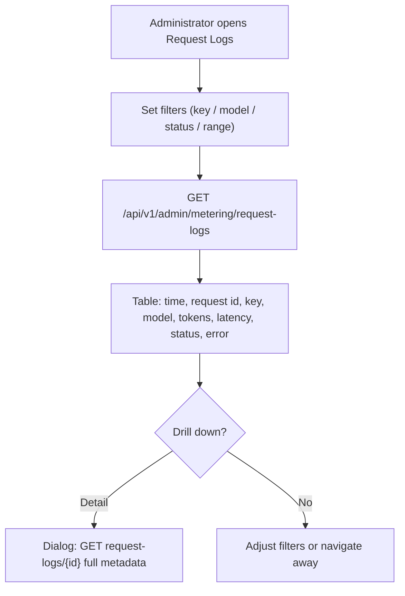
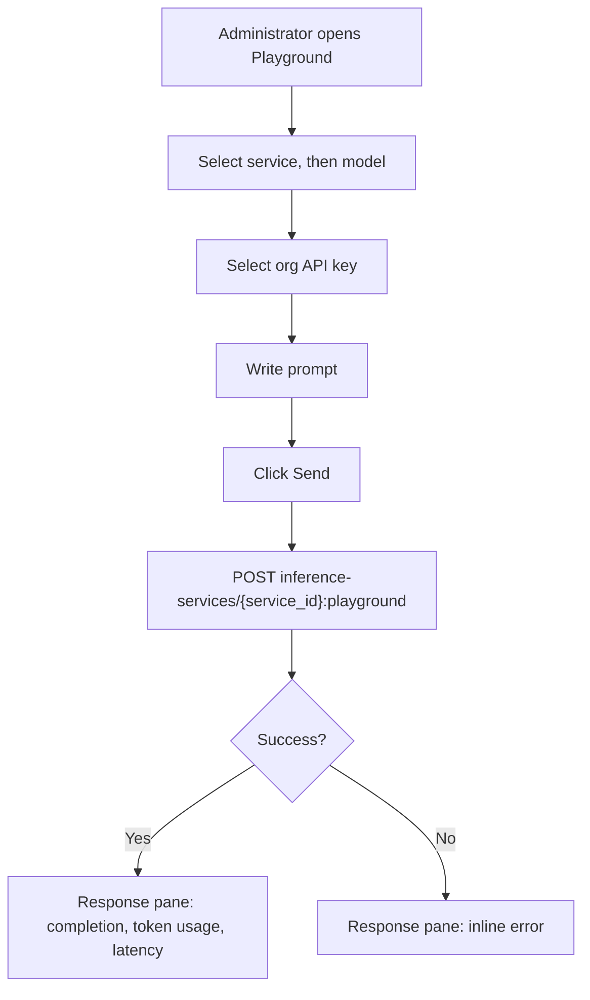

# Request Logs & API Playground — Requirement Analysis and UI/UX Design

| Attribute | Content |
| --- | --- |
| Feature point | Request logs & API playground |
| Document scope | Requirement analysis and UI/UX design for feature-12: the per-request `request_logs` table and its query APIs (Increment A), and the console API playground that sends a test inference through a control-gateway proxy RPC (Increment B), plus acceptance criteria |
| Owning modules | `metering` (request-log capture, list/detail queries), `infer` (playground proxy RPC), console web app; `auth` (API key identity) read-only |
| Related documents | [Architecture Design](./architecture.md) — §2.5 `metering`, §2.6 `billing`, §4.3 the metering/settlement sequence · [Token Metering Vouchers & Async Settlement](./metering.md) — the voucher pipeline this feature extends with request metadata · [Usage Dashboards & Per-Request Cost Attribution](./usage-dashboard.md) — the dashboard that attributes cost; its non-goal names feature-12 as the owner of full request context · [API Key Management](./api-key-management.md) — the key identity on every log row |
| Status | Design complete, handed to the Architect agent |

---

## 1. Background

Features #1–#11 closed the accounting and observability loop: every inference request leaves a tamper-evident metering voucher, hourly settlement aggregates vouchers into usage records, the price matrix turns settled usage into charge records and bills, and the usage dashboard attributes cost per request. What the console still cannot answer is the operator's debugging question — *what actually happened on this request?* The voucher records token counts and identity but not latency, status, or error; the usage dashboard explicitly deferred full request context to this feature. And when an operator wants to try a model or verify a key, there is no in-console way to send a test inference — they must reach for `curl` against the data-plane gateway. This feature delivers both: **Increment A** captures a per-request metadata log (latency, status, error) alongside the existing voucher, queryable and drillable in the console; **Increment B** adds an API playground that sends a test inference through a control-gateway proxy RPC using a selected org API key.

### 1.1 How Comparable Products Expose Request Logs and Playgrounds

| Product | Request logs | Playground / test console | Notable pitfalls |
| --- | --- | --- | --- |
| **OpenAI Platform** | Per-request usage rows in the usage viewer; no full request/response body log | Playground per model with prompt editor, parameters, and token/latency display | Usage lag (minutes) confuses debugging; no body capture by default |
| **Anthropic Console** | Per-request usage viewer (admin workspaces) with token counts | Console playground with model selector, prompt, and streaming response | The per-request viewer is admin-only; members see aggregates only |
| **AWS Bedrock** | Model invocation logs to CloudWatch; optional detailed invocation logging to S3 (opt-in) | Test-invoke panel per model with prompt and parameters | Detailed logging is **off by default** — absent exactly when needed; two consoles for metrics vs logs |
| **Together AI** | Usage history per key; no per-request drill-down | Playground per model with prompt and response | Latency between call and usage appearance is undocumented |
| **SiliconFlow** | Per-request token accounting; no per-request drill-down exposed | Model playground with prompt and parameters | No per-request audit; a disputed charge cannot be traced to requests |
| **Baidu Qianfan / Aliyun Bailian / Volcengine Ark** | Usage statistics per model/service; some per-request detail | In-console model playground with prompt, parameters, and response | Playgrounds often bypass the metered path, so test calls are invisible in usage |

### 1.2 Distilled Patterns and Decisions

Patterns worth adopting: (1) **capture request metadata at the same point as the voucher** — the metering event already carries identity and token counts; extending it with latency/status/error gives a complete per-request record with no new ingestion path; (2) **metadata always written, bodies never** — Bedrock's opt-in detailed logging is the cautionary tale: if capture is optional it is absent when needed, and request/response bodies are a privacy and storage liability; (3) **a playground that goes through the real metered path** — several Chinese platforms' playgrounds bypass metering, so test calls vanish from usage; go-taas's playground must route through the control gateway and produce a real request log; (4) **filterable table + drill-down** — the Stripe/OpenAI pattern of a filterable list that drills into a single record.

Pitfalls to avoid: opt-in logging (Bedrock); capturing bodies in v1 (privacy/storage); a playground that bypasses metering (invisible test calls); coupling request-log writes to the inference hot path (a best-effort, non-fatal write); and conflating request logs with vouchers (different lifecycle, retention, and write path).

**Decisions for go-taas**:

| # | Decision | Rationale |
| --- | --- | --- |
| D1 | **`request_logs` is a separate table from `vouchers`** — same ingestion event, different row, different lifecycle | Vouchers are immutable audit atoms with 90-day retention and settlement coupling; request logs are diagnostic metadata with 30-day retention and no settlement role. Sharing a table would force one lifecycle on both |
| D2 | **The request log is written best-effort and non-fatal** — the metering handler writes the voucher (authoritative) and then attempts the request-log row in the same idempotent handler; a request-log write failure is logged and never fails or retries the voucher | Request logs are diagnostic, not billing evidence; a log write must never jeopardize the authoritative voucher or block ingestion |
| D3 | **No request/response bodies in v1** — the log captures metadata only (identity, model, service, token counts, latency, status, error) | Bodies are a privacy and storage liability and are not needed to answer "what happened on this request"; metadata-only keeps the row small and the 30-day retention cheap. Body capture is deferred (Open Questions) |
| D4 | **30-day retention** for request logs, enforced by a periodic cleanup runner; vouchers keep their 90-day window | Request logs are diagnostic and lose value fast; 30 days bounds storage while covering the debugging window. Retention is configuration, not code |
| D5 | **The playground routes through a control-gateway proxy RPC `PlaygroundInfer`** in the `infer` service, using a selected org API key, and produces a real request log through the normal metered path | The playground must exercise the real inference path so test calls are visible in usage and request logs (the Chinese-platform pitfall); the control gateway keeps the data-plane gateway untouched |
| D6 | **New error codes 10404 `CodeRequestLogRangeInvalid` reuse and 10405 `CodeRequestLogNotFound`** — 10404 is reused for malformed ranges on request-log queries; 10405 is new for unknown `request_log_id` | The 104xx block is reserved for metering; distinct not-found vs invalid-range codes keep API consumers' handling precise, mirroring the metering D9 pattern |
| D7 | **The console gains a Request Logs page and an API Playground page** — the logs page is a filterable table with drill-down; the playground is a three-pane form (service/model selector, prompt editor, response pane) | Both are operator-facing debugging surfaces; they are separate pages because their tasks are distinct (retrospective inspection vs live experimentation) |

### 1.3 Scope Boundary

**In scope (Increment A)**: the `request_logs` table (request_id, org, key, model, service, four token counts, latency_ms, status, error, created_at); extending the metering event with `latency_ms`/`status`/`error`; writing the log alongside the voucher in the same idempotent handler (best-effort, non-fatal); 30-day retention cleanup; `ListRequestLogs` and `GetRequestLog` admin RPCs; the console Request Logs page (filterable table + drill-down).

**In scope (Increment B)**: the `PlaygroundInfer` proxy RPC in the `infer` service; the console API Playground page (three-pane form, response pane with token usage + latency).

**Out of scope** (tracked elsewhere): request/response body capture (deferred — D3); per-request cost on request logs (the usage dashboard already attributes cost on vouchers); end-user (non-admin) request-log visibility (#6/#7 — needs real tenancy); the data-plane gateway's Wasm plugin (a separate deployment; this feature consumes its events and provides the direct RPC for testing); streaming playground responses in v1 (the response pane renders the final completion).

---

## 2. Goals and Non-goals

**Goals (Increment A)**: a `request_logs` table capturing per-request metadata; the metering event extended with `latency_ms`/`status`/`error`; a best-effort, non-fatal log write alongside the voucher in the same idempotent handler; 30-day retention; `ListRequestLogs` (filter by `api_key_id`/`model_id`/`status`/`since`/`until`, 10404 range) and `GetRequestLog` (10405 not-found) admin RPCs; a console Request Logs page with a filterable table and drill-down.

**Goals (Increment B)**: a `PlaygroundInfer` proxy RPC in the `infer` service (`POST /api/v1/admin/inference-services/{service_id}:playground`) that sends a test inference using a selected org API key; a console API Playground page with a three-pane form (service/model selector, prompt editor, response pane showing token usage + latency).

**Non-goals**: request/response body capture (D3 — privacy/storage); per-request cost on request logs (the usage dashboard owns cost attribution); real-time streaming playground responses (v1 renders the final completion); tenant self-service request-log visibility (#6/#7); changes to the voucher, settlement, or charging pipelines (read-only extension of the metering event); new charting or heavy dependencies in the console.

---

## 3. Personas

| Role | Description | Interaction with request logs & playground |
| --- | --- | --- |
| **Platform administrator** | The operator who runs the cluster; today also the console user | Inspects request logs to debug failures and latency, drills into a single request, and uses the playground to test a model or verify a key |
| **Organization administrator (future)** | A tenant-side administrator | Will see their org's request logs and playground (scoped by tenancy, #6) |
| **Agent / SDK** | The programmatic consumer whose calls generate request logs | Never touches these APIs directly; their requests produce log rows via the gateway |
| **Auditor** | Whoever resolves a usage or failure dispute | Uses request logs filtered by key/model/status/range to trace a failure or latency anomaly to individual requests |

> Terminology: the consumer-side caller is called an **Agent** (English) / 「智能体」(Chinese), consistent with the repo convention.

---

## 4. User Journeys

| # | Journey | Steps |
| --- | --- | --- |
| J1 | **Debug a spike** | Admin opens Request Logs → filters by key and a time range → sees a cluster of `error` rows → drills into one → reads the error and latency → identifies the failing model |
| J2 | **Verify a key** | Admin opens the API Playground → selects a service/model → picks an org API key → writes a prompt → sends → sees the response with token usage and latency → confirms the key works |
| J3 | **Latency investigation** | Admin filters request logs by model and sorts by latency → drills into the slowest request → checks the status and error fields |
| J4 | **Playground leaves a trace** | Admin sends a playground request → opens Request Logs → the test call appears as a normal row (D5 — the playground goes through the metered path) |

---

## 5. Feature Requirements and Acceptance Criteria

### Increment A — Request logs

#### FR-A1 — `request_logs` table and event extension

- **FR-A1.1** The metering event gains three additive fields: `latency_ms` (int64), `status` (enum `success`/`error`/`streaming`), and `error` (string, empty on success). The voucher write is unchanged; the request-log write consumes the extended event.
- **FR-A1.2** Each ingested event writes one `request_logs` row: `request_log_id` (UUID v4, primary key), `request_id` (unique index), `organization_id`, `api_key_id`, `model_id`, `service_id` (nullable), `prompt_tokens`, `completion_tokens`, `cached_tokens`, `reasoning_tokens`, `latency_ms`, `status`, `error`, `created_at`.
- **FR-A1.3** The log write is **best-effort and non-fatal** (D2): it happens in the same idempotent handler as the voucher, after the voucher write; a log-write failure is logged and never fails or retries the voucher. Idempotency by `request_id` applies to the log row exactly as to the voucher — a duplicate event writes no second log row.
- **FR-A1.4** Indexes: unique on `request_id`; composite on `(organization_id, created_at)` for the list; composite on `(api_key_id, created_at)` for key-filtered queries; `status` indexed for status filtering.

#### FR-A2 — Retention

- **FR-A2.1** A retention runner (a `server.Runner`, separate ticker from voucher cleanup) deletes request logs whose `created_at` is older than the configured retention (default **30 days**), in batches (default 1000 rows per pass), logging the count (D4).
- **FR-A2.2** Retention never touches vouchers, usage records, or charge records — request logs are the only table with the 30-day window.

#### FR-A3 — Query APIs

- **FR-A3.1** `ListRequestLogs` (`GET /api/v1/admin/metering/request-logs`) returns request logs filtered by `api_key_id`, `model_id`, `status`, and `since`/`until` (unix seconds; defaults `until = now`, `since = until − 24h`), paginated (default 20, cap 100), newest first. `since > until` or a range > 92 days returns 10404.
- **FR-A3.2** `GetRequestLog` (`GET /api/v1/admin/metering/request-logs/{request_log_id}`) returns one request log; unknown ids return 10405.
- **FR-A3.3** Both APIs require the `X-Organization-Id` header and scope every query to it, consistent with the other metering admin APIs.

#### FR-A4 — Console Request Logs page

- **FR-A4.1** A "Request Logs" nav item (`/admin/request-logs`) opens the page: a filter bar (API key, model, status, time range with presets 24 h / 7 d / 30 d / custom) and a table — time, request id, key name, model, service, tokens in/out, latency, status badge, error (truncated).
- **FR-A4.2** A row action "Detail" opens a drill-down dialog (`GetRequestLog`) showing the full metadata: all four token counts, latency, status, error, request id, key, model, service, created_at.
- **FR-A4.3** The page shows a data-freshness note ("request logs appear within the ingestion window") and refreshes on a 60-second poll while visible.
- **FR-A4.4** The empty state reads "No request logs in this range" with a hint that logs appear after the first inference calls.

### Increment B — API playground

#### FR-B1 — `PlaygroundInfer` proxy RPC

- **FR-B1.1** `PlaygroundInfer` (`POST /api/v1/admin/inference-services/{service_id}:playground`) in the `infer` service sends a test inference request through the control gateway using a selected org API key. The request carries `service_id` (path), `api_key_id`, `model_id`, and `prompt`.
- **FR-B1.2** The proxy forwards to the inference path with the selected key's credentials, so the call is metered and produces a real request log (D5). The response returns the completion text plus the token usage and latency.
- **FR-B1.3** An unknown `service_id` or `api_key_id` returns the appropriate not-found error; a failed inference returns the inference error surfaced in the response pane.

#### FR-B2 — Console API Playground page

- **FR-B2.1** A "Playground" nav item (`/admin/playground`) opens a three-pane form: a service/model selector (service dropdown, then model dropdown populated from the service), a prompt editor (textarea), and a response pane.
- **FR-B2.2** The admin selects an org API key from a dropdown (the key whose credentials the proxy uses). The Send button (`playground-send`) is disabled until a service, model, key, and non-empty prompt are chosen.
- **FR-B2.3** On send, the response pane shows the completion text, token usage (in/out/cached/reasoning), and latency; an error renders inline in the pane with the error message.
- **FR-B2.4** The playground is a debugging surface, not a billing surface — it uses the selected key's normal metering and gating (a blocked key surfaces the gating error inline).

### Request Log Capture Sequence

### Request Logs Page Flow

### Playground Flow

### Acceptance criteria

| # | Criterion | Verification |
| --- | --- | --- |
| AC-A1 | **Log written with voucher** — Given a valid metering event carrying `latency_ms`, `status`, and `error`, When the handler ingests it, Then a voucher and a request-log row are both written with the same `request_id`, and the log row carries the extended fields | Unit + FVT |
| AC-A2 | **Idempotency** — Given the same `request_id` ingested twice, When the handler runs, Then the second event writes no second voucher and no second request-log row | Unit |
| AC-A3 | **Best-effort non-fatal** — Given a request-log write failure, When the handler runs, Then the voucher is still written and acknowledged, and the failure is logged without retry | Unit |
| AC-A4 | **List filters** — Given request logs across multiple keys, models, and statuses, When `ListRequestLogs` is called with `api_key_id`, `model_id`, `status`, and a range, Then the rows match every filter, newest first, paginated | FVT |
| AC-A5 | **Get one** — Given a known `request_log_id`, When `GetRequestLog` is called, Then it returns the full metadata; an unknown id returns 10405 | FVT |
| AC-A6 | **Range validation** — Given `since > until` or a range > 92 days, When `ListRequestLogs` is called, Then it returns 10404 | Unit + FVT |
| AC-A7 | **Retention** — Given request logs older than 30 days, When the retention runner runs, Then they are deleted in batches and vouchers/usage records are untouched | Unit |
| AC-A8 | **Console table** — Given the Request Logs page, When it loads with filters, Then the table renders rows with testid `request-log-row-{id}`, the status filter is `request-log-filter-status`, and the empty state shows when no rows match | E2E |
| AC-A9 | **Drill-down** — Given a rendered row, When the admin clicks Detail, Then the dialog (`request-log-detail-{id}`) shows the full metadata from `GetRequestLog` | E2E |
| AC-B1 | **Playground round-trip** — Given a service, model, org key, and prompt selected, When the admin clicks Send, Then `PlaygroundInfer` returns the completion with token usage and latency, and the response pane renders them | FVT + E2E |
| AC-B2 | **Playground leaves a trace** — Given a successful playground request, When the admin opens Request Logs, Then the test call appears as a normal request-log row (D5) | FVT + E2E |
| AC-B3 | **Playground controls** — Given the Playground page, When the admin interacts, Then the service selector is `playground-service-select`, the prompt editor is `playground-prompt-input`, Send is `playground-send`, and Send is disabled until service/model/key/prompt are all set | E2E |
| AC-B4 | **Playground error** — Given a failed inference or a blocked key, When the admin sends, Then the response pane (`playground-response`) renders the error inline | E2E |
| AC-B5 | **Org scoping** — Given two orgs' request logs, When one org's header queries `ListRequestLogs`/`GetRequestLog`, Then it never returns the other org's rows | FVT |

---

## 6. Console Information Architecture

Nav: the **Metering** group gains **Request Logs** (`/admin/request-logs`); a new **Playground** item (`/admin/playground`) sits in the top-level nav.

| Page / component | Purpose | Key testids |
| --- | --- | --- |
| **Request Logs page** (`/admin/request-logs`) | Filter bar (key, model, status, range) + table of request logs with status badges and latency | `request-logs-table`, `request-log-row-{id}`, `request-log-filter-status`, `request-log-filter-key`, `request-log-filter-model`, `request-log-filter-range` |
| **Request log detail dialog** | Full metadata for one request via `GetRequestLog` | `request-log-detail-{id}` |
| **Playground page** (`/admin/playground`) | Three-pane form: service/model selector, prompt editor, response pane | `playground-service-select`, `playground-model-select`, `playground-key-select`, `playground-prompt-input`, `playground-send`, `playground-response` |

Empty states: "No request logs in this range" (logs page); the playground's response pane starts empty with a hint to select a service and write a prompt. Color language: status badges — success = green, error = red, streaming = blue; latency is a plain numeric column.

---

## 7. API Surface

### Increment A — request-log queries

All belong to **`taas.metering.v1.MeteringService`** (proto: `proto/taas/metering/v1/metering.proto`), served as HTTP via the Control Gateway, org-scoped via `X-Organization-Id`. Proto changes are additive.

| RPC | HTTP | Status | Purpose |
| --- | --- | --- | --- |
| `ListRequestLogs` | `GET /api/v1/admin/metering/request-logs` | **new** | Filterable request-log list (`api_key_id`, `model_id`, `status`, `since`/`until`) |
| `GetRequestLog` | `GET /api/v1/admin/metering/request-logs/{request_log_id}` | **new** | One request log for drill-down; unknown id returns 10405 |

Constraints on the contract:

1. `ListRequestLogs` validates `since`/`until` (int64 unix seconds; defaults `until = now`, `since = until − 24h`); `since > until` or a range > 92 days returns 10404. `status` is an enum (`success`/`error`/`streaming`); an unrecognized value fails standard request validation.
2. `RequestLog` rows carry `request_log_id`, `request_id`, `api_key_id`, `model_id`, `service_id` (empty when unknown), the four token counts, `latency_ms`, `status`, `error`, `created_at` — the complete metadata view without a second call.
3. Wire conventions unchanged: dotted pagination, HTTP 200 on success, business errors as `{"code": <int>, "message": "..."}`, int64 fields serialized as JSON strings.

### Increment B — playground proxy

Belongs to **`taas.infer.v1.InferService`** (proto: `proto/taas/infer/v1/infer.proto`), served as HTTP via the Control Gateway.

| RPC | HTTP | Status | Purpose |
| --- | --- | --- | --- |
| `PlaygroundInfer` | `POST /api/v1/admin/inference-services/{service_id}:playground` | **new** | Send a test inference using a selected org API key; returns completion, token usage, latency |

Constraints on the contract:

1. `PlaygroundInfer` takes `service_id` (path), `api_key_id`, `model_id`, and `prompt`; it forwards with the selected key's credentials so the call is metered and logged (D5).
2. The response carries the completion text, the four token counts, and `latency_ms`; an inference failure surfaces the error in the response.
3. An unknown `service_id` or `api_key_id` returns the appropriate not-found error; a blocked key surfaces the gating error (10502/402) inline.

---

## 8. Error Codes

Metering range 10401–10499 (`pkg/errors/codes.go`):

| Condition | Code | Constant | Notes |
| --- | --- | --- | --- |
| Malformed time range on `ListRequestLogs` (`since > until`, range > 92 days) | 10404 | `CodeMeteringRangeInvalid` | **Reused** — the request-log queries join the uniform metering range contract |
| Unknown `request_log_id` on `GetRequestLog` | 10405 | `CodeRequestLogNotFound` | **New** (D6) |
| Unknown `service_id` / `api_key_id` on `PlaygroundInfer` | existing not-found codes | existing | Reused from the infer/auth modules |
| Inference blocked by funds/quota on `PlaygroundInfer` | 10502 | `CodeInsufficientFunds` | Existing; surfaced inline in the response pane |
| Database / MQ infrastructure failure | 500 | `CodeInternal` | Via error normalization |

---

## 9. Open Questions

| Question | Leaning |
| --- | --- |
| Request/response body capture for deep debugging | Deferred (D3) — revisit only if metadata-only logs prove insufficient; would need explicit privacy and storage design |
| Streaming playground responses (render tokens as they arrive) | Future refinement — v1 renders the final completion |
| Playground parameter controls (temperature, max tokens, etc.) | Future enhancement — v1 sends a plain prompt |
| Tenant self-service request-log visibility and playground | Features #6/#7 scoping first |
| Server-side export of request logs (CSV/JSON) for large audits | Future console enhancement — v1 offers the filterable table and drill-down |