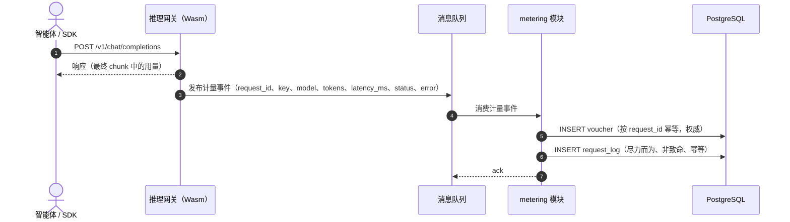
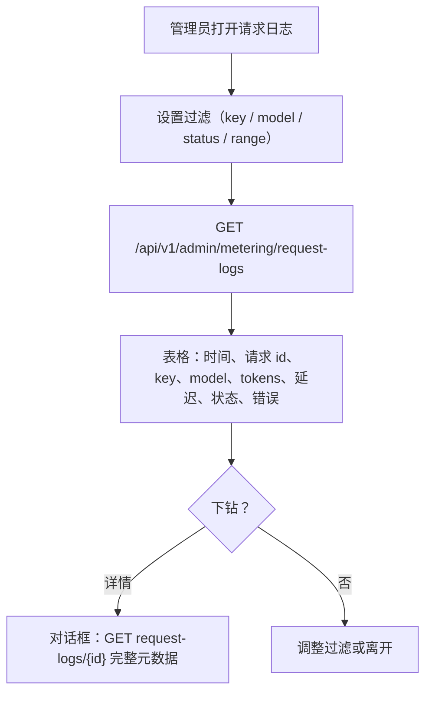
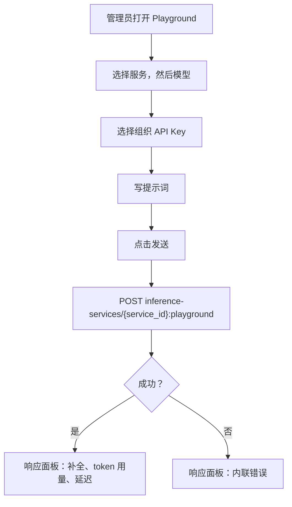

# 请求日志与 API Playground — 需求分析与 UI/UX 设计

| 属性 | 内容 |
| --- | --- |
| 特性点 | 请求日志与 API Playground |
| 文档范围 | 特性-12 的需求分析与 UI/UX 设计：按请求的 `request_logs` 表及其查询 API（增量 A），以及控制台 API Playground — 经控制网关代理 RPC 发送一次测试推理（增量 B），外加验收标准 |
| 归属模块 | `metering`（请求日志采集、列表/详情查询），`infer`（playground 代理 RPC），控制台 Web 应用；`auth`（API Key 身份）只读 |
| 相关文档 | [架构设计](./architecture.zh-cn.md) — 第 2.5 节 `metering`、第 2.6 节 `billing`、第 4.3 节计量/结算时序 · [Token 计量凭证与异步结算](./metering.zh-cn.md) — 本特性以请求元数据扩展的凭证管道 · [用量仪表盘与按请求成本归因](./usage-dashboard.zh-cn.md) — 归因成本的仪表盘；其非目标将完整请求上下文的所有权交给特性-12 · [API Key 管理](./api-key-management.zh-cn.md) — 每条日志行上的 Key 身份 |
| 状态 | 设计完成，已移交架构师代理 |

---

## 1. 背景与竞品调研

特性 #1–#11 已闭环账务与可观测性：每次推理请求都留下防篡改的计量凭证，小时级结算把凭证聚合成用量记录，价格矩阵把已结算用量转换为计费记录与账单，用量仪表盘按请求归因成本。控制台仍回答不了运营者的调试问题 — *这次请求到底发生了什么？* 凭证记录的是 token 数与身份，而非延迟、状态或错误；用量仪表盘明确把完整请求上下文延后至此特性。而当运营者想试一个模型或验证一把 Key 时，控制台内没有任何方式发送测试推理 — 他们只能对数据面网关用 `curl`。本特性两者都交付：**增量 A** 在既有凭证之外采集按请求的元数据日志（延迟、状态、错误），可在控制台查询与下钻；**增量 B** 新增一个 API Playground，用所选组织 API Key 经控制网关代理 RPC 发送一次测试推理。

### 1.1 竞品如何暴露请求日志与 Playground

| 产品 | 请求日志 | Playground / 测试控制台 | 主要陷阱 |
| --- | --- | --- | --- |
| **OpenAI Platform** | 用量查看器中的按请求用量行；无完整请求/响应体日志 | 每模型 Playground，带提示词编辑器、参数与 token/延迟展示 | 用量延迟（分钟级）让调试困惑；默认不采集请求体 |
| **Anthropic Console** | 按请求用量查看器（管理工作区）带 token 数 | 控制台 Playground，带模型选择器、提示词与流式响应 | 按请求查看器仅管理员可用；成员只见聚合 |
| **AWS Bedrock** | 模型调用日志写入 CloudWatch；可选详细调用日志写入 S3（opt-in） | 每模型测试调用面板，带提示词与参数 | 详细日志**默认关闭** — 恰恰在需要时缺失；指标与日志分属两个控制台 |
| **Together AI** | 每 Key 用量历史；无按请求下钻 | 每模型 Playground，带提示词与响应 | 调用与用量出现之间的延迟未文档化 |
| **SiliconFlow** | 按请求 token 核算；未暴露按请求下钻 | 模型 Playground，带提示词与参数 | 无按请求审计；有争议的扣费无法追溯到请求 |
| **百度千帆 / 阿里云百炼 / 火山方舟** | 按模型/服务的用量统计；部分按请求详情 | 控制台内模型 Playground，带提示词、参数与响应 | Playground 常绕过计量路径，测试调用在用量中不可见 |

### 1.2 提炼出的模式与决策

值得采纳的模式：(1) **在与凭证相同的点采集请求元数据** — 计量事件已携带身份与 token 数；以延迟/状态/错误扩展它，即可得到完整的按请求记录，且无需新的摄取路径；(2) **元数据始终写入、请求体永不写入** — Bedrock 的 opt-in 详细日志是前车之鉴：若采集是可选的，它就会在需要时缺失，而请求/响应体是隐私与存储负担；(3) **走真实计量路径的 Playground** — 多家中国平台的 Playground 绕过计量，测试调用从用量中消失；go-taas 的 Playground 必须经控制网关路由并产生真实请求日志；(4) **可过滤表格 + 下钻** — Stripe/OpenAI 的可过滤列表下钻到单条记录的模式。

需要避免的陷阱：opt-in 日志（Bedrock）；v1 采集请求体（隐私/存储）；绕过计量的 Playground（测试调用不可见）；把请求日志写入耦合到推理热路径（尽力而为、非致命写入）；把请求日志与凭证混为一谈（生命周期、保留期与写入路径都不同）。

**go-taas 的决策**：

| # | 决策 | 依据 |
| --- | --- | --- |
| D1 | **`request_logs` 是与 `vouchers` 分离的表** — 同一摄取事件、不同行、不同生命周期 | 凭证是不可变的审计原子，90 天保留期且与结算耦合；请求日志是诊断元数据，30 天保留期且无结算角色。共用一张表会迫使两者共享同一生命周期 |
| D2 | **请求日志尽力而为、非致命写入** — 计量处理器写入凭证（权威）后，在同一幂等处理器内尝试写入请求日志行；请求日志写入失败仅记录日志，绝不失败或重试凭证 | 请求日志是诊断而非计费证据；日志写入绝不能危及权威凭证或阻塞摄取 |
| D3 | **v1 不采集请求/响应体** — 日志仅采集元数据（身份、模型、服务、token 数、延迟、状态、错误） | 请求体是隐私与存储负担，且回答「这次请求发生了什么」并不需要它；仅元数据让行保持小巧、30 天保留期廉价。请求体采集延后（开放问题） |
| D4 | **请求日志 30 天保留期**，由周期性清理 runner 执行；凭证保持其 90 天窗口 | 请求日志是诊断性的，价值衰减快；30 天在覆盖调试窗口的同时约束存储。保留期是配置而非代码 |
| D5 | **Playground 经 `infer` 服务中的控制网关代理 RPC `PlaygroundInfer` 路由**，使用所选组织 API Key，并经正常计量路径产生真实请求日志 | Playground 必须走真实推理路径，使测试调用在用量与请求日志中可见（中国平台陷阱）；控制网关让数据面网关保持不动 |
| D6 | **新错误码 10404 `CodeRequestLogRangeInvalid` 复用与 10405 `CodeRequestLogNotFound`** — 10404 复用于请求日志查询上的畸形范围；10405 为未知 `request_log_id` 新增 | 104xx 段预留给 metering；区分未找到与范围无效让 API 消费方的处理更精确，镜像 metering D9 模式 |
| D7 | **控制台新增请求日志页与 API Playground 页** — 日志页是可过滤表格带下钻；Playground 是三栏表单（服务/模型选择器、提示词编辑器、响应面板） | 两者都是面向运营者的调试界面；它们是独立页面，因为任务不同（回顾式检查 vs 实时实验） |

### 1.3 范围边界

**范围内（增量 A）**：`request_logs` 表（request_id、org、key、model、service、四个 token 数、latency_ms、status、error、created_at）；以 `latency_ms`/`status`/`error` 扩展计量事件；在同一幂等处理器内与凭证一起写入日志（尽力而为、非致命）；30 天保留期清理；`ListRequestLogs` 与 `GetRequestLog` 管理端 RPC；控制台请求日志页（可过滤表格 + 下钻）。

**范围内（增量 B）**：`infer` 服务中的 `PlaygroundInfer` 代理 RPC；控制台 API Playground 页（三栏表单、带 token 用量 + 延迟的响应面板）。

**范围外**（另行跟踪）：请求/响应体采集（延后 — D3）；请求日志上的按请求成本（用量仪表盘已在凭证上归因成本）；终端用户（非管理员）的请求日志可见性（#6/#7 — 需要真实租户）；数据面网关的 Wasm 插件（独立部署；本特性消费其事件并提供用于测试的直接 RPC）；v1 的流式 Playground 响应（响应面板渲染最终补全）。

---

## 2. 目标与非目标

**目标（增量 A）**：采集按请求元数据的 `request_logs` 表；以 `latency_ms`/`status`/`error` 扩展计量事件；在同一幂等处理器内与凭证一起尽力而为、非致命地写入日志；30 天保留期；`ListRequestLogs`（按 `api_key_id`/`model_id`/`status`/`since`/`until` 过滤，10404 范围）与 `GetRequestLog`（10405 未找到）管理端 RPC；带可过滤表格与下钻的控制台请求日志页。

**目标（增量 B）**：`infer` 服务中的 `PlaygroundInfer` 代理 RPC（`POST /api/v1/admin/inference-services/{service_id}:playground`），用所选组织 API Key 发送测试推理；带三栏表单（服务/模型选择器、提示词编辑器、显示 token 用量 + 延迟的响应面板）的控制台 API Playground 页。

**非目标**：请求/响应体采集（D3 — 隐私/存储）；请求日志上的按请求成本（用量仪表盘拥有成本归因）；实时流式 Playground 响应（v1 渲染最终补全）；租户自助请求日志可见性（#6/#7）；对凭证、结算或计费管道的改动（计量事件的只读扩展）；控制台新增图表或重型依赖。

---

## 3. 用户角色

| 角色 | 描述 | 与请求日志 & Playground 的交互 |
| --- | --- | --- |
| **平台管理员** | 运营集群的人；今天也是控制台用户 | 检查请求日志以调试失败与延迟，下钻单条请求，并用 Playground 测试模型或验证 Key |
| **组织管理员（未来）** | 租户侧管理员 | 将看到本组织的请求日志与 Playground（按租户范围，#6） |
| **智能体 / SDK** | 其调用产生请求日志的程序化消费方 | 绝不直接触碰这些 API；其请求经网关产生日志行 |
| **审计者** | 解决用量或失败争议的人 | 用按 key/model/status/range 过滤的请求日志把失败或延迟异常追溯到单条请求 |

> 术语：消费方调用者称为**智能体**（Agent），与仓库惯例一致。

---

## 4. 用户旅程

| # | 旅程 | 步骤 |
| --- | --- | --- |
| J1 | **调试尖峰** | 管理员打开请求日志 → 按 Key 与时间范围过滤 → 看到一簇 `error` 行 → 下钻一条 → 读取错误与延迟 → 定位出故障模型 |
| J2 | **验证 Key** | 管理员打开 API Playground → 选择服务/模型 → 选一把组织 API Key → 写提示词 → 发送 → 看到带 token 用量与延迟的响应 → 确认 Key 可用 |
| J3 | **延迟调查** | 管理员按模型过滤请求日志并按延迟排序 → 下钻最慢的请求 → 检查状态与错误字段 |
| J4 | **Playground 留下痕迹** | 管理员发送一次 Playground 请求 → 打开请求日志 → 测试调用作为普通行出现（D5 — Playground 走计量路径） |

---

## 5. 功能需求与验收标准

### 增量 A — 请求日志

#### FR-A1 — `request_logs` 表与事件扩展

- **FR-A1.1** 计量事件新增三个加性字段：`latency_ms`（int64）、`status`（枚举 `success`/`error`/`streaming`）与 `error`（string，成功时为空）。凭证写入不变；请求日志写入消费扩展后的事件。
- **FR-A1.2** 每条摄取事件写入一行 `request_logs`：`request_log_id`（UUID v4，主键）、`request_id`（唯一索引）、`organization_id`、`api_key_id`、`model_id`、`service_id`（可空）、`prompt_tokens`、`completion_tokens`、`cached_tokens`、`reasoning_tokens`、`latency_ms`、`status`、`error`、`created_at`。
- **FR-A1.3** 日志写入**尽力而为、非致命**（D2）：发生在与凭证相同的幂等处理器内、凭证写入之后；日志写入失败仅记录日志，绝不失败或重试凭证。按 `request_id` 的幂等性对日志行与凭证完全一致 — 重复事件不写第二行日志。
- **FR-A1.4** 索引：`request_id` 唯一；`(organization_id, created_at)` 复合用于列表；`(api_key_id, created_at)` 复合用于按 Key 过滤的查询；`status` 建索引用于状态过滤。

#### FR-A2 — 保留期

- **FR-A2.1** 保留期 runner（一个 `server.Runner`，与凭证清理分离的 ticker）删除 `created_at` 早于配置保留期（默认 **30 天**）的请求日志，分批（默认每轮 1000 行），记录删除数量（D4）。
- **FR-A2.2** 保留期绝不触碰凭证、用量记录或计费记录 — 请求日志是唯一带 30 天窗口的表。

#### FR-A3 — 查询 API

- **FR-A3.1** `ListRequestLogs`（`GET /api/v1/admin/metering/request-logs`）返回按 `api_key_id`、`model_id`、`status` 与 `since`/`until`（unix 秒；默认 `until = now`、`since = until − 24h`）过滤的请求日志，分页（默认 20，上限 100），最新在前。`since > until` 或范围 > 92 天返回 10404。
- **FR-A3.2** `GetRequestLog`（`GET /api/v1/admin/metering/request-logs/{request_log_id}`）返回一条请求日志；未知 id 返回 10405。
- **FR-A3.3** 两个 API 都要求 `X-Organization-Id` 请求头，并把每条查询限定到该组织，与其他 metering 管理端 API 一致。

#### FR-A4 — 控制台请求日志页

- **FR-A4.1** 导航项「请求日志」（`/admin/request-logs`）打开该页：过滤栏（API Key、模型、状态、带 24 小时 / 7 天 / 30 天 / 自定义预设的时间范围）与表格 — 时间、请求 id、Key 名、模型、服务、token 入/出、延迟、状态徽标、错误（截断）。
- **FR-A4.2** 行操作「详情」打开下钻对话框（`GetRequestLog`），显示完整元数据：全部四个 token 数、延迟、状态、错误、请求 id、Key、模型、服务、created_at。
- **FR-A4.3** 页面显示数据新鲜度提示（「请求日志在摄取窗口内出现」），并在可见时按 60 秒轮询刷新。
- **FR-A4.4** 空态文案为「该范围内暂无请求日志」，并提示日志在首次推理调用后出现。

### 增量 B — API Playground

#### FR-B1 — `PlaygroundInfer` 代理 RPC

- **FR-B1.1** `infer` 服务中的 `PlaygroundInfer`（`POST /api/v1/admin/inference-services/{service_id}:playground`）用所选组织 API Key 经控制网关发送一次测试推理请求。请求携带 `service_id`（路径）、`api_key_id`、`model_id` 与 `prompt`。
- **FR-B1.2** 代理以所选 Key 的凭据转发到推理路径，使调用被计量并产生真实请求日志（D5）。响应返回补全文本外加 token 用量与延迟。
- **FR-B1.3** 未知 `service_id` 或 `api_key_id` 返回相应的未找到错误；失败的推理在响应面板中浮出推理错误。

#### FR-B2 — 控制台 API Playground 页

- **FR-B2.1** 导航项「Playground」（`/admin/playground`）打开三栏表单：服务/模型选择器（服务下拉，随后按服务填充的模型下拉）、提示词编辑器（textarea）与响应面板。
- **FR-B2.2** 管理员从下拉选择一把组织 API Key（代理使用其凭据的 Key）。发送按钮（`playground-send`）在服务、模型、Key 与非空提示词都选定前保持禁用。
- **FR-B2.3** 发送后，响应面板显示补全文本、token 用量（入/出/缓存/推理）与延迟；错误在面板内联渲染错误消息。
- **FR-B2.4** Playground 是调试界面而非计费界面 — 它使用所选 Key 的正常计量与准入（被阻断的 Key 在面板内联浮出准入错误）。

### 请求日志采集时序

### 请求日志页流程

### Playground 流程

### 验收标准

| # | 标准 | 验证方式 |
| --- | --- | --- |
| AC-A1 | **日志与凭证一起写入** — 给定携带 `latency_ms`、`status` 与 `error` 的有效计量事件，当处理器摄取它时，则凭证与请求日志行都以同一 `request_id` 写入，且日志行携带扩展字段 | 单元 + FVT |
| AC-A2 | **幂等性** — 给定同一 `request_id` 摄取两次，当处理器运行时，则第二次事件不写第二个凭证、也不写第二行请求日志 | 单元 |
| AC-A3 | **尽力而为、非致命** — 给定请求日志写入失败，当处理器运行时，则凭证仍被写入并确认，失败被记录且不重试 | 单元 |
| AC-A4 | **列表过滤** — 给定跨多个 key、模型与状态的请求日志，当以 `api_key_id`、`model_id`、`status` 与范围调用 `ListRequestLogs` 时，则行匹配每个过滤、最新在前、分页 | FVT |
| AC-A5 | **取单条** — 给定已知 `request_log_id`，当调用 `GetRequestLog` 时，则返回完整元数据；未知 id 返回 10405 | FVT |
| AC-A6 | **范围校验** — 给定 `since > until` 或范围 > 92 天，当调用 `ListRequestLogs` 时，则返回 10404 | 单元 + FVT |
| AC-A7 | **保留期** — 给定早于 30 天的请求日志，当保留期 runner 运行时，则它们被分批删除，且凭证/用量记录不受触碰 | 单元 |
| AC-A8 | **控制台表格** — 给定请求日志页，当带过滤加载时，则表格渲染 testid 为 `request-log-row-{id}` 的行，状态过滤为 `request-log-filter-status`，无匹配行时显示空态 | E2E |
| AC-A9 | **下钻** — 给定已渲染的行，当管理员点击详情时，则对话框（`request-log-detail-{id}`）显示来自 `GetRequestLog` 的完整元数据 | E2E |
| AC-B1 | **Playground 往返** — 给定已选服务、模型、组织 Key 与提示词，当管理员点击发送时，则 `PlaygroundInfer` 返回带 token 用量与延迟的补全，且响应面板渲染它们 | FVT + E2E |
| AC-B2 | **Playground 留下痕迹** — 给定一次成功的 Playground 请求，当管理员打开请求日志时，则测试调用作为普通请求日志行出现（D5） | FVT + E2E |
| AC-B3 | **Playground 控件** — 给定 Playground 页，当管理员交互时，则服务选择器为 `playground-service-select`，提示词编辑器为 `playground-prompt-input`，发送为 `playground-send`，且发送在服务/模型/Key/提示词全部就绪前保持禁用 | E2E |
| AC-B4 | **Playground 错误** — 给定失败的推理或被阻断的 Key，当管理员发送时，则响应面板（`playground-response`）内联渲染错误 | E2E |
| AC-B5 | **组织范围** — 给定两个组织的请求日志，当一个组织的请求头查询 `ListRequestLogs`/`GetRequestLog` 时，则绝不返回另一组织的行 | FVT |

---

## 6. 控制台信息架构

导航：**Metering** 分组新增**「请求日志」**（`/admin/request-logs`）；顶层导航新增**「Playground」**项（`/admin/playground`）。

| 页面 / 组件 | 用途 | 关键 testid |
| --- | --- | --- |
| **请求日志页**（`/admin/request-logs`） | 过滤栏（key、model、status、range）+ 带状态徽标与延迟的请求日志表格 | `request-logs-table`、`request-log-row-{id}`、`request-log-filter-status`、`request-log-filter-key`、`request-log-filter-model`、`request-log-filter-range` |
| **请求日志详情对话框** | 经 `GetRequestLog` 查看单条请求的完整元数据 | `request-log-detail-{id}` |
| **Playground 页**（`/admin/playground`） | 三栏表单：服务/模型选择器、提示词编辑器、响应面板 | `playground-service-select`、`playground-model-select`、`playground-key-select`、`playground-prompt-input`、`playground-send`、`playground-response` |

空态：「该范围内暂无请求日志」（日志页）；Playground 的响应面板初始为空，带选择服务并写提示词的提示。颜色语言：状态徽标 — success = 绿色、error = 红色、streaming = 蓝色；延迟为普通数字列。

---

## 7. API 面

### 增量 A — 请求日志查询

全部属于 **`taas.metering.v1.MeteringService`**（proto：`proto/taas/metering/v1/metering.proto`），经控制网关以 HTTP 提供，经 `X-Organization-Id` 限定组织范围。proto 变更仅增量。

| RPC | HTTP | 状态 | 用途 |
| --- | --- | --- | --- |
| `ListRequestLogs` | `GET /api/v1/admin/metering/request-logs` | **新增** | 可过滤的请求日志列表（`api_key_id`、`model_id`、`status`、`since`/`until`） |
| `GetRequestLog` | `GET /api/v1/admin/metering/request-logs/{request_log_id}` | **新增** | 用于下钻的单条请求日志；未知 id 返回 10405 |

契约约束：

1. `ListRequestLogs` 校验 `since`/`until`（int64 unix 秒；默认 `until = now`、`since = until − 24h`）；`since > until` 或范围 > 92 天返回 10404。`status` 是枚举（`success`/`error`/`streaming`）；无法识别的值失败于标准请求校验。
2. `RequestLog` 行携带 `request_log_id`、`request_id`、`api_key_id`、`model_id`、`service_id`（未知时为空）、四个 token 数、`latency_ms`、`status`、`error`、`created_at` — 无需二次调用即可获得完整元数据视图。
3. 线格式惯例不变：点分分页、成功 HTTP 200、业务错误为 `{"code": <int>, "message": "..."}`、int64 字段序列化为 JSON 字符串。

### 增量 B — Playground 代理

属于 **`taas.infer.v1.InferService`**（proto：`proto/taas/infer/v1/infer.proto`），经控制网关以 HTTP 提供。

| RPC | HTTP | 状态 | 用途 |
| --- | --- | --- | --- |
| `PlaygroundInfer` | `POST /api/v1/admin/inference-services/{service_id}:playground` | **新增** | 用所选组织 API Key 发送测试推理；返回补全、token 用量、延迟 |

契约约束：

1. `PlaygroundInfer` 接收 `service_id`（路径）、`api_key_id`、`model_id` 与 `prompt`；以所选 Key 的凭据转发，使调用被计量并记录（D5）。
2. 响应携带补全文本、四个 token 数与 `latency_ms`；推理失败在响应中浮出错误。
3. 未知 `service_id` 或 `api_key_id` 返回相应的未找到错误；被阻断的 Key 浮出准入错误（10502/402）内联。

---

## 8. 错误码

metering 段 10401–10499（`pkg/errors/codes.go`）：

| 条件 | 码 | 常量 | 备注 |
| --- | --- | --- | --- |
| `ListRequestLogs` 上畸形时间范围（`since > until`、范围 > 92 天） | 10404 | `CodeMeteringRangeInvalid` | **复用** — 请求日志查询加入统一的 metering 范围契约 |
| `GetRequestLog` 上未知 `request_log_id` | 10405 | `CodeRequestLogNotFound` | **新增**（D6） |
| `PlaygroundInfer` 上未知 `service_id` / `api_key_id` | 既有未找到码 | 既有 | 复用自 infer/auth 模块 |
| `PlaygroundInfer` 上推理被资金/配额阻断 | 10502 | `CodeInsufficientFunds` | 既有；在响应面板内联浮出 |
| 数据库 / MQ 基础设施故障 | 500 | `CodeInternal` | 经错误归一化 |

---

## 9. 开放问题

| 问题 | 倾向 |
| --- | --- |
| 深度调试的请求/响应体采集 | 延后（D3）— 仅当仅元数据日志被证明不足时再重访；需要显式的隐私与存储设计 |
| 流式 Playground 响应（token 到达即渲染） | 未来细化 — v1 渲染最终补全 |
| Playground 参数控件（temperature、max tokens 等） | 未来增强 — v1 发送纯提示词 |
| 租户自助请求日志可见性与 Playground | 先做 #6/#7 范围界定 |
| 大规模审计的请求日志服务端导出（CSV/JSON） | 未来控制台增强 — v1 提供可过滤表格与下钻 |