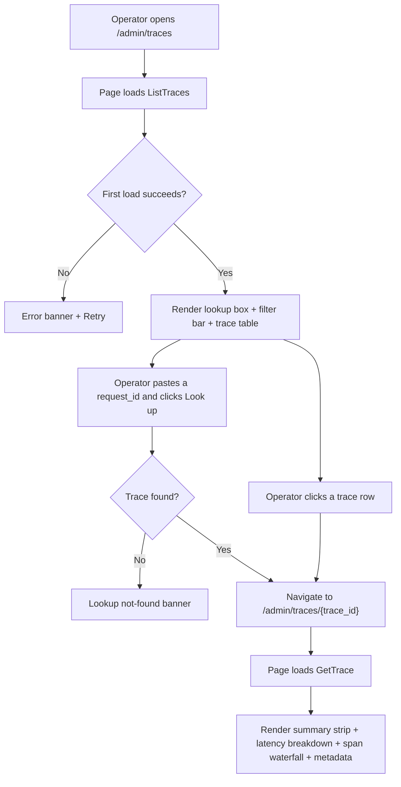
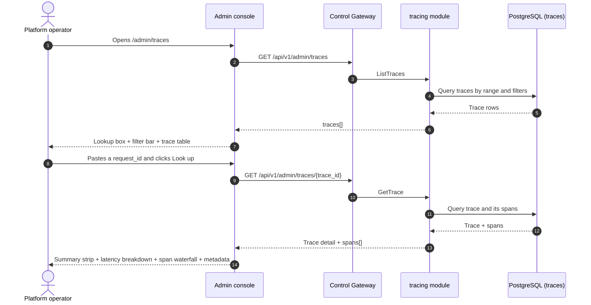

# Request Tracing & Latency Breakdown — Requirement Analysis and UI/UX Design

| Attribute | Content |
| --- | --- |
| Feature point | Request tracing & latency breakdown — drill into individual inference requests end-to-end (request → gateway → inference service) with a trace detail view, per-phase latency breakdown (TTFT, generation, total), status/error attribution, and request-id lookup (backlog row 27) |
| Document scope | Requirement analysis, competitive research, the admin-surface tracing pages for `/admin/traces` (trace explorer + request-id lookup) and `/admin/traces/:traceId` (trace detail with waterfall + latency breakdown), the end-user-surface tracing pages for `/traces` and `/traces/:traceId`, the page → API surface table, and numbered acceptance criteria |
| Owning modules | `tracing` (new — owns the `traces` and `trace_spans` tables and the read-only query RPCs), `web` admin console (`TracesPage`, `TraceDetailPage`) and end-user console (`UserTracesPage`, `UserTraceDetailPage`), `pkg/server` gateway (admin-prefix and user-prefix bindings) |
| Related documents | [Architecture Design](./architecture.md) — §2.5 `metering`, §3.1 (admin/user surface separation) · [Request Logs & API Playground](./request-logs-playground.md) — the `request_logs` table, its `request_id` / `latency_ms` / `status` / `error` fields, and the best-effort non-fatal write pattern this feature extends with per-phase timing · [Model Observability Dashboard](./model-observability.md) — the sibling read-only aggregation over `request_logs`, its inline-SVG chart, freshness, and range conventions · [Console Surface Separation](./console-surface-separation.md) — the two surfaces this feature spans, the `UserShell`/`AdminShell` conventions, the masked-projection rule |
| Status | Design complete, handed to the Architect agent |

---

## 1. Background

go-taas records every inference request's metadata — latency, status, error, and token counts — in `request_logs` (feature #12), and the model observability dashboard (feature #24) aggregates that metadata into per-model latency / throughput / error-rate / token-throughput time-series. What the console still cannot answer is the operator's and tenant's debugging question: *what actually happened inside this one request?* The observability dashboard shows aggregates, not individual requests; request logs (feature #12) show a single total `latency_ms` but no breakdown of where that time went — how much was time-to-first-token (TTFT, the prefill phase) versus generation (the decode phase), and how much was spent in the gateway versus the inference service. And when an operator or tenant has a `request_id` from an error message or a client log, there is no way to jump straight to that request's full trace.

This feature adds **request tracing & latency breakdown**: drill into individual inference requests end-to-end (request → gateway → inference service) with a trace detail view, a per-phase latency breakdown (TTFT, generation, total), status/error attribution, and request-id lookup. It is the smallest independently valuable increment of Phase 4's productionization roadmap item: it turns "this request failed" into "this request spent 800 ms in TTFT, 1200 ms in generation, and failed in the inference service with error X".

### 1.1 How Comparable Products Expose Request Traces and Latency Breakdowns

| Product | Trace surface | Latency breakdown | Trace detail view | Notable pitfalls |
| --- | --- | --- | --- | --- |
| **OpenAI Platform** | Per-request usage rows; no distributed trace | Total latency only; no TTFT/generation split | No waterfall; per-request viewer shows tokens and latency | Usage lag (minutes) confuses debugging; no phase breakdown; no request-id lookup |
| **LangSmith** | Trace explorer with filters; per-trace detail | Per-span timing; LLM call latency | Waterfall of nested spans (LLM calls, retrieval, tools) with inputs/outputs | Heavy third-party SaaS; span tree can be deep; bodies captured by default (privacy) |
| **Langfuse** | Trace explorer; per-trace detail | Per-span timing; token usage and cost per span | Waterfall of nested observations with timing, inputs, outputs, metadata | Purpose-built for LLM apps but a separate self-hosted/SaaS stack; bodies captured by default |
| **Arize Phoenix** | Trace explorer; per-trace detail | Per-span timing; token usage | Waterfall of spans with attributes | Open-source but a separate stack; requires its own storage |
| **Datadog APM** | Trace Explorer with search/filter; service pages | Span-based metrics; per-span duration | Waterfall of spans across services with start/duration bars; correlation with logs | General-purpose APM, not LLM-aware; retention filters and sampling add complexity; heavy agent |
| **vLLM / inference engines** | Prometheus metrics (TTFT, TPOT, latency histograms) | TTFT and TPOT metrics | No per-request trace detail | Raw metrics, not a product surface; no request-id lookup; requires a Prometheus/Grafana stack |

### 1.2 Distilled Patterns and Decisions

Patterns worth adopting: (1) **a trace explorer list with filters plus a request-id lookup box** — Datadog's Trace Explorer and Langfuse/LangSmith all lead with a filterable trace list, and a first-class request-id lookup is the fastest path from an error message to the trace; (2) **a trace detail view with a waterfall of spans** — Datadog's waterfall (start/duration bars per span across services) is the canonical way to show request → gateway → inference service; (3) **an LLM-specific latency breakdown** — TTFT (prefill) vs generation (decode) vs total is the number an LLM operator actually cares about, and vLLM exposes it as TTFT/TPOT metrics; (4) **status/error attribution per span** — each span carries its own status and error so the operator can see exactly which phase failed; (5) **best-effort, non-fatal capture** — Langfuse's async, non-blocking SDKs confirm that tracing must never add latency to the inference path; (6) **inline SVG waterfall** — the console is deliberately dependency-light (usage-dashboard D7, observability D5).

Pitfalls to avoid: capturing request/response bodies by default (LangSmith/Langfuse — a privacy and storage liability; the request-logs feature #12 already decided metadata-only); a separate heavy tracing stack (Langfuse/Phoenix/Datadog — go-taas must own the trace in its own console); raw Prometheus metrics as the product surface (vLLM — the console must curate a small, scannable set); a blocking N+1 trace list (one endpoint returns the list, one returns the detail); and exposing operator-orchestration internals (service ids, replica counts) to tenants — the tenant surface shows only the phases and latency the tenant needs.

**Decisions for go-taas**:

| # | Decision | Rationale |
| --- | --- | --- |
| D1 | **Tracing exists on both surfaces, with a clean scope split.** The admin surface (`/admin/traces`, `/api/v1/admin/traces/*`) is a **fleet-wide trace explorer** — all traces across all orgs, with a request-id lookup, filters, and a per-trace detail. The end-user surface (`/traces`, `/api/v1/traces/*`) is a **tenant-scoped trace explorer** — the tenant's own traces only, with the same lookup, filters, and detail, and no service ids or operator internals | The operator needs cross-org traces to debug platform-wide failures and latency; the tenant needs their own traces to debug their application's requests. Splitting by surface follows feature #17's masked-projection rule: a tenant must not see operator orchestration internals, and an operator's fleet view is operator-scoped. Both surfaces share the same trace list and detail components |
| D2 | **A new `tracing` module owns a `traces` table and a `trace_spans` table.** The `traces` table carries the per-request summary (trace_id, org, key, model, service, status, error, total_latency_ms, ttft_ms, generation_ms, created_at); the `trace_spans` table carries the spans (span_id, trace_id, parent_span_id, name, kind, start_offset_ms, duration_ms, status, error, attributes). The existing `request_logs` only has a single total `latency_ms`; the phase split (TTFT vs generation) and the gateway/inference span structure require a dedicated capture | `request_logs` (feature #12) captures total latency but not the prefill/decode split or the gateway/inference span boundaries. A dedicated `tracing` module keeps the phase and span capture out of `metering`'s raw-log surface and gives it one home, mirroring the observability D3 pattern |
| D3 | **Trace capture is best-effort and non-fatal, written alongside the request log in the same idempotent handler, keyed by `trace_id` (== `request_id`).** A trace-write failure is logged and never fails or retries the voucher or the request log. Idempotency by `trace_id` applies exactly as to the request log — a duplicate event writes no second trace | Tracing is diagnostic, not billing evidence; a trace write must never jeopardize the authoritative voucher or block ingestion. This mirrors the request-logs D2 pattern (feature #12) |
| D4 | **No request/response bodies in v1** — the trace captures metadata and phase timings only (identity, model, service, token counts, TTFT, generation, total, status, error, spans). | Bodies are a privacy and storage liability and are not needed to answer "what happened inside this request"; metadata-only keeps the rows small and the 30-day retention cheap. Body capture is deferred, consistent with request-logs D3 (feature #12) |
| D5 | **Trace retention aligns with request logs: 30 days**, enforced by the same periodic cleanup runner (feature #12) extended to the `traces` and `trace_spans` tables | Traces are diagnostic and lose value fast; 30 days bounds storage while covering the debugging window, and reusing the existing runner avoids a new scheduler |
| D6 | **The trace detail renders a waterfall of spans plus a latency-breakdown card.** The waterfall shows the gateway span and the inference span as start/duration bars (inline SVG, no new charting dependency); the latency-breakdown card shows TTFT, generation, and total with a stacked bar. Status/error is attributed per span | Datadog's waterfall is the canonical way to show request → gateway → inference service; the TTFT/generation/total breakdown is the LLM-specific number (vLLM TTFT/TPOT). Inline SVG matches the observability D5 decision |
| D7 | **Request-id lookup is a first-class control on the trace list page** — paste a `request_id` into a lookup box to jump straight to that trace's detail (or see a not-found state). | The fastest path from an error message or client log to the trace is a direct request-id lookup; this is the feature's headline interaction |
| D8 | **The end-user surface is tenant-scoped and masked**: `ListTraces`/`GetTrace` on the user prefix return only the tenant's own traces, with no service ids, no replica counts, and no other tenants' data. The admin surface is fleet-wide by default with an optional `organization_id` filter | Follows feature #17's masked-projection rule and the observability D7 pattern: tenants get their own request traces, not operator internals |
| D9 | **New error codes in a tracing block (11101–11199)**: **11101 `CodeTraceNotFound`** (unknown `trace_id`). Range validation reuses **10404** (the metering range contract) | Tracing is a new module (D2), so its codes live in a fresh block after the notification block (110xx); distinct not-found keeps "unknown trace" actionable, while the range contract stays uniform with metering (observability D4) |

## 2. Goals and Non-goals

**Goals**: an admin page `/admin/traces` that shows a fleet-wide trace explorer — a request-id lookup box, filters (time range, model, API key, status), a trace table, and a per-trace detail `/admin/traces/:traceId` with a span waterfall and a TTFT/generation/total latency breakdown (D1, D2, D6, D7); an end-user page `/traces` showing the tenant's own trace explorer and `/traces/:traceId` detail (D1, D8); the page → API surface table with exact prefixes (D1); per-page interactive states including empty, error, and permission-denied; numbered acceptance criteria testable in Nightwatch against the compose stack.

**Non-goals**: request/response body capture (D4 — privacy/storage); real-time streaming trace updates (the request-log cadence stands); distributed tracing across external services (v1 traces the gateway and inference service only); trace sampling or retention filters (v1 retains all traces for 30 days, D5); anomaly detection or threshold alerts (feature #26 consumes observability events in-console — out of scope here); exposing service ids, replica counts, or other operator internals to tenants (D8); any change to the voucher, settlement, or charging pipelines (read-only extension of the inference path); new audit events (D9).

## 3. Personas and Journeys

| Role | Surface | Journey |
| --- | --- | --- |
| **Platform operator** | admin | Opens `/admin/traces` → sees the fleet-wide trace explorer → filters by model and a time range → spots a trace with high total latency → drills into `/admin/traces/:traceId` → sees the waterfall and the TTFT/generation breakdown → identifies that TTFT dominates → tunes the inference service |
| **Platform operator (reliability)** | admin | A client reports a failing `request_id` → the operator pastes it into the request-id lookup box → jumps to the trace detail → sees the inference span with status `error` and the error message → attributes the failure to the inference service |
| **Tenant developer / Agent** | end-user | Opens `/traces` → sees their own trace explorer → filters by their API key → drills into a slow request → sees the TTFT/generation breakdown for their own usage → optimizes their prompt or retry logic |
| **Tenant developer (debugging)** | end-user | An error message in their application includes a `request_id` → pastes it into the lookup box on `/traces` → jumps to the trace detail → reads the error and the phase that failed |

> Terminology: the consumer-side caller is an **Agent** in English and 「智能体」 in Chinese, consistent with the repository convention.

## 4. Feature Requirements

### FR1 — Admin fleet-wide trace explorer

- **FR1.1** `ListTraces` (`GET /api/v1/admin/traces`) returns the fleet-wide traces for a time range and optional filters: `request_id` (exact lookup), `model_id`, `api_key_id`, `status`, and `since`/`until` (unix seconds; defaults `until = now`, `since = until − 24h`), paginated (default 20, cap 100), newest first. `since > until` or a range > 92 days returns **10404** (D9). An `organization_id` filter is optional via `X-Organization-Id` (D8).
- **FR1.2** The response's `traces[]` carry one row per trace: `trace_id`, `organization_id`, `api_key_id`, `api_key_name`, `model_id`, `model_name`, `service_id`, `status`, `error`, `total_latency_ms`, `ttft_ms`, `generation_ms`, and `created_at`. The table is sorted by `created_at` descending by default.
- **FR1.3** When `request_id` is set, `ListTraces` returns at most one trace (the exact match); an unknown `request_id` returns an empty list (the page shows the not-found lookup state, §5.1).

### FR2 — Admin trace detail

- **FR2.1** `GetTrace` (`GET /api/v1/admin/traces/{trace_id}`) returns one trace's full detail: the summary fields of FR1.2 plus its `spans[]`. An unknown `trace_id` returns **11101 `CodeTraceNotFound`** (D9).
- **FR2.2** The response's `spans[]` carry one entry per span: `span_id`, `trace_id`, `parent_span_id`, `name` (`gateway` or `inference`), `kind`, `start_offset_ms` (offset from trace start), `duration_ms`, `status`, `error`, and `attributes` (a JSON object, e.g. `{"model_id": "...", "service_id": "..."}`). The spans are ordered by `start_offset_ms` ascending (D6).

### FR3 — End-user trace explorer and detail

- **FR3.1** `ListTraces` (`GET /api/v1/traces`) returns the **tenant's own** traces for a time range and optional filters: `request_id`, `model_id`, `api_key_id`, `status`, and `since`/`until` (same defaults and 10404 range rule as FR1.1). It is hard-scoped to the caller's organization (D8).
- **FR3.2** `GetTrace` (`GET /api/v1/traces/{trace_id}`) returns one of the tenant's own traces with its `spans[]`. An unknown `trace_id` returns **11101** (D9).
- **FR3.3** The end-user responses expose **no** service ids, replica counts, or other tenants' data (D8). The `service_id` field is masked to a phase label (`gateway` / `inference`) rather than an operator service id.

### FR4 — Surface and API binding

- **FR4.1** The admin tracing pages live on the **admin surface**: routes `/admin/traces` and `/admin/traces/:traceId`, API prefix `/api/v1/admin/traces/*`. They are added to the `AdminShell` navigation (feature #17) as "Traces".
- **FR4.2** The end-user tracing pages live on the **end-user surface**: routes `/traces` and `/traces/:traceId`, API prefix `/api/v1/traces/*`. They are added to the `UserShell` navigation (feature #17) as "Traces".
- **FR4.3** The admin pages call only `/api/v1/admin/traces/*` routes; the end-user pages call only `/api/v1/traces/*`. Neither contains the other surface's prefix string (feature #17, D1).
- **FR4.4** The end-user pages never expose operator internals (service ids, replica counts) and never aggregate other tenants' data (D8).

## 5. UI Design

### 5.1 Page: `/admin/traces` — Traces (admin)

**Purpose**: give the platform operator a fleet-wide trace explorer — search traces by request-id, filter by model / API key / status / time range, and drill into a single trace's detail.

**Surface**: admin — route `/admin/traces`, API `/api/v1/admin/traces/*`.

**Layout**: rendered inside `AdminShell` (feature #17). A page header ("Traces", subtitle "Inference request traces end-to-end") with a **Refresh** action (secondary). Below:

1. **Request-id lookup box** — a prominent text input with a **Look up** button (primary). Pasting a `request_id` and submitting jumps to `/admin/traces/:traceId`; an unknown id shows a not-found lookup state (D7).
2. **Filter bar** — a **Time range** control (presets 24 h / 7 d / 30 d / custom with a date-time picker), a **Model** filter (dropdown, "All models" default), an **API key** filter (dropdown, "All keys" default), and a **Status** filter (dropdown: All / Success / Error). Changing any refetches.
3. **Trace table** — the fleet's traces with columns: **Trace ID** (link to the detail), **Time** (created_at), **Model**, **API key**, **Status** (badge), **Total latency**, **TTFT**, **Generation**, **Error** (truncated). Row action **View** opens the detail.

**Interactive states**:

| State | Behaviour |
| --- | --- |
| Default | Lookup box + filter bar + trace table render from the first successful load; last-updated shows the load time |
| Loading | Skeleton table; Refresh is disabled |
| Empty | "No traces in this range." with a hint that traces appear after the first inference calls; the filter bar stays visible |
| Lookup not-found | After a request-id lookup returns no match, an inline banner "No trace found for request id <id>." with a link back to the full list |
| Error | An error banner with the message and a Retry button; the page keeps its last good data with a "Showing stale data" banner |
| Disabled | Refresh is disabled while a load is in flight; the Look up button is disabled while a lookup is in flight |
| Permission-denied | A session without the required role receives 10036 and the page shows the standard permission-denied state (feature #17) with a link back to the admin home |

**Trace table columns**: Trace ID (link), Time, Model, API key, Status (badge), Total latency, TTFT, Generation, Error (truncated). Sortable by Time, Total latency, TTFT, and Generation. Filterable by the Model / API key / Status dropdowns; paginated.

### 5.2 Page: `/admin/traces/:traceId` — Trace Detail (admin)

**Purpose**: show one trace's full detail — the span waterfall (request → gateway → inference service) and the per-phase latency breakdown (TTFT, generation, total) — so the operator can see exactly where time went and which phase failed.

**Surface**: admin — route `/admin/traces/:traceId`, API `/api/v1/admin/traces/{trace_id}`.

**Layout**: a detail page under `AdminShell` with a back link to the explorer. A header with the trace id and a status badge. Below:

1. **Summary strip** — trace id, model, API key, service, created_at, total latency, status badge, error (if any).
2. **Latency-breakdown card** — a card showing **TTFT**, **Generation**, and **Total** with a stacked bar (TTFT + generation = total, inline SVG) (D6).
3. **Span waterfall** — an inline-SVG waterfall of the spans (gateway, inference) as start/duration bars, each with its own status and error (D6).
4. **Metadata table** — the four token counts (prompt, completion, cached, reasoning), status, error, and the span attributes.

**Interactive states**:

| State | Behaviour |
| --- | --- |
| Default | Summary strip + latency-breakdown card + span waterfall + metadata table render from the first successful load |
| Loading | Skeleton cards and waterfall; the back link stays active |
| Empty | "No spans recorded for this trace." with a hint that span capture is best-effort; the summary strip stays visible |
| Error | An error banner with the message and a Retry button; the page keeps its last good data with a "Showing stale data" banner |
| Not-found | An unknown `trace_id` (11101) shows the standard not-found state with a link back to the explorer |
| Permission-denied | A session without the required role receives 10036 and the page shows the standard permission-denied state (feature #17) with a link back to the admin home |

**Metadata table columns**: Field, Value. Rows: Trace ID, Model, API key, Service, Created at, Total latency, TTFT, Generation, Prompt tokens, Completion tokens, Cached tokens, Reasoning tokens, Status, Error.

### 5.3 Page: `/traces` — Traces (end-user)

**Purpose**: give a tenant developer / Agent a view of their own request traces — search by request-id, filter by model / API key / status / time range, and drill into a single trace's detail.

**Surface**: end-user — route `/traces`, API `/api/v1/traces/*`.

**Layout**: rendered inside `UserShell` (feature #17). A page header ("Traces", subtitle "Your inference request traces") with a **Refresh** action (secondary). Below:

1. **Request-id lookup box** — identical to §5.1 (D7).
2. **Filter bar** — identical to §5.1, scoped to the tenant's own keys and models (D8).
3. **Trace table** — the tenant's own traces with the same columns as §5.1, scoped to the tenant's own keys. The **Service** column is masked to a phase label (`gateway` / `inference`) rather than an operator service id (D8).

**Interactive states**: identical to §5.1, with the empty copy "No traces in this range." and the permission-denied copy for the tenant's own errors (10005 org gone / 10017 org disabled from §8.2 of feature #17, 10027/10038 redirect per FR4.3). The page exposes no service ids or operator internals (D8).

**Trace table columns**: identical to §5.1, scoped to the tenant's own keys. Sortable and paginated as in §5.1.

### 5.4 Page: `/traces/:traceId` — Trace Detail (end-user)

**Purpose**: give a tenant developer / Agent a view of one of their own request traces — the span waterfall and the per-phase latency breakdown — to debug their application's requests.

**Surface**: end-user — route `/traces/:traceId`, API `/api/v1/traces/{trace_id}`.

**Layout**: a detail page under `UserShell` with a back link to the explorer. A header with the trace id and a status badge. Below:

1. **Summary strip** — trace id, model, API key, created_at, total latency, status badge, error (if any). No operator service id (D8).
2. **Latency-breakdown card** — identical to §5.2 (D6).
3. **Span waterfall** — identical to §5.2, with the service masked to a phase label (D8).
4. **Metadata table** — identical to §5.2, scoped to the tenant's own trace.

**Interactive states**: identical to §5.2, with the not-found copy for an unknown `trace_id` (11101) and the permission-denied copy for the tenant's own errors (10005/10017 from feature #17 §8.2). The page exposes no service ids or operator internals (D8).

### 5.5 Flow

## 6. API Surface Implications

All tracing RPCs belong to the **`tracing` module** (D2), served as HTTP via the Control Gateway. Admin routes are on the **admin prefix** `/api/v1/admin/traces/*` (D1); the end-user routes are on the **user prefix** `/api/v1/traces/*` (D1).

| RPC | Route | Prefix | Status | Purpose |
| --- | --- | --- | --- | --- |
| `ListTraces` | `GET /api/v1/admin/traces` · `GET /api/v1/traces` | admin · user | **new** | Trace explorer list with request-id lookup and filters (admin: fleet-wide; user: tenant-scoped) |
| `GetTrace` | `GET /api/v1/admin/traces/{trace_id}` · `GET /api/v1/traces/{trace_id}` | admin · user | **new** | Trace detail with summary + spans (admin: any trace; user: tenant-scoped) |

**Contract notes for the Architect agent**:

1. `ListTraces` validates `since`/`until` (int64 unix seconds; defaults `until = now`, `since = until − 24h`); `since > until` or a range > 92 days returns 10404 (D9). `request_id`, `model_id`, `api_key_id`, and `status` are optional filters. When `request_id` is set, at most one trace is returned (the exact match).
2. `GetTrace` validates the trace id; an unknown `trace_id` returns 11101 (D9). On the user prefix it is scoped to the caller's organization (D8) and exposes no service ids or operator internals.
3. The `traces` table carries `trace_id` (== `request_id`, unique), `organization_id`, `api_key_id`, `model_id`, `service_id`, `status`, `error`, `total_latency_ms`, `ttft_ms`, `generation_ms`, `created_at`. The `trace_spans` table carries `span_id`, `trace_id`, `parent_span_id`, `name`, `kind`, `start_offset_ms`, `duration_ms`, `status`, `error`, `attributes` (JSON).
4. Capture is best-effort and non-fatal, written alongside the request log in the same idempotent handler, keyed by `trace_id` (D3). No bodies are captured (D4). Retention is 30 days via the existing cleanup runner (D5).
5. Wire conventions unchanged: dotted pagination where lists apply, HTTP 200 on success, business errors as `{"code": <int>, "message": "..."}`, int64 fields serialized as JSON strings.

Error codes (tracing block 11101–11199, `pkg/errors/codes.go`):

| Condition | Code | Constant | Notes |
| --- | --- | --- | --- |
| An unknown `trace_id` | 11101 | `CodeTraceNotFound` | **New** (D9) |
| A malformed or over-long range | 10404 | `CodeRequestLogRangeInvalid` | Reused (D9) — the metering range contract |
| Database / infrastructure failure | 500 | `CodeInternal` | Via error normalization |

## 7. Acceptance Criteria

| # | Criterion | Level |
| --- | --- | --- |
| AC1 | `ListTraces` with a valid range returns trace rows; a range > 92 days or `since > until` returns 10404 | FVT |
| AC2 | `ListTraces` with a `request_id` filter returns at most one trace (the exact match); an unknown `request_id` returns an empty list | FVT |
| AC3 | `GetTrace` (admin) returns a trace's summary and spans; an unknown `trace_id` returns 11101 | FVT |
| AC4 | `GetTrace` (user) returns only the caller's organization's trace, with no service ids or operator internals | FVT |
| AC5 | The `/admin/traces` page renders the request-id lookup box, the filter bar, and the trace table from the first successful load, with a last-updated timestamp | E2E |
| AC6 | Pasting a known `request_id` into the lookup box and clicking Look up navigates to `/admin/traces/:traceId`; an unknown id shows the lookup not-found banner | E2E |
| AC7 | Changing the time range, model, API key, or status filter refetches and re-renders the trace table | E2E |
| AC8 | The empty state ("No traces in this range.") renders when no data matches; a failed load keeps the last good data with a "Showing stale data" banner and a Retry action | E2E |
| AC9 | The `/admin/traces/:traceId` page renders the summary strip, the latency-breakdown card (TTFT, generation, total), the span waterfall, and the metadata table; an unknown trace shows the not-found state | E2E |
| AC10 | The `/traces` and `/traces/:traceId` pages render the tenant's own traces and detail, with no service ids or operator internals visible | E2E |
| AC11 | The admin tracing pages are reachable only on the admin surface: routes `/admin/traces` and `/admin/traces/:traceId`, every API call uses the `/api/v1/admin/traces/*` prefix with no `/api/v1/traces/*` string | E2E (surface separation) |
| AC12 | The end-user tracing pages are reachable only on the end-user surface: routes `/traces` and `/traces/:traceId`, every API call uses the `/api/v1/traces/*` prefix with no `/api/v1/admin/*` string | E2E (surface separation) |
| AC13 | A session without the required role receives 10036 on the admin tracing pages and the page shows the standard permission-denied state | E2E |

## 8. Out of Scope (tracked elsewhere)

| Item | Where |
| --- | --- |
| Request/response body capture | Deferred — privacy/storage (D4) |
| Real-time streaming trace updates | Future refinement — the request-log cadence stands |
| Distributed tracing across external services | Future refinement — v1 traces the gateway and inference service only |
| Trace sampling / retention filters | Future refinement — v1 retains all traces for 30 days (D5) |
| Anomaly detection / threshold alerts | Feature #26 consumes observability events in-console — out of scope here |
| Tenant visibility of operator orchestration internals (service ids, replica counts) | Deliberately absent (D8) |
| Any change to the voucher, settlement, or charging pipelines | Deliberately absent — read-only extension of the inference path (D9) |
| New audit events for tracing access | Deliberately absent — nothing to mutate (D9) |