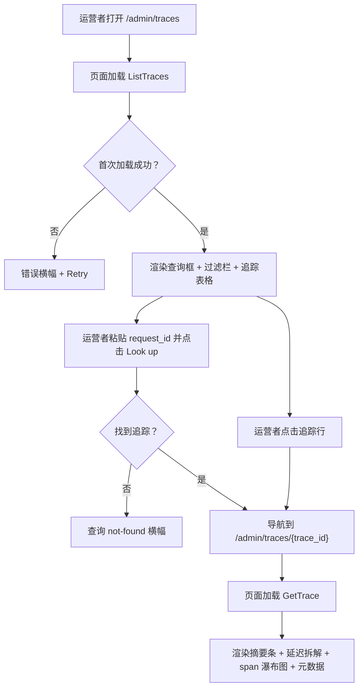
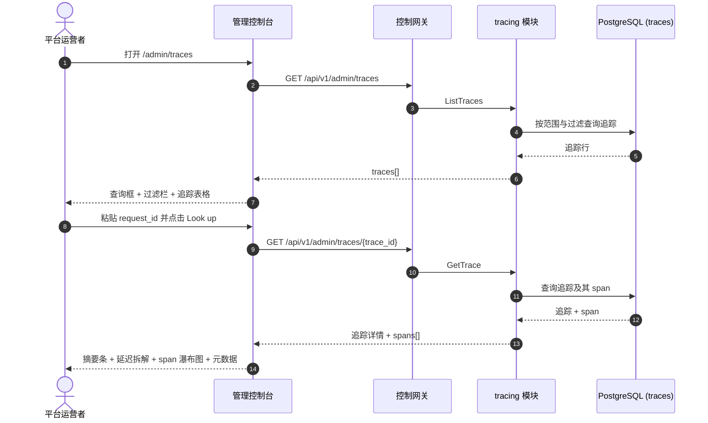

# 请求追踪与延迟拆解 — 需求分析与 UI/UX 设计

| 属性 | 内容 |
| --- | --- |
| 特性点 | 请求追踪与延迟拆解 — 端到端下钻单个推理请求（请求 → 网关 → 推理服务），带追踪详情视图、分阶段延迟拆解（TTFT、生成、总延迟）、状态/错误归因与请求 ID 查询（backlog 第 27 行） |
| 文档范围 | 需求分析与 UI/UX 设计：`/admin/traces` 管理面追踪页面（追踪浏览器 + 请求 ID 查询）与 `/admin/traces/:traceId`（带瀑布图与延迟拆解的追踪详情），`/traces` 与 `/traces/:traceId` 终端用户面追踪页面，页面 → API 面映射表，以及编号验收标准 |
| 归属模块 | `tracing`（新增 — 拥有 `traces` 与 `trace_spans` 表及只读查询 RPC），`web` 管理控制台（`TracesPage`、`TraceDetailPage`）与终端用户控制台（`UserTracesPage`、`UserTraceDetailPage`），`pkg/server` 网关（管理前缀与用户前缀绑定） |
| 相关文档 | [架构设计](./architecture.md) — 第 2.5 节 `metering`、第 3.1 节（管理面/用户面分离）· [请求日志与 API 游乐场](./request-logs-playground.zh-cn.md) — `request_logs` 表及其 `request_id` / `latency_ms` / `status` / `error` 字段，以及本特性以分阶段计时扩展的 best-effort 非致命写入模式 · [模型可观测性仪表盘](./model-observability.zh-cn.md) — 对 `request_logs` 的姊妹只读聚合及其内联 SVG 图表、新鲜度与范围约定 · [控制台面分离](./console-surface-separation.zh-cn.md) — 本特性横跨的两个面、`UserShell`/`AdminShell` 约定、掩码投影规则 |
| 状态 | 设计完成，已移交架构师代理 |

---

## 1. 背景与竞品调研

go-taas 在 `request_logs` 中记录每个推理请求的元数据 — 延迟、状态、错误与 token 计数（特性 #12），模型可观测性仪表盘（特性 #24）把该元数据聚合成按模型的延迟 / 吞吐 / 错误率 / token 吞吐时间序列。控制台仍然无法回答运营者与租户反复提出的调试问题：*这个请求内部到底发生了什么？* 可观测性仪表盘显示聚合而非单个请求；请求日志（特性 #12）显示单一总 `latency_ms`，但不拆解时间花在哪里 — 多少是首 token 时间（TTFT，prefill 阶段）对生成时间（decode 阶段），多少花在网关对推理服务。而当运营者或租户从错误消息或客户端日志拿到一个 `request_id` 时，也没有办法直接跳到该请求的完整追踪。

本特性新增**请求追踪与延迟拆解**：端到端下钻单个推理请求（请求 → 网关 → 推理服务），带追踪详情视图、分阶段延迟拆解（TTFT、生成、总延迟）、状态/错误归因与请求 ID 查询。这是 Phase 4 生产化路线图项中最小可独立交付的增量：它把「这个请求失败了」变成「这个请求在 TTFT 花了 800 ms、在生成花了 1200 ms，并在推理服务中以错误 X 失败」。

### 1.1 竞品的请求追踪与延迟拆解呈现

| 产品 | 追踪面 | 延迟拆解 | 追踪详情视图 | 主要陷阱 |
| --- | --- | --- | --- | --- |
| **OpenAI Platform** | 按请求用量行；无分布式追踪 | 仅总延迟；无 TTFT/生成拆分 | 无瀑布图；按请求查看器显示 token 与延迟 | 用量滞后（分钟级）困扰调试；无阶段拆解；无请求 ID 查询 |
| **LangSmith** | 带过滤的追踪浏览器；按追踪详情 | 每 span 计时；LLM 调用延迟 | 嵌套 span 瀑布图（LLM 调用、检索、工具）带输入/输出 | 重型第三方 SaaS；span 树可能很深；默认捕获请求体（隐私） |
| **Langfuse** | 追踪浏览器；按追踪详情 | 每 span 计时；每 span token 用量与成本 | 嵌套观测瀑布图，带计时、输入、输出、元数据 | 专为 LLM 应用打造但是独立自托管/SaaS 栈；默认捕获请求体 |
| **Arize Phoenix** | 追踪浏览器；按追踪详情 | 每 span 计时；token 用量 | 带属性的 span 瀑布图 | 开源但是独立栈；需要自己的存储 |
| **Datadog APM** | 带搜索/过滤的 Trace Explorer；服务页 | 基于 span 的指标；每 span 时长 | 跨服务的 span 瀑布图，带开始/时长条；与日志关联 | 通用 APM，非 LLM 感知；保留过滤与采样增加复杂度；重型 agent |
| **vLLM / 推理引擎** | Prometheus 指标（TTFT、TPOT、延迟直方图） | TTFT 与 TPOT 指标 | 无按请求追踪详情 | 原始指标，非产品面；无请求 ID 查询；需要 Prometheus/Grafana 栈 |

### 1.2 提炼出的模式与决策

值得采纳的模式：(1) **带过滤的追踪浏览器列表加请求 ID 查询框** — Datadog 的 Trace Explorer 与 Langfuse/LangSmith 都以可过滤的追踪列表开场，而一等公民的请求 ID 查询是从错误消息到追踪的最快路径；(2) **带 span 瀑布图的追踪详情视图** — Datadog 的瀑布图（每个 span 的开始/时长条，跨服务）是展示请求 → 网关 → 推理服务的规范方式；(3) **LLM 专属延迟拆解** — TTFT（prefill）对生成（decode）对总延迟是 LLM 运营者真正关心的数字，vLLM 以 TTFT/TPOT 指标暴露它；(4) **每个 span 的状态/错误归因** — 每个 span 携带自己的状态与错误，让运营者看到确切哪个阶段失败；(5) **best-effort、非致命捕获** — Langfuse 的异步、非阻塞 SDK 证实追踪绝不能给推理路径增加延迟；(6) **内联 SVG 瀑布图** — 控制台刻意依赖精简（usage-dashboard D7、observability D5）。

需要避免的陷阱：默认捕获请求/响应体（LangSmith/Langfuse — 隐私与存储负担；请求日志特性 #12 已决定仅元数据）；独立的重型追踪栈（Langfuse/Phoenix/Datadog — go-taas 必须在自己的控制台中拥有追踪）；把原始 Prometheus 指标作为产品面（vLLM — 控制台必须精选小而可扫读的集合）；阻塞式 N+1 追踪列表（一个端点返回列表，一个返回详情）；以及向租户暴露运营者编排内部信息（服务 id、副本数）— 租户面只显示租户需要的阶段与延迟。

**go-taas 的决策**：

| # | 决策 | 依据 |
| --- | --- | --- |
| D1 | **追踪存在于两个面，作用域清晰拆分。** 管理面（`/admin/traces`、`/api/v1/admin/traces/*`）是**集群级追踪浏览器** — 跨所有组织的所有追踪，带请求 ID 查询、过滤与按追踪详情。终端用户面（`/traces`、`/api/v1/traces/*`）是**租户作用域追踪浏览器** — 仅租户自己的追踪，带相同的查询、过滤与详情，且无服务 id 或运营者内部信息 | 运营者需要跨组织追踪来调试平台级失败与延迟；租户需要自己的追踪来调试应用的请求。按面拆分遵循特性 #17 的掩码投影规则：租户绝不能看到运营者编排内部信息，运营者的集群视图也是运营者作用域。两个面共享相同的追踪列表与详情组件 |
| D2 | **新增 `tracing` 模块拥有 `traces` 表与 `trace_spans` 表。** `traces` 表携带按请求摘要（trace_id、组织、密钥、模型、服务、状态、错误、total_latency_ms、ttft_ms、generation_ms、created_at）；`trace_spans` 表携带 span（span_id、trace_id、parent_span_id、name、kind、start_offset_ms、duration_ms、status、error、attributes）。既有 `request_logs` 只有单一总 `latency_ms`；阶段拆分（TTFT 对生成）与网关/推理 span 结构需要专用捕获 | `request_logs`（特性 #12）捕获总延迟但不捕获 prefill/decode 拆分或网关/推理 span 边界。专用 `tracing` 模块把阶段与 span 捕获从 `metering` 的原始日志面中分离出来并给它一个归属，镜像 observability D3 模式 |
| D3 | **追踪捕获是 best-effort 且非致命，与请求日志在同一幂等处理器中写入，以 `trace_id`（== `request_id`）为键。** 追踪写入失败被记录，绝不失败或重试 voucher 或请求日志。`trace_id` 的幂等性完全如同请求日志 — 重复事件不写第二条追踪 | 追踪是诊断性的，非计费证据；追踪写入绝不能危及权威 voucher 或阻塞摄取。这镜像请求日志 D2 模式（特性 #12） |
| D4 | **v1 不捕获请求/响应体** — 追踪只捕获元数据与阶段计时（身份、模型、服务、token 计数、TTFT、生成、总延迟、状态、错误、span）。 | 请求体是隐私与存储负担，且回答「这个请求内部发生了什么」并不需要；仅元数据让行保持小且 30 天保留便宜。请求体捕获被推迟，与请求日志 D3（特性 #12）一致 |
| D5 | **追踪保留与请求日志对齐：30 天**，由同一周期清理 runner（特性 #12）扩展到 `traces` 与 `trace_spans` 表强制执行 | 追踪是诊断性的，价值快速衰减；30 天在覆盖调试窗口的同时约束存储，且复用既有 runner 避免新调度器 |
| D6 | **追踪详情渲染 span 瀑布图加延迟拆解卡片。** 瀑布图把网关 span 与推理 span 显示为开始/时长条（内联 SVG，无新图表依赖）；延迟拆解卡片显示 TTFT、生成与总延迟，带堆叠条。状态/错误按 span 归因 | Datadog 的瀑布图是展示请求 → 网关 → 推理服务的规范方式；TTFT/生成/总延迟拆解是 LLM 专属数字（vLLM TTFT/TPOT）。内联 SVG 与 observability D5 决策一致 |
| D7 | **请求 ID 查询是追踪列表页的一等公民控件** — 把 `request_id` 粘贴进查询框直接跳到该追踪的详情（或看到 not-found 状态）。 | 从错误消息或客户端日志到追踪的最快路径是直接请求 ID 查询；这是本特性的头条交互 |
| D8 | **终端用户面是租户作用域且掩码**：用户前缀的 `ListTraces`/`GetTrace` 只返回租户自己的追踪，无服务 id、无副本数、无其他租户数据。管理面默认集群级，带可选 `organization_id` 过滤 | 遵循特性 #17 的掩码投影规则与 observability D7 模式：租户得到自己的请求追踪，而非运营者内部信息 |
| D9 | **tracing 块（11101–11199）新增错误码**：**11101 `CodeTraceNotFound`**（未知 `trace_id`）。范围校验复用 **10404**（计量范围契约） | 追踪是新模块（D2），因此其错误码放在 notification 块（110xx）之后的全新块中；不同的 not-found 让「未知追踪」可操作，而范围契约与计量保持统一（observability D4） |

## 2. 目标与非目标

**目标**：一个管理面页面 `/admin/traces`，显示集群级追踪浏览器 — 请求 ID 查询框、过滤（时间范围、模型、API Key、状态）、追踪表格，以及按追踪详情 `/admin/traces/:traceId`，带 span 瀑布图与 TTFT/生成/总延迟拆解（D1、D2、D6、D7）；一个终端用户面页面 `/traces`，显示租户自己的追踪浏览器与 `/traces/:traceId` 详情（D1、D8）；页面 → API 面映射表，含精确前缀（D1）；每页交互状态，包括空、错误与权限拒绝；可在 Nightwatch 中针对 compose 栈测试的编号验收标准。

**非目标**：请求/响应体捕获（D4 — 隐私/存储）；实时流式追踪更新（请求日志节奏不变）；跨外部服务的分布式追踪（v1 只追踪网关与推理服务）；追踪采样或保留过滤（v1 保留所有追踪 30 天，D5）；异常检测或阈值告警（特性 #26 在控制台内消费可观测性事件 — 此处不在范围内）；向租户暴露服务 id、副本数或其他运营者内部信息（D8）；对 voucher、结算或计费流水线的任何更改（推理路径的只读扩展）；新增审计事件（D9）。

## 3. 角色与旅程

| 角色 | 面 | 旅程 |
| --- | --- | --- |
| **平台运营者** | admin | 打开 `/admin/traces` → 看到集群级追踪浏览器 → 按模型与时间范围过滤 → 发现一个总延迟高的追踪 → 下钻到 `/admin/traces/:traceId` → 看到瀑布图与 TTFT/生成拆解 → 识别 TTFT 占主导 → 调优推理服务 |
| **平台运营者（可靠性）** | admin | 客户端报告一个失败的 `request_id` → 运营者把它粘贴进请求 ID 查询框 → 跳到追踪详情 → 看到推理 span 状态为 `error` 与错误消息 → 把失败归因到推理服务 |
| **租户开发者 / 智能体** | end-user | 打开 `/traces` → 看到自己的追踪浏览器 → 按自己的 API Key 过滤 → 下钻到一个慢请求 → 看到自己用量的 TTFT/生成拆解 → 优化提示词或重试逻辑 |
| **租户开发者（调试）** | end-user | 应用中的错误消息包含一个 `request_id` → 把它粘贴进 `/traces` 的查询框 → 跳到追踪详情 → 读取错误与失败的阶段 |

> 术语：消费侧调用方在英文中为 **Agent**，中文为「智能体」，与仓库约定一致。

## 4. 功能需求

### FR1 — 管理面集群级追踪浏览器

- **FR1.1** `ListTraces`（`GET /api/v1/admin/traces`）返回时间范围与可选过滤下的集群级追踪：`request_id`（精确查询）、`model_id`、`api_key_id`、`status` 与 `since`/`until`（unix 秒；默认 `until = now`、`since = until − 24h`），分页（默认 20，上限 100），最新在前。`since > until` 或范围 > 92 天返回 **10404**（D9）。`organization_id` 过滤可选，经 `X-Organization-Id`（D8）。
- **FR1.2** 响应的 `traces[]` 携带每个追踪一行：`trace_id`、`organization_id`、`api_key_id`、`api_key_name`、`model_id`、`model_name`、`service_id`、`status`、`error`、`total_latency_ms`、`ttft_ms`、`generation_ms` 与 `created_at`。表格默认按 `created_at` 降序排序。
- **FR1.3** 当设置 `request_id` 时，`ListTraces` 最多返回一个追踪（精确匹配）；未知 `request_id` 返回空列表（页面显示查询 not-found 状态，§5.1）。

### FR2 — 管理面追踪详情

- **FR2.1** `GetTrace`（`GET /api/v1/admin/traces/{trace_id}`）返回一个追踪的完整详情：FR1.2 的摘要字段加其 `spans[]`。未知 `trace_id` 返回 **11101 `CodeTraceNotFound`**（D9）。
- **FR2.2** 响应的 `spans[]` 携带每个 span 一项：`span_id`、`trace_id`、`parent_span_id`、`name`（`gateway` 或 `inference`）、`kind`、`start_offset_ms`（相对追踪开始的偏移）、`duration_ms`、`status`、`error` 与 `attributes`（JSON 对象，如 `{"model_id": "...", "service_id": "..."}`）。span 按 `start_offset_ms` 升序排列（D6）。

### FR3 — 终端用户面追踪浏览器与详情

- **FR3.1** `ListTraces`（`GET /api/v1/traces`）返回**租户自己**的时间范围与可选过滤下的追踪：`request_id`、`model_id`、`api_key_id`、`status` 与 `since`/`until`（默认与 10404 范围规则同 FR1.1）。它硬作用域到调用者的组织（D8）。
- **FR3.2** `GetTrace`（`GET /api/v1/traces/{trace_id}`）返回租户自己的一个追踪及其 `spans[]`。未知 `trace_id` 返回 **11101**（D9）。
- **FR3.3** 终端用户面响应暴露**无**服务 id、副本数或其他租户数据（D8）。`service_id` 字段被掩码为阶段标签（`gateway` / `inference`）而非运营者服务 id。

### FR4 — 面与 API 绑定

- **FR4.1** 管理面追踪页面位于**管理面**：路由 `/admin/traces` 与 `/admin/traces/:traceId`，API 前缀 `/api/v1/admin/traces/*`。它们被加入 `AdminShell` 导航（特性 #17），名为「Traces」。
- **FR4.2** 终端用户面追踪页面位于**终端用户面**：路由 `/traces` 与 `/traces/:traceId`，API 前缀 `/api/v1/traces/*`。它们被加入 `UserShell` 导航（特性 #17），名为「Traces」。
- **FR4.3** 管理面页面只调用 `/api/v1/admin/traces/*` 路由；终端用户面页面只调用 `/api/v1/traces/*`。两者都不包含对方面的前缀字符串（特性 #17、D1）。
- **FR4.4** 终端用户面页面绝不暴露运营者内部信息（服务 id、副本数），绝不聚合其他租户数据（D8）。

## 5. UI 设计

### 5.1 页面：`/admin/traces` — Traces（管理面）

**目的**：给平台运营者一个集群级追踪浏览器 — 按请求 ID 搜索追踪、按模型 / API Key / 状态 / 时间范围过滤，并下钻单个追踪的详情。

**面**：admin — 路由 `/admin/traces`，API `/api/v1/admin/traces/*`。

**布局**：在 `AdminShell`（特性 #17）内渲染。页面头部（「Traces」，副标题「Inference request traces end-to-end」）带 **Refresh** 动作（次要）。下方：

1. **请求 ID 查询框** — 一个醒目的文本输入框带 **Look up** 按钮（主要）。粘贴 `request_id` 并提交跳到 `/admin/traces/:traceId`；未知 id 显示查询 not-found 状态（D7）。
2. **过滤栏** — **时间范围**控件（预设 24 h / 7 d / 30 d / custom，带日期时间选择器）、**模型**过滤（下拉，「All models」默认）、**API Key** 过滤（下拉，「All keys」默认）与**状态**过滤（下拉：All / Success / Error）。更改任一即重新拉取。
3. **追踪表格** — 集群的追踪，列：**Trace ID**（详情链接）、**Time**（created_at）、**Model**、**API key**、**Status**（徽章）、**Total latency**、**TTFT**、**Generation**、**Error**（截断）。行动作 **View** 打开详情。

**交互状态**：

| 状态 | 行为 |
| --- | --- |
| 默认 | 查询框 + 过滤栏 + 追踪表格从首次成功加载渲染；last-updated 显示加载时间 |
| 加载中 | 骨架表格；Refresh 禁用 |
| 空 | 「No traces in this range.」并提示追踪在首次推理调用后出现；过滤栏保持可见 |
| 查询 not-found | 请求 ID 查询无匹配后，内联横幅「No trace found for request id <id>.」带返回完整列表的链接 |
| 错误 | 错误横幅带消息与 Retry 按钮；页面保留最后的好数据并显示「Showing stale data」横幅 |
| 禁用 | 加载进行中 Refresh 禁用；查询进行中 Look up 按钮禁用 |
| 权限拒绝 | 无所需角色的会话收到 10036，页面显示标准权限拒绝状态（特性 #17）带返回管理首页的链接 |

**追踪表格列**：Trace ID（链接）、Time、Model、API key、Status（徽章）、Total latency、TTFT、Generation、Error（截断）。可按 Time、Total latency、TTFT 与 Generation 排序。可按 Model / API key / Status 下拉过滤；分页。

### 5.2 页面：`/admin/traces/:traceId` — Trace Detail（管理面）

**目的**：显示一个追踪的完整详情 — span 瀑布图（请求 → 网关 → 推理服务）与分阶段延迟拆解（TTFT、生成、总延迟）— 让运营者看到时间花在哪里、哪个阶段失败。

**面**：admin — 路由 `/admin/traces/:traceId`，API `/api/v1/admin/traces/{trace_id}`。

**布局**：`AdminShell` 下的详情页，带返回浏览器的返回链接。头部带追踪 id 与状态徽章。下方：

1. **摘要条** — 追踪 id、模型、API Key、服务、created_at、总延迟、状态徽章、错误（如有）。
2. **延迟拆解卡片** — 显示 **TTFT**、**Generation** 与 **Total** 的卡片，带堆叠条（TTFT + 生成 = 总延迟，内联 SVG）（D6）。
3. **span 瀑布图** — 内联 SVG 的 span（网关、推理）开始/时长条瀑布图，每个带自己的状态与错误（D6）。
4. **元数据表** — 四个 token 计数（prompt、completion、cached、reasoning）、状态、错误与 span 属性。

**交互状态**：

| 状态 | 行为 |
| --- | --- |
| 默认 | 摘要条 + 延迟拆解卡片 + span 瀑布图 + 元数据表从首次成功加载渲染 |
| 加载中 | 骨架卡片与瀑布图；返回链接保持可用 |
| 空 | 「No spans recorded for this trace.」并提示 span 捕获是 best-effort；摘要条保持可见 |
| 错误 | 错误横幅带消息与 Retry 按钮；页面保留最后的好数据并显示「Showing stale data」横幅 |
| not-found | 未知 `trace_id`（11101）显示标准 not-found 状态带返回浏览器的链接 |
| 权限拒绝 | 无所需角色的会话收到 10036，页面显示标准权限拒绝状态（特性 #17）带返回管理首页的链接 |

**元数据表列**：Field、Value。行：Trace ID、Model、API key、Service、Created at、Total latency、TTFT、Generation、Prompt tokens、Completion tokens、Cached tokens、Reasoning tokens、Status、Error。

### 5.3 页面：`/traces` — Traces（终端用户面）

**目的**：给租户开发者 / 智能体一个自己请求追踪的视图 — 按请求 ID 搜索、按模型 / API Key / 状态 / 时间范围过滤，并下钻单个追踪的详情。

**面**：end-user — 路由 `/traces`，API `/api/v1/traces/*`。

**布局**：在 `UserShell`（特性 #17）内渲染。页面头部（「Traces」，副标题「Your inference request traces」）带 **Refresh** 动作（次要）。下方：

1. **请求 ID 查询框** — 同 §5.1（D7）。
2. **过滤栏** — 同 §5.1，作用域到租户自己的密钥与模型（D8）。
3. **追踪表格** — 租户自己的追踪，列同 §5.1，作用域到租户自己的密钥。**Service** 列被掩码为阶段标签（`gateway` / `inference`）而非运营者服务 id（D8）。

**交互状态**：同 §5.1，空文案「No traces in this range.」，权限拒绝文案为租户自己的错误（特性 #17 §8.2 的 10005 组织消失 / 10017 组织禁用，FR4.3 的 10027/10038 重定向）。页面暴露无服务 id 或运营者内部信息（D8）。

**追踪表格列**：同 §5.1，作用域到租户自己的密钥。排序与分页同 §5.1。

### 5.4 页面：`/traces/:traceId` — Trace Detail（终端用户面）

**目的**：给租户开发者 / 智能体一个自己请求追踪的视图 — span 瀑布图与分阶段延迟拆解 — 以调试应用的请求。

**面**：end-user — 路由 `/traces/:traceId`，API `/api/v1/traces/{trace_id}`。

**布局**：`UserShell` 下的详情页，带返回浏览器的返回链接。头部带追踪 id 与状态徽章。下方：

1. **摘要条** — 追踪 id、模型、API Key、created_at、总延迟、状态徽章、错误（如有）。无运营者服务 id（D8）。
2. **延迟拆解卡片** — 同 §5.2（D6）。
3. **span 瀑布图** — 同 §5.2，服务被掩码为阶段标签（D8）。
4. **元数据表** — 同 §5.2，作用域到租户自己的追踪。

**交互状态**：同 §5.2，未知 `trace_id`（11101）的 not-found 文案与租户自己错误的权限拒绝文案（特性 #17 §8.2 的 10005/10017）。页面暴露无服务 id 或运营者内部信息（D8）。

### 5.5 流程

## 6. API 面影响

所有追踪 RPC 属于 **`tracing` 模块**（D2），经控制网关以 HTTP 提供。管理面路由在**管理前缀** `/api/v1/admin/traces/*`（D1）；终端用户面路由在**用户前缀** `/api/v1/traces/*`（D1）。

| RPC | 路由 | 前缀 | 状态 | 目的 |
| --- | --- | --- | --- | --- |
| `ListTraces` | `GET /api/v1/admin/traces` · `GET /api/v1/traces` | admin · user | **新增** | 带请求 ID 查询与过滤的追踪浏览器列表（admin：集群级；user：租户作用域） |
| `GetTrace` | `GET /api/v1/admin/traces/{trace_id}` · `GET /api/v1/traces/{trace_id}` | admin · user | **新增** | 带摘要 + span 的追踪详情（admin：任意追踪；user：租户作用域） |

**给架构师代理的契约说明**：

1. `ListTraces` 校验 `since`/`until`（int64 unix 秒；默认 `until = now`、`since = until − 24h`）；`since > until` 或范围 > 92 天返回 10404（D9）。`request_id`、`model_id`、`api_key_id` 与 `status` 为可选过滤。当设置 `request_id` 时，最多返回一个追踪（精确匹配）。
2. `GetTrace` 校验追踪 id；未知 `trace_id` 返回 11101（D9）。在用户前缀上它作用域到调用者的组织（D8），且暴露无服务 id 或运营者内部信息。
3. `traces` 表携带 `trace_id`（== `request_id`，唯一）、`organization_id`、`api_key_id`、`model_id`、`service_id`、`status`、`error`、`total_latency_ms`、`ttft_ms`、`generation_ms`、`created_at`。`trace_spans` 表携带 `span_id`、`trace_id`、`parent_span_id`、`name`、`kind`、`start_offset_ms`、`duration_ms`、`status`、`error`、`attributes`（JSON）。
4. 捕获是 best-effort 且非致命，与请求日志在同一幂等处理器中写入，以 `trace_id` 为键（D3）。不捕获请求体（D4）。保留 30 天，经既有清理 runner（D5）。
5. 线上约定不变：列表用点分页，成功 HTTP 200，业务错误为 `{"code": <int>, "message": "..."}`，int64 字段序列化为 JSON 字符串。

错误码（tracing 块 11101–11199，`pkg/errors/codes.go`）：

| 条件 | 码 | 常量 | 说明 |
| --- | --- | --- | --- |
| 未知 `trace_id` | 11101 | `CodeTraceNotFound` | **新增**（D9） |
| 畸形或超长范围 | 10404 | `CodeRequestLogRangeInvalid` | 复用（D9）— 计量范围契约 |
| 数据库 / 基础设施失败 | 500 | `CodeInternal` | 经错误归一化 |

## 7. 验收标准

| # | 标准 | 级别 |
| --- | --- | --- |
| AC1 | `ListTraces` 在有效范围内返回追踪行；范围 > 92 天或 `since > until` 返回 10404 | FVT |
| AC2 | `ListTraces` 带 `request_id` 过滤最多返回一个追踪（精确匹配）；未知 `request_id` 返回空列表 | FVT |
| AC3 | `GetTrace`（admin）返回追踪的摘要与 span；未知 `trace_id` 返回 11101 | FVT |
| AC4 | `GetTrace`（user）只返回调用者组织的追踪，无服务 id 或运营者内部信息 | FVT |
| AC5 | `/admin/traces` 页面从首次成功加载渲染请求 ID 查询框、过滤栏与追踪表格，带 last-updated 时间戳 | E2E |
| AC6 | 把已知 `request_id` 粘贴进查询框并点击 Look up 导航到 `/admin/traces/:traceId`；未知 id 显示查询 not-found 横幅 | E2E |
| AC7 | 更改时间范围、模型、API Key 或状态过滤会重新拉取并重新渲染追踪表格 | E2E |
| AC8 | 无数据匹配时渲染空状态（「No traces in this range.」）；失败加载保留最后的好数据并显示「Showing stale data」横幅与 Retry 动作 | E2E |
| AC9 | `/admin/traces/:traceId` 页面渲染摘要条、延迟拆解卡片（TTFT、生成、总延迟）、span 瀑布图与元数据表；未知追踪显示 not-found 状态 | E2E |
| AC10 | `/traces` 与 `/traces/:traceId` 页面渲染租户自己的追踪与详情，无服务 id 或运营者内部信息可见 | E2E |
| AC11 | 管理面追踪页面只在管理面可达：路由 `/admin/traces` 与 `/admin/traces/:traceId`，每个 API 调用使用 `/api/v1/admin/traces/*` 前缀且无 `/api/v1/traces/*` 字符串 | E2E（面分离） |
| AC12 | 终端用户面追踪页面只在终端用户面可达：路由 `/traces` 与 `/traces/:traceId`，每个 API 调用使用 `/api/v1/traces/*` 前缀且无 `/api/v1/admin/*` 字符串 | E2E（面分离） |
| AC13 | 无所需角色的会话在管理面追踪页面收到 10036，页面显示标准权限拒绝状态 | E2E |

## 8. 范围外（在别处跟踪）

| 项 | 位置 |
| --- | --- |
| 请求/响应体捕获 | 推迟 — 隐私/存储（D4） |
| 实时流式追踪更新 | 未来细化 — 请求日志节奏不变 |
| 跨外部服务的分布式追踪 | 未来细化 — v1 只追踪网关与推理服务 |
| 追踪采样 / 保留过滤 | 未来细化 — v1 保留所有追踪 30 天（D5） |
| 异常检测 / 阈值告警 | 特性 #26 在控制台内消费可观测性事件 — 此处不在范围内 |
| 租户可见运营者编排内部信息（服务 id、副本数） | 刻意缺失（D8） |
| 对 voucher、结算或计费流水线的任何更改 | 刻意缺失 — 推理路径的只读扩展（D9） |
| 追踪访问的新增审计事件 | 刻意缺失 — 没有可变更的东西（D9） |