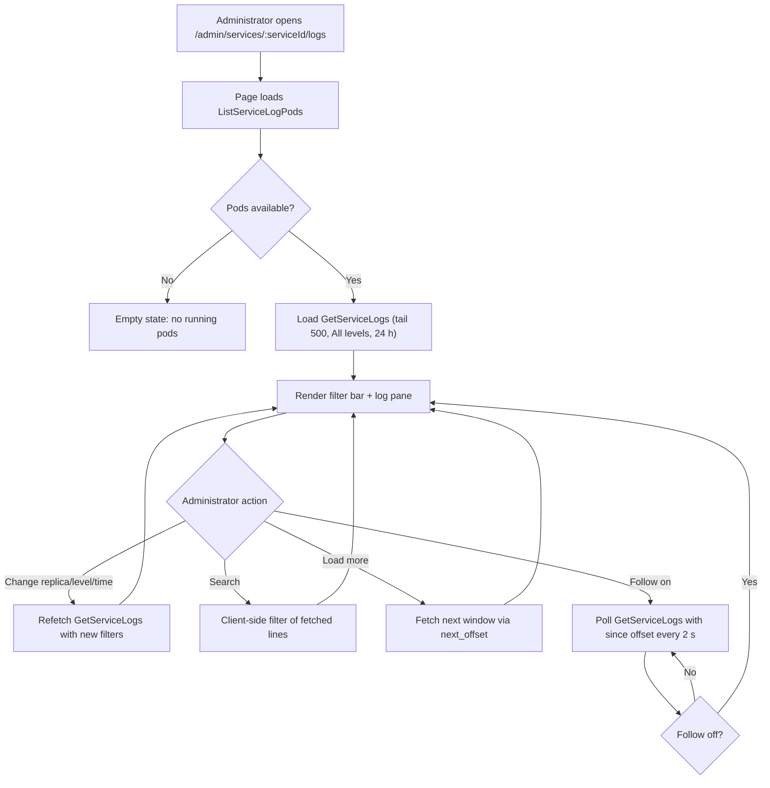
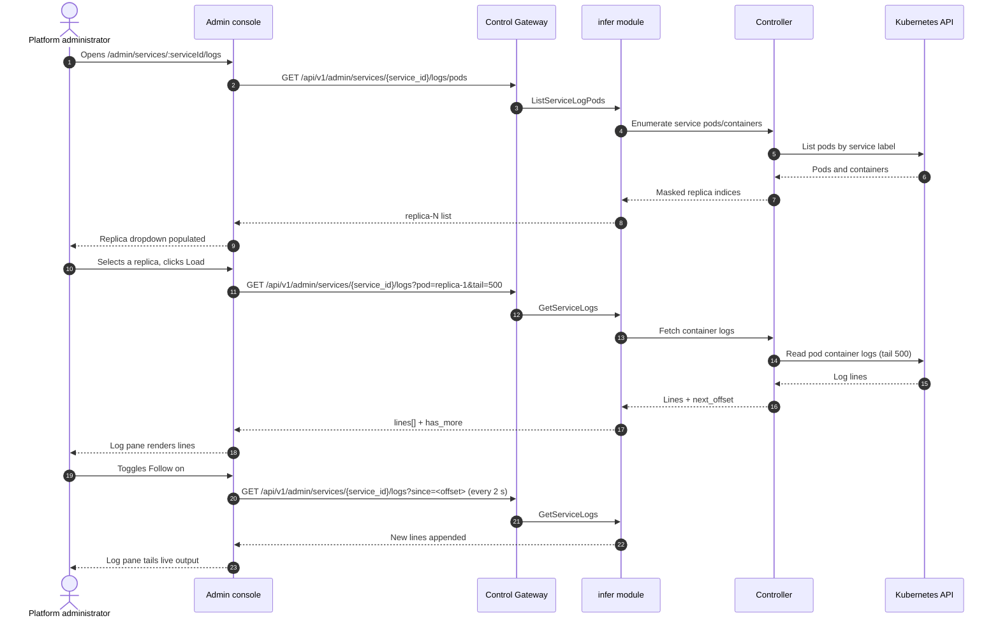

# Inference Service Logs Viewer — Requirement Analysis and UI/UX Design

| Attribute | Content |
| --- | --- |
| Feature point | Inference service logs viewer — view inference service logs in the console with level/time filters, tailing, and log search (backlog row 33) |
| Document scope | Requirement analysis, competitive research, the admin-surface service-logs page for `/admin/services/:serviceId/logs`, the page → API surface table, and numbered acceptance criteria |
| Owning modules | `infer` (log-fetch RPCs over the service's pods), `internal/controller` (read-only: pod/container enumeration and log streaming from the Kubernetes API), `pkg/server` gateway (admin-prefix bindings), `web` admin console (`ServiceLogsPage`) |
| Related documents | [Architecture Design](./architecture.md) — §2.4 `infer`, §2.7 Controller, §4.2 one-click deployment flow · [Model Catalog & One-Click Deployment](./model-catalog-deployment.md) — the inference-service lifecycle and the `inference_services` table · [Console Surface Separation](./console-surface-separation.md) — the two surfaces, the `AdminShell` conventions, the masked-projection rule · [Request Tracing & Latency Breakdown](./request-tracing.md) — the sibling diagnostic surface (per-request traces) this feature complements with raw container logs |
| Status | Design complete, handed to the Architect agent |

---

## 1. Background and Competitive Research

### 1.1 Why the Logs Viewer Comes Now

go-taas runs inference services as Kubernetes Deployments (model-catalog-deployment §4.2): the Controller creates the Deployment and Service, and the inference engine (vLLM, etc.) writes its logs to the container's stdout/stderr. The request-tracing feature (row 27) explains *what happened inside a request* (TTFT, generation, spans), but it cannot answer the operator's raw question: *what did the inference engine print?* When a deployment fails to converge, a request errors, or the engine logs a warning, the operator must leave the console and run `kubectl logs` against the pod — an operator-orchestration escape hatch that the console should own.

This feature adds an **inference service logs viewer**: view the container logs of an inference service's pods in the console, with level/time filters, tailing, and log search. It is the smallest independently valuable increment of Phase 4's operations surface: it turns "the engine printed something" into "the operator reads the engine's stdout in the console, filtered by level and time, without leaving the platform".

### 1.2 How Comparable Products Expose Service/Container Logs

| Product | Log surface | Filters | Tailing / follow | Search | Notable pitfalls |
| --- | --- | --- | --- | --- | --- |
| **kubectl logs** | Raw container stdout/stderr per pod/container | `--since`, `--since-time`, `--tail`, `--timestamps`, `--previous` | `-f` follow streams new lines | No built-in search (pipe to grep) | CLI-only; no level filter; no console surface; pod names leak |
| **Docker logs** | Raw container stdout/stderr | `--since`, `--tail`, `--timestamps` | `-f` follow | No built-in search | CLI-only; no level filter |
| **Grafana Loki** | Aggregated log streams with labels | Level, time range, label selectors, LogQL | Live tailing | Full-text LogQL search | Requires a full observability stack; LogQL is a learning curve |
| **Datadog Logs** | Aggregated log explorer | Level, service, host, time range, facets | Live tailing | Full-text search with facets | Heavy agent; retention/sampling complexity; third-party SaaS |
| **CloudWatch Logs** | Log groups/streams per service | Time range, filter patterns | Live tailing | Filter-pattern search | AWS-bound; filter-pattern syntax is non-standard |
| **Kubernetes Dashboard** | Per-pod logs viewer | Time range, tail | Follow | No built-in search | Operator-orchestration internals; pod names leak into the product surface |

### 1.3 Distilled Patterns and Decisions

Patterns worth adopting:

1. **Raw container logs with a tail window** — kubectl/Docker's `--tail` and `--since` are the canonical way to bound a log fetch; the console should default to a recent tail (e.g. last 500 lines) rather than streaming everything.
2. **Time-range filtering** — every product filters logs by time (`--since`, `--since-time`, time-range pickers); the console reuses the shared time-range preset control (24 h / 7 d / 30 d / custom) from the Usage/Observability pages.
3. **Live tailing** — `-f` follow is the canonical debugging interaction; the console offers a "Follow" toggle that streams new lines.
4. **Level filtering** — Datadog and Loki filter by log level (error/warn/info/debug); the console filters by level when the engine emits structured levels.
5. **Search within the fetched window** — Datadog and Loki search the log text; the console offers client-side search over the fetched window (no separate log store).

Pitfalls to avoid:

- **Leaking pod names** (kubectl, Kubernetes Dashboard) — the console must not expose raw pod names as the product surface; it shows the service and a pod selector (e.g. "replica 2") instead (feature #17's masked-projection rule).
- **A separate log store** (Loki, Datadog, CloudWatch) — go-taas must not stand up a log-aggregation stack for this feature; it reads the container logs directly from the Kubernetes API through the Controller, exactly as `kubectl logs` does.
- **Unbounded log fetches** — fetching all logs of a long-running service is expensive; the console always bounds the fetch (tail + time range).
- **Blocking the HTTP call on a long stream** — a follow stream must not block the request/response cycle; the console uses a bounded poll or a streaming endpoint with a clear lifecycle.

**Decisions for go-taas** (recorded rationale, per the autonomous-decision rule):

| # | Decision | Rationale |
| --- | --- | --- |
| D1 | **The logs viewer lives on the admin surface only**: `/admin/services/:serviceId/logs` + `/api/v1/admin/services/{service_id}/logs/*`. There is **no end-user surface** — container logs are operator-orchestration internals (feature #17's masked-projection rule); tenants get request traces (row 27), not raw engine stdout | The operator needs raw logs to debug deployments and engine behavior; tenants need per-request traces, not pod internals. Consistent with the admin-only accelerator inventory (feature #18) and system status (feature #30) |
| D2 | **Logs are read directly from the Kubernetes API through the Controller**, not from a new log store. The Controller enumerates the service's pods/containers and streams their stdout/stderr, exactly as `kubectl logs` does | Standing up Loki/Datadog/CloudWatch is out of scope and heavy; the Controller already owns the Deployment/Pod lifecycle (model-catalog §4.2), so reading logs from the Kubernetes API is the natural, dependency-light path |
| D3 | **A new `ListServiceLogPods` RPC** returns the service's pods/containers (masked as replica indices, not raw pod names) so the console can offer a pod selector | The console must let the operator pick which replica's logs to view without leaking raw pod names (D1); a masked replica index is the product-safe projection |
| D4 | **A new `GetServiceLogs` RPC** returns a bounded window of log lines for a chosen pod/container, with `tail` (default 500), `since` (time range), and `level` filters; the response carries the lines plus a `next_offset` for pagination | Bounding the fetch (tail + time range) avoids unbounded reads (pitfall); `next_offset` enables "load more" without a log store |
| D5 | **Live tailing is a bounded poll, not a blocking stream**: the console's "Follow" toggle polls `GetServiceLogs` with a `since` offset on a short interval (e.g. 2 s) while active | A blocking stream would tie up the HTTP call and complicate the gateway; a bounded poll matches the existing console polling pattern (deployment state, observability) and is easy to test |
| D6 | **Level filtering is best-effort**: the console filters by level when the engine emits structured levels (e.g. `[ERROR]`, `[WARN]`, `[INFO]`, `[DEBUG]`), and shows all lines otherwise | Engines vary in whether they emit structured levels; a best-effort level filter degrades gracefully to "show all" without a parsing contract |
| D7 | **Search is client-side over the fetched window** — a search box filters the already-fetched lines; it does not query a log store | With no log store (D2), search must operate on the fetched window; this keeps the feature dependency-light and testable |
| D8 | **The page is read-only and audited only for access** — it writes nothing and mutates nothing; the page is reachable only by authenticated admin sessions | The feature is a pure read of container logs; the audit trail (feature #15) already covers the underlying service writes. No new audit events are needed |

### 1.4 Scope Boundary

**In scope**: a service-logs page (pod/replica selector, level/time filters, tail window, follow toggle, client-side search, load-more pagination), the pod/container enumeration RPC, and the bounded log-fetch RPC.

**Out of scope** (tracked by other feature points): request-level traces and latency breakdown (#27), a log-aggregation store or LogQL-style query language (deliberately absent, D2), log retention/archival, and a user-realm logs surface (deliberately absent, D1).

---

## 2. User Roles

| Role | Description | Interaction with the logs viewer |
| --- | --- | --- |
| **Platform administrator** | The operator who runs the go-taas cluster and debugs inference services | Views an inference service's container logs, filters by level/time, tails live output, and searches the fetched window |
| **Agent / SDK** | The programmatic consumer that calls `/v1/chat/completions` | Never touches the logs viewer; consumes the service's endpoints through the gateway with an API Key |

> Terminology: the consumer-side caller is called an **Agent** (English) / 「智能体」(Chinese), consistent with the repo convention. This feature is admin-only, so the consumer-side terminology does not apply to a tenant surface.

---

## 3. User Stories

| # | As a… | I want to… | So that… |
| --- | --- | --- | --- |
| US1 | Platform administrator | open an inference service and see its container logs in the console | I can debug engine behavior without leaving the platform or running `kubectl logs` |
| US2 | Platform administrator | pick which replica's logs to view | I can isolate a failing pod from a healthy one |
| US3 | Platform administrator | filter logs by level and time range | I can focus on errors or a specific window without scrolling everything |
| US4 | Platform administrator | tail live log output | I can watch a deployment converge or an error appear in real time |
| US5 | Platform administrator | search within the fetched log window | I can find a specific message without a separate log store |
| US6 | Platform administrator | load more older log lines | I can page back through history without fetching everything at once |
| US7 | Agent / SDK | call a deployed model through its endpoint with my API Key | I get completions without knowing anything about the service's logs |

---

## 4. Functional Requirements

### FR1 — Pod/replica enumeration

- **FR1.1** `ListServiceLogPods` (`GET /api/v1/admin/services/{service_id}/logs/pods`) returns the service's pods/containers, each masked as a **replica index** (e.g. `replica-1`, `replica-2`) rather than a raw pod name, plus the container name and the pod's state.
- **FR1.2** An unknown `service_id` returns 10301 `CodeInferServiceNotFound`; a service with no running pods returns an empty list (the page shows an empty state).

### FR2 — Bounded log fetch

- **FR2.1** `GetServiceLogs` (`GET /api/v1/admin/services/{service_id}/logs`) returns a bounded window of log lines for a chosen pod/container, with query parameters: `pod` (replica index), `container` (optional), `tail` (default 500, max 5000), `since` (RFC3339 time, optional), and `level` (optional: `error` / `warn` / `info` / `debug`).
- **FR2.2** The response carries `lines[]` (each with `timestamp`, `level` (best-effort, empty when not detected), and `message`), plus `next_offset` (a cursor for "load more") and `has_more`.
- **FR2.3** An unknown `service_id` returns 10301; an unknown pod/container returns a not-found error; an invalid `tail` (0 or > 5000) or malformed `since` returns a validation error.

### FR3 — Level and time filtering

- **FR3.1** The page offers a **level** filter (All / Error / Warn / Info / Debug) and a **time range** filter (the shared preset control: 24 h / 7 d / 30 d / custom). Changing either refetches the log window.
- **FR3.2** Level filtering is best-effort (D6): lines without a detected level are shown under "All" and under no specific level filter.

### FR4 — Live tailing

- **FR4.1** The page offers a **Follow** toggle. When active, the page polls `GetServiceLogs` with a `since` offset on a short interval (default 2 s) and appends new lines; the toggle stops the poll when turned off.
- **FR4.2** Follow is disabled while the service has no running pods (nothing to tail).

### FR5 — Search and pagination

- **FR5.1** The page offers a **search** box that filters the already-fetched lines client-side (case-insensitive substring match on the message); it does not query a log store (D7).
- **FR5.2** A **Load more** action fetches the next window via `next_offset` and appends older lines.

---

## 5. Page and Flow Design

### 5.1 Surface Assignment

| Feature | Surface | Web route | API prefix |
| --- | --- | --- | --- |
| Pod/replica enumeration | admin | `/admin/services/:serviceId/logs` | `/api/v1/admin/services/{service_id}/logs/pods` |
| Bounded log fetch | admin | `/admin/services/:serviceId/logs` | `/api/v1/admin/services/{service_id}/logs` |

Every page and API call above is on the **admin surface**; there is no end-user surface (D1). Admin pages never call a `/api/v1/*` route, and the admin session realm is used throughout.

### 5.2 Page Map

| Page / component | Purpose |
| --- | --- |
| **Service Logs page** (`/admin/services/:serviceId/logs`) | Container logs of an inference service with pod/replica selector, level/time filters, tail window, follow toggle, client-side search, and load-more pagination |

### 5.3 Page: `/admin/services/:serviceId/logs` — Service Logs (admin)

**Purpose**: give the platform administrator a single surface to read an inference service's container logs — pick a replica, filter by level and time, tail live output, and search the fetched window.

**Surface**: admin — route `/admin/services/:serviceId/logs`, API `/api/v1/admin/services/{service_id}/logs/*`.

**Layout**: rendered inside `AdminShell` (feature #17). A page header ("Service Logs", subtitle with the service name and `service_id`) with a **Back to Service** link (secondary). Below:

1. **Filter bar** — a **Replica** dropdown (from `ListServiceLogPods`, masked as `replica-N`), a **Level** dropdown (All / Error / Warn / Info / Debug), a **Time range** control (the shared preset: 24 h / 7 d / 30 d / custom), a **Follow** toggle, and a **Search** box.
2. **Log view** — a monospace, scrollable log pane showing the fetched lines, each with a timestamp, a level badge (when detected), and the message. A **Load more** action at the top appends older lines.

**Interactive states**:

| State | Behaviour |
| --- | --- |
| Default | Filter bar + log pane render from the first successful load (default tail 500, All levels, 24 h range, replica 1) |
| Loading | Skeleton log pane; Follow and Load more are disabled |
| Empty | "No log lines in this window." with a hint to widen the time range or tail; the filter bar stays visible |
| Error | An error banner with the message and a Retry button; the page keeps its last good lines with a "Showing stale data" banner |
| Disabled | Follow is disabled while the service has no running pods; Load more is disabled while a fetch is in flight or `has_more` is false |
| Permission-denied | A session without the required role receives 10036 and the page shows the standard permission-denied state (feature #17) with a link back to the admin home |

**Filter bar controls**: Replica dropdown (from `ListServiceLogPods`), Level dropdown (All / Error / Warn / Info / Debug), Time range (shared preset control), Follow toggle, Search box. Changing Replica, Level, or Time range refetches the window; Search filters client-side; Follow polls on a 2 s interval.

**Log view**: monospace pane, each line `[timestamp] [level] message` with a level badge. **Load more** fetches the next window via `next_offset` and prepends older lines. The pane auto-scrolls to the bottom when Follow is active.

### 5.4 Flows

---

## 6. API Surface Implications

The log RPCs belong to the **`infer` module** (D3, D4), served as HTTP via the Control Gateway on the **admin prefix** `/api/v1/admin/services/{service_id}/logs/*` (D1). The Controller provides the read-only pod/container enumeration and log streaming from the Kubernetes API (D2). There is **no user-prefix binding** (D1).

| RPC | Route | Prefix | Status | Purpose |
| --- | --- | --- | --- | --- |
| `ListServiceLogPods` (`taas.infer.v1`) | `GET /api/v1/admin/services/{service_id}/logs/pods` | admin | **new** | Enumerate the service's pods/containers, masked as replica indices |
| `GetServiceLogs` (`taas.infer.v1`) | `GET /api/v1/admin/services/{service_id}/logs` | admin | **new** | Fetch a bounded window of log lines with tail/time/level filters and a `next_offset` cursor |

**Contract notes for the Architect agent**:

1. `ListServiceLogPods` returns `pods[]`, each with `replica_index` (e.g. `replica-1`), `container` (name), and `state`; it never returns raw pod names (D1).
2. `GetServiceLogs` accepts `pod` (replica index), `container` (optional), `tail` (default 500, max 5000), `since` (RFC3339, optional), and `level` (optional). It returns `lines[]` (each with `timestamp`, `level` (best-effort, empty when not detected), `message`), `next_offset`, and `has_more` (FR2.1, FR2.2).
3. The Controller reads container logs from the Kubernetes API exactly as `kubectl logs` does (D2); it masks pod names to replica indices before returning (D1).
4. Live tailing is a bounded poll with a `since` offset (D5); the console drives the poll, not the server.
5. Wire conventions unchanged: HTTP 200 on success, business errors as `{"code": <int>, "message": "..."}`, int64 fields serialized as JSON strings.

Error codes (existing blocks, `pkg/errors/codes.go`):

| Condition | Code | Constant | Notes |
| --- | --- | --- | --- |
| Unknown `service_id` | 10301 | `CodeInferServiceNotFound` | `ListServiceLogPods`, `GetServiceLogs` |
| Unknown pod/container | 10304 | `CodeInferEndpointNotFound` | Reused for an unknown replica/container (FR2.3) |
| Invalid `tail` (0 or > 5000) or malformed `since` | 10404 | `CodeRequestLogRangeInvalid` | Reused — the metering range contract (FR2.3) |

---

## 7. Acceptance Criteria

| # | Criterion | Level |
| --- | --- | --- |
| AC1 | `ListServiceLogPods` returns the service's pods/containers masked as replica indices (never raw pod names); an unknown `service_id` returns 10301 | FVT |
| AC2 | `GetServiceLogs` returns a bounded window of lines with `timestamp`, `level` (best-effort), and `message`, plus `next_offset` and `has_more`; an invalid `tail` or malformed `since` returns a validation error | FVT |
| AC3 | `GetServiceLogs` with a `next_offset` returns the next older window; `has_more` is false at the end of the log | FVT |
| AC4 | The `/admin/services/:serviceId/logs` page renders the filter bar and the log pane from the first successful load, with the replica dropdown populated from `ListServiceLogPods` | E2E |
| AC5 | Changing the replica, level, or time range refetches the log window; the level filter shows only matching lines and degrades to "show all" when no level is detected | E2E |
| AC6 | The Follow toggle polls `GetServiceLogs` on a short interval and appends new lines; turning it off stops the poll; Follow is disabled when the service has no running pods | E2E |
| AC7 | The search box filters the fetched lines client-side; Load more fetches the next window via `next_offset` and prepends older lines | E2E |
| AC8 | The service-logs page is reachable only on the admin surface: route `/admin/services/:serviceId/logs`, every API call uses the `/api/v1/admin/services/{service_id}/logs/*` prefix with no `/api/v1/*` string | E2E (surface separation) |
| AC9 | A session without the required role receives 10036 on the service-logs page and the page shows the standard permission-denied state | E2E |

---

## 8. Out of Scope (tracked elsewhere)

| Item | Where |
| --- | --- |
| Request-level traces and latency breakdown | Feature #27 request tracing |
| A log-aggregation store or LogQL-style query language | Deliberately absent (D2) — logs are read from the Kubernetes API |
| Log retention / archival | Future refinement — the Kubernetes API's log lifecycle stands |
| A user-realm logs surface | Deliberately absent (D1) — tenants get request traces, not raw engine stdout |
