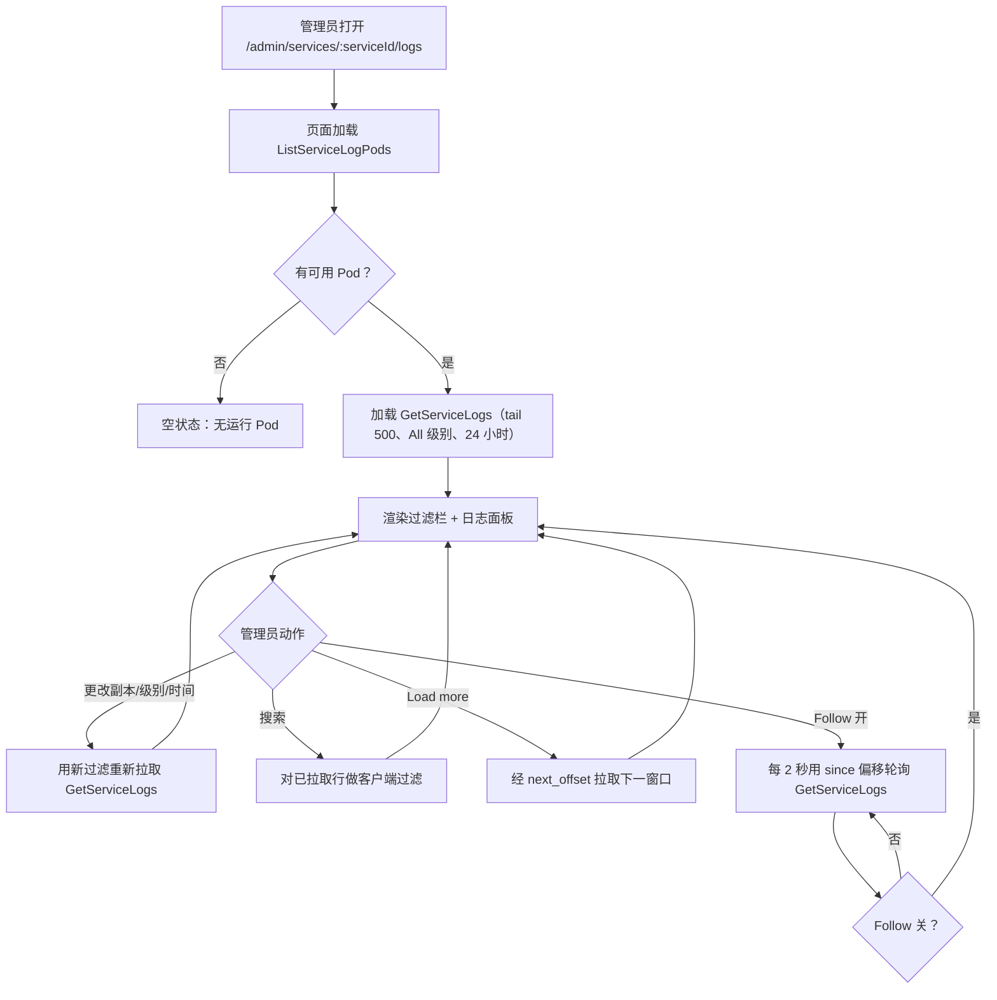
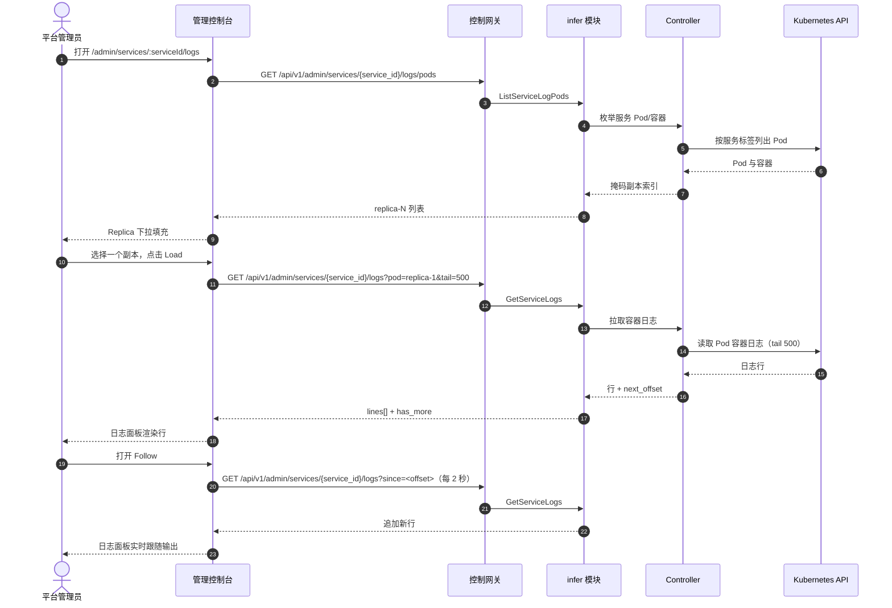

# 推理服务日志查看器 — 需求分析与 UI/UX 设计

| 属性 | 内容 |
| --- | --- |
| 特性点 | 推理服务日志查看器 — 在控制台中查看推理服务日志，支持级别/时间过滤、实时跟随与日志搜索（backlog 第 33 行） |
| 文档范围 | 需求分析、竞品调研、`/admin/services/:serviceId/logs` 管理面服务日志页、页面 → API 面映射表，以及编号验收标准 |
| 归属模块 | `infer`（服务 Pod 的日志拉取 RPC）、`internal/controller`（只读：从 Kubernetes API 枚举 Pod/容器并流式读取日志）、`pkg/server` 网关（管理前缀绑定）、`web` 管理控制台（`ServiceLogsPage`） |
| 相关文档 | [架构设计](./architecture.md) — 第 2.4 节 `infer`、第 2.7 节 Controller、第 4.2 节一键部署流程 · [模型目录与一键部署](./model-catalog-deployment.md) — 推理服务生命周期与 `inference_services` 表 · [控制台面分离](./console-surface-separation.md) — 两个面、`AdminShell` 约定、掩码投影规则 · [请求追踪与延迟分解](./request-tracing.md) — 本特性用原始容器日志补充的姊妹诊断面（按请求追踪） |
| 状态 | 设计完成，已移交架构师代理 |

---

## 1. 背景与竞品调研

### 1.1 为什么现在做日志查看器

go-taas 将推理服务作为 Kubernetes Deployment 运行（model-catalog-deployment §4.2）：Controller 创建 Deployment 与 Service，推理引擎（vLLM 等）把日志写入容器的 stdout/stderr。请求追踪特性（第 27 行）解释了*请求内部发生了什么*（TTFT、生成、span），但它无法回答运营者的原始问题：*推理引擎打印了什么？* 当部署无法收敛、请求出错或引擎记录警告时，运营者必须离开控制台对 Pod 执行 `kubectl logs` —— 这是控制台应当拥有的运营者编排逃生通道。

本特性新增**推理服务日志查看器**：在控制台中查看推理服务 Pod 的容器日志，支持级别/时间过滤、实时跟随与日志搜索。这是 Phase 4 运维面中最小可独立交付的增量：它把「引擎打印了东西」变成「运营者在控制台里按级别和时间过滤地读取引擎 stdout，无需离开平台」。

### 1.2 竞品如何呈现服务/容器日志

| 产品 | 日志面 | 过滤 | 实时跟随 | 搜索 | 主要陷阱 |
| --- | --- | --- | --- | --- | --- |
| **kubectl logs** | 每 Pod/容器的原始容器 stdout/stderr | `--since`、`--since-time`、`--tail`、`--timestamps`、`--previous` | `-f` 跟随流式输出新行 | 无内置搜索（管道给 grep） | 仅 CLI；无级别过滤；无控制台面；泄漏 Pod 名 |
| **Docker logs** | 原始容器 stdout/stderr | `--since`、`--tail`、`--timestamps` | `-f` 跟随 | 无内置搜索 | 仅 CLI；无级别过滤 |
| **Grafana Loki** | 带标签的聚合日志流 | 级别、时间范围、标签选择器、LogQL | 实时跟随 | LogQL 全文搜索 | 需要完整可观测性栈；LogQL 有学习曲线 |
| **Datadog Logs** | 聚合日志浏览器 | 级别、服务、主机、时间范围、facet | 实时跟随 | 带 facet 的全文搜索 | 重型 agent；保留/采样复杂度；第三方 SaaS |
| **CloudWatch Logs** | 每服务的日志组/流 | 时间范围、过滤模式 | 实时跟随 | 过滤模式搜索 | 绑定 AWS；过滤模式语法非标准 |
| **Kubernetes Dashboard** | 每 Pod 日志查看器 | 时间范围、tail | 跟随 | 无内置搜索 | 运营者编排内部信息；Pod 名泄漏到产品面 |

### 1.3 提炼出的模式与决策

值得采纳的模式：

1. **带 tail 窗口的原始容器日志** — kubectl/Docker 的 `--tail` 与 `--since` 是约束日志拉取的规范方式；控制台应默认拉取近期 tail（如最近 500 行）而非流式拉取全部。
2. **时间范围过滤** — 每个产品都按时间过滤日志（`--since`、`--since-time`、时间范围选择器）；控制台复用 Usage/Observability 页共享的时间范围预设控件（24 小时 / 7 天 / 30 天 / 自定义）。
3. **实时跟随** — `-f` 跟随是规范的调试交互；控制台提供「Follow」开关流式输出新行。
4. **级别过滤** — Datadog 与 Loki 按日志级别（error/warn/info/debug）过滤；当引擎输出结构化级别时，控制台按级别过滤。
5. **在已拉取窗口内搜索** — Datadog 与 Loki 搜索日志文本；控制台对已拉取窗口做客户端搜索（无独立日志存储）。

需要避免的陷阱：

- **泄漏 Pod 名**（kubectl、Kubernetes Dashboard）— 控制台不得把原始 Pod 名作为产品面；它显示服务与 Pod 选择器（如「replica 2」）代替（特性 #17 的掩码投影规则）。
- **独立日志存储**（Loki、Datadog、CloudWatch）— go-taas 不得为本特性搭建日志聚合栈；它经 Controller 直接从 Kubernetes API 读取容器日志，正如 `kubectl logs` 所做。
- **无界日志拉取** — 拉取长期运行服务的全部日志代价高昂；控制台始终约束拉取（tail + 时间范围）。
- **用阻塞 HTTP 调用处理长流** — 跟随流不得阻塞请求/响应周期；控制台使用有界轮询或带清晰生命周期的流式端点。

**go-taas 的决策**（依据自主决策规则记录理由）：

| # | 决策 | 依据 |
| --- | --- | --- |
| D1 | **日志查看器仅存在于管理面**：`/admin/services/:serviceId/logs` + `/api/v1/admin/services/{service_id}/logs/*`。**无终端用户面** — 容器日志是运营者编排内部信息（特性 #17 的掩码投影规则）；租户获得请求追踪（第 27 行），而非原始引擎 stdout | 运营者需要原始日志来调试部署与引擎行为；租户需要按请求追踪，而非 Pod 内部信息。与仅管理面的加速器清单（特性 #18）与系统状态（特性 #30）一致 |
| D2 | **日志经 Controller 直接从 Kubernetes API 读取，而非新日志存储**。Controller 枚举服务的 Pod/容器并流式读取其 stdout/stderr，正如 `kubectl logs` 所做 | 搭建 Loki/Datadog/CloudWatch 超出范围且过重；Controller 已拥有 Deployment/Pod 生命周期（model-catalog §4.2），因此从 Kubernetes API 读取日志是自然、依赖精简的路径 |
| D3 | **新增 `ListServiceLogPods` RPC** 返回服务的 Pod/容器（掩码为副本索引而非原始 Pod 名），让控制台提供 Pod 选择器 | 控制台必须让运营者选择查看哪个副本的日志，同时不泄漏原始 Pod 名（D1）；掩码副本索引是产品安全的投影 |
| D4 | **新增 `GetServiceLogs` RPC** 返回所选 Pod/容器的有界日志窗口，带 `tail`（默认 500）、`since`（时间范围）与 `level` 过滤；响应携带行与 `next_offset` 用于分页 | 约束拉取（tail + 时间范围）避免无界读取（陷阱）；`next_offset` 支持「加载更多」而无需日志存储 |
| D5 | **实时跟随是有界轮询，而非阻塞流**：控制台的「Follow」开关在激活时以短间隔（如 2 秒）用 `since` 偏移轮询 `GetServiceLogs` | 阻塞流会占用 HTTP 调用并使网关复杂化；有界轮询契合既有控制台轮询模式（部署状态、可观测性）且易于测试 |
| D6 | **级别过滤是尽力而为**：当引擎输出结构化级别（如 `[ERROR]`、`[WARN]`、`[INFO]`、`[DEBUG]`）时控制台按级别过滤，否则显示全部行 | 引擎是否输出结构化级别不一；尽力而为的级别过滤在无解析契约时优雅降级为「显示全部」 |
| D7 | **搜索是对已拉取窗口的客户端搜索** — 搜索框过滤已拉取的行；它不查询日志存储 | 无日志存储（D2）时，搜索必须作用于已拉取窗口；这保持特性依赖精简且可测试 |
| D8 | **页面只读且仅对访问审计** — 它不写数据、不改变任何东西；页面仅对已认证的管理会话可达 | 该特性是对容器日志的纯读取；审计轨迹（特性 #15）已覆盖底层服务写入。无需新增审计事件 |

### 1.4 范围边界

**范围内**：服务日志页（Pod/副本选择器、级别/时间过滤、tail 窗口、跟随开关、客户端搜索、加载更多分页）、Pod/容器枚举 RPC、有界日志拉取 RPC。

**范围外**（由其他特性点跟踪）：请求级追踪与延迟分解（#27）、日志聚合存储或 LogQL 风格查询语言（刻意缺失，D2）、日志保留/归档、用户面日志面（刻意缺失，D1）。

---

## 2. 用户角色

| 角色 | 描述 | 与日志查看器的交互 |
| --- | --- | --- |
| **平台管理员** | 运维 go-taas 集群并调试推理服务的运营者 | 查看推理服务的容器日志、按级别/时间过滤、实时跟随输出、在已拉取窗口内搜索 |
| **智能体 / SDK** | 调用 `/v1/chat/completions` 的程序化消费方 | 从不接触日志查看器；经网关持 API Key 消费服务端点 |

> 术语：消费侧调用方在英文中为 **Agent**，中文为「智能体」，与仓库约定一致。本特性仅管理面，因此消费侧术语不适用于租户面。

---

## 3. 用户故事

| # | 作为… | 我想要… | 以便… |
| --- | --- | --- | --- |
| US1 | 平台管理员 | 打开推理服务并在控制台查看其容器日志 | 无需离开平台或运行 `kubectl logs` 就能调试引擎行为 |
| US2 | 平台管理员 | 选择查看哪个副本的日志 | 把故障 Pod 与健康 Pod 隔离 |
| US3 | 平台管理员 | 按级别与时间范围过滤日志 | 聚焦错误或特定窗口，无需滚动全部 |
| US4 | 平台管理员 | 实时跟随日志输出 | 实时观察部署收敛或错误出现 |
| US5 | 平台管理员 | 在已拉取日志窗口内搜索 | 无需独立日志存储就能找到特定消息 |
| US6 | 平台管理员 | 加载更多更早的日志行 | 无需一次拉取全部就能翻看历史 |
| US7 | 智能体 / SDK | 用我的 API Key 通过端点调用已部署的模型 | 获得补全结果，无需了解服务的日志 |

---

## 4. 功能需求

### FR1 — Pod/副本枚举

- **FR1.1** `ListServiceLogPods`（`GET /api/v1/admin/services/{service_id}/logs/pods`）返回服务的 Pod/容器，每个掩码为**副本索引**（如 `replica-1`、`replica-2`）而非原始 Pod 名，另含容器名与 Pod 状态。
- **FR1.2** 未知 `service_id` 返回 10301 `CodeInferServiceNotFound`；无运行 Pod 的服务返回空列表（页面显示空状态）。

### FR2 — 有界日志拉取

- **FR2.1** `GetServiceLogs`（`GET /api/v1/admin/services/{service_id}/logs`）返回所选 Pod/容器的有界日志窗口，查询参数：`pod`（副本索引）、`container`（可选）、`tail`（默认 500，最大 5000）、`since`（RFC3339 时间，可选）与 `level`（可选：`error` / `warn` / `info` / `debug`）。
- **FR2.2** 响应携带 `lines[]`（每个带 `timestamp`、`level`（尽力而为，未检测到则为空）与 `message`），另含 `next_offset`（「加载更多」游标）与 `has_more`。
- **FR2.3** 未知 `service_id` 返回 10301；未知 Pod/容器返回 not-found 错误；非法 `tail`（0 或 > 5000）或格式错误的 `since` 返回校验错误。

### FR3 — 级别与时间过滤

- **FR3.1** 页面提供**级别**过滤（All / Error / Warn / Info / Debug）与**时间范围**过滤（共享预设控件：24 小时 / 7 天 / 30 天 / 自定义）。更改任一都会重新拉取日志窗口。
- **FR3.2** 级别过滤是尽力而为（D6）：未检测到级别的行在「All」下显示，且不落入任何特定级别过滤。

### FR4 — 实时跟随

- **FR4.1** 页面提供**Follow**开关。激活时，页面以短间隔（默认 2 秒）用 `since` 偏移轮询 `GetServiceLogs` 并追加新行；关闭时停止轮询。
- **FR4.2** 服务无运行 Pod 时 Follow 禁用（没有可跟随的内容）。

### FR5 — 搜索与分页

- **FR5.1** 页面提供**搜索**框，对已拉取的行做客户端过滤（对消息做不区分大小写的子串匹配）；它不查询日志存储（D7）。
- **FR5.2** **Load more** 动作经 `next_offset` 拉取下一窗口并追加更早的行。

---

## 5. 页面与流程设计

### 5.1 面分配

| 特性 | 面 | Web 路由 | API 前缀 |
| --- | --- | --- | --- |
| Pod/副本枚举 | admin | `/admin/services/:serviceId/logs` | `/api/v1/admin/services/{service_id}/logs/pods` |
| 有界日志拉取 | admin | `/admin/services/:serviceId/logs` | `/api/v1/admin/services/{service_id}/logs` |

以上每个页面与 API 调用都位于**管理面**；无终端用户面（D1）。管理面页面从不调用 `/api/v1/*` 路由，全程使用管理会话域。

### 5.2 页面地图

| 页面 / 组件 | 目的 |
| --- | --- |
| **服务日志页**（`/admin/services/:serviceId/logs`） | 推理服务的容器日志，含 Pod/副本选择器、级别/时间过滤、tail 窗口、跟随开关、客户端搜索与加载更多分页 |

### 5.3 页面：`/admin/services/:serviceId/logs` — Service Logs（管理面）

**目的**：给平台管理员一个单一面来读取推理服务的容器日志 — 选择副本、按级别与时间过滤、实时跟随输出、在已拉取窗口内搜索。

**面**：admin — 路由 `/admin/services/:serviceId/logs`，API `/api/v1/admin/services/{service_id}/logs/*`。

**布局**：在 `AdminShell`（特性 #17）内渲染。页面头部（「Service Logs」，副标题含服务名称与 `service_id`）带 **Back to Service** 链接（次要）。下方：

1. **过滤栏** — **Replica** 下拉（来自 `ListServiceLogPods`，掩码为 `replica-N`）、**Level** 下拉（All / Error / Warn / Info / Debug）、**Time range** 控件（共享预设：24 小时 / 7 天 / 30 天 / 自定义）、**Follow** 开关与**Search** 框。
2. **日志视图** — 等宽、可滚动的日志面板，显示已拉取的行，每行带时间戳、级别徽章（检测到时）与消息。顶部有 **Load more** 动作追加更早的行。

**交互状态**：

| 状态 | 行为 |
| --- | --- |
| 默认 | 过滤栏 + 日志面板从首次成功加载渲染（默认 tail 500、All 级别、24 小时范围、副本 1） |
| 加载中 | 骨架日志面板；Follow 与 Load more 禁用 |
| 空 | 「No log lines in this window.」并提示加宽时间范围或 tail；过滤栏保持可见 |
| 错误 | 错误横幅带消息与 Retry 按钮；页面保留最后的好行并显示「Showing stale data」横幅 |
| 禁用 | 服务无运行 Pod 时 Follow 禁用；拉取进行中或 `has_more` 为 false 时 Load more 禁用 |
| 权限拒绝 | 无所需角色的会话收到 10036，页面显示标准权限拒绝状态（特性 #17）带返回管理首页的链接 |

**过滤栏控件**：Replica 下拉（来自 `ListServiceLogPods`）、Level 下拉（All / Error / Warn / Info / Debug）、Time range（共享预设控件）、Follow 开关、Search 框。更改 Replica、Level 或 Time range 会重新拉取窗口；Search 做客户端过滤；Follow 以 2 秒间隔轮询。

**日志视图**：等宽面板，每行 `[timestamp] [level] message` 带级别徽章。**Load more** 经 `next_offset` 拉取下一窗口并在顶部前置更早的行。Follow 激活时面板自动滚动到底部。

### 5.4 流程

---

## 6. API 面影响

日志 RPC 属于 **`infer` 模块**（D3、D4），经控制网关以 HTTP 提供，位于**管理前缀** `/api/v1/admin/services/{service_id}/logs/*`（D1）。Controller 提供从 Kubernetes API 的只读 Pod/容器枚举与日志流式读取（D2）。**无用户前缀绑定**（D1）。

| RPC | 路由 | 前缀 | 状态 | 目的 |
| --- | --- | --- | --- | --- |
| `ListServiceLogPods`（`taas.infer.v1`） | `GET /api/v1/admin/services/{service_id}/logs/pods` | admin | **新增** | 枚举服务的 Pod/容器，掩码为副本索引 |
| `GetServiceLogs`（`taas.infer.v1`） | `GET /api/v1/admin/services/{service_id}/logs` | admin | **新增** | 带 tail/时间/级别过滤与 `next_offset` 游标的有界日志窗口 |

**给架构师代理的契约说明**：

1. `ListServiceLogPods` 返回 `pods[]`，每个带 `replica_index`（如 `replica-1`）、`container`（名称）与 `state`；它绝不返回原始 Pod 名（D1）。
2. `GetServiceLogs` 接受 `pod`（副本索引）、`container`（可选）、`tail`（默认 500，最大 5000）、`since`（RFC3339，可选）与 `level`（可选）。它返回 `lines[]`（每个带 `timestamp`、`level`（尽力而为，未检测到则为空）、`message`）、`next_offset` 与 `has_more`（FR2.1、FR2.2）。
3. Controller 正如 `kubectl logs` 那样从 Kubernetes API 读取容器日志（D2）；返回前把 Pod 名掩码为副本索引（D1）。
4. 实时跟随是有界轮询，带 `since` 偏移（D5）；轮询由控制台驱动，而非服务端。
5. 线上约定不变：成功 HTTP 200，业务错误为 `{"code": <int>, "message": "..."}`，int64 字段序列化为 JSON 字符串。

错误码（既有块，`pkg/errors/codes.go`）：

| 条件 | 码 | 常量 | 说明 |
| --- | --- | --- | --- |
| 未知 `service_id` | 10301 | `CodeInferServiceNotFound` | `ListServiceLogPods`、`GetServiceLogs` |
| 未知 Pod/容器 | 10304 | `CodeInferEndpointNotFound` | 复用于未知副本/容器（FR2.3） |
| 非法 `tail`（0 或 > 5000）或格式错误的 `since` | 10404 | `CodeRequestLogRangeInvalid` | 复用 — metering 范围契约（FR2.3） |

---

## 7. 验收标准

| # | 标准 | 级别 |
| --- | --- | --- |
| AC1 | `ListServiceLogPods` 返回服务的 Pod/容器，掩码为副本索引（绝不返回原始 Pod 名）；未知 `service_id` 返回 10301 | FVT |
| AC2 | `GetServiceLogs` 返回带 `timestamp`、`level`（尽力而为）与 `message` 的有界窗口，另含 `next_offset` 与 `has_more`；非法 `tail` 或格式错误的 `since` 返回校验错误 | FVT |
| AC3 | 带 `next_offset` 的 `GetServiceLogs` 返回下一更早窗口；日志末尾 `has_more` 为 false | FVT |
| AC4 | `/admin/services/:serviceId/logs` 页面从首次成功加载渲染过滤栏与日志面板，Replica 下拉由 `ListServiceLogPods` 填充 | E2E |
| AC5 | 更改副本、级别或时间范围会重新拉取日志窗口；级别过滤只显示匹配行，未检测到级别时降级为「显示全部」 | E2E |
| AC6 | Follow 开关以短间隔轮询 `GetServiceLogs` 并追加新行；关闭时停止轮询；服务无运行 Pod 时 Follow 禁用 | E2E |
| AC7 | 搜索框对已拉取行做客户端过滤；Load more 经 `next_offset` 拉取下一窗口并在顶部前置更早的行 | E2E |
| AC8 | 服务日志页只在管理面可达：路由 `/admin/services/:serviceId/logs`，每个 API 调用使用 `/api/v1/admin/services/{service_id}/logs/*` 前缀且无 `/api/v1/*` 字符串 | E2E（面分离） |
| AC9 | 无所需角色的会话在服务日志页收到 10036，页面显示标准权限拒绝状态 | E2E |

---

## 8. 范围外（在别处跟踪）

| 项 | 位置 |
| --- | --- |
| 请求级追踪与延迟分解 | 特性 #27 请求追踪 |
| 日志聚合存储或 LogQL 风格查询语言 | 刻意缺失（D2）— 日志从 Kubernetes API 读取 |
| 日志保留 / 归档 | 未来细化 — Kubernetes API 的日志生命周期不变 |
| 用户面日志面 | 刻意缺失（D1）— 租户获得请求追踪，而非原始引擎 stdout |
