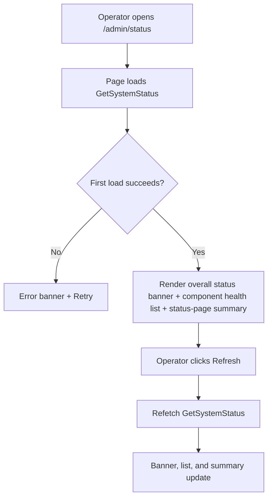
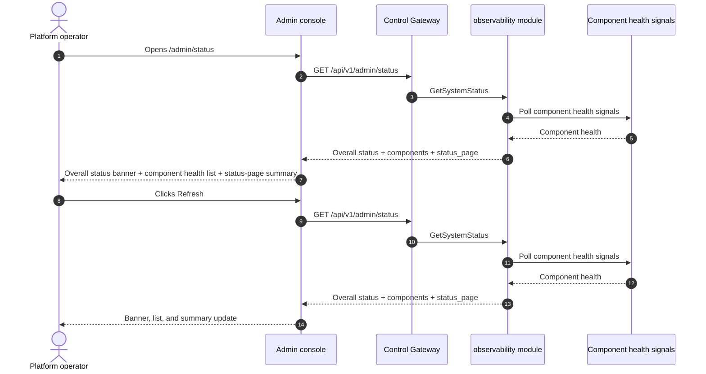

# System Health & Service Status — Requirement Analysis and UI/UX Design

| Attribute | Content |
| --- | --- |
| Feature point | System health & service status — platform component health (gateway, gRPC services, MQ, PostgreSQL, Redis, controller), uptime, dependency status, and a status page (backlog row 30) |
| Document scope | Requirement analysis, competitive research, the admin-surface status page for `/admin/status` (component health + uptime + dependency status), the page → API surface table, and numbered acceptance criteria |
| Owning modules | `observability` (new read-only health aggregation over the existing component health signals), `pkg/server` gateway (admin-prefix bindings), `web` admin console (`SystemStatusPage`), `controller` (read-only: controller health) |
| Related documents | [Architecture Design](./architecture.md) — §2.5 `metering`, §3.1 (admin/user surface separation) · [Model Observability Dashboard](./model-observability.md) — the sibling read-only aggregation and its freshness conventions · [Accelerator Inventory & Health](./accelerator-inventory.md) — the sibling health surface for GPU nodes · [Console Surface Separation](./console-surface-separation.md) — the two surfaces this feature spans, the `AdminShell` conventions, the masked-projection rule |
| Status | Design complete, handed to the Architect agent |

---

## 1. Background

go-taas runs a set of platform components — the control gateway (`taas-server`), the gRPC services (auth, tenancy, model, metering, billing, infer, observability, notification, webhook, etc.), the message queue (MQ), PostgreSQL, Redis, and the controller. Each component already exposes a health signal (a readiness/liveness check), and the accelerator inventory feature (feature #18) surfaces GPU-node health. What the console still cannot answer is the operator's first question: *is the platform healthy right now?* There is no single surface that aggregates the health of every component, shows uptime, and reports dependency status. The operator must check each service's logs or health endpoint individually.

This feature adds a **system health & service status** page: platform component health (gateway, gRPC services, MQ, PostgreSQL, Redis, controller), uptime, dependency status, and a status page. It is a **read-only** aggregation layer — nothing in the inference, metering, or billing pipelines changes. It is the smallest independently valuable increment of Phase 4's productionization roadmap item: it turns "is the platform up?" into "the gateway is healthy, PostgreSQL is healthy, Redis is degraded, and the controller has been up for 14 days".

### 1.1 How Comparable Products Expose System Health and Status

| Product | Health surface | Components | Uptime / status page | Notable pitfalls |
| --- | --- | --- | --- | --- |
| **Datadog Infrastructure** | Host/container maps and lists with health color-coding | Hosts, containers, processes | Uptime per host; no public status page | Heavy agent; health is per-host, not per-service |
| **Grafana** | Dashboards of panels querying data sources | Any data source (SQL, Loki, Mimir, API) | Uptime via panels; no built-in status page | Requires a full observability stack; dashboards are user-built |
| **statuspage.io** | Public status page with component status and incidents | User-defined components | Uptime history; incident timeline | Third-party SaaS; components are manually maintained |
| **Kubernetes Dashboard** | Node and workload health with status badges | Nodes, pods, deployments | Uptime per workload | Operator-orchestration internals; not a product surface |
| **Consul / service mesh** | Service health checks with status | Services, dependencies | Uptime per service | Infrastructure tooling, not a product console |

### 1.2 Distilled Patterns and Decisions

Patterns worth adopting: (1) **a component health list with status badges** — Datadog's color-coded health and Kubernetes's status badges map onto a per-component status list; (2) **uptime per component** — Datadog and Consul show uptime per host/service; (3) **dependency status** — Consul's service-dependency checks show whether a component's dependencies (PostgreSQL, Redis, MQ) are healthy; (4) **a status page** — statuspage.io's component status + incident timeline is the canonical status-page pattern; (5) **freshness labeling** — a last-checked timestamp, because health signals are polled, not streamed; (6) **inline SVG** — the console is deliberately dependency-light (usage-dashboard D7).

Pitfalls to avoid: exposing operator-orchestration internals (pod names, replica counts) as the product surface (Kubernetes Dashboard) — the status page shows component health, not pod internals; a blocking N+1 status page (the slow-console pitfall) — one endpoint returns all component health; heavy third-party stacks (Grafana, Datadog) — go-taas must own the status page in its own console; and silently stale health — the last-checked timestamp must be explicit.

**Decisions for go-taas**:

| # | Decision | Rationale |
| --- | --- | --- |
| D1 | **System status exists on the admin surface only.** The admin surface (`/admin/status`, `/api/v1/admin/status/*`) is the platform operator's health surface — component health, uptime, dependency status, and a status page. There is **no end-user surface**: tenants do not see platform component health (it is operator-orchestration internals, feature #17's masked-projection rule) | The operator needs a single health surface to answer "is the platform up?"; tenants need their own usage and cost, not platform internals. This is a deliberate admin-only feature, consistent with the accelerator inventory (feature #18) being admin-only |
| D2 | **Component health is aggregated from the existing health signals** — each component's readiness/liveness check — into a single read-only endpoint. The components are the gateway (`taas-server`), the gRPC services (auth, tenancy, model, metering, billing, infer, observability, notification, webhook), MQ, PostgreSQL, Redis, and the controller. Each component reports `status` (`healthy` / `degraded` / `unhealthy`), `uptime_seconds`, `last_checked_at`, and `dependencies[]`. | The components already expose health signals; aggregating them server-side into one endpoint keeps the payload small and the client dependency-light, and avoids the N+1 slow console |
| D3 | **One new RPC `GetSystemStatus`** in the `observability` module rather than extending an existing RPC — it returns the component health list, uptime, dependency status, and a status-page summary in a single call | The status page needs several shapes at once (component list, uptime, dependencies, status-page summary); a dedicated RPC keeps the health concern out of the observability aggregation surface and gives it one home |
| D4 | **The status page is a summary of the component health** — an overall status (`operational` / `degraded` / `outage`), a per-component status list, and a last-checked timestamp. It is a read-only view of the same data `GetSystemStatus` returns; there is no separate status-page data store | statuspage.io's component status is the canonical pattern; deriving the status page from the same health data avoids a second source of truth |
| D5 | **Freshness is explicit**: every response carries `last_checked_at` (the most recent health poll) and the console shows a "last checked <time>" note plus a stale marker when the poll is older than a threshold (default 60 seconds) | Health signals are polled, not streamed; the last-checked timestamp keeps the freshness story honest with zero new pipeline work |
| D6 | **The status page renders with inline SVG** — a status badge per component and a simple uptime bar — no new charting dependency | The console is deliberately dependency-light; a small, testable SVG component matches the usage-dashboard D7 decision |
| D7 | **New error codes in a status block (11401–11499)**: **11401 `CodeStatusComponentNotFound`** (an unknown component id). No range validation is needed (the status page is a point-in-time snapshot, not a time series) | System status is a new concern (D3), so its codes live in a fresh block after the cost block (113xx); distinct not-found keeps "unknown component" actionable |
| D8 | **System status is read-only and audited only for access** — it writes no data and mutates nothing; the page is reachable only by authenticated admin sessions, and no status mutation is audited (there is nothing to mutate) | The feature is a pure aggregation over existing health signals; the audit trail (feature #15) already covers the underlying component writes. No new audit events are needed |

## 2. Goals and Non-goals

**Goals**: an admin page `/admin/status` that shows an overall status, a per-component health list with status badges, uptime per component, dependency status, and a status-page summary (D1, D2, D3, D4, D5, D6); the page → API surface table with exact prefixes (D1); per-page interactive states including empty, error, and permission-denied; numbered acceptance criteria testable in Nightwatch against the compose stack.

**Non-goals**: real-time streaming health (the poll cadence stands); incident management or incident timelines (statuspage.io's incident workflow is out of scope); alerting or threshold notifications (feature #26 consumes observability events in-console — out of scope here); a public/end-user status page (D1 — tenants do not see platform internals); exposing pod names, replica counts, or other operator-orchestration internals (D1); any change to the inference, metering, or billing pipelines (read-only feature); new audit events (D8).

## 3. Personas and Journeys

| Role | Surface | Journey |
| --- | --- | --- |
| **Platform operator** | admin | Opens `/admin/status` → sees the overall status and the per-component health list → spots Redis as `degraded` → sees its dependency status and uptime → investigates the Redis dependency |
| **Platform operator (reliability)** | admin | A tenant reports a failure → the operator opens `/admin/status` → sees the gateway as `unhealthy` → checks the last-checked timestamp → investigates the gateway service |
| **Platform operator (capacity)** | admin | Watches component uptime over time → sees the controller has been up for 14 days → checks the status-page summary → plans a maintenance window |

> Terminology: the consumer-side caller is an **Agent** in English and 「智能体」 in Chinese, consistent with the repository convention. This feature is admin-only, so the consumer-side terminology does not apply to a tenant surface.

## 4. Feature Requirements

### FR1 — Admin system status

- **FR1.1** `GetSystemStatus` (`GET /api/v1/admin/status`) returns the platform component health: an overall status, a per-component health list, uptime, dependency status, and a status-page summary. It takes no range parameters (it is a point-in-time snapshot, D7).
- **FR1.2** The response's `overall_status` is one of `operational` / `degraded` / `outage`, derived server-side: `operational` if all components are `healthy`, `degraded` if any component is `degraded` and none is `unhealthy`, `outage` if any component is `unhealthy`.
- **FR1.3** The response's `components[]` carry one row per component: `component_id`, `component_name`, `component_type` (one of `gateway`, `grpc_service`, `mq`, `postgresql`, `redis`, `controller`), `status` (`healthy` / `degraded` / `unhealthy`), `uptime_seconds`, `last_checked_at`, and `dependencies[]` (each with `dependency_id`, `dependency_name`, `status`).
- **FR1.4** The response's `status_page` carries the status-page summary: `overall_status`, `last_checked_at`, and `component_count` (the number of components reported).

### FR2 — Surface and API binding

- **FR2.1** The system status page lives on the **admin surface**: route `/admin/status`, API prefix `/api/v1/admin/status/*`. It is added to the `AdminShell` navigation (feature #17) as "Status".
- **FR2.2** There is **no end-user surface** for system status (D1): tenants do not see platform component health. The admin page calls only `/api/v1/admin/status/*` routes and contains no `/api/v1/*` string (feature #17, D1).

## 5. UI Design

### 5.1 Page: `/admin/status` — System Status (admin)

**Purpose**: give the platform operator a single health surface — overall status, per-component health, uptime, dependency status, and a status-page summary — to answer "is the platform up?".

**Surface**: admin — route `/admin/status`, API `/api/v1/admin/status/*`.

**Layout**: rendered inside `AdminShell` (feature #17). A page header ("System Status", subtitle "Platform component health") with a **Refresh** action (secondary). Below:

1. **Overall status banner** — a prominent banner showing the overall status (`Operational` / `Degraded` / `Outage`) with a color-coded badge and a "last checked <time>" freshness note (D5).
2. **Component health list** — a table of the platform components with columns: **Component** (name), **Type** (gateway / gRPC service / MQ / PostgreSQL / Redis / controller), **Status** (badge), **Uptime**, **Last checked**, **Dependencies** (a compact list of dependency names with status badges).
3. **Status-page summary** — a card showing the status-page summary: overall status, last checked, and component count (D4).

**Interactive states**:

| State | Behaviour |
| --- | --- |
| Default | Overall status banner + component health list + status-page summary render from the first successful load; last-updated shows the load time |
| Loading | Skeleton table; Refresh is disabled |
| Empty | "No component health data." with a hint that health signals appear after the platform starts; the banner stays visible |
| Error | An error banner with the message and a Retry button; the page keeps its last good data with a "Showing stale data" banner |
| Disabled | Refresh is disabled while a load is in flight |
| Permission-denied | A session without the required role receives 10036 and the page shows the standard permission-denied state (feature #17) with a link back to the admin home |

**Component health list columns**: Component (name), Type, Status (badge), Uptime, Last checked, Dependencies (compact list with status badges). Sortable by Component, Type, Status, and Uptime. Not filterable (the list is the full platform); paginated if the component count exceeds the page size.

### 5.2 Flow

## 6. API Surface Implications

The system status RPC belongs to the **`observability` module** (D3), served as HTTP via the Control Gateway. The route is on the **admin prefix** `/api/v1/admin/status/*` (D1). There is **no user-prefix binding** (D1).

| RPC | Route | Prefix | Status | Purpose |
| --- | --- | --- | --- | --- |
| `GetSystemStatus` | `GET /api/v1/admin/status` | admin | **new** | Overall status + component health list + uptime + dependencies + status-page summary |

**Contract notes for the Architect agent**:

1. `GetSystemStatus` takes no range parameters (it is a point-in-time snapshot, D7). It returns `overall_status`, `components[]`, and `status_page`.
2. Each component carries `component_id`, `component_name`, `component_type`, `status`, `uptime_seconds`, `last_checked_at`, and `dependencies[]`. `overall_status` is derived server-side (D2).
3. The `status_page` carries `overall_status`, `last_checked_at`, and `component_count` (D4).
4. Every response carries `last_checked_at` for the freshness marker (D5).
5. Aggregation reads the existing component health signals (readiness/liveness checks); it writes nothing (D8).
6. Wire conventions unchanged: HTTP 200 on success, business errors as `{"code": <int>, "message": "..."}`, int64 fields serialized as JSON strings.

Error codes (status block 11401–11499, `pkg/errors/codes.go`):

| Condition | Code | Constant | Notes |
| --- | --- | --- | --- |
| An unknown component id | 11401 | `CodeStatusComponentNotFound` | **New** (D7) |
| Database / infrastructure failure | 500 | `CodeInternal` | Via error normalization |

## 7. Acceptance Criteria

| # | Criterion | Level |
| --- | --- | --- |
| AC1 | `GetSystemStatus` returns an overall status, a component health list, and a status-page summary; `overall_status` is `operational` when all components are healthy, `degraded` when any is degraded and none unhealthy, and `outage` when any is unhealthy | FVT |
| AC2 | Each component carries `component_id`, `component_name`, `component_type`, `status`, `uptime_seconds`, `last_checked_at`, and `dependencies[]` | FVT |
| AC3 | The `status_page` carries `overall_status`, `last_checked_at`, and `component_count` | FVT |
| AC4 | The `/admin/status` page renders the overall status banner, the component health list, and the status-page summary from the first successful load, with a last-updated timestamp | E2E |
| AC5 | Clicking Refresh refetches and re-renders the banner, list, and summary; the "last checked <time>" freshness note updates | E2E |
| AC6 | The empty state ("No component health data.") renders when no data matches; a failed load keeps the last good data with a "Showing stale data" banner and a Retry action | E2E |
| AC7 | The system status page is reachable only on the admin surface: route `/admin/status`, every API call uses the `/api/v1/admin/status/*` prefix with no `/api/v1/*` string | E2E (surface separation) |
| AC8 | A session without the required role receives 10036 on the admin status page and the page shows the standard permission-denied state | E2E |

## 8. Out of Scope (tracked elsewhere)

| Item | Where |
| --- | --- |
| Real-time streaming health | Future refinement — the poll cadence stands |
| Incident management / incident timelines | Future refinement — statuspage.io's incident workflow is out of scope |
| Alerting / threshold notifications | Feature #26 consumes observability events in-console — out of scope here |
| A public/end-user status page | Deliberately absent (D1) — tenants do not see platform internals |
| Exposing pod names, replica counts, or other operator-orchestration internals | Deliberately absent (D1) |
| Any change to the inference, metering, or billing pipelines | Deliberately absent — read-only feature (D8) |
| New audit events for status access | Deliberately absent — nothing to mutate (D8) |