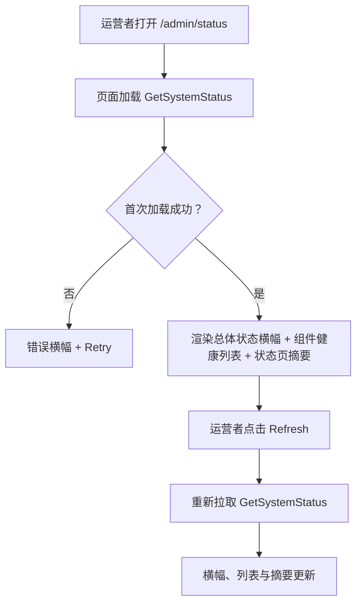
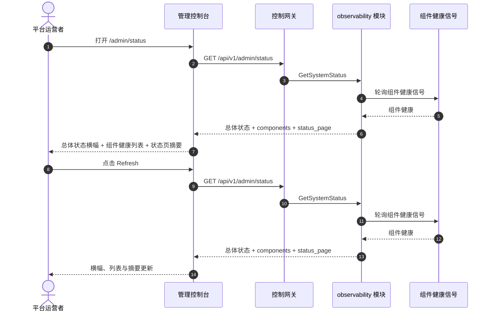

# 系统健康与服务状态 — 需求分析与 UI/UX 设计

| 属性 | 内容 |
| --- | --- |
| 特性点 | 系统健康与服务状态 — 平台组件健康（网关、gRPC 服务、MQ、PostgreSQL、Redis、控制器）、运行时长、依赖状态与状态页（backlog 第 30 行） |
| 文档范围 | 需求分析与 UI/UX 设计：`/admin/status` 管理面状态页（组件健康 + 运行时长 + 依赖状态），页面 → API 面映射表，以及编号验收标准 |
| 归属模块 | `observability`（对既有组件健康信号的新只读聚合），`pkg/server` 网关（管理前缀绑定），`web` 管理控制台（`SystemStatusPage`），`controller`（只读：控制器健康） |
| 相关文档 | [架构设计](./architecture.md) — 第 2.5 节 `metering`、第 3.1 节（管理面/用户面分离）· [模型可观测性仪表盘](./model-observability.zh-cn.md) — 姊妹只读聚合及其新鲜度约定 · [加速器清单与健康](./accelerator-inventory.zh-cn.md) — GPU 节点的姊妹健康面 · [控制台面分离](./console-surface-separation.zh-cn.md) — 本特性横跨的两个面、`AdminShell` 约定、掩码投影规则 |
| 状态 | 设计完成，已移交架构师代理 |

---

## 1. 背景与竞品调研

go-taas 运行一组平台组件 — 控制网关（`taas-server`）、gRPC 服务（auth、tenancy、model、metering、billing、infer、observability、notification、webhook 等）、消息队列（MQ）、PostgreSQL、Redis 与控制器。每个组件已暴露健康信号（就绪/存活检查），加速器清单特性（特性 #18）呈现 GPU 节点健康。控制台仍然无法回答运营者的第一个问题：*平台现在健康吗？* 没有任何单一面聚合每个组件的健康、显示运行时长并报告依赖状态。运营者必须逐个检查每个服务的日志或健康端点。

本特性新增**系统健康与服务状态**页面：平台组件健康（网关、gRPC 服务、MQ、PostgreSQL、Redis、控制器）、运行时长、依赖状态与状态页。它是**只读**聚合层 — 推理、计量或计费流水线没有任何变化。这是 Phase 4 生产化路线图项中最小可独立交付的增量：它把「平台在线吗？」变成「网关健康、PostgreSQL 健康、Redis 降级、控制器已运行 14 天」。

### 1.1 竞品的系统健康与状态呈现

| 产品 | 健康面 | 组件 | 运行时长 / 状态页 | 主要陷阱 |
| --- | --- | --- | --- | --- |
| **Datadog Infrastructure** | 带健康颜色编码的主机/容器地图与列表 | 主机、容器、进程 | 每主机运行时长；无公开状态页 | 重型 agent；健康按主机而非按服务 |
| **Grafana** | 查询数据源的仪表盘面板 | 任意数据源（SQL、Loki、Mimir、API） | 经面板的运行时长；无内置状态页 | 需要完整可观测性栈；仪表盘由用户构建 |
| **statuspage.io** | 带组件状态与事件的公开状态页 | 用户定义组件 | 运行时长历史；事件时间线 | 第三方 SaaS；组件手动维护 |
| **Kubernetes Dashboard** | 带状态徽章的节点与工作负载健康 | 节点、Pod、部署 | 每工作负载运行时长 | 运营者编排内部信息；非产品面 |
| **Consul / 服务网格** | 带状态的服务健康检查 | 服务、依赖 | 每服务运行时长 | 基础设施工具，非产品控制台 |

### 1.2 提炼出的模式与决策

值得采纳的模式：(1) **带状态徽章的组件健康列表** — Datadog 的颜色编码健康与 Kubernetes 的状态徽章映射到按组件状态列表；(2) **每组件运行时长** — Datadog 与 Consul 显示每主机/服务的运行时长；(3) **依赖状态** — Consul 的服务依赖检查显示组件的依赖（PostgreSQL、Redis、MQ）是否健康；(4) **状态页** — statuspage.io 的组件状态 + 事件时间线是规范的状态页模式；(5) **新鲜度标注** — last-checked 时间戳，因为健康信号是轮询而非流式；(6) **内联 SVG** — 控制台刻意依赖精简（usage-dashboard D7）。

需要避免的陷阱：把运营者编排内部信息（Pod 名、副本数）作为产品面（Kubernetes Dashboard）— 状态页显示组件健康，而非 Pod 内部信息；阻塞式 N+1 状态页（慢控制台陷阱）— 一个端点返回所有组件健康；重型第三方栈（Grafana、Datadog）— go-taas 必须在自己的控制台中拥有状态页；以及静默过期的健康 — last-checked 时间戳必须显式。

**go-taas 的决策**：

| # | 决策 | 依据 |
| --- | --- | --- |
| D1 | **系统状态仅存在于管理面。** 管理面（`/admin/status`、`/api/v1/admin/status/*`）是平台运营者的健康面 — 组件健康、运行时长、依赖状态与状态页。**无终端用户面**：租户看不到平台组件健康（这是运营者编排内部信息，特性 #17 的掩码投影规则） | 运营者需要一个单一健康面来回答「平台在线吗？」；租户需要自己的用量与成本，而非平台内部信息。这是刻意的仅管理面特性，与加速器清单（特性 #18）仅管理面一致 |
| D2 | **组件健康由既有健康信号聚合** — 每个组件的就绪/存活检查 — 聚合进单一只读端点。组件为网关（`taas-server`）、gRPC 服务（auth、tenancy、model、metering、billing、infer、observability、notification、webhook）、MQ、PostgreSQL、Redis 与控制器。每个组件报告 `status`（`healthy` / `degraded` / `unhealthy`）、`uptime_seconds`、`last_checked_at` 与 `dependencies[]`。 | 组件已暴露健康信号；在服务端聚合进一个端点保持负载小且客户端依赖精简，并避免 N+1 慢控制台 |
| D3 | **`observability` 模块新增一个 RPC `GetSystemStatus`**，而非扩展既有 RPC — 它在单次调用中返回组件健康列表、运行时长、依赖状态与状态页摘要 | 状态页需要多种形状（组件列表、运行时长、依赖、状态页摘要）；专用 RPC 把健康关注点从可观测性聚合面中分离出来并给它一个归属 |
| D4 | **状态页是组件健康的摘要** — 总体状态（`operational` / `degraded` / `outage`）、按组件状态列表与 last-checked 时间戳。它是 `GetSystemStatus` 返回的同一数据的只读视图；无独立的状态页数据存储 | statuspage.io 的组件状态是规范模式；从同一健康数据派生状态页避免第二个真相源 |
| D5 | **新鲜度显式**：每个响应携带 `last_checked_at`（最近一次健康轮询），控制台显示「last checked <time>」说明，并在轮询早于阈值（默认 60 秒）时显示过期标记 | 健康信号是轮询而非流式；last-checked 时间戳以零新流水线工作保持新鲜度故事诚实 |
| D6 | **状态页用内联 SVG 渲染** — 每组件一个状态徽章与简单运行时长条 — 无新图表依赖 | 控制台刻意依赖精简；小而可测试的 SVG 组件与 usage-dashboard D7 决策一致 |
| D7 | **status 块（11401–11499）新增错误码**：**11401 `CodeStatusComponentNotFound`**（未知组件 id）。无需范围校验（状态页是时点快照，非时间序列） | 系统状态是新关注点（D3），因此其错误码放在 cost 块（113xx）之后的全新块中；不同的 not-found 让「未知组件」可操作 |
| D8 | **系统状态是只读且仅对访问审计** — 它不写数据、不改变任何东西；页面仅对已认证的管理会话可达，且无状态变更被审计（没有可变更的东西） | 该特性是对既有健康信号的纯聚合；审计轨迹（特性 #15）已覆盖底层组件写入。无需新增审计事件 |

## 2. 目标与非目标

**目标**：一个管理面页面 `/admin/status`，显示总体状态、带状态徽章的按组件健康列表、每组件运行时长、依赖状态与状态页摘要（D1、D2、D3、D4、D5、D6）；页面 → API 面映射表，含精确前缀（D1）；每页交互状态，包括空、错误与权限拒绝；可在 Nightwatch 中针对 compose 栈测试的编号验收标准。

**非目标**：实时流式健康（轮询节奏不变）；事件管理或事件时间线（statuspage.io 的事件工作流不在范围内）；告警或阈值通知（特性 #26 在控制台内消费可观测性事件 — 此处不在范围内）；公开/终端用户状态页（D1 — 租户看不到平台内部信息）；暴露 Pod 名、副本数或其他运营者编排内部信息（D1）；对推理、计量或计费流水线的任何更改（只读特性）；新增审计事件（D8）。

## 3. 角色与旅程

| 角色 | 面 | 旅程 |
| --- | --- | --- |
| **平台运营者** | admin | 打开 `/admin/status` → 看到总体状态与按组件健康列表 → 发现 Redis 为 `degraded` → 看到其依赖状态与运行时长 → 调查 Redis 依赖 |
| **平台运营者（可靠性）** | admin | 租户报告失败 → 运营者打开 `/admin/status` → 看到网关为 `unhealthy` → 检查 last-checked 时间戳 → 调查网关服务 |
| **平台运营者（容量）** | admin | 观察组件运行时长 → 看到控制器已运行 14 天 → 检查状态页摘要 → 规划维护窗口 |

> 术语：消费侧调用方在英文中为 **Agent**，中文为「智能体」，与仓库约定一致。本特性仅管理面，因此消费侧术语不适用于租户面。

## 4. 功能需求

### FR1 — 管理面系统状态

- **FR1.1** `GetSystemStatus`（`GET /api/v1/admin/status`）返回平台组件健康：总体状态、按组件健康列表、运行时长、依赖状态与状态页摘要。它不接收范围参数（它是时点快照，D7）。
- **FR1.2** 响应的 `overall_status` 为 `operational` / `degraded` / `outage` 之一，服务端派生：所有组件 `healthy` 为 `operational`，任一组件 `degraded` 且无 `unhealthy` 为 `degraded`，任一组件 `unhealthy` 为 `outage`。
- **FR1.3** 响应的 `components[]` 携带每个组件一行：`component_id`、`component_name`、`component_type`（`gateway`、`grpc_service`、`mq`、`postgresql`、`redis`、`controller` 之一）、`status`（`healthy` / `degraded` / `unhealthy`）、`uptime_seconds`、`last_checked_at` 与 `dependencies[]`（每个带 `dependency_id`、`dependency_name`、`status`）。
- **FR1.4** 响应的 `status_page` 携带状态页摘要：`overall_status`、`last_checked_at` 与 `component_count`（报告的组件数）。

### FR2 — 面与 API 绑定

- **FR2.1** 系统状态页面位于**管理面**：路由 `/admin/status`，API 前缀 `/api/v1/admin/status/*`。它被加入 `AdminShell` 导航（特性 #17），名为「Status」。
- **FR2.2** 系统状态**无终端用户面**（D1）：租户看不到平台组件健康。管理面页面只调用 `/api/v1/admin/status/*` 路由，且不含 `/api/v1/*` 字符串（特性 #17、D1）。

## 5. UI 设计

### 5.1 页面：`/admin/status` — System Status（管理面）

**目的**：给平台运营者一个单一健康面 — 总体状态、按组件健康、运行时长、依赖状态与状态页摘要 — 以回答「平台在线吗？」。

**面**：admin — 路由 `/admin/status`，API `/api/v1/admin/status/*`。

**布局**：在 `AdminShell`（特性 #17）内渲染。页面头部（「System Status」，副标题「Platform component health」）带 **Refresh** 动作（次要）。下方：

1. **总体状态横幅** — 一个醒目的横幅显示总体状态（`Operational` / `Degraded` / `Outage`），带颜色编码徽章与「last checked <time>」新鲜度说明（D5）。
2. **组件健康列表** — 平台组件表格，列：**Component**（名称）、**Type**（gateway / gRPC service / MQ / PostgreSQL / Redis / controller）、**Status**（徽章）、**Uptime**、**Last checked**、**Dependencies**（依赖名与状态徽章的紧凑列表）。
3. **状态页摘要** — 显示状态页摘要的卡片：总体状态、last checked 与组件数（D4）。

**交互状态**：

| 状态 | 行为 |
| --- | --- |
| 默认 | 总体状态横幅 + 组件健康列表 + 状态页摘要从首次成功加载渲染；last-updated 显示加载时间 |
| 加载中 | 骨架表格；Refresh 禁用 |
| 空 | 「No component health data.」并提示健康信号在平台启动后出现；横幅保持可见 |
| 错误 | 错误横幅带消息与 Retry 按钮；页面保留最后的好数据并显示「Showing stale data」横幅 |
| 禁用 | 加载进行中 Refresh 禁用 |
| 权限拒绝 | 无所需角色的会话收到 10036，页面显示标准权限拒绝状态（特性 #17）带返回管理首页的链接 |

**组件健康列表列**：Component（名称）、Type、Status（徽章）、Uptime、Last checked、Dependencies（带状态徽章的紧凑列表）。可按 Component、Type、Status 与 Uptime 排序。不可过滤（列表是完整平台）；若组件数超过页大小则分页。

### 5.2 流程

## 6. API 面影响

系统状态 RPC 属于 **`observability` 模块**（D3），经控制网关以 HTTP 提供。路由在**管理前缀** `/api/v1/admin/status/*`（D1）。**无用户前缀绑定**（D1）。

| RPC | 路由 | 前缀 | 状态 | 目的 |
| --- | --- | --- | --- | --- |
| `GetSystemStatus` | `GET /api/v1/admin/status` | admin | **新增** | 总体状态 + 组件健康列表 + 运行时长 + 依赖 + 状态页摘要 |

**给架构师代理的契约说明**：

1. `GetSystemStatus` 不接收范围参数（它是时点快照，D7）。它返回 `overall_status`、`components[]` 与 `status_page`。
2. 每个组件携带 `component_id`、`component_name`、`component_type`、`status`、`uptime_seconds`、`last_checked_at` 与 `dependencies[]`。`overall_status` 服务端派生（D2）。
3. `status_page` 携带 `overall_status`、`last_checked_at` 与 `component_count`（D4）。
4. 每个响应携带 `last_checked_at` 用于新鲜度标记（D5）。
5. 聚合读取既有组件健康信号（就绪/存活检查）；它不写任何东西（D8）。
6. 线上约定不变：成功 HTTP 200，业务错误为 `{"code": <int>, "message": "..."}`，int64 字段序列化为 JSON 字符串。

错误码（status 块 11401–11499，`pkg/errors/codes.go`）：

| 条件 | 码 | 常量 | 说明 |
| --- | --- | --- | --- |
| 未知组件 id | 11401 | `CodeStatusComponentNotFound` | **新增**（D7） |
| 数据库 / 基础设施失败 | 500 | `CodeInternal` | 经错误归一化 |

## 7. 验收标准

| # | 标准 | 级别 |
| --- | --- | --- |
| AC1 | `GetSystemStatus` 返回总体状态、组件健康列表与状态页摘要；所有组件健康时 `overall_status` 为 `operational`，任一降级且无 unhealthy 时为 `degraded`，任一 unhealthy 时为 `outage` | FVT |
| AC2 | 每个组件携带 `component_id`、`component_name`、`component_type`、`status`、`uptime_seconds`、`last_checked_at` 与 `dependencies[]` | FVT |
| AC3 | `status_page` 携带 `overall_status`、`last_checked_at` 与 `component_count` | FVT |
| AC4 | `/admin/status` 页面从首次成功加载渲染总体状态横幅、组件健康列表与状态页摘要，带 last-updated 时间戳 | E2E |
| AC5 | 点击 Refresh 会重新拉取并重新渲染横幅、列表与摘要；「last checked <time>」新鲜度说明更新 | E2E |
| AC6 | 无数据匹配时渲染空状态（「No component health data.」）；失败加载保留最后的好数据并显示「Showing stale data」横幅与 Retry 动作 | E2E |
| AC7 | 系统状态页面只在管理面可达：路由 `/admin/status`，每个 API 调用使用 `/api/v1/admin/status/*` 前缀且无 `/api/v1/*` 字符串 | E2E（面分离） |
| AC8 | 无所需角色的会话在管理面状态页面收到 10036，页面显示标准权限拒绝状态 | E2E |

## 8. 范围外（在别处跟踪）

| 项 | 位置 |
| --- | --- |
| 实时流式健康 | 未来细化 — 轮询节奏不变 |
| 事件管理 / 事件时间线 | 未来细化 — statuspage.io 的事件工作流不在范围内 |
| 告警 / 阈值通知 | 特性 #26 在控制台内消费可观测性事件 — 此处不在范围内 |
| 公开/终端用户状态页 | 刻意缺失（D1）— 租户看不到平台内部信息 |
| 暴露 Pod 名、副本数或其他运营者编排内部信息 | 刻意缺失（D1） |
| 对推理、计量或计费流水线的任何更改 | 刻意缺失 — 只读特性（D8） |
| 状态访问的新增审计事件 | 刻意缺失 — 没有可变更的东西（D8） |