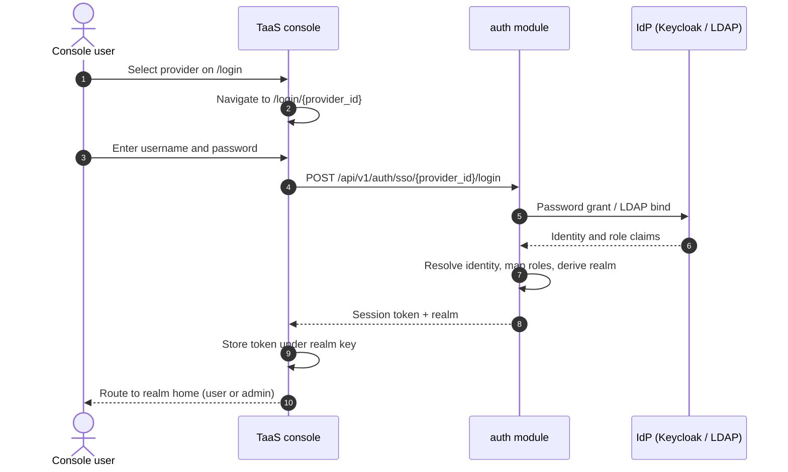
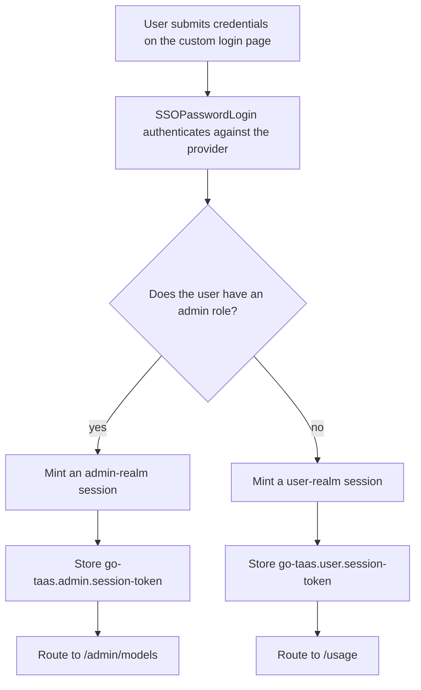
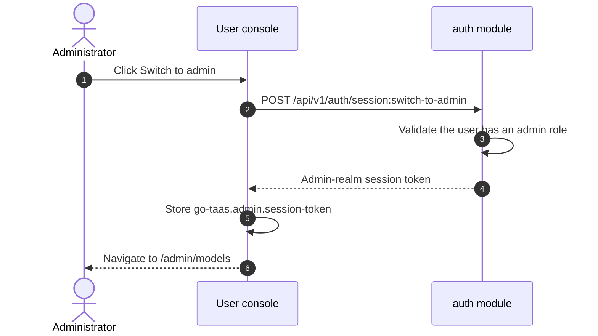

# Unified Login & Role-Based Routing — Requirement Analysis and UI/UX Design

| Attribute | Content |
| --- | --- |
| Feature point | Unified login & role-based routing — a TaaS custom login page (username/password against the selected provider), role-based routing to the user or admin surface after login, an admin switch button on user pages, and a Keycloak provider + `admin`/`admin` user seeded on compose startup (backlog row 22) |
| Document scope | Requirement analysis, competitive research, the custom login page and provider-selection design for both surfaces, role-based landing, the admin switch button, the Keycloak realm/provider seeding on compose startup, the page → API surface table, and numbered acceptance criteria |
| Owning modules | `web` (login pages, custom login form, role-based landing, admin switch button), `auth` (password-grant login, role-derived session realm, switch-surface session minting), `deploy/compose` (Keycloak realm-export.json seeding, provider seeding), `pkg/server` gateway (user-prefix and admin-prefix bindings) |
| Related documents | [Architecture Design](./architecture.md) — §2.1 `auth` (SSO federation, sessions), §3.1 admin/user surface separation · [SSO Federation & Account Binding](./sso-federation.md) — the IdP framework, `SSOAuthorize`/`SSOCallback`, identity binding, attribute-to-role mapping, sessions · [Console Surface Separation](./console-surface-separation.md) — the two surfaces, realm-pinned sessions, the login pages this feature replaces, the `10038 REALM_MISMATCH` rule · [Organization Members, Roles & Invitations](./org-members-rbac.md) — the roles the session carries and this feature routes on |
| Status | Design complete, handed to the Architect agent |

---

## 1. Background and Competitive Research

### 1.1 Why Unified Login & Role-Based Routing Comes Now

Features #7 and #17 shipped the platform's authentication spine: a pluggable IdP framework with `SSOAuthorize`/`SSOCallback`, sessions with a realm, and two console surfaces (`/...` user, `/admin/...` admin) with realm-pinned sessions. But the login experience still has three gaps that this feature closes:

1. **The login page is not TaaS-branded.** Today `/login` and `/admin/login` list SSO providers and redirect to the IdP-hosted login page (Keycloak). The console cannot style, validate, or localize that page, and the user leaves the product to authenticate.
2. **The landing surface is pinned by the entry point, not by the role.** The session realm is derived from the login route (feature #17 D3), so an administrator who signs in at `/login` lands on the user console and has no way to reach the admin console without signing in again at `/admin/login`. The product cannot answer "who is this person and which surface do they belong on".
3. **There is no surface switch after login.** An administrator who wants to use the user console (their own API keys, usage, playground) and then return to the admin console must sign in twice.

This feature adds: a **TaaS custom login page** (username/password against the selected provider, never the IdP-hosted page), **role-based routing** (after login the console lands on the user or admin surface by the user's role), an **admin switch button** on user pages, and a **Keycloak provider + `admin`/`admin` user seeded on compose startup** so the whole flow is verifiable end to end. It is the smallest independently valuable increment that turns "the console can authenticate" into "the console routes the right person to the right surface".

### 1.2 How Comparable Products Implement Unified Login & Role-Based Routing

| Product | Unified login | Role-based routing | Admin switch | Notable pitfalls |
| --- | --- | --- | --- | --- |
| **OpenAI Platform** | One login, one session | Surface chosen by role (owner / admin / member) | No explicit switch; role gates the navigation | A member with a stale role sees admin entries it cannot use; there is no way to prove from a request which surface produced it |
| **Anthropic Console** | One session per organization | Role-gated (owner / admin / developer / billing / user) | No switch; role gates | Role names collide with tenant roles; admin-only views are invisible to members |
| **GitHub** | One login | Organization role-based access | "Switch to admin" / organization admin area | Role changes sometimes need a re-authentication; the org switcher reloads the console |
| **GitLab** | One login | Role-based (owner / maintainer / developer) | A separate admin area for admins | The admin area is a separate navigation tree; role changes need a re-login |
| **Grafana** | One login | Role-based (Admin / Editor / Viewer) | "Switch to admin" for organization admins | Multiple organizations confuse; role changes need a re-login |
| **Kubernetes Dashboard** | Token / kubeconfig login | RBAC-based | No switch; RBAC governs | Token login is opaque; there is no self-service role change |

### 1.3 Distilled Patterns and Decisions

Patterns worth adopting:

1. **A custom-branded login form** — GitHub and GitLab own their login page; the console should too, so it can style, validate, and localize it and keep the user inside the product.
2. **Role-based landing** — OpenAI and Anthropic route the user to the surface their role grants; the entry point should not decide the landing.
3. **An admin switch** — GitHub and Grafana let an administrator move between the user and admin surfaces; the switch is the escape hatch that makes role-based landing usable.
4. **Password grant for a first-party IdP** — Keycloak's Direct Access Grants (OAuth2 resource-owner password grant) lets the console exchange a username/password for tokens directly, which is exactly what a custom login page needs. LDAP already supports a bind with a username/password.

Pitfalls to avoid:

- **A client-supplied role** — role-based routing must derive the realm from the authenticated identity server-side, never from a request field the browser could forge (the feature-#17 D3 lesson).
- **Leaking the other surface's session** — the switch must mint a session for the target realm and store it under that realm's key; it must never reuse or copy the source realm's token (feature #17 D4).
- **Storing credentials** — the custom login page exchanges the username/password with the IdP and never persists them (the feature-#7 "credentials in the console" pitfall).
- **SAML password grant** — SAML 2.0 has no password grant; a SAML provider cannot authenticate through a username/password form, so it keeps the redirect flow.

**Decisions for go-taas** (recorded rationale, per the autonomous-decision rule):

| # | Decision | Rationale |
| --- | --- | --- |
| D1 | **A TaaS custom login page via password grant.** A new `SSOPasswordLogin` RPC authenticates a username/password against the selected provider: OIDC via the OAuth2 resource-owner password grant (Keycloak Direct Access Grants), LDAP via a directory bind. SAML providers cannot do a password grant and keep the redirect flow (`SSOAuthorize`/`SSOCallback`). The console never stores the credentials; they are exchanged with the IdP and discarded | Pattern 1; the requirement is explicit that the login page must be TaaS-branded, not IdP-hosted. OIDC password grant and LDAP bind are the two protocols that accept a username/password; SAML has no such flow |
| D2 | **Role-derived session realm.** The session realm is derived from the user's role at login, not from the login route: a user whose roles include an admin role gets an `admin`-realm session, otherwise a `user`-realm session. This supersedes feature #17 D3 for the login flow. The realm is determined server-side from the authenticated identity — there is no request field to spoof | Pattern 2; the requirement is that the landing follows the role. Deriving the realm from the authenticated role is still auditable and still enforces surface separation, and it removes the "signed in at the wrong entry point" trap |
| D3 | **Role-based landing.** After login the console reads the session realm and routes: `admin` → `/admin/models`, `user` → `/usage`. A user who signs in at `/login` but has an admin role lands on the admin console, and vice versa | Pattern 2; the realm is the single source of truth for the landing, so the console needs no separate role check |
| D4 | **An admin switch button on user pages.** On the user console, a user whose session has an admin role sees a "Switch to admin" button. Clicking it calls a new `SwitchSurface` RPC that mints an admin-realm session (validated against the role), stores it under `go-taas.admin.session-token`, and navigates to `/admin/models`. Symmetrically, the admin console offers a "Switch to user console" control that mints a user-realm session and navigates to `/usage` | Pattern 3; the switch is the escape hatch that makes role-based landing usable. Each surface keeps its own session (feature #17 D4), so the switch mints a new session for the target realm rather than reusing the source token |
| D5 | **Keycloak seeding on compose startup.** `deploy/compose/keycloak/realm-export.json` gains an `admin`/`admin` user with an admin role, enables Direct Access Grants on the `go-taas-console` client, and adds a role protocol mapper so the admin role appears in the ID token. A seed mechanism creates the Keycloak OIDC provider row (issuer `http://keycloak:8080/realms/go-taas`, client `go-taas-console`, attribute mapping to the `admin` role) and the admin user's identity binding on startup | The requirement is explicit: compose startup must provide a Keycloak provider and an `admin`/`admin` user to manage the platform. Seeding the provider row and binding makes the flow verifiable end to end without manual configuration |
| D6 | **The admin-role set is configurable.** A user is an admin if any session role is in the configured admin-role set (default: `platform-admin`, `org-admin`, `admin`, `owner`). The set is a config value, not a constant | The roles come from feature #10's membership resolver and feature #7's attribute mapping; which roles count as "admin" is deployment policy, so it must be configurable |
| D7 | **Transitional mode is preserved.** Session-less access with `X-Organization-Id` keeps working on both prefixes (feature #17 D6); the login flow is the primary path, and the transitional banner remains | Removing the transitional path in the same iteration as the login change would break the existing e2e suites and the CLI; it is a follow-up hardening row |

### 1.4 Scope Boundary

**In scope**: the TaaS custom login page (username/password against the selected provider) on both surfaces; the `SSOPasswordLogin` RPC (OIDC password grant + LDAP bind); role-derived session realm and role-based landing; the admin switch button on user pages and the symmetric switch-to-user on admin pages; the `SwitchSurface` RPC; the Keycloak realm-export.json seeding (admin user, Direct Access Grants, role mapper) and the provider/binding seeding on compose startup; the page → API surface table; numbered acceptance criteria.

**Out of scope** (tracked elsewhere): SAML password grant (SAML has no such flow; SAML providers keep the redirect flow); self-service registration or password reset (feature #7 deferral); full RBAC enforcement across admin APIs (dedicated design); token rotation and Single Logout (feature #7 hardening); requiring a session on the admin prefix (feature #17 D6 hardening); a first-party local username/password account store (`Login`/`CreateUser` remain stubs — the custom login page authenticates against the selected IdP, not a local store).

---

## 2. Goals and Non-goals

**Goals**: a TaaS custom login page on both surfaces that authenticates a username/password against the selected provider (D1); a role-derived session realm and role-based landing (D2, D3); an admin switch button on user pages and a symmetric switch-to-user on admin pages (D4); Keycloak provider + `admin`/`admin` user seeded on compose startup (D5); the page → API surface table with exact prefixes; per-page interactive states including loading, empty, error, disabled, and permission-denied; numbered acceptance criteria testable in Nightwatch against the compose stack, including negative ones.

**Non-goals**: SAML password grant (D1); self-service registration or password reset; full RBAC enforcement across admin APIs; token rotation and Single Logout; requiring a session on the admin prefix; a first-party local account store; changing any data-plane (inference gateway) behaviour.

---

## 3. Personas and Journeys

| Role | Surface | Journey |
| --- | --- | --- |
| **Platform administrator** | admin | Signs in at `/login` → selects the Keycloak provider → enters `admin`/`admin` on the TaaS custom login page → the session is minted with the `admin` realm → lands on `/admin/models` → manages the platform |
| **Platform administrator (dual-surface)** | both | Signs in → lands on the admin console → uses "Switch to user console" to reach `/usage` and test their own API keys → uses the "Switch to admin" button on the user console to return to `/admin/models` |
| **Tenant developer** | end-user | Signs in at `/login` → selects the Keycloak provider → enters their credentials on the TaaS custom login page → the session is minted with the `user` realm → lands on `/usage` → creates an API key and consumes models |
| **Tenant administrator** | admin | Signs in → the session carries an admin role → lands on `/admin/models` → manages members, projects, and model grants |
| **Agent / SDK** | neither | Calls the inference endpoint with an API key; touches no control-plane page. It is unaffected by the login change |

> Terminology: the consumer-side caller is an **Agent** in English and 「智能体」 in Chinese, consistent with the repository convention.

---

## 4. Feature Requirements

### FR1 — Custom login page (password grant)

- **FR1.1** A new `SSOPasswordLogin` RPC authenticates a username/password against a selected provider: `POST /api/v1/auth/sso/{provider_id}/login` (user binding) and `POST /api/v1/admin/auth/sso/{provider_id}/login` (admin binding). The request body carries `username` and `password`; the response carries the session token, the session realm, and the expiry.
- **FR1.2** For an **OIDC** provider, the RPC performs the OAuth2 resource-owner password grant against the provider's token endpoint (Keycloak Direct Access Grants). For an **LDAP** provider, it performs a directory bind with the submitted DN/password. The credentials are used only for the exchange/bind and are never persisted (D1).
- **FR1.3** A **SAML** provider cannot authenticate through a password form; selecting a SAML provider on the login page keeps the redirect flow (`SSOAuthorize`/`SSOCallback`). The custom login page is offered only for OIDC and LDAP providers (D1).
- **FR1.4** On success the RPC resolves the identity (binding or JIT provisioning, feature #7 FR2.3), maps roles and orgs (feature #7 FR2.4), derives the session realm from the roles (D2), and issues a session. A disabled provider → 10022; unknown provider → 10021; wrong credentials → 10024; JIT disabled with no binding → 10025.

### FR2 — Role-derived session realm and role-based landing

- **FR2.1** The session realm is derived from the user's roles at login: if any role is in the configured admin-role set (D6), the realm is `admin`; otherwise it is `user`. This supersedes feature #17 D3 for the login flow (D2).
- **FR2.2** After login the console reads the session realm and routes: `admin` → `/admin/models`, `user` → `/usage` (D3). A user who signs in at `/login` but has an admin role lands on the admin console, and a non-admin who signs in at `/admin/login` lands on the user console.
- **FR2.3** The session token is stored under the realm-matching key: `go-taas.admin.session-token` for an `admin` realm, `go-taas.user.session-token` for a `user` realm (feature #17 D4). The console never stores a token under the other realm's key.

### FR3 — Admin switch button

- **FR3.1** On the user console, a user whose session has an admin role sees a **"Switch to admin"** button in the `UserShell` account block. A non-admin user does not see it (D4).
- **FR3.2** Clicking "Switch to admin" calls a new `SwitchSurface` RPC, `POST /api/v1/auth/session:switch-to-admin`, which validates that the current user has an admin role and mints an `admin`-realm session. The console stores the returned token under `go-taas.admin.session-token` and navigates to `/admin/models`.
- **FR3.3** Symmetrically, the admin console offers a **"Switch to user console"** control in the `AdminShell` account block. It calls `POST /api/v1/admin/auth/session:switch-to-user`, which mints a `user`-realm session; the console stores it under `go-taas.user.session-token` and navigates to `/usage`.
- **FR3.4** A user without an admin role who calls `switch-to-admin` receives a permission-denied error (10036) and the button is not rendered in the first place (FR3.1).

### FR4 — Keycloak seeding on compose startup

- **FR4.1** `deploy/compose/keycloak/realm-export.json` gains an `admin` user (`admin`/`admin`, email `admin@example.com`, enabled) with an admin role, enables `directAccessGrantsEnabled` on the `go-taas-console` client, and adds a role protocol mapper so the admin role appears in the ID token (D5).
- **FR4.2** On compose startup a seed mechanism creates the Keycloak OIDC provider row if it does not exist: `provider_id` `keycloak`, `type` `oidc`, `display_name` `Keycloak`, `issuer` `http://keycloak:8080/realms/go-taas`, `client_id` `go-taas-console`, `client_secret` `go-taas-console-secret`, `redirect_uri` `http://localhost:9091/api/v1/auth/sso/*`, `enabled` true, `allow_auto_provision` true, and an `attribute_mapping` that maps the Keycloak admin role claim to the TaaS `admin` role (D5, D6).
- **FR4.3** The seed also creates the `admin` user's identity binding (or relies on JIT provisioning plus the role mapping) so that signing in as `admin`/`admin` resolves to a TaaS user with the `admin` role.
- **FR4.4** The seed is idempotent: re-running compose startup does not duplicate the provider or the binding.

### FR5 — Login pages and provider selection

- **FR5.1** `/login` (user realm) lists enabled providers from `GET /api/v1/auth/sso/providers`; `/admin/login` (admin realm) lists them from `GET /api/v1/admin/auth/sso/providers`. Neither page calls the other realm's routes (feature #17 D8).
- **FR5.2** Selecting an OIDC or LDAP provider on a login page navigates to the TaaS custom login page for that provider: `/login/{provider_id}` (user) or `/admin/login/{provider_id}` (admin). Selecting a SAML provider keeps the redirect flow (FR1.3).
- **FR5.3** The custom login page posts the username/password to the realm's `SSOPasswordLogin` binding (FR1.1). On success it stores the token under the realm-matching key (FR2.3) and routes by realm (FR2.2).
- **FR5.4** Visiting a login page while holding a valid session of that realm redirects to that realm's home without showing the form (feature #17 FR3.5).

### FR6 — Interactive states and test hooks

- **FR6.1** Every page implements the six interactive states (default, loading, empty, error, disabled, permission-denied) with the copy given per page in §6.
- **FR6.2** Every control carries a `data-testid` in the console's `kebab-case` style (`sso-login-list`, `sso-login-{provider_id}`, `custom-login-form`, `custom-login-username`, `custom-login-password`, `custom-login-submit`, `switch-to-admin`, `switch-to-user`, …).
- **FR6.3** Error copy maps business codes to sentences (never a bare code), per the console's centralized mapping.

### FR7 — Surface and API binding

- **FR7.1** The login pages and custom login forms live on **both** surfaces: `/login` + `/login/{provider_id}` (user, `/api/v1/auth/*`), `/admin/login` + `/admin/login/{provider_id}` (admin, `/api/v1/admin/auth/*`).
- **FR7.2** The admin switch button lives on the **user** surface and calls `/api/v1/auth/session:switch-to-admin`; the switch-to-user control lives on the **admin** surface and calls `/api/v1/admin/auth/session:switch-to-user`.
- **FR7.3** No user-surface page contains the string `/api/v1/admin/` and no admin-surface page contains `/api/v1/` outside `/api/v1/admin/` (feature #17 D8).

---

## 5. Surface Assignment

| Feature | Surface | Web route | API prefix |
| --- | --- | --- | --- |
| Provider selection (login page) | both | `/login`, `/admin/login` | `/api/v1/auth/sso/providers`, `/api/v1/admin/auth/sso/providers` |
| Custom login form | both | `/login/{provider_id}`, `/admin/login/{provider_id}` | `/api/v1/auth/sso/{provider_id}/login`, `/api/v1/admin/auth/sso/{provider_id}/login` |
| Role-based landing | both | `/usage` (user), `/admin/models` (admin) | (session realm, no new call) |
| Admin switch button | user | in `UserShell` account block | `/api/v1/auth/session:switch-to-admin` |
| Switch to user console | admin | in `AdminShell` account block | `/api/v1/admin/auth/session:switch-to-user` |
| Keycloak provider seeding | deploy | n/a (compose startup) | n/a (seed mechanism) |

---

## 6. UI Design

### 6.1 Page: `/login` and `/admin/login` — provider selection

- **Purpose**: list the enabled identity providers and let the user pick one to authenticate against.
- **Surface**: both — `/login` (user, `/api/v1/auth/sso/providers`), `/admin/login` (admin, `/api/v1/admin/auth/sso/providers`).
- **Layout regions**: centered card — brand; `h1` "Sign in" (user) / "Admin sign in" (admin); subtitle; notice slot (`signin-notice`); provider button list (`sso-login-list`, one `sso-login-{provider_id}` button per enabled provider, label "Sign in with {display_name}"); footer hint "Signed-in sessions expire after 24 hours." (the configured `sessionTTL`).
- **Primary action**: "Sign in with {provider}" (`sso-login-{provider_id}`). **Secondary**: none.
- **Interactive states**:

| State | Trigger | Rendering |
| --- | --- | --- |
| default | providers loaded, not signed in | Provider buttons; the first enabled provider is focused |
| loading | provider list in flight | `Loading…` inside the card (`login-loading`) |
| empty | zero enabled providers | `login-no-providers`: "No sign-in providers are enabled. Ask your platform operator to configure one." |
| error | provider list failed | `ErrorBanner` (`login-error`) with the mapped copy and a "Retry" control |
| disabled | a sign-in is in flight | Buttons show "Signing in…" and are disabled (`login-signing-in`) |
| permission-denied | not applicable to a sign-in page; the realm states are explicit (a stored token of the other realm is never read here, feature #17 D4) | — |

- **Provider selection behaviour**: clicking an OIDC or LDAP provider navigates to `/login/{provider_id}` (user) or `/admin/login/{provider_id}` (admin) (FR5.2). Clicking a SAML provider calls `SSOAuthorize` and redirects to the IdP (FR1.3).

### 6.2 Page: `/login/{provider_id}` and `/admin/login/{provider_id}` — TaaS custom login

- **Purpose**: authenticate a username/password against the selected provider on a TaaS-branded page (never the IdP-hosted page).
- **Surface**: both — `/login/{provider_id}` (user, `/api/v1/auth/sso/{provider_id}/login`), `/admin/login/{provider_id}` (admin, `/api/v1/admin/auth/sso/{provider_id}/login`).
- **Layout regions**: centered card — brand; a back link to the provider list (`custom-login-back`, "All sign-in options"); the provider's display name; `h1` "Sign in to {display_name}"; notice slot (`custom-login-notice`); the username/password form (`custom-login-form`); footer hint "Your credentials are verified by {display_name} and are not stored by go-taas."
- **Primary action**: "Sign in" (`custom-login-submit`). **Secondary**: back to the provider list.
- **Form fields**:

| Field | Control | Validation | Error copy |
| --- | --- | --- | --- |
| `custom-login-username` | text, `autocomplete="username"` | required, 1–128 characters, trimmed | "Username is required." / "Username must be at most 128 characters." |
| `custom-login-password` | password, `autocomplete="current-password"` | required, 1–256 characters | "Password is required." |

- **Interactive states**:

| State | Trigger | Rendering |
| --- | --- | --- |
| default | form rendered, not submitting | Username focused; submit disabled until both fields are non-empty |
| loading | submitting | Submit shows "Signing in…" and is disabled (`custom-login-submitting`); both fields are disabled |
| empty | n/a (the form always has fields) | — |
| error | authentication failed | Inline error in the notice slot (`custom-login-error`) with the mapped copy; the form keeps the entered username |
| disabled | both fields not non-empty, or a submit in flight | Submit disabled (`custom-login-submit` disabled) |
| permission-denied | not applicable to an authentication page | — |

- **Error copy by code**: 10022 → "This identity provider is disabled. Ask your platform operator."; 10024 → "The username or password is incorrect."; 10025 → "This identity is not linked to a go-taas account. Ask your organization administrator for an invitation."; 10027 → "Sign-in did not complete. Try again."
- **Success behaviour** (FR1.4, FR2.2, FR2.3): on success the console stores the token under the realm-matching key (`go-taas.admin.session-token` or `go-taas.user.session-token`), clears the pending provider entry, `history.replaceState`s the query away, and routes by realm: `admin` → `/admin/models`, `user` → `/usage`.

### 6.3 Role-based landing

- **Purpose**: after login, land the user on the surface their role grants.
- **Behaviour**: the console reads the session realm (FR2.2) and routes: `admin` → `/admin/models`, `user` → `/usage`. No separate role check is needed — the realm is the single source of truth (D3).
- **Interactive states**: *loading* — the session call is in flight, the shell renders its loading state; *error* — a session failure redirects to the realm's login page with `?next=<path>&reason=expired` (feature #17 FR4.3); *permission-denied* — n/a (the realm already encodes the role).

### 6.4 Admin switch button (user console) and switch-to-user (admin console)

- **Purpose**: let an administrator move between the user and admin surfaces without signing in again.
- **Surface**: the switch-to-admin button lives in the `UserShell` account block (user surface, `/api/v1/auth/session:switch-to-admin`); the switch-to-user control lives in the `AdminShell` account block (admin surface, `/api/v1/admin/auth/session:switch-to-user`).
- **Layout**: in the account block, next to the signed-in username and role badge, a button labelled "Switch to admin" (`switch-to-admin`) on the user console, and "Switch to user console" (`switch-to-user`) on the admin console.
- **Interactive states**:

| State | Trigger | Rendering |
| --- | --- | --- |
| default | the session has an admin role (user console) / any session (admin console) | The switch button is visible |
| loading | a switch is in flight | The button shows "Switching…" and is disabled (`switch-in-flight`) |
| empty | n/a | — |
| error | the switch call failed | A notice in the account block (`switch-notice`) with the mapped copy; the user stays on the current surface |
| disabled | a switch is in flight | The button is disabled |
| permission-denied | the session has no admin role (user console) | The button is **not rendered** (FR3.1); a direct call to `switch-to-admin` without an admin role returns 10036 |

- **Success behaviour** (FR3.2, FR3.3): on success the console stores the returned token under the target realm's key and navigates: switch-to-admin → `go-taas.admin.session-token` + `/admin/models`; switch-to-user → `go-taas.user.session-token` + `/usage`.

### 6.5 Flow diagrams

---

## 7. API Surface Implications

All APIs belong to the existing **`taas.auth.v1.AuthService`** (proto: `proto/taas/auth/v1/auth.proto`), served as HTTP via the Control Gateway. The login flow is user-surface under `/api/v1/auth/*` and admin-surface under `/api/v1/admin/auth/*`; the switch RPCs are realm-pinned to the surface that hosts the button (D4, feature #17 D8).

| RPC | HTTP | Status | Purpose | Notes |
| --- | --- | --- | --- | --- |
| `SSOPasswordLogin` | `POST /api/v1/auth/sso/{provider_id}/login` | **new** | Authenticate username/password (user binding) | OIDC password grant / LDAP bind; mints a role-derived realm session |
| `SSOPasswordLogin` | `POST /api/v1/admin/auth/sso/{provider_id}/login` | **new** | Authenticate username/password (admin binding) | Same body and behaviour; realm still role-derived |
| `SwitchSurface` | `POST /api/v1/auth/session:switch-to-admin` | **new** | Mint an admin-realm session for the current user | Validated against the admin-role set; 10036 without an admin role |
| `SwitchSurface` | `POST /api/v1/admin/auth/session:switch-to-user` | **new** | Mint a user-realm session for the current user | Symmetric to switch-to-admin |
| `ListPublicSSOProviders` | `GET /api/v1/auth/sso/providers` | existing | The user login page's provider list | Reused (feature #17 D16) |
| `ListSSOProviders` | `GET /api/v1/admin/auth/sso/providers` | existing | The admin login page's provider list | Reused |
| `SSOAuthorize` / `SSOCallback` | `GET /api/v1/auth/sso/{provider}/authorize, callback` | existing | SAML redirect flow | Reused for SAML providers (FR1.3) |
| `GetSession` | `GET /api/v1/auth/session`, `/api/v1/admin/auth/session` | existing | The shell's session validation | Reused; returns the realm |
| `Logout` | `POST /api/v1/auth/logout`, `/api/v1/admin/auth/logout` | existing | Revoke a session | Reused |

Contract constraints:

1. The `SSOPasswordLogin` request body carries `username` and `password`; the response carries `session_token`, `realm`, and `expires_at`. The password is used only for the exchange/bind and is never persisted or echoed.
2. The session realm is derived from the authenticated role (D2), never from a request field. `GetSession` returns the realm so the console can route (FR2.2).
3. `SwitchSurface` requires an authenticated session of the source realm and returns a session token for the target realm. It is realm-pinned: `switch-to-admin` is only reachable on the user prefix, `switch-to-user` only on the admin prefix.
4. Wire-format conventions unchanged: success HTTP 200, business errors as `{"code": <int>, "message": "..."}`, int64 fields as JSON strings.

Error codes (auth block 10001–10099, `pkg/errors/codes.go`):

| Condition | Code | Constant | Notes |
| --- | --- | --- | --- |
| Unknown provider | 10021 | `CodeSSOProviderNotFound` | Existing; reused |
| Disabled provider on login | 10022 | `CodeSSOProviderDisabled` | Existing; reused |
| IdP rejected the exchange/bind | 10024 | `CodeSSOAuthFailed` | Existing; reused for wrong credentials |
| JIT disabled, no binding | 10025 | `CodeSSONoAccount` | Existing; reused |
| Missing/expired/revoked session | 10027 | `CodeSessionInvalid` | Existing; reused |
| Role not permitted (switch) | 10036 | `CodeForbidden` | Existing; reused for a non-admin switch |
| Realm mismatch | 10038 | `CodeRealmMismatch` | Existing; reused when a session is presented on the other realm's prefix |

---

## 8. Acceptance Criteria

Each `AC-n` is testable in Nightwatch against the real UI served by the compose stack (which now seeds the Keycloak provider and the `admin`/`admin` user, D5).

- **AC1** On compose startup, the Keycloak realm contains an `admin` user (`admin`/`admin`) and the TaaS login page lists a "Keycloak" provider button (`sso-login-keycloak`).
- **AC2** Selecting the Keycloak provider on `/login` navigates to `/login/keycloak` — the TaaS custom login page — and does **not** redirect to the Keycloak-hosted login page.
- **AC3** Submitting `admin`/`admin` on `/login/keycloak` authenticates, stores the token under `go-taas.admin.session-token`, and lands on `/admin/models`.
- **AC4** Submitting a non-admin user's credentials (e.g. `alice`/`alice-password`) on `/login/keycloak` stores the token under `go-taas.user.session-token` and lands on `/usage`.
- **AC5** Submitting invalid credentials on `/login/keycloak` shows the inline error "The username or password is incorrect." and stays on `/login/keycloak`.
- **AC6** The custom login form's submit button is disabled until both the username and password fields are non-empty.
- **AC7** An admin user on the user console sees a "Switch to admin" button (`switch-to-admin`); clicking it navigates to `/admin/models` and stores a token under `go-taas.admin.session-token`.
- **AC8** A non-admin user on the user console does **not** see the "Switch to admin" button.
- **AC9** The admin console offers a "Switch to user console" control (`switch-to-user`); clicking it navigates to `/usage` and stores a token under `go-taas.user.session-token`.
- **AC10** An admin user who signs in at `/admin/login` lands on `/admin/models` (role-based landing, not entry-point-based).
- **AC11** A non-admin user who signs in at `/admin/login` lands on `/usage` (role-based landing).
- **AC12** The user console's session token is stored under `go-taas.user.session-token` and the admin console's under `go-taas.admin.session-token`; no page reads the other realm's key (feature #17 D4).
- **AC13** A disabled provider is not listed on the login page; if a provider is disabled after the page loaded, selecting it shows the "This identity provider is disabled." error.
- **AC14** The custom login page's footer states that credentials are verified by the provider and not stored by go-taas.