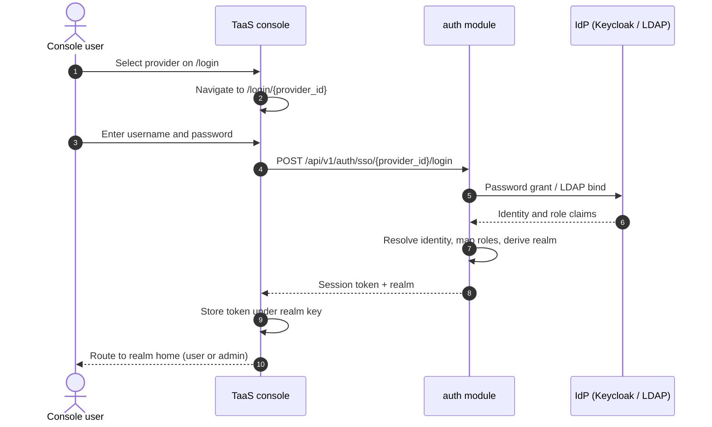
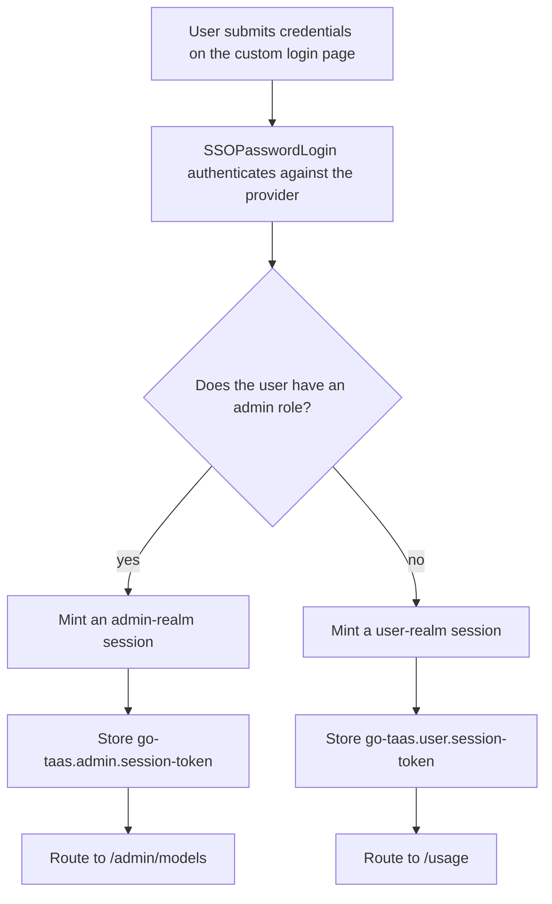
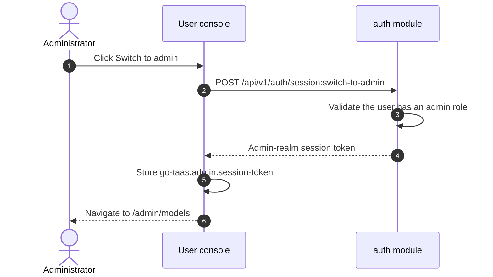

# 统一登录与基于角色的路由 — 需求分析与 UI/UX 设计

| 属性 | 内容 |
| --- | --- |
| 功能点 | 统一登录与基于角色的路由 — 面向所选身份提供商的 TaaS 自定义登录页（用户名/密码）、登录后按角色路由到用户或管理端、用户页上的「切换到管理端」按钮，以及在 compose 启动时预置 Keycloak 提供商与 `admin`/`admin` 用户（backlog 第 22 行） |
| 文档范围 | 需求分析、竞品调研、两个控制台的自定义登录页与提供商选择设计、基于角色的落地页、管理端切换按钮、compose 启动时的 Keycloak realm/提供商预置、页面 → API 表面映射表，以及编号验收标准 |
| 归属模块 | `web`（登录页、自定义登录表单、基于角色的落地、管理端切换按钮）、`auth`（密码授权登录、基于角色的会话 realm、切换表面的会话铸造）、`deploy/compose`（Keycloak realm-export.json 预置、提供商预置）、`pkg/server` 网关（用户前缀与管理端前缀绑定） |
| 相关文档 | [架构设计](./architecture.md) — §2.1 `auth`（SSO 联邦、会话）、§3.1 管理端/用户表面分离 · [SSO 联邦与账号绑定](./sso-federation.md) — IdP 框架、`SSOAuthorize`/`SSOCallback`、身份绑定、属性到角色映射、会话 · [控制台表面分离](./console-surface-separation.md) — 两个表面、realm 固定的会话、本功能替换的登录页、`10038 REALM_MISMATCH` 规则 · [组织成员、角色与邀请](./org-members-rbac.md) — 会话携带的、本功能据此路由的角色 |
| 状态 | 设计完成，已移交给架构师智能体 |

---

## 1. 背景与竞品调研

### 1.1 为什么现在做统一登录与基于角色的路由

功能 #7 与 #17 交付了平台的身份认证主干：可插拔的 IdP 框架（`SSOAuthorize`/`SSOCallback`）、带 realm 的会话，以及两个控制台表面（`/...` 用户、`/admin/...` 管理端）与 realm 固定的会话。但登录体验仍有三个本功能要关闭的缺口：

1. **登录页不是 TaaS 品牌化的。** 今天 `/login` 与 `/admin/login` 列出 SSO 提供商并重定向到 IdP 托管的登录页（Keycloak）。控制台无法对该页做样式、校验或本地化，用户必须离开产品去认证。
2. **落地表面由入口点决定，而非由角色决定。** 会话 realm 由登录路由派生（功能 #17 D3），因此在 `/login` 登录的管理员会落到用户控制台，若不再次在 `/admin/login` 登录就无法到达管理端。产品无法回答「这个人是谁、他该属于哪个表面」。
3. **登录后没有表面切换。** 想使用用户控制台（自己的 API Key、用量、Playground）再返回管理端的管理员必须登录两次。

本功能新增：**TaaS 自定义登录页**（针对所选提供商使用用户名/密码，绝不用 IdP 托管的页面）、**基于角色的路由**（登录后控制台按用户角色落到用户或管理端表面）、用户页上的**管理端切换按钮**，以及在 compose 启动时预置的 **Keycloak 提供商与 `admin`/`admin` 用户**，使整个流程可端到端验证。这是把「控制台能认证」变成「控制台把对的人路由到对的表面」的最小独立增值增量。

### 1.2 可比产品如何实现统一登录与基于角色的路由

| 产品 | 统一登录 | 基于角色的路由 | 管理端切换 | 常见坑 |
| --- | --- | --- | --- | --- |
| **OpenAI Platform** | 一次登录、一个会话 | 按角色选择表面（owner / admin / member） | 无显式切换；角色控制导航 | 角色过期的成员会看到用不了的 admin 条目；无法从请求证明它来自哪个表面 |
| **Anthropic Console** | 每个组织一个会话 | 按角色门控（owner / admin / developer / billing / user） | 无切换；角色门控 | 角色名与租户角色冲突；仅管理员可见的视图对成员不可见 |
| **GitHub** | 一次登录 | 组织角色级访问 | 「切换到 admin」/ 组织管理区 | 角色变更有时需要重新认证；组织切换器会重载控制台 |
| **GitLab** | 一次登录 | 按角色（owner / maintainer / developer） | 管理员有独立管理区 | 管理区是独立的导航树；角色变更需要重新登录 |
| **Grafana** | 一次登录 | 按角色（Admin / Editor / Viewer） | 组织管理员可「切换到 admin」 | 多组织易混淆；角色变更需要重新登录 |
| **Kubernetes Dashboard** | Token / kubeconfig 登录 | 基于 RBAC | 无切换；由 RBAC 治理 | Token 登录不透明；没有自助角色变更 |

### 1.3 提炼的模式与决策

值得采纳的模式：

1. **自定义品牌化的登录表单** — GitHub 与 GitLab 拥有自己的登录页；控制台也应如此，以便做样式、校验、本地化，并让用户留在产品内。
2. **基于角色的落地** — OpenAI 与 Anthropic 把用户路由到其角色授予的表面；落地不应由入口点决定。
3. **管理端切换** — GitHub 与 Grafana 让管理员在用户表面与管理端表面之间移动；切换是让基于角色的落地可用的逃生口。
4. **面向第一方 IdP 的密码授权** — Keycloak 的 Direct Access Grants（OAuth2 资源所有者密码授权）让控制台直接用用户名/密码换取 token，这正是自定义登录页所需的。LDAP 本身已支持用用户名/密码做 bind。

要避免的坑：

- **客户端提供的角色** — 基于角色的路由必须由服务端从已认证身份派生 realm，绝不能来自浏览器可伪造的请求字段（功能 #17 D3 的教训）。
- **泄漏另一表面的会话** — 切换必须为目标 realm 铸造会话并存入该 realm 的 key 下；绝不能复用或复制源 realm 的 token（功能 #17 D4）。
- **存储凭据** — 自定义登录页把用户名/密码交给 IdP 交换，绝不持久化（功能 #7「控制台内凭据」的坑）。
- **SAML 密码授权** — SAML 2.0 没有密码授权；SAML 提供商无法通过用户名/密码表单认证，因此保留重定向流程。

**go-taas 的决策**（按自主决策规则记录理由）：

| # | 决策 | 理由 |
| --- | --- | --- |
| D1 | **通过密码授权实现 TaaS 自定义登录页。** 新增 `SSOPasswordLogin` RPC，针对所选提供商认证用户名/密码：OIDC 走 OAuth2 资源所有者密码授权（Keycloak Direct Access Grants），LDAP 走目录 bind。SAML 提供商无法做密码授权，保留重定向流程（`SSOAuthorize`/`SSOCallback`）。控制台绝不存储凭据；凭据交给 IdP 交换后即丢弃 | 模式 1；需求明确要求登录页必须是 TaaS 品牌化的，而非 IdP 托管。OIDC 密码授权与 LDAP bind 是两种接受用户名/密码的协议；SAML 没有此类流程 |
| D2 | **基于角色的会话 realm。** 会话 realm 在登录时由用户角色派生，而非由登录路由派生：角色含管理角色的用户得到 `admin` realm 会话，否则得到 `user` realm 会话。这取代了登录流程上的功能 #17 D3。realm 由服务端从已认证身份决定——没有可伪造的请求字段 | 模式 2；需求要求落地跟随角色。从已认证角色派生 realm 仍可审计、仍强制表面分离，并消除了「在错误的入口点登录」的陷阱 |
| D3 | **基于角色的落地。** 登录后控制台读取会话 realm 并路由：`admin` → `/admin/models`，`user` → `/usage`。在 `/login` 登录但具有管理角色的用户会落到管理端，反之亦然 | 模式 2；realm 是落地的唯一事实来源，因此控制台无需单独的二次角色检查 |
| D4 | **用户页上的管理端切换按钮。** 在用户控制台上，会话具有管理角色的用户会看到「切换到管理端」按钮。点击后调用新的 `SwitchSurface` RPC，铸造一个 admin realm 会话（按角色校验），存入 `go-taas.admin.session-token`，并导航到 `/admin/models`。对称地，管理端控制台提供「切换到用户控制台」控件，铸造 user realm 会话并导航到 `/usage` | 模式 3；切换是让基于角色的落地可用的逃生口。每个表面保留自己的会话（功能 #17 D4），因此切换为目标 realm 铸造新会话，而非复用源 token |
| D5 | **compose 启动时预置 Keycloak。** `deploy/compose/keycloak/realm-export.json` 新增 `admin`/`admin` 用户并带管理角色，在 `go-taas-console` 客户端上启用 Direct Access Grants，并添加角色协议映射器使管理角色出现在 ID token 中。启动时由预置机制创建 Keycloak OIDC 提供商行（issuer `http://keycloak:8080/realms/go-taas`、客户端 `go-taas-console`、映射到 `admin` 角色的属性映射）以及 admin 用户的身份绑定 | 需求明确要求 compose 启动必须提供 Keycloak 提供商与 `admin`/`admin` 用户来管理平台。预置提供商行与绑定使流程无需手工配置即可端到端验证 |
| D6 | **管理角色集合可配置。** 若任一会话角色在配置的管理角色集合中（默认：`platform-admin`、`org-admin`、`admin`、`owner`），则该用户是管理员。该集合是配置值，不是常量 | 角色来自功能 #10 的成员解析器与功能 #7 的属性映射；哪些角色算「管理」是部署策略，因此必须可配置 |
| D7 | **保留过渡模式。** 无会话、带 `X-Organization-Id` 的访问在两个前缀上继续可用（功能 #17 D6）；登录流程是主路径，过渡横幅保留 | 在与登录变更同一迭代移除过渡路径会破坏现有 e2e 套件与 CLI；这是后续加固行 |

### 1.4 范围边界

**范围内**：两个表面上的 TaaS 自定义登录页（针对所选提供商使用用户名/密码）；`SSOPasswordLogin` RPC（OIDC 密码授权 + LDAP bind）；基于角色的会话 realm 与基于角色的落地；用户页上的管理端切换按钮与管理端上对称的切换到用户；`SwitchSurface` RPC；Keycloak realm-export.json 预置（admin 用户、Direct Access Grants、角色映射器）与 compose 启动时的提供商/绑定预置；页面 → API 表面映射表；编号验收标准。

**范围外**（另行跟踪）：SAML 密码授权（SAML 无此类流程；SAML 提供商保留重定向流程）；自助注册或密码重置（功能 #7 延后）；跨管理 API 的完整 RBAC 强制（专门设计）；token 轮换与单点登出（功能 #7 加固）；在管理端前缀上强制要求会话（功能 #17 D6 加固）；第一方本地用户名/密码账号库（`Login`/`CreateUser` 仍是桩——自定义登录页针对所选 IdP 认证，而非本地库）。

---

## 2. 目标与非目标

**目标**：两个表面上的 TaaS 自定义登录页，针对所选提供商认证用户名/密码（D1）；基于角色的会话 realm 与基于角色的落地（D2、D3）；用户页上的管理端切换按钮与管理端上对称的切换到用户（D4）；compose 启动时预置 Keycloak 提供商与 `admin`/`admin` 用户（D5）；带精确前缀的页面 → API 表面映射表；包含 loading、empty、error、disabled、permission-denied 的逐页交互状态；可在 Nightwatch 中针对 compose 栈验证的编号验收标准，含负向用例。

**非目标**：SAML 密码授权（D1）；自助注册或密码重置；跨管理 API 的完整 RBAC 强制；token 轮换与单点登出；在管理端前缀上强制要求会话；第一方本地账号库；改变任何数据面（推理网关）行为。

---

## 3. 角色与旅程

| 角色 | 表面 | 旅程 |
| --- | --- | --- |
| **平台管理员** | 管理端 | 在 `/login` 登录 → 选择 Keycloak 提供商 → 在 TaaS 自定义登录页输入 `admin`/`admin` → 会话以 `admin` realm 铸造 → 落到 `/admin/models` → 管理平台 |
| **平台管理员（双表面）** | 两者 | 登录 → 落到管理端控制台 → 用「切换到用户控制台」到达 `/usage` 测试自己的 API Key → 用用户控制台上的「切换到管理端」按钮返回 `/admin/models` |
| **租户开发者** | 用户端 | 在 `/login` 登录 → 选择 Keycloak 提供商 → 在 TaaS 自定义登录页输入凭据 → 会话以 `user` realm 铸造 → 落到 `/usage` → 创建 API Key 并消费模型 |
| **租户管理员** | 管理端 | 登录 → 会话携带管理角色 → 落到 `/admin/models` → 管理成员、项目与模型授权 |
| **智能体 / SDK** | 两者皆非 | 用 API Key 调用推理端点；不触碰控制面页面。不受登录变更影响 |

> 术语：消费侧调用方英文为 **Agent**，中文为「**智能体**」，与仓库约定一致。

---

## 4. 功能需求

### FR1 — 自定义登录页（密码授权）

- **FR1.1** 新增 `SSOPasswordLogin` RPC，针对所选提供商认证用户名/密码：`POST /api/v1/auth/sso/{provider_id}/login`（用户绑定）与 `POST /api/v1/admin/auth/sso/{provider_id}/login`（管理端绑定）。请求体携带 `username` 与 `password`；响应携带会话 token、会话 realm 与过期时间。
- **FR1.2** 对 **OIDC** 提供商，RPC 针对提供商的 token 端点执行 OAuth2 资源所有者密码授权（Keycloak Direct Access Grants）。对 **LDAP** 提供商，用提交的 DN/密码执行目录 bind。凭据仅用于交换/bind，绝不持久化（D1）。
- **FR1.3** **SAML** 提供商无法通过密码表单认证；在登录页选择 SAML 提供商时保留重定向流程（`SSOAuthorize`/`SSOCallback`）。自定义登录页仅对 OIDC 与 LDAP 提供商提供（D1）。
- **FR1.4** 成功后 RPC 解析身份（绑定或 JIT 预置，功能 #7 FR2.3）、映射角色与组织（功能 #7 FR2.4）、由角色派生会话 realm（D2）并铸造会话。提供商被禁用 → 10022；未知提供商 → 10021；凭据错误 → 10024；JIT 关闭且无绑定 → 10025。

### FR2 — 基于角色的会话 realm 与基于角色的落地

- **FR2.1** 会话 realm 在登录时由用户角色派生：若任一角色在配置的管理角色集合中（D6），realm 为 `admin`；否则为 `user`。这取代了登录流程上的功能 #17 D3（D2）。
- **FR2.2** 登录后控制台读取会话 realm 并路由：`admin` → `/admin/models`，`user` → `/usage`（D3）。在 `/login` 登录但具有管理角色的用户落到管理端控制台，在 `/admin/login` 登录但非管理员的用户落到用户控制台。
- **FR2.3** 会话 token 存入与 realm 匹配的 key：`admin` realm 存 `go-taas.admin.session-token`，`user` realm 存 `go-taas.user.session-token`（功能 #17 D4）。控制台绝不把 token 存入另一 realm 的 key。

### FR3 — 管理端切换按钮

- **FR3.1** 在用户控制台上，会话具有管理角色的用户会在 `UserShell` 账号块看到**「切换到管理端」**按钮。非管理员用户看不到它（D4）。
- **FR3.2** 点击「切换到管理端」调用新的 `SwitchSurface` RPC `POST /api/v1/auth/session:switch-to-admin`，该校验当前用户具有管理角色并铸造 `admin` realm 会话。控制台把返回的 token 存入 `go-taas.admin.session-token` 并导航到 `/admin/models`。
- **FR3.3** 对称地，管理端控制台在 `AdminShell` 账号块提供**「切换到用户控制台」**控件。它调用 `POST /api/v1/admin/auth/session:switch-to-user`，铸造 `user` realm 会话；控制台把它存入 `go-taas.user.session-token` 并导航到 `/usage`。
- **FR3.4** 无管理角色却调用 `switch-to-admin` 的用户会收到权限拒绝错误（10036），且按钮本就不会渲染（FR3.1）。

### FR4 — compose 启动时预置 Keycloak

- **FR4.1** `deploy/compose/keycloak/realm-export.json` 新增 `admin` 用户（`admin`/`admin`、邮箱 `admin@example.com`、启用）并带管理角色，在 `go-taas-console` 客户端上启用 `directAccessGrantsEnabled`，并添加角色协议映射器使管理角色出现在 ID token 中（D5）。
- **FR4.2** compose 启动时由预置机制创建 Keycloak OIDC 提供商行（若不存在）：`provider_id` `keycloak`、`type` `oidc`、`display_name` `Keycloak`、`issuer` `http://keycloak:8080/realms/go-taas`、`client_id` `go-taas-console`、`client_secret` `go-taas-console-secret`、`redirect_uri` `http://localhost:9091/api/v1/auth/sso/*`、`enabled` true、`allow_auto_provision` true，以及把 Keycloak 管理角色声明映射到 TaaS `admin` 角色的 `attribute_mapping`（D5、D6）。
- **FR4.3** 预置还创建 `admin` 用户的身份绑定（或依赖 JIT 预置加角色映射），使以 `admin`/`admin` 登录能解析为带 `admin` 角色的 TaaS 用户。
- **FR4.4** 预置是幂等的：重复运行 compose 启动不会重复创建提供商或绑定。

### FR5 — 登录页与提供商选择

- **FR5.1** `/login`（用户 realm）从 `GET /api/v1/auth/sso/providers` 列出启用的提供商；`/admin/login`（管理端 realm）从 `GET /api/v1/admin/auth/sso/providers` 列出。两个页面都不调用另一 realm 的路由（功能 #17 D8）。
- **FR5.2** 在登录页选择 OIDC 或 LDAP 提供商时，导航到该提供商的 TaaS 自定义登录页：`/login/{provider_id}`（用户）或 `/admin/login/{provider_id}`（管理端）。选择 SAML 提供商时保留重定向流程（FR1.3）。
- **FR5.3** 自定义登录页把用户名/密码提交到该 realm 的 `SSOPasswordLogin` 绑定（FR1.1）。成功后把 token 存入与 realm 匹配的 key（FR2.3）并按 realm 路由（FR2.2）。
- **FR5.4** 持有该 realm 有效会话时访问登录页，会重定向到该 realm 的首页而不显示表单（功能 #17 FR3.5）。

### FR6 — 交互状态与测试钩子

- **FR6.1** 每个页面实现六种交互状态（default、loading、empty、error、disabled、permission-denied），文案见 §6 各页。
- **FR6.2** 每个控件携带控制台 `kebab-case` 风格的 `data-testid`（`sso-login-list`、`sso-login-{provider_id}`、`custom-login-form`、`custom-login-username`、`custom-login-password`、`custom-login-submit`、`switch-to-admin`、`switch-to-user` 等）。
- **FR6.3** 错误文案把业务码映射为句子（绝不裸显码），遵循控制台集中式映射。

### FR7 — 表面与 API 绑定

- **FR7.1** 登录页与自定义登录表单位于**两个**表面：`/login` + `/login/{provider_id}`（用户，`/api/v1/auth/*`）、`/admin/login` + `/admin/login/{provider_id}`（管理端，`/api/v1/admin/auth/*`）。
- **FR7.2** 管理端切换按钮位于**用户**表面并调用 `/api/v1/auth/session:switch-to-admin`；切换到用户控件位于**管理端**表面并调用 `/api/v1/admin/auth/session:switch-to-user`。
- **FR7.3** 用户表面页面不含字符串 `/api/v1/admin/`，管理端表面页面不含 `/api/v1/admin/` 之外的 `/api/v1/`（功能 #17 D8）。

---

## 5. 表面分配

| 功能 | 表面 | Web 路由 | API 前缀 |
| --- | --- | --- | --- |
| 提供商选择（登录页） | 两者 | `/login`、`/admin/login` | `/api/v1/auth/sso/providers`、`/api/v1/admin/auth/sso/providers` |
| 自定义登录表单 | 两者 | `/login/{provider_id}`、`/admin/login/{provider_id}` | `/api/v1/auth/sso/{provider_id}/login`、`/api/v1/admin/auth/sso/{provider_id}/login` |
| 基于角色的落地 | 两者 | `/usage`（用户）、`/admin/models`（管理端） | （会话 realm，无新调用） |
| 管理端切换按钮 | 用户 | `UserShell` 账号块内 | `/api/v1/auth/session:switch-to-admin` |
| 切换到用户控制台 | 管理端 | `AdminShell` 账号块内 | `/api/v1/admin/auth/session:switch-to-user` |
| Keycloak 提供商预置 | 部署 | 不适用（compose 启动） | 不适用（预置机制） |

---

## 6. UI 设计

### 6.1 页面：`/login` 与 `/admin/login` — 提供商选择

- **目的**：列出启用的身份提供商，让用户选择其一进行认证。
- **表面**：两者 — `/login`（用户，`/api/v1/auth/sso/providers`）、`/admin/login`（管理端，`/api/v1/admin/auth/sso/providers`）。
- **布局区域**：居中卡片 — 品牌；`h1`「Sign in」（用户）/「Admin sign in」（管理端）；副标题；通知槽（`signin-notice`）；提供商按钮列表（`sso-login-list`，每个启用提供商一个 `sso-login-{provider_id}` 按钮，标签「Sign in with {display_name}」）；页脚提示「Signed-in sessions expire after 24 hours.」（配置的 `sessionTTL`）。
- **主操作**：「Sign in with {provider}」（`sso-login-{provider_id}`）。**次操作**：无。
- **交互状态**：

| 状态 | 触发 | 渲染 |
| --- | --- | --- |
| default | 提供商已加载、未登录 | 提供商按钮；聚焦第一个启用的提供商 |
| loading | 提供商列表加载中 | 卡片内 `Loading…`（`login-loading`） |
| empty | 零个启用提供商 | `login-no-providers`：「No sign-in providers are enabled. Ask your platform operator to configure one.」 |
| error | 提供商列表失败 | `ErrorBanner`（`login-error`），带映射文案与「Retry」控件 |
| disabled | 登录进行中 | 按钮显示「Signing in…」并禁用（`login-signing-in`） |
| permission-denied | 不适用于登录页；realm 状态是显式的（此处绝不读取另一 realm 的已存 token，功能 #17 D4） | — |

- **提供商选择行为**：点击 OIDC 或 LDAP 提供商时导航到 `/login/{provider_id}`（用户）或 `/admin/login/{provider_id}`（管理端）（FR5.2）。点击 SAML 提供商时调用 `SSOAuthorize` 并重定向到 IdP（FR1.3）。

### 6.2 页面：`/login/{provider_id}` 与 `/admin/login/{provider_id}` — TaaS 自定义登录

- **目的**：在 TaaS 品牌化的页面上针对所选提供商认证用户名/密码（绝不用 IdP 托管的页面）。
- **表面**：两者 — `/login/{provider_id}`（用户，`/api/v1/auth/sso/{provider_id}/login`）、`/admin/login/{provider_id}`（管理端，`/api/v1/admin/auth/sso/{provider_id}/login`）。
- **布局区域**：居中卡片 — 品牌；返回提供商列表的链接（`custom-login-back`，「All sign-in options」）；提供商的显示名；`h1`「Sign in to {display_name}」；通知槽（`custom-login-notice`）；用户名/密码表单（`custom-login-form`）；页脚提示「Your credentials are verified by {display_name} and are not stored by go-taas.」
- **主操作**：「Sign in」（`custom-login-submit`）。**次操作**：返回提供商列表。
- **表单字段**：

| 字段 | 控件 | 校验 | 错误文案 |
| --- | --- | --- | --- |
| `custom-login-username` | 文本，`autocomplete="username"` | 必填，1–128 字符，去首尾空白 | 「Username is required.」/「Username must be at most 128 characters.」 |
| `custom-login-password` | 密码，`autocomplete="current-password"` | 必填，1–256 字符 | 「Password is required.」 |

- **交互状态**：

| 状态 | 触发 | 渲染 |
| --- | --- | --- |
| default | 表单已渲染、未提交 | 聚焦用户名；两个字段都非空前提交按钮禁用 |
| loading | 提交中 | 提交按钮显示「Signing in…」并禁用（`custom-login-submitting`）；两个字段都禁用 |
| empty | 不适用（表单总有字段） | — |
| error | 认证失败 | 通知槽内联错误（`custom-login-error`），带映射文案；表单保留已输入的用户名 |
| disabled | 两个字段未都非空，或提交进行中 | 提交按钮禁用（`custom-login-submit` 禁用） |
| permission-denied | 不适用于认证页 | — |

- **按码错误文案**：10022 →「This identity provider is disabled. Ask your platform operator.」；10024 →「The username or password is incorrect.」；10025 →「This identity is not linked to a go-taas account. Ask your organization administrator for an invitation.」；10027 →「Sign-in did not complete. Try again.」
- **成功行为**（FR1.4、FR2.2、FR2.3）：成功后控制台把 token 存入与 realm 匹配的 key（`go-taas.admin.session-token` 或 `go-taas.user.session-token`）、清除待处理的提供商条目、用 `history.replaceState` 清掉查询串，并按 realm 路由：`admin` → `/admin/models`，`user` → `/usage`。

### 6.3 基于角色的落地

- **目的**：登录后把用户落到其角色授予的表面。
- **行为**：控制台读取会话 realm（FR2.2）并路由：`admin` → `/admin/models`，`user` → `/usage`。无需单独的二次角色检查——realm 是唯一事实来源（D3）。
- **交互状态**：*loading* — 会话调用进行中，外壳渲染其加载状态；*error* — 会话失败重定向到该 realm 的登录页并带 `?next=<path>&reason=expired`（功能 #17 FR4.3）；*permission-denied* — 不适用（realm 已编码角色）。

### 6.4 管理端切换按钮（用户控制台）与切换到用户（管理端控制台）

- **目的**：让管理员无需再次登录即可在用户表面与管理端表面之间移动。
- **表面**：切换到管理端按钮位于 `UserShell` 账号块（用户表面，`/api/v1/auth/session:switch-to-admin`）；切换到用户控件位于 `AdminShell` 账号块（管理端表面，`/api/v1/admin/auth/session:switch-to-user`）。
- **布局**：账号块内、已登录用户名与角色徽章旁，用户控制台放「Switch to admin」按钮（`switch-to-admin`），管理端控制台放「Switch to user console」（`switch-to-user`）。
- **交互状态**：

| 状态 | 触发 | 渲染 |
| --- | --- | --- |
| default | 会话具有管理角色（用户控制台）/ 任意会话（管理端控制台） | 切换按钮可见 |
| loading | 切换进行中 | 按钮显示「Switching…」并禁用（`switch-in-flight`） |
| empty | 不适用 | — |
| error | 切换调用失败 | 账号块内通知（`switch-notice`），带映射文案；用户留在当前表面 |
| disabled | 切换进行中 | 按钮禁用 |
| permission-denied | 会话无管理角色（用户控制台） | 按钮**不渲染**（FR3.1）；无管理角色直接调用 `switch-to-admin` 返回 10036 |

- **成功行为**（FR3.2、FR3.3）：成功后控制台把返回的 token 存入目标 realm 的 key 并导航：切换到管理端 → `go-taas.admin.session-token` + `/admin/models`；切换到用户 → `go-taas.user.session-token` + `/usage`。

### 6.5 流程图

---

## 7. API 表面影响

所有 API 都属于现有 **`taas.auth.v1.AuthService`**（proto：`proto/taas/auth/v1/auth.proto`），经控制网关以 HTTP 提供。登录流程在 `/api/v1/auth/*` 下为用户表面、在 `/api/v1/admin/auth/*` 下为管理端表面；切换 RPC 固定到承载按钮的表面（D4、功能 #17 D8）。

| RPC | HTTP | 状态 | 用途 | 备注 |
| --- | --- | --- | --- | --- |
| `SSOPasswordLogin` | `POST /api/v1/auth/sso/{provider_id}/login` | **新增** | 认证用户名/密码（用户绑定） | OIDC 密码授权 / LDAP bind；铸造基于角色的 realm 会话 |
| `SSOPasswordLogin` | `POST /api/v1/admin/auth/sso/{provider_id}/login` | **新增** | 认证用户名/密码（管理端绑定） | 请求体与行为相同；realm 仍基于角色 |
| `SwitchSurface` | `POST /api/v1/auth/session:switch-to-admin` | **新增** | 为当前用户铸造 admin realm 会话 | 按管理角色集合校验；无管理角色返回 10036 |
| `SwitchSurface` | `POST /api/v1/admin/auth/session:switch-to-user` | **新增** | 为当前用户铸造 user realm 会话 | 与 switch-to-admin 对称 |
| `ListPublicSSOProviders` | `GET /api/v1/auth/sso/providers` | 现有 | 用户登录页的提供商列表 | 复用（功能 #17 D16） |
| `ListSSOProviders` | `GET /api/v1/admin/auth/sso/providers` | 现有 | 管理端登录页的提供商列表 | 复用 |
| `SSOAuthorize` / `SSOCallback` | `GET /api/v1/auth/sso/{provider}/authorize, callback` | 现有 | SAML 重定向流程 | 对 SAML 提供商复用（FR1.3） |
| `GetSession` | `GET /api/v1/auth/session`、`/api/v1/admin/auth/session` | 现有 | 外壳的会话校验 | 复用；返回 realm |
| `Logout` | `POST /api/v1/auth/logout`、`/api/v1/admin/auth/logout` | 现有 | 吊销会话 | 复用 |

契约约束：

1. `SSOPasswordLogin` 请求体携带 `username` 与 `password`；响应携带 `session_token`、`realm` 与 `expires_at`。密码仅用于交换/bind，绝不持久化或回显。
2. 会话 realm 由已认证角色派生（D2），绝不来自请求字段。`GetSession` 返回 realm 供控制台路由（FR2.2）。
3. `SwitchSurface` 需要源 realm 的已认证会话，并返回目标 realm 的会话 token。它固定到 realm：`switch-to-admin` 仅在用户前缀可达，`switch-to-user` 仅在管理端前缀可达。
4. 线上格式约定不变：成功 HTTP 200，业务错误为 `{"code": <int>, "message": "..."}`，int64 字段为 JSON 字符串。

错误码（auth 块 10001–10099，`pkg/errors/codes.go`）：

| 条件 | 码 | 常量 | 备注 |
| --- | --- | --- | --- |
| 未知提供商 | 10021 | `CodeSSOProviderNotFound` | 现有；复用 |
| 登录时提供商被禁用 | 10022 | `CodeSSOProviderDisabled` | 现有；复用 |
| IdP 拒绝交换/bind | 10024 | `CodeSSOAuthFailed` | 现有；复用于凭据错误 |
| JIT 关闭、无绑定 | 10025 | `CodeSSONoAccount` | 现有；复用 |
| 缺失/过期/已吊销会话 | 10027 | `CodeSessionInvalid` | 现有；复用 |
| 角色不允许（切换） | 10036 | `CodeForbidden` | 现有；复用于非管理员切换 |
| realm 不匹配 | 10038 | `CodeRealmMismatch` | 现有；会话出现在另一 realm 前缀时复用 |

---

## 8. 验收标准

每条 `AC-n` 都可在 Nightwatch 中针对 compose 栈提供的真实 UI 验证（现在会预置 Keycloak 提供商与 `admin`/`admin` 用户，D5）。

- **AC1** compose 启动后，Keycloak realm 包含 `admin` 用户（`admin`/`admin`），且 TaaS 登录页列出「Keycloak」提供商按钮（`sso-login-keycloak`）。
- **AC2** 在 `/login` 选择 Keycloak 提供商时导航到 `/login/keycloak`——TaaS 自定义登录页——且**不**重定向到 Keycloak 托管的登录页。
- **AC3** 在 `/login/keycloak` 提交 `admin`/`admin` 会认证成功、把 token 存入 `go-taas.admin.session-token`，并落到 `/admin/models`。
- **AC4** 在 `/login/keycloak` 提交非管理员用户的凭据（如 `alice`/`alice-password`）会把 token 存入 `go-taas.user.session-token` 并落到 `/usage`。
- **AC5** 在 `/login/keycloak` 提交无效凭据会显示内联错误「The username or password is incorrect.」并停留在 `/login/keycloak`。
- **AC6** 自定义登录表单的提交按钮在用户名与密码字段都非空之前保持禁用。
- **AC7** 用户控制台上的管理员会看到「Switch to admin」按钮（`switch-to-admin`）；点击后导航到 `/admin/models` 并把 token 存入 `go-taas.admin.session-token`。
- **AC8** 用户控制台上的非管理员**不**会看到「Switch to admin」按钮。
- **AC9** 管理端控制台提供「Switch to user console」控件（`switch-to-user`）；点击后导航到 `/usage` 并把 token 存入 `go-taas.user.session-token`。
- **AC10** 在 `/admin/login` 登录的管理员会落到 `/admin/models`（基于角色的落地，而非基于入口点）。
- **AC11** 在 `/admin/login` 登录的非管理员会落到 `/usage`（基于角色的落地）。
- **AC12** 用户控制台的会话 token 存于 `go-taas.user.session-token`，管理端控制台的存于 `go-taas.admin.session-token`；没有页面读取另一 realm 的 key（功能 #17 D4）。
- **AC13** 被禁用的提供商不会列在登录页上；若页面加载后提供商被禁用，选择它会显示「This identity provider is disabled.」错误。
- **AC14** 自定义登录页的页脚声明凭据由提供商验证、不由 go-taas 存储。