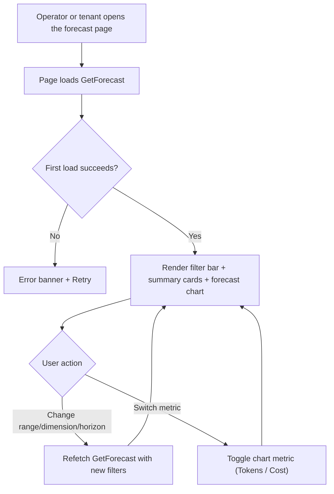
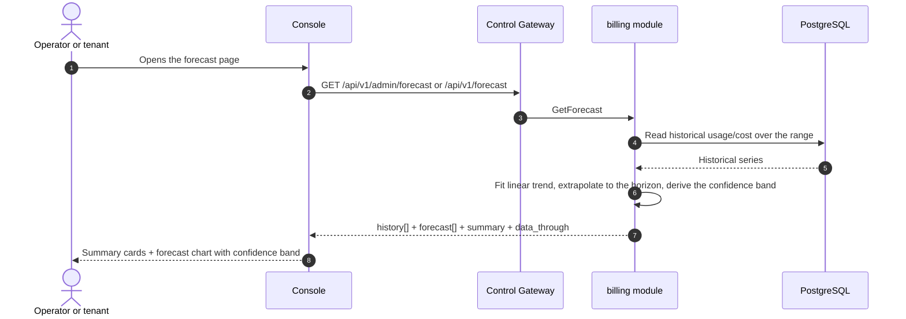

# Usage & Cost Forecasting — Requirement Analysis and UI/UX Design

| Attribute | Content |
| --- | --- |
| Feature point | Usage & cost forecasting — predict future token usage and cost based on historical trends, with forecast charts and confidence bands (backlog row 36) |
| Document scope | Requirement analysis, competitive research, the admin-surface forecast page for `/admin/forecast`, the end-user-surface forecast page for `/forecast`, the page → API surface table, and numbered acceptance criteria |
| Owning modules | `billing` (read-only forecast aggregation over `charge_records`/`usage_records` historical trends, plus the two RPCs), `metering` (read-only: token totals from `usage_records`), `model` (read-only: `model_name` resolution), `auth` (read-only: `api_key_name` resolution, session realm, session active org), `tenancy` (RoleGuard, read-only), `pkg/server` gateway (admin-prefix and user-prefix bindings), console web app (admin `ForecastPage`, end-user `UserForecastPage`) |
| Related documents | [Architecture Design](./architecture.md) — §2.5 `metering`, §2.6 `billing`, §3.1 (admin/user surface separation) · [Cost Analytics Dashboard](./cost-analytics-dashboard.md) — the sibling read-only aggregation this feature extends with a forecast, and its range/bucket/freshness conventions · [Usage Dashboards & Per-Request Cost Attribution](./usage-dashboard.md) — the sibling dashboard and its inline-SVG chart, freshness, range, and group-by conventions · [Console Surface Separation](./console-surface-separation.md) — the two surfaces, the `AdminShell`/`UserShell` conventions, the masked-projection rule |
| Status | Design complete, handed to the Architect agent |

---

## 1. Background and Competitive Research

### 1.1 Why Forecasting Comes Now

The cost analytics dashboard (feature #29) answers *where is my money going, and how is cost trending?* — summary cards, a dimension breakdown, a cost trend, and cost-per-token over a time range. What it explicitly deferred is the forward-looking question: *what will my usage and cost be next week or next month?* The operator and the tenant both need to plan — capacity, budget, and quota — but the console has no forecast. AWS Cost Explorer's 18-month forecast was named out of scope in feature #29; this feature delivers it.

This feature adds a **usage & cost forecasting** surface: predict future token usage and cost based on historical trends, with forecast charts and confidence bands. It is a **read-only** aggregation layer — nothing in the inference, metering, or billing pipelines changes. It is the smallest independently valuable increment of Phase 4's planning surface: it turns "cost is high" into "at this trend, next month's cost will be $X ± Y%".

### 1.2 How Comparable Products Implement Forecasting

| Product | Forecast surface | Method | Confidence bands | Notable pitfalls |
| --- | --- | --- | --- | --- |
| **AWS Cost Explorer** | Forecast of future cost/usage over a horizon | Time-series extrapolation of historical trends | Yes (upper/lower bounds) | 24-hour data lag; forecast horizon and method are opaque; up to 13 months history |
| **Google Cloud Billing** | Cost forecast on the billing dashboard | Trend extrapolation | Yes | Forecast is coarse; no per-dimension forecast |
| **Datadog** | Forecast of metrics over a horizon | Time-series forecasting (e.g. linear/seasonal) | Yes (confidence bands) | Requires a full observability stack; forecast method is a learning curve |
| **Grafana** | Forecast panels via query functions | Time-series extrapolation | Yes | User-built; no product surface |
| **Stripe** | Revenue/usage projections | Trend extrapolation | Limited | Coarse; not per-dimension |

### 1.3 Distilled Patterns and Decisions

Patterns worth adopting:

1. **A forecast horizon with a confidence band** — AWS and Datadog both show a forecast line with upper/lower bounds; the band communicates uncertainty honestly.
2. **Historical trend + forecast in one chart** — the forecast is meaningless without the history it extrapolates from; the chart shows both.
3. **Per-dimension forecast** — AWS and Datadog forecast by dimension (service, model, key); the operator and tenant forecast their own scope.
4. **A bounded horizon** — AWS's 18-month forecast is the extreme; go-taas uses a short, bounded horizon (e.g. 30 days) to keep the extrapolation honest.

Pitfalls to avoid:

- **An opaque forecast method** — the console must state the method (e.g. linear trend over the selected history) and the horizon, so the forecast is not a black box.
- **Over-long horizons** — a 30-day forecast from 7 days of history is meaningless; the horizon must be bounded relative to the history.
- **Ignoring freshness** — the forecast must carry a `data_through` watermark (the cost-analytics convention) so the tenant knows how current the history is.
- **A heavy forecasting stack** — go-taas must not stand up a time-series ML stack; a simple, deterministic extrapolation (linear trend) is enough for a planning surface.

**Decisions for go-taas** (recorded rationale, per the autonomous-decision rule):

| # | Decision | Rationale |
| --- | --- | --- |
| D1 | **Forecasting lives on both surfaces**: the admin surface (`/admin/forecast`, `/api/v1/admin/forecast/*`) is a **fleet-wide forecast** (all orgs, models, keys), and the end-user surface (`/forecast`, `/api/v1/forecast/*`) is a **tenant-scoped forecast** (the caller's own org). Both are read-only | The operator forecasts platform capacity and spend; the tenant forecasts its own budget and quota. The two-console split (feature #17) is binding, and both audiences need the planning surface |
| D2 | **A new `GetForecast` RPC** returns the forecast for a time range and optional dimension filter: the historical series, the forecast series, and the confidence band, in a single call | The forecast needs history + forecast + band at once; a dedicated RPC keeps the forecasting concern out of the cost-analytics surface and gives it one home |
| D3 | **The forecast method is a deterministic linear trend** over the selected historical range, extrapolated forward to a bounded horizon (default 30 days, max 90 days). The response states the method and horizon | A simple, deterministic extrapolation is enough for a planning surface and is testable; a heavy time-series ML stack is out of scope (pitfall). Stating the method keeps the forecast honest (pitfall) |
| D4 | **The horizon is bounded relative to the history** — the forecast horizon cannot exceed the historical range length (e.g. a 30-day forecast needs at least 30 days of history; otherwise the horizon is clamped to the history length) | An over-long horizon from short history is meaningless (pitfall); clamping keeps the extrapolation honest |
| D5 | **The confidence band is derived from the historical variance** — the band widens with the forecast distance and the historical volatility, giving an upper/lower bound around the forecast line | AWS and Datadog both show confidence bands (pattern 1); a variance-derived band communicates uncertainty without a heavy stack |
| D6 | **Freshness is explicit** — every response carries `data_through` (the last complete bucket covered by the history) and the console shows a "data through `<time>`" note, reusing the cost-analytics convention | The forecast is only as good as its history; the watermark keeps the freshness story honest (pitfall) |
| D7 | **The forecast chart is inline SVG** — a historical line, a forecast line, and a shaded confidence band, with a metric switcher (Tokens / Cost) | The console is deliberately dependency-light (usage-dashboard D7); a small, testable SVG chart matches the cost-analytics D6 decision |
| D8 | **Forecasting is read-only and audited only for access** — it writes no data and mutates nothing; the pages are reachable only by authenticated sessions with the appropriate role | The feature is a pure aggregation over existing data; the audit trail (feature #15) already covers the underlying charge-record writes. No new audit events are needed |

### 1.4 Scope Boundary

**In scope**: a forecast page on both surfaces (historical series + forecast series + confidence band, with a metric switcher and a horizon control), the `GetForecast` RPC, and the deterministic linear-trend forecast.

**Out of scope** (tracked by other feature points): the cost analytics dashboard (#29), anomaly detection or threshold alerts (#26), and a full time-series ML forecasting stack (deliberately absent, D3).

---

## 2. User Roles

| Role | Description | Interaction with forecasting |
| --- | --- | --- |
| **Platform operator** | The operator who runs the cluster and plans capacity/spend | Opens `/admin/forecast` → sees the fleet-wide forecast → plans capacity and budget |
| **Tenant finance / capacity planner** | The end-user who pays for usage and plans budget/quota | Opens `/forecast` → sees their own forecast → plans budget and quota |
| **Tenant developer / Agent** | The end-user who builds Agents | Uses the forecast to anticipate usage and cost for their models and keys |
| **Agent / SDK** | The programmatic consumer that calls `/v1/chat/completions` | Never touches forecasting; consumes the service's endpoints through the gateway with an API Key |

> Terminology: the consumer-side caller is called an **Agent** (English) / 「智能体」(Chinese), consistent with the repo convention. This feature spans both surfaces, so the consumer-side terminology applies to the tenant surface.

---

## 3. User Stories

| # | As a… | I want to… | So that… |
| --- | --- | --- | --- |
| US1 | Platform operator | see a fleet-wide forecast of token usage and cost | I can plan capacity and spend |
| US2 | Platform operator | see the confidence band around the forecast | I understand the uncertainty before committing budget |
| US3 | Tenant finance / capacity planner | see my own forecast of token usage and cost | I can plan my budget and quota |
| US4 | Tenant developer | forecast by model or API key | I can anticipate the cost of my own models and keys |
| US5 | Platform operator / tenant | choose the forecast horizon | I can look ahead 7, 30, or 90 days |
| US6 | Agent / SDK | call a chosen model through its endpoint with my API Key | I get completions without knowing about forecasting |

---

## 4. Functional Requirements

### FR1 — Forecast

- **FR1.1** `GetForecast` (`GET /api/v1/admin/forecast` · `GET /api/v1/forecast`) returns the forecast for a time range and optional dimension filter: the historical series, the forecast series, and the confidence band. It takes `since`/`until` (unix seconds; defaults `until = now`, `since = until − 30d`), `dimension` (one of `organization`, `model`, `api_key` on admin; `model`, `api_key` on user), `dimension_value` (optional), and `horizon_days` (default 30, max 90).
- **FR1.2** The response carries `method` (`linear_trend`), `horizon_days`, `data_through`, `history[]` (each with `bucket`, `total_tokens`, `total_cost_cents`), `forecast[]` (each with `bucket`, `total_tokens`, `total_cost_cents`, `lower_tokens`, `upper_tokens`, `lower_cost_cents`, `upper_cost_cents`), and `summary` (the forecast totals over the horizon).
- **FR1.3** `since > until` or a range > 92 days returns 10404; an unsupported `dimension` returns 11301; an unknown dimension value returns 11302; `horizon_days` > 90 returns a validation error.

### FR2 — Horizon and confidence

- **FR2.1** The horizon is bounded relative to the history (D4): if `horizon_days` exceeds the historical range length, the horizon is clamped to the history length.
- **FR2.2** The confidence band is derived from the historical variance (D5): the band widens with the forecast distance and the historical volatility, giving an upper/lower bound around the forecast line.

### FR3 — Surface and API binding

- **FR3.1** The forecast page lives on **both** surfaces: admin route `/admin/forecast` (API `/api/v1/admin/forecast/*`, fleet-wide) and end-user route `/forecast` (API `/api/v1/forecast/*`, tenant-scoped). Each page calls only its own prefix.
- **FR3.2** The end-user forecast is hard-scoped to the caller's organization and exposes no service ids or operator internals (D1).

---

## 5. Page and Flow Design

### 5.1 Surface Assignment

| Feature | Surface | Web route | API prefix |
| --- | --- | --- | --- |
| Fleet-wide forecast | admin | `/admin/forecast` | `/api/v1/admin/forecast/*` |
| Tenant-scoped forecast | end-user | `/forecast` | `/api/v1/forecast/*` |

Every page and API call above is on its own surface: the admin page calls only `/api/v1/admin/forecast/*`, the end-user page only `/api/v1/forecast/*`. Admin pages never call a `/api/v1/*` route, and end-user pages never call a `/api/v1/admin/*` route (feature #17).

### 5.2 Page Map

| Page / component | Purpose |
| --- | --- |
| **Forecast page** (admin `/admin/forecast`, end-user `/forecast`) | Historical series + forecast series + confidence band, with a metric switcher and a horizon control |

### 5.3 Page: `/admin/forecast` — Forecast (admin)

**Purpose**: give the platform operator a fleet-wide forecast of token usage and cost — the historical trend, the forecast line, and the confidence band — to plan capacity and spend.

**Surface**: admin — route `/admin/forecast`, API `/api/v1/admin/forecast/*`.

**Layout**: rendered inside `AdminShell` (feature #17). A page header ("Forecast", subtitle "Predicted token usage and cost") with a **Refresh** action (secondary). Below:

1. **Filter bar** — a **Time range** control (presets 24 h / 7 d / 30 d / custom), a **Dimension** control (dropdown: Organization / Model / API key; default Organization), a **Dimension value** filter (dropdown, shown when a dimension is selected), and a **Horizon** control (7 / 30 / 90 days; default 30).
2. **Summary cards** — a row of cards: **Forecast tokens** (over the horizon), **Forecast cost**, **Confidence** (the band width at the horizon), and a "data through `<time>`" freshness note (D6).
3. **Forecast chart** — an inline-SVG chart (D7) with a **metric switcher** (Tokens / Cost): a historical line, a forecast line, and a shaded confidence band.

**Interactive states**:

| State | Behaviour |
| --- | --- |
| Default | Filter bar + summary cards + forecast chart render from the first successful load; last-updated shows the load time |
| Loading | Skeleton chart; Refresh is disabled |
| Empty | "No usage data to forecast from." with a hint to widen the range; the filter bar stays visible |
| Error | An error banner with the message and a Retry button; the page keeps its last good data with a "Showing stale data" banner |
| Disabled | Refresh is disabled while a load is in flight; the Horizon control is disabled while a load is in flight |
| Permission-denied | A session without the required role receives 10036 and the page shows the standard permission-denied state (feature #17) with a link back to the admin home |

**Filter bar controls**: Time range (shared preset control), Dimension (Organization / Model / API key), Dimension value (dropdown, shown when a dimension is selected), Horizon (7 / 30 / 90 days). Changing any refetches.

**Summary cards**: Forecast tokens, Forecast cost, Confidence (band width at the horizon), and a "data through `<time>`" freshness note.

**Forecast chart**: inline SVG with a metric switcher (Tokens / Cost); a historical line, a forecast line, and a shaded confidence band.

### 5.4 Page: `/forecast` — Forecast (end-user)

**Purpose**: give a tenant finance / capacity planner a forecast of their own token usage and cost — the historical trend, the forecast line, and the confidence band — to plan budget and quota.

**Surface**: end-user — route `/forecast`, API `/api/v1/forecast/*`.

**Layout**: rendered inside `UserShell` (feature #17). A page header ("Forecast", subtitle "Predicted token usage and cost") with a **Refresh** action (secondary). Below:

1. **Filter bar** — a **Time range** control (presets 24 h / 7 d / 30 d / custom), a **Dimension** control (dropdown: Model / API key; default Model), a **Dimension value** filter (dropdown, shown when a dimension is selected), and a **Horizon** control (7 / 30 / 90 days; default 30).
2. **Summary cards** — a row of cards: **Forecast tokens**, **Forecast cost**, **Confidence**, and a "data through `<time>`" freshness note.
3. **Forecast chart** — the inline-SVG chart with the metric switcher, scoped to the tenant's own usage.

**Interactive states**: identical to §5.3, with the empty copy "No usage data to forecast from." and the permission-denied copy for the tenant's own errors (10005 org gone / 10017 org disabled from feature #17 §8.2). The page exposes no service ids or operator internals (D1).

### 5.5 Flows

---

## 6. API Surface Implications

The forecast RPC belongs to the **`billing` module** (D2), served as HTTP via the Control Gateway on **both** prefixes: `/api/v1/admin/forecast/*` (admin, fleet-wide) and `/api/v1/forecast/*` (user, tenant-scoped) (D1).

| RPC | Route | Prefix | Status | Purpose |
| --- | --- | --- | --- | --- |
| `GetForecast` (`taas.billing.v1`) | `GET /api/v1/admin/forecast` · `GET /api/v1/forecast` | admin · user | **new** | Historical series + forecast series + confidence band (admin: fleet; user: tenant-scoped) |

**Contract notes for the Architect agent**:

1. `GetForecast` validates `since`/`until` (int64 unix seconds; defaults `until = now`, `since = until − 30d`); `since > until` or a range > 92 days returns 10404. `dimension` is one of `organization`, `model`, `api_key` (admin) or `model`, `api_key` (user); an unsupported value returns 11301, an unknown dimension value returns 11302. `horizon_days` defaults to 30, max 90 (FR1.1, FR1.3).
2. The response carries `method` (`linear_trend`), `horizon_days`, `data_through`, `history[]`, `forecast[]` (with the confidence band), and `summary` (FR1.2).
3. The horizon is clamped to the historical range length when it exceeds it (D4, FR2.1); the confidence band is derived from the historical variance (D5, FR2.2).
4. The end-user binding is hard-scoped to the caller's organization and exposes no service ids or operator internals (D1, FR3.2).
5. Wire conventions unchanged: HTTP 200 on success, business errors as `{"code": <int>, "message": "..."}`, int64 fields serialized as JSON strings.

Error codes (existing blocks, `pkg/errors/codes.go`):

| Condition | Code | Constant | Notes |
| --- | --- | --- | --- |
| A malformed or over-long range | 10404 | `CodeRequestLogRangeInvalid` | Reused — the metering range contract (FR1.3) |
| Unsupported `dimension` | 11301 | `CodeCostDimensionInvalid` | Reused from cost analytics (FR1.3) |
| Unknown dimension value | 11302 | `CodeCostDimensionValueNotFound` | Reused from cost analytics (FR1.3) |
| `horizon_days` > 90 | 10404 | `CodeRequestLogRangeInvalid` | Reused for the horizon validation (FR1.3) |

---

## 7. Acceptance Criteria

| # | Criterion | Level |
| --- | --- | --- |
| AC1 | `GetForecast` with a valid range returns `method`, `horizon_days`, `data_through`, `history[]`, `forecast[]` (with the confidence band), and `summary`; a range > 92 days or `since > until` returns 10404 | FVT |
| AC2 | `GetForecast` with an unsupported `dimension` returns 11301, an unknown dimension value returns 11302, and `horizon_days` > 90 returns a validation error | FVT |
| AC3 | The horizon is clamped to the historical range length when it exceeds it; the confidence band widens with the forecast distance and the historical volatility | FVT |
| AC4 | The `/admin/forecast` page renders the filter bar, summary cards, and the forecast chart (historical line + forecast line + confidence band) from the first successful load, with a last-updated timestamp | E2E |
| AC5 | Changing the time range, dimension, dimension value, or horizon refetches and re-renders the cards and chart; the metric switcher toggles the chart metric (Tokens / Cost) | E2E |
| AC6 | The empty state ("No usage data to forecast from.") renders when no data matches; a failed load keeps the last good data with a "Showing stale data" banner and a Retry action | E2E |
| AC7 | The `/forecast` page renders the tenant's own forecast with no service ids or operator internals visible | E2E |
| AC8 | The forecast pages are reachable only on their own surfaces: admin route `/admin/forecast` calls only `/api/v1/admin/forecast/*`, end-user route `/forecast` calls only `/api/v1/forecast/*`, with no cross-prefix string | E2E (surface separation) |
| AC9 | A session without the required role receives 10036 on the forecast pages and the page shows the standard permission-denied state | E2E |

---

## 8. Out of Scope (tracked elsewhere)

| Item | Where |
| --- | --- |
| Cost analytics dashboard (cards, breakdown, trend) | Feature #29 cost analytics dashboard |
| Anomaly detection / threshold alerts | Feature #26 notification center |
| A full time-series ML forecasting stack | Deliberately absent (D3) — the forecast is a deterministic linear trend |
| Comparing dimensions side-by-side in a chart | Future refinement — v1 shows a single-dimension forecast |
