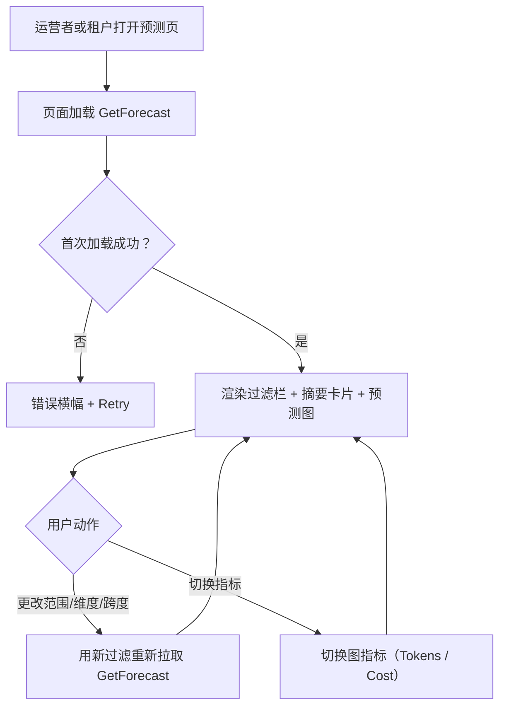
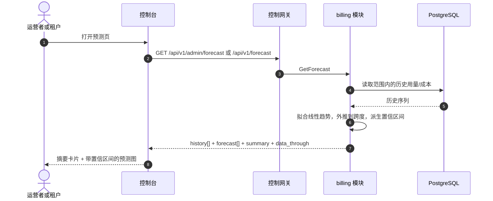

# 用量与成本预测 — 需求分析与 UI/UX 设计

| 属性 | 内容 |
| --- | --- |
| 特性点 | 用量与成本预测 — 基于历史趋势预测未来 token 用量与成本，含预测图与置信区间（backlog 第 36 行） |
| 文档范围 | 需求分析、竞品调研、`/admin/forecast` 管理面预测页、`/forecast` 终端用户预测页、页面 → API 面映射表，以及编号验收标准 |
| 归属模块 | `billing`（对 `charge_records`/`usage_records` 历史趋势的只读预测聚合，以及两个 RPC）、`metering`（只读：来自 `usage_records` 的 token 总量）、`model`（只读：`model_name` 解析）、`auth`（只读：`api_key_name` 解析、会话域、会话活跃组织）、`tenancy`（RoleGuard，只读）、`pkg/server` 网关（管理前缀与用户前缀绑定）、控制台 web 应用（admin `ForecastPage`、end-user `UserForecastPage`） |
| 相关文档 | [架构设计](./architecture.md) — 第 2.5 节 `metering`、第 2.6 节 `billing`、第 3.1 节（管理面/用户面分离）· [成本分析仪表盘](./cost-analytics-dashboard.md) — 本特性用预测扩展的姊妹只读聚合，及其范围/桶/新鲜度约定 · [用量仪表盘与按请求成本归属](./usage-dashboard.md) — 姊妹仪表盘及其内联 SVG 图、新鲜度、范围与分组约定 · [控制台面分离](./console-surface-separation.md) — 两个面、`AdminShell`/`UserShell` 约定、掩码投影规则 |
| 状态 | 设计完成，已移交架构师代理 |

---

## 1. 背景与竞品调研

### 1.1 为什么现在做预测

成本分析仪表盘（特性 #29）回答了*钱花在哪、成本如何趋势？* — 摘要卡片、维度分解、成本趋势与每 token 成本，覆盖一个时间范围。它明确推迟了前瞻性问题：*下周或下月我的用量与成本会是多少？* 运营者与租户都需要规划 — 容量、预算与配额 — 但控制台没有预测。AWS Cost Explorer 的 18 个月预测在特性 #29 中被列为范围外；本特性交付它。

本特性新增**用量与成本预测**面：基于历史趋势预测未来 token 用量与成本，含预测图与置信区间。它是**只读**聚合层 — 推理、计量或计费流水线没有任何变化。这是 Phase 4 规划面中最小可独立交付的增量：它把「成本很高」变成「按此趋势，下月成本将为 $X ± Y%」。

### 1.2 竞品如何实现预测

| 产品 | 预测面 | 方法 | 置信区间 | 主要陷阱 |
| --- | --- | --- | --- | --- |
| **AWS Cost Explorer** | 未来成本/用量在某个时间跨度上的预测 | 历史趋势的时间序列外推 | 有（上下界） | 24 小时数据滞后；预测跨度与方法不透明；最多 13 个月历史 |
| **Google Cloud Billing** | 计费仪表盘上的成本预测 | 趋势外推 | 有 | 预测较粗；无按维度预测 |
| **Datadog** | 指标在某个时间跨度上的预测 | 时间序列预测（如线性/季节性） | 有（置信区间） | 需要完整可观测性栈；预测方法有学习曲线 |
| **Grafana** | 经查询函数的预测面板 | 时间序列外推 | 有 | 用户构建；非产品面 |
| **Stripe** | 收入/用量预测 | 趋势外推 | 有限 | 较粗；非按维度 |

### 1.3 提炼出的模式与决策

值得采纳的模式：

1. **带置信区间的预测跨度** — AWS 与 Datadog 都显示带上下界的预测线；区间诚实地传达不确定性。
2. **历史趋势 + 预测在同一图中** — 没有外推所依据的历史，预测就无意义；图同时显示两者。
3. **按维度预测** — AWS 与 Datadog 按维度（服务、模型、Key）预测；运营者与租户预测自己的范围。
4. **有界跨度** — AWS 的 18 个月预测是极端；go-taas 使用短而有界的跨度（如 30 天）以保持外推诚实。

需要避免的陷阱：

- **不透明的预测方法** — 控制台必须说明方法（如对所选历史的线性趋势）与跨度，使预测不是黑盒。
- **过长的跨度** — 从 7 天历史预测 30 天无意义；跨度必须相对于历史有界。
- **忽略新鲜度** — 预测必须携带 `data_through` 水位（成本分析约定），让租户知道历史有多新。
- **重型预测栈** — go-taas 不得搭建时间序列 ML 栈；简单、确定性的外推（线性趋势）对规划面足够。

**go-taas 的决策**（依据自主决策规则记录理由）：

| # | 决策 | 依据 |
| --- | --- | --- |
| D1 | **预测存在于两个面**：管理面（`/admin/forecast`、`/api/v1/admin/forecast/*`）是**全平台预测**（所有组织、模型、Key），终端用户面（`/forecast`、`/api/v1/forecast/*`）是**租户范围预测**（调用者自己的组织）。两者都只读 | 运营者预测平台容量与支出；租户预测自己的预算与配额。两个控制台分离（特性 #17）是强制的，两个受众都需要规划面 |
| D2 | **新增 `GetForecast` RPC** 返回一个时间范围与可选维度过滤的预测：历史序列、预测序列与置信区间，单次调用 | 预测需要一次获得历史 + 预测 + 区间；专用 RPC 把预测关注点从成本分析面中分离出来并给它一个归属 |
| D3 | **预测方法是确定性线性趋势**，对所选历史范围外推到有界跨度（默认 30 天，最大 90 天）。响应说明方法与跨度 | 简单、确定性的外推对规划面足够且可测试；重型时间序列 ML 栈超出范围（陷阱）。说明方法保持预测诚实（陷阱） |
| D4 | **跨度相对于历史有界** — 预测跨度不得超过历史范围长度（如 30 天预测至少需要 30 天历史；否则跨度被钳制到历史长度） | 从短历史预测过长跨度无意义（陷阱）；钳制保持外推诚实 |
| D5 | **置信区间由历史方差派生** — 区间随预测距离与历史波动性变宽，在预测线周围给出上下界 | AWS 与 Datadog 都显示置信区间（模式 1）；方差派生区间无需重型栈即可传达不确定性 |
| D6 | **新鲜度显式** — 每个响应携带 `data_through`（历史覆盖的最后一个完整桶），控制台显示「data through `<time>`」说明，复用成本分析约定 | 预测的好坏取决于其历史；水位保持新鲜度故事诚实（陷阱） |
| D7 | **预测图用内联 SVG** — 历史线、预测线与阴影置信区间，带指标切换器（Tokens / Cost） | 控制台刻意依赖精简（usage-dashboard D7）；小而可测试的 SVG 图契合成本分析 D6 决策 |
| D8 | **预测只读且仅对访问审计** — 它不写数据、不改变任何东西；页面仅对已认证且具备相应角色的会话可达 | 该特性是对既有数据的纯聚合；审计轨迹（特性 #15）已覆盖底层 charge-record 写入。无需新增审计事件 |

### 1.4 范围边界

**范围内**：两个面上的预测页（历史序列 + 预测序列 + 置信区间，带指标切换器与跨度控件）、`GetForecast` RPC、确定性线性趋势预测。

**范围外**（由其他特性点跟踪）：成本分析仪表盘（#29）、异常检测或阈值告警（#26）、完整时间序列 ML 预测栈（刻意缺失，D3）。

---

## 2. 用户角色

| 角色 | 描述 | 与预测的交互 |
| --- | --- | --- |
| **平台运营者** | 运维集群并规划容量/支出的运营者 | 打开 `/admin/forecast` → 看到全平台预测 → 规划容量与预算 |
| **租户财务 / 容量规划者** | 为用量付费并规划预算/配额的终端用户 | 打开 `/forecast` → 看到自己的预测 → 规划预算与配额 |
| **租户开发者 / 智能体** | 构建智能体的终端用户 | 用预测预判其模型与 Key 的用量与成本 |
| **智能体 / SDK** | 调用 `/v1/chat/completions` 的程序化消费方 | 从不接触预测；经网关持 API Key 消费服务端点 |

> 术语：消费侧调用方在英文中为 **Agent**，中文为「智能体」，与仓库约定一致。本特性横跨两个面，因此消费侧术语适用于租户面。

---

## 3. 用户故事

| # | 作为… | 我想要… | 以便… |
| --- | --- | --- | --- |
| US1 | 平台运营者 | 看到 token 用量与成本的全平台预测 | 我能规划容量与支出 |
| US2 | 平台运营者 | 看到预测周围的置信区间 | 我在承诺预算前理解不确定性 |
| US3 | 租户财务 / 容量规划者 | 看到自己的 token 用量与成本预测 | 我能规划预算与配额 |
| US4 | 租户开发者 | 按模型或 API Key 预测 | 我能预判自己模型与 Key 的成本 |
| US5 | 平台运营者 / 租户 | 选择预测跨度 | 我能前瞻 7、30 或 90 天 |
| US6 | 智能体 / SDK | 用我的 API Key 通过端点调用所选模型 | 我获得补全结果，无需了解预测 |

---

## 4. 功能需求

### FR1 — 预测

- **FR1.1** `GetForecast`（`GET /api/v1/admin/forecast` · `GET /api/v1/forecast`）返回一个时间范围与可选维度过滤的预测：历史序列、预测序列与置信区间。它接受 `since`/`until`（unix 秒；默认 `until = now`、`since = until − 30d`）、`dimension`（admin 为 `organization`、`model`、`api_key` 之一；user 为 `model`、`api_key`）、`dimension_value`（可选）与 `horizon_days`（默认 30，最大 90）。
- **FR1.2** 响应携带 `method`（`linear_trend`）、`horizon_days`、`data_through`、`history[]`（每个带 `bucket`、`total_tokens`、`total_cost_cents`）、`forecast[]`（每个带 `bucket`、`total_tokens`、`total_cost_cents`、`lower_tokens`、`upper_tokens`、`lower_cost_cents`、`upper_cost_cents`）与 `summary`（跨度上的预测总量）。
- **FR1.3** `since > until` 或范围 > 92 天返回 10404；不支持的 `dimension` 返回 11301；未知维度值返回 11302；`horizon_days` > 90 返回校验错误。

### FR2 — 跨度与置信

- **FR2.1** 跨度相对于历史有界（D4）：若 `horizon_days` 超过历史范围长度，跨度被钳制到历史长度。
- **FR2.2** 置信区间由历史方差派生（D5）：区间随预测距离与历史波动性变宽，在预测线周围给出上下界。

### FR3 — 面与 API 绑定

- **FR3.1** 预测页存在于**两个面**：管理面路由 `/admin/forecast`（API `/api/v1/admin/forecast/*`，全平台）与终端用户路由 `/forecast`（API `/api/v1/forecast/*`，租户范围）。每个页面只调用自己的前缀。
- **FR3.2** 终端用户预测硬限定到调用者的组织，且不暴露服务 id 或运营者内部信息（D1）。

---

## 5. 页面与流程设计

### 5.1 面分配

| 特性 | 面 | Web 路由 | API 前缀 |
| --- | --- | --- | --- |
| 全平台预测 | admin | `/admin/forecast` | `/api/v1/admin/forecast/*` |
| 租户范围预测 | end-user | `/forecast` | `/api/v1/forecast/*` |

以上每个页面与 API 调用都位于各自的面：管理面页面只调用 `/api/v1/admin/forecast/*`，终端用户页面只调用 `/api/v1/forecast/*`。管理面页面从不调用 `/api/v1/*` 路由，终端用户页面从不调用 `/api/v1/admin/*` 路由（特性 #17）。

### 5.2 页面地图

| 页面 / 组件 | 目的 |
| --- | --- |
| **预测页**（admin `/admin/forecast`、end-user `/forecast`） | 历史序列 + 预测序列 + 置信区间，带指标切换器与跨度控件 |

### 5.3 页面：`/admin/forecast` — Forecast（管理面）

**目的**：给平台运营者一个 token 用量与成本的全平台预测 — 历史趋势、预测线与置信区间 — 以规划容量与支出。

**面**：admin — 路由 `/admin/forecast`，API `/api/v1/admin/forecast/*`。

**布局**：在 `AdminShell`（特性 #17）内渲染。页面头部（「Forecast」，副标题「Predicted token usage and cost」）带 **Refresh** 动作（次要）。下方：

1. **过滤栏** — **Time range** 控件（预设 24 小时 / 7 天 / 30 天 / 自定义）、**Dimension** 控件（下拉：Organization / Model / API key；默认 Organization）、**Dimension value** 过滤（下拉，选择维度时显示）与 **Horizon** 控件（7 / 30 / 90 天；默认 30）。
2. **摘要卡片** — 一行卡片：**Forecast tokens**（跨度上）、**Forecast cost**、**Confidence**（跨度处的区间宽度）与「data through `<time>`」新鲜度说明（D6）。
3. **预测图** — 内联 SVG 图（D7）带**指标切换器**（Tokens / Cost）：历史线、预测线与阴影置信区间。

**交互状态**：

| 状态 | 行为 |
| --- | --- |
| 默认 | 过滤栏 + 摘要卡片 + 预测图从首次成功加载渲染；last-updated 显示加载时间 |
| 加载中 | 骨架图；Refresh 禁用 |
| 空 | 「No usage data to forecast from.」并提示加宽范围；过滤栏保持可见 |
| 错误 | 错误横幅带消息与 Retry 按钮；页面保留最后的好数据并显示「Showing stale data」横幅 |
| 禁用 | 加载进行中 Refresh 禁用；加载进行中 Horizon 控件禁用 |
| 权限拒绝 | 无所需角色的会话收到 10036，页面显示标准权限拒绝状态（特性 #17）带返回管理首页的链接 |

**过滤栏控件**：Time range（共享预设控件）、Dimension（Organization / Model / API key）、Dimension value（下拉，选择维度时显示）、Horizon（7 / 30 / 90 天）。更改任一都会重新拉取。

**摘要卡片**：Forecast tokens、Forecast cost、Confidence（跨度处的区间宽度）与「data through `<time>`」新鲜度说明。

**预测图**：带指标切换器（Tokens / Cost）的内联 SVG；历史线、预测线与阴影置信区间。

### 5.4 页面：`/forecast` — Forecast（终端用户面）

**目的**：给租户财务 / 容量规划者一个自己的 token 用量与成本预测 — 历史趋势、预测线与置信区间 — 以规划预算与配额。

**面**：end-user — 路由 `/forecast`，API `/api/v1/forecast/*`。

**布局**：在 `UserShell`（特性 #17）内渲染。页面头部（「Forecast」，副标题「Predicted token usage and cost」）带 **Refresh** 动作（次要）。下方：

1. **过滤栏** — **Time range** 控件（预设 24 小时 / 7 天 / 30 天 / 自定义）、**Dimension** 控件（下拉：Model / API key；默认 Model）、**Dimension value** 过滤（下拉，选择维度时显示）与 **Horizon** 控件（7 / 30 / 90 天；默认 30）。
2. **摘要卡片** — 一行卡片：**Forecast tokens**、**Forecast cost**、**Confidence** 与「data through `<time>`」新鲜度说明。
3. **预测图** — 带指标切换器的内联 SVG 图，限定到租户自己的用量。

**交互状态**：与 §5.3 相同，空文案为「No usage data to forecast from.」，权限拒绝文案为租户自己的错误（10005 组织消失 / 10017 组织禁用，来自特性 #17 §8.2）。页面不暴露服务 id 或运营者内部信息（D1）。

### 5.5 流程

---

## 6. API 面影响

预测 RPC 属于 **`billing` 模块**（D2），经控制网关以 HTTP 提供，位于**两个前缀**：`/api/v1/admin/forecast/*`（admin，全平台）与 `/api/v1/forecast/*`（user，租户范围）（D1）。

| RPC | 路由 | 前缀 | 状态 | 目的 |
| --- | --- | --- | --- | --- |
| `GetForecast`（`taas.billing.v1`） | `GET /api/v1/admin/forecast` · `GET /api/v1/forecast` | admin · user | **新增** | 历史序列 + 预测序列 + 置信区间（admin：全平台；user：租户范围） |

**给架构师代理的契约说明**：

1. `GetForecast` 校验 `since`/`until`（int64 unix 秒；默认 `until = now`、`since = until − 30d`）；`since > until` 或范围 > 92 天返回 10404。`dimension` 为 `organization`、`model`、`api_key`（admin）或 `model`、`api_key`（user）之一；不支持的值返回 11301，未知维度值返回 11302。`horizon_days` 默认 30，最大 90（FR1.1、FR1.3）。
2. 响应携带 `method`（`linear_trend`）、`horizon_days`、`data_through`、`history[]`、`forecast[]`（含置信区间）与 `summary`（FR1.2）。
3. 跨度超过历史范围长度时被钳制到历史长度（D4、FR2.1）；置信区间由历史方差派生（D5、FR2.2）。
4. 终端用户绑定硬限定到调用者的组织，且不暴露服务 id 或运营者内部信息（D1、FR3.2）。
5. 线上约定不变：成功 HTTP 200，业务错误为 `{"code": <int>, "message": "..."}`，int64 字段序列化为 JSON 字符串。

错误码（既有块，`pkg/errors/codes.go`）：

| 条件 | 码 | 常量 | 说明 |
| --- | --- | --- | --- |
| 格式错误或过长的范围 | 10404 | `CodeRequestLogRangeInvalid` | 复用 — metering 范围契约（FR1.3） |
| 不支持的 `dimension` | 11301 | `CodeCostDimensionInvalid` | 从成本分析复用（FR1.3） |
| 未知维度值 | 11302 | `CodeCostDimensionValueNotFound` | 从成本分析复用（FR1.3） |
| `horizon_days` > 90 | 10404 | `CodeRequestLogRangeInvalid` | 复用于跨度校验（FR1.3） |

---

## 7. 验收标准

| # | 标准 | 级别 |
| --- | --- | --- |
| AC1 | `GetForecast` 在有效范围内返回 `method`、`horizon_days`、`data_through`、`history[]`、`forecast[]`（含置信区间）与 `summary`；范围 > 92 天或 `since > until` 返回 10404 | FVT |
| AC2 | `GetForecast` 不支持的 `dimension` 返回 11301，未知维度值返回 11302，`horizon_days` > 90 返回校验错误 | FVT |
| AC3 | 跨度超过历史范围长度时被钳制到历史长度；置信区间随预测距离与历史波动性变宽 | FVT |
| AC4 | `/admin/forecast` 页面从首次成功加载渲染过滤栏、摘要卡片与预测图（历史线 + 预测线 + 置信区间），带 last-updated 时间戳 | E2E |
| AC5 | 更改时间范围、维度、维度值或跨度会重新拉取并重新渲染卡片与图；指标切换器切换图指标（Tokens / Cost） | E2E |
| AC6 | 无数据匹配时渲染空状态（「No usage data to forecast from.」）；失败加载保留最后的好数据并显示「Showing stale data」横幅与 Retry 动作 | E2E |
| AC7 | `/forecast` 页面渲染租户自己的预测，无服务 id 或运营者内部信息可见 | E2E |
| AC8 | 预测页只在各自的面可达：管理面路由 `/admin/forecast` 只调用 `/api/v1/admin/forecast/*`，终端用户路由 `/forecast` 只调用 `/api/v1/forecast/*`，无跨前缀字符串 | E2E（面分离） |
| AC9 | 无所需角色的会话在预测页收到 10036，页面显示标准权限拒绝状态 | E2E |

---

## 8. 范围外（在别处跟踪）

| 项 | 位置 |
| --- | --- |
| 成本分析仪表盘（卡片、分解、趋势） | 特性 #29 成本分析仪表盘 |
| 异常检测 / 阈值告警 | 特性 #26 通知中心 |
| 完整时间序列 ML 预测栈 | 刻意缺失（D3）— 预测是确定性线性趋势 |
| 在图中并排比较维度 | 未来细化 — v1 显示单维度预测 |
