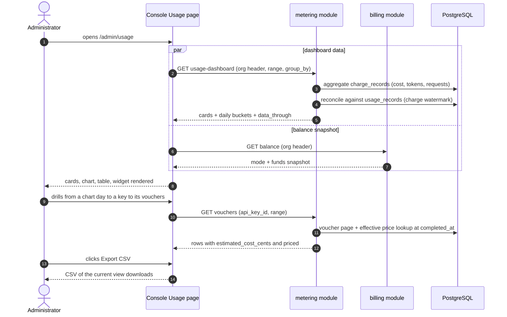
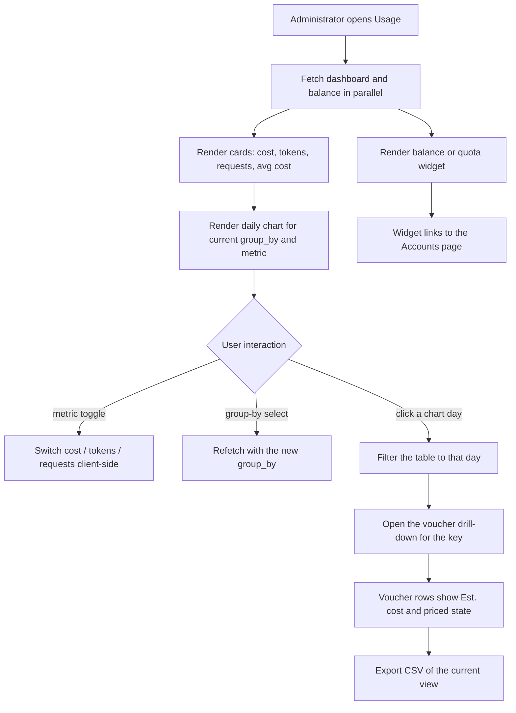

# Usage Dashboards & Per-Request Cost Attribution — Requirement Analysis and UI/UX Design

| Attribute | Content |
| --- | --- |
| Feature point | Usage dashboards & per-request cost attribution |
| Document scope | Requirement analysis and UI/UX design for the unified usage × cost view: the `GetUsageDashboard` API (summary cards + daily buckets × group-by), per-request estimated cost on vouchers, the console `/admin/usage` dashboard upgrade (chart, metric toggle, group-by, CSV export, balance/quota widget), and acceptance criteria |
| Owning modules | `metering` (dashboard aggregation, voucher cost attribution), reading `billing` charge records and `GetBalance` read-only; console web app; no changes to settlement, charging, or account pipelines |
| Related documents | [Architecture Design](./architecture.md) — §2.5 `metering`, §2.6 `billing` · [Token Metering Vouchers & Async Settlement](./metering.md) — the usage data and voucher surface being extended · [Model × Card-Type Price Matrix & Tiered Pricing](./pricing.md) — the D2 charge formula and effective-dated prices behind every cost figure · [Balance (Prepaid) & Quota (Postpaid) Account Modes](./balance-quota.md) — the `GetBalance` snapshot the widget shows · [Multi-Tenancy Isolation](./multi-tenancy.md) — org scoping |
| Status | Design complete, handed to the Architect agent |

---

## 1. Background

Features #1–#8 closed the accounting loop: API keys identify callers, models deploy one-click, every inference request leaves a tamper-evident voucher that settles hourly per key, the price matrix turns settled usage into charge records and monthly bills, organizations own every resource, and billing accounts gate inference with a prepaid balance or a postpaid quota. What the console still cannot answer is the operator's first question — *what is this usage costing, and which requests drove it?* The Usage page shows token counts per key with no cost anywhere; cost exists only at (key, model, card, hour) granularity on the Pricing and Bills pages; balance and quota live on Accounts, far from the usage they limit; and the metering design explicitly deferred per-request cost attribution until prices exist. Prices now exist. This feature unifies usage × cost into one dashboard — summary cards, a daily chart with metric and group-by toggles, per-request estimated cost on vouchers, CSV export, and the org's balance/quota snapshot beside it — as a read-only layer over the data #4, #5, and #8 already produce. Nothing in the settlement, charging, or account pipelines changes.

### 1.1 How Comparable Products Present Usage and Cost

| Product | Usage & cost surface | Drill-down | Export | Notable pitfalls |
| --- | --- | --- | --- | --- |
| **OpenAI Platform** | Usage page per project/key/model: day-granularity cost and token charts with a cost/tokens metric switch | Chart → usage rows; no per-request cost view | CSV export of usage | Usage lag (minutes) confuses debugging; the "today (partial)" marker needs explaining |
| **Anthropic Console** | Per-day, per-model usage with costs; per-request usage viewer | Day → model → per-request rows | API export | The per-request viewer is admin-only; members see aggregates |
| **AWS Bedrock + Cost Explorer** | Spend dashboard with group-by dimensions and daily/monthly granularity; forecasts | Cost Explorer → usage rows → CloudWatch invocation logs | CSV export | Metrics and cost live in two systems — one story, two consoles |
| **Together AI** | Usage dashboard per model/key against prepaid credits | Key → usage history | — | Freshness (call → usage visible) is undocumented |
| **SiliconFlow** | Per-model, per-day token usage plus balance history | None exposed | — | No per-request audit; a disputed charge cannot be traced to requests |
| **Baidu Qianfan** | Usage statistics per model/service; monthly settlement views | Model → usage statistics | Enterprise export | Resource packages and balance are two ledgers in one console |
| **Aliyun Bailian / Volcengine Ark** | Usage and spend dashboards beside the prepaid balance | Model → usage detail | Console export | Balance and usage sit on separate tabs, splitting spend context |

### 1.2 Distilled Patterns and Decisions

Patterns worth adopting: (1) **summary cards above a metric-switcher chart** — OpenAI's cost/tokens toggle and AWS's group-by dimensions operate over one daily series, and one dashboard endpoint serving cards + buckets avoids the N+1-call slow console; (2) **three-level drill-down** — Stripe's payments pattern (chart → underlying rows → single event) maps exactly onto chart → per-key/model table → voucher, with the range and filters carried down at every level; (3) **freshness labeling** — a "current hour pending" badge and a data-through timestamp at every level, because usage-lag confusion is the most consistently recorded pitfall; (4) **export** — CSV of the current view so auditors can work offline; (5) **spend context beside usage** — Anthropic's credits-plus-limits labeling, i.e. the org's balance/quota snapshot next to the usage consuming it.

Pitfalls to avoid: dashboards assembled from N+1 calls; cost without per-request traceability (the SiliconFlow dispute dead-end); usage and cost split across pages (the AWS two-console story); heavy chart libraries in a deliberately dependency-light console; silently missing pending hours; and float money — every figure here is integer cents (billing D2).

**Decisions for go-taas**:

| # | Decision | Rationale |
| --- | --- | --- |
| D1 | **One new RPC `GetUsageDashboard`** in `MeteringService` rather than extending `GetUsageSummary` — it returns cards + daily buckets × group-by in a single call | The dashboard needs three shapes at once (headline cards, a time series, group series); bolting them onto `GetUsageSummary` would break its established row semantics for existing consumers, while separate calls recreate the N+1 slow console; a dedicated RPC keeps both stable and additive |
| D2 | **Per-request cost is computed on read, never stored on vouchers** — `estimated_cost_cents` applies pricing D2's formula against the effective-dated price at `completed_at`, with the same default-card fallback | Vouchers stay immutable audit atoms (metering D1); effective-dated prices make flat-rate recomputation exact and retro-correct when prices are fixed; storing cost at settlement would couple vouchers to pricing and freeze wrong values on price corrections |
| D3 | **Tiered requests are labeled estimates** — when the org's month-to-date volume for (model, card) crossed into a tier, the per-request flat-rate cost diverges from the actual charge (tier rates live on charge records); the console labels the column "Est. cost" everywhere | A per-request tier split is at best pro-rata; honesty beats false precision — the unit-ambiguity pitfall repeated at request level |
| D4 | **Dashboard numbers aggregate `charge_records`** (which carry summed tokens, request counts, and amounts per key × model × card × hour), **reconciled against `usage_records`** so hours that settled but have not yet charged surface as pending rather than silently missing | One source answers all three group-bys and both metric families; the reconciliation keeps the freshness story honest with zero new pipeline work — the feature is read-only |
| D5 | **`group_by` is server-side** — `api_key` (default), `model`, `accelerator_type`; switching it refetches. **The metric toggle (cost / tokens / requests) is client-side** because every bucket carries all three metrics | Payload stays one group-by wide; the toggle feels instant (the OpenAI/AWS pattern); card-type grouping is the Cost Explorer dimension our charge records already carry |
| D6 | **Daily UTC buckets, one per day in the range** (empty on quiet days), range capped at **92 days**; validation reuses **10404** | Daily granularity matches every surveyed dashboard and keeps the payload ≤ 92 points; the cap and code reuse keep the metering range contract uniform |
| D7 | **The chart renders with inline SVG** — one bar per day, stacked by group — no new charting dependency | The console is deliberately dependency-light; a daily bar chart is a small, testable SVG component; heavy chart libraries are a console pitfall |
| D8 | **The balance/quota widget reuses `GetBalance` unchanged** — prepaid shows balance, postpaid shows month-to-date spend vs quota; an org without an account renders a muted "No billing account" state | Spend context next to usage is the Anthropic pattern; no new API and no billing changes; the widget's calendar-month window is labeled to distinguish it from the cards' selected range |
| D9 | **CSV export is generated client-side from the current table view** (usage table or voucher list) — UTF-8, header row, cost columns included | Auditors get offline data without a new export API; this picks up metering's deferred voucher-export item; server-side export of full ranges stays future work |
| D10 | **No new error codes** — 10404 covers dashboard range validation; 10403 stays on voucher lookups; the widget treats 10503 as an empty state, not an error | A uniform range contract across metering queries; the balance feature already owns the 105xx block |

## 2. Goals and Non-goals

**Goals**: one `GetUsageDashboard` RPC (cards + daily buckets × group-by, org-scoped, range ≤ 92 days, 10404 reuse); per-request `estimated_cost_cents` + `priced` on `ListVouchers`/`GetVoucher`, computed on read; the `/admin/usage` upgrade — summary cards, inline-SVG chart with metric toggle and group-by, cost columns on the existing tables and voucher list, CSV export of the current view, and the balance/quota widget reusing `GetBalance`; pending-hour and unpriced labeling at every level.

**Non-goals**: real-time streaming usage (the hourly cadence stands); forecasts and anomaly alerts; saved custom views; hourly buckets for short ranges; server-side full-range export APIs; per-tenant self-service dashboards (#6/#7); payments, invoices, receipts (#14); request logs & playground metadata (#12 — this feature attributes cost, #12 shows full request context); any change to settlement, charging, or account pipelines (read-only feature); new error codes.

## 3. Personas

| Role | Description | Interaction with the dashboard |
| --- | --- | --- |
| **Platform administrator** | The operator who runs the cluster; today also the console user | Watches spend, groups by model/card type, drills to vouchers, exports CSV |
| **Organization administrator (future)** | Tenant-side administrator | Will see their org's dashboard (scoped by tenancy, #6) |
| **Agent / SDK** | The programmatic consumer | Never calls dashboard APIs; their requests generate the usage and cost being attributed |
| **Auditor** | Whoever resolves a cost dispute | Traces card → day → key → voucher estimate → price entry |
| **Billing pipeline** | The feature-#5 charge engine | Unchanged — the dashboard only reads its charge records |

> Terminology: the consumer-side caller is called an **Agent** (English) / 「智能体」(Chinese), consistent with the repo convention.

## 4. User Journeys

| # | Journey | Steps |
| --- | --- | --- |
| J1 | **Where did the money go?** | Admin opens Usage → the cost card catches attention → groups by model → the chart shows a spike on one day → clicks the day → the table filters → the voucher drill-down shows the expensive requests with est. cost |
| J2 | **Quota watch** | Postpaid org → the widget shows spend vs quota trending up → admin opens Accounts and raises the quota or plans the month |
| J3 | **Disputed charge** | Auditor opens the dashboard for the bill's range → drills to vouchers → exports CSV → reconciles against the bill offline |
| J4 | **Unpriced usage** | The unpriced badge appears → admin checks the price matrix → fixes the missing (model, card) cell → the next charge prices it, and past estimates self-correct on read (D2) |

## 5. Feature Requirements and Acceptance Criteria

### FR1 — `GetUsageDashboard` API

- **FR1.1** `GET /api/v1/admin/metering/usage-dashboard` (org-scoped via `X-Organization-Id`) takes `since`/`until` (unix seconds; defaults `until = now`, `since = until − 24h`) and `group_by` (`api_key` default | `model` | `accelerator_type`). `since > until` or a range > 92 days returns 10404 — the same contract as every metering query (D6).
- **FR1.2** The response's `cards` carry `total_cost_cents`, `currency`, the four token sums, `request_count`, `unpriced_request_count`, and `data_through` (the last complete hour covered by charging). The average cost per request is derived client-side (cost ÷ requests) — the wire carries integer cents only.
- **FR1.3** The response's `daily_buckets` carry one entry per UTC day in the range (empty groups on quiet days, so the chart renders gaps honestly); each entry has `date` and `groups[]` — `group_key`, `cost_cents`, the four token sums, `request_count`, and `priced` (false when any contributing charge record is unpriced, so an understated cost is never silent).
- **FR1.4** Aggregation follows D4: numbers come from `charge_records`, and `data_through` is the charge watermark; hours that settled but have not yet charged surface through the pending badge rather than being half-counted (no model/card split exists for them until charging runs).

### FR2 — Per-request estimated cost on vouchers

- **FR2.1** `ListVouchers` and `GetVoucher` responses gain two additive fields: `estimated_cost_cents` (int64, JSON string) and `priced` (bool) — computed on read, never stored (D2).
- **FR2.2** Computation: resolve the accelerator type with pricing D6's rules (event field → `service_id` lookup → `default`), then look up the effective price for (model, card) at `completed_at` with the (model, `default`) fallback; with no entry, `priced = false` and the cost is 0. Otherwise `priced = true` and the cost is pricing D2's formula — `prompt×in + completion×out + reasoning×out + cached×cache`, ÷ 1M, rounded to cents.
- **FR2.3** The value is an estimate by construction (D3): flat rates, no per-request tier split. The console labels the column "Est. cost" everywhere, with a tooltip explaining effective dating and tiers.
- **FR2.4** Price lookups are batched and cached per result page — one lookup per distinct (model, card, day), not per row — so a 100-row voucher page stays fast (Metrics).

### FR3 — Console dashboard view flow

1. The administrator opens **Usage** (`/admin/usage` — upgraded in place; no new nav item).
2. The console fetches `GetUsageDashboard` (default 24 h, `group_by = api_key`) and `GetBalance` in parallel.
3. The header renders the balance/quota widget (FR6). The cards row renders total cost, tokens in/out, requests, and avg cost per request; the unpriced badge appears when `unpriced_request_count > 0`.
4. The chart renders one bar per day, stacked by group, in the current metric (cost) — inline SVG, no new dependency (D7).
5. The existing per-key table renders below with a new **Cost** column; the settled/pending badge and freshness note are unchanged.
6. Range presets (24 h / 7 d / 30 d / custom) and group-by changes refetch; the pending-hour badge shows whenever the range extends past `data_through` (AC8).

### FR4 — Drill-down flow (chart → table → voucher)

1. Clicking a chart day filters the table to that day — the range carries down (the Stripe pattern).
2. The existing row actions "By model" and "Vouchers" open drill-downs pre-filtered to the row's key and the active range/day; the by-model dialog also gains a Cost column.
3. The voucher list shows the **Est. cost** column (`voucher-cost-{id}`) and the priced state — an "Unpriced" badge instead of an amount when `priced = false`.
4. `GetVoucher` detail shows the estimated cost, priced state, token breakdown, and settled state together — the complete audit view without a second call.
5. Voucher drill-downs are naturally bounded by the 90-day voucher retention (metering D7); the dashboard itself reads charge records, which are retained indefinitely.

### FR5 — CSV export flow

1. An **Export CSV** button (`usage-export-csv`) sits with the table controls.
2. Clicking it downloads a UTF-8 CSV with a header row, mirroring the current table view — the loaded rows and columns, including Cost / Est. cost — named `usage-{view}-{since}-{until}.csv` (D9).
3. Export reflects exactly what is on screen (current filters and page); server-side export of full ranges stays future work (Open Questions).

### FR6 — Balance/quota widget flow

1. On page load the widget calls `GetBalance` — reused unchanged (D8) — and refreshes with the page's existing 60 s poll.
2. Prepaid: "Balance $X" with month-to-date spend. Postpaid: "Spend this month $Y / $Z" with a progress bar — amber over quota, red when the overdraw policy has tripped (#8's color language).
3. The widget links to the Accounts page for recharge and quota actions.
4. An org without a billing account (10503) renders a muted "No billing account" state — never an error banner.
5. The widget's window is the billing cycle (calendar month, labeled "this month"), explicitly distinct from the cards' selected range.

### Dashboard Load and Drill-Down Sequence

### Dashboard Interaction Flow

### Acceptance criteria

| # | Criterion | Verification |
| --- | --- | --- |
| AC1 | **Dashboard round-trip** — Given an org with settled and charged usage across three days, When the console loads `/admin/usage`, Then `GetUsageDashboard` returns cards whose cost, tokens, and request count equal the summed charge records for the range, and the daily buckets render the chart (`usage-dashboard-cards`, `usage-chart` present) | FVT + E2E |
| AC2 | **Group-by dimensions** — Given the same data spanning multiple keys, models, and card types, When `group_by` is `model` and then `accelerator_type`, Then the series regroups accordingly and the per-group sums across every dimension still total the cards | FVT + E2E |
| AC3 | **Metric toggle** — Given a rendered dashboard, When the metric toggle switches cost → tokens → requests, Then the chart re-renders from the already-loaded response with no additional API call | E2E |
| AC4 | **Per-request estimated cost** — Given a voucher whose (model, card) has an effective price at `completed_at`, When `ListVouchers`/`GetVoucher` returns it, Then `estimated_cost_cents` equals the pricing-D2 formula with the default-card fallback and `priced = true`; given no price entry, `priced = false` with cost 0; the console renders the value under `voucher-cost-{id}` labeled "Est. cost" | Unit + FVT + E2E |
| AC5 | **CSV export** — Given a rendered usage table or voucher list, When the user clicks Export CSV, Then a UTF-8 CSV with a header row downloads, mirroring the current view's rows and columns including the cost column | E2E |
| AC6 | **Balance widget** — Given an org with a prepaid account, When the page loads, Then `usage-balance-widget` shows the balance from `GetBalance`; given a postpaid account, it shows month-to-date spend against the quota; given no account, it shows the muted "No billing account" state without an error banner | E2E |
| AC7 | **Range validation** — Given `since > until` or a range longer than 92 days, When `GetUsageDashboard` is called, Then it returns 10404 and the console surfaces the message inline | Unit + FVT |
| AC8 | **Pending-hour badge** — Given the requested range extends past `data_through` into the current (uncharged) hour, When the dashboard renders, Then the pending badge appears with the data-through timestamp and the freshness note explains the hourly cadence | E2E |

## 6. Console Information Architecture

Nav: **Usage** (`/admin/usage`) is upgraded in place — no new nav item; the Billing group is unchanged (the widget links to Accounts).

| Page / component | Purpose | Key testids |
| --- | --- | --- |
| **Balance/quota widget** (page header) | Spend context beside usage: balance or quota progress, "this month" label, Accounts link | `usage-balance-widget` |
| **Summary cards** | Total cost, tokens in/out, requests, avg cost per request; unpriced badge | `usage-dashboard-cards`, `usage-card-cost`, `usage-card-tokens`, `usage-card-requests`, `usage-card-avg-cost`, `usage-unpriced-badge` |
| **Metric toggle** | cost / tokens / requests — client-side switch (D5) | `usage-metric-toggle` |
| **Group-by select** | API key / model / card type — refetches | `usage-groupby-select` |
| **Daily chart** | Inline-SVG bars stacked by group; day click filters the table | `usage-chart`, `usage-chart-day-{date}` |
| **Usage table** | Existing per-key table + Cost column + drill-down actions | `usage-table`, `usage-row-{api_key_id}` |
| **Export CSV** | Downloads the current view | `usage-export-csv` |
| **Voucher drill-down** | Existing dialog + Est. cost column and priced badge | `voucher-cost-{voucher_id}` |
| **Pending badge** | "Current hour pending" + data-through timestamp | `usage-pending-badge` |

Empty states: "No usage in this range" (existing) and "No billing account" (widget). Color language: chart series use a fixed group palette; the widget inherits #8 — prepaid blue, postpaid purple, over-quota amber, blocked red; unpriced is a gray badge, never red (an operator gap, not an incident — pricing D8's philosophy).

## 7. API Surface

All dashboard APIs belong to **`taas.metering.v1.MeteringService`** (proto: `proto/taas/metering/v1/metering.proto`), served as HTTP via the Control Gateway, org-scoped via `X-Organization-Id`; the widget's call belongs to `taas.billing.v1.BillingService` unchanged. Proto changes are additive; the dashboard RPC reads `billing`-owned `charge_records` read-only over the shared database — the same cross-module read pricing #5 established in reverse.

| RPC | HTTP | Status | Purpose |
| --- | --- | --- | --- |
| `GetUsageDashboard` | `GET /api/v1/admin/metering/usage-dashboard` | **new** | Cards + daily buckets × group-by in one call (D1) |
| `ListVouchers` | `GET /api/v1/admin/metering/vouchers` | extended | + `estimated_cost_cents`, `priced` (D2) |
| `GetVoucher` | `GET /api/v1/admin/metering/vouchers/{voucher_id}` | extended | + `estimated_cost_cents`, `priced` |
| `GetBalance` | `GET /api/v1/admin/billing/balance` | reused, unchanged | Widget funds snapshot (#8) |

Constraints on the contract:

1. `GetUsageDashboard` validates `since`/`until` (int64 unix seconds; defaults `until = now`, `since = until − 24h`) and `group_by` (enum; default `api_key`). `since > until` or a range > 92 days returns 10404; an unrecognized `group_by` value fails standard request validation — no new code (D10).
2. `cards`: `total_cost_cents` (int64, JSON string), `currency`, `prompt_tokens` / `completion_tokens` / `cached_tokens` / `reasoning_tokens`, `request_count`, `unpriced_request_count`, `data_through` (int64). Integer cents only — averages are derived client-side.
3. `daily_buckets`: one per UTC day in range; each carries `date` (day start) and `groups[]` with `group_key`, `cost_cents`, the four token sums, `request_count`, `priced`. Every bucket carries all metrics so the metric toggle never refetches (D5).
4. `estimated_cost_cents` / `priced` on vouchers are computed per FR2.2 at query time and are additive — existing consumers ignore them safely.
5. Group display names (key names, model names) are resolved by the console from existing list APIs, matching the established pattern; the response carries ids only.
6. Wire conventions unchanged: dotted pagination where lists apply, HTTP 200 on success, business errors as `{"code": <int>, "message": "..."}`, int64 cents as JSON strings.

## 8. Error Codes

Metering range 10401–10499 and billing 10501–10599 (`pkg/errors/codes.go`) — no new codes (D10):

| Condition | Code | Constant | Notes |
| --- | --- | --- | --- |
| Malformed time range on `GetUsageDashboard` (`since > until`, range > 92 days) | 10404 | `CodeMeteringRangeInvalid` | **Reused** — the dashboard joins the uniform metering range contract |
| Malformed time range on `ListVouchers` (existing behavior) | 10404 | `CodeMeteringRangeInvalid` | Unchanged |
| Unknown `voucher_id` on `GetVoucher` | 10403 | `CodeMeteringVoucherNotFound` | Existing |
| Org has no billing account (widget's `GetBalance`) | 10503 | `CodeAccountNotFound` | Existing; the console renders the empty state, not an error |
| Database / MQ infrastructure failure | 500 | `CodeInternal` | Via error normalization |

## 9. Metrics

- `GetUsageDashboard` p95 ≤ 500 ms for a 92-day range (aggregation over indexed hourly charge records).
- `ListVouchers` / `GetVoucher` with cost attribution: p95 ≤ 300 ms for a full 100-row page (FR2.4's batched lookups).
- Dashboard first render (cards + chart + widget) ≤ 1 s on the default 24 h range over two parallel calls.
- CSV export of a 100-row view completes client-side in ≤ 100 ms.
- Zero new writes on any dashboard path — read-only by construction (D4); any settlement or charging latency regression is a defect of this feature.

## 10. Open Questions

| Question | Leaning |
| --- | --- |
| Hourly buckets when the range ≤ 48 h (short ranges render a single daily bar) | Future refinement — daily v1 matches every surveyed dashboard |
| Server-side CSV/JSON export of full ranges for large audits | Future console enhancement — v1 exports the current view (D9) |
| Store per-request cost at settlement for exact tier attribution | Stay computed-on-read (D2); revisit only if estimate disputes recur |
| Forecasts and anomaly alerts (the Cost Explorer pattern) | Future feature — needs more history than v1 will have |
| Tenant self-service dashboards and per-tenant scoping | Features #6/#7 first |
