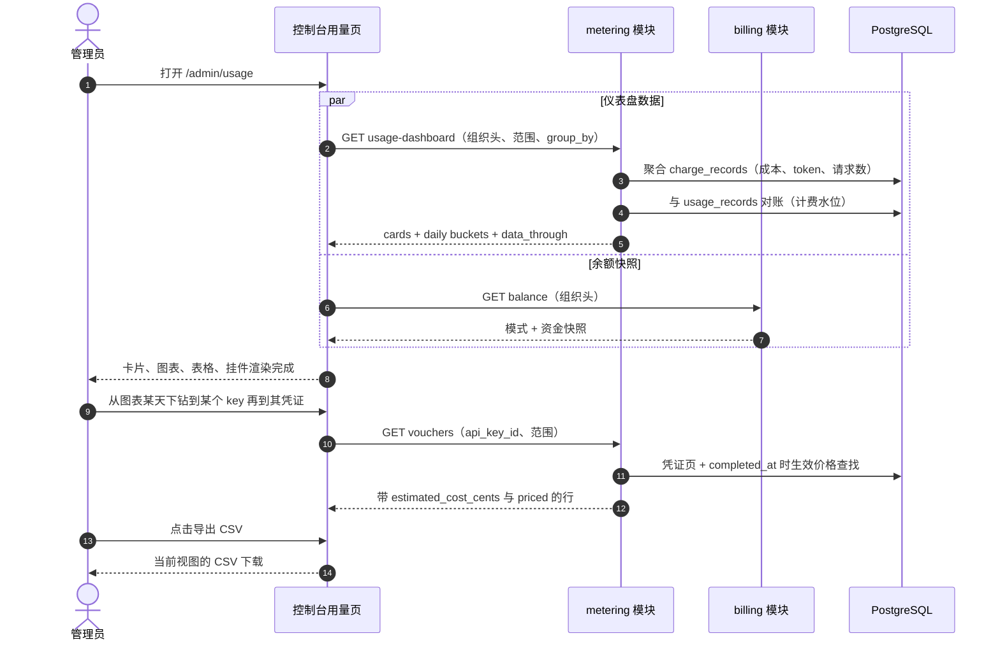
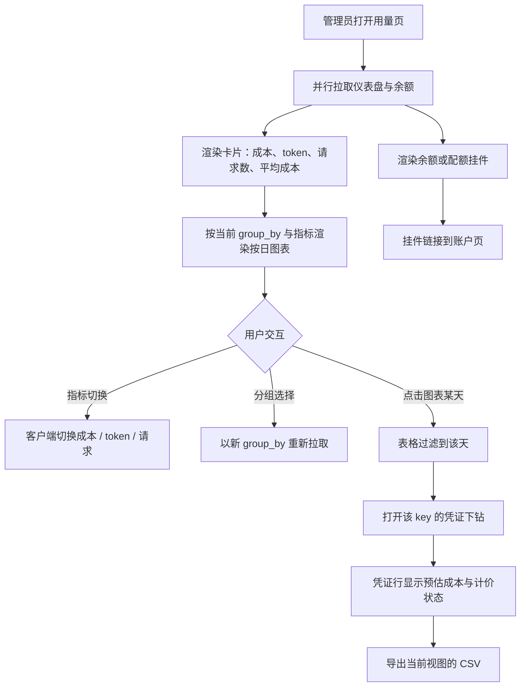

# 用量仪表盘与单请求成本归因 — 需求分析与 UI/UX 设计

| 属性 | 内容 |
| --- | --- |
| 特性点 | 用量仪表盘与单请求成本归因 |
| 文档范围 | 统一「用量 × 成本」视图的需求分析与 UI/UX 设计：`GetUsageDashboard` API（汇总卡片 + 按日分桶 × 分组维度）、凭证上的单请求预估成本、控制台 `/admin/usage` 仪表盘升级（图表、指标切换、分组维度、CSV 导出、余额/配额挂件），以及验收标准 |
| 归属模块 | `metering`（仪表盘聚合、凭证成本归因），只读消费 `billing` 计费记录与 `GetBalance`；控制台 Web 应用；不改动结算、计费或账户管道 |
| 相关文档 | [架构设计](./architecture.zh-cn.md) — 第 2.5 节 `metering`、第 2.6 节 `billing` · [Token 计量凭证与异步结算](./metering.zh-cn.md) — 被扩展的用量数据与凭证面 · [模型 × 卡型价格矩阵与阶梯定价](./pricing.zh-cn.md) — 每个成本数字背后的 D2 计费公式与生效日期价格 · [余额（预付费）与配额（后付费）账户模式](./balance-quota.zh-cn.md) — 挂件展示的 `GetBalance` 快照 · [多租户隔离](./multi-tenancy.zh-cn.md) — 组织范围 |
| 状态 | 设计完成，已移交架构师代理 |

---

## 1. 背景与竞品调研

特性 #1–#8 已闭环账务主干：API Key 标识调用方，模型一键部署，每次推理请求都留下防篡改的计量凭证并按 key 每小时结算，价格矩阵把已结算用量转换为计费记录与月度账单，组织拥有一切资源，计费账户以预付费余额或后付费配额管控推理。控制台仍回答不了的是运营者的第一个问题 — *这些用量花了多少钱，是哪些请求驱动的？* 用量页只显示按 key 的 token 计数，任何地方都看不到成本；成本只存在于定价与账单页的（key、模型、卡型、小时）粒度；余额与配额在账户页，远离它们所限制的用量；计量设计明确将单请求成本归因延后到价格存在之后。价格现在已经存在。本特性把用量 × 成本统一进一个仪表盘 — 汇总卡片、带指标与分组切换的按日图表、凭证上的单请求预估成本、CSV 导出，以及旁边的组织余额/配额快照 — 作为 #4、#5 与 #8 已产出数据之上的只读层。结算、计费或账户管道没有任何改动。

### 1.1 竞品的用量与成本呈现

| 产品 | 用量与成本面 | 下钻 | 导出 | 主要陷阱 |
| --- | --- | --- | --- | --- |
| **OpenAI Platform** | 按项目/key/模型的用量页：按日粒度的成本与 token 图表，带成本/token 指标切换 | 图表 → 用量行；无单请求成本视图 | 用量 CSV 导出 | 用量延迟（分钟级）困扰调试；「今日（部分）」标记需要解释 |
| **Anthropic Console** | 按日、按模型的用量与成本；单请求用量查看器 | 日 → 模型 → 单请求行 | API 导出 | 单请求查看器仅管理员可见；成员只能看聚合 |
| **AWS Bedrock + Cost Explorer** | 带分组维度与按日/按月粒度的消费仪表盘；预测 | Cost Explorer → 用量行 → CloudWatch 调用日志 | CSV 导出 | 指标与成本分居两个系统 — 一个故事、两个控制台 |
| **Together AI** | 按模型/key 对照预付点数的用量仪表盘 | Key → 用量历史 | — | 新鲜度（调用 → 用量可见）无文档 |
| **SiliconFlow** | 按模型、按日的 token 用量外加余额历史 | 未暴露 | — | 无单请求审计；有争议的计费无法追溯到请求 |
| **百度千帆** | 按模型/服务的用量统计；月度结算视图 | 模型 → 用量统计 | 企业版导出 | 资源包与余额是一个控制台里的两本账 |
| **阿里云百炼 / 火山方舟** | 用量与消费仪表盘挨着预付费余额 | 模型 → 用量明细 | 控制台导出 | 余额与用量分居不同标签页，割裂消费语境 |

### 1.2 提炼出的模式与决策

值得采纳的模式：(1) **汇总卡片位于指标切换图表之上** — OpenAI 的成本/token 切换与 AWS 的分组维度作用于同一条按日序列，一个同时服务卡片 + 分桶的仪表盘端点避免 N+1 调用的慢控制台；(2) **三级下钻** — Stripe 的支付模式（图表 → 底层行 → 单个事件）恰好映射到图表 → 按 key/模型表格 → 凭证，范围与过滤器在每一级向下携带；(3) **新鲜度标注** — 每一级都有「当前小时待结算」徽标与数据截止时间戳，因为用量延迟困惑是被最一致记录的陷阱；(4) **导出** — 当前视图的 CSV，让审计者离线工作；(5) **用量旁的消费语境** — Anthropic 的点数加限额标注，即组织余额/配额快照紧挨着消耗它的用量。

需要避免的陷阱：N+1 调用拼装的仪表盘；无单请求可追溯性的成本（SiliconFlow 的争议死胡同）；用量与成本分居不同页面（AWS 的双控制台故事）；刻意轻依赖的控制台里塞入重型图表库；静默缺失的待结算小时；以及浮点金额 — 这里的每个数字都是整数分（billing D2）。

**go-taas 的决策**：

| # | 决策 | 依据 |
| --- | --- | --- |
| D1 | **一个新 RPC `GetUsageDashboard`** 置于 `MeteringService`，而非扩展 `GetUsageSummary` — 单次调用返回卡片 + 按日分桶 × 分组维度 | 仪表盘同时需要三种形状（头条卡片、时间序列、分组序列）；硬加到 `GetUsageSummary` 上会破坏其对既有消费方的既定行语义，而拆成多次调用会重演 N+1 慢控制台；专用 RPC 让两者都保持稳定且增量 |
| D2 | **单请求成本读取时计算，绝不存储在凭证上** — `estimated_cost_cents` 按 `completed_at` 时生效日期价格套用定价 D2 公式，带相同的默认卡型回退 | 凭证保持不可变的审计原子（计量 D1）；生效日期价格让固定费率重算精确，且价格修正后追溯自愈；在结算时存储成本会把凭证耦合到定价，并在价格修正时冻结错误值 |
| D3 | **阶梯请求标注为估算值** — 当组织当月（模型、卡型）用量跨入阶梯时，单请求固定费率成本偏离实际计费（阶梯费率在计费记录上）；控制台处处将该列标注为「预估成本」 | 单请求的阶梯拆分至多是按比例分摊；诚实胜过虚假精度 — 单位歧义陷阱在请求级重演 |
| D4 | **仪表盘数字聚合 `charge_records`**（携带按 key × 模型 × 卡型 × 小时的 token 合计、请求数与金额），**并与 `usage_records` 对账**，使已结算但尚未计费的小时以待结算浮出而非静默缺失 | 一个数据源回答全部三种分组与两个指标族；对账让新鲜度故事保持诚实且零新增管道工作 — 本特性是只读的 |
| D5 | **`group_by` 在服务端** — `api_key`（默认）、`model`、`accelerator_type`；切换即重新拉取。**指标切换（成本 / token / 请求）在客户端**，因为每个分桶携带全部三个指标 | 载荷保持一个分组维度宽；切换即时生效（OpenAI/AWS 模式）；卡型分组是我们的计费记录本就携带的 Cost Explorer 维度 |
| D6 | **UTC 按日分桶，范围内每天一条**（安静日为空分组），范围上限 **92 天**；校验复用 **10404** | 按日粒度匹配所有调研过的仪表盘并保持载荷 ≤ 92 个点；上限与码复用让计量范围契约统一 |
| D7 | **图表以内联 SVG 渲染** — 每天一根柱，按分组堆叠 — 不新增图表依赖 | 控制台刻意轻依赖；按日柱状图是一个小而可测的 SVG 组件；重型图表库是控制台陷阱 |
| D8 | **余额/配额挂件原样复用 `GetBalance`** — 预付费显示余额，后付费显示当月消费 vs 配额；无账户的组织渲染弱化的「暂无计费账户」状态 | 用量旁的消费语境是 Anthropic 模式；无新 API 且 billing 无改动；挂件的日历月窗口加标注以区别于卡片的所选范围 |
| D9 | **CSV 导出由客户端从当前表格视图生成**（用量表或凭证列表）— UTF-8、表头行、含成本列 | 审计者无需新导出 API 即可离线取数；这接手了计量延后的凭证导出事项；全范围的服务端导出留作未来工作 |
| D10 | **无新错误码** — 10404 覆盖仪表盘范围校验；10403 保持在凭证查询上；挂件把 10503 当作空态而非错误 | 计量查询间统一的范围契约；余额特性已拥有 105xx 段 |

## 2. 目标与非目标

**目标**：一个 `GetUsageDashboard` RPC（卡片 + 按日分桶 × 分组维度，组织范围，范围 ≤ 92 天，复用 10404）；`ListVouchers`/`GetVoucher` 上的单请求 `estimated_cost_cents` + `priced`，读取时计算；`/admin/usage` 升级 — 汇总卡片、带指标切换与分组的内联 SVG 图表、既有表格与凭证列表上的成本列、当前视图的 CSV 导出、复用 `GetBalance` 的余额/配额挂件；每一级的待结算小时与未计价标注。

**非目标**：实时流式用量（小时级节奏不变）；预测与异常告警；保存的自定义视图；短范围的小时分桶；全范围的服务端导出 API；租户自助仪表盘（#6/#7）；支付、发票、回执（#14）；请求日志与 playground 元数据（#12 — 本特性归因成本，#12 展示完整请求上下文）；对结算、计费或账户管道的任何改动（只读特性）；新错误码。

## 3. 用户角色

| 角色 | 描述 | 与仪表盘的交互 |
| --- | --- | --- |
| **平台管理员** | 运营集群的人；今天也是控制台用户 | 盯消费、按模型/卡型分组、下钻到凭证、导出 CSV |
| **组织管理员（未来）** | 租户侧管理员 | 将看到本组织的仪表盘（按租户范围，#6） |
| **智能体 / SDK** | 程序化消费方 | 从不调用仪表盘 API；其请求生成被归因的用量与成本 |
| **审计者** | 解决成本争议的人 | 沿卡片 → 日 → key → 凭证估算 → 价格条目追溯 |
| **计费管道** | 特性 #5 的计费引擎 | 不变 — 仪表盘只读取其计费记录 |

> 术语：消费方调用者称为**智能体**（Agent），与仓库惯例一致。

## 4. 用户旅程

| # | 旅程 | 步骤 |
| --- | --- | --- |
| J1 | **钱花哪儿了？** | 管理员打开用量页 → 成本卡片引起注意 → 按模型分组 → 图表显示某天有尖峰 → 点击该天 → 表格过滤 → 凭证下钻展示带预估成本的昂贵请求 |
| J2 | **配额盯防** | 后付费组织 → 挂件显示消费 vs 配额持续上行 → 管理员打开账户页上调配额或规划当月 |
| J3 | **争议计费** | 审计者按账单范围打开仪表盘 → 下钻到凭证 → 导出 CSV → 离线对照账单核对 |
| J4 | **未计价用量** | 未计价徽标出现 → 管理员检查价格矩阵 → 补上缺失的（模型、卡型）单元格 → 下次计费即计价，且过去的估算读取时自愈（D2） |

## 5. 功能需求与验收标准

### FR1 — `GetUsageDashboard` API

- **FR1.1** `GET /api/v1/admin/metering/usage-dashboard`（经 `X-Organization-Id` 限定组织范围）接受 `since`/`until`（unix 秒；默认 `until = now`，`since = until − 24h`）与 `group_by`（默认 `api_key` | `model` | `accelerator_type`）。`since > until` 或范围 > 92 天返回 10404 — 与所有计量查询相同的契约（D6）。
- **FR1.2** 响应的 `cards` 携带 `total_cost_cents`、`currency`、四个 token 合计、`request_count`、`unpriced_request_count` 与 `data_through`（计费覆盖的最后一个完整小时）。单请求平均成本由客户端推导（成本 ÷ 请求数）— 线上只传整数分。
- **FR1.3** 响应的 `daily_buckets` 在范围内每个 UTC 日携带一条（安静日为空分组，让图表诚实渲染空档）；每条含 `date` 与 `groups[]` — `group_key`、`cost_cents`、四个 token 合计、`request_count` 与 `priced`（任一贡献计费记录未计价即为 false，被低估的成本绝不静默）。
- **FR1.4** 聚合遵循 D4：数字来自 `charge_records`，`data_through` 是计费水位；已结算但尚未计费的小时以待结算徽标浮出而非被半计数（计费运行前它们没有模型/卡型拆分）。

### FR2 — 凭证上的单请求预估成本

- **FR2.1** `ListVouchers` 与 `GetVoucher` 响应新增两个增量字段：`estimated_cost_cents`（int64，JSON 字符串）与 `priced`（bool）— 读取时计算，绝不存储（D2）。
- **FR2.2** 计算：按定价 D6 的规则解析卡型（事件字段 → `service_id` 查找 → `default`），再查找 `completed_at` 时（模型、卡型）的生效价格，带（模型、`default`）回退；无条目时 `priced = false` 且成本为 0。否则 `priced = true` 且成本为定价 D2 公式 — `prompt×in + completion×out + reasoning×out + cached×cache`，÷ 1M，取整到分。
- **FR2.3** 该值构造上就是估算（D3）：固定费率，无单请求阶梯拆分。控制台处处将该列标注为「预估成本」，附解释生效日期与阶梯的提示框。
- **FR2.4** 价格查找按结果页批量并缓存 — 每个不同（模型、卡型、日）一次，而非每行一次 — 让 100 行的凭证页保持快速（指标）。

### FR3 — 控制台仪表盘视图流程

1. 管理员打开**用量**（`/admin/usage` — 原地升级；无新导航项）。
2. 控制台并行拉取 `GetUsageDashboard`（默认 24 h，`group_by = api_key`）与 `GetBalance`。
3. 页头渲染余额/配额挂件（FR6）。卡片行渲染总成本、输入/输出 token、请求数与单请求平均成本；`unpriced_request_count > 0` 时出现未计价徽标。
4. 图表按当前指标（成本）渲染每天一根柱、按分组堆叠 — 内联 SVG，无新依赖（D7）。
5. 既有按 key 表格渲染在下方并新增**成本**列；已结算/待结算徽标与新鲜度说明不变。
6. 范围预设（24 h / 7 d / 30 d / 自定义）与分组变更触发重新拉取；范围越过 `data_through` 时待结算小时徽标出现（AC8）。

### FR4 — 下钻流程（图表 → 表格 → 凭证）

1. 点击图表某天将表格过滤到该天 — 范围向下携带（Stripe 模式）。
2. 既有行操作「按模型」与「凭证」打开预过滤到该行 key 与活跃范围/天的下钻；按模型对话框同样新增成本列。
3. 凭证列表显示**预估成本**列（`voucher-cost-{id}`）与计价状态 — `priced = false` 时显示「未计价」徽标而非金额。
4. `GetVoucher` 详情同时展示预估成本、计价状态、token 拆分与结算状态 — 无需第二次调用的完整审计视图。
5. 凭证下钻天然受 90 天凭证保留期约束（计量 D7）；仪表盘本身读取计费记录，其保留期无限。

### FR5 — CSV 导出流程

1. **导出 CSV** 按钮（`usage-export-csv`）位于表格控件旁。
2. 点击后下载带表头行的 UTF-8 CSV，镜像当前表格视图 — 已加载的行与列，含成本 / 预估成本 — 命名为 `usage-{view}-{since}-{until}.csv`（D9）。
3. 导出精确反映屏幕上的内容（当前过滤器与页）；全范围的服务端导出留作未来工作（开放问题）。

### FR6 — 余额/配额挂件流程

1. 页面加载时挂件调用 `GetBalance` — 原样复用（D8）— 并随页面既有的 60 秒轮询刷新。
2. 预付费：「余额 $X」加当月消费。后付费：「本月消费 $Y / $Z」加进度条 — 超配额琥珀色，超额策略已触发时红色（#8 的颜色语言）。
3. 挂件链接到账户页以执行充值与配额操作。
4. 无计费账户的组织（10503）渲染弱化的「暂无计费账户」状态 — 绝不显示错误横幅。
5. 挂件的窗口是计费周期（日历月，标注「本月」），显式区别于卡片的所选范围。

### 仪表盘加载与下钻时序

### 仪表盘交互流程

### 验收标准

| # | 标准 | 验证方式 |
| --- | --- | --- |
| AC1 | **仪表盘往返** — 给定一个组织在三天内有已结算且已计费的用量，当控制台加载 `/admin/usage`，则 `GetUsageDashboard` 返回的卡片成本、token 与请求数等于范围内计费记录之和，且按日分桶渲染出图表（`usage-dashboard-cards`、`usage-chart` 存在） | FVT + E2E |
| AC2 | **分组维度** — 给定跨多个 key、模型与卡型的同一数据，当 `group_by` 先后为 `model` 与 `accelerator_type`，则序列相应重组，且每个维度下的分组合计仍与卡片总数一致 | FVT + E2E |
| AC3 | **指标切换** — 给定已渲染的仪表盘，当指标切换成本 → token → 请求，则图表从已加载的响应重新渲染，无额外 API 调用 | E2E |
| AC4 | **单请求预估成本** — 给定一张其（模型、卡型）在 `completed_at` 有生效价格的凭证，当 `ListVouchers`/`GetVoucher` 返回它，则 `estimated_cost_cents` 等于带默认卡型回退的定价 D2 公式且 `priced = true`；给定无价格条目，则 `priced = false` 且成本为 0；控制台在 `voucher-cost-{id}` 下渲染该值并标注「预估成本」 | 单元 + FVT + E2E |
| AC5 | **CSV 导出** — 给定已渲染的用量表或凭证列表，当用户点击导出 CSV，则下载带表头行的 UTF-8 CSV，镜像当前视图的行与列（含成本列） | E2E |
| AC6 | **余额挂件** — 给定带预付费账户的组织，当页面加载，则 `usage-balance-widget` 显示来自 `GetBalance` 的余额；给定后付费账户，则显示当月消费对照配额；给定无账户，则显示弱化的「暂无计费账户」状态且无错误横幅 | E2E |
| AC7 | **范围校验** — 给定 `since > until` 或范围超过 92 天，当调用 `GetUsageDashboard`，则返回 10404 且控制台内联浮出消息 | 单元 + FVT |
| AC8 | **待结算小时徽标** — 给定请求范围越过 `data_through` 进入当前（未计费）小时，当仪表盘渲染，则待结算徽标随数据截止时间戳出现，且新鲜度说明解释小时级节奏 | E2E |

## 6. 控制台信息架构

导航：**用量**（`/admin/usage`）原地升级 — 无新导航项；计费分组不变（挂件链接到账户页）。

| 页面 / 组件 | 用途 | 关键 testid |
| --- | --- | --- |
| **余额/配额挂件**（页头） | 用量旁的消费语境：余额或配额进度、「本月」标注、账户页链接 | `usage-balance-widget` |
| **汇总卡片** | 总成本、输入/输出 token、请求数、单请求平均成本；未计价徽标 | `usage-dashboard-cards`、`usage-card-cost`、`usage-card-tokens`、`usage-card-requests`、`usage-card-avg-cost`、`usage-unpriced-badge` |
| **指标切换** | 成本 / token / 请求 — 客户端切换（D5） | `usage-metric-toggle` |
| **分组选择** | API key / 模型 / 卡型 — 重新拉取 | `usage-groupby-select` |
| **按日图表** | 按分组堆叠的内联 SVG 柱；点击某天过滤表格 | `usage-chart`、`usage-chart-day-{date}` |
| **用量表格** | 既有按 key 表格 + 成本列 + 下钻操作 | `usage-table`、`usage-row-{api_key_id}` |
| **导出 CSV** | 下载当前视图 | `usage-export-csv` |
| **凭证下钻** | 既有对话框 + 预估成本列与计价徽标 | `voucher-cost-{voucher_id}` |
| **待结算徽标** | 「当前小时待结算」+ 数据截止时间戳 | `usage-pending-badge` |

空态：「该范围内暂无用量」（既有）与「暂无计费账户」（挂件）。颜色语言：图表序列使用固定分组调色板；挂件继承 #8 — 预付费蓝、后付费紫、超配额琥珀、阻断红；未计价是灰色徽标，绝不红色（运营缺口而非事故 — 定价 D8 的哲学）。

## 7. API 面

所有仪表盘 API 属于 **`taas.metering.v1.MeteringService`**（proto：`proto/taas/metering/v1/metering.proto`），经控制网关以 HTTP 提供，经 `X-Organization-Id` 限定组织范围；挂件的调用属于 `taas.billing.v1.BillingService` 且不变。proto 变更仅增量；仪表盘 RPC 经共享数据库只读地读取 `billing` 拥有的 `charge_records` — 与定价 #5 反向建立的同一跨模块读取。

| RPC | HTTP | 状态 | 用途 |
| --- | --- | --- | --- |
| `GetUsageDashboard` | `GET /api/v1/admin/metering/usage-dashboard` | **新增** | 单次调用返回卡片 + 按日分桶 × 分组维度（D1） |
| `ListVouchers` | `GET /api/v1/admin/metering/vouchers` | 扩展 | + `estimated_cost_cents`、`priced`（D2） |
| `GetVoucher` | `GET /api/v1/admin/metering/vouchers/{voucher_id}` | 扩展 | + `estimated_cost_cents`、`priced` |
| `GetBalance` | `GET /api/v1/admin/billing/balance` | 复用，不变 | 挂件资金快照（#8） |

契约约束：

1. `GetUsageDashboard` 校验 `since`/`until`（int64 unix 秒；默认 `until = now`，`since = until − 24h`）与 `group_by`（枚举；默认 `api_key`）。`since > until` 或范围 > 92 天返回 10404；无法识别的 `group_by` 值按标准请求校验失败 — 无新码（D10）。
2. `cards`：`total_cost_cents`（int64，JSON 字符串）、`currency`、`prompt_tokens` / `completion_tokens` / `cached_tokens` / `reasoning_tokens`、`request_count`、`unpriced_request_count`、`data_through`（int64）。仅整数分 — 平均值由客户端推导。
3. `daily_buckets`：范围内每个 UTC 日一条；每条携带 `date`（日起点）与 `groups[]`，含 `group_key`、`cost_cents`、四个 token 合计、`request_count`、`priced`。每个分桶携带全部指标，指标切换绝不重新拉取（D5）。
4. 凭证上的 `estimated_cost_cents` / `priced` 按 FR2.2 在查询时计算且为增量 — 既有消费方可安全忽略。
5. 分组显示名（key 名、模型名）由控制台从既有列表 API 解析，匹配既有模式；响应只携带 id。
6. 线格式惯例不变：适用列表处点分分页、成功 HTTP 200、业务错误为 `{"code": <int>, "message": "..."}`、int64 分序列化为 JSON 字符串。

## 8. 错误码

计量段 10401–10499 与 billing 段 10501–10599（`pkg/errors/codes.go`）— 无新码（D10）：

| 条件 | 码 | 常量 | 备注 |
| --- | --- | --- | --- |
| `GetUsageDashboard` 上畸形时间范围（`since > until`、范围 > 92 天） | 10404 | `CodeMeteringRangeInvalid` | **复用** — 仪表盘加入统一的计量范围契约 |
| `ListVouchers` 上畸形时间范围（既有行为） | 10404 | `CodeMeteringRangeInvalid` | 不变 |
| `GetVoucher` 上未知 `voucher_id` | 10403 | `CodeMeteringVoucherNotFound` | 既有 |
| 组织无计费账户（挂件的 `GetBalance`） | 10503 | `CodeAccountNotFound` | 既有；控制台渲染空态而非错误 |
| 数据库 / MQ 基础设施故障 | 500 | `CodeInternal` | 经错误归一化 |

## 9. 指标

- `GetUsageDashboard` 在 92 天范围上 p95 ≤ 500 ms（对带索引的小时级计费记录聚合）。
- 带成本归因的 `ListVouchers` / `GetVoucher`：100 行整页 p95 ≤ 300 ms（FR2.4 的批量查找）。
- 仪表盘首屏（卡片 + 图表 + 挂件）在默认 24 h 范围上经两次并行调用 ≤ 1 s。
- 100 行视图的 CSV 导出在客户端 ≤ 100 ms 内完成。
- 任何仪表盘路径零新增写入 — 构造上只读（D4）；任何结算或计费延迟回退都是本特性的缺陷。

## 10. 开放问题

| 问题 | 倾向 |
| --- | --- |
| 范围 ≤ 48 h 时的小时分桶（短范围只渲染单根日柱） | 未来细化 — 按日 v1 匹配所有调研过的仪表盘 |
| 面向大型审计的全范围服务端 CSV/JSON 导出 | 未来控制台增强 — v1 导出当前视图（D9） |
| 在结算时存储单请求成本以精确归因阶梯 | 保持读取时计算（D2）；仅在估算争议反复出现时重议 |
| 预测与异常告警（Cost Explorer 模式） | 未来特性 — 需要比 v1 更多的历史数据 |
| 租户自助仪表盘与按租户范围 | 先做 #6/#7 |
