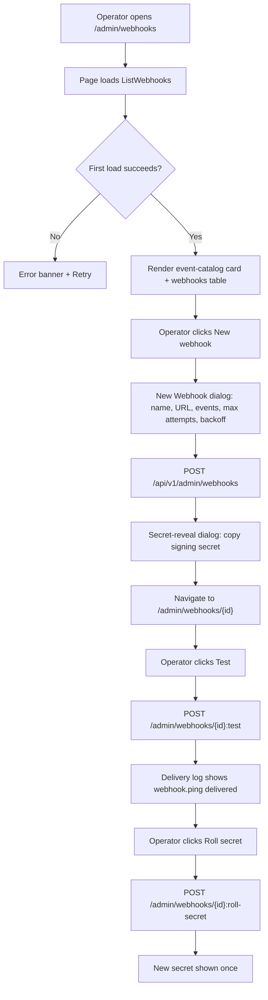
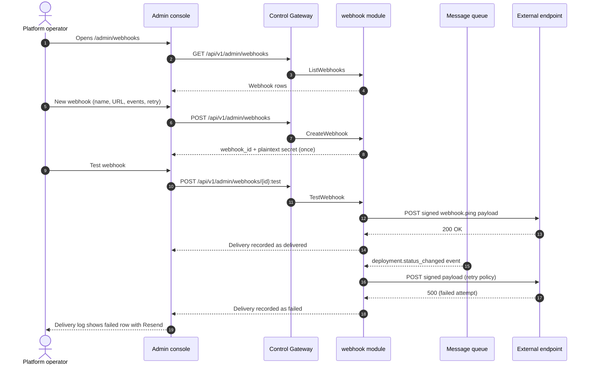

# Webhook Notifications & Event Subscriptions — Requirement Analysis and UI/UX Design

| Attribute | Content |
| --- | --- |
| Feature point | Webhook notifications & event subscriptions — configure outbound webhooks to receive platform events (deployment status, autoscaling, billing/invoice, spend-limit breach, balance-low) with per-event-type enablement, signing secret, retry policy and delivery log (backlog row 23) |
| Document scope | Requirement analysis, competitive research, the admin-surface webhook management pages for `/admin/webhooks` (list, create, detail with delivery log), the end-user-surface webhook management pages for `/webhooks`, the page → API surface table, and numbered acceptance criteria |
| Owning modules | `webhook` (new — owns webhook endpoint CRUD, event subscription, signing, retry and delivery log; subscribes to the message queue for the event catalog), `web` admin console (`WebhooksPage`, `WebhookDetailPage`) and end-user console (`UserWebhooksPage`, `UserWebhookDetailPage`), `pkg/server` gateway (admin-prefix and user-prefix bindings) |
| Related documents | [Architecture Design](./architecture.md) — §1.2 message queue, §2 module responsibilities · [Console Surface Separation](./console-surface-separation.md) — the two surfaces this feature spans, the `UserShell`/`AdminShell` conventions, the masked-projection rule · [Inference Autoscaling](./inference-autoscaling.md) — the autoscaling events this feature subscribes to · [Payments, Invoices & Auto-Recharge](./payments-invoices-auto-recharge.md) — the billing/invoice events · [Balance & Quota](./balance-quota.md) — the balance-low and spend-limit events · [Audit Logging](./audit-logging.md) — the audit trail webhook mutations must produce |
| Status | Design complete, handed to the Architect agent |

---

## 1. Background

go-taas is a Token-as-a-Service platform: it deploys inference services (feature #2), autoscales them (feature #16), meters and bills usage (features #4, #5, #8, #14), and enforces spend limits (feature #11). Today all of this state is **pull-only**: an operator or tenant must open the console and poll to learn that a deployment failed, a service scaled, an invoice was issued, a spend limit was breached, or a balance ran low. There is no way for an external system — an ops tool like Slack or PagerDuty, a tenant's own billing integration, or a CI pipeline — to be **pushed** the events it cares about as they happen.

This feature adds **outbound webhooks**: the operator or tenant registers an HTTPS endpoint, subscribes it to a subset of the platform's event catalog, and the platform delivers a signed JSON payload to that endpoint whenever a subscribed event occurs. Each webhook carries a per-event-type enablement, a signing secret for authenticity, a retry policy for resilience, and a delivery log for observability and manual resend. It is the smallest independently valuable increment of Phase 4's event-integration roadmap item: it turns "the platform changed state" into "the platform told my system about it".

### 1.1 How Comparable Products Expose Webhook / Event-Subscription Management

| Product | Webhook surface | Signing | Retry | Delivery log | Notable pitfalls |
| --- | --- | --- | --- | --- | --- |
| **Stripe** | Dashboard "Webhooks" tab + API; register an endpoint URL, select event types, get a `whsec_` signing secret | HMAC-SHA256 signature in a `Stripe-Signature` header with a timestamp; per-endpoint secret; secret roll with optional delayed expiry | Automatic exponential backoff up to 3 days in live mode; manual resend up to 15 days | "Event deliveries" tab: Delivered / Pending / Failed, HTTP status code, next-retry time | Complex event versioning; 3-day retry window is long; IP allowlisting adds ops burden |
| **GitHub** | Repo/org webhooks; subscribe to event types, optional secret, delivery history with redelivery and a "ping" test event | Optional HMAC-SHA256 secret; signature in `X-Hub-Signature-256` | Automatic retries with backoff; manual redelivery from the delivery history | "Recent deliveries" per webhook: status, response code, duration, payload | Secret is optional (weak default); no per-event-type enablement after creation in some flows |
| **OpenAI Platform** | No general outbound webhook surface for platform events; only per-request streaming and limited assistant-event tooling | n/a | n/a | n/a | No event-subscription model to compare |
| **Anthropic Console** | No general outbound webhook surface for platform events | n/a | n/a | n/a | No event-subscription model to compare |
| **Together AI / SiliconFlow** | Endpoint-level metrics and alerts in the console; limited or no outbound webhook delivery | n/a | n/a | n/a | Passive alerts, not a general event-subscription surface |

### 1.2 Distilled Patterns and Decisions

Patterns worth adopting: (1) **endpoint + event-type subscription** — Stripe and GitHub both reduce webhook configuration to "a URL plus the events you care about", which is the smallest useful model; (2) **per-event-type enablement** — Stripe's `enabled_events` and GitHub's event selection let a consumer subscribe narrowly, which is both a bandwidth and a security win; (3) **HMAC-SHA256 signing with a per-endpoint secret** — Stripe's `whsec_` and GitHub's `X-Hub-Signature-256` are the industry-standard authenticity mechanism; (4) **a retry policy** — both Stripe and GitHub retry failed deliveries with backoff so a transient endpoint outage does not lose events; (5) **a delivery log with manual resend** — Stripe's "Event deliveries" tab and GitHub's "Recent deliveries" are the canonical debugging surface; (6) **a test/ping event** — GitHub's ping and Stripe's `stripe trigger` let a consumer verify an endpoint before real events flow.

Pitfalls to avoid: making the signing secret optional (GitHub) — go-taas requires a secret on every endpoint; a 3-day retry window (Stripe) — go-taas uses a bounded, configurable retry policy; complex event versioning (Stripe) — go-taas ships a fixed v1 event schema; IP allowlisting (Stripe) — out of scope for v1; and a delivery log that hides the HTTP status code (some tools) — the log must show status, attempts, and timestamps.

**Decisions for go-taas**:

| # | Decision | Rationale |
| --- | --- | --- |
| D1 | **Webhook management exists on both surfaces, with a clean event split.** The admin surface (`/admin/webhooks`, `/api/v1/admin/webhooks/*`) subscribes to **platform orchestration events** — `deployment.status_changed`, `autoscaling.scaled`, `autoscaling.scale_to_zero`. The end-user surface (`/webhooks`, `/api/v1/webhooks/*`) subscribes to **tenant account events** — `billing.invoice_created`, `billing.invoice_paid`, `billing.spend_limit_breached`, `billing.balance_low` | Deployment and autoscaling are operator-orchestration state (feature #16, #2); billing, spend-limit and balance are tenant account state (features #14, #11, #8). Splitting the catalog by surface follows feature #17's masked-projection rule: a tenant must not see operator orchestration internals, and an operator's webhook for deployment events is operator-scoped. Both surfaces share the same page structure and interaction model |
| D2 | **A webhook is an endpoint URL + a set of enabled event types + a signing secret + a retry policy.** The URL is required and must be a valid `https://` (or `http://` for local testing) URL; the event types are a non-empty subset of the surface's catalog; the signing secret is auto-generated per endpoint and shown once at creation; the retry policy is `max_attempts` (1–10, default 5) and `backoff_seconds` (1–3600, default 60) | Mirrors the Stripe/GitHub model in the smallest field list (D1's pattern 1–4). A required secret and a bounded retry policy avoid the GitHub weak-default and Stripe long-window pitfalls |
| D3 | **Every delivery is signed with HMAC-SHA256** using the endpoint's secret, over the raw JSON body, with a timestamp and a signature in a `X-Go-Taas-Signature` header (`t=<ts>,v1=<sig>`). The secret is stored only as a hash; the plaintext is shown once at creation and on explicit reveal | HMAC-SHA256 over the raw body with a timestamp is the Stripe/GitHub standard and prevents tampering and replay (Stripe's manual-verification pattern). Storing only a hash means the plaintext cannot be recovered from storage, matching the API-key pattern (feature #1) |
| D4 | **A webhook can be enabled or disabled (paused).** A disabled webhook stops receiving deliveries but keeps its config, secret, and delivery log; re-enabling resumes delivery. Deleting a webhook removes it and its delivery log | Pausing is the low-risk way to stop a misbehaving endpoint without losing configuration; it matches Stripe's disable/re-enable behavior |
| D5 | **A webhook has a test/ping action** that sends a synthetic `webhook.ping` event to the endpoint and records it in the delivery log | GitHub's ping and Stripe's trigger are the canonical way to verify an endpoint before real events flow (D1's pattern 6) |
| D6 | **The delivery log lists every delivery** with its event type, status (`delivered` / `failed` / `pending`), HTTP status code, attempt count, and timestamps. A failed delivery can be **resent** manually; the log is retained for 90 days | The delivery log is the debugging surface (D1's pattern 5); manual resend recovers a lost event without waiting for the retry policy; 90-day retention matches the request-log retention (feature #12) |
| D7 | **The signing secret can be rolled** (regenerated) at any time; the old secret is invalidated immediately and the new secret is shown once | Secret roll is a Stripe best practice for a suspected compromise; immediate invalidation is the simplest safe default for v1 |
| D8 | **The `webhook` module owns the feature.** It exposes the CRUD/query RPCs, subscribes to the message queue for the event catalog, signs and delivers payloads, applies the retry policy, and records the delivery log. It is a new module in the unified gRPC server (architecture §1.2) | Webhooks consume events from `infer`, `billing`, and `metering`; a dedicated module keeps the delivery concern out of the producing modules and gives it one home, mirroring how `metering` owns settlement |
| D9 | **New error codes in a webhook block (10601–10699)**: **10601 `CodeWebhookNotFound`**, **10602 `CodeWebhookConfigInvalid`**, **10603 `CodeWebhookStateInvalid`**, **10604 `CodeWebhookDeliveryNotFound`**, **10605 `CodeWebhookEventTypeInvalid`** | Webhooks are a new module (D8), so their codes live in a fresh block after the billing block (105xx); distinct codes keep "not found" vs "bad config" vs "bad state" vs "bad delivery" vs "bad event type" actionable |
| D10 | **Webhook mutations are audited** (feature #15): create, update, enable/disable, delete, roll-secret, test, and resend each write an audit event | Webhook endpoints are a security-sensitive surface (they can trigger external actions); the audit trail must record who changed what, matching the audit-logging feature's mutation coverage |

## 2. Goals and Non-goals

**Goals**: an admin page `/admin/webhooks` that lists, creates, edits, enables/disables, deletes, tests, and rolls the secret of webhooks subscribed to platform orchestration events, with a detail page `/admin/webhooks/:webhookId` showing the delivery log and manual resend (D1, D2, D4, D5, D6, D7); an end-user page `/webhooks` with the same structure for tenant account events, plus `/webhooks/:webhookId` (D1); the page → API surface table with exact prefixes (D1); per-page interactive states including empty, error, and permission-denied; numbered acceptance criteria testable in Nightwatch against the compose stack.

**Non-goals**: webhook event versioning (v1 ships a fixed event schema, D1's pitfall); IP allowlisting of delivery sources (Stripe's pattern, out of scope); a 3-day retry window (v1 uses a bounded configurable policy, D2); delivery to non-HTTP sinks (EventBridge/Event Grid — future); a webhook event replay API beyond manual resend (future); tenant visibility of operator orchestration events and operator visibility of tenant account events (D1); a notification center (feature #26 consumes these events in-console — out of scope here).

## 3. Personas and Journeys

| Role | Surface | Journey |
| --- | --- | --- |
| **Platform operator** | admin | Opens `/admin/webhooks` → creates a webhook for `deployment.status_changed` and `autoscaling.scaled` pointing at an ops Slack webhook → reveals the signing secret → sends a test ping → sees a `delivered` row in the delivery log → later sees a `failed` delivery, resends it, and investigates the endpoint |
| **Platform operator (reliability)** | admin | A deployment fails → the webhook fires `deployment.status_changed` → the ops tool pages the on-call engineer → the engineer opens `/admin/webhooks/:id` to confirm the delivery and its payload |
| **Tenant developer / Agent** | end-user | Opens `/webhooks` → creates a webhook for `billing.invoice_created` and `billing.balance_low` pointing at their own billing service → verifies with a test ping → their system reconciles invoices and tops up balance automatically |
| **Tenant finance admin** | end-user | A spend limit is breached → the webhook fires `billing.spend_limit_breached` → their finance system is notified → they raise the limit or pause the key (feature #11) |

> Terminology: the consumer-side caller is an **Agent** in English and 「智能体」 in Chinese, consistent with the repository convention.

## 4. Feature Requirements

### FR1 — Webhook endpoint CRUD (both surfaces)

- **FR1.1** `CreateWebhook` (`POST /api/v1/admin/webhooks` and `POST /api/v1/webhooks`) takes `name`, `url`, `enabled_event_types` (non-empty subset of the surface's catalog), `max_attempts` (1–10, default 5), and `backoff_seconds` (1–3600, default 60). It validates synchronously, generates a signing secret, and returns the webhook with the **plaintext secret shown once** (D2, D3).
- **FR1.2** `ListWebhooks` (`GET /api/v1/admin/webhooks` and `GET /api/v1/webhooks`) returns the surface's webhooks, searchable by name, filterable by `enabled` state, and paginated (`offset`/`limit`, default 20, max 100). Each row carries `webhook_id`, `name`, `url`, `enabled`, `enabled_event_types`, `created_at`, and a delivery summary (total / delivered / failed).
- **FR1.3** `GetWebhook` (`GET /api/v1/admin/webhooks/{webhook_id}` and `GET /api/v1/webhooks/{webhook_id}`) returns the full config including the retry policy and the enabled event types. A missing id returns **10601 `CodeWebhookNotFound`**.
- **FR1.4** `UpdateWebhook` (`PATCH /api/v1/admin/webhooks/{webhook_id}` and `PATCH /api/v1/webhooks/{webhook_id}`) updates `name`, `url`, `enabled_event_types`, `max_attempts`, and `backoff_seconds`. An invalid config returns **10602 `CodeWebhookConfigInvalid`**; an unknown event type returns **10605 `CodeWebhookEventTypeInvalid`**.
- **FR1.5** `DeleteWebhook` (`DELETE /api/v1/admin/webhooks/{webhook_id}` and `DELETE /api/v1/webhooks/{webhook_id}`) deletes the webhook and its delivery log. A missing id returns **10601**.

### FR2 — Enable / disable and secret roll

- **FR2.1** `SetWebhookEnabled` (`POST /api/v1/admin/webhooks/{webhook_id}:set-enabled` and `POST /api/v1/webhooks/{webhook_id}:set-enabled`) enables or disables (pauses) a webhook (D4). A disabled webhook stops receiving deliveries but keeps its config, secret, and delivery log.
- **FR2.2** `RollWebhookSecret` (`POST /api/v1/admin/webhooks/{webhook_id}:roll-secret` and `POST /api/v1/webhooks/{webhook_id}:roll-secret`) regenerates the signing secret, invalidates the old one immediately, and returns the new plaintext secret once (D7).

### FR3 — Test and delivery log

- **FR3.1** `TestWebhook` (`POST /api/v1/admin/webhooks/{webhook_id}:test` and `POST /api/v1/webhooks/{webhook_id}:test`) sends a synthetic `webhook.ping` event to the endpoint and records it in the delivery log (D5). A disabled webhook returns **10603 `CodeWebhookStateInvalid`** (enable it first).
- **FR3.2** `ListWebhookDeliveries` (`GET /api/v1/admin/webhooks/{webhook_id}/deliveries` and `GET /api/v1/webhooks/{webhook_id}/deliveries`) returns the delivery log, filterable by `status` and `event_type`, and paginated. Each row carries `delivery_id`, `event_type`, `status` (`delivered` / `failed` / `pending`), `http_status_code`, `attempt_count`, `created_at`, and `last_attempt_at`. A missing webhook returns **10601**.
- **FR3.3** `ResendWebhookDelivery` (`POST /api/v1/admin/webhooks/{webhook_id}/deliveries/{delivery_id}:resend` and `POST /api/v1/webhooks/{webhook_id}/deliveries/{delivery_id}:resend`) resends a `failed` (or `delivered`) delivery manually (D6). A missing delivery returns **10604 `CodeWebhookDeliveryNotFound`**; resending a `pending` delivery returns **10603**.

### FR4 — Event catalog and delivery

- **FR4.1** The **admin** event catalog is exactly: `deployment.status_changed`, `autoscaling.scaled`, `autoscaling.scale_to_zero` (D1). The **end-user** event catalog is exactly: `billing.invoice_created`, `billing.invoice_paid`, `billing.spend_limit_breached`, `billing.balance_low` (D1).
- **FR4.2** When a subscribed event occurs, the `webhook` module delivers a signed JSON payload to the endpoint (D3): `{"id": <event_id>, "type": <event_type>, "created_at": <ts>, "data": {…}}`. The payload is signed with HMAC-SHA256 over the raw body; the signature and timestamp are in the `X-Go-Taas-Signature` header.
- **FR4.3** Delivery follows the retry policy (D2): up to `max_attempts` attempts with `backoff_seconds` between them; a non-`2xx` response or a network error is a failed attempt. After the final attempt the delivery is `failed` and remains in the log for manual resend (D6).

### FR5 — Surface and API binding

- **FR5.1** The admin webhook pages live on the **admin surface**: routes `/admin/webhooks` and `/admin/webhooks/:webhookId`, API prefix `/api/v1/admin/webhooks/*`. They are added to the `AdminShell` navigation (feature #17) as "Webhooks".
- **FR5.2** The end-user webhook pages live on the **end-user surface**: routes `/webhooks` and `/webhooks/:webhookId`, API prefix `/api/v1/webhooks/*`. They are added to the `UserShell` navigation (feature #17) as "Webhooks".
- **FR5.3** The admin pages call only `/api/v1/admin/webhooks/*` routes; the end-user pages call only `/api/v1/webhooks/*` routes. Neither contains the other surface's prefix string (feature #17, D8).
- **FR5.4** The admin event catalog is never exposed on the end-user surface and vice versa (D1): the end-user create dialog lists only the four tenant events, the admin dialog only the three operator events.

## 5. UI Design

### 5.1 Page: `/admin/webhooks` — Webhooks (admin)

**Purpose**: give the platform operator a single surface to manage webhooks subscribed to platform orchestration events (deployment status, autoscaling).

**Surface**: admin — route `/admin/webhooks`, API `/api/v1/admin/webhooks/*`.

**Layout**: rendered inside `AdminShell` (feature #17). A page header ("Webhooks", subtitle "Deliver platform events to your endpoints") with a **New webhook** action (primary) and a **Refresh** action (secondary). Below the header:

1. **Event catalog** — a read-only card listing the three admin event types (`deployment.status_changed`, `autoscaling.scaled`, `autoscaling.scale_to_zero`) with a one-line description each, so the operator knows what they can subscribe to.
2. **Webhooks table** — the surface's webhooks with columns: **Name** (link), **URL**, **Events** (count of enabled event types), **Status** (badge: enabled green / disabled grey), **Deliveries** (delivered / failed summary), **Created** (relative time), and row actions (**View**, **Edit**, **Enable/Disable**, **Delete**).

**Interactive states**:

| State | Behaviour |
| --- | --- |
| Default | Event-catalog card + webhooks table render from the first successful load; last-updated shows the load time |
| Loading | Skeleton rows in the table; Refresh is disabled |
| Empty | "No webhooks yet — create one to receive platform events." with a **New webhook** action; the event-catalog card stays visible |
| Error | An error banner with the message and a Retry button; the table keeps its last good data with a "Showing stale data" banner |
| Disabled | Refresh is disabled while a load is in flight; **Delete** is disabled while a delete is in flight; **Enable/Disable** is disabled while the toggle is in flight |
| Permission-denied | A session without the required role receives 10036 and the page shows the standard permission-denied state (feature #17) with a link back to the admin home |

**Webhooks table columns**: Name (link), URL, Events (count), Status (badge), Deliveries (delivered / failed), Created (relative time). Sortable by Name, Created, and Deliveries. Filterable by Status (all / enabled / disabled) and searchable by name; paginated.

### 5.2 Dialog: New Webhook (admin)

**Purpose**: register a webhook endpoint and subscribe it to a subset of the admin event catalog.

**Layout**: a modal with the config fields (D2): **Name** (text, required), **Endpoint URL** (URL, required), **Events** (checkbox group of the three admin event types, at least one required), **Max attempts** (number, default 5), **Backoff (seconds)** (number, default 60), and **Cancel** / **Create webhook** actions.

**Validation**:

| Field | Required | Rules | Error copy |
| --- | --- | --- | --- |
| Name | yes | non-empty, ≤ 64 chars | "Enter a webhook name." / "Name must be ≤ 64 characters." |
| Endpoint URL | yes | valid `https://` or `http://` URL, ≤ 2048 chars | "Enter a valid endpoint URL." / "URL must be ≤ 2048 characters." |
| Events | yes | at least one of the three admin event types | "Select at least one event type." |
| Max attempts | yes | integer 1–10 | "Max attempts must be between 1 and 10." |
| Backoff (seconds) | yes | integer 1–3600 | "Backoff must be between 1 and 3600 seconds." |

On submit → `CreateWebhook`; success shows a **secret-reveal dialog** ("Your signing secret — shown once") with the plaintext secret, a **Copy** action, and a **Done** action. An error (10602 config invalid / 10605 event type invalid) shows inline in the dialog.

### 5.3 Page: `/admin/webhooks/:webhookId` — Webhook Detail (admin)

**Purpose**: show one webhook — its config, its signing secret (reveal/roll), and its delivery log with manual resend — so the operator can manage and debug a single endpoint.

**Surface**: admin — route `/admin/webhooks/:webhookId`, API `/api/v1/admin/webhooks/{webhook_id}`.

**Layout**: a detail page under `AdminShell` with a back link to the list. A header with the webhook name, the endpoint URL, and the status badge. Below:

1. **Config** — a read-only card: name, URL, enabled event types (chips), max attempts, backoff, created. Actions: **Edit**, **Enable/Disable**, **Roll secret**, **Test**, **Delete**.
2. **Signing secret** — a card showing the secret masked (`whsec_••••••••`), with **Reveal** and **Roll secret** actions. Reveal shows the plaintext once with a **Copy** action; roll shows the new plaintext once.
3. **Delivery log** — a table of deliveries: **Event type**, **Status** (badge: delivered green / failed red / pending grey), **HTTP status**, **Attempts**, **Created** (relative time), and row actions (**Resend** for failed/delivered rows).

**Interactive states**:

| State | Behaviour |
| --- | --- |
| Default | Config + signing-secret + delivery-log sections render from the first successful load |
| Loading | Skeleton cards and table |
| Error | An error banner with the message and a Retry button; the page keeps its last good data with a "Showing stale data" banner |
| Disabled | **Resend** is disabled while a resend is in flight; **Roll secret** is disabled while a roll is in flight; **Test** is disabled while a test is in flight; **Delete** is disabled while a delete is in flight |
| Permission-denied | A session without the required role receives 10036 and the page shows the standard permission-denied state (feature #17) |
| Not-found | An unknown `webhook_id` returns 10601 and the page shows the standard not-found state with a link back to the list |

**Delivery-log table columns**: Event type, Status (badge), HTTP status, Attempts, Created (relative time). Sortable by Created. Filterable by Status (all / delivered / failed / pending) and by Event type; paginated.

### 5.4 Page: `/webhooks` — Webhooks (end-user)

**Purpose**: give a tenant developer / Agent a surface to manage webhooks subscribed to their tenant account events (billing, spend-limit, balance).

**Surface**: end-user — route `/webhooks`, API `/api/v1/webhooks/*`.

**Layout**: rendered inside `UserShell` (feature #17). A page header ("Webhooks", subtitle "Deliver your account events to your endpoints") with a **New webhook** action (primary) and a **Refresh** action (secondary). Below the header:

1. **Event catalog** — a read-only card listing the four end-user event types (`billing.invoice_created`, `billing.invoice_paid`, `billing.spend_limit_breached`, `billing.balance_low`) with a one-line description each.
2. **Webhooks table** — the tenant's webhooks with the same columns as the admin table (Name, URL, Events, Status, Deliveries, Created) and the same row actions.

**Interactive states**: identical to §5.1, with the empty copy "No webhooks yet — create one to receive your account events." and the permission-denied copy for the tenant's own errors (10005 org gone / 10017 org disabled from §8.2 of feature #17, 10027/10038 redirect per FR4.3).

### 5.5 Page: `/webhooks/:webhookId` — Webhook Detail (end-user)

**Purpose**: show one tenant webhook — config, signing secret, and delivery log — so the tenant can manage and debug a single endpoint.

**Surface**: end-user — route `/webhooks/:webhookId`, API `/api/v1/webhooks/{webhook_id}`.

**Layout**: identical structure to §5.3 under `UserShell`, with the end-user event catalog and the tenant's permission-denied copy. The delivery log shows only the tenant's own deliveries.

### 5.6 Flow

## 6. API Surface Implications

All webhook RPCs belong to the **`webhook` module** (D8), served as HTTP via the Control Gateway. Admin routes are on the **admin prefix** `/api/v1/admin/webhooks/*` (D1); end-user routes are on the **user prefix** `/api/v1/webhooks/*` (D1).

| RPC | Route | Prefix | Status | Purpose |
| --- | --- | --- | --- | --- |
| `CreateWebhook` | `POST /api/v1/admin/webhooks` · `POST /api/v1/webhooks` | admin · user | **new** | Register an endpoint + event subscription; returns `webhook_id` + plaintext secret once |
| `ListWebhooks` | `GET /api/v1/admin/webhooks` · `GET /api/v1/webhooks` | admin · user | **new** | List with name search, enabled filter, pagination, delivery summary |
| `GetWebhook` | `GET /api/v1/admin/webhooks/{webhook_id}` · `GET /api/v1/webhooks/{webhook_id}` | admin · user | **new** | Full config; missing → 10601 |
| `UpdateWebhook` | `PATCH /api/v1/admin/webhooks/{webhook_id}` · `PATCH /api/v1/webhooks/{webhook_id}` | admin · user | **new** | Update name/URL/events/retry; bad config → 10602, bad event → 10605 |
| `DeleteWebhook` | `DELETE /api/v1/admin/webhooks/{webhook_id}` · `DELETE /api/v1/webhooks/{webhook_id}` | admin · user | **new** | Delete webhook + delivery log; missing → 10601 |
| `SetWebhookEnabled` | `POST /api/v1/admin/webhooks/{webhook_id}:set-enabled` · `POST /api/v1/webhooks/{webhook_id}:set-enabled` | admin · user | **new** | Enable/disable (pause) a webhook |
| `RollWebhookSecret` | `POST /api/v1/admin/webhooks/{webhook_id}:roll-secret` · `POST /api/v1/webhooks/{webhook_id}:roll-secret` | admin · user | **new** | Regenerate signing secret; returns new plaintext once |
| `TestWebhook` | `POST /api/v1/admin/webhooks/{webhook_id}:test` · `POST /api/v1/webhooks/{webhook_id}:test` | admin · user | **new** | Send `webhook.ping`; disabled → 10603 |
| `ListWebhookDeliveries` | `GET /api/v1/admin/webhooks/{webhook_id}/deliveries` · `GET /api/v1/webhooks/{webhook_id}/deliveries` | admin · user | **new** | Delivery log with status/event filters, pagination |
| `ResendWebhookDelivery` | `POST /api/v1/admin/webhooks/{webhook_id}/deliveries/{delivery_id}:resend` · `POST /api/v1/webhooks/{webhook_id}/deliveries/{delivery_id}:resend` | admin · user | **new** | Resend a failed/delivered delivery; missing → 10604, pending → 10603 |

**Contract notes for the Architect agent**:

1. `CreateWebhook` validates `name` (non-empty, ≤ 64 chars), `url` (valid `https://` or `http://`, ≤ 2048 chars), `enabled_event_types` (non-empty subset of the surface's catalog, else 10605), `max_attempts` (1–10), and `backoff_seconds` (1–3600); an invalid config returns 10602. It generates a signing secret, stores only its hash (D3), and returns the plaintext secret once.
2. `Webhook` carries `webhook_id`, `name`, `url`, `enabled` (bool), `enabled_event_types` (list), `max_attempts`, `backoff_seconds`, `created_at`, and a delivery summary (`total_deliveries`, `delivered_count`, `failed_count`). The plaintext secret is returned only by `CreateWebhook` and `RollWebhookSecret`.
3. `ListWebhookDeliveries` returns `delivery_id`, `event_type`, `status` (a closed enum: `delivered`, `failed`, `pending`), `http_status_code`, `attempt_count`, `created_at`, `last_attempt_at`. A `failed` delivery carries a `failure_reason`.
4. Delivery (FR4.2): the payload is `{"id", "type", "created_at", "data"}`; the signature is HMAC-SHA256 over the raw JSON body with the endpoint secret, sent in the `X-Go-Taas-Signature` header as `t=<ts>,v1=<sig>`. The retry policy applies up to `max_attempts` with `backoff_seconds` between attempts; a non-`2xx` response or a network error is a failed attempt (FR4.3).
5. The `webhook` module subscribes to the message queue for the event catalog (D8): admin events from `infer` (deployment status, autoscaling), end-user events from `billing` (invoice, spend-limit, balance-low). The module is a new gRPC service in the unified server (architecture §1.2).
6. Webhook mutations are audited (D10, feature #15): create, update, enable/disable, delete, roll-secret, test, and resend each write an audit event.
7. Wire conventions unchanged: dotted pagination where lists apply, HTTP 200 on success, business errors as `{"code": <int>, "message": "..."}`.

Error codes (webhook block 10601–10699, `pkg/errors/codes.go`):

| Condition | Code | Constant | Notes |
| --- | --- | --- | --- |
| An unknown `webhook_id` | 10601 | `CodeWebhookNotFound` | **New** (D9) |
| An invalid webhook config (bad name/URL/retry) | 10602 | `CodeWebhookConfigInvalid` | **New** (D9) |
| An invalid state transition (test/resend on a disabled/pending webhook) | 10603 | `CodeWebhookStateInvalid` | **New** (D9) |
| An unknown `delivery_id` | 10604 | `CodeWebhookDeliveryNotFound` | **New** (D9) |
| An event type not in the surface's catalog | 10605 | `CodeWebhookEventTypeInvalid` | **New** (D9) |
| Database / MQ infrastructure failure | 500 | `CodeInternal` | Via error normalization |

## 7. Acceptance Criteria

| # | Criterion | Level |
| --- | --- | --- |
| AC1 | `CreateWebhook` with a valid config returns `webhook_id` and a plaintext signing secret shown once; the secret is not returned by any later `GetWebhook` | FVT |
| AC2 | `CreateWebhook` with an invalid URL/name/retry returns 10602; with an event type outside the surface's catalog returns 10605 | FVT |
| AC3 | `ListWebhooks` returns the surface's webhooks with name search, enabled filter, pagination, and a delivery summary | FVT |
| AC4 | `UpdateWebhook` updates name/URL/events/retry; `SetWebhookEnabled` pauses and resumes delivery; `DeleteWebhook` removes the webhook and its delivery log | FVT |
| AC5 | `RollWebhookSecret` regenerates the secret, invalidates the old one, and returns the new plaintext once | FVT |
| AC6 | `TestWebhook` sends a `webhook.ping` and records a `delivered` delivery; testing a disabled webhook returns 10603 | FVT |
| AC7 | `ListWebhookDeliveries` returns the delivery log with status/event filters and pagination; `ResendWebhookDelivery` resends a failed delivery and returns 10604 for an unknown delivery | FVT |
| AC8 | A subscribed event (e.g. `deployment.status_changed` on the admin surface) produces a signed delivery to the endpoint with the `X-Go-Taas-Signature` header; a non-`2xx` response retries per the policy and then marks the delivery `failed` | FVT |
| AC9 | The `/admin/webhooks` page renders the event-catalog card and the webhooks table from the first successful load, with a last-updated timestamp | E2E |
| AC10 | The New Webhook dialog validates each field with the specified rules and error copy; a valid submit shows the secret-reveal dialog and navigates to the detail page | E2E |
| AC11 | The webhook detail page shows the config, the masked signing secret with Reveal/Roll, and the delivery log; Test records a `delivered` row; a failed delivery shows a Resend action | E2E |
| AC12 | The empty state ("No webhooks yet…") renders when the list is empty; a failed load keeps the last good data with a "Showing stale data" banner and a Retry action | E2E |
| AC13 | The `/webhooks` page renders the end-user event catalog (only the four tenant events) and the tenant's webhooks; the admin event catalog is never shown on this surface | E2E |
| AC14 | The admin webhook pages are reachable only on the admin surface: routes `/admin/webhooks` and `/admin/webhooks/:webhookId`, every API call uses the `/api/v1/admin/webhooks/*` prefix with no `/api/v1/webhooks/*` string | E2E (surface separation) |
| AC15 | The end-user webhook pages are reachable only on the end-user surface: routes `/webhooks` and `/webhooks/:webhookId`, every API call uses the `/api/v1/webhooks/*` prefix with no `/api/v1/admin/*` string | E2E (surface separation) |
| AC16 | A session without the required role receives 10036 on the admin webhook pages and the page shows the standard permission-denied state | E2E |

## 8. Out of Scope (tracked elsewhere)

| Item | Where |
| --- | --- |
| Webhook event versioning | Future refinement — v1 ships a fixed event schema |
| IP allowlisting of delivery sources | Future security refinement |
| A 3-day retry window | Deliberately absent — v1 uses a bounded configurable policy (D2) |
| Delivery to non-HTTP sinks (EventBridge / Event Grid) | Future integration |
| A webhook event replay API beyond manual resend | Future refinement |
| Tenant visibility of operator orchestration events / operator visibility of tenant account events | Deliberately absent (D1) |
| In-console notification center | Feature #26 consumes these events in-console — out of scope here |