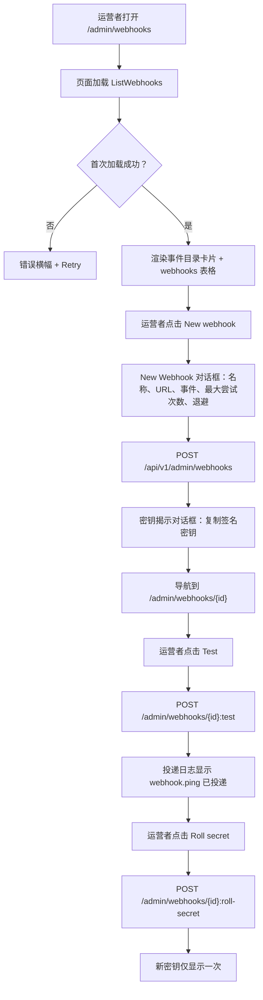
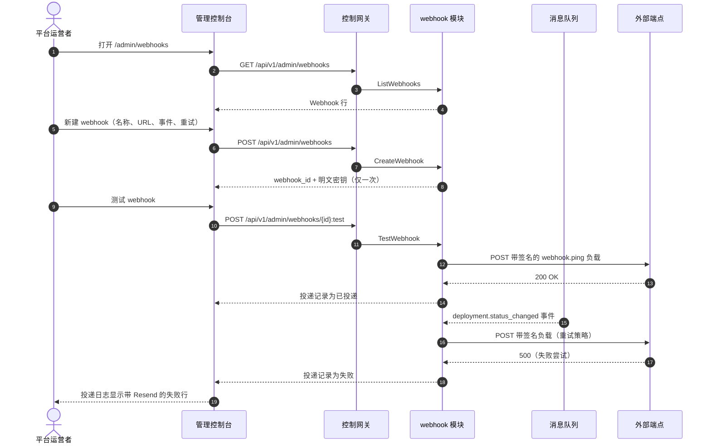

# Webhook 通知与事件订阅 — 需求分析与 UI/UX 设计

| 属性 | 内容 |
| --- | --- |
| 特性点 | Webhook 通知与事件订阅 — 配置出站 webhook 以接收平台事件（部署状态、自动扩缩、账单/发票、消费限额超限、余额不足），支持按事件类型启用、签名密钥、重试策略与投递日志（backlog 第 23 行） |
| 文档范围 | 需求分析与 UI/UX 设计：`/admin/webhooks` 管理面 webhook 管理页面（列表、创建、带投递日志的详情），`/webhooks` 终端用户面 webhook 管理页面，页面 → API 面映射表，以及编号验收标准 |
| 归属模块 | `webhook`（新增 — 拥有 webhook 端点 CRUD、事件订阅、签名、重试与投递日志；订阅消息队列以获取事件目录），`web` 管理控制台（`WebhooksPage`、`WebhookDetailPage`）与终端用户控制台（`UserWebhooksPage`、`UserWebhookDetailPage`），`pkg/server` 网关（管理前缀与用户前缀绑定） |
| 相关文档 | [架构设计](./architecture.zh-cn.md) — 第 1.2 节消息队列、第 2 节模块职责 · [控制台面分离](./console-surface-separation.zh-cn.md) — 本特性横跨的两个面、`UserShell`/`AdminShell` 约定、掩码投影规则 · [推理自动扩缩](./inference-autoscaling.zh-cn.md) — 本特性订阅的自动扩缩事件 · [支付、发票与自动充值](./payments-invoices-auto-recharge.zh-cn.md) — 账单/发票事件 · [余额与配额](./balance-quota.zh-cn.md) — 余额不足与消费限额事件 · [审计日志](./audit-logging.zh-cn.md) — webhook 变更必须产生的审计轨迹 |
| 状态 | 设计完成，已移交架构师代理 |

---

## 1. 背景与竞品调研

go-taas 是一个 Token-as-a-Service 平台：它部署推理服务（特性 #2）、自动扩缩（特性 #16）、计量与计费（特性 #4、#5、#8、#14），并执行消费限额（特性 #11）。今天所有这些状态都是**仅拉取**的：运营者或租户必须打开控制台并轮询，才能得知部署失败、服务扩缩、发票开出、消费限额超限或余额不足。外部系统 — 像 Slack 或 PagerDuty 这样的运维工具、租户自己的计费集成或 CI 流水线 — 没有任何办法在事件发生时被**推送**它所关心的事件。

本特性新增**出站 webhook**：运营者或租户注册一个 HTTPS 端点，将其订阅到平台事件目录的一个子集，平台在订阅事件发生时向该端点投递一个带签名的 JSON 负载。每个 webhook 携带按事件类型启用、用于真实性的签名密钥、用于韧性的重试策略，以及用于可观测性与手动重发的投递日志。这是 Phase 4 事件集成路线图项中最小可独立交付的增量：它把「平台改变了状态」变成「平台告诉了我的系统」。

### 1.1 竞品的 webhook / 事件订阅管理呈现

| 产品 | Webhook 面 | 签名 | 重试 | 投递日志 | 主要陷阱 |
| --- | --- | --- | --- | --- | --- |
| **Stripe** | Dashboard「Webhooks」标签 + API；注册端点 URL、选择事件类型、获得 `whsec_` 签名密钥 | `Stripe-Signature` 头中的 HMAC-SHA256 签名，带时间戳；每端点密钥；支持带延迟过期的密钥轮换 | 生产模式指数退避最长 3 天；手动重发最长 15 天 | 「Event deliveries」标签：Delivered / Pending / Failed、HTTP 状态码、下次重试时间 | 复杂的事件版本化；3 天重试窗口过长；IP 白名单增加运维负担 |
| **GitHub** | 仓库/组织 webhook；订阅事件类型、可选密钥、带重发与「ping」测试事件的投递历史 | 可选 HMAC-SHA256 密钥；`X-Hub-Signature-256` 头中的签名 | 带退避的自动重试；从投递历史手动重发 | 每个 webhook 的「Recent deliveries」：状态、响应码、时长、负载 | 密钥可选（弱默认）；某些流程创建后无法按事件类型启用 |
| **OpenAI Platform** | 平台事件没有通用出站 webhook 面；只有按请求流式与有限的助手事件工具 | 不适用 | 不适用 | 不适用 | 无可比较的事件订阅模型 |
| **Anthropic Console** | 平台事件没有通用出站 webhook 面 | 不适用 | 不适用 | 不适用 | 无可比较的事件订阅模型 |
| **Together AI / SiliconFlow** | 控制台中的端点级指标与告警；出站 webhook 投递有限或没有 | 不适用 | 不适用 | 不适用 | 被动告警，非通用事件订阅面 |

### 1.2 提炼出的模式与决策

值得采纳的模式：(1) **端点 + 事件类型订阅** — Stripe 与 GitHub 都把 webhook 配置简化为「一个 URL 加上你关心的事件」，这是最小有用的模型；(2) **按事件类型启用** — Stripe 的 `enabled_events` 与 GitHub 的事件选择让消费者窄订阅，这既是带宽也是安全上的胜利；(3) **带每端点密钥的 HMAC-SHA256 签名** — Stripe 的 `whsec_` 与 GitHub 的 `X-Hub-Signature-256` 是行业标准的真实性机制；(4) **重试策略** — Stripe 与 GitHub 都用退避重试失败的投递，使瞬时端点故障不会丢失事件；(5) **带手动重发的投递日志** — Stripe 的「Event deliveries」标签与 GitHub 的「Recent deliveries」是标准的调试面；(6) **测试/ping 事件** — GitHub 的 ping 与 Stripe 的 `stripe trigger` 让消费者在真实事件流动前验证端点。

需要避免的陷阱：让签名密钥可选（GitHub）— go-taas 要求每个端点都有密钥；3 天重试窗口（Stripe）— go-taas 使用有界、可配置的重试策略；复杂的事件版本化（Stripe）— go-taas 提供固定的 v1 事件模式；IP 白名单（Stripe）— v1 不在范围内；以及隐藏 HTTP 状态码的投递日志（某些工具）— 日志必须显示状态、尝试次数与时间戳。

**go-taas 的决策**：

| # | 决策 | 依据 |
| --- | --- | --- |
| D1 | **webhook 管理存在于两个面，事件目录清晰拆分。** 管理面（`/admin/webhooks`、`/api/v1/admin/webhooks/*`）订阅**平台编排事件** — `deployment.status_changed`、`autoscaling.scaled`、`autoscaling.scale_to_zero`。终端用户面（`/webhooks`、`/api/v1/webhooks/*`）订阅**租户账户事件** — `billing.invoice_created`、`billing.invoice_paid`、`billing.spend_limit_breached`、`billing.balance_low` | 部署与自动扩缩是运营者编排状态（特性 #16、#2）；账单、消费限额与余额是租户账户状态（特性 #14、#11、#8）。按面拆分目录遵循特性 #17 的掩码投影规则：租户绝不能看到运营者编排内部信息，运营者针对部署事件的 webhook 也是运营者作用域。两个面共享相同的页面结构与交互模型 |
| D2 | **一个 webhook = 端点 URL + 一组启用的事件类型 + 签名密钥 + 重试策略。** URL 必填且必须是合法的 `https://`（本地测试可用 `http://`）URL；事件类型是面目录的非空子集；签名密钥按端点自动生成并在创建时仅显示一次；重试策略为 `max_attempts`（1–10，默认 5）与 `backoff_seconds`（1–3600，默认 60） | 以最小字段列表镜像 Stripe/GitHub 模型（D1 的模式 1–4）。必填密钥与有界重试策略避免了 GitHub 弱默认与 Stripe 长窗口的陷阱 |
| D3 | **每次投递都用 HMAC-SHA256 签名**，使用端点密钥，对原始 JSON 正文签名，时间戳与签名放在 `X-Go-Taas-Signature` 头中（`t=<ts>,v1=<sig>`）。密钥仅以哈希存储；明文在创建时与显式揭示时各显示一次 | 对原始正文带时间戳的 HMAC-SHA256 是 Stripe/GitHub 标准，可防止篡改与重放（Stripe 的手动验证模式）。仅存哈希意味着明文无法从存储恢复，与 API Key 模式（特性 #1）一致 |
| D4 | **webhook 可启用或禁用（暂停）。** 禁用的 webhook 停止接收投递，但保留其配置、密钥与投递日志；重新启用后恢复投递。删除 webhook 会移除它及其投递日志 | 暂停是停止行为异常端点而不丢失配置的低风险方式；与 Stripe 的禁用/重新启用行为一致 |
| D5 | **webhook 有测试/ping 操作**，向端点发送合成 `webhook.ping` 事件并将其记录到投递日志 | GitHub 的 ping 与 Stripe 的 trigger 是在真实事件流动前验证端点的标准方式（D1 的模式 6） |
| D6 | **投递日志列出每次投递**，含事件类型、状态（`delivered` / `failed` / `pending`）、HTTP 状态码、尝试次数与时间戳。失败的投递可**手动重发**；日志保留 90 天 | 投递日志是调试面（D1 的模式 5）；手动重发无需等待重试策略即可恢复丢失事件；90 天保留与请求日志保留（特性 #12）一致 |
| D7 | **签名密钥可随时轮换**（重新生成）；旧密钥立即失效，新密钥仅显示一次 | 密钥轮换是 Stripe 针对疑似泄露的最佳实践；立即失效是 v1 最简单安全的默认 |
| D8 | **`webhook` 模块拥有本特性。** 它暴露 CRUD/查询 RPC、订阅消息队列以获取事件目录、签名并投递负载、应用重试策略、记录投递日志。它是统一 gRPC 服务器中的新模块（架构第 1.2 节） | webhook 消费来自 `infer`、`billing` 与 `metering` 的事件；专用模块把投递关注点从产生模块中分离出来并给它一个归属，镜像 `metering` 拥有结算的方式 |
| D9 | **webhook 块（10601–10699）新增错误码**：**10601 `CodeWebhookNotFound`**、**10602 `CodeWebhookConfigInvalid`**、**10603 `CodeWebhookStateInvalid`**、**10604 `CodeWebhookDeliveryNotFound`**、**10605 `CodeWebhookEventTypeInvalid`** | webhook 是新模块（D8），因此其错误码放在计费块（105xx）之后的全新块中；不同错误码让「未找到」vs「配置错误」vs「状态错误」vs「投递未找到」vs「事件类型错误」可操作 |
| D10 | **webhook 变更被审计**（特性 #15）：创建、更新、启用/禁用、删除、轮换密钥、测试与重发各写一条审计事件 | webhook 端点是安全敏感面（它们可触发外部动作）；审计轨迹必须记录谁改了什么，与审计日志特性的变更覆盖一致 |

## 2. 目标与非目标

**目标**：一个管理面页面 `/admin/webhooks`，用于列出、创建、编辑、启用/禁用、删除、测试并轮换订阅平台编排事件的 webhook 的密钥，外加详情页 `/admin/webhooks/:webhookId` 展示投递日志与手动重发（D1、D2、D4、D5、D6、D7）；一个终端用户面页面 `/webhooks`，针对租户账户事件采用相同结构，外加 `/webhooks/:webhookId`（D1）；页面 → API 面映射表，含精确前缀（D1）；每页交互状态，包括空、错误与权限拒绝；可在 Nightwatch 中针对 compose 栈测试的编号验收标准。

**非目标**：webhook 事件版本化（v1 提供固定事件模式，D1 的陷阱）；投递来源的 IP 白名单（Stripe 的模式，不在范围内）；3 天重试窗口（v1 使用有界可配置策略，D2）；投递到非 HTTP 接收端（EventBridge/Event Grid — 未来）；超出手动重发的 webhook 事件重放 API（未来）；租户可见运营者编排事件与运营者可见租户账户事件（D1）；通知中心（特性 #26 在控制台内消费这些事件 — 此处不在范围内）。

## 3. 角色与旅程

| 角色 | 面 | 旅程 |
| --- | --- | --- |
| **平台运营者** | admin | 打开 `/admin/webhooks` → 为 `deployment.status_changed` 与 `autoscaling.scaled` 创建指向运维 Slack webhook 的 webhook → 揭示签名密钥 → 发送测试 ping → 在投递日志中看到 `delivered` 行 → 稍后看到 `failed` 投递、重发并调查端点 |
| **平台运营者（可靠性）** | admin | 部署失败 → webhook 触发 `deployment.status_changed` → 运维工具呼叫值班工程师 → 工程师打开 `/admin/webhooks/:id` 确认投递及其负载 |
| **租户开发者 / 智能体** | end-user | 打开 `/webhooks` → 为 `billing.invoice_created` 与 `billing.balance_low` 创建指向自己计费服务的 webhook → 用测试 ping 验证 → 他们的系统自动对账发票并充值余额 |
| **租户财务管理员** | end-user | 消费限额超限 → webhook 触发 `billing.spend_limit_breached` → 他们的财务系统被通知 → 他们提高限额或暂停密钥（特性 #11） |

> 术语：消费侧调用方在英文中为 **Agent**，中文为「智能体」，与仓库约定一致。

## 4. 功能需求

### FR1 — Webhook 端点 CRUD（两个面）

- **FR1.1** `CreateWebhook`（`POST /api/v1/admin/webhooks` 与 `POST /api/v1/webhooks`）接收 `name`、`url`、`enabled_event_types`（面目录的非空子集）、`max_attempts`（1–10，默认 5）与 `backoff_seconds`（1–3600，默认 60）。它同步校验、生成签名密钥，并返回带**仅显示一次明文密钥**的 webhook（D2、D3）。
- **FR1.2** `ListWebhooks`（`GET /api/v1/admin/webhooks` 与 `GET /api/v1/webhooks`）返回该面的 webhook，可按名称搜索、按 `enabled` 状态过滤、分页（`offset`/`limit`，默认 20，最大 100）。每行携带 `webhook_id`、`name`、`url`、`enabled`、`enabled_event_types`、`created_at` 与投递摘要（总数 / 已投递 / 失败）。
- **FR1.3** `GetWebhook`（`GET /api/v1/admin/webhooks/{webhook_id}` 与 `GET /api/v1/webhooks/{webhook_id}`）返回完整配置，含重试策略与启用的事件类型。缺失 id 返回 **10601 `CodeWebhookNotFound`**。
- **FR1.4** `UpdateWebhook`（`PATCH /api/v1/admin/webhooks/{webhook_id}` 与 `PATCH /api/v1/webhooks/{webhook_id}`）更新 `name`、`url`、`enabled_event_types`、`max_attempts` 与 `backoff_seconds`。无效配置返回 **10602 `CodeWebhookConfigInvalid`**；未知事件类型返回 **10605 `CodeWebhookEventTypeInvalid`**。
- **FR1.5** `DeleteWebhook`（`DELETE /api/v1/admin/webhooks/{webhook_id}` 与 `DELETE /api/v1/webhooks/{webhook_id}`）删除 webhook 及其投递日志。缺失 id 返回 **10601**。

### FR2 — 启用/禁用与密钥轮换

- **FR2.1** `SetWebhookEnabled`（`POST /api/v1/admin/webhooks/{webhook_id}:set-enabled` 与 `POST /api/v1/webhooks/{webhook_id}:set-enabled`）启用或禁用（暂停）webhook（D4）。禁用的 webhook 停止接收投递，但保留其配置、密钥与投递日志。
- **FR2.2** `RollWebhookSecret`（`POST /api/v1/admin/webhooks/{webhook_id}:roll-secret` 与 `POST /api/v1/webhooks/{webhook_id}:roll-secret`）重新生成签名密钥、立即使旧密钥失效，并仅返回一次新明文密钥（D7）。

### FR3 — 测试与投递日志

- **FR3.1** `TestWebhook`（`POST /api/v1/admin/webhooks/{webhook_id}:test` 与 `POST /api/v1/webhooks/{webhook_id}:test`）向端点发送合成 `webhook.ping` 事件并将其记录到投递日志（D5）。禁用的 webhook 返回 **10603 `CodeWebhookStateInvalid`**（先启用）。
- **FR3.2** `ListWebhookDeliveries`（`GET /api/v1/admin/webhooks/{webhook_id}/deliveries` 与 `GET /api/v1/webhooks/{webhook_id}/deliveries`）返回投递日志，可按 `status` 与 `event_type` 过滤、分页。每行携带 `delivery_id`、`event_type`、`status`（`delivered` / `failed` / `pending`）、`http_status_code`、`attempt_count`、`created_at` 与 `last_attempt_at`。缺失 webhook 返回 **10601**。
- **FR3.3** `ResendWebhookDelivery`（`POST /api/v1/admin/webhooks/{webhook_id}/deliveries/{delivery_id}:resend` 与 `POST /api/v1/webhooks/{webhook_id}/deliveries/{delivery_id}:resend`）手动重发 `failed`（或 `delivered`）投递（D6）。缺失投递返回 **10604 `CodeWebhookDeliveryNotFound`**；重发 `pending` 投递返回 **10603**。

### FR4 — 事件目录与投递

- **FR4.1** **管理面**事件目录恰好为：`deployment.status_changed`、`autoscaling.scaled`、`autoscaling.scale_to_zero`（D1）。**终端用户面**事件目录恰好为：`billing.invoice_created`、`billing.invoice_paid`、`billing.spend_limit_breached`、`billing.balance_low`（D1）。
- **FR4.2** 当订阅事件发生时，`webhook` 模块向端点投递带签名的 JSON 负载（D3）：`{"id": <event_id>, "type": <event_type>, "created_at": <ts>, "data": {…}}`。负载用 HMAC-SHA256 对原始正文签名；签名与时间戳放在 `X-Go-Taas-Signature` 头中。
- **FR4.3** 投递遵循重试策略（D2）：最多 `max_attempts` 次尝试，之间间隔 `backoff_seconds`；非 `2xx` 响应或网络错误为失败尝试。最后一次尝试后投递为 `failed` 并保留在日志中供手动重发（D6）。

### FR5 — 面与 API 绑定

- **FR5.1** 管理面 webhook 页面位于**管理面**：路由 `/admin/webhooks` 与 `/admin/webhooks/:webhookId`，API 前缀 `/api/v1/admin/webhooks/*`。它们加入 `AdminShell` 导航（特性 #17），名为「Webhooks」。
- **FR5.2** 终端用户面 webhook 页面位于**终端用户面**：路由 `/webhooks` 与 `/webhooks/:webhookId`，API 前缀 `/api/v1/webhooks/*`。它们加入 `UserShell` 导航（特性 #17），名为「Webhooks」。
- **FR5.3** 管理面页面只调用 `/api/v1/admin/webhooks/*` 路由；终端用户面页面只调用 `/api/v1/webhooks/*` 路由。两者都不包含对方面的前缀字符串（特性 #17，D8）。
- **FR5.4** 管理面事件目录绝不在终端用户面暴露，反之亦然（D1）：终端用户创建对话框只列出四个租户事件，管理面对话框只列出三个运营者事件。

## 5. UI 设计

### 5.1 页面：`/admin/webhooks` — Webhooks（管理面）

**目的**：给平台运营者一个单一面来管理订阅平台编排事件（部署状态、自动扩缩）的 webhook。

**面**：admin — 路由 `/admin/webhooks`，API `/api/v1/admin/webhooks/*`。

**布局**：在 `AdminShell`（特性 #17）内渲染。页面头部（「Webhooks」，副标题「将平台事件投递到你的端点」）带 **New webhook** 操作（主）与 **Refresh** 操作（次）。头部下方：

1. **事件目录** — 只读卡片，列出三个管理面事件类型（`deployment.status_changed`、`autoscaling.scaled`、`autoscaling.scale_to_zero`），各带一行描述，让运营者知道可以订阅什么。
2. **Webhooks 表格** — 该面的 webhook，列：**Name**（链接）、**URL**、**Events**（启用事件类型数量）、**Status**（徽章：启用绿 / 禁用灰）、**Deliveries**（已投递 / 失败摘要）、**Created**（相对时间），以及行操作（**View**、**Edit**、**Enable/Disable**、**Delete**）。

**交互状态**：

| 状态 | 行为 |
| --- | --- |
| 默认 | 事件目录卡片 + webhooks 表格在首次成功加载后渲染；last-updated 显示加载时间 |
| 加载中 | 表格骨架行；Refresh 禁用 |
| 空 | 「No webhooks yet — create one to receive platform events.」带 **New webhook** 操作；事件目录卡片保持可见 |
| 错误 | 带消息与 Retry 按钮的错误横幅；表格保留最后的好数据并显示「Showing stale data」横幅 |
| 禁用 | 加载进行中 Refresh 禁用；删除进行中 **Delete** 禁用；切换进行中 **Enable/Disable** 禁用 |
| 权限拒绝 | 无所需角色的会话收到 10036，页面显示标准权限拒绝状态（特性 #17），带返回管理首页的链接 |

**Webhooks 表格列**：Name（链接）、URL、Events（数量）、Status（徽章）、Deliveries（已投递 / 失败）、Created（相对时间）。可按 Name、Created 与 Deliveries 排序。可按 Status（全部 / 启用 / 禁用）过滤并按名称搜索；分页。

### 5.2 对话框：New Webhook（管理面）

**目的**：注册 webhook 端点并将其订阅到管理面事件目录的子集。

**布局**：模态框，含配置字段（D2）：**Name**（文本，必填）、**Endpoint URL**（URL，必填）、**Events**（三个管理面事件类型的复选框组，至少一个必填）、**Max attempts**（数字，默认 5）、**Backoff (seconds)**（数字，默认 60），以及 **Cancel** / **Create webhook** 操作。

**校验**：

| 字段 | 必填 | 规则 | 错误文案 |
| --- | --- | --- | --- |
| Name | 是 | 非空，≤ 64 字符 | 「Enter a webhook name.」/「Name must be ≤ 64 characters.」 |
| Endpoint URL | 是 | 合法 `https://` 或 `http://` URL，≤ 2048 字符 | 「Enter a valid endpoint URL.」/「URL must be ≤ 2048 characters.」 |
| Events | 是 | 三个管理面事件类型中至少一个 | 「Select at least one event type.」 |
| Max attempts | 是 | 整数 1–10 | 「Max attempts must be between 1 and 10.」 |
| Backoff (seconds) | 是 | 整数 1–3600 | 「Backoff must be between 1 and 3600 seconds.」 |

提交 → `CreateWebhook`；成功显示**密钥揭示对话框**（「Your signing secret — shown once」），含明文密钥、**Copy** 操作与 **Done** 操作。错误（10602 配置无效 / 10605 事件类型无效）在对话框内联显示。

### 5.3 页面：`/admin/webhooks/:webhookId` — Webhook 详情（管理面）

**目的**：展示一个 webhook — 其配置、签名密钥（揭示/轮换）与带手动重发的投递日志 — 让运营者管理并调试单个端点。

**面**：admin — 路由 `/admin/webhooks/:webhookId`，API `/api/v1/admin/webhooks/{webhook_id}`。

**布局**：`AdminShell` 下的详情页，带返回列表的返回链接。头部含 webhook 名称、端点 URL 与状态徽章。下方：

1. **配置** — 只读卡片：名称、URL、启用的事件类型（chips）、最大尝试次数、退避、创建时间。操作：**Edit**、**Enable/Disable**、**Roll secret**、**Test**、**Delete**。
2. **签名密钥** — 显示掩码密钥（`whsec_••••••••`）的卡片，带 **Reveal** 与 **Roll secret** 操作。Reveal 显示一次明文并带 **Copy** 操作；roll 显示一次新明文。
3. **投递日志** — 投递表格：**Event type**、**Status**（徽章：delivered 绿 / failed 红 / pending 灰）、**HTTP status**、**Attempts**、**Created**（相对时间），以及行操作（failed/delivered 行的 **Resend**）。

**交互状态**：

| 状态 | 行为 |
| --- | --- |
| 默认 | 配置 + 签名密钥 + 投递日志区块在首次成功加载后渲染 |
| 加载中 | 骨架卡片与表格 |
| 错误 | 带消息与 Retry 按钮的错误横幅；页面保留最后的好数据并显示「Showing stale data」横幅 |
| 禁用 | 重发进行中 **Resend** 禁用；轮换进行中 **Roll secret** 禁用；测试进行中 **Test** 禁用；删除进行中 **Delete** 禁用 |
| 权限拒绝 | 无所需角色的会话收到 10036，页面显示标准权限拒绝状态（特性 #17） |
| 未找到 | 未知 `webhook_id` 返回 10601，页面显示标准未找到状态，带返回列表的链接 |

**投递日志表格列**：Event type、Status（徽章）、HTTP status、Attempts、Created（相对时间）。可按 Created 排序。可按 Status（全部 / delivered / failed / pending）与 Event type 过滤；分页。

### 5.4 页面：`/webhooks` — Webhooks（终端用户面）

**目的**：给租户开发者 / 智能体一个面来管理订阅其租户账户事件（账单、消费限额、余额）的 webhook。

**面**：end-user — 路由 `/webhooks`，API `/api/v1/webhooks/*`。

**布局**：在 `UserShell`（特性 #17）内渲染。页面头部（「Webhooks」，副标题「将你的账户事件投递到你的端点」）带 **New webhook** 操作（主）与 **Refresh** 操作（次）。头部下方：

1. **事件目录** — 只读卡片，列出四个终端用户面事件类型（`billing.invoice_created`、`billing.invoice_paid`、`billing.spend_limit_breached`、`billing.balance_low`），各带一行描述。
2. **Webhooks 表格** — 租户的 webhook，列与管理面表格相同（Name、URL、Events、Status、Deliveries、Created），行操作相同。

**交互状态**：与第 5.1 节相同，空文案为「No webhooks yet — create one to receive your account events.」，权限拒绝文案为租户自身错误（10005 组织消失 / 10017 组织禁用，来自特性 #17 第 8.2 节；10027/10038 按 FR4.3 重定向）。

### 5.5 页面：`/webhooks/:webhookId` — Webhook 详情（终端用户面）

**目的**：展示一个租户 webhook — 配置、签名密钥与投递日志 — 让租户管理并调试单个端点。

**面**：end-user — 路由 `/webhooks/:webhookId`，API `/api/v1/webhooks/{webhook_id}`。

**布局**：与第 5.3 节结构相同，在 `UserShell` 下，使用终端用户面事件目录与租户的权限拒绝文案。投递日志只显示租户自己的投递。

### 5.6 流程

## 6. API 面影响

所有 webhook RPC 都属于 **`webhook` 模块**（D8），通过控制网关以 HTTP 提供。管理面路由在**管理前缀** `/api/v1/admin/webhooks/*`（D1）；终端用户面路由在**用户前缀** `/api/v1/webhooks/*`（D1）。

| RPC | 路由 | 前缀 | 状态 | 目的 |
| --- | --- | --- | --- | --- |
| `CreateWebhook` | `POST /api/v1/admin/webhooks` · `POST /api/v1/webhooks` | admin · user | **新增** | 注册端点 + 事件订阅；返回 `webhook_id` + 明文密钥（仅一次） |
| `ListWebhooks` | `GET /api/v1/admin/webhooks` · `GET /api/v1/webhooks` | admin · user | **新增** | 带名称搜索、启用过滤、分页与投递摘要的列表 |
| `GetWebhook` | `GET /api/v1/admin/webhooks/{webhook_id}` · `GET /api/v1/webhooks/{webhook_id}` | admin · user | **新增** | 完整配置；缺失 → 10601 |
| `UpdateWebhook` | `PATCH /api/v1/admin/webhooks/{webhook_id}` · `PATCH /api/v1/webhooks/{webhook_id}` | admin · user | **新增** | 更新名称/URL/事件/重试；配置错误 → 10602，事件错误 → 10605 |
| `DeleteWebhook` | `DELETE /api/v1/admin/webhooks/{webhook_id}` · `DELETE /api/v1/webhooks/{webhook_id}` | admin · user | **新增** | 删除 webhook + 投递日志；缺失 → 10601 |
| `SetWebhookEnabled` | `POST /api/v1/admin/webhooks/{webhook_id}:set-enabled` · `POST /api/v1/webhooks/{webhook_id}:set-enabled` | admin · user | **新增** | 启用/禁用（暂停）webhook |
| `RollWebhookSecret` | `POST /api/v1/admin/webhooks/{webhook_id}:roll-secret` · `POST /api/v1/webhooks/{webhook_id}:roll-secret` | admin · user | **新增** | 重新生成签名密钥；返回新明文（仅一次） |
| `TestWebhook` | `POST /api/v1/admin/webhooks/{webhook_id}:test` · `POST /api/v1/webhooks/{webhook_id}:test` | admin · user | **新增** | 发送 `webhook.ping`；禁用 → 10603 |
| `ListWebhookDeliveries` | `GET /api/v1/admin/webhooks/{webhook_id}/deliveries` · `GET /api/v1/webhooks/{webhook_id}/deliveries` | admin · user | **新增** | 带状态/事件过滤与分页的投递日志 |
| `ResendWebhookDelivery` | `POST /api/v1/admin/webhooks/{webhook_id}/deliveries/{delivery_id}:resend` · `POST /api/v1/webhooks/{webhook_id}/deliveries/{delivery_id}:resend` | admin · user | **新增** | 重发失败/已投递投递；缺失 → 10604，pending → 10603 |

**给架构师代理的契约说明**：

1. `CreateWebhook` 校验 `name`（非空，≤ 64 字符）、`url`（合法 `https://` 或 `http://`，≤ 2048 字符）、`enabled_event_types`（面目录的非空子集，否则 10605）、`max_attempts`（1–10）与 `backoff_seconds`（1–3600）；无效配置返回 10602。它生成签名密钥、仅存储其哈希（D3），并仅返回一次明文密钥。
2. `Webhook` 携带 `webhook_id`、`name`、`url`、`enabled`（布尔）、`enabled_event_types`（列表）、`max_attempts`、`backoff_seconds`、`created_at` 与投递摘要（`total_deliveries`、`delivered_count`、`failed_count`）。明文密钥仅由 `CreateWebhook` 与 `RollWebhookSecret` 返回。
3. `ListWebhookDeliveries` 返回 `delivery_id`、`event_type`、`status`（封闭枚举：`delivered`、`failed`、`pending`）、`http_status_code`、`attempt_count`、`created_at`、`last_attempt_at`。`failed` 投递携带 `failure_reason`。
4. 投递（FR4.2）：负载为 `{"id", "type", "created_at", "data"}`；签名是对原始 JSON 正文用端点密钥做 HMAC-SHA256，放在 `X-Go-Taas-Signature` 头中，格式 `t=<ts>,v1=<sig>`。重试策略最多 `max_attempts` 次，之间间隔 `backoff_seconds`；非 `2xx` 响应或网络错误为失败尝试（FR4.3）。
5. `webhook` 模块订阅消息队列以获取事件目录（D8）：来自 `infer` 的管理面事件（部署状态、自动扩缩），来自 `billing` 的终端用户面事件（发票、消费限额、余额不足）。该模块是统一服务器中的新 gRPC 服务（架构第 1.2 节）。
6. webhook 变更被审计（D10，特性 #15）：创建、更新、启用/禁用、删除、轮换密钥、测试与重发各写一条审计事件。
7. 线上约定不变：列表用点分页，成功返回 HTTP 200，业务错误为 `{"code": <int>, "message": "..."}`。

错误码（webhook 块 10601–10699，`pkg/errors/codes.go`）：

| 条件 | 代码 | 常量 | 说明 |
| --- | --- | --- | --- |
| 未知 `webhook_id` | 10601 | `CodeWebhookNotFound` | **新增**（D9） |
| 无效 webhook 配置（名称/URL/重试错误） | 10602 | `CodeWebhookConfigInvalid` | **新增**（D9） |
| 无效状态转换（对禁用/pending webhook 测试或重发） | 10603 | `CodeWebhookStateInvalid` | **新增**（D9） |
| 未知 `delivery_id` | 10604 | `CodeWebhookDeliveryNotFound` | **新增**（D9） |
| 事件类型不在面的目录中 | 10605 | `CodeWebhookEventTypeInvalid` | **新增**（D9） |
| 数据库 / MQ 基础设施故障 | 500 | `CodeInternal` | 经错误归一化 |

## 7. 验收标准

| # | 标准 | 级别 |
| --- | --- | --- |
| AC1 | `CreateWebhook` 用有效配置返回 `webhook_id` 与仅显示一次的明文签名密钥；后续任何 `GetWebhook` 都不返回该密钥 | FVT |
| AC2 | `CreateWebhook` 用无效 URL/名称/重试返回 10602；用面目录之外的事件类型返回 10605 | FVT |
| AC3 | `ListWebhooks` 返回该面的 webhook，带名称搜索、启用过滤、分页与投递摘要 | FVT |
| AC4 | `UpdateWebhook` 更新名称/URL/事件/重试；`SetWebhookEnabled` 暂停并恢复投递；`DeleteWebhook` 删除 webhook 及其投递日志 | FVT |
| AC5 | `RollWebhookSecret` 重新生成密钥、使旧密钥失效，并仅返回一次新明文 | FVT |
| AC6 | `TestWebhook` 发送 `webhook.ping` 并记录 `delivered` 投递；测试禁用 webhook 返回 10603 | FVT |
| AC7 | `ListWebhookDeliveries` 返回带状态/事件过滤与分页的投递日志；`ResendWebhookDelivery` 重发失败投递，未知投递返回 10604 | FVT |
| AC8 | 订阅事件（如管理面的 `deployment.status_changed`）产生带 `X-Go-Taas-Signature` 头的签名投递到端点；非 `2xx` 响应按策略重试然后标记投递为 `failed` | FVT |
| AC9 | `/admin/webhooks` 页面在首次成功加载后渲染事件目录卡片与 webhooks 表格，带 last-updated 时间戳 | E2E |
| AC10 | New Webhook 对话框按指定规则与错误文案校验每个字段；有效提交显示密钥揭示对话框并导航到详情页 | E2E |
| AC11 | webhook 详情页显示配置、带 Reveal/Roll 的掩码签名密钥与投递日志；Test 记录 `delivered` 行；失败投递显示 Resend 操作 | E2E |
| AC12 | 列表为空时渲染空状态（「No webhooks yet…」）；加载失败保留最后的好数据并显示「Showing stale data」横幅与 Retry 操作 | E2E |
| AC13 | `/webhooks` 页面渲染终端用户面事件目录（仅四个租户事件）与租户的 webhook；管理面事件目录绝不在该面显示 | E2E |
| AC14 | 管理面 webhook 页面仅在管理面可达：路由 `/admin/webhooks` 与 `/admin/webhooks/:webhookId`，每个 API 调用使用 `/api/v1/admin/webhooks/*` 前缀且不含 `/api/v1/webhooks/*` 字符串 | E2E（面分离） |
| AC15 | 终端用户面 webhook 页面仅在终端用户面可达：路由 `/webhooks` 与 `/webhooks/:webhookId`，每个 API 调用使用 `/api/v1/webhooks/*` 前缀且不含 `/api/v1/admin/*` 字符串 | E2E（面分离） |
| AC16 | 无所需角色的会话在管理面 webhook 页面收到 10036，页面显示标准权限拒绝状态 | E2E |

## 8. 不在范围内（另行跟踪）

| 项 | 位置 |
| --- | --- |
| Webhook 事件版本化 | 未来细化 — v1 提供固定事件模式 |
| 投递来源的 IP 白名单 | 未来安全细化 |
| 3 天重试窗口 | 刻意省略 — v1 使用有界可配置策略（D2） |
| 投递到非 HTTP 接收端（EventBridge / Event Grid） | 未来集成 |
| 超出手动重发的 webhook 事件重放 API | 未来细化 |
| 租户可见运营者编排事件 / 运营者可见租户账户事件 | 刻意省略（D1） |
| 控制台内通知中心 | 特性 #26 在控制台内消费这些事件 — 此处不在范围内 |